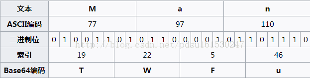

# Base家族

### Base64

Base64是网络上最常见的用于传输8Bit字节码的编码方式之一，base64就是一种基于64个可打印字符来表示二进制数据的表示方法。由于2的6次方等于64，所以每6个比特为一个单元，对应某个可打印字符。三个字节有24个比特，对应4个base64单元，即3个字节可表示4个可打印字符。它可用来作为电子邮件的传输编码。在base64中的可打印字符包括字母A-Z、a-z、数字0-9，这样共有62个字符，此外两个可打印符号在不同系统中而不同。

