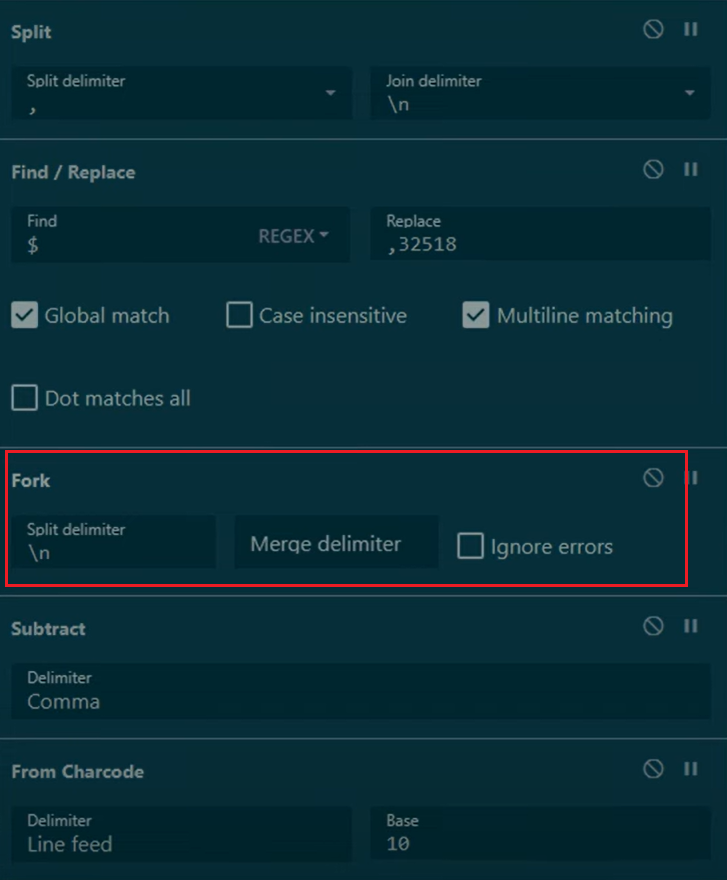
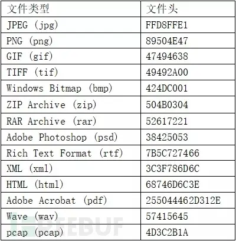
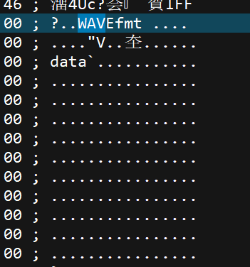
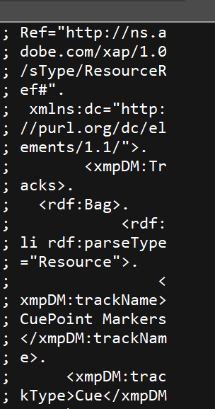
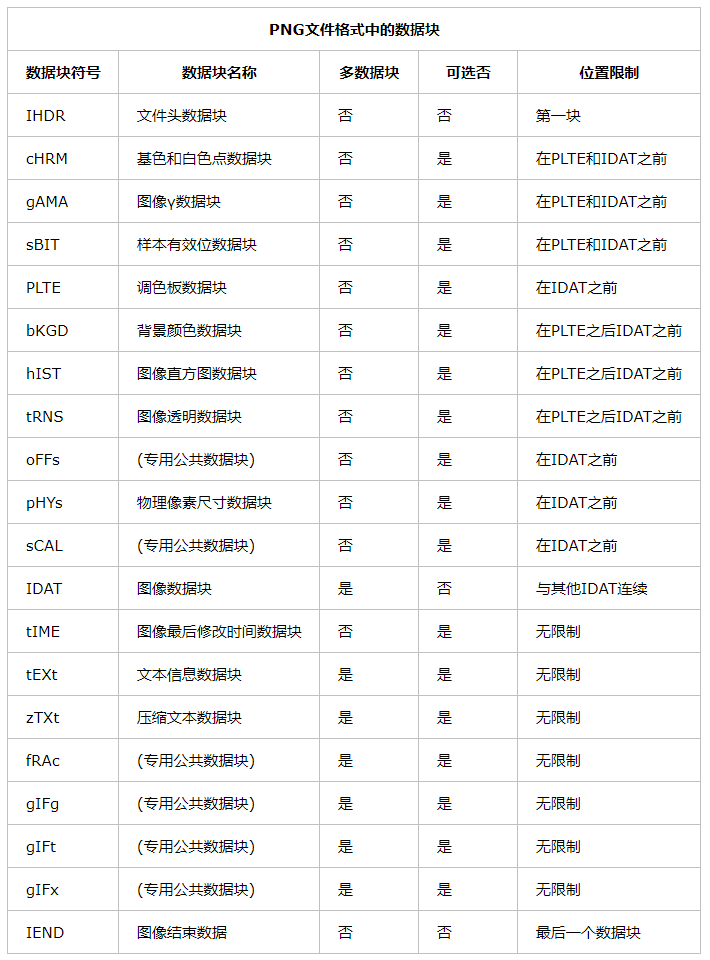
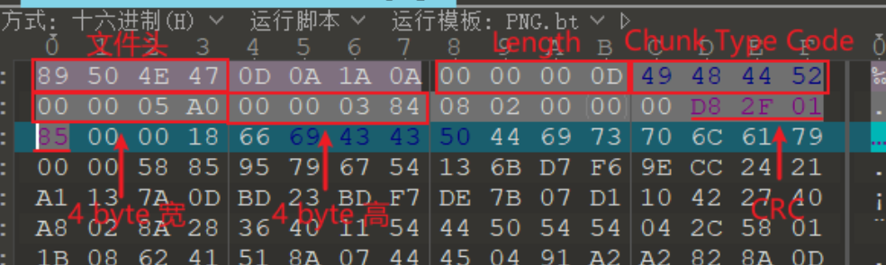
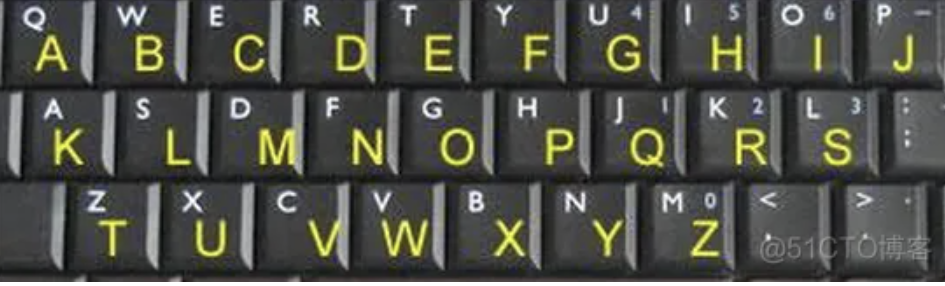
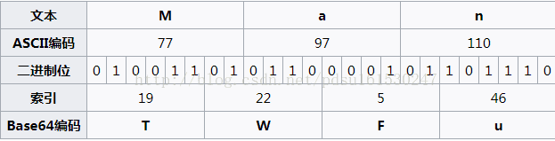

# MISC(Miscellaneous)
## 套路

#### 开局
1. 找关键字，搜索相关资料，有可能还是涉及中英文翻译等。
2. 可以找与`ctf`，`flag`，题目关键字相关的线索，可以搜索或往这方向爆破。

#### 结尾
1. 解出来的答案，一般是flag、xxxCTF开头的。然后需要使用诸如`flag{xxx}`等方式提交。
2. 有些坑的题目是需要大小写转换的。
3. 还有更坑的是需要删除部分关键字提交，如CTFXXXXXX，要删掉CTF进行提交。

冷门：[blog.csdn.net/weixin_45883223/article/details/111059544](https://blog.csdn.net/weixin_45883223/article/details/111059544)

## 密码

善用搜索，通过提示/关键词+CTF+加密 等进行搜索尝试寻找加密方式。

需要口令的，可以尝试去给的文件利用关键字查找方式，关键词：flag、ctf等

### 工具

网站：

<http://qqxiuzi.cn/daohang.htm>

<http://dcode.fr>

cyberchef

Fork可以将其按分隔符批量处理

Encode_Text US-ASCII或使用From charcode 10

convert text to its ASCII charcode: To Charcode radix 10

软件

CrypTool 专业的密码学软件，可以用于教学。免费

## 隐写术(steganography)

<https://www.bilibili.com/read/cv19020352/>

<https://blog.csdn.net/m0_75196987/article/details/130161467?spm=1001.2101.3001.6650.7&utm_medium=distribute.pc_relevant.none-task-blog-2%7Edefault%7EBlogCommendFromBaidu%7ERate-7-130161467-blog-123504708.235%5Ev38%5Epc_relevant_default_base&depth_1-utm_source=distribute.pc_relevant.none-task-blog-2%7Edefault%7EBlogCommendFromBaidu%7ERate-7-130161467-blog-123504708.235%5Ev38%5Epc_relevant_default_base&utm_relevant_index=13>

#### 数字隐写

时间刺客那道题，把答案变成数字，分为四份文件的文件修改时间。

而且float类的文件时间还需要额外操作补全数据。

最后通过

`(1[0-2][0-9]|[4-9][0-9])`

正则提取ascii码。

数字还有进制转换，大数10进制转16进制，以ASCII等编码显示。

#### 语言混淆

jsfuck等<http://www.jsfuck.com>

这个网站收集了相关语言混淆的大全，各种奇奇怪怪的语言都有：

<https://esolangs.org>

#### 文本隐写

snow隐写，在文本末尾追加由制表位以及空格隔开的组合进行的隐写。

工具在kali linux名为snowsteg

#### 文件隐写

1.ntfs流隐写：<https://blog.csdn.net/Goodric/article/details/127173751>

CTF有些题给的压缩包要用winrar，7zip等压缩包能看到文件，而且解压才会成果，用banzip是看不到的，解压也无效，这点注意。

[https://www.qingsword.com/qing/812.html\#windows-NTFS-ADS-2](https://www.qingsword.com/qing/812.html#windows-NTFS-ADS-2)

## 图片隐写

### 基础

<https://www.jianshu.com/p/e54afe270e39>

<https://tianyuk.blog.csdn.net/article/details/130607141?spm=1001.2101.3001.6650.2&utm_medium=distribute.pc_relevant.none-task-blog-2%7Edefault%7EYuanLiJiHua%7EPosition-2-130607141-blog-125996412.235%5Ev38%5Epc_relevant_sort_base1&depth_1-utm_source=distribute.pc_relevant.none-task-blog-2%7Edefault%7EYuanLiJiHua%7EPosition-2-130607141-blog-125996412.235%5Ev38%5Epc_relevant_sort_base1&utm_relevant_index=5>

### 观察

图片文件类型十六进制打开，JPG格式ASCII显示后面充满了乱码，如果发现后面存在一些有规律的信息，一般就是有添加额外的数据。

图片信息还可能藏在EXIF信息中，可以用windows文件属性，或在linux下使用exiftool查看。

比如添加了WAV音频：

## 具体格式

### PNG

PNG格式详解：

<https://www.cnblogs.com/lidabo/p/3701197.html>

文件头之后的数据块：

010工具如有png插件则会自动校验CRC与宽高的关系判断是否被更改

## 工具

UltraEdit 太拉了 远不如010Editor

### Stegsolve

真可谓神器，可以用来帧查看，切换颜色通道，处理LSB隐写等等。

File Format:文件格式

Data Extract:数据提取（常用来处理LSB隐写）

Steregram Solve:立体试图 可以左右控制偏移

Frame Browser:帧浏览器

Image Combiner:图像合并（如果题目给出多张图片，可以将两张图片进行XOR、OR、AND等操作，有时候两张图片异或运算后神奇地出现了一个二维码！）

# AWD(Attack With Defence)

[CTF中的AWD套路 - 素时听风 - 博客园 (cnblogs.com)](https://www.cnblogs.com/sstfy/p/11853919.html)
防御与攻击脚本：
[Yoshino-s/awd-cmd: cmd tools for AWD (github.com)](https://github.com/Yoshino-s/awd-cmd)

# CRYPTO

## 加密

### DES加密

初始化向量IV可以有效提升安全性，但是在实际的使用场景中，它不能像密钥KEY那样直接保存在配置文件或固定写死在代码中，一般正确的处理方式为：在加密端将IV设置为一个8位的随机值，然后和加密文本一起返给解密端即可。

区块长度：DES标准规定区块长度只有一个值，固定为64Bit，对应的字节为8位；

密钥KEY：该字段不能公开传输，用于加密和解密数据；

初始化向量IV：该字段可以公开，用于将加密随机化。同样的明文被多次加密也会产生不同的密文，避免了较慢的重新产生密钥的过程，初始化向量与密钥相比有不同的安全性需求，因此IV通常无须保密。然而在大多数情况中，不应当在使用同一密钥的情况下两次使用同一个IV，一般初始化向量IV为8位的随机值。

### PBE加密(Password Based Encryption)（常见于使用OpenSSL加密）

[https://github.com/Leon406/ToolsFx/wiki/PBE\#aes](https://github.com/Leon406/ToolsFx/wiki/PBE#aes)

#### 口令

是某个用户自己编织的便于记忆的一串单词、汉子、数字字符。

口令的特点容易被记忆，但也容易泄露或者被盗取。也容易被社会工程学、暴力破解、撞库等方式获取！

#### 密钥

是经过加密算法计算出来的。

#### 加盐了的口令

用户密码加盐意思就是将用户的口令，加之可能是随机插入的字符串（加盐算法），然后进行哈希，以防止脱裤后攻击者知晓明文密码，此时盐也需要同用户数据存在一起（随机盐就是一个用户一个盐，固定盐就是整个系统一个盐，但如果这个固定盐泄露，就可以根据这个固定盐建立彩虹表）。即使攻击者成功通过彩虹表反向哈希，拿到的字符串还是加盐过后的口令，无法知晓真正的口令。（除非拿到了加盐算法？）

密钥一般不容易记忆，不容易被破解，而且很多时候密钥是作为算法的参数出现的。算法对密钥长度也是有要求的，因为加密算法的作用就是利用密钥来扰乱明文顺序。

PBE算法在加密过程中并不是直接使用口令来加密，而是加密的密钥由口令生成，这个功能由PBE算法中的KDF函数完成。KDF函数的实现过程为：将用户输入的口令首先通过“盐”（salt）的扰乱产生准密钥，再将准密钥经过散列函数(MD5等)多次迭代后生成最终加密密钥，密钥生成后，PBE算法再选用对称加密算法对数据进行加密，可以选择AES、DES、3DES、RC5等对称加密算法

#### U2FsdGVkX1
OpenSSL的特征就是开头有U2FsdGVkX1

U2FsdGVkX1 is the base64 encoding of the ASCII string **Salted__**. It is a prefix that indicates that the encrypted data was produced by **OpenSSL** or a compatible library. It is followed by 8 bytes of **salt**, which is used to derive the encryption key and IV from the password. The actual encrypted data starts at the 17th byte.

This prefix is not insecure, as it only reveals that OpenSSL was used, which is not a secret. The salt is random and different for each encryption, so it prevents attacks based on precomputed tables¹.

To decrypt such a thing, you need to know the password and the encryption algorithm (such as AES-256-CBC). You can use OpenSSL or any library that supports the same format. You can also follow these steps:

- Base64-decode the output from OpenSSL, and UTF-8 decode the password, so that you have the underlying bytes for both of these.

- Separate the first 16 bytes of the decoded output, which consist of 8 bytes of Salted_\_ and 8 bytes of salt.

- Use a key derivation function (such as PBKDF2 or EVP_BytesToKey) to generate the encryption key and IV from the password and salt. The key size and IV size depend on the encryption algorithm.

- Use the encryption algorithm (such as AES-256-CBC) to decrypt the remaining bytes of the decoded output, using the key and IV obtained in the previous step.

- The result is the original plaintext.

### 栅栏密码（围栏密码）rail Fence

还有其他类型的栅栏，比如W栅栏

#### 加密方法

先去掉所有空格，把要加密的明文分成N个一组，然后把每组的第1个字符组合，每组第2个字符组合…每组的第N(最后一个分组可能不足N个)个字符组合，最后把他们全部连接起来就是密文

比如key是2

明文：The quick brown fox jumps over the lazy dog

去空格：Thequickbrownfoxjumpsoverthelazydog

分组：Th eq ui ck br ow nf ox ju mp so ve rt he la zy do g

第一组：Teucbonojmsvrhlzdg

第二组：hqikrwfxupoeteayo

#### 解密方法

知道key之后，比如是2，称它有“两层栅栏”，将其一分为二，并二维排列：

第一组：Teucbonojmsvrhlzdg

第二组：hqikrwfxupoeteayo

然后读法就是从上往下，从左往右读。

### 当铺密码

当铺密码就是一种将中文和数字进行转化的密码，算法相当简单:当前汉字有多少笔画出头，就是转化成数字几。例如：

王夫 井工 夫口 由中人 井中 夫夫 由中大：67 84 70 123 82 77 125

### QWE密码

## 编码

### Base64

Base64是网络上最常见的用于传输8Bit字节码的编码方式之一，base64就是一种基于64个可打印字符来表示二进制数据的表示方法。由于2的6次方等于64，所以每6个比特为一个单元，对应某个可打印字符。三个字节有24个比特，对应4个base64单元，即3个字节可表示4个可打印字符。它可用来作为电子邮件的传输编码。在base64中的可打印字符包括字母A-Z、a-z、数字0-9，这样共有62个字符，此外两个可打印符号在不同系统中而不同。

# WEB

### string转可执行代码
eval, function, setInterval, setTimeout等方法有快速通道通向编译器，可以将string转化为可执行代码

jsfuck可直接通过console执行的原理就是使用eval

然后破解的`eval=console.log`的原理就是将外包的一层`eval`给变成`console.log()`了
