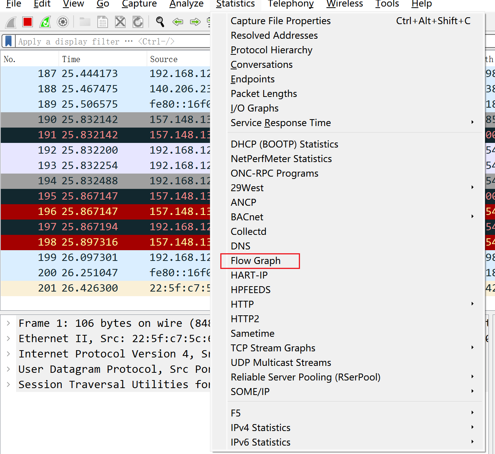

[Wireshark的学习与使用_line-based text data_Sandra的三脚猫功夫的博客-CSDN博客](https://blog.csdn.net/m0_59207381/article/details/119384265)

# 基本操作

刚进入时，需要选择网卡进行嗅探，其实可以看到正在使用哪些网络。

`ipconfig`可以看到目前使用的网络。


## 抓包模式

混杂模式(promiscuous mode)可以抓取经过网卡的所有数据包，不验证MAC地址等。不用的话就是普通模式，只接收到发送到该网卡的数据，其他非法数据包全部丢弃。


## 过滤器

将嗅探到的数据包走过过滤器。

可以用 `and` 或 `or`进行连接

`tcp.flags.ack == 0 and tcp.flags.syn == 1`，表示获取TCP请求的SYN请求（三次握手的第一次）

`tcp.flags.fin == 1` （FIN包是发完数据后发的包，可以代表往哪些地方发了数据）

`ip.src_host == 192.xxx.xxx.xxx` 筛选source是指定ip的数据包

`ip.dst_host` 筛选destination

`ip.addr == xxx.xxx.xxx.xxx` source或destination是指定ip的数据包


```sh
# 可以提取想要的数据
tshark -r challenge.pcapng -Y "http" -T fields -e "http.request.uri.query.parameter" > 2.txt

# 其中-Y 填的就是过滤器语法
# -T 是要提取的类型 -e 是具体字段
```

在分组详情中选中想要的字段，获取过滤器语法：


### 自定义列


## ARP (Address Resolution Protocol)

通过IP地址获取物理地址的一个TCP/IP协议。

我们上网其实是通过MAC地址来连接另一个物理机。

因此如果发送ARP请求，被人截取而送来一个假的MAC地址，则通过IP连的可能是连到了别的物理机上去。

ARP请求是广播的，因此可以靠速度取胜。


如图，是网关广播发送了ARP请求，被当前机捕获到了，如果当前机恰好IP地址是ARP的询问地址，那么就会发送响应包：


网关就会缓存该IP对应的MAC地址，后续来的请求直接走向当前机。

## 数据提取

### 字节流
提取字节流 选中HTTP包，File->Export Packet bytes，或直接使用快捷键`CTRL+SHIFT+X`

### 批量浏览包含的文件


# 其他功能

## 统计

### 协议分组分析


### I/O图表

可以直观查看当前HTTP流量，可以判断是否存在暴力破解的流量。

### 流量图



当前列表数据绘制流量图，可视化往复请求。

## 追踪HTTP流（请求响应）

获得该次HTTP的请求响应信息


