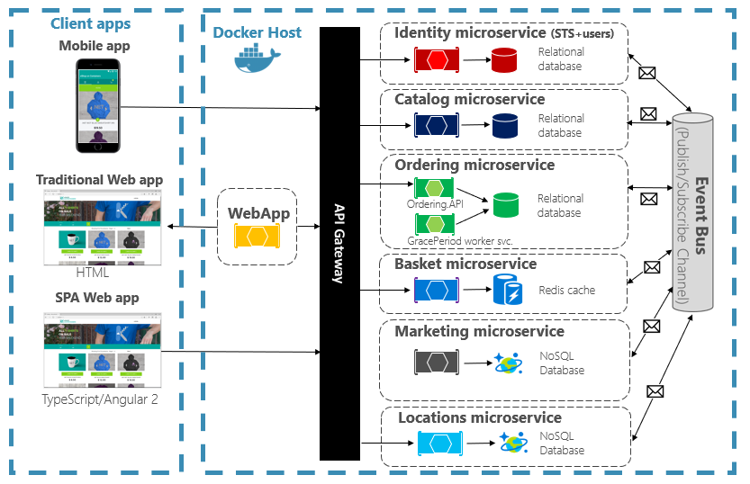
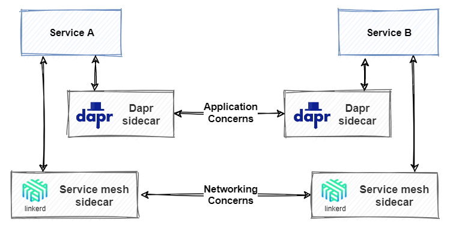
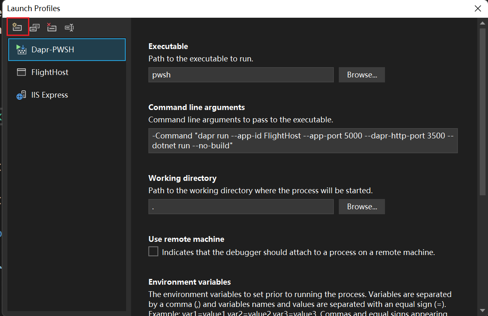
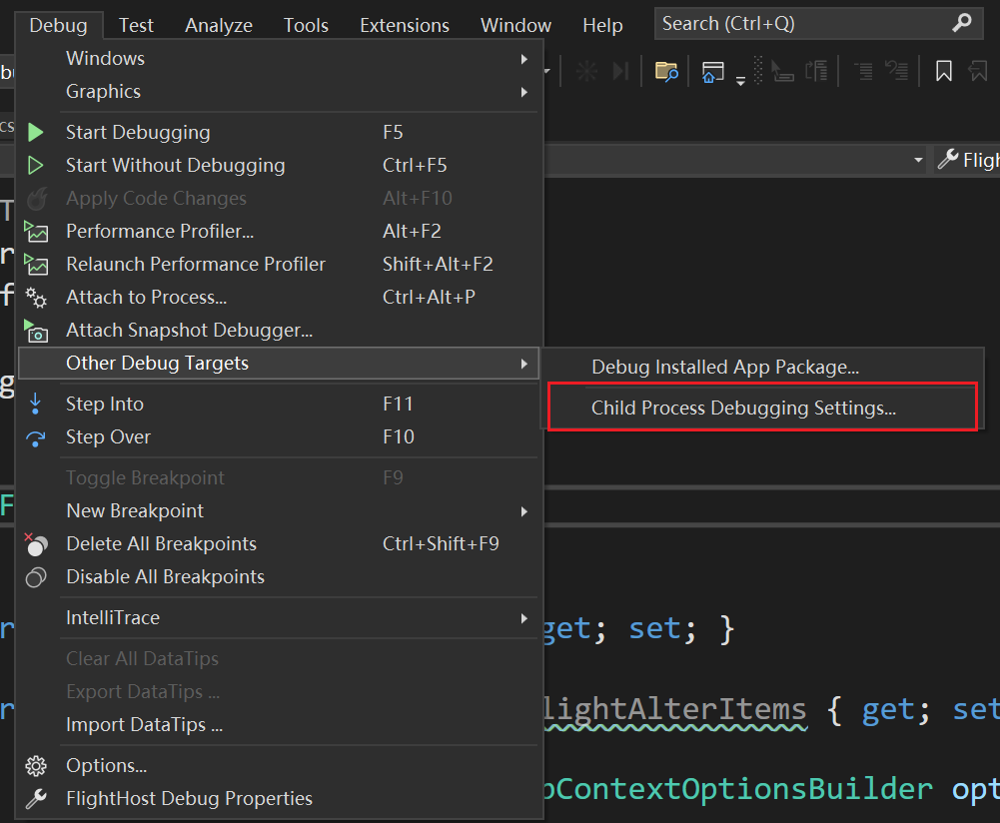

# 云原生（Cloud-native）



CNCF（Cloud Native Computing Foundation，云原生计算基金会）

a consortium of over 400 major corporations. Its charter is to make cloud-native computing ubiquitous across technology and cloud stacks. As one of the most influential open-source groups, it hosts many of the fastest-growing open source-projects in GitHub. These projects include Kubernetes, Prometheus, Helm, Envoy, and gRPC.

<https://landscape.cncf.io/> 云原生全景图、概念解释、相应项目


<https://raw.githubusercontent.com/cncf/trailmap/master/CNCF_TrailMap_latest.png> 云原生路线图

右侧是一条企业走向云原生的道路，分为十个步骤。

容器化 —— Docker

CI/CD —— Argo

编排和应用定义 —— Kubernetes Helm

可观察性和分析 —— prometheus

服务代理、发现和网格 —— CoreDNS Envoy Linkerd

网络、政策和安全 —— Flannel Calico

分布式数据库和存储 —— Vitess Rook etcd TiKV

流式传输和消息传递 —— gRPC NATS CloudEvents

容器注册 & 运行时 —— Harbor CRI-O

软件发行 —— Notary

了解项目

点击 <https://www.cncf.io/projects/>

可以查看具有代表性的毕业项目，并可以点击进入项目中看到最新进展。

## 学习

微软文档（MSDN）默认有中文版，将en-us改为zh-cn即可。

网站左下可以下载到PDF离线版（仅英文）

<https://docs.microsoft.com/en-us/dotnet/architecture/microservices/> 微服务概念

<https://docs.microsoft.com/en-us/dotnet/architecture/cloud-native/> 云原生

<https://docs.microsoft.com/en-us/devops/> DevOps

<https://docs.docker.com/get-started/> Docker

<https://docs.microsoft.com/en-us/dotnet/architecture/dapr-for-net-developers/> 微服务框架dapr 以.NET为例

<https://github.com/dotnet-architecture/eShopOnDapr> 基于Dapr的.NET微服务架构项目参考

<https://www.youtube.com/watch?v=X48VuDVv0do> Kubernetes入门视频

<https://kubernetes.io/docs/home/> Kubernetes文档，包含在线实践

#### 扩展

<https://docs.microsoft.com/en-us/azure/architecture/patterns/> 云有关的设计模式

<https://docs.microsoft.com/en-us/azure/architecture/best-practices/caching> .NET Cache缓存指南

<https://github.com/dotnet-architecture/eShopOnContainers> 基于.NET的微服务项目参考（未使用微服务框架）

<https://blog.csdn.net/qq_41185868/article/details/126811341> 云原生优势

## 概念

云原生技术使企业能够在公有云、私有云和混合云等现代动态环境中，构建和运行可弹性扩展的应用。云原生的代表技术包括容器、服务网格、微服务、不可变基础设施和声明式API。

这些技术能够构建容错性好、易于管理和便于观察的松耦合系统。结合可靠的自动化手段，云原生技术使工程师能够轻松地对系统做出频繁和可预测的重大变更。

### 声明式API（Declarative API）

对应的是命令式API（Imperative API），命令式API是需要告诉系统该怎么做才能达到想要的状态。

比如有关航班信息管理的API：

命令式API：提供航班的CURD API，想要将航班信息修改，需要自行组合CURD的调用方式去将航班修改到想要的状态。

声明式API：告诉系统想要航班状态变成什么样，由系统内部尝试去调整状态。

其实是指yaml配置文件，kuboard里面指明容器的配置状态。

### 不变的基础设施（immutable infrastructure）

DevOps中有一个概念：Pets与Cattle，它们是对我们如何管理服务器的一种服务模型。Pets故名思意，我们将服务器看作自己的宠物，有自己的名字，你通过将更多资源添加到相同计算机（纵向扩展）来进行Scaling。 如果服务器出现问题，你会进行修复，使它恢复正常运行状况。

Cattle服务模型则是从一个既定的镜像通过特异化的配置创建出来。 它们是相同的，并分配有系统标识符（如Server-01、Server-02 等等）。 我们通过创建更多实例（横向扩展）来进行Scaling。

Cattle模型采用不可变基础结构。 服务器不会进行修复或修改。 如果一台服务器发生故障或需要更新，则会销毁它并预配新服务器 – 所有操作都通过自动化完成。

总的来说，Cattle模型在实践中通常不会在容器中安装或更新应用，而是更新更为持久化的镜像，通过编排系统下载新镜像并启动相应的容器，并将旧的容器删除。这种只更新镜像而不改变容器运行时的模式称为不变的基础设施（immutable infrastructure）。从不变的基础设施就能看出，云原生的运营与传统虚拟机运营方式截然不同。

### Modern design 新设计

新式设计的十二个要素以及附加要素，见[https://docs.microsoft.com/en-us/dotnet/architecture/cloud-native/definition\#modern-design](https://docs.microsoft.com/en-us/dotnet/architecture/cloud-native/definition#modern-design)

### DevOps (Development & Operations)

可以把DevOps看作开发（软件工程）、技术运营和质量保障（QA）三者的交集。是一种重视“软件开发人员（Dev）”和“IT运维技术人员（Ops）”之间沟通合作的文化、运动或惯例。通过自动化“软件交付”和“架构变更”的流程，来使得构建、测试、发布软件能够更加地快捷、频繁和可靠。

DevOps is the union of people, process, and products to enable continuous delivery of value to our end users.

### 微服务架构

几个挑战

####   通信（Communication）

**前端通信**

通过API Gateway


可以考虑使用多个网关，按照前端大类分成API Gateway for Web、Mobile、Desktop等。

.NET 网关实现可以考虑<https://github.com/ThreeMammals/Ocelot>

或 <https://github.com/microsoft/reverse-proxy>

也可以直接使用现成的PaaS。

**微服务之间通信**


可以使用HTTP


也可以使用消息队列


建议使用RPC


使用Service mesh（服务网格）

#### 复原能力（Resiliency）

分布式体系结构中，服务出现异常造成的连环问题。
#### 分布式数据（Distributed Data）

每个服务单独管理自己的数据，如何跨多个服务进行数据治理？


TiDB，NewSQL，支持MySQL5.7协议，支持EFCore ORM框架，支持Navicat客户端

Materialized View Pattern（视图）


#### 机密（Secrets）

安全和敏感配置如何管理。

### 微服务架构解耦

微服务间通过接口调用。

不共享数据库。

微服务间仅通过约定进行消息传输（DTO，proto）

比如航班对象类，获取相关报文，通过调用电报API，而不是写在航班类中耦合，用aggregator将航班DTO完善返回。获取相关告警，同理。

Actor其实也是另类的aggregator？

## 微服务框架Dapr

微服务全家桶只能用SpringCloud框架？

dapr——语言平台无关，比SpringCloud更先进

提供多语言SDK改善开发体验（.NET SDK很不错，且微软官方有非常详细的入门教程<https://docs.microsoft.com/en-us/dotnet/architecture/dapr-for-net-developers/>）


dapr与分布式框架Orleans有渊源，可以学习Orleans的设计以加深对dapr的理解。<https://docs.microsoft.com/dotnet/orleans>.

### 分布式框架 Orleans

该框架称为Distributed .NET，即可构建分布式的.NET程序，用于一些共享对象做分布式化的处理。其是设计模式Actor Pattern的一种实现。

这里共享化的对象称为Grain，Grain可以放在Silo谷仓中，谷仓是Cluster，通过Client获取Grain时，Orleans就会自动的从谷仓中找到Grain并获取它，然后进行想要的操作。

SiloHost is started first. Then, the OrleansClient program is started.

Orleans封装了关于Grain的获取及调用，多个OrelansClient只会单线程的去更改Grain的状态，发送消息给Grain（无论它在哪里）。

####  Grain


个人理解是一个分布式化的对象，它的Identity是用户定义的Key，可以通过Key找到该Grain。Behavior则是该Grain实现的接口，有一系列的行为由用户实现，在客户端中拿到Grain可以通过接口进行操作Grain。

state则是Grain本身需要持久化的状态，如Grain的property，具体状态是否需要持久化、哪些状态需要持久化需要自行编写。


而且，Grain具有良好的伸缩性，当它不存在时会创建，当它访问比较少时会Deactivating，持久化状态，在下一次需要获取它的时候Activate过来。（具体怎么样可配置）

#### Silo

谷仓，即存放Grain的地方。

## 容器（Container）

现都已Docker作为标准。


## 容器编排（Container orchestration）

现都已Kubernetes作为标准


## 支持服务（Backing services）

云原生系统依赖于许多不同的辅助资源，如数据存储、消息中转站、监视和认证服务。 这些服务称为支持服务。


## 自动化（Automation）

实际上是实现理想上的（DevOps），实现CI/CD


1.  开发人员在其开发环境中构造一种功能，迭代执行所谓的“内部循环”（即代码、运行和调试）。
2.  完成后，该代码会推送到代码存储库（如 GitHub、Azure DevOps 或 BitBucket）。
3.  推送会触发将代码转换为二进制生成工件的生成阶段。 该工作使用[持续集成 (CI)](https://martinfowler.com/articles/continuousIntegration.html) 管道来实现。 它会自动生成、测试并打包应用程序。
4.  发布阶段选取二进制生成工件，应用外部应用程序和环境配置信息，然后生成不可变发布版。 发布版会部署到指定环境中。 该工作使用[持续交付 (CD)](https://martinfowler.com/bliki/ContinuousDelivery.html) 管道来实现。 每个发布版都应可识别。 你可以说“此部署正在运行应用程序的发布版 2.1.1。”
5.  最后，已发布的功能会在目标执行环境中运行。 发布版是不可变的，这意味着任何更改都必须创建新发布版。

# Dapr

## 概念

新一代微服务框架。dapr意为(Distributed application runtime)。特点是"any language, any framework, run anywhere"。

面向接口的体现，你只知道Dapr提供了一系列Building Blocks的接口，另外，还可以自己添加dapr边车，将自己的微服务也做成dapr接口支持的微服务，这样就面向了接口编程。

封装了很多用于微服务的组件，通过dapr API调用，而非依赖具体组件。


边车模式（Sidecar architecture）

它不是Service mesh。Dapr provides distributed application features. A service mesh provides a dedicated network infrastructure layer. 意味着dapr和service mesh可以共存，dapr可充当调用building blocks的api入口，service mesh提供服务之间的网络通信。



服务网格与Dapr

### CLI

<https://docs.dapr.io/reference/cli/dapr-run/>

### Building Blocks

构建基块，是微服务架构中的通用组件Component

| Component                         | Description                                                                                                                                                                                                                                                          | Remark                                                                                                      |
|-----------------------------------|----------------------------------------------------------------------------------------------------------------------------------------------------------------------------------------------------------------------------------------------------------------------|-------------------------------------------------------------------------------------------------------------|
| Service discovery (Name resolver) | Name resolvers provide a common way to interact with different name resolvers, which are used to return the address or IP of other services your applications may connect to.                                                                                        |                                                                                                             |
| State Stores                      | State Stores provide a common way to interact with different data store implementations, and allow users to opt-in to advanced capabilities using defined metadata.                                                                                                  |                                                                                                             |
| Pub Sub                           | Pub Sub components provide a common way to interact with different message bus implementations to achieve reliable, high-scale scenarios based on event-driven async communications, while allowing users to opt-in to advanced capabilities using defined metadata. |                                                                                                             |
| Bindings                          | Bindings provide a common way to trigger an application with events from external systems, or invoke an external system with optional data payloads. Bindings are great for event-driven, on-demand compute and help reduce boilerplate code.                        | In general, pub-sub is for dapr-to-dapr communication. Bindings are for integration with external services. |
| Middleware                        | Allows custom middleware to plug into the request processing pipeline and invoke additional actions on a request or response.                                                                                                                                        | 其实只能用仓库已经接受了的 比如Oauth2.0，rate limit等                                                       |
| Secret Stores                     | Provides a uniform interface to interact with external secret stores, including cloud, edge, commercial, open-source services.                                                                                                                                       |                                                                                                             |

## Component Configuration

### Pubsub

#### Kafka

问题一

1195725856 is GET[space] encoded as a big-endian, four-byte integer (see here for more information on how that works). This indicates that HTTP traffic is being sent to Kafka port 9092, but Kafka doesn't accept HTTP traffic, it only accepts its own protocol (which takes the first four bytes as the receive size, hence the error).

问题二 dapr显示无法连接到kafka（is your cluster reachable?）

需要配置好地址。

项目Rebuild后可能是dapr开的比较快，而kafka还没起来，导致以为连不上。第二次再启动就行了。

问题三Message was too large, server rejected it to avoid allocation error when using Headers

```yaml
- name: maxMessageBytes
  value: 10485760000
```

配置弄大点？

注意dapr这些component的yaml配置文件需要Rebuild才会生效

### Accessibility

A namespaced component is only accessible to applications running in the same namespace. If your Dapr application fails to load a component, make sure that the application namespace matches the component namespace. This can be especially tricky in self-hosted mode where the application namespace is stored in a NAMESPACE environment variable.


### HTTPS


If you leave the Configure for HTTPS checkbox checked, the generated ASP.NET Core API project includes middleware to redirect client requests to the HTTPS endpoint. This breaks communication between the Dapr sidecar and your application, unless you explicitly configure the use of HTTPS when running your Dapr application. To enable the Dapr sidecar to communicate over HTTPS, include the --app-ssl flag in the Dapr command to start the application. Also specify the HTTPS port using the --app-port parameter. The remainder of this walkthrough uses plain HTTP communication between the sidecar and the application, and requires you to clear the Configure for HTTPS checkbox.

## State stores

Care must be taken to always pass an explicit app-id parameter when consuming the state management building block. The block uses the application id value as a prefix for its state key for each key/value pair. If the application id changes, you can no longer access the previously stored state.

## Actor

Actor的method是异步的，所以接口必须以Task或Task\<…\>为返回值。

### State Management

actor 使用dapr runtime在component配置的`statestore.yaml`中间件作为状态存储。

需要`actorStateStore`值设置为true。

```yaml
- name: actorStateStore
  value: "true"
```

.NET SDK actor中使用

`this.StateManager.SetStateAsync("StateKey(state name)",stateObj);`

去设置当前actor需要保存的状态，即使actor host挂了、dapr runtime挂了，在下次启动，拿到同一个actor时也仍能还原回保存的状态。

如redis作为state service，

其key格式为

`<App ID>||<Actor type>||<Actor id>||<state key>`

每次调用actor的method后，实际上actor host会隐式的调用当前actor的this.StateManager.SaveStateAsync(); 去检查当前actor状态是否进行了变更，进而进行保存。

### 使用方式

```cs
var actor = new ActorId(guid);
//强类型模式，目前使用的是DataContract，很多地方不太好用
var proxy = ActorProxy.Create<IFlightActor>(actor, nameof(FlightActor));
return await proxy.AlterFlight(alterEvent.AlterItem);
//推荐使用json动态代理模式
var dynamicProxy = ActorProxy.Create(actor, nameof(FlightActor));
var data = await dynamicProxy.InvokeMethodAsync<FlightAlterItem, bool>(nameof(FlightActor.ReceiveAlterItem),alterEvent.AlterItem);
return data;
```


### Serialize

使用`[IgnoreDataMember]`忽略格式化？

Strongly Type的是使用DataContract

可采用Weakly Type，是使用System.Text.Json格式化。

Actors uses DataContract serializer (XML) for "remoting" method invocation (the choice of DCS is not configurable).

Actors uses System.Text.Json (JSON) for "non-remoting" method invocation (neither the choice of S.T.J nor the options passed to it are configurable).

non-remoting其实就是指的动态代理的non-strong type写法，而remoting则是用strong type。

Actors uses System.Text.Json (JSON) for state storage (the serializer and options have a replaceable abstraction).

<https://github.com/dapr/dotnet-sdk/issues/476>

## 服务发现&服务间调用

daprd sidecar 有 app-port，是指宿主微服务的API监听地址，由sidecar去调用的

而dapr-http-port是设置sidecar本身的HTTP的监听地址，是由dapr-placement解析出边车地址然后两个边车间沟通的HTTP监听地址。gRPC的监听地址也可以设置

sidecar的默认的HTTP监听是3500，gRPC的是50001。一般不需要修改（修改后暂时不知道怎么调通，因为dapr-placement默认是映射到默认端口？）。

### Dashboard

Standalone模式暂时不支持docker compose。（仅支持k8s，截至2022/9/29）

<https://github.com/dapr/dashboard/issues/38>

## Debug

需要依赖于dapr的项目，需要特别的Debug方法，如Actor的Host程序，这类项目必须

使用诸如

```sh
dapr run --app-id myapp --app-port 5000 --dapr-http-port 3500 -- dotnet run
```

的命令来运行。

The Dapr CLI run command starts the application. It invokes the underlying Dapr runtime and enables both the application and Dapr sidecar to run together.

这导致无法直接使用VS进行debug，使用attach process也无效，导致Debug困难。现有如下方式，可以直接通过VS进行Debug：

支持VS2022。

①需要下载PowerShell 7 / Core

<https://docs.microsoft.com/en-us/powershell/scripting/install/installing-powershell-on-windows?view=powershell-7.2>

②VS中安装插件Microsoft Child Process Debugging Power Tool

<https://marketplace.visualstudio.com/items?itemName=vsdbgplat.MicrosoftChildProcessDebuggingPowerTool2022>

如果是VS2022版本以下的则安装：

<https://marketplace.visualstudio.com/items?itemName=vsdbgplat.MicrosoftChildProcessDebuggingPowerTool>

③项目Properties文件夹中的launchSettings.json添加如下配置到profiles节点：


```json
 "Dapr-PWSH": {
      "commandName": "Executable",
      "executablePath": "pwsh",
      "commandLineArgs": "-Command \"dapr run --app-id FlightHost --app-port 5000 --dapr-http-port 3500 -- dotnet run --no-build\"",
      "workingDirectory": ".",
      "environmentVariables": {
        "ASPNETCORE_ENVIRONMENT": "Development"
      },
      "nativeDebugging": true
    },
```

其中`commandLineArs`中需要自行修改成相应运行命令。

如果项目不存在Properties文件夹，则先随意新建一个：




④配置Child Process Debugging Settings



| Enabled | Process name              | Action          | Debugger Type                   |
|---------|---------------------------|-----------------|---------------------------------|
| Yes     | \<All other processeses\> | Do not debug    | \<Inherit from parent process\> |
| Yes     | dapr.exe                  | Attach debugger | Native                          |
| Yes     | dotnet.exe                | Attach debugger | Native                          |
| Yes     | <span style="color:#ff0000">FlightHost.exe      </span>   | Attach debugger | <span style="color:#ff0000">Managed (.NET Core, .NET 5+)</span>    |

注意标红的地方，FlightHost需要改成项目生成的运行程序名，Debugger Type必须选择Managed类。

⑤使用配置的dapr-pwsh模式开始debug


### Reference

[https://github.com/dapr/dotnet-sdk/issues/401\#issuecomment-747563695](https://github.com/dapr/dotnet-sdk/issues/401#issuecomment-747563695)

<https://devblogs.microsoft.com/devops/introducing-the-child-process-debugging-power-tool/>
