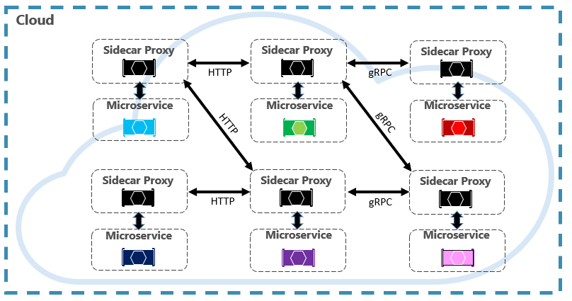

# 云原生（Cloud-native）

`CNCF`（`Cloud Native Computing Foundation`，云原生计算基金会）

a consortium of over 400 major corporations. Its charter is to make cloud-native computing ubiquitous across technology and cloud stacks. As one of the most influential open-source groups, it hosts many of the fastest-growing open source-projects in `GitHub`. These projects include `Kubernetes`, `Prometheus`, `Helm`, `Envoy`, and `gRPC`.

[CNCF 云原生全景图](https://landscape.cncf.io/) 云原生全景图、概念解释、相应项目

[云原生路线图](https://raw.githubusercontent.com/cncf/trailmap/master/CNCF_TrailMap_latest.png)

右侧是一条企业走向云原生的道路，分为十个步骤。

1. 容器化 —— `Docker`

2. `CI/CD` —— `Argo`

3. 编排和应用定义 —— `Kubernetes` `Helm`

4. 可观察性和分析 —— `Prometheus`

5. 服务代理、发现和网格 —— `CoreDNS` `Envoy` `Linkerd`

6. 网络、政策和安全 —— `Flannel` `Calico`

7. 分布式数据库和存储 —— `Vitess` `Rook` `etcd` `TiKV`

8. 流式传输和消息传递 —— `gRPC` `NATS` `CloudEvents`

9. 容器注册 & 运行时 —— `Harbor` `CRI-O`

10. 软件发行 —— `Notary`

了解项目

点击 [CNCF 项目页面](https://www.cncf.io/projects/)

可以查看具有代表性的毕业项目，并可以点击进入项目中看到最新进展。

## 学习

微软文档（`MSDN`）默认有中文版，将 `en-us` 改为 `zh-cn` 即可。

网站左下可以下载到 `PDF` 离线版（仅英文）

- [微服务概念 | Microsoft Learn](https://docs.microsoft.com/en-us/dotnet/architecture/microservices/)

- [云原生 | Microsoft Learn](https://docs.microsoft.com/en-us/dotnet/architecture/cloud-native/)

- [DevOps | Microsoft Learn](https://docs.microsoft.com/en-us/devops/)

- [Docker Get Started](https://docs.docker.com/get-started/)

- [微服务框架 Dapr 以 .NET 为例 | Microsoft Learn](https://docs.microsoft.com/en-us/dotnet/architecture/dapr-for-net-developers/)

- [基于 Dapr 的 .NET 微服务架构项目参考](https://github.com/dotnet-architecture/eShopOnDapr)

- [Kubernetes 入门视频](https://www.youtube.com/watch?v=X48VuDVv0do)

- [Kubernetes 文档，包含在线实践](https://kubernetes.io/docs/home/)

### 扩展

- [云有关的设计模式 | Microsoft Learn](https://docs.microsoft.com/en-us/azure/architecture/patterns/)

- [.NET Cache 缓存指南 | Microsoft Learn](https://docs.microsoft.com/en-us/azure/architecture/best-practices/caching)

- [基于 .NET 的微服务项目参考（未使用微服务框架）](https://github.com/dotnet-architecture/eShopOnContainers)

- [云原生优势](https://blog.csdn.net/qq_41185868/article/details/126811341)

## 概念

云原生技术使企业能够在公有云、私有云和混合云等现代动态环境中，构建和运行可弹性扩展的应用。云原生的代表技术包括容器、服务网格、微服务、不可变基础设施和声明式API。

这些技术能够构建容错性好、易于管理和便于观察的松耦合系统。结合可靠的自动化手段，云原生技术使工程师能够轻松地对系统做出频繁和可预测的重大变更。

### 声明式API（Declarative API）

对应的是命令式API（Imperative API），命令式API是需要告诉系统该怎么做才能达到想要的状态。

比如有关航班信息管理的API：

命令式 `API`：提供航班的 `CURD API`，想要将航班信息修改，需要自行组合 `CURD` 的调用方式去将航班修改到想要的状态。

声明式 `API`：告诉系统想要航班状态变成什么样，由系统内部尝试去调整状态。

其实是指 `yaml` 配置文件，`kuboard` 里面指明容器的配置状态。

### 不变的基础设施（immutable infrastructure）

`DevOps` 中有一个概念：`Pets` 与 `Cattle`，它们是对我们如何管理服务器的一种服务模型。`Pets` 故名思意，我们将服务器看作自己的宠物，有自己的名字，你通过将更多资源添加到相同计算机（纵向扩展）来进行 `Scaling`。 如果服务器出现问题，你会进行修复，使它恢复正常运行状况。

`Cattle` 服务模型则是从一个既定的镜像通过特异化的配置创建出来。 它们是相同的，并分配有系统标识符（如 `Server-01`、`Server-02` 等等）。 我们通过创建更多实例（横向扩展）来进行 `Scaling`。

`Cattle` 模型采用不可变基础结构。 服务器不会进行修复或修改。 如果一台服务器发生故障或需要更新，则会销毁它并预配新服务器 – 所有操作都通过自动化完成。

总的来说，Cattle模型在实践中通常不会在容器中安装或更新应用，而是更新更为持久化的镜像，通过编排系统下载新镜像并启动相应的容器，并将旧的容器删除。这种只更新镜像而不改变容器运行时的模式称为不变的基础设施（immutable infrastructure）。从不变的基础设施就能看出，云原生的运营与传统虚拟机运营方式截然不同。

### 现代设计（Modern Design）

新式设计的十二个要素以及附加要素，见 [现代设计 | Microsoft Learn](https://docs.microsoft.com/en-us/dotnet/architecture/cloud-native/definition#modern-design)

### DevOps (Development & Operations)

可以把DevOps看作开发（软件工程）、技术运营和质量保障（QA）三者的交集。是一种重视“软件开发人员（Dev）”和“IT运维技术人员（Ops）”之间沟通合作的文化、运动或惯例。通过自动化“软件交付”和“架构变更”的流程，来使得构建、测试、发布软件能够更加地快捷、频繁和可靠。

DevOps is the union of people, process, and products to enable continuous delivery of value to our end users.

### 微服务架构

几个挑战

### 通信（Communication）

**前端通信**

通过API Gateway

可以考虑使用多个网关，按照前端大类分成API Gateway for Web、Mobile、Desktop等。

.NET 网关实现可以考虑<https://github.com/ThreeMammals/Ocelot>

或 <https://github.com/microsoft/reverse-proxy>

也可以直接使用现成的PaaS。

**微服务之间通信**

可以使用HTTP

也可以使用消息队列

建议使用RPC

使用Service mesh（服务网格）

### 复原能力（Resiliency）

分布式体系结构中，服务出现异常造成的连环问题。
### 分布式数据（Distributed Data）

每个服务单独管理自己的数据，如何跨多个服务进行数据治理？

TiDB，NewSQL，支持MySQL5.7协议，支持EFCore ORM框架，支持Navicat客户端

Materialized View Pattern（视图）

### 机密（Secrets）

安全和敏感配置如何管理。

### 微服务架构解耦

微服务间通过接口调用。

不共享数据库。

微服务间仅通过约定进行消息传输（DTO，proto）

比如航班对象类，获取相关报文，通过调用电报API，而不是写在航班类中耦合，用aggregator将航班DTO完善返回。获取相关告警，同理。

Actor其实也是另类的aggregator？

## 微服务框架Dapr

微服务全家桶只能用SpringCloud框架？

dapr——语言平台无关，比SpringCloud更先进

提供多语言SDK改善开发体验（.NET SDK很不错，且微软官方有非常详细的入门教程<https://docs.microsoft.com/en-us/dotnet/architecture/dapr-for-net-developers/>）

dapr与分布式框架Orleans有渊源，可以学习Orleans的设计以加深对dapr的理解。<https://docs.microsoft.com/dotnet/orleans>.

### 分布式框架 Orleans

该框架称为Distributed .NET，即可构建分布式的.NET程序，用于一些共享对象做分布式化的处理。其是设计模式Actor Pattern的一种实现。

这里共享化的对象称为Grain，Grain可以放在Silo谷仓中，谷仓是Cluster，通过Client获取Grain时，Orleans就会自动的从谷仓中找到Grain并获取它，然后进行想要的操作。

SiloHost is started first. Then, the OrleansClient program is started.

Orleans封装了关于Grain的获取及调用，多个OrelansClient只会单线程的去更改Grain的状态，发送消息给Grain（无论它在哪里）。

####  Grain

个人理解是一个分布式化的对象，它的Identity是用户定义的Key，可以通过Key找到该Grain。Behavior则是该Grain实现的接口，有一系列的行为由用户实现，在客户端中拿到Grain可以通过接口进行操作Grain。

state则是Grain本身需要持久化的状态，如Grain的property，具体状态是否需要持久化、哪些状态需要持久化需要自行编写。

而且，Grain具有良好的伸缩性，当它不存在时会创建，当它访问比较少时会Deactivating，持久化状态，在下一次需要获取它的时候Activate过来。（具体怎么样可配置）

#### Silo

谷仓，即存放Grain的地方。

## 容器（Container）

现都已Docker作为标准。

## 容器编排（Container orchestration）

现都已Kubernetes作为标准

## 支持服务（Backing services）

云原生系统依赖于许多不同的辅助资源，如数据存储、消息中转站、监视和认证服务。 这些服务称为支持服务。

## 自动化（Automation）

实际上是实现理想上的（DevOps），实现CI/CD

1.  开发人员在其开发环境中构造一种功能，迭代执行所谓的“内部循环”（即代码、运行和调试）。
2.  完成后，该代码会推送到代码存储库（如 GitHub、Azure DevOps 或 BitBucket）。
3.  推送会触发将代码转换为二进制生成工件的生成阶段。 该工作使用[持续集成 (CI)](https://martinfowler.com/articles/continuousIntegration.html) 管道来实现。 它会自动生成、测试并打包应用程序。
4.  发布阶段选取二进制生成工件，应用外部应用程序和环境配置信息，然后生成不可变发布版。 发布版会部署到指定环境中。 该工作使用[持续交付 (CD)](https://martinfowler.com/bliki/ContinuousDelivery.html) 管道来实现。 每个发布版都应可识别。 你可以说“此部署正在运行应用程序的发布版 2.1.1。”
5.  最后，已发布的功能会在目标执行环境中运行。 发布版是不可变的，这意味着任何更改都必须创建新发布版。
