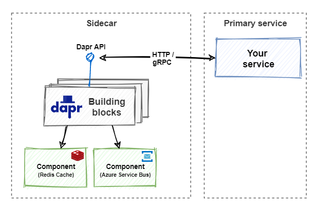
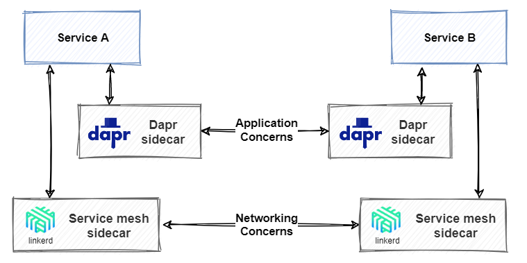
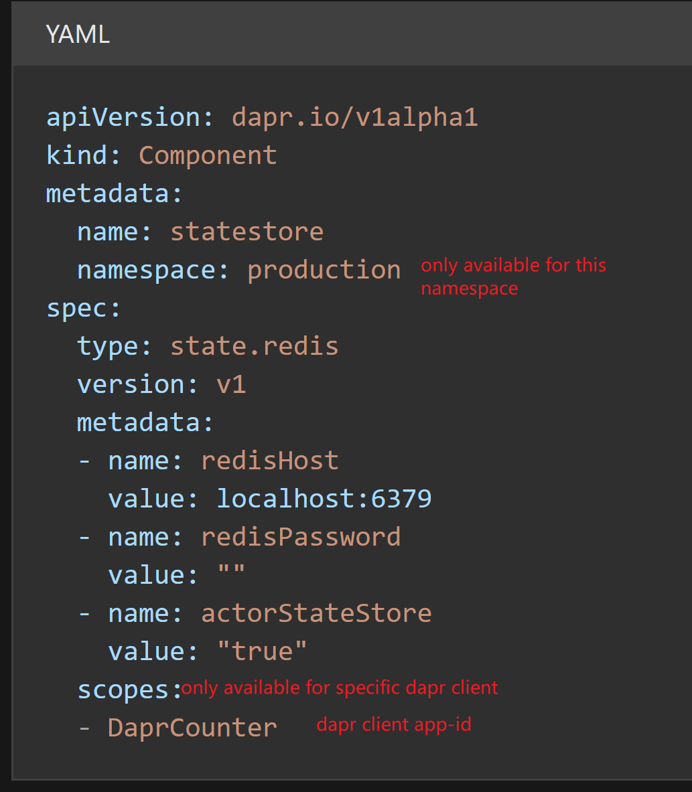
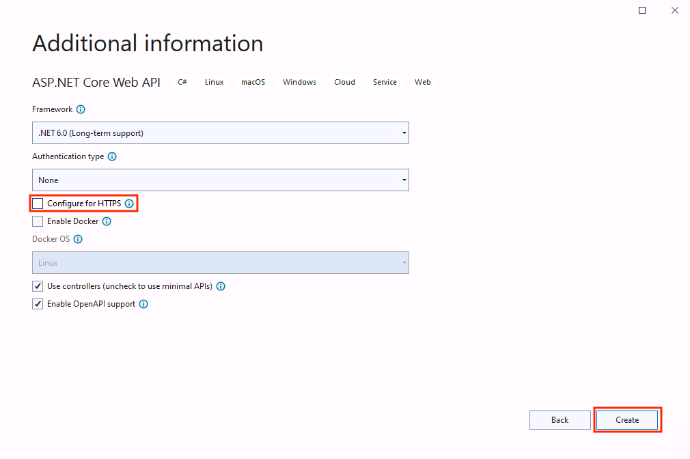
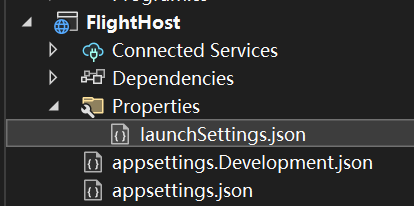
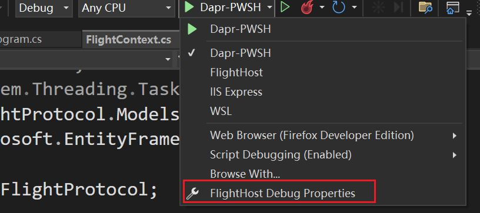
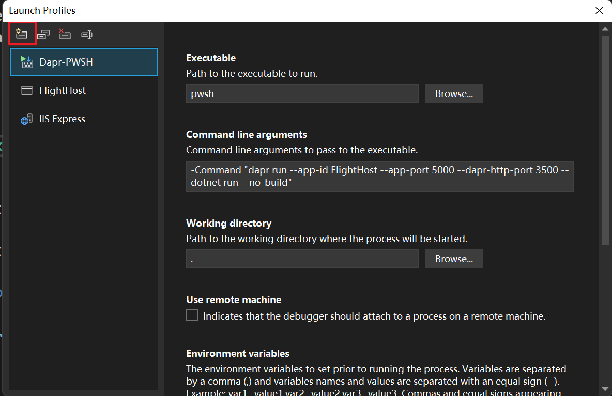
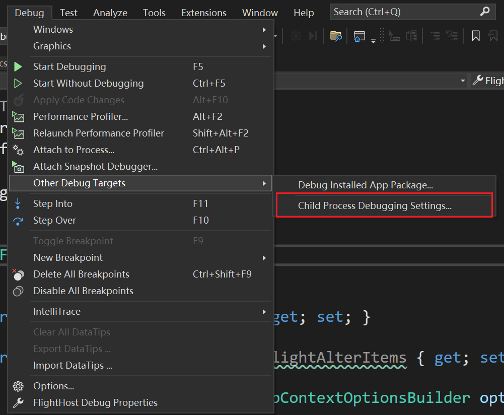
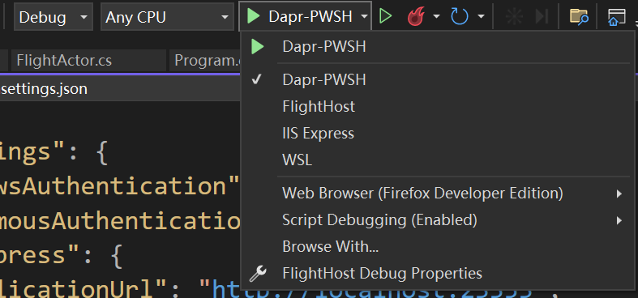

# Dapr

## 概念

新一代微服务框架。dapr意为(Distributed application runtime)。特点是"any language, any framework, run anywhere"。

面向接口的体现，你只知道Dapr提供了一系列Building Blocks的接口，另外，还可以自己添加dapr边车，将自己的微服务也做成dapr接口支持的微服务，这样就面向了接口编程。

封装了很多用于微服务的组件，通过dapr API调用，而非依赖具体组件。



边车模式（Sidecar architecture）

它不是Service mesh。Dapr provides distributed application features. A service mesh provides a dedicated network infrastructure layer. 意味着dapr和service mesh可以共存，dapr可充当调用building blocks的api入口，service mesh提供服务之间的网络通信。



服务网格与Dapr

### CLI

<https://docs.dapr.io/reference/cli/dapr-run/>

### Building Blocks

构建基块，是微服务架构中的通用组件Component

| Component                         | Description                                                                                                                                                                                                                                                          | Remark                                                                                                      |
|-----------------------------------|----------------------------------------------------------------------------------------------------------------------------------------------------------------------------------------------------------------------------------------------------------------------|-------------------------------------------------------------------------------------------------------------|
| Service discovery (Name resolver) | Name resolvers provide a common way to interact with different name resolvers, which are used to return the address or IP of other services your applications may connect to.                                                                                        |                                                                                                             |
| State Stores                      | State Stores provide a common way to interact with different data store implementations, and allow users to opt-in to advanced capabilities using defined metadata.                                                                                                  |                                                                                                             |
| Pub Sub                           | Pub Sub components provide a common way to interact with different message bus implementations to achieve reliable, high-scale scenarios based on event-driven async communications, while allowing users to opt-in to advanced capabilities using defined metadata. |                                                                                                             |
| Bindings                          | Bindings provide a common way to trigger an application with events from external systems, or invoke an external system with optional data payloads. Bindings are great for event-driven, on-demand compute and help reduce boilerplate code.                        | In general, pub-sub is for dapr-to-dapr communication. Bindings are for integration with external services. |
| Middleware                        | Allows custom middleware to plug into the request processing pipeline and invoke additional actions on a request or response.                                                                                                                                        | 其实只能用仓库已经接受了的 比如Oauth2.0，rate limit等                                                       |
| Secret Stores                     | Provides a uniform interface to interact with external secret stores, including cloud, edge, commercial, open-source services.                                                                                                                                       |                                                                                                             |

## Component Configuration

### Pubsub

#### Kafka

问题一

1195725856 is GET[space] encoded as a big-endian, four-byte integer (see here for more information on how that works). This indicates that HTTP traffic is being sent to Kafka port 9092, but Kafka doesn't accept HTTP traffic, it only accepts its own protocol (which takes the first four bytes as the receive size, hence the error).

问题二 dapr显示无法连接到kafka（is your cluster reachable?）

需要配置好地址。

项目Rebuild后可能是dapr开的比较快，而kafka还没起来，导致以为连不上。第二次再启动就行了。

问题三Message was too large, server rejected it to avoid allocation error when using Headers

```yaml
- name: maxMessageBytes
  value: 10485760000
```

配置弄大点？

注意dapr这些component的yaml配置文件需要Rebuild才会生效

### Accessibility

A namespaced component is only accessible to applications running in the same namespace. If your Dapr application fails to load a component, make sure that the application namespace matches the component namespace. This can be especially tricky in self-hosted mode where the application namespace is stored in a NAMESPACE environment variable.



### HTTPS



If you leave the Configure for HTTPS checkbox checked, the generated ASP.NET Core API project includes middleware to redirect client requests to the HTTPS endpoint. This breaks communication between the Dapr sidecar and your application, unless you explicitly configure the use of HTTPS when running your Dapr application. To enable the Dapr sidecar to communicate over HTTPS, include the --app-ssl flag in the Dapr command to start the application. Also specify the HTTPS port using the --app-port parameter. The remainder of this walkthrough uses plain HTTP communication between the sidecar and the application, and requires you to clear the Configure for HTTPS checkbox.

## State stores

Care must be taken to always pass an explicit app-id parameter when consuming the state management building block. The block uses the application id value as a prefix for its state key for each key/value pair. If the application id changes, you can no longer access the previously stored state.

## Actor

Actor的method是异步的，所以接口必须以Task或Task\<…\>为返回值。

### State Management

actor 使用dapr runtime在component配置的`statestore.yaml`中间件作为状态存储。

需要`actorStateStore`值设置为true。

```yaml
- name: actorStateStore
  value: "true"
```

.NET SDK actor中使用

`this.StateManager.SetStateAsync("StateKey(state name)",stateObj);`

去设置当前actor需要保存的状态，即使actor host挂了、dapr runtime挂了，在下次启动，拿到同一个actor时也仍能还原回保存的状态。

如redis作为state service，

其key格式为

`<App ID>||<Actor type>||<Actor id>||<state key>`

每次调用actor的method后，实际上actor host会隐式的调用当前actor的this.StateManager.SaveStateAsync(); 去检查当前actor状态是否进行了变更，进而进行保存。

### 使用方式

```cs
var actor = new ActorId(guid);
//强类型模式，目前使用的是DataContract，很多地方不太好用
var proxy = ActorProxy.Create<IFlightActor>(actor, nameof(FlightActor));
return await proxy.AlterFlight(alterEvent.AlterItem);
//推荐使用json动态代理模式
var dynamicProxy = ActorProxy.Create(actor, nameof(FlightActor));
var data = await dynamicProxy.InvokeMethodAsync<FlightAlterItem, bool>(nameof(FlightActor.ReceiveAlterItem),alterEvent.AlterItem);
return data;
```


### Serialize

使用`[IgnoreDataMember]`忽略格式化？

Strongly Type的是使用DataContract

可采用Weakly Type，是使用System.Text.Json格式化。

Actors uses DataContract serializer (XML) for "remoting" method invocation (the choice of DCS is not configurable).

Actors uses System.Text.Json (JSON) for "non-remoting" method invocation (neither the choice of S.T.J nor the options passed to it are configurable).

non-remoting其实就是指的动态代理的non-strong type写法，而remoting则是用strong type。

Actors uses System.Text.Json (JSON) for state storage (the serializer and options have a replaceable abstraction).

<https://github.com/dapr/dotnet-sdk/issues/476>

## 服务发现&服务间调用

daprd sidecar 有 app-port，是指宿主微服务的API监听地址，由sidecar去调用的

而dapr-http-port是设置sidecar本身的HTTP的监听地址，是由dapr-placement解析出边车地址然后两个边车间沟通的HTTP监听地址。gRPC的监听地址也可以设置

sidecar的默认的HTTP监听是3500，gRPC的是50001。一般不需要修改（修改后暂时不知道怎么调通，因为dapr-placement默认是映射到默认端口？）。

### 问题

#### initial http2 frame from server is not a settings frame:http2.GoAwayFrame
边车配置的 `app-protocol` 是gRPC，然后应用中却通过dapr HttpClient去调用Http服务，造成问题。

#### ERR_DIRECT_INVOKE fail to invoke
有可能是命名空间的问题，边车与边车之间不在同一个命名空间，则默认无法互相通信。比如在K8S中挂载的边车，默认是采用了K8S自己项目的命名空间。

可以通过改写调用api进行，如：`https://localhost:3500/v1.0/invoke/myappid.<namespace>/method/ping`
[How to: Service invocation across namespaces | Dapr Docs](https://docs.dapr.io/developing-applications/building-blocks/service-invocation/service-invocation-namespaces/)

### Dashboard

Standalone模式暂时不支持docker compose。（仅支持k8s，截至2022/9/29）

<https://github.com/dapr/dashboard/issues/38>

## Debug

需要依赖于dapr的项目，需要特别的Debug方法，如Actor的Host程序，这类项目必须

使用诸如

```sh
dapr run --app-id myapp --app-port 5000 --dapr-http-port 3500 -- dotnet run
```

的命令来运行。

The Dapr CLI run command starts the application. It invokes the underlying Dapr runtime and enables both the application and Dapr sidecar to run together.

这导致无法直接使用VS进行debug，使用attach process也无效，导致Debug困难。现有如下方式，可以直接通过VS进行Debug：

支持VS2022。

①需要下载PowerShell 7 / Core

<https://docs.microsoft.com/en-us/powershell/scripting/install/installing-powershell-on-windows?view=powershell-7.2>

②VS中安装插件Microsoft Child Process Debugging Power Tool

<https://marketplace.visualstudio.com/items?itemName=vsdbgplat.MicrosoftChildProcessDebuggingPowerTool2022>

如果是VS2022版本以下的则安装：

<https://marketplace.visualstudio.com/items?itemName=vsdbgplat.MicrosoftChildProcessDebuggingPowerTool>

③项目Properties文件夹中的launchSettings.json添加如下配置到profiles节点：



```json
 "Dapr-PWSH": {
      "commandName": "Executable",
      "executablePath": "pwsh",
      "commandLineArgs": "-Command \"dapr run --app-id FlightHost --app-port 5000 --dapr-http-port 3500 -- dotnet run --no-build\"",
      "workingDirectory": ".",
      "environmentVariables": {
        "ASPNETCORE_ENVIRONMENT": "Development"
      },
      "nativeDebugging": true
    },
```

其中`commandLineArs`中需要自行修改成相应运行命令。

如果项目不存在Properties文件夹，则先随意新建一个：





④配置Child Process Debugging Settings



| Enabled | Process name              | Action          | Debugger Type                   |
|---------|---------------------------|-----------------|---------------------------------|
| Yes     | \<All other processeses\> | Do not debug    | \<Inherit from parent process\> |
| Yes     | dapr.exe                  | Attach debugger | Native                          |
| Yes     | dotnet.exe                | Attach debugger | Native                          |
| Yes     | <span style="color:#ff0000">FlightHost.exe      </span>   | Attach debugger | <span style="color:#ff0000">Managed (.NET Core, .NET 5+)</span>    |

注意标红的地方，FlightHost需要改成项目生成的运行程序名，Debugger Type必须选择Managed类。

⑤使用配置的dapr-pwsh模式开始debug



### Reference

[https://github.com/dapr/dotnet-sdk/issues/401\#issuecomment-747563695](https://github.com/dapr/dotnet-sdk/issues/401#issuecomment-747563695)

<https://devblogs.microsoft.com/devops/introducing-the-child-process-debugging-power-tool/>
