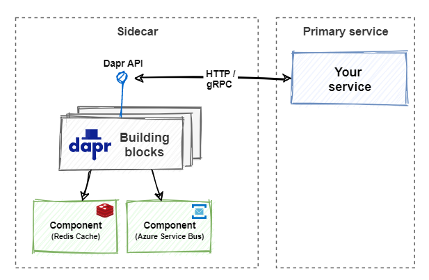

# 概念

新一代微服务框架。`Dapr`意为(`Distributed application runtime`)。特点是"`any language, any framework, run anywhere`"。

面向接口的体现，你只知道`Dapr`提供了一系列`Building Blocks`的接口，另外，还可以自己添加`Dapr`边车，将自己的微服务也做成`Dapr`接口支持的微服务，这样就面向了接口编程。

封装了很多用于微服务的组件，通过`Dapr API`调用，而非依赖具体组件。

边车模式（`Sidecar architecture`）

它不是`Service mesh`。`Dapr provides distributed application features. A service mesh provides a dedicated network infrastructure layer.` 意味着`Dapr`和`Service mesh`可以共存，`Dapr`可充当调用`building blocks`的`API`入口，`Service mesh`提供服务之间的网络通信。

服务网格与`Dapr`

## CLI

[CLI参考文档](https://docs.dapr.io/reference/cli/dapr-run/)

## Building Blocks

构建基块，是微服务架构中的通用组件`Component`

| Component                         | Description                                                                                                                                                                                                                                                          | Remark                                                                                                      |
|-----------------------------------|----------------------------------------------------------------------------------------------------------------------------------------------------------------------------------------------------------------------------------------------------------------------|-------------------------------------------------------------------------------------------------------------|
| Service discovery (Name resolver) | Name resolvers provide a common way to interact with different name resolvers, which are used to return the address or IP of other services your applications may connect to.                                                                                        |                                                                                                             |
| State Stores                      | State Stores provide a common way to interact with different data store implementations, and allow users to opt-in to advanced capabilities using defined metadata.                                                                                                  |                                                                                                             |
| Pub Sub                           | Pub Sub components provide a common way to interact with different message bus implementations to achieve reliable, high-scale scenarios based on event-driven async communications, while allowing users to opt-in to advanced capabilities using defined metadata. |                                                                                                             |
| Bindings                          | Bindings provide a common way to trigger an application with events from external systems, or invoke an external system with optional data payloads. Bindings are great for event-driven, on-demand compute and help reduce boilerplate code.                        | In general, pub-sub is for dapr-to-dapr communication. Bindings are for integration with external services. |
| Middleware                        | Allows custom middleware to plug into the request processing pipeline and invoke additional actions on a request or response.                                                                                                                                        | 其实只能用仓库已经接受了的 比如`OAuth2.0`，`rate limit`等                                                       |
| Secret Stores                     | Provides a uniform interface to interact with external secret stores, including cloud, edge, commercial, open-source services.                                                                                                                                       |                                                                                                             |