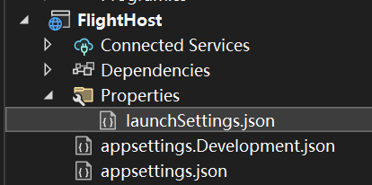
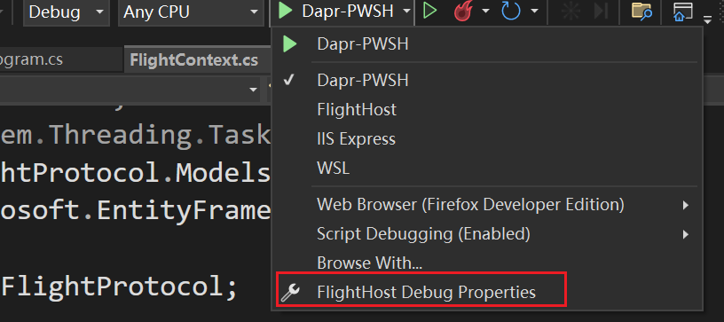

# 调试

## 普通调试

需要依赖于`Dapr`的项目，需要特别的`Debug`方法，如`Actor`的`Host`程序，这类项目必须

使用诸如

```sh
dapr run --app-id myapp --app-port 5000 --dapr-http-port 3500 -- dotnet run
```

的命令来运行。

The Dapr CLI run command starts the application. It invokes the underlying Dapr runtime and enables both the application and Dapr sidecar to run together.

这导致无法直接使用`VS`进行`debug`，使用`attach process`也无效，导致`Debug`困难。现有如下方式，可以直接通过`VS`进行`Debug`：

支持`VS2022`。

1. 需要下载`PowerShell 7 / Core`

[安装 PowerShell - PowerShell | Microsoft Learn](https://docs.microsoft.com/en-us/powershell/scripting/install/installing-powershell-on-windows?view=powershell-7.2)

2. `VS`中安装插件`Microsoft Child Process Debugging Power Tool`

[Microsoft Child Process Debugging Power Tool 2022 - Visual Studio Marketplace](https://marketplace.visualstudio.com/items?itemName=vsdbgplat.MicrosoftChildProcessDebuggingPowerTool2022)

如果是`VS2022`版本以下的则安装：

[Microsoft Child Process Debugging Power Tool - Visual Studio Marketplace](https://marketplace.visualstudio.com/items?itemName=vsdbgplat.MicrosoftChildProcessDebuggingPowerTool)

3. 项目`Properties`文件夹中的`launchSettings.json`添加如下配置到`profiles`节点：



```json
 "Dapr-PWSH": {
      "commandName": "Executable",
      "executablePath": "pwsh",
      "commandLineArgs": "-Command \"dapr run --app-id FlightHost --app-port 5000 --dapr-http-port 3500 -- dotnet run --no-build\"",
      "workingDirectory": ".",
      "environmentVariables": {
        "ASPNETCORE_ENVIRONMENT": "Development"
      },
      "nativeDebugging": true
    },
```

其中`commandLineArgs`中需要自行修改成相应运行命令。

如果项目不存在`Properties`文件夹，则先随意新建一个：




4. 配置`Child Process Debugging Settings`


| Enabled | Process name              | Action          | Debugger Type                   |
|---------|---------------------------|-----------------|---------------------------------|
| Yes     | \<All other processes\> | Do not debug    | \<Inherit from parent process\> |
| Yes     | dapr.exe                  | Attach debugger | Native                          |
| Yes     | dotnet.exe                | Attach debugger | Native                          |
| Yes     | FlightHost.exe      | Attach debugger | Managed (.NET Core, .NET 5+)    |

注意标红的地方，`FlightHost`需要改成项目生成的运行程序名，`Debugger Type`必须选择`Managed`类。

5. 使用配置的`dapr-pwsh`模式开始`debug`


### 参考文档

[https://github.com/dapr/dotnet-sdk/issues/401\#issuecomment-747563695](https://github.com/dapr/dotnet-sdk/issues/401#issuecomment-747563695)

[Introducing the Child Process Debugging Power Tool - Azure DevOps Blog](https://devblogs.microsoft.com/devops/introducing-the-child-process-debugging-power-tool/)

## Dapr Visual Studio 2022 插件

[[Discussion] Who is using Visual Studio (or other IDEs) for Dapr application development? · Issue #6097 · dapr/dapr (github.com)](https://github.com/dapr/dapr/issues/6097)
[microsoft/vs-dapr: View, manage, and diagnose Dapr services within Visual Studio. (github.com)](https://github.com/microsoft/vs-dapr)
[Dapr Community Call - Oct 4th (#91) (youtube.com)](https://www.youtube.com/watch?v=L_S98bRGfCQ&t=668s)

其他：[[Discussion] Who is using Visual Studio (or other IDEs) for Dapr application development? · Issue #6097 · dapr/dapr (github.com)](https://github.com/dapr/dapr/issues/6097)