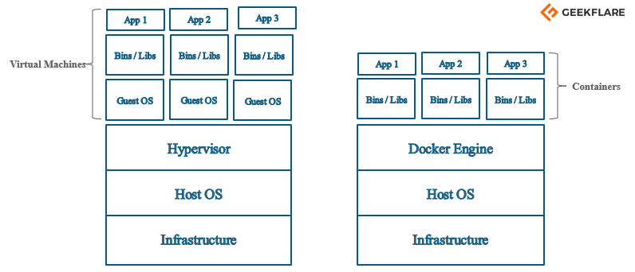
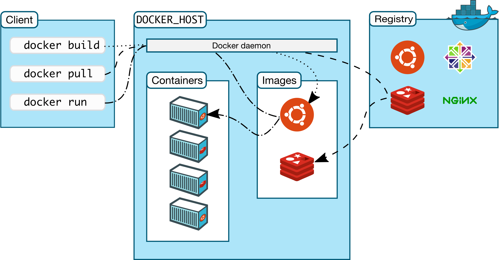
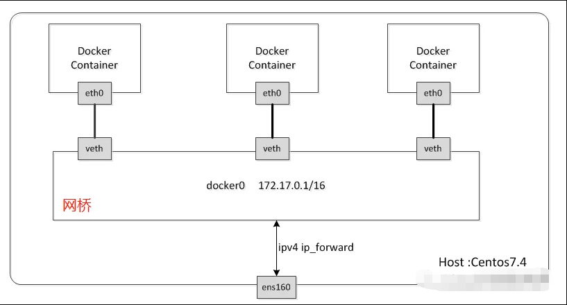
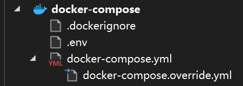
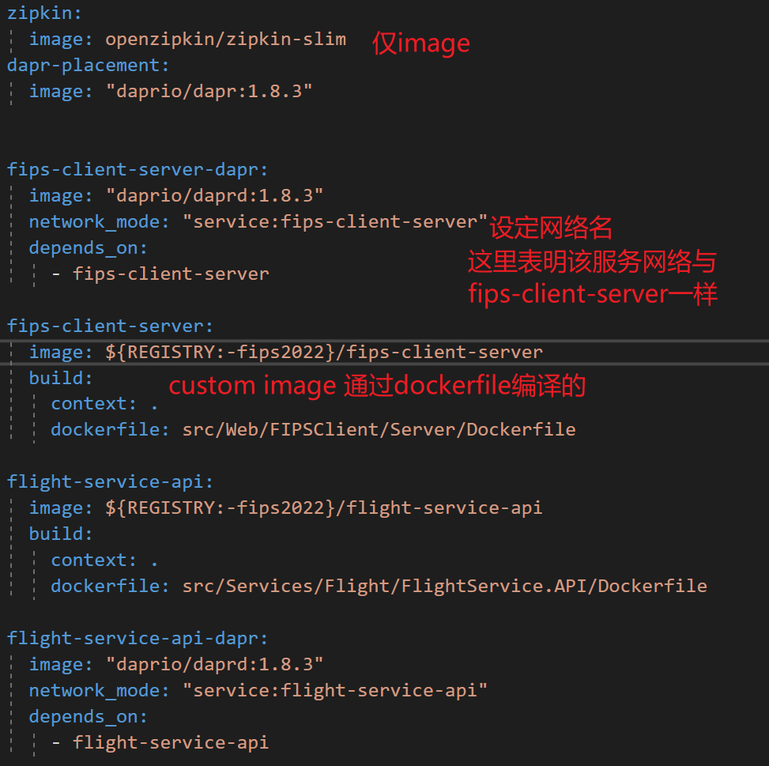
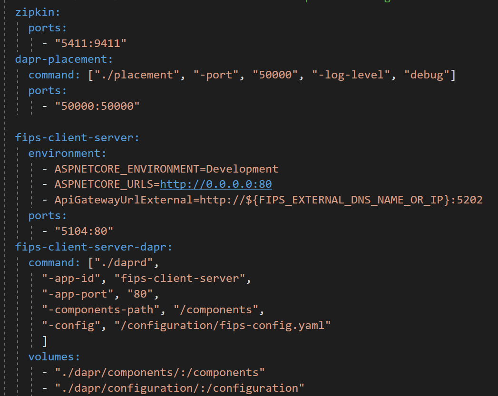
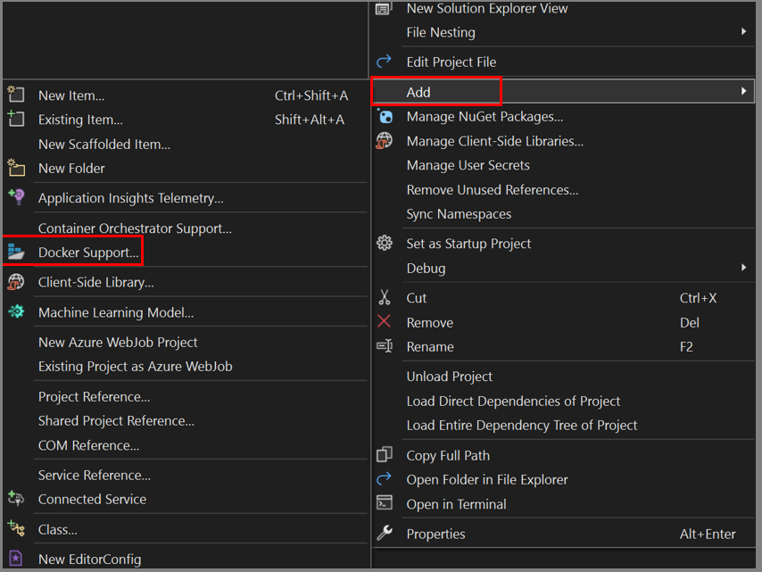

# 概念

就是将自己的程序以及运行它所需的一切环境依赖等等封装成一个包，开箱即用。 

在Docker的世界里，这个包叫做Image（镜像）。<span style="color:#0070c0">它可以看作是一个虚拟机镜像，已经装好了运行程序所需的所有依赖。</span>

通过Image实例化出一个Container（容器），启动容器就是启动了自己的程序。<span style="color:#0070c0">就像是使用了虚拟机镜像并开机。</span>

Docker平台对容器提供了一系列功能，最终实现CI/CD。

Docker虽然像虚拟机，但差别还是很大。简单来说，它是轻量级的虚拟化，没有打包操作系统进去，而是直接使用了宿主机的操作系统。



## Docker Engine

Docker Engine is an open-source containerization technology for building and containerizing your applications. Docker Engine acts as a client-server application with:

A server with a long-running daemon process dockerd.

APIs which specify interfaces that programs can use to talk to and instruct the Docker daemon.

A command line interface (CLI) client docker.

### 概述

Docker是CS架构体系。

Docker使用的是CLI式的客户端去对运行的Docker服务（The Docker daemon or dockerd，which does the heavy lifting of building, running, and distributing your Docker containers）做一系列操作，服务本身提供了一系列的操作接口，以供客户但调用。



### The Docker daemon（守护进程）

The Docker daemon (dockerd) listens for Docker API requests and manages Docker objects such as images, containers, networks, and volumes. A daemon can also communicate with other daemons to manage Docker services.

### The Docker client

The Docker client (docker) is the primary way that many Docker users interact with Docker. When you use commands such as docker run, the client sends these commands to dockerd, which carries them out. The docker command uses the Docker API. The Docker client can communicate with more than one daemon.

### Docker Desktop

Docker Desktop is an easy-to-install application for your Mac or Windows environment that enables you to build and share containerized applications and microservices. Docker Desktop includes the Docker daemon (dockerd), the Docker client (docker), Docker Compose, Docker Content Trust, Kubernetes, and Credential Helper.

### Docker registries

（类比GitHub）

A Docker registry stores **Docker images**. Docker Hub is a public registry that anyone can use, and Docker is configured to look for images on Docker Hub by default. You can even run your own private registry.

When you use the docker pull or docker run commands, the required images are pulled from your configured registry. When you use the docker push command, your image is pushed to your configured registry.

### Docker objects

When you use Docker, you are creating and using images, containers, networks, **volumes**, plugins, and other objects. This section is a brief overview of some of those objects.

### Images

An image is a read-only template with instructions for creating a Docker container. **Often, an image is based on another image, with some additional customization.** For example, you may build an image which is based on the ubuntu image, but installs the Apache web server and your application, as well as the configuration details needed to make your application run.

You might create your own images, or you might only use those created by others and published in a registry. To build your own image, you create a Dockerfile with a simple syntax for defining the steps needed to create the image and run it. Each instruction in a Dockerfile creates a layer in the image. When you change the Dockerfile and rebuild the image, only those layers which have changed are rebuilt. This is part of what makes images so lightweight, small, and fast, when compared to other virtualization technologies.

简单理解，Image类比到“类”，dockerFile是类的构造函数，Container就是实例化的Image。而也像类一样，经常进行继承操作，也就是基于某个已经完善的类继续构建类。

### Containers

A container is **a runnable instance of an image**. You can create, start, stop, move, or delete a container using the Docker API or CLI. You can connect a container to one or more networks, attach storage to it, or even create a new image based on its current state.

By default, **a container is relatively well isolated from other containers and its host machine**（意味着要连接宿主机需要做端口映射）. You can control how isolated a container’s network, storage, or other underlying subsystems are from other containers or from the host machine.

A container is defined by its image as well as any configuration options you provide to it when you create or start it. When a container is removed, any changes to its state that are not stored in persistent storage disappear.

### The underlying technology

Docker is written in the **Go** programming language and takes advantage of several features of the Linux kernel to deliver its functionality. Docker uses a technology called **namespaces** to provide the isolated workspace called the container. When you run a container, Docker creates a set of namespaces for that container.

These namespaces provide a layer of isolation. Each aspect of a container runs in a separate namespace and its access is limited to that namespace

# 命令

You can combine single character flags to shorten the full command.

即

`docker run -t -i` 可以简写为`-it`

`-d -p 80:80` 可以简写为 `-dp 80:80`

| 命令                                | 含义                                                         | 备注                                                         |
| :---------------------------------- | :----------------------------------------------------------- | :----------------------------------------------------------- |
|`build -t <name> .`|建造Image，通过指定目录（这里`.`指示当前目录）下的Docker file <br />`-t tag` 给建造的Image起个名| `--build-arg http_proxy=http://proxy.exaple.com` <br />`--build-arg https_proxy=http://proxy.exaple.com`<br /> **可以指定代理**<br /> `-f` 可以指定Dockerfile的位置。一般情况是在Dockerfile所在文件夹中运行build。但VS生成的Dockerfile，则需要在sln文件夹下，然后用`-f`指定Dockerfile位置。 |
| `exec -it <container> /bin/sh`   | 启动并进入容器内部                                           | 与`run`的区别是`exec`是启动或连接到已经存在/运行的容器中去。 而`run`是对于还未创建的新容器而言，即`run`是需要传image |
| `cp <from> <to>`  | 文件导入导出                                                 | 容器内部路径的写法`8592134a642d:/folder`                     |
| `run -i -t ubuntu /bin/bash`        | 从指定Image（这里是ubuntu）中实例化出一个新的容器并运行。<br /> `-d run as detached` 如需要Long-running 的服务，放在后台运行。 <br />`-p 8080:80` 将本机8080端口映射到容器的80端口 （如果要暴露多个，可以多写几个-p映射） <br />`--name` 给实例化的新容器起个名，不然docker会随机起名 <br />`--privileged=true` 以特权模式运行，可以执行`systemctl`等命令(需要以`/sbin/init`启动然后再用`exec`命令进入容器) <br />`--rm` flag tells Docker to automatically remove the container when it exits <br />`-e XXX=’xxx’` 设置环境变量 | ①If you do not have the `ubuntu` image locally, Docker pulls it from your configured registry, as though you had run docker pull ubuntu manually.<br />②Docker creates a new container, as though you had run a docker container create command manually.<br/>③Docker allocates a read-write filesystem to the container, as its final layer. This allows a running container to create or modify files and directories in its local filesystem.<br />④Docker creates a network interface to connect the container to the default network, since you did not specify any networking options. This includes assigning an IP address to the container. By default, containers can connect to external networks using the host machine’s network connection.<br />⑤Docker starts the container and executes `/bin/bash`. Because the container is running **interactively** and attached to your terminal (due to the `-i` and `-t` flags), you can provide input using your keyboard while the output is logged to your terminal.<br />⑥When you type exit to terminate the `/bin/bash` command, the container stops but is not removed. You can start it again or remove it. |
| `images`                            | 列出当前已有的`images`                                       |                                                              |
| `commit \<container\> [image]`      | 将指定容器更改保存到新镜像 <br />Create a new image from a container’s changes |                                                              |
| `ps`                                | processes <br />当前运行的容器 <br />`-a` 显示所有包括未运行的. | `--size` 显示当前容器占用空间大小                            |
| `logs <container>` | 查看容器日志 `-f follow`，追踪当前容器的输出                 | 比如使用了`-detached`参数启动在后台运行的容器，要看它的输出可以使用该命令 |
| `rm <container>`  | 移除容器 <br />`-f force` 强制移除容器，即使它在运行         | Once the container has stopped, it can be removed.           |
| `rmi <image>`                     | 移除镜像                                                     |                                                              |
| `stop <container>`                | 停止运行一个容器                                             |                                                              |
| `push <docker hub repository name>` | 推送image到docker hub                                        |                                                              |
| `pull <docker hub repository name>` | 拉取image到本地                                              |                                                              |
| `update`                            | 更新配置？                                                   | `--restart=no <CONTAINER ID>` 对某一个容器关闭自启动<br />`--restart=no $(docker ps -q)` 取消所有容器自启动 |
| `export`                            | 导出容器实例                                                 | 主要用来制作基础镜像，比如我们从一个 ubuntu 镜像启动一个容器，然后安装一些软件和进行一些设置后，使用 `docker export` 保存为一个基础镜像。然后，把这个镜像分发给其他人使用，比如作为基础的开发环境。 |
| `import`                            | 导入容器实例                                                 |                                                              |
| `save`                              | 保存镜像                                                     | `-o` 导出的路径 建议.tar结尾 可以同时将多个镜像打包到一个文件中 |
| `load`                              | 加载镜像                                                     | `-i` 输入文件路径                                            |

#### 运行轻量级程序

对于一些CLI程序的容器而言，可以这样去使用他们： `docker run -it --rm remnux/ciphey --help` ，其中的 `--help` 就是指示的它是进入了容器后执行的。

# 扩展

## Docker File

## Docker Network

### Drivers

也是容器可用的网络种类

#### bridge



创建的容器默认都是这种模式(default bridge driver)，和主机通过docker生成的虚拟网桥连接起来。容器之间和主机之间可以互相通过ip访问。

如果是用户定义的bridge(user-defined bridge)，**则默认可以通过容器名互相访问**。

If you are using Docker on MacOS or Windows 18.03+, you can connect to the magic hostname `host.docker.internal`.

如果是WSL2，host会有相应的虚拟网卡，通过`ipconfig`可以看到虚拟ip。容器也可以通过该ip访问到宿主机。(但有时候好像又不行)

注意`host.docker.internal`和wsl虚拟的ip不一致但都能访问到宿主机。

#### host

直接使用宿主机网络，即就像是运行在宿主机上的服务。

### 命令

| 命令                                              | 含义                     | 备注                                                                                                |
|---------------------------------------------------|--------------------------|-----------------------------------------------------------------------------------------------------|
| `network ls`                                      | 列出所有创建的网络       |                                                                                                     |
| `network inspect <network-id>`                  | 查看网络信息             | 可以看到当前网络有哪些容器加入。 想要看某个容器加入了什么网络，使用`docker inspect <container-id>` |
| `network create <network-name>`                 | 创建一个`user-defined`网络 | 默认是创建`user-defined bridge`网络                                                                 |
| `network connect <network-name> <container>`  | 连接一个现有的容器到网络 |                                                                                                     |
|`network disconnect <network-name> <container>`|  |  |

## Docker Storage

If you want to persist data in Docker, the recommended way is to use Docker Volumes. Without the use of Docker Volumes, the **writeable layer** of your Docker Container is removed from your Host as soon as you remove the Docker Container. But a Docker Volume is a separate Docker Object, which is not removed when you remove a Docker Container.

Volumes可以看作是独立出来的一个writeable layer，它在容器管理之外（有自己的管理方法），它可以在容器创建的时候设置映射，将容器内的某个目录映射到指定的volume中去。


| Type         | Explanation                                                  |
| ------------ | ------------------------------------------------------------ |
| Volumes      | Volumes are stored in a part of the host filesystem which is managed by Docker (`/var/lib/docker/volumes/` on Linux). Non-Docker processes should not modify this part of the filesystem. Volumes are the best way to persist data in Docker. |
| Bind mounts  | Bind mounts may be stored anywhere on the host system. They may even be important system files or directories. Non-Docker processes on the Docker host or a Docker container can modify them at any time. |
| tmpfs mounts | tmpfs mounts are stored in the host system’s memory only, and are never written to the host system’s filesystem. |

### Docker Volume

**Created and managed** by Docker.

Volumes provide the ability to connect specific filesystem paths of the container back to the host machine. If a directory in the container is mounted, changes in that directory are also seen on the host machine.

它可以映射（挂载mounting）容器目录到宿主机的特定目录

它的路径由docker自己决定，在创建容器时，`-v`的使用方式是`my-volume:/usr/local/data`

### Bind mounts

The file or directory does not need to exist on the Docker host already. It is created on demand if it does not yet exist（但如果使用mount，则不会自动创建，而是error）

路径由自己控制，`-v /path/to/data:/usr/local/data`，可以使用relative path.

windows下，也可以使用Unix-style path

`C:\Users\user\work` -\> `/c/Users/user/work`

### 命令

| 命令                                                         | 含义                                                         | 备注                                                         |
| ------------------------------------------------------------ | ------------------------------------------------------------ | ------------------------------------------------------------ |
| `volume create <volume name>`                              | 创建一个volume对象                                           |                                                              |
| `volume ls`                                                  | 列出拥有的volume对象                                         |                                                              |
| `volume inspect <volume name>`                             | 查看volume对象信息                                           | Mountpoint就是实际映射到的url，具体与driver有关。 当driver是local，即挂载到宿主机（windows的是在docker VM上）。 |
| `volume prune`                                               | 移除未使用的Volume                                           | As long as volumes are associated with a container (either running or not), they cannot be removed. |
| `docker run -e ‘ACCEPT_EULA=Y’ -e ‘SA_PASSWORD=passw0rd1!’ -p 1433:1433 –name sql2019 -v sql_volume:/var/opt/mssql -d mcr.microsoft.com/mssql/server:2019-GA-ubuntu-16.04` | 其中`-v`是设置容器中`/var/opt/mssql`目录挂载到sql_volume，即容器对于该目录任何read-write操作将会直接作用在sql_volume上。 | `-v 名字(docker volumn)或目录(bind mounts):容器目录 ` 比较容易使用 <br />官方建议使用`--mount`  `--mount type=bind,source=/tmp,target=/usr` 最大区别在于显式与隐式。 |


## Docker Compose

使用.yml文件，整合多个创建镜像的dockerfile文件，并配置镜像，如端口映射、容器名称等

### Visual studio 集成



`.env` 文件里面可以定义全局的环境变量`VARIABLE_NAME=XXX`

然后在`docker-compose.yml`等文件中可以`${VARIABLE_NAME}`这样使用。

还有dapr中namespace环境变量的作用：


```env
# If the NAMESPACE env var is set, Dapr does not load any
# component that does not specify the same namespace.
NAMESPACE=fips
```

`docker-compose.yml`中定义的是镜像及网络



`docker-compose.override.yml`中定义的是配置。

注意使用 服务名:端口 中的端口是容器内部实际端口（即ports的右边那个），而不是对外暴露的映射主机的端口(还未确定)



### docker-compose.yml文件

其中服务使用Volume时候，可以有四种写法：

1.Relative Path

2.Absolute Path

3.Docker Volume Default Path

4.Docker Volume with Absolute Path

<https://stackoverflow.com/a/46910980/18731746>

其中Relative Path在windows中，使用./xxx开头，实际上是相对于指定的docker-compose.yaml文件所在文件夹中。

### 命令

| 命令 | 含义 | 备注 |
|------|------|------|
|      |      |      |
|      |      |      |
|      |      |      |
|      |      |      |
|      |      |      |
|      |      |      |

# 错误排查

#### docker.errors.DockerException: Error while fetching server API version: ('Connection aborted.', FileNotFoundError(2, 'No such file or directory'))

原因是 docker 没有启动

开启docker: `systemctl start docker`

查看docker 进程 `ps -ef | grep docker`

最后执行`docker-compose up -d`

#### win10 docker启动后检查版本报错

```log
Docker.Core.Backend.BackendException:

Error response from daemon: open \.\pipe\docker_engine_linux: The system cannot find the file specified.
```

在win10 命令行提示符执行：

```sh
net stop com.docker.service
net start com.docker.service
```

#### Failed to get D-Bus connection: Operation not permitted
centos无法使用systemctl等，需要创建容器的时候，使用特权模式。

Docker的设计理念是在容器里面不运行后台服务，容器本身就是宿主机上的一个独立的主进程，也可以间接的理解为就是容器里运行服务的应用进程。一个容器的生命周期是围绕这个主进程存在的，所以正确的使用容器方法是将里面的服务运行在前台。

再说到systemd，这个套件已经成为主流Linux发行版（比如CentOS7、Ubuntu14+）默认的服务管理，取代了传统的SystemV风格服务管理。systemd维护系统服务程序，它需要特权去会访问Linux内核。而容器并不是一个完整的操作系统，只有一个文件系统，而且默认启动只是普通用户这样的权限访问Linux内核，也就是没有特权，所以自然就用不了！

因此，请遵守容器设计原则，一个容器里运行一个前台服务！

我就想这样运行，难道解决不了吗？

答：可以，以特权模式创建镜像。

```sh
# 创建容器：
docker run -d -it --name xxxx --privileged=true {Image ID} /sbin/init

# 还有说是/user/sbin/init，不知道是哪个

# 进入容器：
docker exec -it centos7 /bin/bash
```

这样可以使用systemctl启动服务了。
# Visual Studio 集成

visual studio 中自动Build生成的镜像无法离开VS而生效。

<https://docs.microsoft.com/en-us/visualstudio/containers/edit-and-refresh?view=vs-2022>

是不是因为没有dot net .dll启动 entry point导致直接退出

## 部署到Docker

### 使用Publish到文件夹

先使用vs的publish功能到指定文件夹，然后在那个文件夹，创建Dockerfile，写命令，构建镜像。

参考asp.net 6的Dockerfile

```dockerfile
FROM mcr.microsoft.com/dotnet/aspnet:6.0
WORKDIR /app
COPY . .
EXPOSE 80
EXPOSE 443
ENTRYPOINT ["dotnet", "QuestionnaireReport.dll"]
```

### 使用Publish到镜像仓库

## 错误排查

#### Cannot use file stream for \[\*.deps.json\]: No such file or directory

删除publish文件夹再次publish

#### Resharper Build时，Docker compose总不成功

截至Resharper 2022.2.3 似乎不太支持？因为不会重新构建容器。

换用VSbuild即可以Docker Compose运行。

#### Unable to find the target operating system for the project

重新用其他配置运行一下，然后再回到docker配置运行，就发现可以了（迷惑）

#### Docker - failed to compute cache key: not found - runs fine in Visual Studio

.net core 及5以上 需要在.sln文件夹下（或在项目文件夹下使用docker build .. -f Dockerfile）使用docker build .，然后用-f指定Dockerfile位置。

.net framework是在项目目录下

#### No packages exist with this id in source(s): nuget.org

<https://stackoverflow.com/questions/48821991/dockerfile-cant-see-local-file-or-private-nuget-server>

Copying the Nuget.Config to the solution or project folder will work if your 'private nuget feed' is accessible via a url. But if the private feed is a local folder used as a nuget source, this approach will still fail with an error that the folder is outside the build context or simply because the Windows path does not get resolved by the Docker build process.

(但最后仍然失败了，用publish然后自己写dockerfile那个方法替代)

Nuget.Config 在 Users\\\${username}\\AppData\\Roaming\\NuGet下

#### 执行dockercompose后报UTF8问题

docker compose文件里面不能有中文

## 增加

You can add Docker support to an existing project by selecting Add \> Docker Support in Solution Explorer. The Add \> Docker Support and Add \> Container Orchestrator Support commands are located on the right-click menu (or context menu) of the project node for an ASP.NET Core project in Solution Explorer, as shown in the following screenshot:



