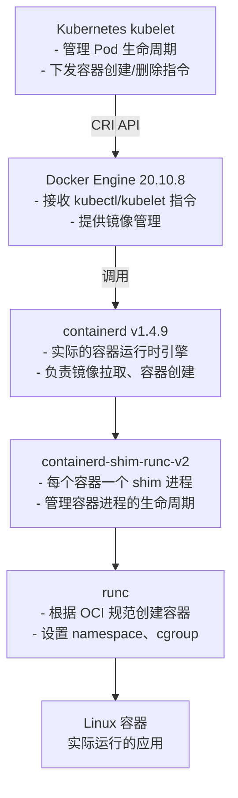
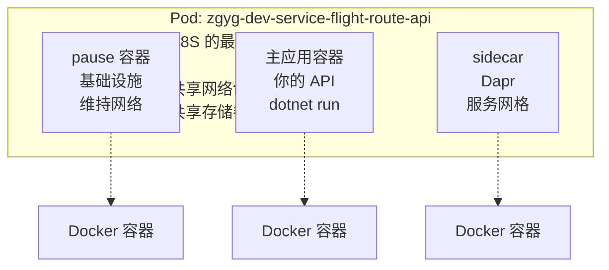

# Docker 与 K8S

## 为什么 Docker 能看到 K8S 的容器

### 你的环境架构

你的 K8S 集群使用的是这样的架构：



### 为什么 `docker ps` 能看到 K8S 容器？

因为：

#### 1. Docker 和 K8S 共用同一个 containerd

- Docker 命令行工具通过 containerd 查看容器
- K8S 也通过 containerd 创建容器
- 所以 `docker ps` 能看到所有容器

#### 2. 容器名称规则

```
k8s_<容器名>_<Pod名>_<命名空间>_<Pod UID>_<重启次数>
```

**示例：**

```
k8s_redis_zgyg-dev-component-redis-node-0_zgyg-fips-dev_7025439c-0a7f-43c8-b2bb-839c274ca4b1_777
│   │     │                                │              │                                      │
│   │     └─ Pod 名称                      │              └─ Pod 唯一 ID                        └─ 重启次数
│   └─ 容器名称                            └─ 命名空间
└─ K8S 标识
```

#### 3. 每个 Pod 还有 pause 容器

- 你会看到很多 `kubesphereio/pause:3.5` 容器
- 这是 K8S 的**基础设施容器**
- 作用：维持 Pod 的网络命名空间

### 实际案例：一个 K8S Pod 对应多个 Docker 容器

**K8S 视角：**

```bash
kubectl get pod -n zgyg-fips-dev
NAME: zgyg-dev-service-flight-route-api-5696ffd9d7-nlc79
READY: 2/2  # 表示 Pod 里有 2 个容器在运行
```

**Docker 视角（同一个 Pod 实际有 3 个 Docker 容器）：**

| 容器类型 | 容器 ID | 镜像 | 作用 |
|---------|---------|------|------|
| pause 容器（基础设施） | 4562b7de4e30 | kubesphereio/pause:3.5 | 维持 Pod 网络命名空间 |
| 主应用容器 | 28816c63d0ec | fipsv7-flightroute-service-api | 运行你的 .NET API |
| Dapr sidecar 容器 | d61024c3c8fd | daprd (f263b9833125) | 提供服务网格功能 |

### K8S Pod 架构图



## 关键概念总结

### 1. Docker 不是唯一选择

K8S 支持多种容器运行时（通过 CRI 接口）：

- **Docker**（通过 dockershim，已废弃）
- **containerd**（当前主流，Docker 底层也用它）
- **CRI-O**（Red Hat 推荐）
- **gVisor, kata-containers**（安全沙箱）

### 2. 你的环境使用的是 containerd

虽然命令行工具是 docker，但底层是 containerd：

```bash
# 你可以用 Docker 命令
docker ps

# 也可以用 containerd 原生命令（如果安装了 ctr）
ctr -n moby containers list

# 或者 K8S 的容器运行时工具 crictl（如果安装）
crictl ps
```

### 3. 为什么会混淆？

- **Docker** 是一个完整的工具集（CLI + API + containerd + 镜像构建）
- **containerd** 是纯粹的容器运行时
- **K8S** 只需要容器运行时，不需要 Docker 的其他功能
- 但 **Docker CLI** 仍然可以用来查看和管理容器

### 4. 管理建议

在 K8S 环境中：

✅ **推荐做法：**
- 使用 `kubectl` 管理应用
- 使用 `docker` 排查底层容器问题

❌ **不要做：**
- 不要用 `docker rm` 删除 K8S 容器（K8S 会重新创建）
- 不要用 `docker run` 启动应用（应该用 K8S Deployment）

### 5. 查看容器的正确方式

**K8S 层面：**

```bash
kubectl get pods -A
kubectl logs <pod-name>
kubectl exec -it <pod-name> -- bash
```

**Docker 层面（排查用）：**

```bash
docker ps
docker logs <container-id>
docker inspect <container-id>
```

## 总结

这就是为什么你在 `docker ps` 能看到所有 K8S 容器的原因！实际上它们都是同一个 containerd 进程管理的容器，只是 K8S 和 Docker 都能看到它们而已。
