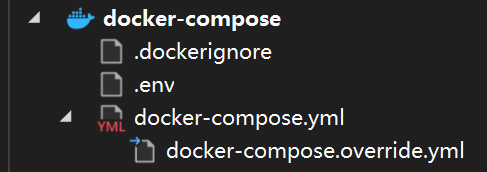

# Docker扩展

## Docker File

## Docker Network

### Drivers

也是容器可用的网络种类

#### bridge


创建的容器默认都是这种模式(default bridge driver)，和主机通过docker生成的虚拟网桥连接起来。容器之间和主机之间可以互相通过ip访问。

如果是用户定义的bridge(user-defined bridge)，**则默认可以通过容器名互相访问**。

If you are using `Docker` on `MacOS` or Windows 18.03+, you can connect to the magic hostname `host.docker.internal`.

如果是WSL2，host会有相应的虚拟网卡，通过`ipconfig`可以看到虚拟ip。容器也可以通过该ip访问到宿主机。(但有时候好像又不行)

注意`host.docker.internal`和wsl虚拟的ip不一致但都能访问到宿主机。

#### host

直接使用宿主机网络，即就像是运行在宿主机上的服务。

### 命令

| 命令 | 含义 | 备注 |
|------|------|------|
| `network ls` | 列出所有创建的网络 | |
| `network inspect <network-id>` | 查看网络信息 | 可以看到当前网络有哪些容器加入。 想要看某个容器加入了什么网络，使用`docker inspect <container-id>` |
| `network create <network-name>` | 创建一个`user-defined`网络 | 默认是创建`user-defined bridge`网络 |
| `network connect <network-name> <container>` | 连接一个现有的容器到网络 | |
| `network disconnect <network-name> <container>` | | |

## Docker Storage

If you want to persist data in `Docker`, the recommended way is to use `Docker Volumes`. Without the use of `Docker Volumes`, the **writeable layer** of your `Docker Container` is removed from your Host as soon as you remove the `Docker Container`. But a `Docker Volume` is a separate `Docker Object`, which is not removed when you remove a `Docker Container`.

`Volumes`可以看作是独立出来的一个writeable layer，它在容器管理之外（有自己的管理方法），它可以在容器创建的时候设置映射，将容器内的某个目录映射到指定的volume中去。


| Type | Explanation |
| ---- | ----------- |
| Volumes | Volumes are stored in a part of the host filesystem which is managed by Docker (`/var/lib/docker/volumes/` on Linux). Non-Docker processes should not modify this part of the filesystem. Volumes are the best way to persist data in Docker. |
| Bind mounts | Bind mounts may be stored anywhere on the host system. They may even be important system files or directories. Non-Docker processes on the Docker host or a Docker container can modify them at any time. |
| tmpfs mounts | tmpfs mounts are stored in the host system's memory only, and are never written to the host system's filesystem. |

### Docker Volume

**Created and managed** by `Docker`.

`Volumes` provide the ability to connect specific filesystem paths of the container back to the host machine. If a directory in the container is mounted, changes in that directory are also seen on the host machine.

它可以映射（挂载mounting）容器目录到宿主机的特定目录

它的路径由docker自己决定，在创建容器时，`-v`的使用方式是`my-volume:/usr/local/data`

### Bind mounts

The file or directory does not need to exist on the `Docker` host already. It is created on demand if it does not yet exist（但如果使用mount，则不会自动创建，而是error）

路径由自己控制，`-v /path/to/data:/usr/local/data`，可以使用relative path.

windows下，也可以使用Unix-style path

`C:\Users\user\work` -> `/c/Users/user/work`

### 命令

| 命令 | 含义 | 备注 |
| ---- | ---- | ---- |
| `volume create <volume name>` | 创建一个volume对象 | |
| `volume ls` | 列出拥有的volume对象 | |
| `volume inspect <volume name>` | 查看volume对象信息 | Mountpoint就是实际映射到的url，具体与driver有关。 当driver是local，即挂载到宿主机（windows的是在docker VM上）。 |
| `volume prune` | 移除未使用的Volume | As long as volumes are associated with a container (either running or not), they cannot be removed. |
| `docker run -e 'ACCEPT_EULA=Y' -e 'SA_PASSWORD=passw0rd1!' -p 1433:1433 –name sql2019 -v sql_volume:/var/opt/mssql -d mcr.microsoft.com/mssql/server:2019-GA-ubuntu-16.04` | 其中`-v`是设置容器中`/var/opt/mssql`目录挂载到sql_volume，即容器对于该目录任何read-write操作将会直接作用在sql_volume上。 | `-v 名字(docker volumn)或目录(bind mounts):容器目录 ` 比较容易使用 <br />官方建议使用`--mount`  `--mount type=bind,source=/tmp,target=/usr` 最大区别在于显式与隐式。 |

## Docker Compose

使用`.yml`文件，整合多个创建镜像的dockerfile文件，并配置镜像，如端口映射、容器名称等

### Visual studio 集成



`.env` 文件里面可以定义全局的环境变量`VARIABLE_NAME=XXX`

然后在`docker-compose.yml`等文件中可以`${VARIABLE_NAME}`这样使用。

还有dapr中namespace环境变量的作用：

```env
# If the NAMESPACE env var is set, Dapr does not load any
# component that does not specify the same namespace.
NAMESPACE=fips
```

`docker-compose.yml`中定义的是镜像及网络


`docker-compose.override.yml`中定义的是配置。

注意使用 服务名:端口 中的端口是容器内部实际端口（即ports的右边那个），而不是对外暴露的映射主机的端口(还未确定)


### docker-compose.yml文件

其中服务使用Volume时候，可以有四种写法：

1. Relative Path
2. Absolute Path
3. Docker Volume Default Path
4. Docker Volume with Absolute Path

[Stack Overflow - Docker Compose volume types](https://stackoverflow.com/a/46910980/18731746)

其中Relative Path在windows中，使用`./xxx`开头，实际上是相对于指定的`docker-compose.yaml`文件所在文件夹中。

### 命令

| 命令 | 含义 | 备注 |
|------|------|------|
|      |      |      |
|      |      |      |
|      |      |      |
|      |      |      |
|      |      |      |
|      |      |      |