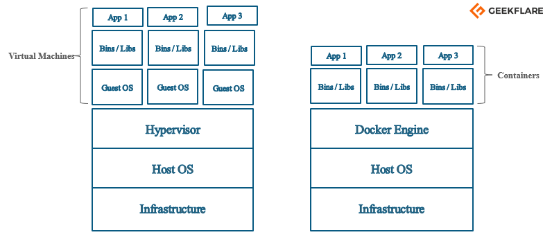

# Docker概念与引擎

## 概念

就是将自己的程序以及运行它所需的一切环境依赖等等封装成一个包，开箱即用。

在`Docker`的世界里，这个包叫做`Image`（镜像）。它可以看作是一个虚拟机镜像，已经装好了运行程序所需的所有依赖。

通过`Image`实例化出一个`Container`（容器），启动容器就是启动了自己的程序。就像是使用了虚拟机镜像并开机。

`Docker`平台对容器提供了一系列功能，最终实现`CI/CD`。

`Docker`虽然像虚拟机，但差别还是很大。简单来说，它是轻量级的虚拟化，没有打包操作系统进去，而是直接使用了宿主机的操作系统。

## Docker Engine

`Docker Engine` is an open-source containerization technology for building and containerizing your applications. `Docker Engine` acts as a client-server application with:

- A server with a long-running daemon process `dockerd`.
- `APIs` which specify interfaces that programs can use to talk to and instruct the `Docker` daemon.
- A command line interface (CLI) client `docker`.

### 概述

`Docker`是CS架构体系。

`Docker`使用的是CLI式的客户端去对运行的`Docker`服务（The `Docker` daemon or `dockerd`，which does the heavy lifting of building, running, and distributing your `Docker` containers）做一系列操作，服务本身提供了一系列的操作接口，以供客户但调用。

### The Docker daemon（守护进程）

The `Docker` daemon (`dockerd`) listens for `Docker API` requests and manages `Docker` objects such as images, containers, networks, and volumes. A daemon can also communicate with other daemons to manage `Docker` services.

### The Docker client

The `Docker` client (`docker`) is the primary way that many `Docker` users interact with `Docker`. When you use commands such as `docker run`, the client sends these commands to `dockerd`, which carries them out. The `docker` command uses the `Docker API`. The `Docker` client can communicate with more than one daemon.

### Docker Desktop

`Docker Desktop` is an easy-to-install application for your Mac or Windows environment that enables you to build and share containerized applications and microservices. `Docker Desktop` includes the `Docker` daemon (`dockerd`), the `Docker` client (`docker`), `Docker Compose`, `Docker Content Trust`, `Kubernetes`, and `Credential Helper`.

### Docker registries

（类比`GitHub`）

A `Docker` registry stores **`Docker` images**. `Docker Hub` is a public registry that anyone can use, and `Docker` is configured to look for images on `Docker Hub` by default. You can even run your own private registry.

When you use the `docker pull` or `docker run` commands, the required images are pulled from your configured registry. When you use the `docker push` command, your image is pushed to your configured registry.

### Docker objects

When you use `Docker`, you are creating and using images, containers, networks, **volumes**, plugins, and other objects. This section is a brief overview of some of those objects.

### Images

An image is a read-only template with instructions for creating a `Docker` container. **Often, an image is based on another image, with some additional customization.** For example, you may build an image which is based on the `ubuntu` image, but installs the `Apache` web server and your application, as well as the configuration details needed to make your application run.

You might create your own images, or you might only use those created by others and published in a registry. To build your own image, you create a `Dockerfile` with a simple syntax for defining the steps needed to create the image and run it. Each instruction in a `Dockerfile` creates a layer in the image. When you change the `Dockerfile` and rebuild the image, only those layers which have changed are rebuilt. This is part of what makes images so lightweight, small, and fast, when compared to other virtualization technologies.

简单理解，`Image`类比到"类"，`dockerFile`是类的构造函数，`Container`就是实例化的`Image`。而也像类一样，经常进行继承操作，也就是基于某个已经完善的类继续构建类。

### Containers

A container is **a runnable instance of an image**. You can create, start, stop, move, or delete a container using the `Docker API` or CLI. You can connect a container to one or more networks, attach storage to it, or even create a new image based on its current state.

By default, **a container is relatively well isolated from other containers and its host machine**（意味着要连接宿主机需要做端口映射）. You can control how isolated a container's network, storage, or other underlying subsystems are from other containers or from the host machine.

A container is defined by its image as well as any configuration options you provide to it when you create or start it. When a container is removed, any changes to its state that are not stored in persistent storage disappear.

### The underlying technology

`Docker` is written in the **`Go`** programming language and takes advantage of several features of the `Linux` kernel to deliver its functionality. `Docker` uses a technology called **`namespaces`** to provide the isolated workspace called the container. When you run a container, `Docker` creates a set of `namespaces` for that container.

These `namespaces` provide a layer of isolation. Each aspect of a container runs in a separate namespace and its access is limited to that namespace