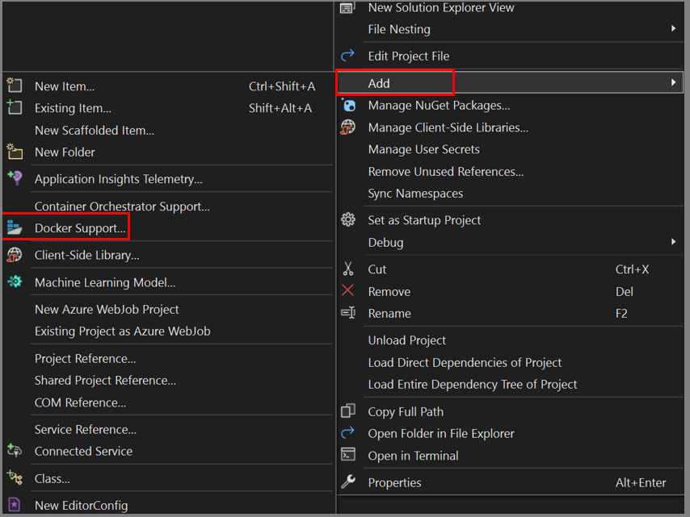

# Visual Studio集成

`Visual Studio` 中自动Build生成的镜像无法离开VS而生效。

[Visual Studio - Edit and refresh](https://docs.microsoft.com/en-us/visualstudio/containers/edit-and-refresh?view=vs-2022)

是不是因为没有dot net `.dll`启动 entry point导致直接退出


## 部署到Docker

### 使用Publish到文件夹

先使用vs的publish功能到指定文件夹，然后在那个文件夹，创建`Dockerfile`，写命令，构建镜像。

参考`asp.net 6`的`Dockerfile`

```dockerfile
FROM mcr.microsoft.com/dotnet/aspnet:6.0
WORKDIR /app
COPY . .
EXPOSE 80
EXPOSE 443
ENTRYPOINT ["dotnet", "QuestionnaireReport.dll"]
```

### 使用Publish到镜像仓库


## 错误排查

### Failed to start Docker Application Container Engine.

查看日志
```bash
sudo journalctl -u docker.service
```
发现是配置问题：
```log
Apr 26 14:29:15 lavm-xi6x7kk6zz systemd[1]: docker.service: Consumed 27min 196ms CPU time. -- Boot 5cd1554dd89e43c582bcbfe75e1facfa -- Apr 26 14:30:14 lavm-xi6x7kk6zz systemd[1]: Starting Docker Application Container Engine... Apr 26 14:30:14 lavm-xi6x7kk6zz dockerd[820]: unable to configure the Docker daemon with file /etc>
```

少了逗号
```json
cat /etc/docker/daemon.json
```

### The "Configuration" parameter is not supported by the "WaitForWarmupCompletion" task loaded from assembly: Microsoft.VisualStudio.Containers.Tools.Tasks

似乎是bug，如果多个项目引用了不同的 `Container.Tools.Targets` 包，就有可能导致该问题。
`Version=17.0.0.0, Culture=neutral, PublicKeyToken=b03f5f7f11d50a3a from the path: xxxxxxxxxxxxx\microsoft.visualstudio.azure.containers.tools.targets\1.19.4\tools\Microsoft.VisualStudio.Containers.Tools.Tasks.dll. Verify that the parameter exists on the task, the <UsingTask> points to the correct assembly, and it is a settable public instance property.`
出现后需要拉齐包版本，去提示的目录下删除那个版本的库，然后重新启动vs。

### Cannot use file stream for [*.deps.json]: No such file or directory

删除publish文件夹再次publish

### Resharper Build时，Docker compose总不成功

截至`Resharper 2022.2.3` 似乎不太支持？因为不会重新构建容器。

换用VSbuild即可以`Docker Compose`运行。

### Unable to find the target operating system for the project

重新用其他配置运行一下，然后再回到docker配置运行，就发现可以了（迷惑）

### Docker - failed to compute cache key: not found - runs fine in Visual Studio

`.net core` 及5以上 需要在`.sln`文件夹下（或在项目文件夹下使用`docker build .. -f Dockerfile`）使用`docker build .`，然后用`-f`指定`Dockerfile`位置。

`.net framework`是在项目目录下

### No packages exist with this id in source(s): nuget.org

[Stack Overflow - Dockerfile can't see local file or private nuget server](https://stackoverflow.com/questions/48821991/dockerfile-cant-see-local-file-or-private-nuget-server)

Copying the `Nuget.Config` to the solution or project folder will work if your 'private nuget feed' is accessible via a url. But if the private feed is a local folder used as a nuget source, this approach will still fail with an error that the folder is outside the build context or simply because the Windows path does not get resolved by the Docker build process.

(但最后仍然失败了，用publish然后自己写dockerfile那个方法替代)

`Nuget.Config` 在 `Users\${username}\AppData\Roaming\NuGet`下

### 执行dockercompose后报UTF8问题

docker compose文件里面不能有中文

### 执行后无限等待，CANCELED [xxx internal] load build context

docker compose中镜像构建的 context 文件找不到，可能是路径写错或者没创建相应的`Dockerfile`。

### The path must be absolute.
[Regression: "The path must be absolute." on Linux · Issue #38175 · dotnet/aspnetcore (github.com)](https://github.com/dotnet/aspnetcore/issues/38175)
将Development的容器环境变量换成Production即可。似乎是Bug。

### Failed to create CoreCLR
`.NET 8` 在另外的机器上跑同个镜像失败。原因是docker engine版本过低，20需升级到23以上。

### Docker compose起来后边车无法连接RabbitMQ
`rabbitMQ`还没起来，边车就去访问了，需要用depends on解决先后顺序。

### Can not find the container with the name starting with XXX
检查是否是以 `Release` 模式运行，而又禁用了 `Release` 的容器运行

## 增加

You can add Docker support to an existing project by selecting Add > Docker Support in Solution Explorer. The Add > Docker Support and Add > Container Orchestrator Support commands are located on the right-click menu (or context menu) of the project node for an ASP.NET Core project in Solution Explorer, as shown in the following screenshot:

