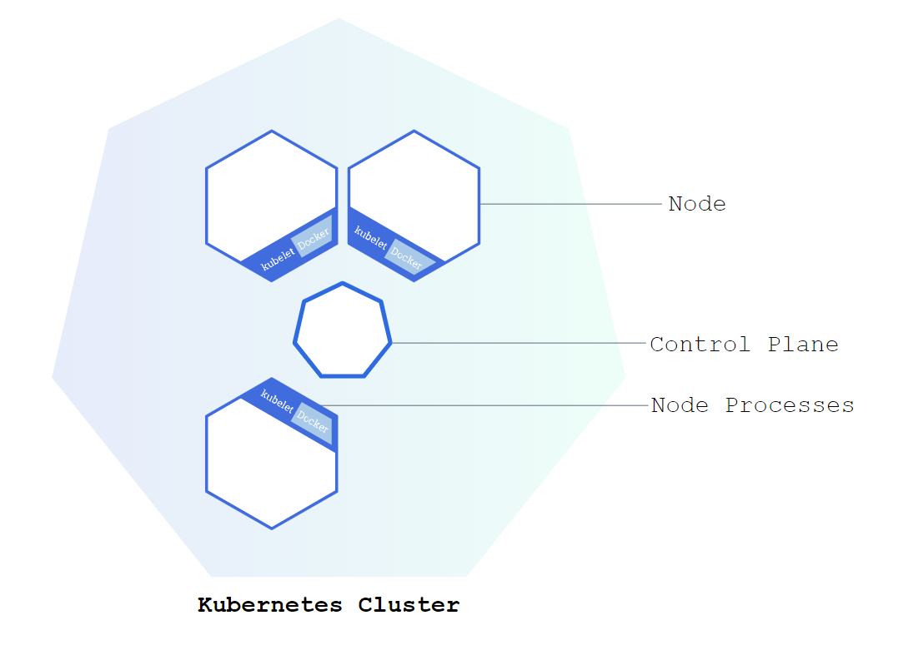
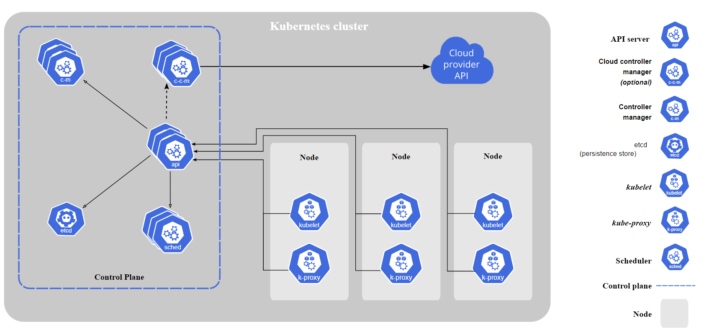
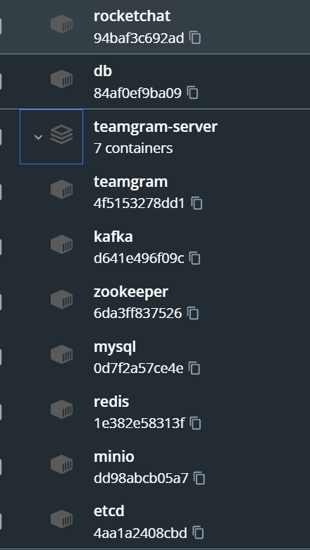
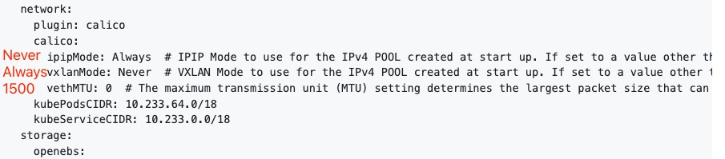

# Kubernetes (K8S)

`Kubernetes`（编排工具）用于容器编排。

部署一个`Kubernetes`，实际上就是部署了一个`Cluster`。



`Kubernetes`每个实例是以`Cluster`为单位的。每个`Work Node`（`VM`或物理机）中有`Kubelet`，即一个`agent`，由`Control Plane`进行中心化调度管理（由`Master Node`组成）。



用户可以通过`Kubectl`（`Kubernetes Client`），通过它调用`Kubernetes`的`API`进行管理。

一个`k8s`集群，可以通过`namespace`区分区域。

## 网络

在`K8S`中，同一个命名空间（`namespace`）下的服务之间调用，之间通过服务名（`service name`）调用即可。不过在更多时候，我们可能会将一些服务单独隔离在一个命名空间中（比如我们将中间件服务统一放在`middleware`命名空间中，将业务服务放在`business`命名空间中）。

遇到这种情况，我们就需要跨命名空间访问，`K8S`对`service`提供了四种不同的类型，针对这个问题我们选用`ExternalName`类型的`service`即可。

注意`service`端口是否开对

### DNS

> 1. k8s 中有 namespace 的概念，由于不同的 namespace 中可以有同样名称的 service or pod，因此 DNS 解析的部份就需要考虑 namespace
> 2. k8s cluster domain name，若是未设定，预设就会是 `cluster.local`

#### 种类

##### Service DNS
基本格式：
`<service-name>.<namespace-name>.svc.<cluster domain name>`

##### Pod DNS
基本格式：
`<pod-ip-address>.<namespace-name>.pod.<cluster domain name>`

#### 排查DNS问题

使用 `busybox` 镜像临时创建一个 `Pod` 并进入容器内部使用 `nslookup` 或 `ping` 等工具进行 DNS 测试。 

##### 将短暂容器设置为长时运行
```yaml
apiVersion: v1
kind: Pod
metadata:
  name: busybox-sleep
spec:
  containers:
  - name: busybox
    image: busybox
    args: ["/bin/sh", "-c", "sleep 31536000"]  # 休眠一年
```


查看容器DNS：
1. 容器内部 `hostname`


## 命令

### Kubectl

| Command  |Function| Remark                                                                               |
|----------|-----------------|--------------------------------------------------------------------------------------|
| get pods | 获取k8s集群pods | --namespace 指定获取某个名称空间的k8s集群pods  不指定默认是获取default命名空间的pods |
|          |                 |                                                                                      |
|          |                 |                                                                                      |
|          |                 |  |
|          |                 |                                                                                      |
|          |                 |                                                                                      |

## Node

一个Node即一个VM或物理机。

分为Work Node和Master Node

### Work Node

一个Work Node至少需要运行：

#### Container Runtime

如Docker，用以运行容器实例，即Pod。

#### Kubelet

调度Pod，以及提供接口。

#### Kube Proxy

用于代理，转发来自各个Service的Request到各个对应的Pod中去。

### Master Node

实际上就是Control Panel。

一个Master Node至少要运行：

#### Api server

用于用户通过Kubernetes Client（如K8S dashboard或Kubectl）进行Cluster的管理，其实就是Cluster的API Gateway。

#### Scheduler

资源调度中心，可以根据资源情况、环境，决定新的Node、Pod该如何安排。

#### Controller manager

监测Pod的状态，提醒Scheduler进行恢复等。

#### etcd

是一个Key-value store 服务，用于存储Cluster的状态，是整个k8s Cluster的大脑。

## Pod

Pod是对容器化的Application的抽象，不仅仅是指代docker，可以替换为任何一种容器技术。只需要遵循`Container Runtime Interface (CRI)`实现和`OCI`规范。

OCI stands for the [Open Container Initiative](https://opencontainers.org/about/overview/), which standardized many of the interfaces between container tools and technologies. They maintain a standard specification for packaging container images (OCI image-spec) and running containers (OCI runtime-spec). They also maintain an actual implementation of the runtime-spec in the form of [runc](https://github.com/opencontainers/runc), which is the underlying default runtime for both [containerd](https://containerd.io/) and [CRI-O](https://cri-o.io/). The `CRI` builds on these low-level specifications to provide an end-to-end standard for managing containers.
CRI is an interface between container runtimes and container orchestration platforms that allows for seamless integration between the two. Docker is a popular containerization platform that has been impacted by these standards.



一个Pod一般指一个容器实例，如图中rocketchat，db

但一个Pod也可以有多个容器实例，在Docker中的这种情况，如teamgram-server，称为容器组。

容器组中的容器共享生命周期、资源、本地网络和存储卷，在K8S中也称为 Pod。**容器组有公共的IP地址，两个容器监听不同的端口。**

dapr中的边车，就是很好的例子，边车与应用程序位于同一个Pod内。
[kubernetes里的各种port解惑 - 周国通 - 博客园 (cnblogs.com)](https://www.cnblogs.com/tylerzhou/p/11023157.html)


```yml
apiVersion: v1
kind: Service
metadata:
name: tomcat-server
spec:
type: NodePort
ports:
    targetPort: 8080  #Pod的外部访问端口，也就是容器设定需暴露的container port。port和nodePort的数据通过这个端口进入到Pod内部，Pod里面的containers的端口映射到这个端口，提供服务
    port: 11111  #[集群内部]service暴露在cluster ip上的端口，其他容器通过<cluster ip>:port访问服务,通过此端口集群内的服务可以相互访问
    nodePort: 30001 #[集群外部]Node节点的端口，<nodeIP>:nodePort 是提供给集群外部客户访问service的入口
selector:
tier: frontend
```

### Service

一个Pod有一个自己的IP Address，一个Pod搭配一个Service，Service 管理Pod的IP，Pod挂掉IP也不会变。Service分Internal service和external service，即可被外部访问以及不可被外部访问的。

Pod之间通过Service进行通信。

Node中有多个Pod，多个Service，可以用一个Ingress用于外部路由Service。

可以对Pod进行Replicate，实现HA（是对无状态的Pod）。即使用一个新的Node，运行一样的Pod，然后这两个Pod之间使用同一个Service，这时候，Service也有Load balance的功能。这种功能可以通过“Deployment”组件实现。

而对于DB这类有状态的Pod进行Replicate，需要使用“StatefulSet”组件实现。但是非常复杂，所以一般来说DB是部署在K8S Cluster之外的。

### Configuration

对于Pod的外部配置，可以使用ConfigMap或Secrets。

### 容器权限
特权模式还有一个用户和用户组的配置。效果不一。

曾遇到`opentelemetry collector`无法收集pod的log问题，虽然启用了特权模式但仍无效，但以特定uid及gid启动则可以：
```yaml
 securityContext:
    runAsUser: 0
    runAsGroup: 0
```
[find files with '/var/log/pods/*/*/*.log' pattern: open .: permission denied · Issue #33083 · open-telemetry/opentelemetry-collector-contrib (github.com)](https://github.com/open-telemetry/opentelemetry-collector-contrib/issues/33083)

### 挂载模式

#### 访问模式

- **ReadWriteOnce:**
    - 读写权限，只能被单个节点挂载
    - 也允许运行在同一节点上的多个 Pod 访问卷
- **ReadOnlyMany**
    - 只读权限，可以被多个节点挂载
- **ReadWriteMany**
    - 读写权限，可以被多个节点挂载
- **ReadWriteOncePod**
    - 读写权限，只能被单个pod挂载
    - 如果你想确保整个集群中只有一个 Pod 可以读取或写入该 PVC， 请使用ReadWriteOncePod 访问模式。
    - 这只支持 CSI 卷以及需要 Kubernetes 1.22 以上版本。

#### 挂载单个文件
默认挂载 `configMap` 时，`kubernetes` 会覆盖掉挂载的整个目录，哪怕使用 `items` 也会导致整个目录被覆盖，那么如何实现挂在单个文件而不覆盖整个目录呢。下面说一下 `kubernetes` 中如何挂载单个文件而不是整个目录。
实际上 `kubernets` 本身提供了 `volumeMounts.subPath` 属性用于挂在单个文件而不是整个目录。
问题
- 如果使用 ConfigMap 的 subPath 挂载为 Container 的 Volume，`Kubernetes不会做自动热更新`
- ConfigMap 哪怕不使用 `subPath` 的挂载方式 `C#` 文件修改监听功能也没有触发，`Golang` 的正常，怀疑可能和自己的实现有关，因为还有其他事情没有继续跟进，下周准备继续跟进一下。


# Harbor镜像仓库

## 使用方式

### 推送到镜像仓库

```shell
# 获取源镜像文件
docker save <镜像ID> -o <输出目录>.tar

docker load -i <源镜像名> # 这里load出来的是none，可以用镜像ID进行控制
cat /etc/hosts # 查看仓库地址（一般设置了hosts）
docker tag 镜像ID <仓库名>/<项目名>/<镜像名>:[版本号] 
docker push <仓库名>/<项目名>/<镜像名>:[版本号] # push只能通过tag而不能通过ID
# 同一个镜像名不同tag版本号可以在镜像仓库里面选择版本。
```


[K8S集群管理](K8S集群管理.md)


# TroubleShooting

#### poor network performance in k8s container with calico
这个issue的测试方案可以参考？用的qperf https://github.com/projectcalico/calico/issues/922
切换了calico的网络模式，从ipip模式调整到vxlan模式，另外设置了mtu为1500
具体原因不清楚，可能是ipip模式与openeuler适配的问题。




#### Nginx出现消息截断问题

排查nginx日志，发现buff写入失败，提示空间不足。
发现`df -h` 容器Pod磁盘占满。Worker节点空间不足。


#### 获取用户真实IP
首先需要配置Web服务器，需要设置header`X-Real-IP`，nginx设置方法：
[HTTP 请求头中的 Remote_Addr，X-Forwarded-For，X-Real-IP - 23云恋49枫 - 博客园 (cnblogs.com)](https://www.cnblogs.com/luxiaojun/p/10451860.html)

在K8S中部署的nginx，可能获取不到真实的地址，需要看当前nginx工作负责的k8s服务的配置。比如如果为NodePort模式，需要设置external-traffic-policy为Local，但是如果设置Local，就不能通过任意的worker节点访问会自动负载均衡了，必须相同节点。（也可以通过外部负载均衡实现）[externaltrafficpolicy的有关问题说明 - 紫色飞猪 - 博客园 (cnblogs.com)](https://www.cnblogs.com/zisefeizhu/p/13262239.html)


#### 对命名空间进行资源限制后无法启动新Pod
测试发现如果对命名空间限制资源后，内部的所有Pod也必须指明资源限制，且所有Pod加起来的资源不能超过对命名空间的资源限制。如果其中有一个Pod是无限制的资源，则该命名空间下无法再启动新的Pod
