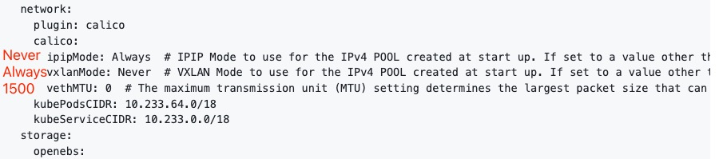

# TroubleShooting

## poor network performance in k8s container with calico
这个 `issue` 的测试方案可以参考？用的 `qperf` [projectcalico/calico#922](https://github.com/projectcalico/calico/issues/922)
切换了 `calico` 的网络模式，从 `ipip` 模式调整到 `vxlan` 模式，另外设置了 `mtu` 为 `1500`
具体原因不清楚，可能是 `ipip` 模式与 `openeuler` 适配的问题。

## Nginx出现消息截断问题

排查 `nginx` 日志，发现 `buff` 写入失败，提示空间不足。
发现 `df -h` 容器 `Pod` 磁盘占满。`Worker` 节点空间不足。

## 获取用户真实IP
首先需要配置 `Web` 服务器，需要设置 `header` `X-Real-IP`，`nginx` 设置方法：
[HTTP 请求头中的 Remote_Addr，X-Forwarded-For，X-Real-IP - 23云恋49枫 - 博客园](https://www.cnblogs.com/luxiaojun/p/10451860.html)

在 `K8S` 中部署的 `nginx`，可能获取不到真实的地址，需要看当前 `nginx` 工作负责的 `k8s` 服务的配置。比如如果为 `NodePort` 模式，需要设置 `external-traffic-policy` 为 `Local`，但是如果设置 `Local`，就不能通过任意的 `worker` 节点访问会自动负载均衡了，必须相同节点。（也可以通过外部负载均衡实现）[externaltrafficpolicy的有关问题说明 - 紫色飞猪 - 博客园](https://www.cnblogs.com/zisefeizhu/p/13262239.html)

## 对命名空间进行资源限制后无法启动新Pod
测试发现如果对命名空间限制资源后，内部的所有 `Pod` 也必须指明资源限制，且所有 `Pod` 加起来的资源不能超过对命名空间的资源限制。如果其中有一个 `Pod` 是无限制的资源，则该命名空间下无法再启动新的 `Pod`