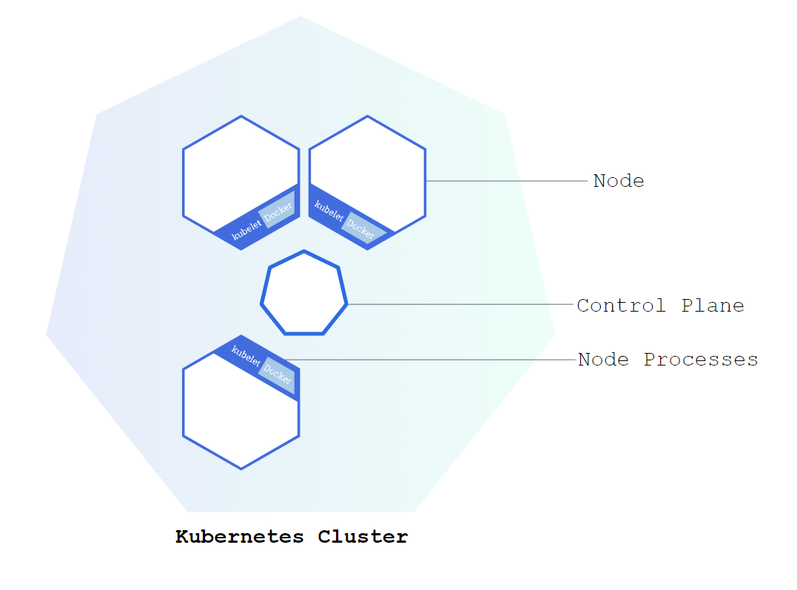

# 概述

`Kubernetes`（编排工具）用于容器编排。

部署一个 `Kubernetes`，实际上就是部署了一个 `Cluster`。

`Kubernetes` 每个实例是以 `Cluster` 为单位的。每个 `Work Node`（`VM` 或物理机）中有 `Kubelet`，即一个 `agent`，由 `Control Plane` 进行中心化调度管理（由 `Master Node` 组成）。

用户可以通过 `Kubectl`（`Kubernetes Client`），通过它调用 `Kubernetes` 的 `API` 进行管理。

一个 `k8s` 集群，可以通过 `namespace` 区分区域。