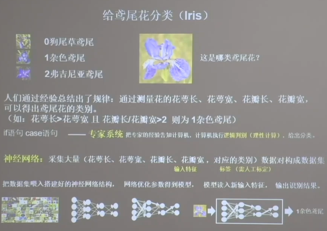

# 神经网络

人工智能有三大派别：

行为主义（感知-动作控制系统 行走、避障等自适应控制系统）

符号主义（能够用公式描述的逻辑性的理性思维）

连接主义（用计算机仿生出神经网络连接关系，让计算机具备感性思维）

具体原理：

①准备数据：采集大量“特征/标签“数据

②搭建网络：搭建神经网络结构

③优化参数：训练网络获取最佳参数（反向传播优化参数得到模型）

④应用网络：将网络保存为模型，输入新数据，输出分类或预测结果（前向传播）

## 神经网络设计过程

用神经网络来总结经验。面对一个未知的公式，从大量数据中推导出相应的神经模型“公式“，即总结经验。

例：给鸢尾花分类：0狗尾草鸢尾，1杂色鸢尾，2弗吉尼亚鸢尾

神经网络就是用大量的一组数据集（花萼长、花萼宽、花瓣长、花瓣宽，对应的类别），由四个因素导出结果（四个输入，一个输出，但这个模型里有三种花所以一共有3种可能性的结果）原理是神经元的计算模型：MP模型（每个输入特征乘以线上的权重+偏置项求和，再通过一个非线性函数，然后输出结果。
可以简化，去除非线性函数，称之为简化模型，只有输入层和输出层，是单层神经网络。
多层神经网络是输出层+n个隐藏层/中间层，即输入层与输出层之间的层，不算输入层）`y（预测值）=x（输入）W（权重）+b（偏置项）` 这里都是矩阵计算。
这种简化模型属于线性函数，即使有多层神经元首尾相接构成深层神经网络，依旧是线性组合，模型表达力并不够，所以深层并没有什么意义。如果按照原先的MP模型，存在一个f（**激活函数** 是一个非线性函数）`y=f(x\*W+b)`，能大大增强模型表达力，要选用优秀的激活函数。比如`relu`激活函数

这种输入与所有可能的结果都有权重线相连的称之为**全连接**（FC、Dense）网络。目的是对目标函数进行预测、拟合，并不是神经网络层数越多越好。

训练是从瞎蒙开始，随机参数W、b，然后计算误差，通过**损失函数**（loss function 预测值y与标准答案y_的差距）能够定量的判断W和b的优劣，当损失函数结果最小时，参数W和b会出现最优值。

损失函数有多种定义，比如均方误差MSE、交叉熵。要找到损失函数最小，可以使用梯度下降法。梯度是函数对各参数求偏导后的向量，梯度下降的方向是函数减小的方向，这样

每次优化参数的幅度由**学习率**（learning rate）控制，学习率设置的过小时，收敛会十分缓慢，需要大量迭代才能找到损失函数最小值。若学习率设置过大，会导致梯度在最小值附近来回震荡甚至无法收敛。可以先用较大的学习率，快速得到较优解，然后逐步减小学习率，使模型在后期训练稳定，比如指数衰减学习率，按照轮数等进行衰减。

更新参数是**反向传播**（从后向前，逐层求损失函数对每层神经元参数的偏导数，迭代更新所有参数）

**超参数**是在开始学习过程之前设置值的参数，而不是通过训练得到的参数数据。比如神经网络层数

### 过拟合与欠拟合

过拟合是对当前数据拟合的过好，但对新数据难以做出正确判断，缺乏泛化力。一般原因是因为待优化参数过多，比如彩色图片，灰度、颜色等等，输入参数非常多，导致待优化参数过多。处理彩色图片这种情况可以使用特征提取，大幅减少待优化参数。比如使用卷积计算进行提取图像特征

欠拟合是不能有效拟合当前数据集，是学习的不够好。

解决方法：

欠拟合 ①增加输入特征项②增加网络参数③减少正则化参数

过拟合 ①数据清洗②增大训练集③采用正则化④增大正则化参数

### 卷积Convolutional

卷积计算可以认为是有效**提取图像特征**的方法，就是特征提取器

**原理：** 是用一个正方形的卷积核，按照指定步长，在输入特征图上滑动，遍历输入特征图中的每个像素点。每一个步长，卷积核会与输入特征图出现重合区域，重合区域对应元素相乘、求和再加上偏置项得到输出特征的一个特征点（即九九归一，用一个特征值表现多个具体值）

输入特征图的深度（channel数），决定当前层卷积核的深度（比如三色图三通道，则一个卷积核会输出三个特征值）每个卷积核在卷积计算后会得到一个特征图，所以当前层卷积核个数决定了当前层输出特征图的深度

所以若是某层特征提取能力不足，可以在当前层多加卷积核提高能力

**感受野（Receptive Field）**

即一个特征像素点映射到原始图像中的视野，比如1个像素点映射到原始图是5x5那么感受野就是5，是使用一次5x5的卷积核效率高还是两个3x3的卷积核效率高？（两个3x3和一个5x5卷积的感受野都是5，所以认为特征提取能力相同）计算得到两个3x3待优化参数为18，一个5x5待优化参数为25，然后计算效率可发现尺寸很小时5x5效率才略高于3x3，尺寸越大3x3效率越好。所以两个3x3卷积核比1个5x5效率高

**全零填充（Padding）**

希望卷积计算保持输入特征图的尺寸不变，所以可以在输入特征图周围填充0满足尺寸

**批标准化（Batch Normalization，BN）**

标准化：使数据符合0为均值，1为标准差的分布

批标准化：对一小批数据（batch），做标准化处理。位于卷积层之后，激活层之前

神经网络对0附近数据敏感，随着神经网络层数增加，特征数据会出现偏离0均值的情况。批标准化可以将偏移的数据均值拉回0附近。

### 池化（Pooling）

用于减少卷积神经网络中的特征数据量

主要方法：

*最大池化* 可以提取图片纹理 取与池化核尺寸一样大的特征值中最大的一个特征值

*均值池化* 可以保留背景特征 取与池化核尺寸一样大的特征值的均值

原理与卷积类似，但是并不是按照步长，而是直接一个值代替多个值，不会重复

### 舍弃（Dropout）

可以防止过度拟合

在神经网络训练时，一部分神经元按照一定概率从神经网络中暂时舍弃，神经网络使用时被舍弃的神经元恢复连接

### 卷积神经网络

借助卷积核提取特征后送入全连接网络

主要模块有卷积、批标准化、激活、池化

### 训练术语
**Epoch（时期/一代训练）**
当一个完整的数据集通过了神经网络一次并且返回了一次，这个过程称为一次\>epoch。（也就是说，所有训练样本在神经网络中都 进行了一次正向传播 和一次反向传播 ）

再通俗一点，一个Epoch就是将所有训练样本训练一次的过程。

然而，当一个Epoch的样本（也就是所有的训练样本）数量可能太过庞大（对于计算机而言），就需要把它分成多个小块，也就是就是分成多个Batch 来进行训练。

**Batch（批 / 一批样本/数据）**
使用训练集中的一小部分样本对模型权重进行一次反向传播的参数更新，这一小部分样本称为一批数据

**Batch_Size（批大小）**
每批样本的大小。

**Iteration（一次迭代/训练）**
训练一个Batch就是一次Iteration（这个概念跟程序语言中的迭代器相似）。

# TensorFlow

张量（Tensor）：多维数组（多维列表），用“阶“来表示张量的维数

几个方括号就是几维数组

### 创建Tensor

`tf.constant(张量内容, [dtype=数据类型])`

`tf.convert_to_tensor(数据名，[dtype=数据类型])` （将numpy的数据类型转换为Tensor数据类型）

创建填充好了的张量

生成符合维度的正态分布的随机数张量

还有均匀分布的tf.random.unifrom

**使用keras快速搭建神经网络 （六步法）**

①import：import相关模块

②train、test：告知喂入网络的训练集和测试集

③

**Sequential**

可以用Sequential搭建出上层输出就是下层输入的顺序网络结构，但是无法写出带有跳连的非顺序网络结构

model = tf.keras.models.Sequential：在Sequential中搭建网络结构，逐层描述每层网络（即走一遍前向传播）

sequential可认为是个容器，封装了一个神经网络结构，比如拉直层、全连接层、卷积层、LSTM层。

**Class类**

用类封装一个神经网络结构

`model = MyModel()`

④model.compile：在compile中配置训练方法告知训练时选择哪种优化器、损失函数、评测指标

⑤model.fit：在fit中执行训练过程，告知训练集和测试集输入特征和标签，告知每个batch值，告知要迭代多少次数据集

⑥model.summary：用summary打印出网络的结构和参数统计

# 机器学习

可以用于Database mining（数据挖掘），Applications can’t program by hand（如NLP、图像识别）

# 深度学习

## 循环神经网络（Recurrent Neural Network，RNN）

是一种用于处理序列数据的神经网络。相比一般的神经网络来说，他能够处理序列变化的数据。比如某个单词的意思会因为上文提到的内容不同而有不同的含义，RNN就能够很好地解决这类问题。
