# 概念

大数据具有<span style="background:#d3f8b6">全样而非抽样、效率而非精确、相关而非因果</span>等三大显著特征

大数据的特点是大量化（数据量大）（Volume）、（处理速度快）快速化（Velocity）、（数据类型繁多）多样化（Variety）、价值化（Value）（价值巨大但密度低）

第三次信息化浪潮的标志：IoT（Internet of Things）物联网，云计算（Cloud Computing），大数据（big data）

## 大数据计算模式

| 大数据计算模式 | 解决问题                                 | 代表产品                                                                    |
|----------------|------------------------------------------|-----------------------------------------------------------------------------|
| 批处理计算     | 针对大规模数据的批量处理（静态数据）     | MapReduce、Spark等                                                          |
| 流计算         | 针对流数据的实时计算（动态数据）         | Storm、S4、Flume、Streams、Puma、DStream、Super Mario、银河流数据处理平台等 |
| 图计算         | 针对大规模图结构数据的处理（图结构数据） | Pregel、GraphX、Giraph、PowerGraph、Hama、GoldenOrb等                       |
| 查询分析计算   | 大规模数据的存储管理和查询分析           | Dremel、Hive、Cassandra、Impala等                                           |


# Hadoop框架

Hadoop实际上是实现分布式文件系统的框架，命名为HDFS（Hadoop Distributed File System）

## 命令

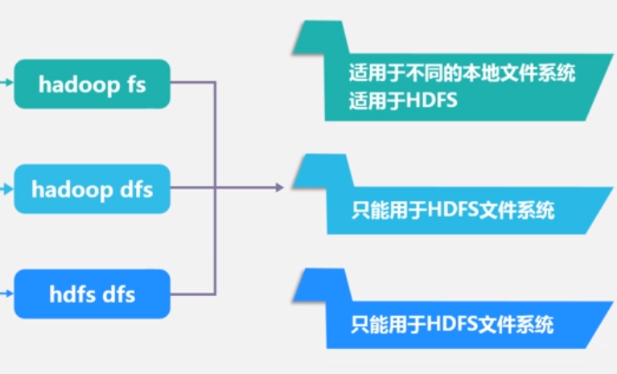

**hadoop fs**

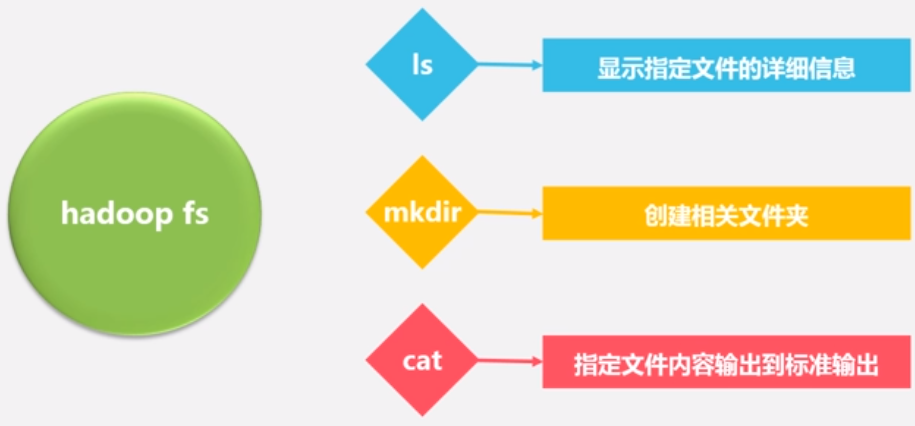

| 命令                                        | 全称（辅助记忆）                        | 作用                                                     | 选项                                                                                                                                                                                                                                                                                 |
|---------------------------------------------|-----------------------------------------|----------------------------------------------------------|--------------------------------------------------------------------------------------------------------------------------------------------------------------------------------------------------------------------------------------------------------------------------------------|
| **hdfs dfs(Hadoop fs) 命令**                    |                                         |                                                          |                                                                                                                                                                                                                                                                                      |
| -cp                                         | copy                                    | 在HDFS文件系统中，将文件或目录复制到目标路径下           | -cp [-f] [-p \| -p [topax] ] URI [ URI …] \< dest\>                                                                                                                                                                                                                                  |
| -touchz                                     |                                         | 创建一个零长度的文件。                                   | -touchz URI [URI ...]                                                                                                                                                                                                                                                                |
| -put(-copyFromLocal)                        |                                         | 将本地文件或目录上传到HDFS中的路径                       | -put \< localsrc\> … \< dst\>                                                                                                                                                                                                                                                        |
| -get(-copyToLocal)                          |                                         | 将文件或目录从HDFS中的路径拷贝到本地文件路径             | -get [-ignoreCrc] [-crc] \< src\> \< localdst\> -ignorecrc选项复制CRC校验失败的文件。 -crc选项复制文件和CRC。                                                                                                                                                                        |
| -ls                                         |                                         | 查看目录下内容，包括文件名，权限，所有者，大小和修改时间 | -ls [-R] \< args\>（目录 比如 /）  选项：-R 递归地显示子目录下的内容                                                                                                                                                                                                                 |
| -rm                                         |                                         | 删除一个文件或目录                                       | -rm [-f] [-r\|-R] [-skipTrash] URI [URI …] 如果文件不存在，-f选项将不显示诊断消息或修改退出状态以反映错误。 -R选项以递归方式删除目录及其下的任何内容。 -r选项等效于-R。 -skipTrash选项将绕过垃圾桶（如果已启用），并立即删除指定的文件。当需要从超配额目录中删除文件时，这非常有用。 |
| -cat                                        |                                         | 显示文件内容到标准输出上。                               | -cat URI [URI …]                                                                                                                                                                                                                                                                     |
| -tail                                       |                                         | 显示文件的最后1kb内容到标准输出                          | -tail [-f] URI -f选项将在文件增长时输出附加数据，如在Unix中一样。                                                                                                                                                                                                                    |
| -mkdir                                      |                                         | 在dfs上创建文件夹                                        | 注意要写/…不然不会创建到主目录 比如/xxx而不是xxx                                                                                                                                                                                                                                     |
| **启动HDFS**                                    |                                         | 先要是hadoop账号（这才能免密ssh其他节点）                |                                                                                                                                                                                                                                                                                      |
| start-dfs.sh                                |                                         |                                                          |                                                                                                                                                                                                                                                                                      |
| start-yarn.sh                               |                                         |                                                          |                                                                                                                                                                                                                                                                                      |
| mr-jobhistory-daemon.sh start historyserver |                                         |                                                          |                                                                                                                                                                                                                                                                                      |
| start-all.sh                                |                                         | 实际就是start-dfs.sh 和 start-yarn.sh                    |                                                                                                                                                                                                                                                                                      |
| **关闭HDFS**                                    |                                         |                                                          |                                                                                                                                                                                                                                                                                      |
| stop-yarn.sh                                |                                         |                                                          |                                                                                                                                                                                                                                                                                      |
| stop-dfs.sh                                 |                                         |                                                          |                                                                                                                                                                                                                                                                                      |
| mr-jobhistory-daemon.sh stop historyserver  |                                         |                                                          |                                                                                                                                                                                                                                                                                      |
| stop-all.sh                                 |                                         |                                                          |                                                                                                                                                                                                                                                                                      |
| **其他命令**                                    |                                         |                                                          |                                                                                                                                                                                                                                                                                      |
| jps                                         | JavaVirtual Machine Process Status Tool | 查看当前java进程的小工具                                 |                                                                                                                                                                                                                                                                                      |
| hadoop jar                                  |                                         | 运行jar包                                                | hadoop jar jar包路径                                                                                                                                                                                                                                                                 |

通过命令 `jps` 可以查看各个节点所启动的进程。
正确的话，在 Master 节点上可以看到 `NameNode`、`ResourceManager`、`SecondrryNameNode`、`JobHistoryServer` 、`jps`进程

在 Slave 节点可以看到 `DataNode` 和 `NodeManager`、`jps` 进程

Master如果**没有NameNode和SecondaryNameNode进程**：

```bash
netstat -alnp | grep 50070 # 看看端口是否被占用
sudo lsof -i:端口 -P
sudo kill -9 PID
```

或者使用`hadoop namenode -format` （namenode格式化命令）但是格式化namenode后会有datanode的clusterID 和 namenode的clusterID 不匹配的问题，这样**slave节点的datanode节点可能启动不成功**

当我们执行文件系统格式化时，会在namenode数据文件夹（即配置文件中dfs.name.dir在本地系统的路径）中保存一个current/VERSION文件，记录namespaceID，标志了所有格式化的namenode版本。如果我们频繁的格式化namenode，那么datanode中保存（即dfs.data.dir在本地系统的路径）的current/VERSION文件只是你地第一次格式化时保存的namenode的ID，因此就会造成namenode和datanode之间的ID不一致。

解决方案：

根据日志中的路径，`cd /home/hadoop/tmp/dfs`（一般设置的`dfs.name.dir`在本地系统的路径），能看到 data和name两个文件夹。

解决方法一：（推荐）

删除DataNode的所有资料及将集群中每个datanode节点的`/dfs/data/current`中的VERSION删除，然后重新执行`hadoop namenode -format`进行格式化，重启集群，错误消失。

解决方法二：

将`name/current`下的VERSION中的clusterID复制到`data/current`下的VERSION中，覆盖掉原来的clusterID

让两个保持一致

然后重启，启动后执行`jps`，查看进程

## MapReduce

MapReduce是一种分布式并行编程框架，属于批处理的大数据计算模式

MapReduce 采用分而治之，把非常庞大的数据集切成非常多的独立的小分片，然后为每一个分片单独地启动一个map任务，最终通过多个map任务，并行地在多个机器上去处理

### 理念

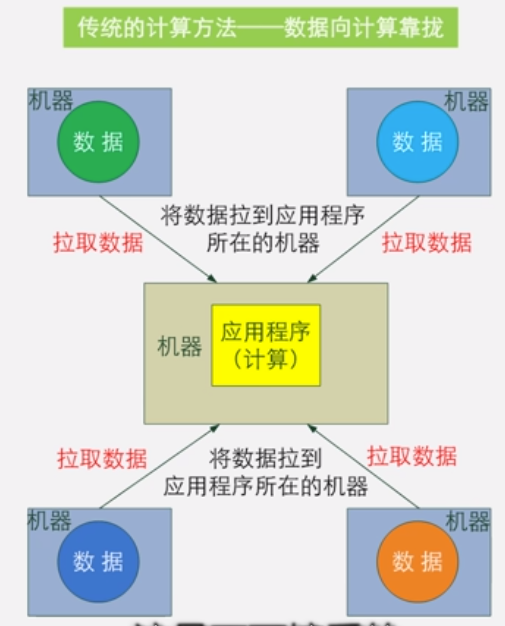 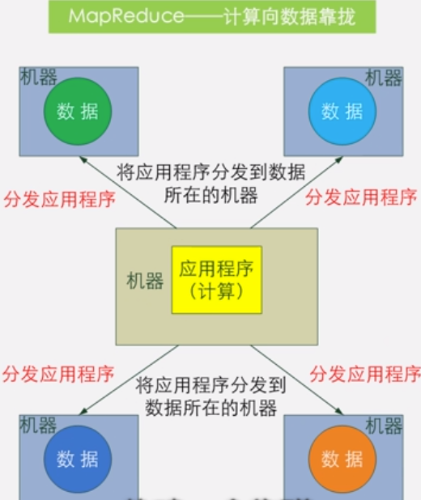

两个**核心函数Map**和**Reduce**

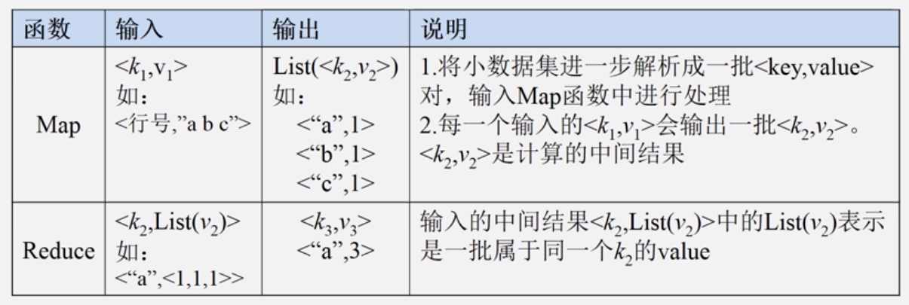

就是输入一个键值对`<K1,V1>`经过map函数输出一批的键值对`<K2,V2>`

#### Reduce函数作用

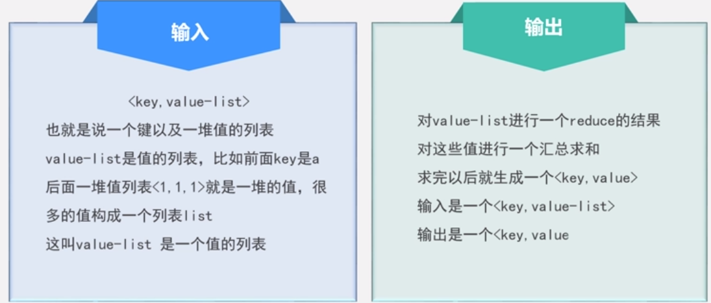

#### 体系结构

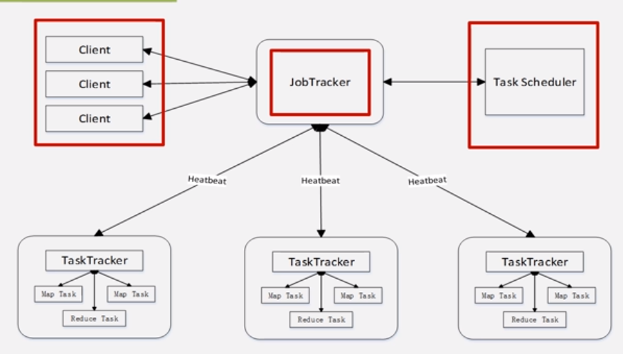

#### Client（客户端）


#### JobTracker（作业跟踪器）


#### TaskTracker（任务调度器）


#### 如何衡量资源使用情况？

slot（槽）资源调度单位，包含内存和cpu资源（将所有内存和cpu资源进行打包），分成map类型slot和reduce类型slot，可以一台机同时运行map任务和reduce任务

**工作流程**

Map任务 -\> Reduce任务 结果是key-value键值对

数据要先进行分片然后Map任务去取分片，把一个HDFS块大小作为一个分片的大小，分片的多少就决定了map任务的多少

Reduce任务个数取决于集群中可用的reduce任务槽（slot）的数目

Map任务和Reduce任务都在不同的DataNode上

### Shuffle过程

Map任务的Shuffle过程

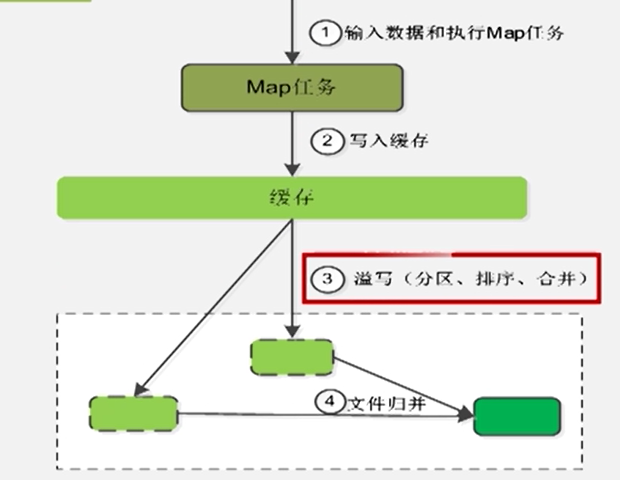

每个分片做的Map任务输出的结果首先要写入缓存而不是磁盘中，因为磁盘寻址开销很大，写入缓存再一次寻址完成整批数据写入。其中有个溢写操作，比如缓存是100M，如果满了才溢写会导致后面生成的Map结果写不进缓存，然后被丢掉。所以溢写操作有个门槛叫溢写比例比如0.8，写到80M就开始将80M的缓存写入磁盘上去。但是不是将80M直接丢到磁盘里，而是要进行分区、排序、合并等操作。因为Map生成的键值对结果要丢给各个不同的Reduce任务去，有4个reduce任务就要分成四个区，分区后自动进行排序，比如按照key值字典排序，排序后可能发生合并操作Combine，和归并Merge不一样。

合并是为了减少溢写到磁盘当中的数据量：(“a”,1)和(“a”,1)合并成为(“a”,2)，合并操作要求不改变结果。

Reduce端的Shuffle过程

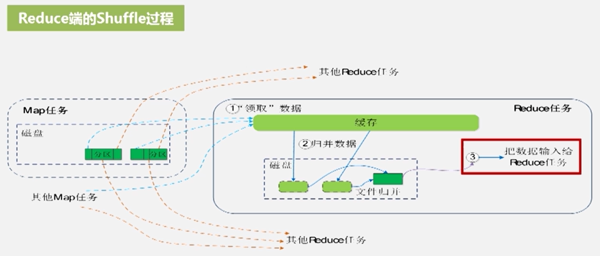

Map任务结束之前会对生成在磁盘上的多个溢写文件进行归并，成大文件，且数据分区且排序。这时候就会被JobTraker侦测到通知Reduce从各个分区拉走要处理的数据到本地。Reduce是从很多个Map任务（机器）上拉取要处理的数据的，所以需要进行归并再合并

归并是\<key, value-list\>即(“a”,(1,1,2))的形式。因为有些数据并不是int，比如是特殊的类等只能是value-list

Reduce的结果是\<”a”, 4\>这样的键值对

●MapReduce应用程序执行过程

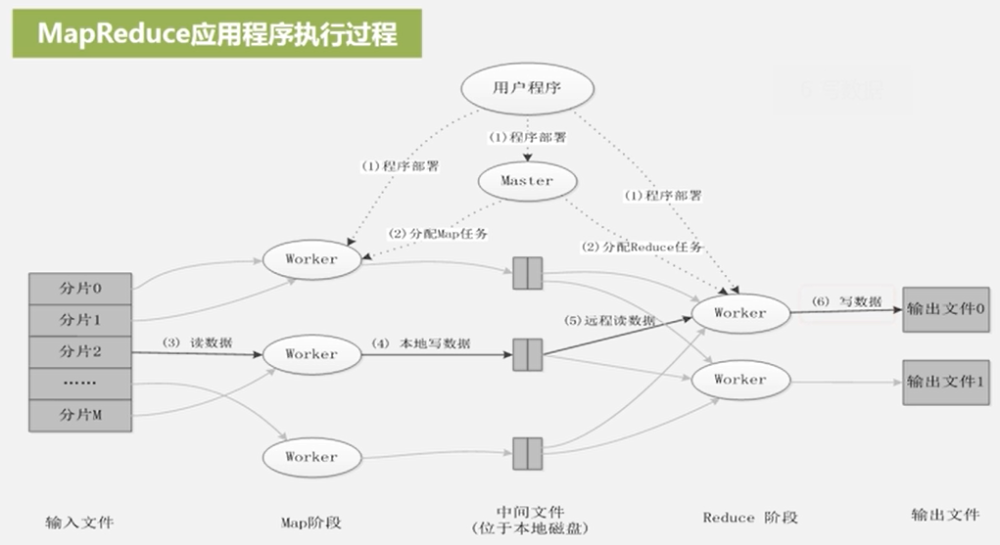

五个阶段（最底下）

Map任务的结果是输入到Map任务机器所在的本地磁盘上面

●编写MapReduce程序

将分布式任务抽象为Map、Reduce两个函数

①编写Map处理逻辑

类比为一个子线程上运行的任务 负责计算

②编写Reduce处理逻辑

类比为子线程处理多线程处理完的任务进行结果整理合并

③写main函数（入口）

④编译打包代码

## YARN

#### MapReduce缺陷

**有单点故障**：JobTracker故障后MapReduce就无法使用

**JobTracker任务过重**：总管家，既要管资源调度和分配，又要管任务的调度和监控，还有失败的恢复，内存使用过多后DataNode到达一定数值（4000）以上后各种问题会出现

**容易出现内存溢出**：不管Map这个任务需要消耗资源，只是按照Map数量分配任务。

**资源划分不合理**：把CPU等资源打包后强行划分为多个slot，然后分为Map slot和Reduce slot两部分，这两部分又不能互相使用，空闲资源浪费

#### YARN设计思路

对JobTracker进行功能拆分

将资源管理抽出作为**ResourceManager** 还会处理客户端请求 全局的资源管理器 以容器的形式分配（动态资源分配单位，每个容器中都封装了一定数量的CPU、内存、磁盘等资源，从而限定每个应用程序可以使用的资源量）给申请的应用程序，容器选择通常会考虑应用程序所要处理的数据的位置，就近选择。

将任务调度和任务监控 作为**ApplicationMaster** 还会容错，为应用程序申请资源，并分配给内部任务

原来的Slave节点的TaskTracker交给**NodeManager**去管理

MapReduce既是一个计算框架，也是一个资源管理调度框架

YARN就是纯粹的资源管理调度框架 不是仅支持MapReduce这一种计算框架，只要实现相应的ApplicationMaster的计算框架都可以使用

MapReduce2.0被剥离了资源调度框架后变成了纯粹的计算框架

**ApplicationMaster 管家**

## HBase

Hbase是一种NoSQL数据库，这意味着它不像传统的RDBMS(Relational Database Management System)数据库那样支持SQL作为查询语言。Hbase是一种分布式存储的数据库，技术上来讲，它更像是分布式存储而不是分布式数据库，它缺少很多RDBMS系统的特性，比如列类型，辅助索引，触发器，和高级查询语言等等。

架构图：

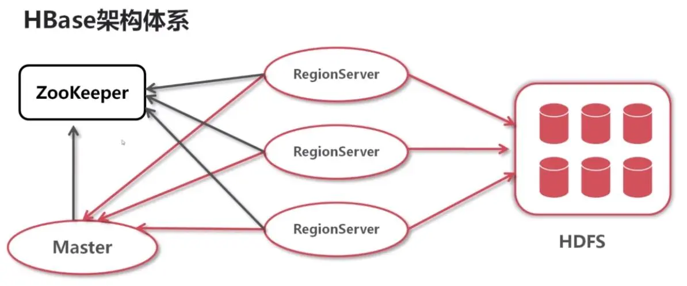

Zookeeper，作为分布式的协调。RegionServer也会把自己的信息写到ZooKeeper中。

HDFS是Hbase运行的底层文件系统

RegionServer，理解为数据节点，存储数据的。

Master RegionServer要实时的向Master报告信息。Master知道全局的RegionServer运行情况，可以控制RegionServer的故障转移和Region的切分。

[入门HBase，看这一篇就够了 - 简书 (jianshu.com)](https://www.jianshu.com/p/b23800d9b227)

### 存储

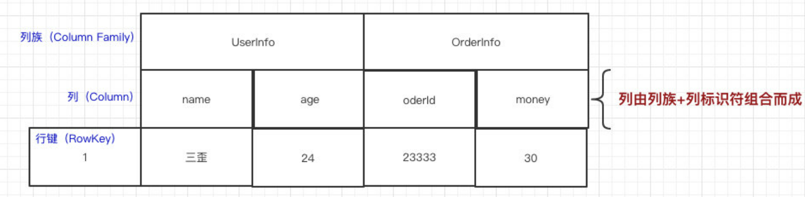

HBase的列（Column）都得归属到列族（Column Family）中。在HBase中用列修饰符（Column Qualifier）来标识每个列。

HBase表的每一行中，列的组成都是灵活的，行与行之间的列不需要相同。如图下：

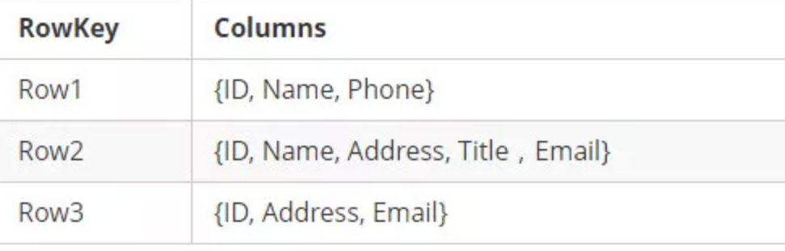

一个列族下可以任意添加列，不受任何限制

数据写到HBase的时候都会被记录一个时间戳，这个时间戳被我们当做一个版本。比如说，我们修改或者删除某一条的时候，本质上是往里边新增一条数据，记录的版本加一了而已。

比如现在我们有一条记录：

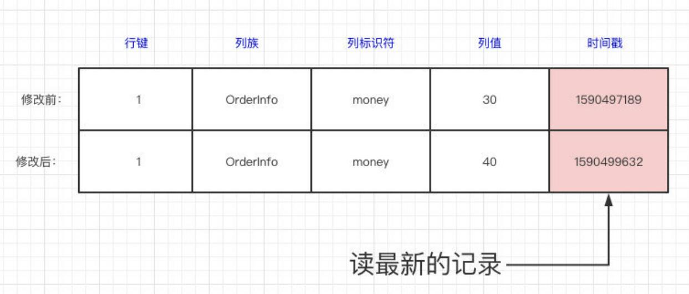

**HBase本质上其实就是Key-Value的数据库**

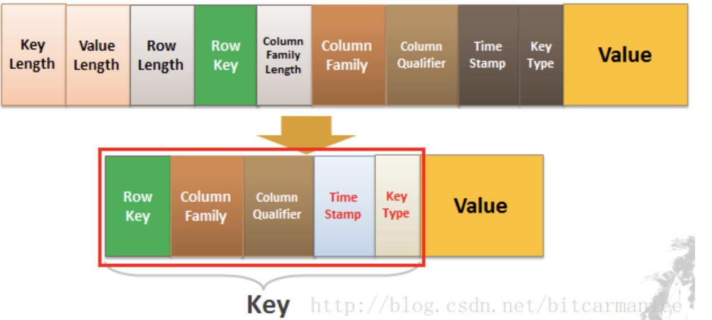

Key由RowKey(行键)+ColumnFamily（列族）+Column Qualifier（列修饰符）+TimeStamp（时间戳--版本）+KeyType（类型）组成，而Value就是实际上的值。

对比上面的例子，其实很好理解，因为我们修改一条数据其实上是在原来的基础上增加一个版本的，那我们要准确定位一条数据，那就得（RowKey+Column+时间戳）。

KeyType是什么？我们上面只说了「修改」的情况，你们有没有想过，如果要删除一条数据怎么做？实际上也是增加一条记录，只不过我们在KeyType里边设置为“Delete”就可以了。

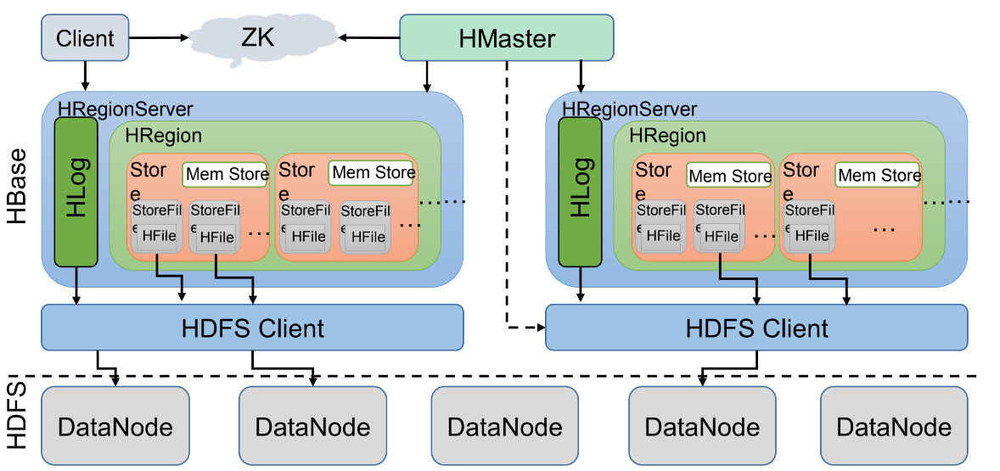

实际上是**列簇存储**，列簇存在HRegion之中。

### Shell

| command               | 备注                                                                   | 语法                                                                                                                                                                                                                |
|-----------------------|------------------------------------------------------------------------|---------------------------------------------------------------------------------------------------------------------------------------------------------------------------------------------------------------------|
| hbase                 | 查看帮助                                                               |                                                                                                                                                                                                                     |
| hbase shell           | 启动shell                                                              |                                                                                                                                                                                                                     |
| exit/ ctrl+c          | 退出shell                                                              |                                                                                                                                                                                                                     |
|                       |                                                                        |                                                                                                                                                                                                                     |
| 启动Shell并成功连接后 |                                                                        |                                                                                                                                                                                                                     |
| list                  | 列出所有表                                                             |                                                                                                                                                                                                                     |
| status                | 当前HBase节点总数及存活情况                                            |                                                                                                                                                                                                                     |
| version               | HBase版本                                                              |                                                                                                                                                                                                                     |
| whoami                | 显示当前HBase用户                                                      |                                                                                                                                                                                                                     |
| table_help            | help for table_reference command                                       |                                                                                                                                                                                                                     |
|                       |                                                                        |                                                                                                                                                                                                                     |
| help                  | 查看命令的使用描述                                                     | help ‘命令名’                                                                                                                                                                                                       |
|                       |                                                                        |                                                                                                                                                                                                                     |
| create                | 创建表                                                                 | create ‘表名’, ‘列族名1’, ‘列族名2’, ‘列族名N’                                                                                                                                                                      |
| alter                 | 修改列族                                                               | 添加一个列族：alter ‘表名’, ‘列族名’ 删除列族：alter ‘表名’, {NAME=\> ‘列族名’, METHOD=\> ‘delete’}                                                                                                                 |
| describe              | 显示表相关的详细信息                                                   | describe ‘表名’                                                                                                                                                                                                     |
| list                  | 列出hbase中存在的所有表                                                | list                                                                                                                                                                                                                |
| exists                | 测试表是否存在                                                         | exists ‘表名’                                                                                                                                                                                                       |
| put                   | 添加或修改的表的值                                                     | put ‘表名’, ‘行键’, ‘列族名’, ‘列值’ put ‘表名’, ‘行键’, ‘列族名:列名’, ‘列值’                                                                                                                                      |
| scan                  | 通过对表的扫描来获取对用的值                                           | scan ‘表名’ 扫描某个列族： scan ‘表名’, {COLUMN=\>‘列族名’} 扫描某个列族的某个列： scan ‘表名’, {COLUMN=\>‘列族名:列名’} 查询同一个列族的多个列： scan ‘表名’, {COLUMNS =\> [ ‘列族名1:列名1’, ‘列族名1:列名2’, …]} |
| get                   | 获取行或单元（cell）的值                                               | get ‘表名’, ‘行键’ get ‘表名’, ‘行键’, ‘列族名’                                                                                                                                                                     |
| count                 | 统计表中行的数量                                                       | count ‘表名’                                                                                                                                                                                                        |
| incr                  | 增加指定表行或列的值                                                   | incr ‘表名’, ‘行键’, ‘列族:列名’, 步长值                                                                                                                                                                            |
| get_counter           | 获取计数器                                                             | get_counter ‘表名’, ‘行键’, ‘列族:列名’                                                                                                                                                                             |
| delete                | 删除指定对象的值（可以为表，行，列对应的值，另外也可以指定时间戳的值） | 删除列族的某个列： delete ‘表名’, ‘行键’, ‘列族名:列名’                                                                                                                                                             |
| deleteall             | 删除指定行的所有元素值                                                 | deleteall ‘表名’, ‘行键’                                                                                                                                                                                            |
| truncate              | 重新创建指定表                                                         | truncate ‘表名’                                                                                                                                                                                                     |
| enable                | 使表有效                                                               | enable ‘表名’                                                                                                                                                                                                       |
| is_enabled            | 是否启用                                                               | is_enabled ‘表名’                                                                                                                                                                                                   |
| disable               | 使表无效                                                               | disable ‘表名’                                                                                                                                                                                                      |
| is_disabled           | 是否无效                                                               | is_disabled ‘表名’                                                                                                                                                                                                  |
| drop                  | 删除表                                                                 | drop的表必须是disable的 disable ‘表名’ drop ‘表名’                                                                                                                                                                  |
| shutdown              | 关闭hbase集群（与exit不同）                                            |                                                                                                                                                                                                                     |
| tools                 | 列出hbase所支持的工具                                                  |                                                                                                                                                                                                                     |

## 问题

#### 无法退格

XShell中属性设置退格键

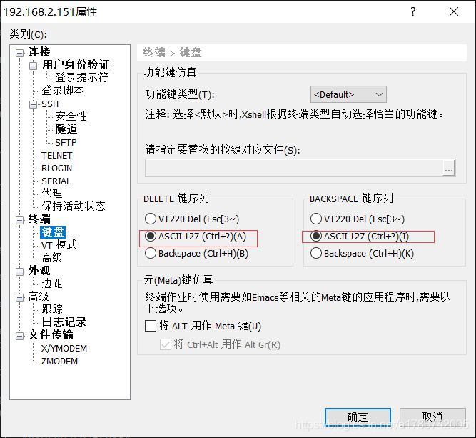

# 云数据中心

dolphin Schedule 作业流程调度，支持大量协议及组件，如k8s、shell、hive、map reduce、http等

portainer.io 容器化部署，数据源，数据采集。

Flink CDC 数据库日志 将数据库源数据同步到云数据中心数据库，将原先1天-15分钟，缩减到实时同步（源数据库性能1-2%的损失，利用日志进行同步）

开发sql进行数据源与目标数据表进行关联。

第一次比较慢，因为第一次要全表同步然后记录时刻，后续才根据时间戳根据日志进行同步。

数据入湖：MySQLCDC-\>hudi(hdfs)-\>Hive hudi可以整合行式与列式数据库

Hue 研发平台，在上面可以写Hive SQL查看结果

全部集成：DataSphereStudio，类似阿里云的DataWork。因为目前组件都独立，界面不统一（即无法通过导航栏等单页跳转）

Datahub 元数据治理平台（可以搜索到数据中心表、字段）

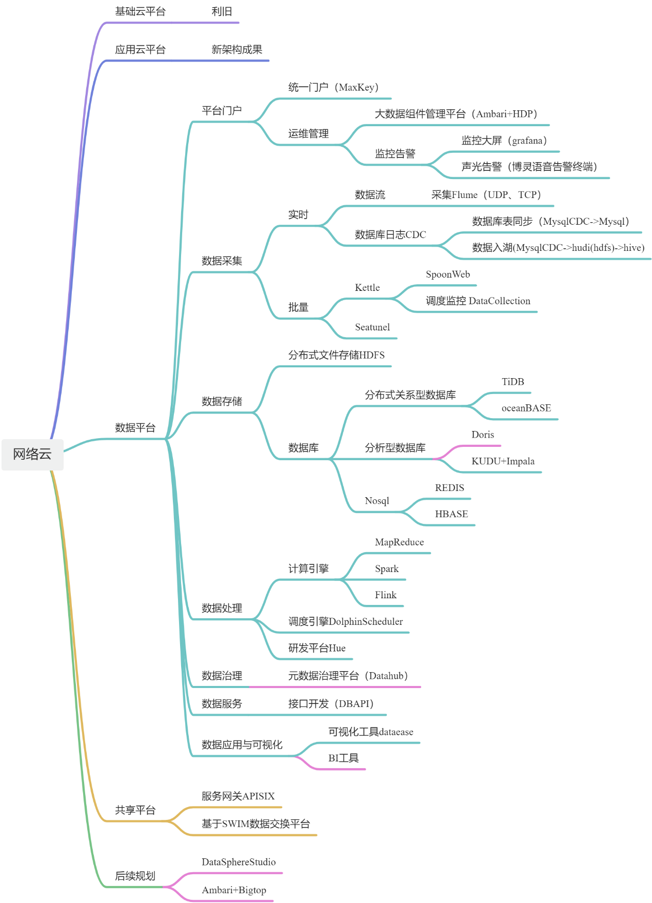

TiDB、oceanBase，都是MySQL协议的。