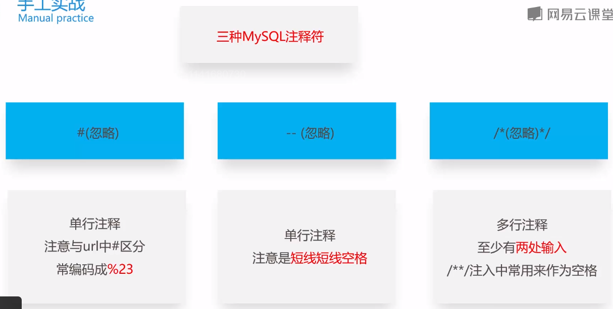

**●建立数据库【结构】**

Mysql

要考虑id自增（AUTO_INCREMENT）、PRIMARY KEY、COMMENT（注释）


常见的mysql表引擎有INNODB和MyISAM，主要的区别是INNODB适合频繁写数据库操作，MyISAM适合读取数据库的情况多一点

使用以下mysql sql语句，可以给表设定数据库引擎：

ALTER TABLE \`wp_posts\` ENGINE = MyISAM;

●外键

Company_table中假设有

foreign key(repo_id) references repo_table(repo_id))

repo_id在repo表中是主键，在company表中是外键

约束作用：

1.  如果在company中插入repo_id而repo表中没有，则数据库不允许插入
2.  如果修改/删除repo表中的id而company还在引用，则修改/删除失败

**●索引**

索引的好处在于可以讲指定列进行排序，提高检索的速度。

一个简单的例子：

某个列的数据是

id name

12 小李

10 小龙

5 小青

99 小红

id列创建索引后就会生成一个索引表

id index

5 3

10 2

12 1

99 4

当查询 where id =10的 时候，使用到索引表。由于10下面是15，不可能有大于10的数。所以不再进行扫描表操作。返回第二条数据，对应回主表的第二行。

这样就提高了查询的速度，如果没添加索引；则扫描整张主表。

注意事项：

1、需要加索引的字段，要在where条件中

2、数据量少的字段不需要加索引；因为建索引有一定开销，如果数据量小则没必要建索引（速度反而慢）

3、如果where条件中是OR关系，加索引不起作用

4、联合索引比对每个列分别建索引更有优势，因为索引建立得越多就越占磁盘空间，在更新数据的时候速度会更慢。另外建立多列索引时，顺序也是需要注意的

联合索引：

<https://www.cnblogs.com/musings/p/10890563.html>

# 基础知识

## 并发锁

#### 共享（Share）锁和排他（Exclusive，X）锁

共享锁即读锁，共享 (S) 用于不更改或不更新数据的操作（只读操作），如 SELECT 语句。排他锁（X锁）：用于数据修改操作，例如 INSERT、UPDATE 或 DELETE。确保不会同时同一资源进行多重更新。

当事务A对数据D加S锁后，事务B可以对其加S锁，但无法加X锁。

而事务A对数据D加X锁后，事务B无法对数据D加S锁或X锁

#### 乐观锁

乐观锁是一种以乐观的态度看并发的情况，对读不会加锁，只会在更新的时候进行加锁。因此可能会导致脏读的情况。

乐观锁可以使用version来实现，就是事务在执行过程中执行到了更新阶段，这时候就会判断事务刚读取到的信息version是否是当前更新的数据库version，确保读取到的依旧是最新的数据，同一个version就可以执行下去，如果是不同的version，则会回滚后，再尝试一遍执行事务。

所以乐观锁适用于读多写少的情况

#### 悲观锁

就是总觉得会有并发导致脏读的情况发生，因此在读取的时候也加了锁。

如果是多写的情况，使用乐观锁就总会导致冲突发生，回滚重试反而降低了性能，这时候就适用于悲观锁

## 事务（Transaction）

事务具有4个特征，分别是原子性、一致性、隔离性和持久性，简称事务的ACID特性；

#### 原子性（atomicity)

一个事务要么全部提交成功，要么全部失败回滚，不能只执行其中的一部分操作，这就是事务的原子性

回滚事务的原理就是，每个sql语句有对应的逆sql，MySQL中的innoDB引擎拥有undolog，有insert，就记录对应的delete语句

事务提交有对应的redolog，用于数据恢复，保证持久性。

#### 一致性（consistency)

事务的执行不能破坏数据库数据的完整性和一致性，一个事务在执行之前和执行之后，数据库都必须处于一致性状态。

如果数据库系统在运行过程中发生故障，有些事务尚未完成就被迫中断，这些未完成的事务对数据库所作的修改有一部分已写入物理数据库，这是数据库就处于一种不正确的状态，也就是不一致的状态

#### 隔离性（isolation）

事务的隔离性是指在并发环境中，并发的事务时相互隔离的，一个事务的执行不能不被其他事务干扰。不同的事务并发操作相同的数据时，每个事务都有各自完成的数据空间，即一个事务内部的操作及使用的数据对其他并发事务是隔离的，并发执行的各个事务之间不能相互干扰。

在标准SQL规范中，定义了4个事务隔离级别，不同的隔离级别对事务的处理不同，分别是：读未提交，读已提交，可重复读和串行化

##### 事务隔离级别
###### 1. 读未提交（Read Uncommited）

该隔离级别相当于没有加锁，允许脏读，其隔离级别最低。比如事务A和事务B同时进行，事务A在整个执行阶段，会将某数据的值从1开始一直加到10，然后进行事务提交，此时，事务B能够读取到这个数据项在事务A操作过程中的所有中间值（如1变成2，2变成3等）。

**脏读(Dirty Read)**：在A事务中，可以读到实际上可能不存在的数据（因为在B事务执行的中间值并不是最终的数据）

###### 2. 读已提交（Read Commited）

只能读取到已经提交了的事务的值，避免了脏读。但仍有幻读和不可重复读的问题存在。

**幻读(Phantom reads)**：在A事务中，第一次读取的消息条数可能和第二次读取的消息条数不一样。涉及到消息条目的操作（insert, delete）需要注意该问题。

**不可重复读(Non-repeatable reads)**：在A事务中，第一次读取一条记录某个字段上的值，可能和第二次读取该条记录上的值不一致。涉及到单条数据的需要注意该问题。

###### 3. 可重复读（Repeatable Read)

对正在修改的记录加了读锁，避免了不可重复读的问题。但仍有幻读的问题。

###### 4. 串行化（Serializable）

是最严格的事务隔离级别，它要求所有事务被串行执行，即事务只能一个接一个的进行处理，不能并发执行。
避免了三种Read phenomena

#### 持久性（durability）

一旦事务提交，那么它对数据库中的对应数据的状态的变更就会永久保存到数据库中。即使发生系统崩溃或机器宕机等故障，只要数据库能够重新启动，那么一定能够将其恢复到事务成功结束的状态


# 数据库基础

## 查询顺序

The following steps show the logical processing order, or binding order, for a SELECT statement. This order determines when the objects defined in one step are made available to the clauses in subsequent steps. For example, if the query processor can bind to (access) the tables or views defined in the FROM clause, these objects and their columns are made available to all subsequent steps. **Conversely, because the SELECT clause is step 8, any column aliases or derived columns defined in that clause cannot be referenced by preceding clauses.(所以select的别名只能在select执行顺序后续的语句中使用)** However, they can be referenced by subsequent clauses such as the ORDER BY clause. The actual physical execution of the statement is determined by the query processor and the order may vary from this list.

### FROM

对FROM子句中的前两个表执行笛卡尔积（Cartesian product)(交叉联接），生成虚拟表VT1

### ON

对VT1应用ON筛选器。只有那些使条件为真的行才被插入VT2。

### OUTER(JOIN)

如果指定了OUTER JOIN（相对于CROSS JOIN 或(INNER JOIN),保留表（preserved table：左外部联接把左表标记为保留表，右外部联接把右表标记为保留表，完全外部联接把两个表都标记为保留表）中未找到匹配的行将作为外部行添加到 VT2,生成VT3.如果FROM子句包含两个以上的表，则对上一个联接生成的结果表和下一个表重复执行步骤1到步骤3，直到处理完所有的表为止。

### WHERE

对VT3应用WHERE筛选器。只有条件为true的行才被插入VT4.

### GROUP BY

按GROUP BY子句中的列列表对VT4中的行分组，生成VT5.

### WITH CUBE or WITH ROLLUP

把超组(Suppergroups)插入VT5,生成VT6.

### HAVING

对VT6应用HAVING筛选器。只有条件为true的组才会被插入VT7.

### SELECT

处理SELECT列表，产生VT8.

### DISTINCT

将重复的行从VT8中移除，产生VT9.

### ORDER BY

将VT9中的行按ORDER BY 子句中的列列表排序，生成游标（VC10).

### TOP/LIMIT

从第几位开始取，限制行数

## 引擎

常见的mysql表引擎有InnoDB和MyISAM，主要的区别是InnoDB适合频繁写数据库操作，MyISAM适合读取数据库的情况多一点

注意MySQL数据库不能用MyISAM，需要用InnoDB，不然不支持外键和事务等

## 锁

对数据对象加上share共享锁（S锁），其他事务可以读取但无法修改它。如果加上exclusive排他锁（X锁），则其他事务无法访问到它。


## 存储过程

```sql
IF NOT EXISTS(SELECT 1 WHERE @LocalAddr IN ('')) BEGIN

IF … BEGIN

…

END

ELSE BEGIN

…

END
```

### 变量

`@`是局部变量声明，如果没有`@`的字段代表是列名；

eg：

```sql
-- 声明变量：
declare @name varchar(8)

-- 赋值： 
set @name= '张三'

-- 查询：
select * from stuInfo where stuName = @name
```

由 `set` 和 `select` 进行赋值；

`select`一般用于查询数据，然后再赋值变量。

还有`@@error` 等是全局变量，系统自定义的，我们只读，不能改！！


## SQL语句

### 查询（Select）

##### := 符号

```sql
SET @rownum = 0;
UPDATE table_name SET id = @rownum := @rownum +1;
```

将`@rownum+1`结果先赋值给`@rownum`，然后取`@rownum`的值

##### DISTINCT

```sql
select title, count(*)
from `music_data`
group by 1
having count(*) > 1;
```

可以取得distinct相反的结果

##### NOT IN 和 IN

```sql
select *
from class
where id in (
    select id from users
)
```

但如果in的结果中包含null，那么整个结果都会变成null，所以in的select里面要`where id is not null`

可以获得相反的结果

##### Union

```sql
SELECT expression1, expression2, ... expression_n

FROM tables

[WHERE conditions]

UNION [ALL | DISTINCT]

SELECT expression1, expression2, ... expression_n

FROM tables

[WHERE conditions];
```

UNION 操作符用于连接两个以上的 SELECT 语句的结果组合到一个结果集合中。多个 SELECT 语句会删除重复的数据。

**DISTINCT**: 可选，删除结果集中重复的数据。默认情况下 UNION 操作符已经删除了重复数据，所以 DISTINCT 修饰符对结果没啥影响。

**ALL**: 可选，返回所有结果集，包含重复数据。

##### 二次查询

```sql
select cardid from (select cardid,count(cardid) as total from p_person_info group by cardid) temp where temp.total>1
```

需要将临时表命名，这里命名为了temp

#### 联表查询


##### Left Join

以左表为基准，on某个字段上为判断条件，所有符合的都会填充到左表上去，而且有多个符合会复制多次。

##### 注意一对多的关联造成的错误

业务上出现了

```sql
select * from flightPlan as f join @plan s on f.ReferSourceID = s.ReferSourceID WHERE S.ModifyFlag = 1
```

却筛选出ModifyFlag=-1的情况。这是因为ReferSourceID是一对多的关系，需要使用FlightPlanID进行一对一关联

#### 统计数据出现次数

[MySQL: Count occurrences of distinct values for each row - Stack Overflow](https://stackoverflow.com/questions/53103519/mysql-count-occurrences-of-distinct-values-for-each-row)

**MYSQL 8.0.2+**

```sql
SELECT
  name,
  COUNT(*) OVER (PARTITION BY name) AS total_count
FROM your_table
```

**Below 8.0.2**

```sql
SELECT
  t1.name,
  dt.total_count
FROM your_table AS t1
JOIN
(
 SELECT name,
        COUNT(*) AS total_count
 FROM your_table
 GROUP BY name
) AS dt ON dt.name = t1.name
ORDER BY t1.id
```


### 插入（INSERT）


```sql
INSERT INTO table_name ( field1, field2,...fieldN )
VALUES
( value1, value2,...valueN );
-- 查询结果插入表
insert into aliases(title, alias) select title, alias from aliasList;
```


### 更新（UPDATE）


```sql
UPDATE table_name SET field1=new-value1, field2=new-value2

[WHERE Clause]

-- 以下实例将更新 runoob_id 为 3 的runoob_title 字段值的 "C++" 替换为 "Python"：

UPDATE runoob_tbl SET runoob_title = REPLACE(runoob_title, 'C++', 'Python') where

runoob_id = 3;
```


##### 使用循环、游标、变量进行更新

```sql
DROP procedure IF EXISTS conbine_delete_remark;
CREATE PROCEDURE conbine_delete_remark ()
        BEGIN
                     DECLARE _id int;
                       DECLARE done INT DEFAULT 0;
            DECLARE remark varchar(255) DEFAULT NULL;
            --  创建游标  定义一个游标来记录sql查询的结果
            declare cur cursor for
                select sheet4.remark, sheet4.id from `sheet4` where sheet4.remark is not null && sheet4.type is null; -- 需要读取的数据列表
            --  游标中的内容执行完后将done设置为1 为下面while循环建立一个退出标志，当游标遍历完后将flag的值设置为1
             DECLARE CONTINUE HANDLER FOR NOT FOUND SET done = 1;
             -- 打开游标
            OPEN cur;
            --  执行循环 
            read_loop: LOOP
            -- 提取游标里的数据 要一一对应
            FETCH cur INTO remark, _id;
            -- 判断是否结束循环 
            IF done =1 THEN   
                LEAVE read_loop; 
            END IF;
                       update `sheet4` set sheet4.remark = CONCAT(sheet4.remark, CHAR(10), remark) where sheet4.id = _id - 1;
                      DELETE FROM `sheet4` where id = _id;
            End LOOP;
            -- 关闭游标 
            close cur; 
   END;
call conbine_delete_remark (); -- 执行存储过程

```

##### 将查询仅一行结果赋值到变量

```sql
select max(status), avg(status) into @max, @avg from test_tbl;
```

##### 联表更新

```sql
update `plugin_maimai_song` a left join (SELECT c.song_title_kana, b.* FROM `plugin_maimai_song` c
right join `jp` as b on c.song_title_kana = b.title_kana
where c.song_title_kana is null) as j
on a.song_title like CONCAT(SUBSTR(j.title, 1, 1),'%')
where j.title is not null and a.song_title_kana is null
set a.song_title = j.title, a.song_title_kana = j.title_kana
```


### 删除（DELETE）

`DELETE FROM table_name [WHERE Clause]`

### 判断（Where Clause）

##### 判断null

判断字段是否为null不可以用`=null`，需要使用`is null`或`is not null`

```sql
SELECT * FROM `sheet1` where sheet4.title is NULL;
```

##### In

`not in`相当于all，如果 `not in` 后面跟的是子查询，子查询中只要包含一个 `null` 的返回值，则会造成 整个 `not in` 字句返回空值，查询不会返回任何结果。

但`in` 相当于 any ,可以处理子查询中返回`null`的情况,返回正确的结果。

### 排序 （Order By）

可以通过其+二分法来得到字段长度（就表格上面那行属性有多少种）
order by 1就是用表中第一个字段来进行默认的升序排序（asc是升序的意思 默认可以不写 desc是降序 ）
order by 以某个字段排序
order by a,b ——a和b都是升序
order by a,b desc ——a升序，b降序
order by a desc，b ——a降序，b升序
order by a desc，b desc ——a，b都是降序

# SQL Server


## 语句

`RESTORE DATABASE FIPS with recovery` 使正在还原的数据库变为已还原可访问

### 嵌套子查询

```sql
select sum(c), d from
(
select count(*) c, DATEPART(HH, SOBT) as d from FlightPlan where … group by SOBT
) as tempTable group by d order by d.
```

嵌套语句都需要取列名、且临时表也要取名

## 坑

#### 自增ID列无法插入

`SET IDENTITY_INSERT FlightPlan ON`

#### TOP而不是LIMIT

而且写法是 `SELECT TOP 100 * FROM Table`

#### 字符串是用单引号而不是双引号

#### 在查询结果里面继续查询需要重命名结果

```sql
SELECT
    newStr,
    oldStr,
    LogID
FROM
    (
        SELECT
           SUBSTRING (
               MsgText,
               newStart,
               newEnd - newStart
           ) AS newStr,
           SUBSTRING (
               MsgText,
               oldStart,
               oldEnd - oldStart
           ) AS oldStr,
           LogID
        FROM
           (
               SELECT
                   CHARINDEX('"OLDFLT_NUM":', MsgText) AS flag1,
                   CHARINDEX('"OLDFLT_NUM":', MsgText) + len('"OLDFLT_NUM":') AS oldStart,
                   CHARINDEX(',"OLDSTART_CITY"', MsgText) AS oldEnd,
                   CHARINDEX('"NEWFLT_NUM":', MsgText) AS flag2,
                   CHARINDEX('"NEWFLT_NUM":', MsgText) + len('"NEWFLT_NUM":') AS newStart,
                   CHARINDEX(',"NEWSTART_CITY"', MsgText) AS newEnd,
                   MsgText,
                   LogID
               FROM
                   NAIPChangeLog
               WHERE
                   MsgVersion = '2021-13.V1'
           ) AS tmp
        WHERE
           flag1 > 0
        AND flag2 > 0
        AND SUBSTRING (
           MsgText,
           oldStart,
           oldEnd - oldStart
        ) != SUBSTRING (
           MsgText,
           newStart,
           newEnd - newStart
        )
    ) tmp2;

```

> 注意里面的tmp和tmp2

#### 在Select中命名的在Where中不能马上使用，这是因为Where比Select先执行，所以得使用嵌套查询才可用别名

## 函数

| 函数名                                       | 作用                                                                                                   | 备注                                                                                                                                                                                 |
|----------------------------------------------|--------------------------------------------------------------------------------------------------------|--------------------------------------------------------------------------------------------------------------------------------------------------------------------------------------|
| DATEPART(datepart, date)                     | 函数用于返回日期/时间的单独部分                                                                        | Datepart:年yy,月mm,日dd Weekday/dw，一周的第几天（周日是第一天），所以这里用CASE DATEPART(WEEKDAY, @StartTime) WHEN 1 THEN 7 ELSE DATEPART(WEEKDAY, @StartTime) - 1 END) AS CHAR(1)  |
| CONVERT(date_type,expression[, style])       | 转换expression结果成特定类型                                                                           | Style一般在时间转字符串时使用。 CONVERT(varchar(100), GETDATE(), 120) 120是ODBC规范，yyyy-mm-dd hh:mi:ss（24小时制） 23是yyyy-mm-dd 24是hh:mi:ss                                     |
| CHARINDEX(str1, str2[, start_location])      | 从str2中查找str1，可以使用start_location指定从str2开始查找的位置（为1或0或负数，都是从第一位开始查找） | 查找到返回str1在str2出现的位置（index，从1开始，即第一个字符），反之返回0                                                                                                            |
| OBJECT_ID('tempdb..\#MatchPlan') IS NOT NULL | 判断MatchPlan临时表是否存在                                                                            |                                                                                                                                                                                      |
| GETDATE()                                    | 获取当前时间                                                                                           |                                                                                                                                                                                      |
|                                              |                                                                                                        |                                                                                                                                                                                      |
|                                              |                                                                                                        |                                                                                                                                                                                      |

## 数据库文件迁移

```sql
select name,physical_name from sys.master_files; -- 查看数据库定义的文件目录

USE master

GO

ALTER DATABASE ZGACFIPS MODIFY FILE (NAME= ZGACFIPS_data , FILENAME= 'D:\MSSQL\DATA\ZGACFIPS_data.mdf') -- 设定数据库定义位置
```

使用select后复制出来可以使用该正则快速生成

`^((.+?)_.+?)\s+.+\\(.+)`

`ALTER DATABASE $2 MODIFY FILE (NAME= $1, FILENAME= 'D:\\MSSQL\\DATA\\$3')`

然后关闭数据库，解除文件占用，移动ldf、log文件到指定目录，再启动数据库，把处于Recovery Pending的数据库删除，再Attach上指定目录上的数据库。

# MySQL

要注意MySQL里面函数的index是从1开始的。

## Trouble Shotting

#### Linux中提示表不存在但Windows环境又可以

mysql在linux中默认安装配置是不忽略大小写的而Windows又是忽略大小写的

EFCore默认是生成小写表名，不显式配置表名迁移到linux中会导致表不存在。

## 连接及配置

#### 允许远程连接


```sql
GRANT ALL PRIVILEGES ON *.* TO 'USERNAME'@'IP' IDENTIFIED BY 'PASSWORD' with grant option; -- ip设置为%是允许所有来源IP

FLUSH PRIVILEGES;

--mysql8.0后不能直接GRANT to现有的用户 需要先创建新的再赋予权限

Starting with MySQL 8 you no longer can (implicitly) create a user using the GRANT command. Use CREATE USER instead, followed by the GRANT statement:

USE mysql;

CREATE USER 'user'@'localhost' IDENTIFIED BY 'P@ssW0rd';

GRANT ALL ON *.* TO 'user'@'localhost';

FLUSH PRIVILEGES;

--检查设定用户连接允许的host来源

SELECT host,user FROM mysql.user;
```


## 管理全局变量


```sql
SHOW GLOBAL VARIABLES LIKE 'local_infile';

SET GLOBAL local_infile = true;
```


## 表操作

#### 修改字段名

ALTER TABLE 表名 CHANGE 旧字段名 新字段名 必须还得跟着新字段类型等;


```sql
alter table `songs` change `aaa` `bbb` VARCHAR(255);
```


#### 修改字段


```sql
ALTER TABLE t_user

ADD COLUMN user_age int(**11**) DEFAULT NULL COMMENT '年龄' AFTER user_email;

-- 删除列，COLUMN也可以不用写

DROP COLUMN column;

-- 添加自增ID

alter table calendar add id int not null auto_increment PRIMARY KEY;
```


## 临时表

```sql
CREATE TEMPORARY TABLE IF NOT EXISTS table2 AS (SELECT * FROM table1)

-- 直接用结果集创建为临时表，不需要写临时表结构。

DROP TABLE if EXISTS aliasTmpTable;

CREATE TEMPORARY TABLE if not EXISTS aliasTmpTable (

        titleTmp VARCHAR ( 255 ), aliasTmp VARCHAR ( 255 ));

-- 临时表不可以写进存储过程BEGAIN里面，必须在外面声明，不然会报错。
```

### 注释




## 函数

| 函数                                     | 作用           | 备注                                                                                                                                                                                                                                                                                                                               |
| ---------------------------------------- | -------------- | ---------------------------------------------------------------------------------------------------------------------------------------------------------------------------------------------------------------------------------------------------------------------------------------------------------------------------------- |
| **字符串操作**                               |                |                                                                                                                                                                                                                                                                                                                                    |
|                                          | Start With     | MySQL似乎没有StartWith这种功能，但是可以通过下面这个实现： a.song_title like CONCAT(SUBSTR(j.title, 1, 1),'%')                                                                                                                                                                                                                     |
| CONCAT()                                 | 字符串拼接     | 最常用的字符串拼接方法，但遇到拼接中的字符串出现null的情况会返回null 插入换行符得用CHAR(10)                                                                                                                                                                                                                                        |
| CONCAT_WS()（concat with separator）     | 字符串拼接     | 比CONCAT多了个分隔符功能，且如果某个字符串为null，会忽略null，并返回其他字符串的值 语法：CONCAT_WS(separator,str1,str2,…) 第一个参数是其它参数的分隔符。分隔符的位置放在要连接的两个字符串之间。分隔符可以是一个字符串，也可以是其它参数                                                                                           |
| cast("23333.3333" as decimal)            | 字符串类型转换 |                                                                                                                                                                                                                                                                                                                                    |
| CONVERT("23333.3333", decimal(3,1))      | 字符串类型转换 | 不支持’’的，会报错Incorrect DECIMAL value: ‘0’ for column ‘’ at row -1 decimal(3,1)，总3位，保留1位 如果只用decimal，则是四舍五入变成整数                                                                                                                                                                                          |
| substring_index                          |                | Return the substring before the first occurrence of the delimiter "-": SELECT SUBSTRING_INDEX('foo-bar-bar', '-', 1) as result; Outputs result = "foo" You can replace 1 with the numbers of occurrences you want before getting the substring SELECT SUBSTRING_INDEX('foo-bar-bar', '-', 2) as result; Outputs result = "foo-bar" |
| FROM_UNIXTIME(date,'%Y-%m-%d %H:%i:%S')  | 时间戳转换     |                                                                                                                                                                                                                                                                                                                                    |
| SUBSTRING(myfield, 1, LENGTH(myfield)-4) |                | 利用length函数，动态的检测需要保留的位数，因此曲线救国的实现了remove。 注意CHARACTER_LENGTH()与LENGTH()的区别！                                                                                                                                                                                                                    |
|                                          |                |                                                                                                                                                                                                                                                                                                                                    |
|                                          |                |                                                                                                                                                                                                                                                                                                                                    |
| **判断操作**                                 |                |                                                                                                                                                                                                                                                                                                                                    |
| IF(expr1,expr2,expr3)                    | IF             | 如果expr1=true，则返回expr2，否则expr3。                                                                                                                                                                                                                                                                                           |
| IFNULL(expr1,expr2)                      |                | 假如expr1 不为 NULL，则 IFNULL() 的返回值为 expr1; 否则其返回值为 expr2                                                                                                                                                                                                                                                            |
|                                          |                |                                                                                                                                                                                                                                                                                                                                    |
| **日期处理**                                 |                |                                                                                                                                                                                                                                                                                                                                    |
| YEAR(date)                               | 获取年         |                                                                                                                                                                                                                                                                                                                                    |
| MONTH(date)                              | 获取月         |                                                                                                                                                                                                                                                                                                                                    |
| DAY(date)                                | 获取日         |                                                                                                                                                                                                                                                                                                                                    |


### 其他

#### 自增ID重置


```sql
-- 从第一条开始重置（注意不可以用于有外键关系的）

SET @rownum = 0;
UPDATE table_name SET id = @rownum := @rownum +1;

-- 从最后一条开始重置

ALTER TABLE table_name AUTO_INCREMENT = 1;

-- 注意自增id重置后仍然会往现有表中id最大一个往后加
```

#### 一行变多行

```sql
Drop table if EXISTS numbers;
CREATE TEMPORARY TABLE numbers (
  n INT PRIMARY KEY);
-- 这意思是是拆分结果最多可能的数量
INSERT INTO numbers VALUES (1),(2),(3),(4),(5),(6),(7),(8),(9),(10),(11),(12),(13);
select
  aliases.title,
  SUBSTRING_INDEX(SUBSTRING_INDEX(aliases.alias, '|', n), '|', -1) as a
from
  numbers inner join aliases
  on CHAR_LENGTH(aliases.alias)
     -CHAR_LENGTH(REPLACE(aliases.alias, '|', ''))>=n-1

```

## 字符编码

#### 字符集（character set）

为每一个「字符」分配一个唯一的 ID（学名为码位 / 码点 / Code Point）

**代码点（码位 / 码点）**

字符集中的每个字符都被分配到一个“代码点”。每个代码点都有一个特定的唯一数值，称为标值。该标量值通常用十六进制表示。（就是ID的总值吧）

**Unicode与UCS（Universal Character Set 通用字符集）**

其实两者都是为了统一的单一标准字符集，区别在于是历史上两种组织（ISO 国际化标准组织和软件制造商组成的Unicode统一码联盟），前者是ISO/IEC 10646项目，后者是Unicode项目，最终两个组织发现目的相同，开始合并双方成果，后面标准码基本趋于相同（即某个代码点代表的字符相同且有相同的名字）所以UCS字符集目前已经和Unicode兼容。

Unicode 、ASCII(American Standard Code for Information Interchange)是「**字符集**」，字符集只规定了符号的二进制代码，却没有规定这个二进制代码应该如何存储。出于节省空间的目的，对字符集编码的实现方式有所不同。Unicode这个标准不仅同时定义了字符集，还定义了一系列的编码规则

UTF-8(8-bit Unicode Transformation Format Unicode转换格式 之 8位) 是「**编码规则**」

#### 编码规则

将「码位」转换为字节序列的规则（编码/解码 可以理解为 加密/解密 的过程）

广义的 Unicode 是一个标准，定义了一个字符集以及一系列的编码规则，即 Unicode 字符集和 UTF-8、UTF-16、UTF-32 等等编码……。

**代码单元**

在每种编码形式中，代码点被映射到一个或多个代码单元。“代码单元”是各个编码方式中的单个单元。代码单元的大小等效于特定编码方式的位数，也就是最小编码单位（就是一个字符用多少位来表示，比如8位的代码单元就是，一个字符最少要用8位二进制来表示）utf-8就是最少使用8位表示一个字符，又因为是变长，如果表示不了就用多个8位。utf-16就是最少使用16位，utf-32类似。

UCS字符集（已经与Unicode兼容），其所对应的编码方式为UCS-2，UCS-4。其中UCS-2是16位来表示一个字符，但这个与utf-16不同的是定长的，固定16位，所以不支持某些扩展字符（超过16位的），UCS-4也是定长，用32位来表示一个字符。所以UCS是落伍的编码方式。

##### Unicode与UTF8的关系

UTF-8 顾名思义，是一套以 8 位为一个编码单位的可变长编码。会将一个码位编码为 1 到 4 个字节

例如「知」的Unicode码位是 30693，记作 U+77E5（30693 的十六进制为 0x77E5）

Unicode UTF-8

U+ 0000 \~ U+ 007F: 0XXXXXXX

U+ 0080 \~ U+ 07FF: 110XXXXX 10XXXXXX

U+ 0800 \~ U+ FFFF: 1110XXXX 10XXXXXX 10XXXXXX

U+10000 \~ U+10FFFF: 11110XXX 10XXXXXX 10XXXXXX 10XXXXXX

根据上表中的编码规则，之前的「知」字的码位 U+77E5 属于第三行的范围：

```
       7    7    E    5   
    0111 0111 1110 0101    二进制的 77E5
--------------------------
    0111   011111   100101 二进制的 77E5
1110XXXX 10XXXXXX 10XXXXXX 模版（上表第三行）
11100111 10011111 10100101 代入模版
   E   7    9   F    A   5
```

这就是将 U+77E5 按照 UTF-8 编码为字节序列 E79FA5 的过程。反之亦然。

##### UTF-8 BOM（Byte Order Mark 字节序标记）

在UCS的规范中有一个叫做*zero-width non-breaking*的字符，它的码位是U+FEFF。

UCS规范建议我们在传输字节流前，先传输 字符”ZERO WIDTH NO-BREAK SPACE“。

BOM它能表明信息的一些编码方式：

The byte order, or endianness, of the text stream in the cases of 16-bit and 32-bit encodings;

The fact that the text stream's encoding is Unicode, to a high level of confidence;

Which Unicode character encoding is used.

UTF-8因为它的编码特性，是字节序无关的，所以BOM其实是可选的（Unicode没有建议使用BOM）

BOM在设计中意思是“不可见字符”，在编辑器中不可见，但在UNIX设计规范中，就是文档中存在的数据必须可见。所以linux中对于bom的存在争议颇大，引起很多不兼容的问题。

windows坚持用bom，比如自带的文本编辑器保存的utf8就是with bom的。

### 数据库中的编码

utf8mb4_general_ci是针对utf8mb4编码的collation(n.校对，核对；整理; (对书卷号码、编页等的) 核实，配页; 牧师职务的授予;)

collation即用于指定数据集如何排序，以及字符串的比对规则。

mb4就是most bytes 4 （一个字符最多4字节）的意思，专门用来兼容四字节的Unicode

ci是case insensitive的缩写，cs是case sensitive的缩写。即，指定大小写是否敏感。

**在ci的collation下，如何在比对时区分大小写？**


```sql
select * from pet where name = binary 'whistler'; -- 推荐，这不会使索引失效
```


或


```sql
select * from pet where binary name = 'whistler';
```

**mysql中的对utf8支持有缺点**（因为早期规定只支持最大utf8的字符长度为 3 字节 或称为utf8mb3）

三个字节的 UTF-8 最大能编码的 Unicode 字符是 0xffff，也就是 Unicode 中的基本多文种平面(BMP Basic Multilingual Plane 或称第零平面 Plane 0)（是Unicode中的一个编码区段。编码从U+0000至U+FFFF）。也就是说，任何不在基本多文种平面的 Unicode字符，都无法使用 Mysql 的 utf8 字符集存储。包括 Emoji 表情(Emoji 是一种特殊的 Unicode 编码，常见于 ios 和 android 手机上)，和很多不常用的汉字，以及任何新增的 Unicode 字符等等(utf8的缺点)

##### utf8mb4_0900_ai_ci

MySQL 8.0之后，默认collation不再像之前版本一样是是utf8mb4_general_ci，而是统一更新成了utf8mb4_0900_ai_ci。

中间的0900，它对应的是Unicode 9.0的规范。要知道，Unicode规范是在不断更新的，每次更新既包括扩充，也包括修正。比如6.0版新加入了222个中日韩统一表义字符（CJK Unified Ideographs），7.0版加入了俄国货币卢布的符号等等。

ai表示accent insensitivity，也就是“不区分音调”

#### 修改数据库的字符集及字符编码

修改数据库的


```sql
ALTER DATABASE db_name CHARACTER SET = utf8mb4 COLLATE = utf8mb4_0900_ai_ci;
```


生成修改表的语句


```sql
SELECT
CONCAT("ALTER TABLE `", TABLE_NAME,"` CONVERT TO CHARACTER SET utf8mb4 COLLATE utf8mb4_0900_ai_ci;")
AS target_tables
FROM INFORMATION_SCHEMA.TABLES
WHERE TABLE_SCHEMA="db_name"
AND TABLE_TYPE="BASE TABLE"
```

注意，这里使用 `CONVERT TO` 而非 `DEFAULT`，是因为后者不会修改表中字段的编码和字符集。

#### 使用Mysql数据库函数解码Unicode字段内容到UTF-8


```sql
CREATE FUNCTION STRINGDECODE(str TEXT CHARSET utf8)
RETURNS text CHARSET utf8 DETERMINISTIC
BEGIN
declare pos int;
declare escape char(6) charset utf8;
declare unescape char(3) charset utf8;
set pos = locate('\\u', str);
while pos > 0 do
    set escape = substring(str, pos, 6);
    set unescape = char(conv(substring(escape,3),16,10) using ucs2);
    set str = replace(str, escape, unescape);
    set pos = locate('\\u', str, pos+1);
end while;
return str;
END
```

##### Collation与Character Set分开的好处

我们可以多想想，把character set和collation分开，到底有什么好处？其实好处很多。如果把字符看作个人，character set就相当于验明正身，给每个字符发张身份证，而collation相当于告诉大家，排队的时候谁在前谁在后。collation有多套，就相当于可以灵活按身高、体重、年龄、出身地等等因素来排序，却完全不会受到身份证号的干扰。

这个问题本来不麻烦，为什么会难住人呢？原因不复杂，你去看关于MySQL和Unicode的中文资料，绝大部分都是告诉你，utf8或者utf8mb4就可以解决问题了。因此，不少程序员完全意识不到还有collation这种东西。

所以，这些程序员理解的“字符集”就只有一堆孤零零的字符，根本没想到还需要定义字符之间的等价和排序关系。而这恰恰是最可惜的，因为他们完全错过了“举一反三”的启发，许多类似问题也就缺乏解决思路。要知道，哪怕你做的不是国际化的业务，也可以从collation中受益的。

我们都知道，电商系统的订单处理是一个流程，其中涉及许多状态，比如“已下单，未支付”、“已支付”、“已确认”、“已拣货”、“已发货”等等。

有程序员看到这个需求，想当然就按照先后顺序，用1、2、3、4、5来表示对应状态，确实简单不会出错，也方便先后对比，比如要查找所有“已确认”之前的订单，就查查“已确认”的状态码是4，那么找状态码\<4的订单就可以。

然后，有一天，忽然要在两个状态之间加入某个中间状态，比如“已确认”之后需要新的风险评估，通过了才可以去拣货，怎么办？总不可能在3和4之间加一个3.5吧？因为这个数据字段本来就是整数型啊。

所以“有经验”一点的程序员会改改，一开始就不按照1、2、3、4、5这样来分配状态码，而是按100、200、300、400、500，留足空隙，这样就避免了3.5的尴尬，直接给“风控系统已通过”分配350就可以了。

但这仍然不够。如果业务忽然要求既有顺序要变，比如之前“已确认”在前，“风控系统已通过”在后，现在要求“风控系统已通过”在前，“已确认”在后，该怎么办？350总不可能大于400呀。

如果你了解了collation就会发现，这是同样的问题。数据的标识和数据的有序性应当隔离开来。标识是一套规范，有序性是另一套规范，两者可以随意组合。你看，Unicode字符的排序可以按照字符的编码值来，也可以按照其它规范来——加载不同collation就是了嘛。

所以，“已下单，未支付”的代码就可以是OUPD，“已支付“的代码就可以是PDED，“已确认”的代码就可以是CFMD…… 它们只用来做唯一标识，没有任何其它意义。然后在外面定义一套顺序规则，比如OUPD \< PDED \< CFMD，然后提供一个查询接口，做任何比较的时候都查询这个接口就好——实际上许多语言可以自定义compare函数来做排序，道理就在这里。万一将来要改业务流程，比如加入新状态，或者更改状态的先后顺序，也只需要做一点点更改，规则查询接口保持不变，其它地方更是保持原封不动。

## 问题

#### MySQL Error 1153 - Got a packet bigger than 'max_allowed_packet' bytes

```sql
set global net_buffer_length=1000000;

set global max_allowed_packet=1000000000;

-- Use a very large value for the packet size.
```


# DBF

千万别使用DBF进行导出，不支持日期、字段名很短，很容易造成数据丢失。
