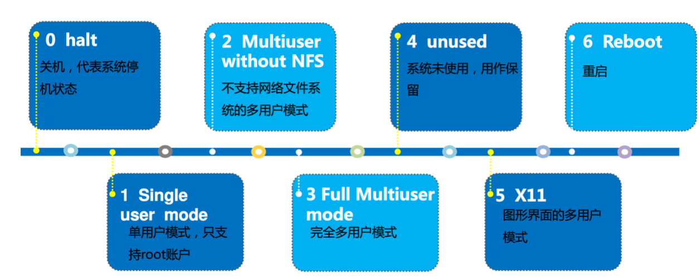

# 命令

[文件操作](#文件操作)

[一般](#一般)

[用户](#用户)

[组](#组)

[进程管理](#进程管理)

[软件包管理](#软件包管理)

[归档/压缩文件](#归档压缩文件)

[网络管理](#网络管理)

[硬盘分区管理](#硬盘分区管理)

| 命令                                         | 全称（辅助记忆）                                                                                             | 作用                                                                                                                                           | 选项                                                                                                                                                                                                                                                                                                                                                                                                                                                                                                                                                                                                                                                                                                                                                                                                                                                                                                                                                                                                                                                                                                                                                                                 |
|----------------------------------------------|--------------------------------------------------------------------------------------------------------------|------------------------------------------------------------------------------------------------------------------------------------------------|--------------------------------------------------------------------------------------------------------------------------------------------------------------------------------------------------------------------------------------------------------------------------------------------------------------------------------------------------------------------------------------------------------------------------------------------------------------------------------------------------------------------------------------------------------------------------------------------------------------------------------------------------------------------------------------------------------------------------------------------------------------------------------------------------------------------------------------------------------------------------------------------------------------------------------------------------------------------------------------------------------------------------------------------------------------------------------------------------------------------------------------------------------------------------------------|
| 文件操作                                     |                                                                                                              |                                                                                                                                                |                                                                                                                                                                                                                                                                                                                                                                                                                                                                                                                                                                                                                                                                                                                                                                                                                                                                                                                                                                                                                                                                                                                                                                                      |
| pandoc                                       |                                                                                                              | 文档文件转换                                                                                                                                   | pandoc -f docx -t markdown foo.docx -o foo.markdown --extract-media=./ 转换doc为markdown格式文件，并将所有图片等媒体文件打包到media文件夹                                                                                                                                                                                                                                                                                                                                                                                                                                                                                                                                                                                                                                                                                                                                                                                                                                                                                                                                                                                                                                            |
| which                                        |                                                                                                              | 用于查找命令/可执行文件所在的路径。                                                                                                            | locate a command，从环境变量PATH中，定位/返回与指定名字相匹配的可执行文件所在的路径 有时候可能在多个路径下存在相同的命令，该命令可用于查找当前所执行的命令到底是哪一个位置处的命令                                                                                                                                                                                                                                                                                                                                                                                                                                                                                                                                                                                                                                                                                                                                                                                                                                                                                                                                                                                                   |
| whereis                                      |                                                                                                              | locate the binary, source, and manual page files for a command.                                                                                | 定位/返回与指定名字匹配的二进制文件、源文件和帮助手册文件所在的路径。 whereis命令首先会去掉filename中的前缀空格和以.开头的任何字符，然后再在数据库（var/lib/slocate/slocate.db）中查找与上述处理后的filename相匹配的二进 制文件、源文件和帮助手册文件,使用之前可以使用updatedb命令手动更新数据库                                                                                                                                                                                                                                                                                                                                                                                                                                                                                                                                                                                                                                                                                                                                                                                                                                                                                     |
| cp                                           | copy                                                                                                         | 复制文件                                                                                                                                       | -a：此选项通常在复制目录时使用，它保留链接、文件属性，并复制目录下的所有内容。其作用等于dpR参数组合。 -d：复制时保留链接。这里所说的链接相当于Windows系统中的快捷方式。 -f：覆盖已经存在的目标文件而不给出提示。 -i：与-f选项相反，在覆盖目标文件之前给出提示，要求用户确认是否覆盖，回答"y"时目标文件将被覆盖。 -p：除复制文件的内容外，还把修改时间和访问权限也复制到新文件中。 -r：若给出的源文件是一个目录文件，此时将复制该目录下所有的子目录和文件。 -l：不复制文件，只是生成链接文件。                                                                                                                                                                                                                                                                                                                                                                                                                                                                                                                                                                                                                                                                                        |
| ls                                           | list                                                                                                         | 列出目录文件信息                                                                                                                               | -a all -l long 开头第一个字符是文件类型，之后才是权限，默认显示的是字节为单位的大小 -R 递归 -i 查看文件inode信息 -S 以文件大小排序 -h 会根据文件的大小选择显示的单位是“K”、“M”还是“G”。如果希望指定显示的单位，可以使用--block-size M等。                                                                                                                                                                                                                                                                                                                                                                                                                                                                                                                                                                                                                                                                                                                                                                                                                                                                                                                                            |
| du                                           | disk usage                                                                                                   | 列出文件夹磁盘占用大小                                                                                                                         | -h 以单位显示 --max-depth：表示要查看几层目录, 也可以用 -d 1表示查看1层目录  sort -r：反向显示 sort -h：compare human readable numbers (e.g., 2k 1G) 1. 在有些情况下，du -h不能显示所有的文件，例如iso文件，通用的方法为 du -h \* \| sort -hr 2. du -sh . 表示查看当前目录总占用空间 3. du -h -d 2 \| sort -hr 命令最好配合使用du -sh查看完某个目录大小后，再进入到某个目录查看内部文件大小，否则文件太多会很慢。                                                                                                                                                                                                                                                                                                                                                                                                                                                                                                                                                                                                                                                                                                                                                                    |
| rm                                           | remove                                                                                                       | 删除                                                                                                                                           | -r 递归删除 能删除目录下文件 -f 强制删除 rm -rf \* 删除当前目录下所有文件                                                                                                                                                                                                                                                                                                                                                                                                                                                                                                                                                                                                                                                                                                                                                                                                                                                                                                                                                                                                                                                                                                            |
| find                                         |                                                                                                              | 在指定目录下查找文件                                                                                                                           | find 目录 -各种参数  参数内容  任何位于参数之前的字符串都将被视为欲查找的**目录名**。如果使用该命令时，不设置任何参数，则 find 命令将在当前目录下查找子目录与文件。并且将查找到的子目录和文件全部进行显示。 支持参数： -mount, -xdev : 只检查和指定目录在同一个文件系统下的文件，避免列出其它文件系统中的文件  -amin n : 在过去 n 分钟内被读取过 -anewer file : 比文件 file 更晚被读取过的文件 -atime n : 在过去n天内被读取过的文件 -cmin n : 在过去 n 分钟内被修改过 -cnewer file :比文件 file 更新的文件 -ctime n : 在过去n天内被修改过的文件 -empty : 空的文件-gid n or -group name : gid 是 n 或是 group 名称是 name -ipath p, -path p : 路径名称符合 p 的文件，ipath 会忽略大小写 -name name, -iname name : 文件名称符合 name 的文件或目录 (**需要用””括起来用\*才会支持模糊查询**)。iname 会忽略大小写 -size n : 文件大小 是 n 单位，b 代表 512 位元组的区块，c 表示字元数，k 表示 kilo bytes，w 是二个位元组。 -type d: 目录（directory） c: 字型装置文件（character） b: 区块装置文件（block） s: 套接字文件（socket） p: 具名贮列；命名管道文件（pipe） f: 一般文件 l: 符号链接文件（link） -perm  接-mode 大于等于该权限 mode 完全匹配 /mode或+mode 部分匹配 即-755之类的  |
| locate                                       |                                                                                                              | 查找文件和目录                                                                                                                                 | 也是从数据库建立的索引中查找，不同的是该命令查找所有部分匹配的文件，使用之前可以使用updatedb命令手动更新数据库。 默认情况下(当filename中不包含通配符\*)，locate会给出所有与\*filename\*相匹配的文件的路径。 因为文件路径都是绝对路径，所以flename\*将匹配不到                                                                                                                                                                                                                                                                                                                                                                                                                                                                                                                                                                                                                                                                                                                                                                                                                                                                                                                        |
| file                                         |                                                                                                              | 查看文件类型                                                                                                                                   |                                                                                                                                                                                                                                                                                                                                                                                                                                                                                                                                                                                                                                                                                                                                                                                                                                                                                                                                                                                                                                                                                                                                                                                      |
| man                                          | manual                                                                                                       | 查询某命令用法                                                                                                                                 | man mv --help： date –help                                                                                                                                                                                                                                                                                                                                                                                                                                                                                                                                                                                                                                                                                                                                                                                                                                                                                                                                                                                                                                                                                                                                                           |
| touch                                        |                                                                                                              |                                                                                                                                                |                                                                                                                                                                                                                                                                                                                                                                                                                                                                                                                                                                                                                                                                                                                                                                                                                                                                                                                                                                                                                                                                                                                                                                                      |
| \>                                           |                                                                                                              | 覆盖写入                                                                                                                                       |                                                                                                                                                                                                                                                                                                                                                                                                                                                                                                                                                                                                                                                                                                                                                                                                                                                                                                                                                                                                                                                                                                                                                                                      |
| \>\>                                         |                                                                                                              | 追加写入                                                                                                                                       |                                                                                                                                                                                                                                                                                                                                                                                                                                                                                                                                                                                                                                                                                                                                                                                                                                                                                                                                                                                                                                                                                                                                                                                      |
| cat                                          | concatenate（串联）                                                                                          | 连接文件并打印到标准输出设备                                                                                                                   | -e 可以显示换行符、结束符等，检查CRLF等                                                                                                                                                                                                                                                                                                                                                                                                                                                                                                                                                                                                                                                                                                                                                                                                                                                                                                                                                                                                                                                                                                                                              |
| awk                                          | 之所以叫AWK是因为其取了三位创始人 Alfred Aho，Peter Weinberger, 和 Brian Kernighan 的 Family Name 的首字符。 | 是一种处理文本文件的语言，是一个强大的文本分析工具。                                                                                           | -F fs or --field-separator fs fs是一个字符串或者是一个正则表达式 例如： -F’:’ ‘{print \$1,\$3}’ 用：分隔并输出\$1、\$3号的内容                                                                                                                                                                                                                                                                                                                                                                                                                                                                                                                                                                                                                                                                                                                                                                                                                                                                                                                                                                                                                                                       |
| tail                                         |                                                                                                              | 查看文件的内容                                                                                                                                 | -f 循环读取 //不断刷新，文件更新会显示最新内容 -n\<行数\> 显示文件的尾部 n 行内容 -v 显示详细的处理信息                                                                                                                                                                                                                                                                                                                                                                                                                                                                                                                                                                                                                                                                                                                                                                                                                                                                                                                                                                                                                                                                              |
| ln                                           | link                                                                                                         | 为某一个文件在另外一个位置建立一个同步的链接                                                                                                   | -b 删除，覆盖以前建立的链接 -d 允许超级用户制作目录的硬链接 -f 强制执行 -i 交互模式，文件存在则提示用户是否覆盖 -n 把符号链接视为一般目录 -s 软链接(符号链接) -v 显示详细的处理过程 软链接类似win快捷方式，可以指向目录，但是硬链接不可以                                                                                                                                                                                                                                                                                                                                                                                                                                                                                                                                                                                                                                                                                                                                                                                                                                                                                                                                            |
| 一般                                         |                                                                                                              |                                                                                                                                                |                                                                                                                                                                                                                                                                                                                                                                                                                                                                                                                                                                                                                                                                                                                                                                                                                                                                                                                                                                                                                                                                                                                                                                                      |
| bash                                         |                                                                                                              | 执行命令                                                                                                                                       | 命令shell可以有其他的，比如zsh，相关配置文件是用户目录下\~/.zshrc                                                                                                                                                                                                                                                                                                                                                                                                                                                                                                                                                                                                                                                                                                                                                                                                                                                                                                                                                                                                                                                                                                                    |
| crontab                                      |                                                                                                              | 定时任务                                                                                                                                       | -u user 用来设定某个用户的 crontab 服务，例如 "-u demo" 表示设备 demo 用户的 crontab 服务，此选项一般有 root 用户来运行。 -e 编辑某个用户的 crontab 文件内容。如果不指定用户，则表示编辑当前用户的 crontab 文件。 -l 显示某用户的 crontab 文件内容，如果不指定用户，则表示显示当前用户的 crontab 文件内容。 -r 从 /var/spool/cron 删除某用户的 crontab 文件，如果不指定用户，则默认删除当前用户的 crontab 文件。  -i 在删除用户的 crontab 文件时，给确认提示。                                                                                                                                                                                                                                                                                                                                                                                                                                                                                                                                                                                                                                                                                                                       |
| wc                                           | word count                                                                                                   | 计算文件的Byte数、字数、或是列数                                                                                                               | 若不指定文件名称、或是所给予的文件名为"-"，则wc指令会从标准输入设备读取数据。 默认按照行数、字数、字节数输出 -c或--bytes或--chars 只显示Bytes数。 -l或--lines 只显示行数。 -w或--words 只显示字数。                                                                                                                                                                                                                                                                                                                                                                                                                                                                                                                                                                                                                                                                                                                                                                                                                                                                                                                                                                                  |
| xargs                                        | eXtended ARGuments                                                                                           | 转换参数，它将标准输入转换为命令行参数                                                                                                         | xargs实现的是将管道传递过来的stdin进行处理然后传递到命令的参数位置上。 例： 批量转unix格式.sh find ./ -name "\*.sh" \| xargs dos2unix  <https://www.jianshu.com/p/676353506f0b>                                                                                                                                                                                                                                                                                                                                                                                                                                                                                                                                                                                                                                                                                                                                                                                                                                                                                                                                                                                                      |
| dos2unix                                     |                                                                                                              | Windows换行转linux换行                                                                                                                         | 脚本文件中常常出现的换行问题                                                                                                                                                                                                                                                                                                                                                                                                                                                                                                                                                                                                                                                                                                                                                                                                                                                                                                                                                                                                                                                                                                                                                         |
| date                                         |                                                                                                              | 输出当前日期                                                                                                                                   | +'%Y-%m-%d %H:%M:%S' 按格式输出 %Y xxxx 年 %y xx 年份  %m month %d day日期 %H hour %M minute %S second                                                                                                                                                                                                                                                                                                                                                                                                                                                                                                                                                                                                                                                                                                                                                                                                                                                                                                                                                                                                                                                                               |
| pwd                                          | print working directory                                                                                      | 查看当前工作目录                                                                                                                               | 当前路径                                                                                                                                                                                                                                                                                                                                                                                                                                                                                                                                                                                                                                                                                                                                                                                                                                                                                                                                                                                                                                                                                                                                                                             |
| cd                                           | change directory                                                                                             | 切换目录                                                                                                                                       | 参数为空等同于\~: 进入当前用户的主目录 **“-”：返回刚才的工作目录** “/”：直接切换到根目录                                                                                                                                                                                                                                                                                                                                                                                                                                                                                                                                                                                                                                                                                                                                                                                                                                                                                                                                                                                                                                                                                             |
| runlevel                                     |                                                                                                              | 查看运行级别                                                                                                                                   |                                                                                                                                                                                                                                                                                                                                                                                                                                                                                                                                                                                                                                                                                                                                                                                                                                                                                                                                                                                                                                                                                                                                                                                      |
| init                                         |                                                                                                              | 切换运行级别（临时）                                                                                                                           |                                                                                                                                                                                                                                                                                                                                                                                                                                                                                                                                                                                                                                                                                                                                                                                                                                                                                                                                                                                                                                                                                                                                                                                      |
| systemctl                                    |                                                                                                              | 服务管理                                                                                                                                       | set-default  multi-user.target 默认为多用户模式 graphical.target 默认为图形界面模式 get-default 获取默认运行级别 \# 启动服务 systemctl start xxxx \# 关闭服务 systemctl stop xxxx \# 查看状态 systemctl status xxxx  \# 开机禁用  systemctl disable xxxx \# 开机启用 systemctl enable xxxx                                                                                                                                                                                                                                                                                                                                                                                                                                                                                                                                                                                                                                                                                                                                                                                                                                                                                           |
| rebot                                        |                                                                                                              | 重启                                                                                                                                           |                                                                                                                                                                                                                                                                                                                                                                                                                                                                                                                                                                                                                                                                                                                                                                                                                                                                                                                                                                                                                                                                                                                                                                                      |
| grep                                         | Global Regular Expression Print                                                                              | 查找文件里符合条件的字符串并打印（正则表达式）                                                                                                 | -i 忽略大小写 -c 计算找到的符号行的次数 -o 或 --only-matching : 只显示匹配PATTERN 部分。  -E扩展的正则表达式：ERP（egrep或grep -E) +重复一个或一个以上前面的字符 ？复0个或一个0前面的字符 \|用或的方式查找多个符合的字符串                                                                                                                                                                                                                                                                                                                                                                                                                                                                                                                                                                                                                                                                                                                                                                                                                                                                                                                                                           |
| bc                                           |                                                                                                              | 任意精度计算器语言                                                                                                                             |                                                                                                                                                                                                                                                                                                                                                                                                                                                                                                                                                                                                                                                                                                                                                                                                                                                                                                                                                                                                                                                                                                                                                                                      |
| cal                                          |                                                                                                              | 日历                                                                                                                                           |                                                                                                                                                                                                                                                                                                                                                                                                                                                                                                                                                                                                                                                                                                                                                                                                                                                                                                                                                                                                                                                                                                                                                                                      |
| poweroff shutdown halt init                  |                                                                                                              | 关机                                                                                                                                           |                                                                                                                                                                                                                                                                                                                                                                                                                                                                                                                                                                                                                                                                                                                                                                                                                                                                                                                                                                                                                                                                                                                                                                                      |
| su                                           | switch user                                                                                                  | 切换用户                                                                                                                                       |                                                                                                                                                                                                                                                                                                                                                                                                                                                                                                                                                                                                                                                                                                                                                                                                                                                                                                                                                                                                                                                                                                                                                                                      |
| chmod                                        | change mode                                                                                                  | 修改文件mode 权限等                                                                                                                            | r ————4 w ———–2 x ————1 - ————0 r 表示文件可以被读（read） w 表示文件可以被写（write） x 表示文件可以被执行（如果它是程序的话） 用字母： chmod u+x 文件名 u：用户 g：组 o：其他用户 a：所有人 +：增加权限 -：减少权限 =：赋予权限   777 = rwx rwx rwx 所有者、组群、其他人 1+2+4=7  特殊权限： SetUID（简称suid）（数字权限是4000）针对用户位 临时使用命令的属主权限执行该命令。即如果文件有suid权限时，那么普通用户去执行该文件时，会以该文件的所属用户的身份去执行。主要是对命令，或者二进制文件，以该二进制文件的属主权限来执行该文件。 用户位拥有执行权限的执行权限位变为s否则是S  setGID（简称sgid）（数字权限是2000）针对用户组位 多个用户共享一个组（仅作了解）。主要是针对目录进行授权，共享目录。组权限位拥有执行权限改写s，否则是S  sbit 粘滞位（数字权限是1000）粘滞位，针对其他用户位 即便是该目录拥有w权限，但是除了root用户，其他用户只能对自己的文件进行删除、移动操作。其他用户位由执行权限的变为t否则是T                                                                                                                                                                                                                                                            |
| chattr                                       |                                                                                                              | 设置特殊权限                                                                                                                                   | 凌驾于r、w、x、suid、sgid之上的权限。 -i \#锁定文件，不能编辑，不能修改，不能删除，不能移动，可以执行 -a \#仅可以追加文件，不能编辑，不能删除，不能移动，可以执行 +是给权限 -是减权限                                                                                                                                                                                                                                                                                                                                                                                                                                                                                                                                                                                                                                                                                                                                                                                                                                                                                                                                                                                                |
| umask                                        |                                                                                                              | 进程掩码（设定文件初始权限时会用到）                                                                                                           | 当我们登录系统之后，创建一个文件总是有一个默认权限，比如： 目录默认权限：755 文件默认权限：644 那么这个权限是怎么来的呢？ 不瞒你说，这就是umask做的，umask设置了用户创建文件的默认权限。 系统默认umask为022，那么当我们创建一个目录时，正常情况下目录的权限应该是777，但是umask表示要减去的值，所以新目录文件的权限应该是777-022=755。至于文件的权限也依次类推：666-022=644 umask涉及到的相关文件/etc/bashrc /etc/profile \~/.bashrc \~/.bash_profile                                                                                                                                                                                                                                                                                                                                                                                                                                                                                                                                                                                                                                                                                                                                |
| chown                                        |                                                                                                              | 改变文件所有者或组                                                                                                                             | chown 用户[:组] 文件名 -R参数是对文件夹内的文件递归进行修改                                                                                                                                                                                                                                                                                                                                                                                                                                                                                                                                                                                                                                                                                                                                                                                                                                                                                                                                                                                                                                                                                                                          |
| chgrp                                        |                                                                                                              | 改变文件所有组                                                                                                                                 |                                                                                                                                                                                                                                                                                                                                                                                                                                                                                                                                                                                                                                                                                                                                                                                                                                                                                                                                                                                                                                                                                                                                                                                      |
| whoami                                       |                                                                                                              | 查看当前用户名                                                                                                                                 | 使用sudo的话会显示的是root 环境变量\$USER                                                                                                                                                                                                                                                                                                                                                                                                                                                                                                                                                                                                                                                                                                                                                                                                                                                                                                                                                                                                                                                                                                                                            |
| who am i                                     |                                                                                                              | 显示的是“登录用户”的用户名（用户登录时用过的id）                                                                                               |                                                                                                                                                                                                                                                                                                                                                                                                                                                                                                                                                                                                                                                                                                                                                                                                                                                                                                                                                                                                                                                                                                                                                                                      |
| who                                          |                                                                                                              | 显示系统中有哪些使用者正在上面，显示的资料包含了使用者 ID、使用的终端机、从哪边连上来的、上线时间、呆滞时间、CPU 使用量、动作等等。            | 使用权限：所有使用者都可使用。                                                                                                                                                                                                                                                                                                                                                                                                                                                                                                                                                                                                                                                                                                                                                                                                                                                                                                                                                                                                                                                                                                                                                       |
| type                                         |                                                                                                              | 查看命令信息或是否存在                                                                                                                         |                                                                                                                                                                                                                                                                                                                                                                                                                                                                                                                                                                                                                                                                                                                                                                                                                                                                                                                                                                                                                                                                                                                                                                                      |
| alias                                        |                                                                                                              | 给命令设置别名                                                                                                                                 | unalias 删除别名 用户可利用alias，自定指令的别名。若仅输入alias，则可列出目前所有的别名设置。alias的效力仅及于该次登入的操作。若要每次登入是即自动设好别名，可在.profile或.cshrc中设定指令的别名。 alias xxx=’xxx’ 注意=两边不能包含空格                                                                                                                                                                                                                                                                                                                                                                                                                                                                                                                                                                                                                                                                                                                                                                                                                                                                                                                                             |
| diff                                         |                                                                                                              | 比较两个文件                                                                                                                                   | 不相同就会输出differ                                                                                                                                                                                                                                                                                                                                                                                                                                                                                                                                                                                                                                                                                                                                                                                                                                                                                                                                                                                                                                                                                                                                                                 |
| wc                                           |                                                                                                              | 统计文件                                                                                                                                       |                                                                                                                                                                                                                                                                                                                                                                                                                                                                                                                                                                                                                                                                                                                                                                                                                                                                                                                                                                                                                                                                                                                                                                                      |
| chsh                                         | change shell                                                                                                 | 切换Shell                                                                                                                                      | chsh -s /bin/bash 通过 -s 参数改变当前的shell设置 cat /etc/shells可以看安装了哪些shell -u \| --help显示帮助文档 -v \| --version 显示命令版本 -s \| --shell改变登录后使用的shell环境 -l \| --list-shells显示系统当前可以用的shell                                                                                                                                                                                                                                                                                                                                                                                                                                                                                                                                                                                                                                                                                                                                                                                                                                                                                                                                                     |
| 用户                                         |                                                                                                              |                                                                                                                                                |                                                                                                                                                                                                                                                                                                                                                                                                                                                                                                                                                                                                                                                                                                                                                                                                                                                                                                                                                                                                                                                                                                                                                                                      |
| useradd                                      |                                                                                                              | 添加用户                                                                                                                                       | uid从1000开始 -u 用户ID 指定用户UID -g 组ID或组名  指定新用户的主组 -G 组ID或组名 指定新用户的附加组 -d 主目录 指定新用户的主目录 -s 登录shell 指定新用户使用的shell，默认为/bin/bash -e 有效期限 指定用户的登录失效时间，例如：11/30/2012 -f 缓冲天数 设置在密码过期后多少天关闭该帐号 -c 备注 为账户加上备注 -m 默认主目录  自动创建与用户名同名目录 -n  取消建立以用户名称为名的组 -r 建立系统帐号 注意：由于新增加的用户还未设置密码，因此还不能使用该用户的帐号登录系统。                                                                                                                                                                                                                                                                                                                                                                                                                                                                                                                                                                                                                                                                                                       |
| passwd                                       |                                                                                                              | 修改密码                                                                                                                                       | passwd用户名 修改密码 passwd -d 用户名 删除密码 -d （delete） 删除用户的口令，则该用户账号无需口令即可登录。 -l （lock） 锁住口令。 -u （unlock） 恢复禁用用户账号。 -S （status） 显示指定用户账号的状态                                                                                                                                                                                                                                                                                                                                                                                                                                                                                                                                                                                                                                                                                                                                                                                                                                                                                                                                                                            |
| usermod                                      |                                                                                                              | 修改用户的属性信息                                                                                                                             | -g 组ID或组名 指定新用户的主组 -G 组ID或组名 指定新用户的附加组 -d 主目录  指定新用户的主目录 -s 登录shell  指定新用户使用的shell，默认为bash -e 有效期限  指定用户的登录失效时间 -u 用户ID  指定用户UID -c 全名  指定用户全称 -f 缓冲天数  指定口令过期后多久将关闭此账号 -l 用户名  指定用户的新名称 -L 用户名  锁定用户密码，使密码无效 -U 用户名  解除密码锁定。 注意：usermod命令与useradd命令的区别在于 usermod命令可以修改用户名且在禁用和恢复账号功能上，命令usermod不等同于 passwd。                                                                                                                                                                                                                                                                                                                                                                                                                                                                                                                                                                                                                                                                                        |
| userdel                                      |                                                                                                              | 删除指定的用户账号                                                                                                                             | -r  用于删除用户的Home目录和邮件  -f  强制删除用户登录目录及目录中的所有文件 注意：正在使用系统的用户不能被删除，必须先终 止该用户的所有进程才能删除该用户                                                                                                                                                                                                                                                                                                                                                                                                                                                                                                                                                                                                                                                                                                                                                                                                                                                                                                                                                                                                                           |
| id                                           |                                                                                                              | 查看一个用户的UID和GID                                                                                                                         |                                                                                                                                                                                                                                                                                                                                                                                                                                                                                                                                                                                                                                                                                                                                                                                                                                                                                                                                                                                                                                                                                                                                                                                      |
| 组                                           |                                                                                                              |                                                                                                                                                |                                                                                                                                                                                                                                                                                                                                                                                                                                                                                                                                                                                                                                                                                                                                                                                                                                                                                                                                                                                                                                                                                                                                                                                      |
| groupadd                                     |                                                                                                              | 添加组                                                                                                                                         | gid从1000开始 该指令的执行将在/etc/group文件和/etc/gshadow文件中分别增加一行记录 -r：用于创建系统组账号（GID小于1000 ） -g：用于指定GID                                                                                                                                                                                                                                                                                                                                                                                                                                                                                                                                                                                                                                                                                                                                                                                                                                                                                                                                                                                                                                              |
| groupmod                                     |                                                                                                              | 修改指定组群                                                                                                                                   | -g：改变组账号的GID ，组账号名保持不变。 -n：改变组账号名。                                                                                                                                                                                                                                                                                                                                                                                                                                                                                                                                                                                                                                                                                                                                                                                                                                                                                                                                                                                                                                                                                                                          |
| groupdel                                     |                                                                                                              | 删除指定组群                                                                                                                                   | 被删除的组账号必须存在；当有用户使用组账号作为私有组时不能删除；与用户名同名的私有组账号在使用userdel命令删除用户时被同时删除                                                                                                                                                                                                                                                                                                                                                                                                                                                                                                                                                                                                                                                                                                                                                                                                                                                                                                                                                                                                                                                        |
| 进程管理                                     |                                                                                                              |                                                                                                                                                |                                                                                                                                                                                                                                                                                                                                                                                                                                                                                                                                                                                                                                                                                                                                                                                                                                                                                                                                                                                                                                                                                                                                                                                      |
| &                                            |                                                                                                              | 启动后台进程                                                                                                                                   | 命令最后加一个&即是启动了一个后台进程                                                                                                                                                                                                                                                                                                                                                                                                                                                                                                                                                                                                                                                                                                                                                                                                                                                                                                                                                                                                                                                                                                                                                |
| jobs                                         |                                                                                                              | 查看当前shell中后台进程的执行状态                                                                                                              | -l                                                                                                                                                                                                                                                                                                                                                                                                                                                                                                                                                                                                                                                                                                                                                                                                                                                                                                                                                                                                                                                                                                                                                                                   |
| fg %n                                        | ForeGround                                                                                                   | 将后台进程唤回前台执行                                                                                                                         | n代表后台进程的工作号                                                                                                                                                                                                                                                                                                                                                                                                                                                                                                                                                                                                                                                                                                                                                                                                                                                                                                                                                                                                                                                                                                                                                                |
| uptime                                       |                                                                                                              | 使用uptime命令可显示系统当前时间、用户已登录系统的时间、系统中登录用户的数量、过去的1、5、15分钟内运行队列中的平均进程数量                     | 注意：通常，只要每个cpu的当前活动进程数不大于3，则表示系统的性能良好，如果每个cpu的进程数大于5，则表示这台计算机的性能有严重问题。（？）                                                                                                                                                                                                                                                                                                                                                                                                                                                                                                                                                                                                                                                                                                                                                                                                                                                                                                                                                                                                                                             |
| ps                                           | process status                                                                                               | 监控后台进程的工作情况                                                                                                                         | -e：显示所有进程。 -f：全格式。 -h：不显示标题。 -l：长格式。 -w：宽输出。 -a：显示终端上的所有进程，包括其他用户的进程。  -r：只显示正在运行的进程。                                                                                                                                                                                                                                                                                                                                                                                                                                                                                                                                                                                                                                                                                                                                                                                                                                                                                                                                                                                                                                |
| top                                          |                                                                                                              | 动态查看系统中正在运行的进程的状态                                                                                                             | 使用ps命令查看的是进程在过去某一时间的情况，要动态查看系统中正在运行的进程的状态，可使用top命令。默认情况下，top显示的信息每隔3秒刷新一次。 用户还可以在top程序的执行过程中输入命令，以交互方式控制执行结果。  常用的命令有以下几种： \<空格\>：立即刷新显示。 h：显示帮助信息。 k：终止一个进程。 r：设置进程的优先级别。 s：改变两次刷新之间的延迟时间。 M：根据驻留内存大小进行排序。 P：根据CPU使用百分比大小进行排序。 T：根据时间/累计时间进行排序。 W：将当前设置写入\~/.toprc文件中。 q：退出程序。 top -bn1 //一次性显示全部的进程信息并退出top环境                                                                                                                                                                                                                                                                                                                                                                                                                                                                                                                                                                                                                         |
| [ctrl+c]                                     |                                                                                                              | 终止前台进程                                                                                                                                   |                                                                                                                                                                                                                                                                                                                                                                                                                                                                                                                                                                                                                                                                                                                                                                                                                                                                                                                                                                                                                                                                                                                                                                                      |
| kill                                         |                                                                                                              | 终止后台进程                                                                                                                                   | kill [选项] [信号代码] [进程ID] -l 列出kill命令支持的信号类型 代码15所对应的信号为SIGTERM，使用该信号可正常结束一个进程。而代码9所对应的信号为SIGKILL，使用该信号可用来强行终止一个进程。                                                                                                                                                                                                                                                                                                                                                                                                                                                                                                                                                                                                                                                                                                                                                                                                                                                                                                                                                                                            |
| 软件包管理                                   |                                                                                                              |                                                                                                                                                |                                                                                                                                                                                                                                                                                                                                                                                                                                                                                                                                                                                                                                                                                                                                                                                                                                                                                                                                                                                                                                                                                                                                                                                      |
| rpm                                          | redhat package management                                                                                    | 安装、删除、更新rpm软件包，root用户才行，除非普通用户有安装目录的权限，否则只有查询功能                                                        | 包与包之间相互依赖，卸载也会将依赖卸载。 软件包格式： name-version-release.arch.rpm release[.os].arch release指rpm包版本 os指所用的操作系统（可省略） arch指所用的CPU类型 软件包名只是name                                                                                                                                                                                                                                                                                                                                                                                                                                                                                                                                                                                                                                                                                                                                                                                                                                                                                                                                                                                           |
| -ivh 软件包全名.rpm                          |                                                                                                              | 安装rpm软件包                                                                                                                                  | -i：install 安装一个新的软件包 -v：显示详细信息 -h：显示安装进度条                                                                                                                                                                                                                                                                                                                                                                                                                                                                                                                                                                                                                                                                                                                                                                                                                                                                                                                                                                                                                                                                                                                   |
| -Uvh 包全名 -Fvh 包全名                      |                                                                                                              | 升级rpm                                                                                                                                        | -U update原来没有安装过的，直接安装；如果已安装过，则更新至新版 -F Freshen 原来没有安装过的，不安装；如果已安装过，则更新至新版                                                                                                                                                                                                                                                                                                                                                                                                                                                                                                                                                                                                                                                                                                                                                                                                                                                                                                                                                                                                                                                      |
| -q 包名（非全名） -qa                        |                                                                                                              | 查询已安装的rpm包                                                                                                                              | -a (all) //当前系统全部已安装的 -q (query) //查询 -ql //列出rpm包的文件 -qf 文件的绝对路径 //列出文件属于哪个rpm包 -qi //得到已安装rpm包的信息                                                                                                                                                                                                                                                                                                                                                                                                                                                                                                                                                                                                                                                                                                                                                                                                                                                                                                                                                                                                                                       |
| -e 包名（非全名）                            |                                                                                                              | 删除已经安装的rpm包                                                                                                                            | -e erase 删除                                                                                                                                                                                                                                                                                                                                                                                                                                                                                                                                                                                                                                                                                                                                                                                                                                                                                                                                                                                                                                                                                                                                                                        |
| --force                                      |                                                                                                              |                                                                                                                                                | 强制安装，比如你装过这个rpm的版本1，如果你想装这个rpm的版本2，就需要用--force强制安装。                                                                                                                                                                                                                                                                                                                                                                                                                                                                                                                                                                                                                                                                                                                                                                                                                                                                                                                                                                                                                                                                                              |
| --nodeps                                     |                                                                                                              |                                                                                                                                                | 安装时不检查依赖关系，比如你这个rpm需要A，但是你没装A，这样你的包就装不上，用了--nodeps你就能装上了。                                                                                                                                                                                                                                                                                                                                                                                                                                                                                                                                                                                                                                                                                                                                                                                                                                                                                                                                                                                                                                                                                |
| yum                                          | Yellow dog Updater Modified                                                                                  | 软件包管理器 联网安装 使用配置文件/etc/yum.conf 自动解决增加或删除rpm包的时候的依赖关系 更方便的添加/删除/更新包，要配置资源仓库（Repository） | 是一个在Fedora和RedHat以及SUSE中的Shell前端软件包管理器。基於RPM包管理，能够从指定的服务器自动下载RPM包并且安装，可以自动处理依赖性关系，并且一次安装所有依赖的软体包，无须繁琐地一次次下载、安装。 rpm 只能安装已经下载到本地机器上的rpm 包. yum能在线下载并安装rpm包,能更新系统,且还能自动处理包与包之间的依赖问题,这个是rpm 工具所不具备的。  yum属于Redhat、Centos包管理工具 install + 包名 可加多个                                                                                                                                                                                                                                                                                                                                                                                                                                                                                                                                                                                                                                                                                                                                                                             |
| yum list                                     |                                                                                                              | 列出所用可用的rpm包                                                                                                                            | 可用yum list \| grep [关键字]过滤                                                                                                                                                                                                                                                                                                                                                                                                                                                                                                                                                                                                                                                                                                                                                                                                                                                                                                                                                                                                                                                                                                                                                    |
| yum search [包名]                            |                                                                                                              | 搜索一个rpm包                                                                                                                                  |                                                                                                                                                                                                                                                                                                                                                                                                                                                                                                                                                                                                                                                                                                                                                                                                                                                                                                                                                                                                                                                                                                                                                                                      |
| yum install [包名]                           |                                                                                                              | 安装rpm包                                                                                                                                      | -y 参数是默认yes                                                                                                                                                                                                                                                                                                                                                                                                                                                                                                                                                                                                                                                                                                                                                                                                                                                                                                                                                                                                                                                                                                                                                                     |
| yum remove                                   |                                                                                                              | 卸载rpm包                                                                                                                                      |                                                                                                                                                                                                                                                                                                                                                                                                                                                                                                                                                                                                                                                                                                                                                                                                                                                                                                                                                                                                                                                                                                                                                                                      |
| yum update                                   |                                                                                                              | 升级rpm包                                                                                                                                      |                                                                                                                                                                                                                                                                                                                                                                                                                                                                                                                                                                                                                                                                                                                                                                                                                                                                                                                                                                                                                                                                                                                                                                                      |
| apt-get                                      |                                                                                                              |                                                                                                                                                | 属于ubuntu、Debian的包管理工具                                                                                                                                                                                                                                                                                                                                                                                                                                                                                                                                                                                                                                                                                                                                                                                                                                                                                                                                                                                                                                                                                                                                                       |
| 归档/压缩文件                                |                                                                                                              |                                                                                                                                                |                                                                                                                                                                                                                                                                                                                                                                                                                                                                                                                                                                                                                                                                                                                                                                                                                                                                                                                                                                                                                                                                                                                                                                                      |
| tar                                          |                                                                                                              | tar归档（打包但未压缩）                                                                                                                        | -c: 建立归档文件 -x：从归档中抽取文件。 -t：显示包括在tar文件中的文件列表。 -r：向压缩归档文件末尾追加文件 -u：更新原压缩包中的文件 tar -cvf 只有这样建立的归档文件才用-rvf追加文件，如果是压缩过的则无法追加  这五个是独立的命令，压缩解压都要用到其中一个，可以和别的命令连用但只能用其中一个。下面的参数是根据需要在压缩或解压档案时可选的。  -z：使用gzip来压缩tar文件。 -j：使用bzip2来压缩tar文件。 -Z：有compress属性的 -v：显示文件的归档进度 -O：将文件解开到标准输出  下面的参数-f是必须的  -f: 使用压缩文件名字，切记，这个参数是最后一个参数，后面接压缩文件名。  -cvf firzle.tar file1 file2 …                                                                                                                                                                                                                                                                                                                                                                                                                                                                                                                                                                          |
| gzip/gunzip(gzip -d)                         | \*.gz                                                                                                        |                                                                                                                                                |                                                                                                                                                                                                                                                                                                                                                                                                                                                                                                                                                                                                                                                                                                                                                                                                                                                                                                                                                                                                                                                                                                                                                                                      |
| compress/uncompress                          | \*.z                                                                                                         |                                                                                                                                                |                                                                                                                                                                                                                                                                                                                                                                                                                                                                                                                                                                                                                                                                                                                                                                                                                                                                                                                                                                                                                                                                                                                                                                                      |
| bzip2/bunzip2(bzip2 -d)                      | \*.bz2                                                                                                       |                                                                                                                                                |                                                                                                                                                                                                                                                                                                                                                                                                                                                                                                                                                                                                                                                                                                                                                                                                                                                                                                                                                                                                                                                                                                                                                                                      |
| zcat                                         |                                                                                                              | 打开\*.gz、\*.z文件                                                                                                                            |                                                                                                                                                                                                                                                                                                                                                                                                                                                                                                                                                                                                                                                                                                                                                                                                                                                                                                                                                                                                                                                                                                                                                                                      |
| bzcat                                        |                                                                                                              | 打开\*.bz2文件                                                                                                                                 |                                                                                                                                                                                                                                                                                                                                                                                                                                                                                                                                                                                                                                                                                                                                                                                                                                                                                                                                                                                                                                                                                                                                                                                      |
| rz                                           |                                                                                                              |                                                                                                                                                | 用于linux与windows之间的文件上传（需要在window安装xshell）                                                                                                                                                                                                                                                                                                                                                                                                                                                                                                                                                                                                                                                                                                                                                                                                                                                                                                                                                                                                                                                                                                                           |
| sz                                           |                                                                                                              |                                                                                                                                                | 用于linux与windows之间的文件下载（需要在window安装xshell）                                                                                                                                                                                                                                                                                                                                                                                                                                                                                                                                                                                                                                                                                                                                                                                                                                                                                                                                                                                                                                                                                                                           |
| 网络管理                                     |                                                                                                              |                                                                                                                                                |                                                                                                                                                                                                                                                                                                                                                                                                                                                                                                                                                                                                                                                                                                                                                                                                                                                                                                                                                                                                                                                                                                                                                                                      |
| hostname                                     |                                                                                                              | 查看、设置主机名                                                                                                                               | hostname +新名字 //临时生效 永久生效： vi /etc/hostname hostname -I 查看本机IP                                                                                                                                                                                                                                                                                                                                                                                                                                                                                                                                                                                                                                                                                                                                                                                                                                                                                                                                                                                                                                                                                                       |
| tcpdump src host 192.168.1.100 -w result.cap |                                                                                                              | Tcpdump抓包指定ip并保存到result.cap到当前目录                                                                                                  | <https://zhuanlan.zhihu.com/p/74812069>                                                                                                                                                                                                                                                                                                                                                                                                                                                                                                                                                                                                                                                                                                                                                                                                                                                                                                                                                                                                                                                                                                                                              |
| ifconfig                                     |                                                                                                              | 显示或设置网络设备                                                                                                                             |                                                                                                                                                                                                                                                                                                                                                                                                                                                                                                                                                                                                                                                                                                                                                                                                                                                                                                                                                                                                                                                                                                                                                                                      |
| route                                        |                                                                                                              | 设置网关                                                                                                                                       |                                                                                                                                                                                                                                                                                                                                                                                                                                                                                                                                                                                                                                                                                                                                                                                                                                                                                                                                                                                                                                                                                                                                                                                      |
| ping                                         |                                                                                                              | 检测网络连通性                                                                                                                                 | -c 次数 -s 设置数据包大小 -i 间隔时间                                                                                                                                                                                                                                                                                                                                                                                                                                                                                                                                                                                                                                                                                                                                                                                                                                                                                                                                                                                                                                                                                                                                                |
| netstat                                      | netstatus                                                                                                    | 显示与IP、TCP、UDP和ICMP协议相关的统计数据，一般用于检验本机各端口的网络连接情况                                                               | -tanp 去显示端口状态                                                                                                                                                                                                                                                                                                                                                                                                                                                                                                                                                                                                                                                                                                                                                                                                                                                                                                                                                                                                                                                                                                                                                                 |
| nslookup                                     |                                                                                                              | 测试域名解析                                                                                                                                   |                                                                                                                                                                                                                                                                                                                                                                                                                                                                                                                                                                                                                                                                                                                                                                                                                                                                                                                                                                                                                                                                                                                                                                                      |
| nmap                                         |                                                                                                              | 端口扫描工具                                                                                                                                   | nmap x.x.x.x -p 端口或端口范围， 如果是扫UDP端口多加个-sU参数，实际上默认是-sT，扫描TCP端口                                                                                                                                                                                                                                                                                                                                                                                                                                                                                                                                                                                                                                                                                                                                                                                                                                                                                                                                                                                                                                                                                          |
| 查看开放端口                                 |                                                                                                              |                                                                                                                                                | iptables -L -n 查看开放端口 nmap -sS 127.0.0.1                                                                                                                                                                                                                                                                                                                                                                                                                                                                                                                                                                                                                                                                                                                                                                                                                                                                                                                                                                                                                                                                                                                                       |
| iptables                                     |                                                                                                              | IP 信息包过滤系统（防火墙）                                                                                                                    | 启动/关闭防火墙 service iptables start、stop 临时添加端口 iptables -I INPUT -p tcp --dport 8080 -j ACCEPT 查看当前input的filter规则 iptables --line -vnL INPUT                                                                                                                                                                                                                                                                                                                                                                                                                                                                                                                                                                                                                                                                                                                                                                                                                                                                                                                                                                                                                       |
| nginx                                        |                                                                                                              |                                                                                                                                                | 启动关闭nginx 其实可以直接用nginx 启动： /usr/ sbin/nginx -c /usr/local/nginx/conf/nginx.conf 关闭： /usr/ sbin/nginx -s stop ./nginx -t \#检查配置文件是否正确无误 /nginx -c /usr/local/nginx/conf/nginx.conf \#使用上一步配置的nginx.conf启动nginx服务 vi /etc/nginx/nginx.conf nginx配置文件                                                                                                                                                                                                                                                                                                                                                                                                                                                                                                                                                                                                                                                                                                                                                                                                                                                                                      |
| firewalld                                    |                                                                                                              | CentOS7                                                                                                                                        | \# 查看全部打开的端口 firewall-cmd --zone=public --list-ports \#开放33061端口tcp --permanent永久生效，没有此参数重启后失效 firewall-cmd --zone=public --add-port=33061/tcp --permanent  重新载入防火墙 firewall-cmd --reload                                                                                                                                                                                                                                                                                                                                                                                                                                                                                                                                                                                                                                                                                                                                                                                                                                                                                                                                                         |
| vi /etc/hosts                                |                                                                                                              | 设置本机Hosts                                                                                                                                  |                                                                                                                                                                                                                                                                                                                                                                                                                                                                                                                                                                                                                                                                                                                                                                                                                                                                                                                                                                                                                                                                                                                                                                                      |
| ssh root@ip -p 22                            |                                                                                                              | 使用ssh登录其他linux机器                                                                                                                       | 机器互相需要安装 (redhat，fedora，centos) sudo yum install sshd 或 sudo yum install openssh-server  (debian，ubuntu，linux mint) sudo apt-get install sshd 或 sudo apt-get install openssh-server  服务开启 service sshd start  编辑配置文件 sudo vi /etc/ssh/sshd_config PermitRootLogin需要置yes                                                                                                                                                                                                                                                                                                                                                                                                                                                                                                                                                                                                                                                                                                                                                                                                                                                                                   |
| 配置代理                                     |                                                                                                              |                                                                                                                                                | export http_proxy=http://proxyAddress:port export https_proxy=http://127.0.0.1:12333 export http_proxy="socks5://127.0.0.1:1080" 当写在bashrc文件中时，需要使用source bashrc生效配置文件                                                                                                                                                                                                                                                                                                                                                                                                                                                                                                                                                                                                                                                                                                                                                                                                                                                                                                                                                                                             |
| 硬盘分区管理                                 |                                                                                                              |                                                                                                                                                |                                                                                                                                                                                                                                                                                                                                                                                                                                                                                                                                                                                                                                                                                                                                                                                                                                                                                                                                                                                                                                                                                                                                                                                      |
| fdisk                                        |                                                                                                              | 磁盘分区工具                                                                                                                                   | -t 改分区ID -p print 打印分区表 -m 帮助信息 -n 添加分区                                                                                                                                                                                                                                                                                                                                                                                                                                                                                                                                                                                                                                                                                                                                                                                                                                                                                                                                                                                                                                                                                                                              |
| mkfs                                         |                                                                                                              | 格式化分区                                                                                                                                     | mkfs -t ext4 /dev/sdc1 将主分区格式化为ext4系统                                                                                                                                                                                                                                                                                                                                                                                                                                                                                                                                                                                                                                                                                                                                                                                                                                                                                                                                                                                                                                                                                                                                      |
| fsck                                         |                                                                                                              | 检查未挂载的分区是否正常                                                                                                                       |                                                                                                                                                                                                                                                                                                                                                                                                                                                                                                                                                                                                                                                                                                                                                                                                                                                                                                                                                                                                                                                                                                                                                                                      |
| badblocks                                    |                                                                                                              | 检查是否有坏的扇区                                                                                                                             |                                                                                                                                                                                                                                                                                                                                                                                                                                                                                                                                                                                                                                                                                                                                                                                                                                                                                                                                                                                                                                                                                                                                                                                      |
| mount                                        |                                                                                                              | 挂载分区/光驱/U盘等等                                                                                                                          | mount /dev/sdc5 /usr/music 即访问/usr/music即是访问sdc5分区内容  不带任何参数显示当前系统挂载的所有系统文件列表  -a 当修改完/etc/fstab文件后检查是否有错误 （修改fstab文件可以系统启动自动挂载分区）   挂载光盘文件/ext234文件、镜像等文件 mount -o loop file.iso /mnt/dir 不过挂载之前，如果/mnt目录下没有dir的话，得先mkdir一个挂载点  The "-o loop" option tells the mount command to treat the file as a loop device, which allows the contents of the ISO file to be accessed as if it were a physical device                                                                                                                                                                                                                                                                                                                                                                                                                                                                                                                                                                                                                                                                   |
| umount                                       |                                                                                                              | 卸载设备                                                                                                                                       | umount \<设备名或挂载点\> 即/dev/sdc5或者/usr/music                                                                                                                                                                                                                                                                                                                                                                                                                                                                                                                                                                                                                                                                                                                                                                                                                                                                                                                                                                                                                                                                                                                                  |
| mkswap                                       |                                                                                                              | 制作swap分区                                                                                                                                   | mkswap /dev/xxx                                                                                                                                                                                                                                                                                                                                                                                                                                                                                                                                                                                                                                                                                                                                                                                                                                                                                                                                                                                                                                                                                                                                                                      |
| swapon                                       |                                                                                                              | 将swap分区on，增加虚拟内存                                                                                                                     | swapon /dev/xxx                                                                                                                                                                                                                                                                                                                                                                                                                                                                                                                                                                                                                                                                                                                                                                                                                                                                                                                                                                                                                                                                                                                                                                      |
| swapoff                                      |                                                                                                              | 删除虚拟内存                                                                                                                                   | swapoff /dev/xxx                                                                                                                                                                                                                                                                                                                                                                                                                                                                                                                                                                                                                                                                                                                                                                                                                                                                                                                                                                                                                                                                                                                                                                     |
| quota                                        |                                                                                                              | 磁盘配额工具                                                                                                                                   | 从block（磁盘容量）inode（文件个数）限制配额                                                                                                                                                                                                                                                                                                                                                                                                                                                                                                                                                                                                                                                                                                                                                                                                                                                                                                                                                                                                                                                                                                                                         |
| quotacheck                                   |                                                                                                              | 扫描文件系统，生成quota日志文件aquota.user和aquota.group                                                                                       |                                                                                                                                                                                                                                                                                                                                                                                                                                                                                                                                                                                                                                                                                                                                                                                                                                                                                                                                                                                                                                                                                                                                                                                      |
| warnquota                                    |                                                                                                              | 对超过磁盘限额者发出警告信                                                                                                                     |                                                                                                                                                                                                                                                                                                                                                                                                                                                                                                                                                                                                                                                                                                                                                                                                                                                                                                                                                                                                                                                                                                                                                                                      |
| quotaon/quotaoff                             |                                                                                                              | 开启/关闭磁盘配额                                                                                                                              |                                                                                                                                                                                                                                                                                                                                                                                                                                                                                                                                                                                                                                                                                                                                                                                                                                                                                                                                                                                                                                                                                                                                                                                      |

## Vim

vi是Visual Editor的缩写

vim是Vi IMproved 的缩写 vi的升级版 用彩色显示文本，可以视作程序编辑器


**命令模式（Command mode）一般模式** 一开始进入文件的模式

移动光标、删除字符或行、复制和粘贴

移动光标：

n（数字） + 方向键（h或者左方向键）比如20h即向左移动20个字符

数字0或者home移动到本行行首

\$或者End移动到本行行尾

G是文本的最末行 nG是移动到文本第n行 gg是文本首行 n+回车向下移动n行

**编辑模式（Insert mode）**

屏幕最后一行有INSERT或REPLACE字样 返回命令模式用ESC

**末行/底线命令模式（Last line mode）**

输入”:”替换/搜索/显示行号/shell命令执行

| 命令                        | 记忆           | 作用                                          | 用法                                                                                                  |
|-----------------------------|----------------|-----------------------------------------------|-------------------------------------------------------------------------------------------------------|
| 移动光标                    |                |                                               |                                                                                                       |
| n+方向键（h/j/k/l/↑/↓/←/→） |                | 光标向某方向移动n个个字符                     |                                                                                                       |
| ctrl+f PgDn                 |                | 屏幕向下翻一页                                |                                                                                                       |
| ctrl+b PgUp                 |                | 屏幕向上翻一页                                |                                                                                                       |
| n+空格                      |                | 向右移动n个字符，不受行限制                   |                                                                                                       |
| 数字0/Home                  |                | 本行行首                                      |                                                                                                       |
| \$/End                      |                | 本行行尾                                      |                                                                                                       |
| H                           |                | 当前屏幕最顶行                                |                                                                                                       |
| M                           |                | 当前屏幕 中间行                               |                                                                                                       |
| L                           |                | 当前屏幕最底行                                |                                                                                                       |
| G                           |                | 文本最末行                                    |                                                                                                       |
| nG                          |                | 定位到文本第n行                               |                                                                                                       |
| gg                          |                | 文本的首行                                    |                                                                                                       |
| n回车                       |                | 向下移动n行                                   |                                                                                                       |
| v                           |                | 字符选择                                      | 会将光标经过的地方的字符选择                                                                          |
| V                           |                | 行选择                                        | 将光标经过的行选择                                                                                    |
| [ctrl]+v                    |                | 区块选择                                      |                                                                                                       |
| 删除、复制和粘贴            |                |                                               |                                                                                                       |
| x                           |                | 向后删除一个字符                              |                                                                                                       |
| X                           |                | 向前删除一个字符                              |                                                                                                       |
| nx                          |                | 向后删除n个字符                               |                                                                                                       |
| dd                          |                | 删除光标所在行                                |                                                                                                       |
| ndd                         |                | 删除光标所在下n行                             |                                                                                                       |
| d1G                         |                | 删除光标所在行到第一行所有数据                |                                                                                                       |
| dG                          |                | 删除光标所在行到末行所有数据                  | gg 移动到行首 dG 快速清除文件所有内容                                                                 |
| y                           | yank           | 复制光标所选                                  |                                                                                                       |
| yy                          |                | 复制光标所在行                                |                                                                                                       |
| nyy                         |                | 复制光标所在行开始的向下n行                   |                                                                                                       |
| p                           | paste          | 将复制的数据从光标下一行粘贴                  |                                                                                                       |
| P                           |                | 从光标上一行粘贴                              |                                                                                                       |
| y1G                         |                | 复制光标所在行到第一行所有数据                |                                                                                                       |
| yG                          |                | 复制光标所在行到末行所有数据                  |                                                                                                       |
| J                           |                | 将光标与下一行数据结合成一行                  |                                                                                                       |
| u                           |                | 还原过去的操作                                |                                                                                                       |
| ctrl+r                      |                | 重做上一个操作                                |                                                                                                       |
| .                           |                | 重复前一个操作                                |                                                                                                       |
| 查找和替换                  |                |                                               |                                                                                                       |
| /keyword                    |                | 向光标之后寻找名为keyowrd的字符串，并高亮显示 | 按下“n”继续查找下一个，“N”反方向查找下一个                                                            |
| ？keyword                   |                | 向光标之前寻找名为keyowrd的字符串，并高亮显示 | 按下“n”继续查找下一个，“N”反方向查找下一个                                                            |
| :n1,n2s/word1/word2/g       |                | 在n1和n2行之前查找word1字符串并替换为word2    | n2填\$是到最末行 将g换成gc，替换时会要用户进行确认 global/confirm                                     |
| 进入编辑模式                |                |                                               |                                                                                                       |
| i                           | insert         | 光标前插入字符                                |                                                                                                       |
| I                           |                | 光标所在行首插入字符                          |                                                                                                       |
| a                           | append         | 光标后插入字符                                |                                                                                                       |
| A                           |                | 光标所在行末插入字符                          |                                                                                                       |
| o                           |                | 光标所在行下插入新一行                        |                                                                                                       |
| O                           |                | 光标所在行上插入一行                          |                                                                                                       |
| r                           |                | 替换光标所在的字符，只替换一次                |                                                                                                       |
| R                           |                | 一直替换光标所在的字符，直到按下Esc键         |                                                                                                       |
| 命令行/底线命令模式         |                |                                               |                                                                                                       |
| :w                          | write          | 保存文本                                      | ！强制 文件属性为只读也可以？ :w [filename] 将文件另存为filename                                      |
| :q                          | quit           | 退出vim                                       | ！强制                                                                                                |
| :wq / ZZ                    | write and quit | 保存并退出                                    |                                                                                                       |
| :e！                        |                | 将文档还原成最原始状态                        |                                                                                                       |
| :r [filename]               | read           | 在光标所在行读入filename文档内容              |                                                                                                       |
| :set nu                     |                | 设置行号                                      | nonu 取消行号                                                                                         |
| :n1,n2 w [filename]         |                | 将n1到n2行的内容另存为filename文件中          |                                                                                                       |
| :! [command]                |                | 暂时离开vim，执行某linux命令                  | :! ls /home 暂时列出/home下文件然后会提示按回车返回vim                                                |
| :sp                         |                | 同一个文件显示在两个窗口中                    | :sp filename 新窗口启动另一个文件                                                                     |
| :n                          |                | 编辑下一个文件                                | N：编辑上一个文件                                                                                     |
| :files                      |                | 列出目前vim开启的所有文件                     |                                                                                                       |
| vim -On [File1] [File2]     |                | 多窗口编辑                                    | -O 垂直分割 -o 水平分割 -n 表示分几个屏 默认按照文件个数分屏 可缺省 [ctrl] +w +方向键 分开按 切换窗口 |
| :only 或 [ctrl+w+o]         |                | 取消分屏，只保留当前窗口                      |                                                                                                       |
|                             |                |                                               |                                                                                                       |
|                             |                |                                               |                                                                                                       |

## 快捷键

|                                    | **命令** | **功 能**                                                                                               |
|------------------------------------|----------|---------------------------------------------------------------------------------------------------------|
|                                    | Tab      | 1、命令补全； 2、文件名或者路径补全 3、连续按2次Tab键，显示以已输入字符开头的所有命令、文件名或路径     |
|                                    | Ctrl + D | 1、 退出终端 2、 如处于编辑状态，则直接退出编辑状态 3、 从光标处向右删除；                              |
|                                    | Ctrl + C | 1、取消当前命令行的编辑；2、结束当前执行的命令                                                          |
|                                    | Ctrl + L | 终端清屏clear                                                                                           |
|                                    | Ctrl + Z | 将正在运行的程序送到后台。                                                                              |
|                                    | Ctrl + R | 搜索历史命令                                                                                            |
| **移动 光标**                      | Ctrl + A | 移动光标到所在行的行首                                                                                  |
|                                    | Ctrl + E | 移动光标到所在行的行尾                                                                                  |
| **剪** **切** **、** **粘** **贴** | Ctrl + U | 输入了错误的命令， 使用该快捷键会擦除从当前光标位置到行首的全部内容。                                   |
|                                    | Ctrl + K | 输入了错误的命令， 使用该快捷键会擦除从当前光标位置到行尾的全部内容。                                   |
|                                    | Ctrl + W | 擦除光标位置前的单词(以空格划分)；如果光标在一个单词本身上， 它将擦除从光标位置到该单词词首的全部字母。 |
|                                    | Ctrl + Y | 粘贴使用 Ctrl+W，Ctrl+U 和 Ctrl+K 快捷键擦除的文本。                                                    |

f

## 运行级别runlevel



级别1相当于windows下的安全模式

如果丢失了root账户的口令可以进入单用户模式使用passwd命令重置root用户密码


# Shell

Shell是介于使用者和操作系统核心程序（Kernel）间的一个接口。Linux中的Shell又被称为命令行，在这个命令行窗口中，用户输入指令，操作系统执行指令并将结果回显在屏幕上。

windows系统的shell就是cmd（command），linux是叫bash（Bourne Again Shell）

内核文件的名字:vmlinuz+版本号

## Shell脚本

以.sh为后缀

第一行以”\#!/bin/bash”开头，告诉系统，该文件后面的代码将用/bin/bash来执行

具有执行权限的可以直接执行。也可以用bash命令执行， bash xxx.sh，若是需要调试执行，要加-x

关键字都是小写字母表示的

#### 变量

**环境变量**

是指与Shell执行的环境相关的一些变量。Shell环境变量在Shell启动时，就已定义好，如PATH，HOME，MAIL等，这些变量用户还可以重新定义。Shell程序中所有变量保存的值都是字符串。用大写字母表示

创建环境变量：export ABCD = 2 （但是这是临时的，当前bash有效，需要永久有效修改当前用户目录下的\~/.bashrc 添加export命令）

查看环境变量：

echo命令查看单个环境变量，echo \$PATH

printenv查看所有环境变量

set命令查看所有本地定义的环境变量

**预定义变量**

用户不能修改只能引用的变量，由“\$+另一个符号”组成，常用的Shell预定义变量有以下几个：

\$\#:位置参数的数量

\$\*:所有位置参数的内容

\$?:命令执行后返回的状态

\$\$:当前进程的进程号

\$!:后台运行的最后一个进程号

\$0:当前执行的进程名

**标准变量**

也是环境变量，在bash环境建立时生成，可以用printenv查看

**自定义变量**

变量名=变量值（变量名前不需加\$，等号两边不能用空格）

**位置变量**

在执行脚本时，传入到脚本中对应位置的变量，比如\$1，\$2，\$3

| 语法                                                                                      | 作用                                                                                                                                                                   | 详解                                                                                                                                                                                                                                                                                                                                                                                                                                                                                                                                          |
|-------------------------------------------------------------------------------------------|------------------------------------------------------------------------------------------------------------------------------------------------------------------------|-----------------------------------------------------------------------------------------------------------------------------------------------------------------------------------------------------------------------------------------------------------------------------------------------------------------------------------------------------------------------------------------------------------------------------------------------------------------------------------------------------------------------------------------------|
| read                                                                                      | 输入                                                                                                                                                                   | read -p “Enter:” VAR1 VAR2 输入的会传入到var1和var2两个字符串变量中                                                                                                                                                                                                                                                                                                                                                                                                                                                                           |
| echo                                                                                      | 输出                                                                                                                                                                   | -e 开启转义 echo “xx” \> file 结果重定向至文件  单引号  转义字符： \\n 换行 \\c 不换行 \\a 发出警告声； \\b 删除前一个字符； \\c 最后不加上换行符号； \\f 换行但光标仍旧停留在原来的位置； \\n 换行且光标移至行首； \\r 光标移至行首，但不换行； \\t 插入tab； \\v 与\\f相同； \\\\ 插入\\字符； \\nnn 插入nnn（八进制）所代表的ASCII字符；                                                                                                                                                                                                   |
| bash                                                                                      | 执行shell脚本                                                                                                                                                          |                                                                                                                                                                                                                                                                                                                                                                                                                                                                                                                                               |
| sed                                                                                       | 利用脚本来处理文本文件。主要用来自动编辑一个或多个文件、简化对文件的反复操作、编写转换程序等。                                                                         | 全称Stream Editor sed [options] 'command' file(s) sed [options] -f scriptfile file(s)  options： -i：默认其实不会修改文件内容，只是将文件中的每一行读入缓存，执行修改，然后输出到屏幕，文件内容并没有发生改变。除非加了该-i参数 -n选项和p命令一起使用表示只打印那些发生替换的行  command中的动作： s：substitute 替换操作，没有g则只有每行第一个匹配 g：global 全局 c：取代， c 的后面可以接字串，这些字串可以取代 n1,n2 之间的行！                                                                                                           |
| if [[ condition ]]; then  \#statements  elif [[ condition ]]; then  \#statements  else fi | 判断语句                                                                                                                                                               |  if 和then 在同一行 要加； [ -e 文件 ] 为真 如果 文件 存在。 [ -d 文件 ] 为真 如果 文件 存在 而且 是一个 目录。 [ -x 文件 ] 为真 如果 文件 存在 而且 是可执行的。 [ -r 文件 ] 为真 如果 文件 存在 而且 是可读的。 [ -w 文件 ] 为真 如果 文件 为真 如果 文件 存在 而且 是可写的。 [ -f 文件 ] 为真 如果 文件 存在 而且 是一个 普通 文件。 [-O file ] 检查file是否存在并属当前用户所有 [-G file] 检查file是否存在并且默认组与当前用户相同 [file1 -nt file2] 检查file1是否比file2新(new than) [file1 -ot file2] 检查file1是否比file2旧(old than) |
| 单中括号 [ ]                                                                              |                                                                                                                                                                        | a. [ ] 两个符号左右都要有空格分隔 b. 内部操作符与操作变量之间要有空格：如 [ “a” = “b” ] c. 字符串比较中，\> \< 需要写成\> \< 进行转义 d. [ ] 中字符串或者\${}变量尽量使用”” 双引号扩住，以避免值未定义引用而出错 e. [ ] 中可以使用 **–a –o** 进行逻辑运算 f. [ ] 是bash 内置命令：[ is a shell builtin                                                                                                                                                                                                                                        |
| 双中括号[[ ]]                                                                             |                                                                                                                                                                        | a. [[ ]] 两个符号左右都要有空格分隔 b. 内部操作符与操作变量之间要有空格：如 [[ “a’ = “b” ]] c. 字符串比较中，可以直接使用 \> \< 无需转义 d. [[ ]] 中字符串或者\${}变量尽量使用”” 双引号扩住，如未使用”“会进行模式和元字符匹配 e. [[ ]] 内部可以使用 **&& \|\|** 进行逻辑运算 f. [[ ]] 是bash keyword：[[ is a shell keyword                                                                                                                                                                                                                   |
| 整数比较                                                                                  |                                                                                                                                                                        | -eq 等于equal,如:if [ "\$a" -eq "\$b" ] -ne 不等于no equal,如:if [ "\$a" -ne "\$b" ] -gt 大于 greater than,如:if [ "\$a" -gt "\$b" ] -ge 大于等于greater euqal,如:if [ "\$a" -ge "\$b" ] -lt 小于less than,如:if [ "\$a" -lt "\$b" ] -le 小于等于less equal,如:if [ "\$a" -le "\$b" ] \> 大于(需要双括号),如:(("\$a" \> "\$b")) \>= 大于等于(需要双括号),如:(("\$a" \>= "\$b"))                                                                                                                                                               |
| let                                                                                       | 用于计算的工具，用于执行一个或多个表达式                                                                                                                               | 变量计算中不需要加上 \$ 来表示变量。如果表达式中包含了空格或其他特殊字符，则必须引起来 a=\$((\$a+1))  a=\$[\$a+1]  a=\`expr \$a + 1\`  let a++  let a+=1                                                                                                                                                                                                                                                                                                                                                                                      |
| 字符串比较                                                                                |                                                                                                                                                                        | [ “\$var1”x = “\$var2”x ] 不能用-eq因为eq是比较整数。可以加个x防止报错因为如果有个变量是空的话就会报错                                                                                                                                                                                                                                                                                                                                                                                                                                        |
|                                                                                           |                                                                                                                                                                        |                                                                                                                                                                                                                                                                                                                                                                                                                                                                                                                                               |
|                                                                                           |                                                                                                                                                                        |                                                                                                                                                                                                                                                                                                                                                                                                                                                                                                                                               |
|                                                                                           |                                                                                                                                                                        |                                                                                                                                                                                                                                                                                                                                                                                                                                                                                                                                               |
|                                                                                           |                                                                                                                                                                        |                                                                                                                                                                                                                                                                                                                                                                                                                                                                                                                                               |
| 变量                                                                                      |                                                                                                                                                                        |                                                                                                                                                                                                                                                                                                                                                                                                                                                                                                                                               |
| 定义变量                                                                                  | 不加\$符号来定义变量 变量名和等号之间不能有空格                                                                                                                        | 命名只能使用英文字母，数字和下划线，首个字符不能以数字开头。 已定义的变量，可以被重新定义 第二次赋值也不能用\$来赋值，而是重新定义                                                                                                                                                                                                                                                                                                                                                                                                            |
| 使用变量                                                                                  | 在变量名前加\$即可 也可以\${var}，花括号可选，因为比如在echo “I am good at \${skill} Script”里如果不加花括号则找不到变量                                               |                                                                                                                                                                                                                                                                                                                                                                                                                                                                                                                                               |
| readonly                                                                                  | 只读变量，变量定义后 使用 readonly var（没有\$符号） 若是下一次再赋值则会报错                                                                                          |                                                                                                                                                                                                                                                                                                                                                                                                                                                                                                                                               |
| unset                                                                                     | 删除变量，变量被删除后不能再次使用。无法删除只读变量                                                                                                                   |                                                                                                                                                                                                                                                                                                                                                                                                                                                                                                                                               |
| （类型）局部变量                                                                          | 局部变量在脚本或命令中定义，仅在当前shell实例中有效，其他shell启动的程序不能访问局部变量                                                                               |                                                                                                                                                                                                                                                                                                                                                                                                                                                                                                                                               |
| （类型）环境变量                                                                          | 所有的程序，包括shell启动的程序，都能访问环境变量，有些程序需要环境变量来保证其正常运行。必要的时候shell脚本也可以定义环境变量。                                       |                                                                                                                                                                                                                                                                                                                                                                                                                                                                                                                                               |
| （类型）shell变量                                                                         | shell变量是由shell程序设置的特殊变量。shell变量中有一部分是环境变量，有一部分是局部变量，这些变量保证了shell的正常运行                                                 |                                                                                                                                                                                                                                                                                                                                                                                                                                                                                                                                               |
|                                                                                           |                                                                                                                                                                        |                                                                                                                                                                                                                                                                                                                                                                                                                                                                                                                                               |
|                                                                                           |                                                                                                                                                                        |                                                                                                                                                                                                                                                                                                                                                                                                                                                                                                                                               |
| 字符串类型变量                                                                            |                                                                                                                                                                        |                                                                                                                                                                                                                                                                                                                                                                                                                                                                                                                                               |
| 单引号                                                                                    | （与php类似）                                                                                                                                                          | 单引号里的任何字符都会原样输出，单引号字符串中的变量是无效的；单引号字串中不能出现单独一个的单引号（对单引号使用转义符后也不行），但可成对出现，作为字符串拼接使用                                                                                                                                                                                                                                                                                                                                                                            |
| 双引号                                                                                    |                                                                                                                                                                        | 双引号里可以有变量，访问变量加\$符号 双引号里可以出现转义字符                                                                                                                                                                                                                                                                                                                                                                                                                                                                                 |
| 拼接字符串                                                                                | 单引号或双引号直接拼接即可，注意成对，不需要加什么分隔符                                                                                                               |                                                                                                                                                                                                                                                                                                                                                                                                                                                                                                                                               |
| 获取字符串长度                                                                            | \${\#var}，即获取var字符串长度                                                                                                                                         |                                                                                                                                                                                                                                                                                                                                                                                                                                                                                                                                               |
| 提取子字符串                                                                              | \${var:1:4}，从第二个字符开始截取四个长度的字符                                                                                                                        |                                                                                                                                                                                                                                                                                                                                                                                                                                                                                                                                               |
| 数组                                                                                      | 支持一维数组                                                                                                                                                           | 没有限定数组的大小                                                                                                                                                                                                                                                                                                                                                                                                                                                                                                                            |
| 定义数组                                                                                  | array_name=(value0 value1 value2 value3) 或者 array_name=( value0 value1 value2 value3 ) 也可以单独定义 array_name[0]=value0 array_name[1]=value1 array_name[n]=valuen | 用括号来表示数组，数组元素用"空格"符号分割开                                                                                                                                                                                                                                                                                                                                                                                                                                                                                                  |
| 读取数组                                                                                  | valuen=\${array_name[n]}                                                                                                                                               | 使用 @ 符号可以获取数组中的所有元素 echo \${array_name[@]}                                                                                                                                                                                                                                                                                                                                                                                                                                                                                    |
| 获取数组的长度                                                                            | length=\${\#array_name[@]} \#数组元素个数，或者： length=\${\#array_name[\*]}                                                                                          |                                                                                                                                                                                                                                                                                                                                                                                                                                                                                                                                               |
|                                                                                           |                                                                                                                                                                        |                                                                                                                                                                                                                                                                                                                                                                                                                                                                                                                                               |
|                                                                                           |                                                                                                                                                                        |                                                                                                                                                                                                                                                                                                                                                                                                                                                                                                                                               |
|                                                                                           |                                                                                                                                                                        |                                                                                                                                                                                                                                                                                                                                                                                                                                                                                                                                               |
|                                                                                           |                                                                                                                                                                        |                                                                                                                                                                                                                                                                                                                                                                                                                                                                                                                                               |
|                                                                                           |                                                                                                                                                                        |                                                                                                                                                                                                                                                                                                                                                                                                                                                                                                                                               |
| 执行脚本/调试跟踪                                                                         |                                                                                                                                                                        |                                                                                                                                                                                                                                                                                                                                                                                                                                                                                                                                               |
| -n                                                                                        | 不执行脚本，仅检查脚本中的语法问题                                                                                                                                     |                                                                                                                                                                                                                                                                                                                                                                                                                                                                                                                                               |
| -v                                                                                        | 将执行过的每一个脚本命令都原样输出到终端                                                                                                                               |                                                                                                                                                                                                                                                                                                                                                                                                                                                                                                                                               |
| -x                                                                                        | 和-v差不多，但是每个命令前面都有个+号而且会输出变量的值                                                                                                                |                                                                                                                                                                                                                                                                                                                                                                                                                                                                                                                                               |
|                                                                                           |                                                                                                                                                                        |                                                                                                                                                                                                                                                                                                                                                                                                                                                                                                                                               |

## 目录结构


etc:

etcetera directory 英 [*et*'s*et*ərə] 美 [*et*'s*et*ərə] n.附加的人；附加物；以及其它；等等

Extended Tool Chest 扩展工具包 规定放配置文件

/etc/hosts ---主机名与IP地址的映射关系文件

**超级用户的目录在根一级**

**普通用户 who w**

/home/\$username, 每个用户的主目录 也可以是”\~”

\~/.bash_profile 用户环境文件（.表示隐藏）

**环境变量**

/etc/profile 系统级；例如在最后一行，添加java路径；

/etc/sysconfig/network 主机名在此文件设置

/ 根目录

├── bin 存放用户二进制文件；bin是binary的缩写。这个目录存放着使用者最经常使用的命令。例如cp、ls、cat等等。

├── boot 存放内核引导配置文件；这里存放的是启动Linux时使用的一些核心文件。

├── dev 存放设备文件；这个目录下是Linux所有的外部设备，在Linux中设备也是文件，使用访问文件的方法访问设备。例如：/dev/sda代表第一个物理SCSI硬盘。

├── etc 存放系统配置文件；这个目录用来存放系统管理所需要的配置文件和子目录。这其中的`/etc/os-release`存放着操作系统的版本，可以使用`cat`命令查看。

├── home 用户主目录；比如说有个用户叫sy，那么他的主目录就是/home/sy。注意：root用户的目录不在这里，而在/root里。

├── lib 动态共享库；这个目录里存放着系统最基本的动态链接共享库，其作用类似于Windows里的.dll文件。几乎所有的应用程序都需要用到这些共享库。

├── lost+found 文件系统恢复时的恢复文件

├── media 可卸载存储介质挂载点

├── mnt 文件系统临时挂载点；这个目录在刚安装好系统时是空的，系统提供这个目录的目的是让用户临时挂载别的文件系统。

├── opt 附加的应用程序包

├── proc 系统内存的映射目录，提供内核与进程信息; 这个目录是一个虚拟的目录，它是系统内存的映射，我们可以通过直接访问这个目录来获取系统信息。也就是说，这个目录的内容不在硬盘上而是在内存里。

├── root root 用户主目录

├── sbin 存放系统二进制文件；s就是Super User的意思，也就是说这里存放的是系统管理员使用的管理命令和管理程序。例如 cfdisk、dhcpcd、dump、e2fsck、fdisk、halt、ifconfig、ifup、 ifdown、init、insmod、lilo、lsmod、mke2fs、modprobe、quotacheck、reboot、rmmod、 runlevel、shutdown等。

├── srv 存放服务相关数据

├── sys sys 虚拟文件系统挂载点

├── tmp 存放临时文件

├── usr 存放用户应用程序；我们要用到的应用程序和文件几乎都存放在这个目录下。

├── bin 存放用户后期安装的一些软件的运行命令。

├── sbin 用户安装的系统管理命令，例如 dhcpd、httpd、imap、in.\*d等。

└── var 存放邮件、系统日志等变化文件；这个目录中存放着那些不断在扩充着的东西，为了保持/usr的相对稳定，那些经常被修改的目录可以放在这个目录下

## 种类


**Bash（Bourne Again Shell）**

包括了早期的Bourne Shell和Korn Shell的所有功能，并且加入了C Shell的某些功能

## 文件权限

rwx：可读可写可执行

read write execute

权限显示是 ---（所有者权限） ---（同组） ---（其他用户）

数字表示：R=4；w=2；x=1；-=0；

## 用户


**用户影子文件**

/etc/shadow 存储关于账户口令相关设置(普通用户无法读取)


**用户账户文件**

/etc/passwd中组成

root:x:0:0:root:/root:/bin/bash

用户：用户密码(用x表示)：UID：GID:用户信息（用户全名等）:用户主目录:用户第一次登陆Shell环境

密码这里可以看到3类，分别是奇奇怪怪的字符串、\*和！！其中，奇奇怪怪的字符串就是加密过的密码文件。星号代表帐号被锁定，双叹号表示这个密码已经过期了。奇奇怪怪的字符串是以\$6\$开头的，表明是用SHA-512加密的，\$1\$ 表明是用MD5加密的、\$2\$ 是用Blowfish加密的、\$5\$是用 SHA-256加密的。

**用户ID（UID）**

系统内部用它来标识用户且唯一

超级用户：UID=0，GID=0

系统用户：0\<UID\<1000

与系统运行和系统提供的服务密切相关的用户，不能用于登陆计算机

普通用户：UID\>=1000

**组ID（GID）**

系统内部用它来标识组属性

**给用户添加sudo权限：**

1.设置用户目录和用户名

useradd -m hadoop -s /bin/bash \# 创建新用户hadoop

2.给新用户设置密码

passwd hadoop

按提示输入两次密码，可简单的设为 “hadoop”（密码随意指定，若提示“无效的密码，过于简单”则再次输入确认就行）

执行visudo

如下图，找到 root ALL=(ALL) ALL 这行（应该在第98行，可以先按一下键盘上的 ESC 键，然后输入 :98 (按一下冒号，接着输入98，再按回车键)，可以直接跳到第98行 ），然后在这行下面增加一行内容：hadoop ALL=(ALL) ALL （当中的间隔为tab），如下图所示：


### 配置

.bashrc是在系统启动后就会自动运行。

profile是在用户登录后才会运行。

进行设置后，可运用source bashrc命令更新bashrc，也可运用source profile命令更新profile。

PS：通常我们修改bashrc,有些linux的发行版本不一定有profile这个文件

/etc/profile中设定的变量(全局)的可以作用于任何用户，而\~/.bashrc等中设定的变量(局部)只能继承/etc/profile中的变量，他们是"父子"关系。

\~/.bash_profile: 每个用户都可使用该文件输入专用于自己使用的shell信息，当用户登录时，该文件仅仅执行一次!默认情况下,他设置一些环境变量,执行用户的.bashrc文件。

\~/.bash_logout: 当每次退出系统(退出bash shell)时，执行该文件。

\~/.bash_profile 是交互式、login方式进入bash运行的。

\~/.bashrc是交互式non-login方式进入bash运行的，通常二者设置大致相同，所以通常前者会调用后者。

当使用诸如oh-my-zsh之类使用zsh时，配置文件变成了.zshrc

rc means "run commands". In fact, this is exactly what the file contains, commands that bash should run.

## 组

组是有相同特性的用户集合，对组操作等价于对组中每个成员进行操作，设计目的主要是便于权限的统一组织和分配

组中的每个用户可共享组中的资源。组按性质划分为：系统组和私有组账户。

组管理文件构成


账户文件：/etc/group

影子文件：/etc/gshadow

## 进程

是当程序被触发后，执行者的权限与属性、程序的代码与所需数据等都会被加载到内存中，操作系统给予这个内存内的单元一个标识符(Process ID，简称PID)。程序是指令的集合，是进程运行的静态描述文本。进程则是程序在系统上顺序执行时的动态活动。 简言之，进程就是运行中的程序。

**分类**

交互进程：是由shell启动的进程，它既可以在前台运行，也可以在后台运行。交互进程在执行过程中，要求与用户进行交互操作。简单来说就是用户需要给出某些参数或者信息，进程才能继续执行。

批处理进程：与windows原来的批处理很类似，是一个进程序列。该进程负责按照顺序启动其它进程。

守护进程：是指执行特定功能或者执行系统相关任务的后台进程。守护进程只是一个特殊的进程，不是内核的组成部分。许多守护进程在系统启动时启动，直到系统关闭时才停止运行。而某些守护进程只是在需要时才会启动，比如FTP或者Apache服务等，可以在需要的时候才启动该服务。

**进程的属性**

进程号（PID）、父进程号（PPID）、进程名、用户、cpu%、内存%、优先级、开启时间等。

# 硬盘管理

一块硬盘最多只能存在四个主分区，分别命名为sda1、sda2、sda3、sda4，此时不能再创建拓展分区

一个硬盘中最多只能创建一个扩展分区，扩展分区不能直接使用，必须在扩展分区中再划分出逻辑分区才可以使用。 逻辑分区是从5开始的，每多1个分区，数字加1就可以。因此，如果想拥有超过4个分区数，合理的分区结构应该是：先划分出不超过3个的主分区，然后创建一个扩展分区，再从扩展分区中划分出多个逻辑分区。

第一块是sda 第二块scsi类型是sdb，第三块是sdc

# SSH


如果失败，有可能是以下原因：

1、权限问题

.ssh目录，以及/home/当前用户 需要700权限，参考以下操作调整

sudo chmod 700 \~/.ssh

sudo chmod 700 /home/当前用户

.ssh目录下的authorized_keys文件需要600或644权限，参考以下操作调整

sudo chmod 600 \~/.ssh/authorized_keys

2、StrictModes问题

编辑

sudo vi /etc/ssh/sshd_config

找到

\#StrictModes yes

改成

StrictModes no

<https://www.cnblogs.com/276815076/p/10449354.html>

# 网络设置

/etc/sysconfig/network-scripts/ifcfg-xxx

也可以使用NetworkManager进行配置，效果一样

使用nmtui进行设置 NetworkManager文本用户界面工具 NetworkManager Text User Interface

如果打不开nmtui需要service NetworkManager start

设置好后使用service network restart

桥接模式下的设置：


对应的ifcfg-ens33文件


hwaddr是对应的mac地址

注意桥接的话使用vmware如果无法上外网需要去设置vmnet0的桥接网卡自动改为宿主的网卡地址，在联网的适配器属性的上面可以看见


##### 出现莫名奇妙无法连接其他子节点时

1.关闭SELinux，但是这样会不太安全，不是很推荐

setenforce 0

2.开放通讯端口(推荐)

yum install -y policycoreutils-python

semanage port -a -t mysqld_port_t -p tcp 33081

mysql虚拟机克隆会导致重复uuid，通过修改/var/lib/mysql/auto.cnf

# WSL

可以通过windows terminal的配置，将启动目录改到与运行目录相同，方便直接使用linux相关工具

## 命令

<https://docs.microsoft.com/zh-cn/windows/wsl/basic-commands>

|                                                                                                           |                                                                                                                                                                                                                                                                       |
|-----------------------------------------------------------------------------------------------------------|-----------------------------------------------------------------------------------------------------------------------------------------------------------------------------------------------------------------------------------------------------------------------|
| wsl --list --online                                                                                       | 列出可用的linux发行版                                                                                                                                                                                                                                                 |
| wsl --install -d kali-linux                                                                               | 下载kali-linux并安装启动                                                                                                                                                                                                                                              |
| wsl --shutdown                                                                                            | 终止所有子系统                                                                                                                                                                                                                                                        |
| wsl --terminate docker-desktop-data                                                                       | 终止指定的子系统, 如 docker-desktop-data                                                                                                                                                                                                                              |
| wsl --export docker-desktop-data F:/WSL/docker-desktop-data/docker-desktop.tar                            | 将子系统导出为tar包                                                                                                                                                                                                                                                   |
| wsl --unregister docker-desktop-data                                                                      | 使用wsl命令注销并删除子系统                                                                                                                                                                                                                                           |
| wsl --import docker-desktop-data F:/WSL/docker-desktop-data F:/WSL/docker-desktop-data/docker-desktop.tar | 重新导入子系统到指定目录，然后tar包可以删除了                                                                                                                                                                                                                         |
| wsl -l -v                                                                                                 | 列出当前安装的wsl列表，以及版本信息                                                                                                                                                                                                                                   |
| cat /etc/resolv.conf \| grep nameserver                                                                   | WSL 每次启动的时候都会有不同的 IP 地址，所以并不能直接用静态的方式来设置代理。WSL2 会把 IP 写在 /etc/resolv.conf 中                                                                                                                                                   |
| wsl -d(--distribution) \<Distribution Name\> --user \<User Name\>                                         | 若要通过特定用户运行特定 Linux 发行版，请将 \<Distribution Name\> 替换为你首选的 Linux 发行版的名称（例如 Debian），将 \<User Name\> 替换为现有用户的名称（例如 root）。 如果 WSL 发行版中不存在该用户，你将会收到一个错误。 若要输出当前用户名，请使用 whoami 命令。 |
| wsl --set-default \<Distribution Name\>                                                                   | 设定默认打开的Linux发行版                                                                                                                                                                                                                                             |

### WSL连接宿主机代理

<https://zinglix.xyz/2020/04/18/wsl2-proxy/>

#### 脚本


```shell
#!/bin/sh
hostip=$(cat /etc/resolv.conf | grep nameserver | awk '{ print $2 }')
wslip=$(hostname -I | awk '{print $1}')
port=<PORT> # 需要自行更改为proxy端口

PROXY_HTTP="http://${hostip}:${port}"
set_proxy(){
    export http_proxy="${PROXY_HTTP}"
    export HTTP_PROXY="${PROXY_HTTP}"
    export https_proxy="${PROXY_HTTP}"
export HTTPS_proxy="${PROXY_HTTP}"
git config --global http.proxy "${PROXY_HTTP}"
git config --global https.proxy "${PROXY_HTTP}"
}

unset_proxy(){
    unset http_proxy
    unset HTTP_PROXY
    unset https_proxy
unset HTTPS_PROXY
git config --global --unset http.proxy
git config --global --unset https.proxy
}

test_setting(){
    echo "Host ip:" ${hostip}
    echo "WSL ip:" ${wslip}
    echo "Current proxy:" $https_proxy
}

if [ "$1" = "set" ]
then
    set_proxy
elif [ "$1" = "unset" ]
then
    unset_proxy
elif [ "$1" = "test" ]
then
    test_setting
else
    echo "Unsupported arguments."
fi

alias proxy="source /xxx/proxy.sh"
```

另外可以在 `~/.bashrc` 中选择性的加上下面两句话，记得将里面的路径修改成你放这个脚本的路径。

```shell
alias proxy="source /xxx/proxy.sh" # 可以为这个脚本设置别名 proxy，这样在任何路径下都可以通过 proxy 命令使用这个脚本了，之后在任何路径下，都可以随时都可以通过输入 proxy unset 来暂时取消代理。

/xxx/proxy.sh set # 在每次 shell 启动的时候运行该脚本实现自动设置代理，这样以后不用额外操作就默认设置好代理啦~
```

注意，这代理不适用于某些不关注系统环境变量的程序，比如apt，firefox等。

默认情况下，WSL2是无法ping通HOST的，但能ping通宿主机，需要设置相应的防火墙规则使其支持ping通HOST。

如若遇到vEthernet 无法连接互联网的情况，可以通过联通主机的代理进行外网访问。

解决方案是直接重启电脑。猜测是hype-v的端口随机占用有概率导致无法连接问题

# Kali

## 安装

<https://blog.csdn.net/niuiic/article/details/121908096>

<https://blog.csdn.net/tabactivity/article/details/125875242> 桌面版

dpkg-reconfigure locales

下载语言包，默认Debian的语言包不是UTF-8格式的，所以中文会显示乱码。

可以下载英文UTF-8语言包，也能显示中文

默认JAVA安装在/usr/lib/jvm/目录下

### 问题

#### libcrypt.so.1: cannot open shared object file when upgrading from Stretch to Sid

<https://www.mail-archive.com/debian-bugs-dist@lists.debian.org/msg1818037.html>

```shell
$ cd /tmp
$ apt -y download libcrypt1
$ dpkg-deb -x libcrypt1_1%3a4.4.25-2_amd64.deb  .
$ cp -av lib/x86_64-linux-gnu/* /lib/x86_64-linux-gnu/
$ apt -y --fix-broken install
```

#### linux vim 上下左右只会出现ABCD

``` sh
$sudo apt-get remove vim-common
$sudo apt-get install vim
```

#### System has not been booted with systemd as init system
原因是你想用systemd命令来管理Linux上的服务，但你的系统并没有使用systemd，（很可能）使用的是经典的SysV init（sysvinit）系统。可以使用等效的命令：


## Kex

基于Windows WSL的一个kali linux GUI界面。

To switch to Windows when using Win-KeX in window mode, you can press the **F8** key to open the client's context menu, which allows you to manage the client sessions, such as closing the client, switching between full screen and window, etc. You can disconnect from active sessions by pressing **F8** -> **Exit viewer**, this will close the client but leave the session running in the background. You can re-connect to a session by typing `kex --win --start-client`¹.

I hope that helps!

Source: Conversation with Bing, 6/30/2023

> (1) Win-KeX Window Mode | Kali Linux Documentation. https://www.kali.org/docs/wsl/win-kex-win/.
> (2) Win-KeX | Kali Linux Documentation. https://www.kali.org/docs/wsl/win-kex/.
### 问题

#### root似乎不是真正的root，某些仍需要sudo

使用su之后，发生了微小的变化。

通过echo \$PATH可以证明两者不是同一个账户（？

这就导致了很多蜜汁问题。

比如如果不使用sudo kex去启动kex，是无法打开火狐浏览器的

不同的环境变量。

用的不同的bash和zsh造成的问题。

# MyLinux

## 基于Docker

把docker镜像当作linux虚拟机来使用

```dockerfile
FROM centos:7
RUN yum install -y vim bash-com* openssh-clients openssh-server iproute cronie net-tools wget
RUN yum group install -y "Development Tools"
RUN yum clean all
RUN localedef -c -f UTF-8 -i zh_CN zh_CN.UTF-8 && ln -sf /usr/share/zoneinfo/Asia/Shanghai /etc/localtime
ENV LANG=zh_CN.UTF-8
docker build . -t mylinux
docker run -it -d -p 6666:22 --hostname mylinux1 --name mylinux1 --privileged=true mylinux /usr/sbin/init
# 以特权模式进入可以使用systemctl命令（特权模式必须运行/sbin/init，用于启动dbus-daemon）
docker exec -it mylinux1 /bin/bash # 进入容器
passwd root # 输入两次强制设置弱密码
```

## 安装常用包

wget //从Web下载文件

net-tools

sudo
