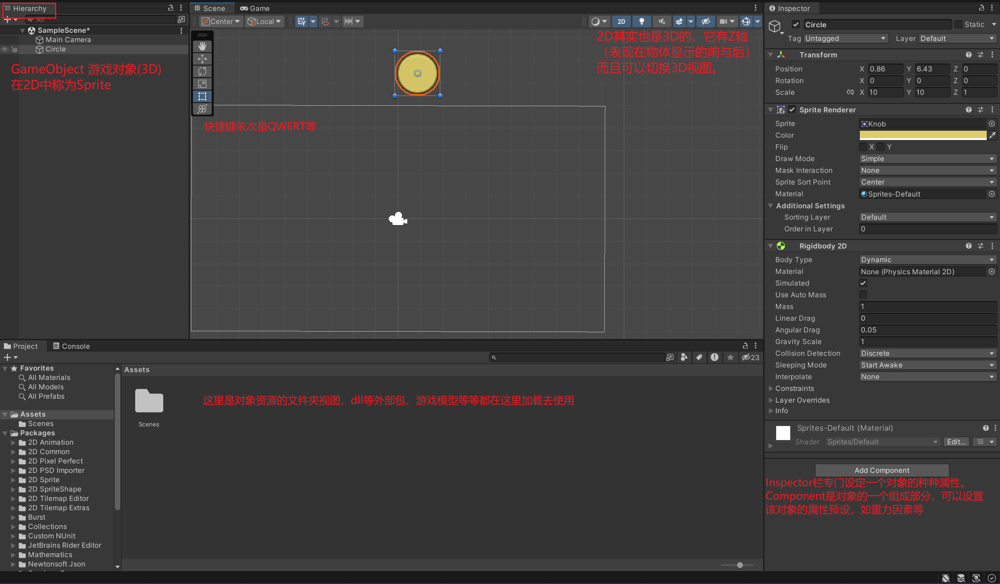
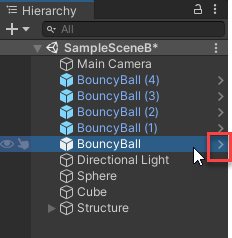
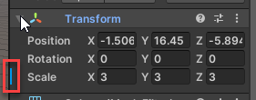
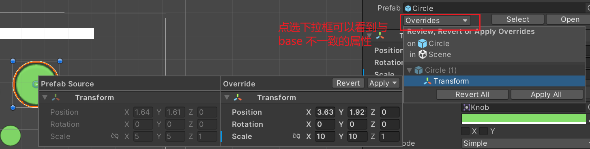
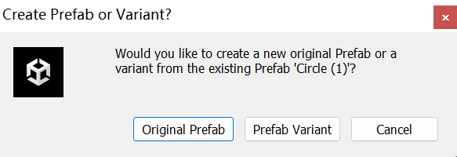

# 概念

## DCC

3D建模软件

3D Digital Content Creation tools (DCCs), such as Maya, ZBrush, and Blender, allow artists to create environments, models, and characters in three dimensions.

## Unity窗口

## Prefab

A prefab is an asset that acts as a template of a GameObject. From the prefab, you can create multiple copies, called instances. A change to the prefab asset causes all of its instances to change as well. To change many trees into cacti, you could just change a single prefab tree!

类比类与实例。

一般的GameObject并没有使用Prefab功能。

需要让GameObject上升到类与实例，一般操作是先在Assets文件夹中创建Prefabs文件夹，然后拖动想要“类化”的GameObject到这个文件夹中。然后该Object就会变蓝，意味着它已经是一个Prefab的实例了。

Prefab直接拖到scene就可以用了

按箭头可以进入prefab mode，可以设置当前prefab（会作用于各个实例）

按住alt同时按箭头，可以屏蔽掉scene，edit your prefab in isolation

对于一个instance单独设定，这称之为override prefab的property，会有

蓝色标记，意思是与base的属性不同。

### Prefab variant

也即是“派生类”，就是基于一个prefab创建的新prefab。

拖动一个prefab的instance去创建

### Nest prefabs

即类中嵌套类作为一部分，比如树的prefab上有苹果的prefab。

If one or more of the objects in a nested prefab has a Physic material, then the individual prefabs will behave independently, and the complex shape will come apart when it falls. However, if none of the objects has a Physic material, the complex shapes will hold together as they fall.

# Component

#### Rigidbody 2D

2D对象的重力属性（属于physical properties）

RigidBody properties control how the GameObject interacts with gravity and air density.

含有mass属性

#### Collider

determine how objects interact with each other.

Circle Collider 2D

Box Collider 2D

两者都有Collider Component才会发生Collide

## Script

Add New Script Component

# Material

Materials are components that define the surface characteristics of objects. You can create simple materials to change the visual appearance of your GameObjects. You can even apply different materials to different GameObjects to manage the ways your objects look.

在资源栏Assets文件夹创建一个Materials文件夹，右键创建Material

material是表面的“材料”，可以设置它外观等。

2D的得用2D的Material

## Physic material

A Physic material is a different type of material that makes an object bounce and changes its friction and drag properties.These properties take effect when the object is under the effects of gravity. Physic materials don’t change the visual properties of the GameObject.

可以设置bounciness让物体具有弹性
