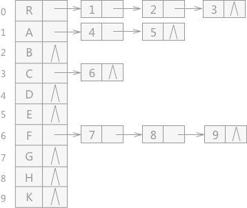

# 附录

### 引用符&

p=p-\>lchild

### 取整符号[]

向上取整用“⌈ ⌉”表示，向下取整用“⌊ ⌋”表示。[ ]一般表示向下取整

### C语言

标识符不能以数字开头

A[21]是21长度的数组。A[0…21]是22长度的数组

●struct的类型命名可以与后面变量名重名，但使用重名的时候需要加struct关键字来表示这个是类型而不是变量名

# 基本概念

数据结构三要素：逻辑结构、物理结构和数据运算

抽象数据类型(Abstract Data Type,ADT)描述了数据的逻辑结构和抽象运算，通常用（数据对象，数据关系，基本操作集）这样的三元组来表示，从而构成一个完整的数据结构定义。

计算机内部数据处理的基本单元是数据，数据的基本单位是数据元素，数据项是数据元素不可分割的最小单位。

## 逻辑结构

数据的逻辑结构是从面向实际问题的角度出发的，是抽象的。从它与数据的实际存储无关，是独立于存储结构的，其数据的存储方式有多种不同的选择。

有序表是逻辑结构而不是存储结构，是指关键字有序的线性表（即排好序的）。

#### 如何区别逻辑结构与物理结构

当一个结构，如数组、链表、树、图，在逻辑结构中只有一种定义，而在物理结构中却有两种选择，那么这个结构就属于逻辑结构；

相反，当此结构在原有基础上加上了某种限定，使得其在物理结构中只有一种定义，那么这个结构就属于物理（存储）结构；

## 存储结构（物理结构）

物理结构，是数据结构在计算机中的表示（映像）

在存储数据时，通常不仅要存储各数据元素的值，还要存储元素之间的关系（比如索引、指针等）（数据元素的类型可以不必存储）

### 顺序存储

逻辑上相邻的元素存储在物理上相邻的存储单元中。

优点：可以随机存取（说的是随机存取这种特点的存储结构）；每个元素占用最小的存储空间

缺点：只能用一整块存储单元，会产生较多的外部碎片

比如[顺序表](#顺序存储结构方式实现顺序表)（线性表的顺序存储实现方式）（循环队列是用顺序表表示的队列）。

也适用于图、树等逻辑结构的实现，因此并非只适合用于线性结构。

### 链式存储

逻辑上相邻但不要求物理上相邻，而是使用多一块空间存储下一个数据的地址（即指针）链接到所在物理位置。

优点：①不会出现碎片现象，能够充分利用所有存储单元；②因为使用指针表示逻辑结构，而指针的设置是任意的，故相比于顺序存储可以更方便的表示各种逻辑结构（顺序存储只能用物理上的邻接关系来表示逻辑结构）

缺点：存储指针会额外占用存储空间；只能**顺序存取（说的是顺序存取这种特点的存储结构）**

比如单链表

链式存储设计时，结点内存储单元的地址一定连续（指的是这个链表结点内部成员，比如指针和其数据是连续的）。而各个不同结点存储空间可以不连续

### 索引存储

在存储信息的同时，还建立附加的索引表。索引表中的每项称为索引项，索引项的一般形式是（关键字，地址）。

优点：检索速度快；

缺点：附加的索引表额外占用存储空间。另外，增加和删除数据时也要修改索引表，因而会花费较多的时间。

### 散列（哈希）存储

根据元素的关键字直接计算出该元素的存储地址，又称哈希(Hash) 存储。

优点：检索、增加和删除结点的操作都很快；

缺点：若散列函数不好，则可能出现元素存储单元的冲突，而解决冲突会增加时间和空间开销。

比如哈希表

## 算法

一个算法应该是问题求解步骤的描述。

### 时间复杂度与空间复杂度

一个语句的频度是指该语句在算法中被重复执行的次数。算法中所有语句的频度之和记为T(n)，时间复杂度主要分析T(n) 的数量级。算法的空间复杂度S(n)定义为该算法所耗费的存储空间。记为S(n) = O(g(n))。其中n是**问题规模**

T(n) = O(n\^2)是执行时间与n\^2成正比

算法原地工作是指算法所需的辅助空间是常量。

O（量级(order)）表示时间/空间复杂性增长率的上界，但不是上确界。即是根据它们的同阶无穷大来比较的。比如O(n)与O(2n)，认为具有相同的时间复杂度。

算法时间复杂度为log（n）时，不同底数对应的时间复杂度的倍数关系为常数，不会随着底数的不同而不同，因此可以将不同底数的对数函数所代表的时间复杂度，当作是同一类复杂度处理，即抽象成一类问题。

#### 计算技巧

##### 非递归型

设循环次数t，表达出变量和次数之间的关系

int i = 1;

while(i \<= n)

i\*=2;

最终i = 2\^t，即2\^t \< n 解出t即是答案。

●小心while(sum \< n) sum+=++i; 这个是O(n1/2)，因为sum=sum+i;

##### 递归型

move（）的时间复杂度为 O（1）

1.  void hanoi(int n,char x,char y,char z)
2.  {
3.  if(n= =1)
4.  move(x,1,z);
5.  else
6.  {
7.  hanoi(n-1,x,z,y);
8.  move(x,n,z);
9.  hanoi(n-1,y,x,z);
10. }
11. }

设函数hanoi数据规模为n时的时间复杂度为T(n)（即代入n时），从代码中写出T(n)的表达式：

T(1)=1

T(n)=T(n-1) + 1 + T(n-1)=2T(n-1) + 1

则可以把T(n)看作an，T(n-1)看作an-1，则是数列的递推公式求通项公式。

an = 2an-1 + 1

解得an=2n，即时间复杂度为T(n)=O(2n)

# 线性表

##### 定义

**逻辑结构**。相同数据类型，**有限**序列，是具有n个数据元素的有限序列。在线性表中，除最后一个元素（或第一个）元素外，每个元素只有一个后继（或前驱）元素。

## 顺序存储结构方式实现（顺序表）

使用顺序存储结构方式实现的线性表又叫顺序表

特点是逻辑顺序与其物理顺序相同。

优点：随机访问（即通过首地址和元素序号可在O(1)内找到指定元素）；存储密度高，结点只存储数据元素

缺点：逻辑上相邻的元素物理上也相邻，所以插入和删除操作需要移动的大量元素

#### 插入元素

线性表长度是指的当前元素的总个数长度，而不是定义的线性表最大空间的长度。因此插入操作所指定的第i个位置，其含义是元素与元素之间的位置，因此i的取值范围是1≤i≤L.length(线性表长度)+1。i取L.length+1的含义是从表尾插入。比如线性表长度为1，只有一个元素，那么元素前后有两个位置，第一个位置和第二个位置。

## 链式存储结构方式实现（链表）

### 单链表

一个结点内有数据域data和后继结点指针域next，这种结构又叫单链表。对于每个链表结点，除存放元素自身信息之外，还需要存放一个指向其后继的指针。

缺点：查找某个特定的结点时，需要从表头开始遍历，依次查找。

##### 增加头结点的目的

方便运算的实现。①有头节点后，插入和删除数据元素的算法统一了，不再需要判断是否在第一个元素之前插入或删除第一个元素 ②不论链表是否为空，其头指针是指向头结点的非空指针,因此空表和非空表的处理也就统一了。

### 双链表

单链表要访问某个结点的前驱结点时，只能从头开始遍历。双链表即有两个指针域（增加前驱结点指针域prior）

### 循环链表

即单链表的尾结点不是指向NULL而是指向头结点（即等于头指针）。循环链表若常在链表尾部进行操作，则可只增设尾指针r而可不用头指针（因为头指针即r-\>next）

循环双链表即双链表的尾结点的后继指针指向头节点，头节点的前驱指针指向尾结点。频繁删除尾结点的时候因为要访问表尾元素的前驱结点，因此使用双循环链表更好。

循环链表从头/尾插入的时候，要注意保持最后一个结点指向头结点，若此时只设头指针（即没有头结点也没有尾指针），则在链表头插入的时间复杂度为O(n)（因为要找尾结点）

### 静态链表

静态链表借助数组来描述线性表的链式存储结构，结点也有数据域和指针域。但这里的指针不同，是结点的相对地址（数组下标），又称游标。以next==-1作为其结束的标识。在不支持指针的语言中是一种巧妙实现链表的方法。（实际上没有单链表使用起来方便）

和顺序表一样需要预先分配一块较大的连续的内存空间

## 栈（Stack）

是只允许在一端进行插入和删除操作的操作受限的线性表，这一端称为栈顶（Top）。栈底（Bottom）即栈的另一端，无法进行操作。特点是后进先出LIFO（Last In First Out）

#### 卡特兰数

<http://blog.sina.com.cn/s/blog_6917f47301010cno.html>

<https://blog.csdn.net/qq_30115697/article/details/88906534>

分子可以这样理解：一共需要n次一种操作，n次另一种操作，加起来一共2n种操作，然后假设没有限制（操作间没有执行顺序限制），算另一种操作的可能排列情况。

可以应用于 n个不相同的元素依次进栈，有多少种不同的出栈序列。

分母可以这样理解，出栈这个操作次数不能大于进栈操作，所以是有限制的，需要除（暂时只能死记n+1）

比如已知先序序列，求有多少种可能的中序序列（即有多少种不同的树（因为先序序列和中序序列可以唯一的确定一棵树））（先序序列与中序序列的关系相当于以先序序列为入栈次序、以中序序列为出栈次序）

#### 上溢与下溢

如堆栈已满，但还想再存入信息，这种情况称为堆栈上溢；另一种情况是，如堆栈已空，但还想再取出信息，这种情况称为堆栈下溢。

### 顺序栈（顺序存储结构实现）

typedef struct {

Elemtype data[MaxSize]; //定义栈中元素最大个数

int top; //栈顶“指针”，规定top=0和-1表示空栈情况实现有所不同。top=0即栈顶总是指向栈顶元素的下一个存储单元。一般教科书规定top=-1

}

#### 共享栈

一个数组左边为一个栈的栈底，右边为另一个栈的栈底

好处是节省存储空间，降低发生上溢的可能（因为就算是两个栈顶接触了，也没有突破空间的大小，只是会给另一个栈带来错误）

### 链栈（链式存储结构实现）

优点是便于多个栈共享存储空间和提高其效率，且没有栈上溢的情况，通常用单链表实现，且所有操作都在表头进行。（注意有无头结点的实现）

### 栈的应用

递归、进制转换、迷宫求解、括号匹配

程序使用栈来保存调用过程的信息：调用函数时，系统会为调用者构造一个由参数表和返回地址组成的活动记录，并将记录压入系统提供的栈中，若被调用函数中有局部变量，也要压入栈中。

#### 表达式求值

中缀表达式转后缀表达式，只需要一个运算符栈

从左至右扫描，遇到数字时，直接加入后缀表达式。

遇到运算符时：

①若为“(”，直接入栈。

②若为“)”，把栈内的运算符依次输出，直到遇到“(”，删除“(”。

③若为其他运算符，当优先级高于栈顶的运算符或栈顶运算符为“(”时，直接入栈。否则弹出栈顶运算符，然后继续进行判断栈顶优先级，直到成功入栈。

当扫描的中缀表达式结束后，栈中所有运算符依次出栈加入后缀表达式。

## 队列（Queue）

是只允许在一端（队尾Rear指针处）插入，另一端（队头Front指针处）删除的操作受限的线性表。特点是先进先出FIFO（Frist In First Out）

队头是出的一端，队尾是进的一端。参考排队，从队尾排起，队头处理。

### 顺序队列（顺序存储结构实现）

rear和front两个指针注意不同定义。

缺点是队列会出现上“溢出”实际上是一种“假溢出”，因为队列还有存放元素的空位置，只是rear和front到头了。

#### 循环队列

将顺序队列在逻辑上表现为一个环，队首指针到达MaxSize后，会回到头位置，可以使用除法取余运算实现。

判断循环队列队空和队满的条件都是rear=front，有几种区分方式：①牺牲一个单元来区分队空和队满。②类型中增设队列长度的数据成员。③类型中增设tag数据成员（bool型），因删除导致的front==rear则为队空，tag=0；因插入导致的front==rear则为队满，tag=1。

### 链队列（链式存储结构实现）

实际上是一个同时带有队头指针和队尾指针的单链表。（通常会选用带头结点的单链表实现）

优点是不会出现存储分配不合理和“溢出”的问题。

在用单链表实现队列时，队头总设在链表的链头位置。（因为链尾删除还要找前驱结点）进行删除操作时，头尾指针可能都要修改（因为若只有一个元素，删除这个元素后，队列为空，rear指针要修改为rear==front）

### 双端队列

是允许两端都可以进行入队和出队操作的队列。

分为前端和后端。实际上实现只需要两个指针，一个是rear、一个是front。如图所示分左右情况：初始为空时假设两者都在同一个元素上，front、rear两端都可以增加和删除元素，front的增加后即往右移动，删除即向左移动，rear增加是从当前插入元素“向左移动”（从第一个位置整体向右让出一位插入），删除则是“向右移动”（删除第一个元素后整体向左移动）。实际上用链表会更好理解。（模拟插入的时候就从中间开始，右边、左边都可以插入删除）

**输出受限的双端队列**：是指在一端允许插入和删除，但另一端只允许插入的双端队列。

**输入受限的双端队列**：是指在一端允许插入和删除，但另一端只允许删除的双端队列。

输出序列的第一个数是n，说明至少要进行n次插入才有可能第一个得到n。

### 应用

缓冲区、层次遍历二叉树、广度优先搜索图、操作系统中页面置换算法中的先进先出置换算法（FIFO）

## 数组

数组是由n个相同类型的数据元素构成的有限序列，是线性表的推广，只有存储元素和修改元素的操作。

### 矩阵的压缩存储

#### 稀疏矩阵

即很大的矩阵里面有很少的有效值。

适用于压缩存储稀疏矩阵的两种存储结构是三元组表和十字链表

# 树

树的定义是递归的，是一种递归的数据结构，是逻辑结构，同时也是一种分层结构

### 术语

##### 度

树中一个结点的孩子个数称为该结点的度，树中结点最大度数称为树的度。度为n的树和n叉树不同，前者至少有一个结点有n个孩子，而后者最大孩子数不超过n。

##### 深度、高度和层次

结点的层次从树根开始定义。同一层的结点称堂兄弟

结点的深度是从根节点开始自顶向下计算的

结点的高度是从叶节点开始自底向上计算的

树的高度（或深度）是树中结点最大层数（一般定义为从1开始数）

##### 有序树和无序树

如果互换子节点变为一颗不同的树，则为无序树，否则是有序树

##### 路径和路径长度

结点间的路径是由两个结点之间所经过的结点序列构成的，路径长度是路径所经过的边的个数。

树的路径长度是从树根到每个结点的路径长度的总和

##### 森林

把一颗树的根结点去掉，变成n个互不相交的数，这个集合即为森林。

森林是m（m≥0）棵互不相交的树的集合

### 性质

①树中的结点数为所有的结点的度数（即孩子数，或看成边）加1（即加上根结点）

叶节点的度数是0，度为n的树的所有结点总数=叶节点树（度为0的结点）+度为1的结点总数+度为2的结点总数+…+度为n的结点总数

②度为m的树（即一个结点的最大孩子数为m）中第i层上至多有mi-1个结点(i≥1)

每一层每个结点都是有m个孩子，可以推出规律。（因为从第一层根结点开始，下一层最大结点数就是上一层乘m）

③高度为h的m叉树至多有（1-mh）/(1-m)个结点。（即首项为1的等比数列公式）

④具有n个结点的m叉树的最小高度为⌈logm(n(m-1)+1)⌉ （向上取整）

即通过满m叉树计算高度，利用③的公式=n直接推出h

⑤具有n个结点的度为m的树高度至多是n-m+1（最下一层是m个结点，之上都是一个结点，n-m即上面所有高度，再加最后一层即树的总高度）

### 树的存储结构实现

#### 双亲表示法（顺序存储？）

使用一组连续的空间来存储每个结点，每个结点中增设一个伪指针(数组下标)，指向其双亲结点在数组中的位置。根结点下标为0，指针为-1。双亲结点优点是可以很快得到每个结点的双亲结点。但求结点的孩子结点要遍历整个结构。

#### 孩子表示法（链式存储？）

类似双亲表示法，也是采用一组连续空间存储每个结点，但不同的是每个结点增设一个指针域，里面指向的是该结点的从左至右的所有孩子。

找孩子很容易但是找双亲要遍历每个链。

可以将双亲表示法和孩子表示法合二为一变为孩子双亲表示法。优点合并。

#### 孩子兄弟表示法（又称二叉树表示法）

以二叉链表为数的结存储结构，左指针指向第一个孩子结点，右指针指向（从左至右的）兄弟结点。

优点是可实现树转二叉树、易于查找结点的孩子等。缺点是从当前结点找双亲结点比较麻烦，但可以增设一个parent指针指向父节点。

### 树和森林的遍历

#### 先根遍历

即先访问结点，然后依次遍历结点的孩子。NC1C2…Cn

森林的先根遍历（某些地方称先序遍历）也是，从第一棵树开始使用先根遍历、然后到下一棵树。

树、森林转换为二叉树后，对应二叉树的先序遍历与它们的先根遍历序列相同。

#### 后根遍历

即先依次遍历结点的孩子，最后访问结点。C1C2…CnN

森林后根遍历（某些地方又称中序遍历，可能是指它对应的二叉树是中序遍历）同理。

其与树、森林对应的二叉树的中序遍历序列相同。

#### 层次遍历

即一层一层遍历。

## 应用

### 并查集

主要用于解决一些元素分组的问题。它管理一系列不相交的集合，一般有三种操作：

初始化（Initial）把每个点所在集合初始化为其自身（即变成森林）

查询（Find）查找元素所在的集合，即根节点。

合并（Union）将两个元素所在的集合合并为一个集合。通常来说，合并之前，应先判断两个元素是否属于同一集合（即不相交），这可用上面的“查找”操作实现。

通常用树的双亲表示作为并查集的存储结构。整个集合初始化形成的是森林，每个树只有一个根节点就是元素自身，伪指针域为负数。

经过一系列合并后，剩下的就是分好组的树，然后通过Find操作可以找到一个元素所属的组。（即双亲表示法的优点，找双亲结点很快）

### 哈夫曼编码（Huffman）

数据通信中，若对每个字符使用等长的二进制数表示，则称这种编码方式为*固定长度编码*。若允许对不同字符用不等长的二进制位表示，则称*可变长度编码*。可变长度编码是对频率高的字符用短编码，频率低的用较长的编码，起到数据压缩的效果。

其中一种就是哈夫曼编码。

没有一个编码是另一个编码的前缀，称之为*前缀编码*。如0，101，100，从第一个字符开始可以解码所有字符不会歧义。而如果是0和00，则无法唯一编译。

将数据构造成哈夫曼树，然后选择左子树、右子树相应为0或1，然后从根到指定结点的路径上的标记的序列即哈夫曼编码，且满足前缀编码的特性。

### TireTree（字典树，单词查找树）

AC Automata on double array trie, rank-select, DFUDS trie, louds trie, patritia-trie, recursive-patricia-trie, AcTrie,

AC 自动机本质上是一个 Trie + FailLink

## 自动机

计算机控制系统的控制程序具有有限状态自动机（FA）的特征，可以用有限状态机（Finite Automata Machine）理论来描述。在软件开发领域内通常被称作有限状态机（Finite State Machine，FSM），是一种应用非常广泛的软件设计模式。

### Aho-Corasick automaton（AC自动机）

多模匹配算法

DFA，全称 Deterministic Finite Automaton 即确定有穷自动机：从一个状态通过一系列的事件转换到另一个状态，即 state -\> event -\> state。

## 二叉树

每个结点至多只有两颗子树（即不存在度大于2的结点，即孩子最多有两个），且有左右之分，是有序树。

与度为2的树不同，度为2的树至少有三个结点（即至少存在一个度为2的结点），而二叉树可以为空二叉树。另外二叉树是有序的，两个结点的二叉树有两个，分左边子树和右边子树。

### 性质

①非空二叉树上叶子结点树 = 度为2的结点数 + 1

即n0=n2+1 （ni代表度为i的结点数目）

因为二叉树的总度数（也即二叉树总结点数） = n0+n1+n2 = 1\*n1 + 2\*n2 + 1

②含有n个结点的二叉树，拥有n+1个空结点（二叉链表中称为空链栈）

从一个根节点开始想，有两个空结点，随意增加一个结点，空结点总数变成2-1+2，以此类推。

①②都可以根据n=n0+n1+n2与 n=1\*n1+2\*n2+1两个公式推导出来。

③度为1的结点只会有0或1个，因此使用上面的公式时，可以分类讨论，然后带入0、1获得结论。

**顺序存储结构实现**

一维数组连续存储层次遍历的完全二叉树（不存在的结点用空结点表示），但浪费空间。建议从1开始存储树中的结点，这样就满足了2i是左孩子之类的性质。

**链式存储结构实现**

二叉链表实现，结点含：lchild、data、rchild，左右孩子两个指针，一个数据域。

还可以增加某些指针域，比如指向父节点，变为三叉链表。

### 满二叉树

树每层含有最多的结点，即除叶子节点外其他结点度数均为2。可以给满二叉树编号，从上至下，从左至右依次编号。一般是从根节点编号为1开始。

### 完全二叉树

满足满二叉树编号次序的树，即还未达到满二叉树状态的中途树（假设一个一个加结点，是按照满二叉树编号次序加的）

注意给定叶子节点数考虑最多结点的情况，推算出最底层的叶子结点数后（），倒数第二层没有孩子的最左边的叶子结点可以增加一个左孩子，因为这样不改变叶子节点数而且达到树结点最多。（P133 题16）

##### 特征

当i\>1时，i为偶数时（即是左孩子时），双亲的编号为i/2，奇数时（即是右孩子时），编号为(i-1)/2

第i个结点的左孩子的编号为2i（若存在）（如果题目没有说若左孩子存在，则描述是错的）

### 二叉排序树(Binary Search Tree, BST二叉查找树)

假设树中数据域存储的是可比较的元素，那么左子树上的所有结点的元素都小于其根节点，右子树上的都大于其根节点（递归定义）即左子树结点值≤根结点值≤右子树结点值（此时中序遍历是得到升序序列）（但考试可能会说得到降序序列，此时注意它的定义是左子树结点值≥根结点值≥右子树结点值）

#### 删除结点

删除结点后会进行调整，使其重新成为二叉排序树。二叉树删除后插入同一个元素（二叉排序树插入的结点一定变成了某个叶节点，但如果是平衡二叉树，经过平衡调整后并不一定是叶结点），所得的树不一定相同。

删除结点时，如果删除的结点无左子树但有右子树，用右子树根结点填补。无右子树但有左子树用左子树根结点填补。如果左右都有子树，则用右子树的最左结点填补（书上说是中序第一个子女，其实就是右子树值最小那个填补（其实也可以拿左子树值最大的那个填补））

#### 查找效率

主要取决于树的高度。最差情况是单枝树，平均查找长度是O(n)，所以尽量要变成平衡二叉树。

平均查找长度是每个结点的查找次数之和/总结点树，每个结点查找次数就是根结点到指定结点的路径长+1（根节点算查找一次）。

### 平衡二叉树（Balanced Binary Tree / AVL）

AVL是发明人的名字Adelson-Velsky-Landis Tree，是二叉排序树的一种。

为了避免二叉排序树性能降低，规定在插入和删除结点时保证树上任一结点的左子树和右子树深度（高度）之差的绝对值不超过1，这个深度之差也称为平衡因子，因此平衡二叉树只可能有1、-1、0三种取值。

平衡二叉树的查找性能好，平均查找长度为O(log2n)。

#### 最少所需结点

递推公式：

n0=0，n1=1，n2=2，nh=1+nh-1+nh

递归的思想，假设求第三个高度，那么如果有第二个高度最少结点，放左子树，第一个高度最少结点，放右子树，它们高度差也恰好是1，那么最少结点数就是这个递推公式。

h为平衡二叉树的高度，nh为构造此高度的平衡二叉树所需的最少结点数。

#### 调整平衡二叉树

每次插入/删除后找到离插入结点最近的（从插入结点到根的路上）平衡因子的绝对值大于1的结点进行调整

规律：哪偏就是往哪旋，往哪旋就是哪孩子作根

##### LL平衡旋转

在一个结点的（当作根）左孩子（L）的左子树（L）上插入新结点，树偏左，左旋（左孩子作根，左孩子的右子树作为原根结点的左子树（即左孩子作根后右子树部分连接到原根结点了））。

##### RR平衡旋转

与LL同理，在结点右孩子的右子树上插入新结点，树偏右，右旋（右孩子作根）

##### LR、RL平衡旋转

LR即向结点的左孩子的右子树插入新结点。根结点左偏，且其根左子树右偏。

先把左孩子当作根，现在是右偏，因此要右旋（即该根的右孩子当根）。

然后再回到原视角现在是左偏，因此要左旋。

RL同理，先左旋再右旋。

### 哈夫曼树

树中结点数据域中带权值，从树根结点到任意结点的路径长度（边）与该结点上权值的乘积为该结点的带权路径长度。树所有结点的带权路径长度之和即为树的带权路径长度（Weighted Path Length of Tree，WPL）

#### 构造

所有权值组成孤立集，取出最小的两个变为左孩子、右孩子，其父节点权值为它们二者之和，然后将该结点放回集合继续操作。

#### 多叉哈夫曼树

假设是m叉哈夫曼树，即度为m的哈夫曼树，与常规哈夫曼树类似，它是需要取最小的m个元素组合成一个新的元素，然后以此类推。

但这样可能到后面还剩下的元素少于m个，一般解决办法是首先算出它组成了最后的哈夫曼树所需的结点然后补0：假设最后成功组成的哈夫曼树叶子结点有n个，则减去末尾的1个（刚开始需要m个元素组成，剩下的最少只需要m-1个，因为合成了新的）后应该有(n-1)/(m-1)余数为0.

### 二叉树的遍历

深度优先遍历、广度优先遍历是针对普通树而言。而二叉树中具体是有三种先序、中序、后序遍历的深度优先类算法。广度优先有层次遍历。

#### 深度优先遍历

按照某条路径访问数中每个结点（规定N为根结点，L、R为左、右孩子），分为前序NLR、中序LNR、后序LRN遍历，N这个操作是读取结点数据，而L、R是遍历进去但不访问，是一种递归的操作。时间复杂度都是O(n)，空间复杂度最坏情况是O(n)（即存储了整个树）

递归算法很好写，如果转换为非递归需要使用栈。

后序遍历能找到一个结点的祖先结点到某结点的路径（后序遍历递归算法是访问到指定结点回退的时候记录路径，非递归是访问到该结点时记录栈中其祖先结点到它的路径）假设入口是祖先，出口是终点结点，那么后序遍历非递归遍历到终点的时候栈中会留有入口和出口（之所以不用先序遍历是因为它使用非递归算法的时候，入口已经出栈了，入口和出口不会同时存在）

##### ※ 根据中序+先序/后序序列还原树

先序/后序 + 中序序列可以唯一的确定一棵树

从先序/后序中能获知根节点，然后从中序中找到根节点所在，划分为左子树序列和右子树序列，即可把树分为左子树和右子树。然后对左子树、右子树采取同样的操作。已知先序序列，求有多少种可能的中序序列，可以使用[卡特兰数](#卡特兰数)（即有多少种不同的树（因为先序序列和中序序列可以唯一的确定一棵树））（先序序列与中序序列的关系相当于以先序序列为入栈次序、以中序序列为出栈次序，是根据递归算法中递归的状态变化得出的）

-   注意能唯一还原树：通过中序可以确定结点是左孩子还是右孩子
-   **先序、后序也可以用分治法划分。比如ABCDE，如果是先序，以第一个为根节点，可以划分为AN(BC)L(DE)R 然后分而治之：BC，把B看作N；DE，把D看作N… 后序同理，比如可以这样划分(A)L(BCD)REN**

层次序列+中序序列也可以唯一确定一颗树。

##### 线索二叉树

传统二叉链表实现的二叉树仅体现了父子关系，并不能直接得到结点在遍历序列中的前驱或者后继。线索二叉树是为了加快查找结点的前驱和后继的速度。

又因为二叉链表会有空指针的存在，因此可以利用空指针来存储前驱或者后继。规定左孩子如果为空就存储它的前驱（如果是序列的第一个结点则没有前驱是null），并将增设的ltag=1；类似的，规定右孩子如果为空就存储它的后继（如果是序列的最后一个结点则后继为null），并将增设的rtag=1。（算法实现是在一个结点如果发现自己的左孩子为空则指向前驱，如果自己的前驱结点的右孩子为空则指向自己）

●线索二叉树是一种物理结构（存储结构），因为是二叉树这种逻辑结构限定了只能用链表实现，增设了线索指针，因此是物理结构 （因为只有选择链式存储这种实现方式，因为逻辑结构可以有多种实现方式）

●n个结点的线索二叉树含有的线索数是n+1。

●考试要求画出先/中/后线索二叉树，使用二叉链表画法。如果是线索则使用虚线画箭头。技巧是画出树后，先写出先/中/后序的序列，然后根据序列中来找前驱和后继来画线索。

##### 线索二叉树的遍历

遍历中序线索二叉树的时候可以先直接找到线索的头，然回访问后继，根据（LNR），如果右孩子是线索，则直接能找到后继。但如果右孩子是结点，那么它的后继是右孩子的最左结点（因为中序遍历LNR，到了最L之后然后N就是访问了，那么即访问的最L结点）（但和普通的遍历算法时间复杂度都是O(n)）

遍历先序线索二叉树，找到线索头结点之后，根据（NLR），发现它后继先是L，那么就先判断如果它有左孩子，那么后继就是左孩子。如果没有L就考虑R，如果有右孩子或者是线索指向的则是其后继。

遍历后序线索二叉树，找到线索头结点x之后，①根据（L2R3N1），如果x是根节点N1，则没有后继。②如果x是N3(LRN2LRN3Nx)（即是双亲的右孩子）或是N2（即是双亲的左孩子但没有右孩子），则后继为双亲。③如果x是N2（即是双亲的左孩子，且双亲有右孩子）(LRN2LRN3Nx)则后继为双亲右子树上按后序遍历出的第一个结点

#### 广度优先遍历

二叉树中称层次遍历。

借助队列来实现。针对队列中的一个结点，顺序是：①出队，访问结点内容 ②如果有左孩子，将其入队。③如果有右孩子，将其入队。

然后将根节点入队后，开始反复直到队列为空。

### 树、森林转二叉树

树转二叉树实际上就是将树使用[孩子兄弟表示法](#孩子兄弟表示法又称二叉树表示法)存储，即左指针指向孩子，右指针（从左至右）指向兄弟。

森林是由多棵树组成，为了便于对森林的遍历等操作，需要将森林中的所有树都组合成一颗大的二叉树，转化步骤为：

①首先将森林中树各自转化为二叉树；

②森林中第一棵二叉树的树根作为转化后二叉树的树根；

③其他树的树根依次作为前一棵树根结点的右子树进行连接。（因为森林中的树各自转化为二叉树后树根结点都没有右孩子）

# 图

图G（graph）由顶点集V（vertex）和边集E（edge）组成，记为G=(V,E)。\|E\|表示边数，\|V\|表示顶点个数。

线性表、树可以是空表、空树，但图不能是空图。顶点集一定非空但边集可以为空。树是一种特殊的图。

### 术语

##### 有向图

若E是有向边（也称弧）的有限集合时，图G为有向图，边是顶点的有序对，记为 \<v，w\>,v称为弧尾，w称为弧头

\<v，w\> 表示从顶点v到顶点w的弧

\<v，w\> ！= \<w，v\>

##### 无向图

若E是无向边（简称边）的有限集合时，图G为无向边，边是顶点的无序对，记为 （v，w）或（w，v）

（v，w）=（w，v）

##### 简单图与多重图

##### 完全图（简单完全图）

完全图没有特指是指无向完全图和有向完全图两者都可

##### 子图

并非V和E的任何子集都能构成G的子图，因为这样的子集可能不是图，比如E的子集中某些边关联的点并不在V这个子集中

##### 连通、连通图、连通分量与强连通图、强连通分量

**无向图**

连通是对无向图而言的。

连通图：任意两个顶点都是连通的。

连通：若从顶点A到顶点B有路径存在，则称A、B连通。

连通分量（Connected Component）（极大连通子图）：要求该连通子图尽可能包含其所有边。任何连通图的连通分量只有一个，即是其自身。而非连通的无向图有多个连通分量。

极小连通子图：既要保持图连通又要边数最少的子图。

**有向图**

强连通是对于有向图而言的

强连通：若从顶点A到顶点B、顶点B到顶点A都有路径存在，则称A、B连通。

强连通图：要求任意两顶点都是强连通的。

强连通分量：非强连通图里那部分强连通的子图（极大强连通子图）。顶点数大于1的强连通分量就肯定有环。

##### 欧拉图（Euler Graph）

具有欧拉回路的图称为欧拉图。

欧拉回路是指可以构造出通过所有顶点且每个边都只走一次的回路。

<https://www.cnblogs.com/prpl/p/10947348.html> Seven Bridges Problem

选择一个点出发，且要回到原点，那么该点入度出度一定相等，其他的点也是，所以必须度数为偶数。如果不需要回到原点，那么原点和终点度数是奇数。

##### 生成树

n个顶点就有n-1条边。连通图的极小连通子图。（生成树一般都是指无向图），因此必定没有回路

##### 生成森林

##### 边的权、带权图/网

##### 顶点的度、入度和出度

**无向图**

顶点v的度是指依附于该顶点的边的条数，记为 TD(v)

无向图的全部顶点的度的和等于边数的2倍：总度数 = 2e (因为每条边和两个顶点相关联)

考到给定边的，然后给了某些顶点度的，直接边数乘2然后减去那些已知顶点的度后可以算出未知度的顶点数。

**有向图**

入度：以顶点v为终点的有向边的数目，记为ID(v)

出度：以顶点v为起点的有向边的数目，记为OD(v)

顶点v的度等于入度和出度之和

在具有n个顶点、e条边的有向图中，总入度数 = 总出度数 = e （因为每条有向边都有起点和终点，即同时是出入度的组成部分）

##### 稠密图、稀疏图

##### 有向树

一个顶点的入度为0，其余顶点的入度均为1的有向图。

##### 顶点与顶点的关系描述

**路径**

顶点Vp到顶点Vq之间的一条路径是指顶点序列：Vp，V1，V2…Vq，或可以这样定义：由顶点和相邻顶点序偶构成的边所形成的序列。序偶：“序”即有序，“偶”即一对。\<i,j\>就是顶点i和其相邻的顶点j俩个点构成的边也就是路径，方向是由i指向j。\<j,i\>是由j指向i的边（路径）。例子：\<a,b\>,\<b,d\>就是从a出发到b再从b到d的俩条边（路径）。

**回路**

第一个顶点和最后一个顶点相同的路径称为回路或环

**简单路径**

在路径序列中，顶点不重复出现的路径称为简单路径

**简单回路**

除第一个顶点和最后一个顶点外，其余顶点不重复出现的回路

**路径长度**

路径上边的数目

**（顶点到顶点的）距离**

从顶点u出发到顶点v的最短路径若存在，则此路径长度称为u到v的距离，若不存在，则记为∞

## 存储结构

### 邻接矩阵法

适用于稠密图，是用一个一维数组存储图中顶点的信息，再用一个二维数组存储图中边的信息（即各个顶点间的邻接关系），该二维数组称邻接矩阵。

结点数为n的图需要n\*n矩阵，A[i][j]表示\<Vi,Vj\>（有向图）或(Vi,Vj)（无向图）。如果

A[i][j]=1（或一个权值），则从Vi到Vj的边存在。如果等于0（或∞），则不存在。

●无向图的邻接矩阵一定是对称矩阵（题目用来判断是有向图还是无向图）（且唯一），因此可以压缩存储。

●遍历一行或一列容易得到相应顶点度的信息（注意如果是有向图则行是相应的出度信息，列是对应的入度信息）。

●有向无环图（Directed Acyclic Graph，DAG）才有拓扑排序，得到拓扑序列。

如果有向图的邻接矩阵对角线下所有元素都为0，那么肯定是无环图，肯定有拓扑序列

### 邻接表法

结合顺序存储和链式存储方法，减少邻接矩阵法存储稀疏图时的浪费。

其实类似树的[孩子表示法](#孩子表示法链式存储)

即用一个数组存储顶点的数据信息，且每个元素中还有边表（邻接表）的头指针域，沿着边表走可以得到该顶点所有邻接的边。

●因此，给定一顶点，扫描它的邻接表，很容易找出它所有的邻边。但要判断两个顶点是否有边，则没有邻接矩阵好判断。

### 十字链表法（存储有向图）

邻接表存有向图时，入度不好获取（除非逆邻接表，但这出度又不好获取）于是诞生了十字链表法

### 邻接多重表（存储无向图）

## 图的遍历

### 广度优先搜索（Breadth-First-Search BFS）

实际上是树的层次遍历拓展，也是借助队列实现的，还需要一个标记数组标记结点已被访问，防止重复访问。队列中装的是被标记访问过的顶点（因为是访问后立马标记已访问），但并未进行邻接顶点查询。

操作：队列不空，队首顶点出队列后，要遍历一遍它的邻接结点，对于每个未访问过的邻接结点访问并置标识，然后入队列。

##### 算法性能

空间复杂度队列在最坏情况下空间复杂度为O(\|V\|)

使用邻接表，很容易找邻边，总体来看，每条边至少访问一次，因此总体来看搜索邻接点总时间是O(\|E\|)。因为每个顶点也至少访问一次，因此总共时间复杂度为O(\|V\|+\|E\|)。

使用邻接矩阵，则对于每个顶点找它的所有邻接顶点，都需要搜索O(\|V\|)次，因此总共是O(\|V\|2)

#### 应用

##### 求解非带权图的单源最短路径

（当然所有边权值相等也行）

单源即从一个点出发。求到每个点的最短距离，又是非带权图，显然路径就是求最短边数，BFS原理就是由进及远，设置一个顶点大小的数组，对图遍历一遍能获得所有点距源点的最短边数。

实现方法：在出队列搜索邻接点时，对邻接点进行访问时，邻接点距离源点的路径即为出队列的该顶点的路径+1（这是一种递推思想）

##### 广度优先生成树

根据BFS遍历的顺序以及序列可以得到对应的树，根结点为源点，其到某个点的距离也是图中源点到某个顶点距离的最短边数。

因为和遍历的顺序有关，因此邻接矩阵的只有唯一的生成树，而邻接表则不唯一。

### 深度优先搜索（Depth-First-Search, DFS）

类似于树的先序遍历。

过程是从一个点出发，访问后依次遍历其所有未访问的邻接点，针对于每个又进一步进行访问… 尽可能深的遍历图，直到一个顶点没有未访问过的邻接点后，开始进行回退，回退到上一个遍历的过程中去（其实就是利用栈的特性进行“回退”，是递归的过程）

##### 算法性能

与BFS一样。

#### 应用

##### 深度优先生成树和生成森林

与广度优先生成树原理类似。

另外如果是非连通图则会生成森林。

##### 判断图中是否有回路

根据生成树，如果出现了回边（反向边，即指向自身结点祖先）则证明有回路。

## 图的应用

### 最小生成树（Minimum-Spanning-Tree MST）

首先要理解[生成树](#欧拉图euler-graph)的概念

G所有生成树的集合中，各边权值之和最小的那棵树即为最小生成树。（又称最小代价树）

只要无向连通图中没有权值相同的边，则其最小生成树唯一。

#### Prim（普利姆）算法

随意选取一个顶点加入一个集合T，然后寻找一个与当前集合中所有顶点距离最近的顶点加入集合T并构造边，以此类推，直到顶点都加入了T。

时间复杂度为O(\|V\|2)，因此适用于边稠密的图。

#### Kruskal（克鲁斯卡尔）算法

初始时只有n个孤立顶点而无边的非连通图。对所有边权值进行排序，然后从中依次选最小的边尝试连接图中顶点，若该边加入后构成回路，则舍弃。

时间复杂度为O(\|E\|log\|E\|)，因此适用于边稀疏而顶点稠密的图。

### 最短路径

广度优先搜索只能找无权图（或权值都相等）的最短路径。

两个算法都可适用于有回路的带权图（因此无法判断是否有环）（不考虑负权值的情况）

#### Dijkstra（迪杰斯特拉）算法

适用于单源最短路径。

[https://www.bilibili.com/video/BV1jE411W7tT](https://www.bilibili.com/video/BV1jE411W7tT/?spm_id_from=333.788.recommend_more_video.2)

有两个辅助数组

dist[i]：存源点到i点的（当前轮）的最短路径

path[i]：存源点到i点的最短路径相应的（当前轮最优前驱）结点（最后可以根据它来追溯路径，是递归子问题最优解的思想（实际就是动态规划思想）（最优子结构，且无后效性））

和Prim算法类似的思想，是从顶点出发，放入一个集合S，然后找到dist中最小的那个点加入S，更新path、更新当前S集合中能到达的dist。

●边上有负权值时不适用。

时间复杂度不管是邻接表还是邻接矩阵实现都是O(\|V\|2)，如果要求每一对，则加多一层遍历，变为O(\|V\|3)

#### Floyd（弗洛伊德）算法

适用于求每对顶点间的最短路径。

<https://www.bilibili.com/video/BV1q4411M7r9>

原理是补全两个n\*n方阵(行、列下标代表对应的顶点，表示从行顶点走到列顶点)，一个是最短路径方阵，一个是行顶点到列顶点最开始要经过的顶点的方阵（通过该表可以递推出这个最短路径序列，原理就是最优子结构）。

考试只需要掌握执行过程的写法，不需要画两个表

①先把两个点不能经过其他点的路径写出来（即A(-1）是说不经过点)

②开始假设如果能经过一个点，看它与不经过点直接到的路径谁更小，对每个点进行遍历，图中遍历顺序是0、1、2（即A(0)是说经过0点的情况，比较可以经过0点的话，路径的大小情况，其他同理），如果更小就替换

③所有点遍历完成后最后一个表即为解。

时间复杂度为O(\|V\|3)

●支持带负权值的边，但该边不允许在回路内。

### 拓扑排序（topological-sort）

即从AOV网中找到可行的活动顺序。它仅适用于有向无环图。

有序的拓扑排序序列是指不仅能够进行拓扑排序，而且序列的编号也有序，如果用邻接矩阵表示该有向图，那么它还是一个三角矩阵。注意和拓扑有序（指能够进行拓扑排序）区分。

##### 原理

①从图中选取一个没有前驱的顶点（入度为0）并输出。（就是选一个“进行活动”的入口）

②删除与这个顶点和以其为顶点的所有边。

③重复①②，直到图为空或图中剩下的是都有前驱的结点（说明有环）

##### 实现

具体实现是要先初始化一个所有顶点的入度数组，然后找到所有入度为0的结点暂存入容器中（比如栈、队列）

如果采用邻接表，时间复杂度为O(n+e)

顶点的入度数组是先遍历一遍整个邻接表生成的，时间复杂度O(n+e)

然后进行排序过程、删除边（即那个顶点邻接的边，总体来看就是e）的时间复杂度为O(n+e)。所以总体来说就是O(n+e)

而如果采用邻接矩阵，删除边的时候对于每个结点都要找n次，因此总共是O(n2)

●逆拓扑排序就是从图中选没有后继的顶点输出，最终结果是“从活动结束到开始”的顺序

●若拓扑有序序列唯一，并非每个顶点的入度和出度最多为1。比如：

也可以得知：拓扑序列唯一，并不能唯一确定图。

-   **有向无环图（Directed Acyclic Graph, DAG）**

即不存在环的有向图。

它可以用于描述表达式，比如使用二叉树的形式描述的，可以进行压缩存储。根结点是运算符，叶子结点是运算数。如果有相同的部分可以去掉然后指向相同的部分的根结点，达到压缩存储的效果。

##### 有向无环词图（DAWG）

是一种可以对词进行快速搜索的数据结构。图的入口是最先搜索到的字母。图的每个节点代表一个字母，你可以从一个节点跳转到其他节点，具体怎么跳转依赖于节点代表的字母是否与待搜索的字母匹配。

#### AOV网（Activity On Vertex NetWork）

用顶点表示活动，边表示（顶点）活动发生的先后关系。AOV网的边不设权值，若存在有向边\<a,b\>则表示活动a必须发生在活动b之前。

#### AOE网（Activity On Edge Network）

AOE网是带权有向图中，以顶点表示事件（指向该顶点表示之前的活动已经完成的事件），以有向边表示活动，以边上的权值表示完成该活动的开销（比如完成活动所需时间）的网络。由于整个工程只有一个起点和一个终点，网中只有一个入度为0的点（源点，表示整个工程的开始）和一个出度为0的点（汇点，表示整个工程的结束，活动必须全部完成）。

AOE网工程完成的顺序是基于拓扑排序的。

### 关键路径

实际上就是求从源点到汇点的最大路径。（如果是选择题直接找出最大路径即可，注意多条最大路径的情况）

AOE网中有些活动可以并行进行，而且工程完成的条件是所有边代表的活动都已完成，那么求这个工程完成的最短时间就是求从源点到汇点的所有路径中，具有最大路径长度的路径，这个路径称*关键路径*，上面的活动称*关键活动。*（因为每条边的活动都必须完成，又因为木桶效应）

术语：

把时间当作几点，路径上的当作需要几小时完成。这里边和点是相对独立的，拿掉点后（拿掉点的前提是该点前面没有活动要完成了），边上的活动必须全部完成才能拿掉边，可以并行进行。

**事件Vk最早发生时间ve(k)**

是v1到vk的最长路径长度。根据它能够知道从Vk事件之后开始的活动最早开工时间。

需要用到拓扑排序（如果遇到环就会终止算法，因此可以判断是否有环）

**事件Vk最迟发生时间vl(k)**

隐含定义是汇点事件最迟发生时间是总工程最快完成时间，从工程最快完成的角度来递推事件最晚能推迟到多久才开始的时间

指在不推迟整个工程完成的前提下，保证它后继事件在最迟发生时间能够发生时，该事件最迟必须发生的时间。（即能拖到几点再开始做活动，如果想要拖到后继事件一点也不能拖的时间也能按时完成工程的话，就是拖到做完活动后恰好是到后继事件最迟发生的时间（有多条路活动反正都要完成，那么就拖需要做的时间最长的那个，所以就是根据后继的最迟发生时间减去路所耗时间最长的那个））

**活动ai最早开始时间e(i)**

根据该活动起点的事件最早发生时间得出

**活动ai最迟开始时间l(i)**

该活动起点的事件最迟发生时间与该活动所需时间之差。

**活动ai最迟开始时间l(i)与其最早开始时间e(i)的差额d(i)=l(i)-d(i)**

是指该活动完成时间的余量，即在不增加完成整个工程所需总时间的情况下，活动ai可以拖延的时间。若一个活动的时间余量为0，则说明该活动必须要如期完成，否则就会拖延整个工程进度，所以余量为0的活动为关键活动

#### 缩短工期

关键路径上的所有活动都是关键活动。如果缩短关键活动到一定程度可能会变为非关键活动

关键路径不唯一，如果有多条关键路径的网（即有多条路径长度值一样最大的），只提高一条关键路径上的关键活动速度并不能缩短整个工程工期，要加快至少每条关键路径上一个关键活动（一般是加快它们共有的关键活动）才能达到缩短工期的目的

# 查找

## 术语

**静态查找**是无需对查找表进行修改的，比如增加或删除数据，适用的方法有：顺序查找、折半查找、散列查找等。

**动态查找**即可能要随时往查找表中增添或删除某个数据元素的，适用的有：二叉排序树查找、散列查找等。

**平均查找长度**（Average Search Length，ASL），一次查找的长度是指需要比较的关键字次数，平均查找长度是所有查找过程中进行关键字比较的平均值。

## 顺序查找

### 一般线性表的查找

从线性表一端开始，按顺序找到另一端。不过特别的是，实现的时候引入了“哨兵”，即[0]号元素初始留空，查找的时候赋值为关键字，然后从尾往头找，这样就不需要每次判断下标是否越界，当i=0时必定跳出循环，提高了程序效率。这时候查找不成功的平均查找长度为n+1，1是这个哨兵。

查找成功的ASL=(n+1)/2

### 有序表的顺序查找

如果关键字是可比较大小且有序的，那么找到某个情况就可以中断查找，不需要找到另一端了。

查找成功的ASL=(n+1)/2，与一般的线性表查找是相同的。

但查找失败的ASL会比一般的好一些。

## 折半查找（二分查找）

要求线性表必须具有随机存取的特性，因此仅适用于顺序存储结构且要求元素按关键字有序。

先从中间元素找起，如果小于则找左半边，否则找右半边，然后如此重复。

折半查找的过程可以用二叉树来描述，称为判定树。是一颗平衡二叉树。

与二叉排序树算法时间性能有时不相同，二叉排序树和输入也有关系，如果不平衡效率就不太好。

## 分块查找（索引顺序查找）

结合折半查找和顺序查找。将查找表分为若干子块，块内元素可以无序，取块内最大元素作为整个块的索引关键字，要求块与块之间是有序的，即索引关键字之间是有序的

需要建立一个索引表，每个元素含索引关键字与那个块的第一个元素地址（下标），索引关键字之间需要有序。因此查找时先从索引表中找到元素所在块，然后再去块内查找。

## B-树（B-tree，多路平衡查找树）

### B树概念

B树和平衡二叉树稍有不同的是B树属于多叉树（查找路径不只两个）

B树的阶数实际上是人为规定的，国内教材画法实际上并非标准画法，认为B树的阶数是树中最大孩子数。

Standard Graph 图1

实际上阶数是根据开辟的存储空间最多能引出的分支数来定的，比如删除图1中的6，阶数仍然是5。

非叶结点的结构如下：

第一行是有序的关键字，第一个n是代表当前关键字的个数。阶数是一行数组的大小，所以n阶B树结点上的关键字最多只有n-1个。

第二行是指向当前孩子结点的指针，但有规定是Keyi-1 \< pi所指向的关键字 \< Keyi，

### B树的操作

#### B树的查找

如图一查找是在每个结点的关键字数组中查找，可以使用顺序查找或折半查找，找不到就从相应的范围到下一层去查找。

#### B树的插入

<https://www.bilibili.com/video/BV1Aa4y1j7a4> 13:00

当插入到结点的关键字超出范围后，就需要进行结点的分裂，具体操作是：从中间位置[m/2]（向上取整）把该结点分为两部分，中间的关键字放入到上一层的结点关键字中（如果没有上一层就开辟一个新结点放入），这时候上一层刚放入的关键字两边的孩子指针指向刚分成的两部分结点。

从这里可以推断出，m阶B树非根非叶结点（记得B树的叶子结点是空指针，且都在同一层）的最少子树是[m/2]（向上取整）个，那么相应的关键字最少个数即其减1个。（从空B树一直插入到第一次分裂结点动作分裂出来的个数最少关键字数）即5阶B树关键字至少有3-1=2个。

#### B树的删除

注意非根非叶结点的最少个数限制。如果少于此限制，要进行调整：

①当是非最低层的非叶节点时

类似于[二叉排序树中的删除后调整的操作](#删除结点)，即从该结点的左孩子中找到最大的那个来替代（即左孩子的最右下结点），或者是从右孩子中找到最小的来替代（即右孩子的最左下结点）（B树默认是递增序列）。

②当是最低层的非叶结点时

上一层的相邻的大小的结点下来顶替，从删除结点那层的左右兄弟中找一个去顶替下来的位置。这又叫借兄弟，即即使借了那个兄弟结点也不会低于限制。

但当兄弟不够借时候，则需要合并结点，删除后，将上一层的一个结点拿下来，将拿下来的那个结点移下来到中间，原先左和右孩子结点和自己合并。（当然如果从删除的结点那一层看，就是上面的结点移动下来并和左/右兄弟结点合并）

### B+树

是应数据库所需出现的B树的变形树。最大的不同就是并非是m个关键字有m+1个孩子指针了，而是m个关键字就对应m个孩子。

## 散列表

使用散列函数，将查找表中的关键字映射为对应的地址（可以是数组的下标、索引或者内存地址等）散列表是直接根据关键字而直接进行访问的数据结构，它建立了关键字和存储地址之间一种直接映射关系。理想情况下，时间复杂度为O(1)，但通常需要处理冲突情况（即通过散列函数映射到了同一地址，这类关键字称为*同义词*）。

### 冲突处理

#### 开放定址法

即散列表中的空闲地址可以用于放同义词。（但可能会给本来映射到特定位置的关键词被之前的同义词给占了）

Hi=(H(key)+di)%m （m为散列表表长，d为增量序列）

增量序列就是取一组序列，从序列开头开始，如果冲突地址就定义到下一个值，以此类推。

##### 线性探测法

增量序列为0，1，…，m-1，即冲突就按顺序一直往后走，直到能放入。这种缺点很明显，即很容易照成大量元素在相邻的散列地址上聚集（堆积）起来，大大降低查找效率。

##### 平方探测法（二次探测法）

增量序列为0，12，-12，22，-22，…，k2，-k2（其中k≤m/2，且m要求满足能表示为4k+3的素数）该方法明显改善了堆积问题，缺点是不能探测到散列表上所有单元，但至少能探测一半单元（即本来还有空位置，但没有去存入同义词）。

##### 再散列法（双散列法）

当增量序列为d = i\*Hash2(key)时，称再散列法，需要用到两个散列函数，如果发生冲突，就使用第二个散列函数计算地址增量，i是冲突次数，多次冲突就乘多次。

##### 伪随机序列法

增量序列为预先生成的伪随机数序列。

#### 拉链法（链接法 Chaining）

即散列表里面不直接放元素，而是放指针指向一组同义词链表表头，存在同义词的直接加在链表后面即可。适用于经常插入和删除的情况。

### 散列查找

##### 过程

①使用规定的散列函数计算所给的key值对应的addr，如果没有记录，则查找失败。如果有记录，将其值与key进行比较（这里因为考虑可能有冲突，所以散列表还是需要进行比较），如果不同，则进行②，否则查找成功。

②用给定的冲突算法计算“下一个散列地址”，并把addr置为此地址，转到①。

##### 效率因素

散列表查找效率取决于散列函数、处理冲突的方法和装填因子

平均查找长度依赖于装填因子，一般记为α，定义为一个表的装满程度，即表中记录数n/散列表长度m。表示装填的越满发生冲突可能性越大。

# 排序

数组排序的最好的时间复杂度为O(nlog2n)吗？当n个关键字之间是随机分布的话，任何基于比较的排序算法，至少需要O(nlog2n)的时间（因为判定树）

对任意n个关键字排序的比较次数至少为[log2(n!)]（向上取整）（至少是指最坏情况）

算法的稳定性是经过排序后，能使关键字相同的元素保持原顺序中的相对位置不变，只是一种性质，并不是优劣。

一般情况下默认排序结果都是非递减有序序列。

## 插入排序

基本思想是每次将一个记录按照大小插入到已经前面已经排好序的子序列中，使得子序列仍保持有序

### 直接插入排序

1.  void InsertSort(int list[], int n) // 升序排列
2.  {
3.  for (int i = 2; i \<= n; i++)
4.  {
5.  if(list[i] \< list[i - 1]) { //如果有序子序列最后一位都小于要插入的元素，则可以直接放入子序列，否则进行插入
6.  list[0] = list[i]; //第0位“哨兵”，暂存要插入的元素，且可以用作判断末尾
7.  int j = i - 1; //从有序子序列后往前找
8.  for (; list[j] \> list[0]; j--) //体现了哨兵的好处
9.  list[j + 1] = list[j]; //给要插入的元素腾位置
10. list[j + 1] = list[0]; //覆盖插入元素到插入的位置
11. }
12. }
13. }

是稳定的排序算法，适用于顺序存储和链式存储。时间复杂度为O(n2)

### 折半插入排序

直接插入排序是边比较边移动元素，这个比较可以进行优化，即先分离比较和移动元素两个操作，先折半查找到要插入的位置然后统一移动。

仅减少了比较元素的次数，移动次数并未改变，总时间复杂度仍为O(n2)

也是稳定的排序算法

### 希尔排序（缩小增量排序）

注意到如果直接插入排序待排序列是正序的时候，时间复杂度可以达到O(n)，如果序列基本有序，那么效率就会相对提高，所以直接插入排序更适合基本有序和数据量不大的排序表。

希尔排序基本思想是将待排序表按照一定增量序列将表分为若干个子表，然后对子表原地进行直接插入排序，然后进一步缩小增量，继续分割子表，这时候子表内的数据较原来是相对有序的

当前最优的增量序列尚未定论，一般增量先d1 = n/2，下一次di+1=[di/2](向下取整)，最后增量缩减至1。

最坏情况下时间复杂度为O(n2)，但n在某个范围时约为O(n1.3)，涉及数学难题，难以计算准确的时间复杂度。

是不稳定的排序算法，因为分组排序的时候顺序可能已经被打乱。

## 交换排序

### 冒泡排序（Bubble Sort）

基本思想是从一端到另一端两两比较元素。

比如从前往后，大的元素放在后面，则执行完一次，最大的就会被放在最后面（即一旦开始遇到的最大的这个泡泡就会不断的冒到最后），且这个位置已经确定了。那么下一趟就会有第二大的元素位置被确定，以此类推。

是稳定的排序算法。

平均时间复杂度为O(n2)

最好情况的平均复杂度为O(n)（当序列基本有序时）

适用于顺序存储和链式存储。

### 快速排序

基于分治法的思想，任取一个枢轴（pivot），作为比较的基准，将所有其他的元素比如小于这个枢轴的放左边，大于这个枢轴的放右边，那么最终确定了这个枢轴最终的位置，这一趟称为一次快速排序（或一次划分（partition））。且接下来可以分别对两个划分好的子序列继续进行快排，最终就确认了所有枢轴的位置。

实际上算法性能主要取决于划分操作的好坏。

考研要求的划分操作为：

https://www.bilibili.com/video/BV1Yt4y1i7tJ

对于一个子序列：

初始标记low为最左边的一个元素，high为最右边的一个元素。

①取表中第一个元素作为枢轴（暂存为pivot变量）

②high向左找到一个比枢轴小的元素，停下

③low（第一趟实际上是直接指向枢轴（但实际上pivot已被暂存，这里i指向的可以当做空位置），所以low不用移动）向右找到一个比枢轴大的元素，停下

④low和high元素交换，这就同时把一个比枢轴小的元素换到了左边，比枢轴大的元素放在了右边。

（实际上实现的时候可以直接在②找到小的元素的时候直接覆盖当前low所在位置的元素，然后low会跳过这个元素继续往下找到大的，再直接覆盖high所在位置，因为pivot已被拿出来暂存，那i初始就是相当于空位置）

⑤继续移动low、high，进行②③④的步骤，直到low\>=high为止，就完成了一次划分操作。

是不稳定的算法。平均时间复杂度为O(nlog2n)（是所有内部排序中平均性能最优的排序算法），最坏时间复杂度为O(n2)（当本来就是逆有序时），最好为O(log2n)。

适用于顺序存储和链式存储

## 选择排序

基本思想是打擂法选出一个最小的元素，然后放在子序列首位（即每一趟都可以确定一个元素的最终位置）。然后下一趟序列长度减一，继续处理下一个子序列。

### 简单选择排序

打擂法选出一个最小的元素，然后放在子序列首位（与子序列的首位元素交换）（即每一趟都可以确定一个元素的最终位置）。然后下一趟序列长度减一，继续处理下一个子序列。

适用于顺序存储和链式存储，不稳定（找到的最小元素放在子序列首位的时候，即与首位元素交换，如果刚好首位元素是与最小元素临近的元素相同大小，那么这次交换就打乱了它们原有的顺序），平均时间复杂度为O(n2)

关键字比较次数与记录的初始排列无关（打擂法必须遍历一遍）

### 堆排序

思想是建立一个堆（大根堆（大顶堆）：对于一个子树或整个数中，根的值最大，左右孩子都比根小。小根堆（小顶堆）：根的值最小）

即根结点（假设序号为i）的大小都比它的左右孩子要小/大（大顶堆即i\>=2i且i\>=2i+1）。

堆可以看作是一个完全二叉树。

平均时间复杂度为O(nlog2n)

空间复杂度为O(1)

是不稳定的算法（因为相同大小的元素被放到堆顶然后被放在树的末尾时，可能顺序已经被打乱）。

#### 初始堆的构建

对于大顶堆，从倒数第二层元素开始，以它作为三个结点的小子树的根结点（即i从[n/2]向下取整开始，这样就肯定能拿到它的左/右孩子），从左右孩子中选择一个更大的与当前根结点大小比较，如果它的孩子更大，则与根节点交换（如果是到了更高层的调整，那么交换就还破坏了它下一层的堆性质，那么还要调整被破坏那一侧孩子的三结点子树，依次一层层自上而下调整下去），直到调整到整个树的根结点。时间复杂度为O(n)，因此如果只需要前几个大小之类的，就适合堆排序，只需要初始化然后取前几个即可。

#### 堆有序序列的输出（堆排序）

如大顶堆，当前堆顶就是整个堆中的最大值，那么可以直接输出（或者直接与树的最后一个结点元素交换，然后让树的总数-1即排除这个结点，意味着它的位置已经固定），然后把最后一个元素放上根节点，做一次自上而下的调整，然后就又成了一个堆，以此类推。

#### 堆元素的插入

如大顶堆，从树末尾插入一个结点，然后自底向上（是当前插入结点的双亲结点作根）对整个树进行调整。

## 归并排序

二路的意思是每次合并两组序列

合并已排序的子表时间复杂度为O(n)

二路归并排序平均时间复杂度为O(nlog2n)，空间复杂度为O(n)（因为用了一个辅助数组用于合并）

是稳定的（因为归并操作还是遵循原有次序的），适用于顺序存储和链式存储

## 基数排序

不基于比较的排序。它的思想是分配和收集，对单逻辑的关键字进行排序，逻辑分为最高位优先（MSD，Most Significant Digit First），和最低位优先（LSD，Least Significant Digit First），即对于一个数据，它每一位是分大小的，即每一位也是一个关键字。

高位是指一个数据的越后面是越高位（比如第一位、第二位，显然二比一大，即“高位”），比如数字就是个位数比百位数位数要高，高位优先的意思是权重高位比低位要优先，低位优先即低位权重更高。因此选择低位优先还是高位优先要看数据的特性，比如数字就必须选择低位优先才可以得到正确的排序结果。（其实原理就是把一个数据分为了几个关键字，然后按照关键字的不同权重顺序进行排序，加权排序，不过这里要区分一下，权重越高越后才排序，先把低权重的捋顺了再捋高权重的才是正确的结果，即越后排序的越决定最终顺序）

基数排序中有几个关键变量：d元组，即每个元素关键字位数，决定了需要进行多少趟排序。r是每个关键字位数的取值范围，比如数字即0\~9，共有10个范围，因此r为10，它决定了队列的总数，队列的顺序很重要，分别对应每个关键字的取值，因此队列间的顺序也必须有序区分。

对于排序三位数的数字，第一趟使得个位有序，第二趟使得十位上大小有序，同时个位也有序，第三趟则使得百位、十位、个位都有序。

时间复杂度为O(d(n+r))，空间复杂度为O(r)（要用到r个队列）是稳定的排序。

## 应用

考虑因素：

元素数目

元素大小（如果元素本身比较大，进行常有交换、移动的排序可能效率很低，不过最好办法是换用链式存储，然后使用支持链式存储的排序）

关键字结构（比如处理的关键字本身是有序或逆序，使用快排效率就很低下）

关键字分布（看分布是否适合基数排序）

稳定性

存储结构

辅助空间
