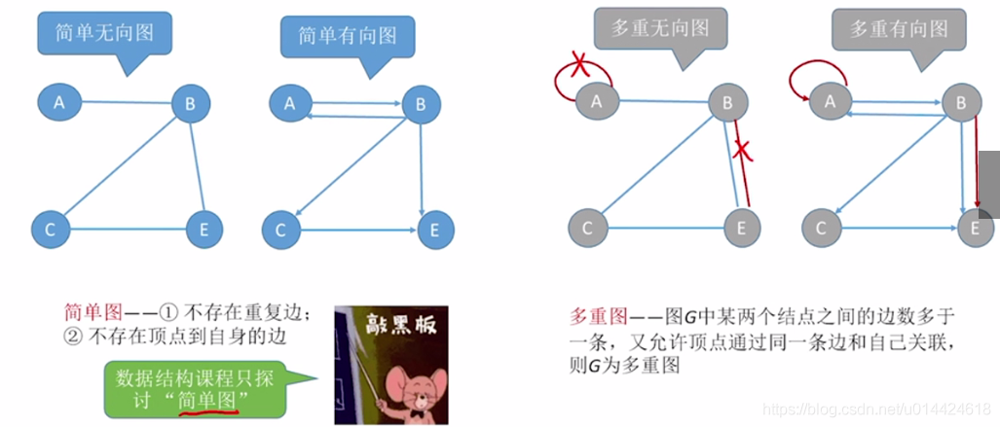
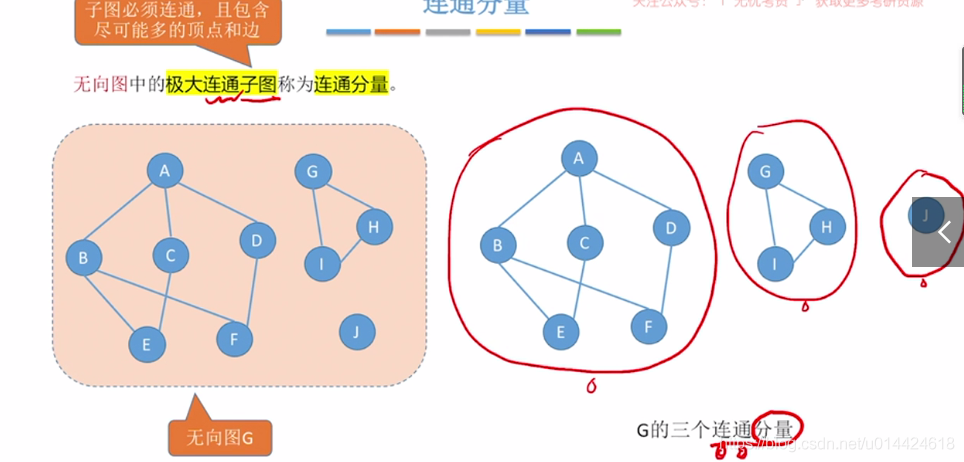
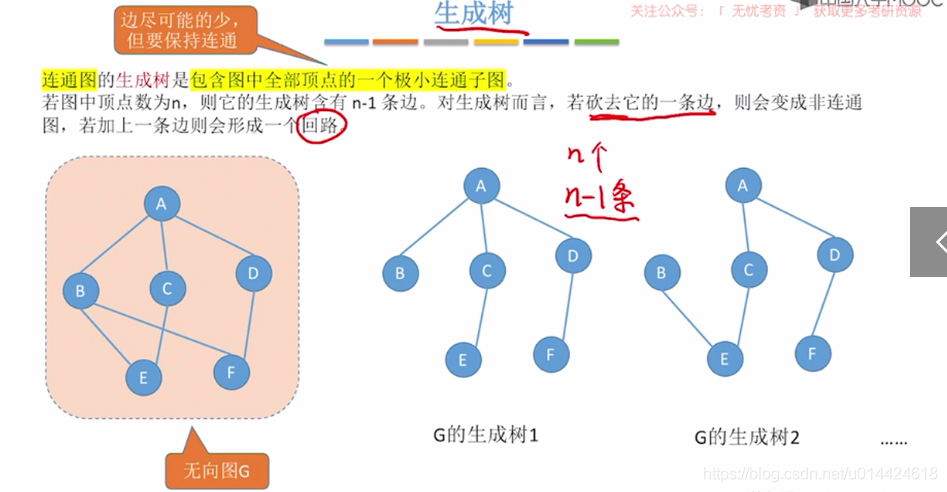
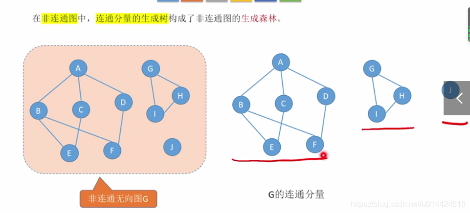
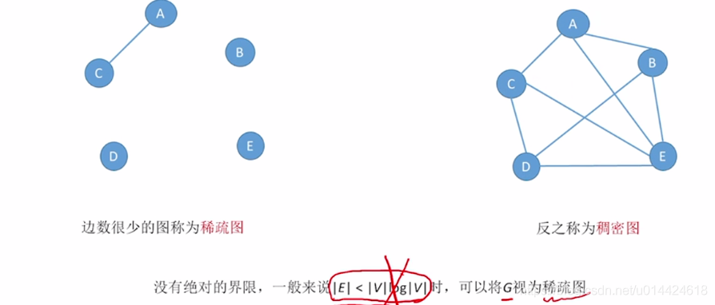
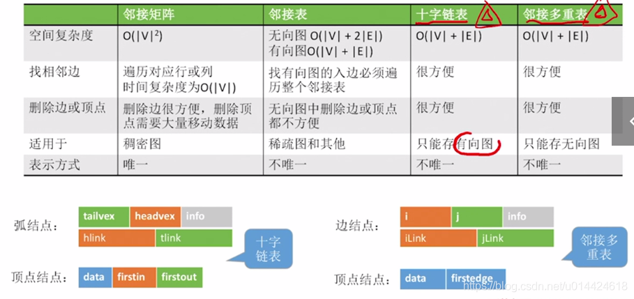
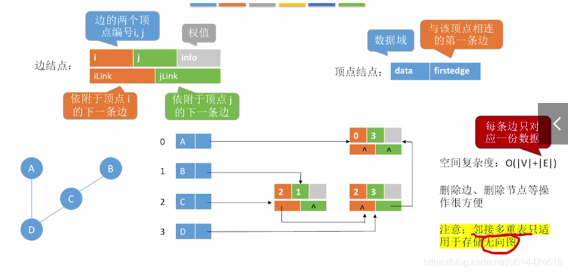
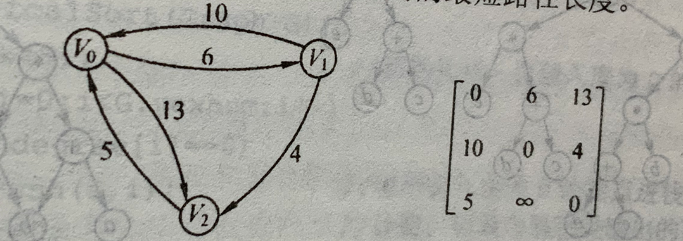

# 图

图`G`（`graph`）由顶点集`V`（`vertex`）和边集`E`（`edge`）组成，记为`G=(V,E)`。`|E|`表示边数，`|V|`表示顶点个数。

线性表、树可以是空表、空树，但图不能是空图。顶点集一定非空但边集可以为空。树是一种特殊的图。

## 术语

### 有向图

若`E`是有向边（也称弧）的有限集合时，图`G`为有向图，边是顶点的有序对，记为 `<v，w>`，`v`称为弧尾，`w`称为弧头

`<v，w>` 表示从顶点`v`到顶点`w`的弧

`<v，w>` != `<w，v>`

### 无向图

若`E`是无向边（简称边）的有限集合时，图`G`为无向边，边是顶点的无序对，记为 `(v，w)`或`(w，v)`

`(v，w)` = `(w，v)`

### 简单图与多重图

### 完全图（简单完全图）

完全图没有特指是指无向完全图和有向完全图两者都可

### 子图

并非`V`和`E`的任何子集都能构成`G`的子图，因为这样的子集可能不是图，比如`E`的子集中某些边关联的点并不在`V`这个子集中

### 连通、连通图、连通分量与强连通图、强连通分量

**无向图**

连通是对无向图而言的。

连通图：任意两个顶点都是连通的。

连通：若从顶点`A`到顶点`B`有路径存在，则称`A`、`B`连通。

连通分量（`Connected Component`）（极大连通子图）：要求该连通子图尽可能包含其所有边。任何连通图的连通分量只有一个，即是其自身。而非连通的无向图有多个连通分量。

极小连通子图：既要保持图连通又要边数最少的子图。

**有向图**

强连通是对于有向图而言的

强连通：若从顶点`A`到顶点`B`、顶点`B`到顶点`A`都有路径存在，则称`A`、`B`强连通。

强连通图：要求任意两顶点都是强连通的。

强连通分量：非强连通图里那部分强连通的子图（极大强连通子图）。顶点数大于1的强连通分量就肯定有环。

### 欧拉图（Euler Graph）

具有欧拉回路的图称为欧拉图。

欧拉回路是指可以构造出通过所有顶点且每个边都只走一次的回路。

[Seven Bridges Problem](https://www.cnblogs.com/prpl/p/10947348.html)

选择一个点出发，且要回到原点，那么该点入度出度一定相等，其他的点也是，所以必须度数为偶数。如果不需要回到原点，那么原点和终点度数是奇数。

### 生成树

`n`个顶点就有`n-1`条边。连通图的极小连通子图。（生成树一般都是指无向图），因此必定没有回路

### 生成森林

### 边的权、带权图/网

### 顶点的度、入度和出度

**无向图**

顶点`v`的度是指依附于该顶点的边的条数，记为 `TD(v)`

无向图的全部顶点的度的和等于边数的2倍：总度数 = `2e` (因为每条边和两个顶点相关联)

考到给定边的，然后给了某些顶点度的，直接边数乘2然后减去那些已知顶点的度后可以算出未知度的顶点数。

**有向图**

入度：以顶点`v`为终点的有向边的数目，记为`ID(v)`

出度：以顶点`v`为起点的有向边的数目，记为`OD(v)`

顶点`v`的度等于入度和出度之和

在具有`n`个顶点、`e`条边的有向图中，总入度数 = 总出度数 = `e` （因为每条有向边都有起点和终点，即同时是出入度的组成部分）

### 稠密图、稀疏图

### 有向树

一个顶点的入度为0，其余顶点的入度均为1的有向图。

### 顶点与顶点的关系描述

**路径**

顶点`Vp`到顶点`Vq`之间的一条路径是指顶点序列：`Vp，V1，V2…Vq`，或可以这样定义：由顶点和相邻顶点序偶构成的边所形成的序列。序偶："序"即有序，"偶"即一对。`<i,j>`就是顶点`i`和其相邻的顶点`j`俩个点构成的边也就是路径，方向是由`i`指向`j`。`<j,i>`是由`j`指向`i`的边（路径）。例子：`<a,b>,<b,d>`就是从`a`出发到`b`再从`b`到`d`的俩条边（路径）。

**回路**

第一个顶点和最后一个顶点相同的路径称为回路或环

**简单路径**

在路径序列中，顶点不重复出现的路径称为简单路径

**简单回路**

除第一个顶点和最后一个顶点外，其余顶点不重复出现的回路

**路径长度**

路径上边的数目

**（顶点到顶点的）距离**

从顶点`u`出发到顶点`v`的最短路径若存在，则此路径长度称为`u`到`v`的距离，若不存在，则记为∞

## 存储结构

### 邻接矩阵法

适用于稠密图，是用一个一维数组存储图中顶点的信息，再用一个二维数组存储图中边的信息（即各个顶点间的邻接关系），该二维数组称邻接矩阵。

结点数为`n`的图需要`n*n`矩阵，`A[i][j]`表示`<Vi,Vj>`（有向图）或`(Vi,Vj)`（无向图）。如果`A[i][j]=1`（或一个权值），则从`Vi`到`Vj`的边存在。如果等于0（或∞），则不存在。

无向图的邻接矩阵一定是对称矩阵（题目用来判断是有向图还是无向图）（且唯一），因此可以压缩存储。

遍历一行或一列容易得到相应顶点度的信息（注意如果是有向图则行是相应的出度信息，列是对应的入度信息）。

有向无环图（`Directed Acyclic Graph`，`DAG`）才有拓扑排序，得到拓扑序列。

如果有向图的邻接矩阵对角线下所有元素都为0，那么肯定是无环图，肯定有拓扑序列

### 邻接表法

结合顺序存储和链式存储方法，减少邻接矩阵法存储稀疏图时的浪费。

其实类似树的孩子表示法

即用一个数组存储顶点的数据信息，且每个元素中还有边表（邻接表）的头指针域，沿着边表走可以得到该顶点所有邻接的边。

因此，给定一顶点，扫描它的邻接表，很容易找出它所有的邻边。但要判断两个顶点是否有边，则没有邻接矩阵好判断。

### 十字链表法（存储有向图）

邻接表存有向图时，入度不好获取（除非逆邻接表，但这出度又不好获取）于是诞生了十字链表法

### 邻接多重表（存储无向图）

## 图的遍历

### 广度优先搜索（Breadth-First-Search BFS）

实际上是树的层次遍历拓展，也是借助队列实现的，还需要一个标记数组标记结点已被访问，防止重复访问。队列中装的是被标记访问过的顶点（因为是访问后立马标记已访问），但并未进行邻接顶点查询。

操作：队列不空，队首顶点出队列后，要遍历一遍它的邻接结点，对于每个未访问过的邻接结点访问并置标识，然后入队列。

#### 算法性能

空间复杂度队列在最坏情况下空间复杂度为`O(|V|)`

使用邻接表，很容易找邻边，总体来看，每条边至少访问一次，因此总体来看搜索邻接点总时间是`O(|E|)`。因为每个顶点也至少访问一次，因此总共时间复杂度为`O(|V|+|E|)`。

使用邻接矩阵，则对于每个顶点找它的所有邻接顶点，都需要搜索`O(|V|)`次，因此总共是`O(|V|^2)`

### 应用

#### 求解非带权图的单源最短路径

（当然所有边权值相等也行）

单源即从一个点出发。求到每个点的最短距离，又是非带权图，显然路径就是求最短边数，`BFS`原理就是由近及远，设置一个顶点大小的数组，对图遍历一遍能获得所有点距源点的最短边数。

实现方法：在出队列搜索邻接点时，对邻接点进行访问时，邻接点距离源点的路径即为出队列的该顶点的路径+1（这是一种递推思想）

#### 广度优先生成树

根据`BFS`遍历的顺序以及序列可以得到对应的树，根结点为源点，其到某个点的距离也是图中源点到某个顶点距离的最短边数。

因为和遍历的顺序有关，因此邻接矩阵的只有唯一的生成树，而邻接表则不唯一。

### 深度优先搜索（Depth-First-Search, DFS）

类似于树的先序遍历。

过程是从一个点出发，访问后依次遍历其所有未访问的邻接点，针对于每个又进一步进行访问… 尽可能深的遍历图，直到一个顶点没有未访问过的邻接点后，开始进行回退，回退到上一个遍历的过程中去（其实就是利用栈的特性进行"回退"，是递归的过程）

#### 算法性能

与`BFS`一样。

### 应用

#### 深度优先生成树和生成森林

与广度优先生成树原理类似。

另外如果是非连通图则会生成森林。

#### 判断图中是否有回路

根据生成树，如果出现了回边（反向边，即指向自身结点祖先）则证明有回路。

## 图的应用

### 最小生成树（Minimum-Spanning-Tree MST）

首先要理解生成树的概念

`G`所有生成树的集合中，各边权值之和最小的那棵树即为最小生成树。（又称最小代价树）

只要无向连通图中没有权值相同的边，则其最小生成树唯一。

#### Prim（普利姆）算法

随意选取一个顶点加入一个集合`T`，然后寻找一个与当前集合中所有顶点距离最近的顶点加入集合`T`并构造边，以此类推，直到顶点都加入了`T`。

时间复杂度为`O(|V|^2)`，因此适用于边稠密的图。

#### Kruskal（克鲁斯卡尔）算法

初始时只有`n`个孤立顶点而无边的非连通图。对所有边权值进行排序，然后从中依次选最小的边尝试连接图中顶点，若该边加入后构成回路，则舍弃。

时间复杂度为`O(|E|log|E|)`，因此适用于边稀疏而顶点稠密的图。

### 最短路径

广度优先搜索只能找无权图（或权值都相等）的最短路径。

两个算法都可适用于有回路的带权图（因此无法判断是否有环）（不考虑负权值的情况）

#### Dijkstra（迪杰斯特拉）算法

适用于单源最短路径。

[Dijkstra算法动画演示](https://www.bilibili.com/video/BV1jE411W7tT)

有两个辅助数组

`dist[i]`：存源点到`i`点的（当前轮）的最短路径

`path[i]`：存源点到`i`点的最短路径相应的（当前轮最优前驱）结点（最后可以根据它来追溯路径，是递归子问题最优解的思想（实际就是动态规划思想）（最优子结构，且无后效性））

和`Prim`算法类似的思想，是从顶点出发，放入一个集合`S`，然后找到`dist`中最小的那个点加入`S`，更新`path`、更新当前`S`集合中能到达的`dist`。

边上有负权值时不适用。

时间复杂度不管是邻接表还是邻接矩阵实现都是`O(|V|^2)`，如果要求每一对，则加多一层遍历，变为`O(|V|^3)`

#### Floyd（弗洛伊德）算法

适用于求每对顶点间的最短路径。

[Floyd算法动画演示](https://www.bilibili.com/video/BV1q4411M7r9)

原理是补全两个`n*n`方阵(行、列下标代表对应的顶点，表示从行顶点走到列顶点)，一个是最短路径方阵，一个是行顶点到列顶点最开始要经过的顶点的方阵（通过该表可以递推出这个最短路径序列，原理就是最优子结构）。

考试只需要掌握执行过程的写法，不需要画两个表

1. 先把两个点不能经过其他点的路径写出来（即`A(-1)`是说不经过点)

2. 开始假设如果能经过一个点，看它与不经过点直接到的路径谁更小，对每个点进行遍历，图中遍历顺序是0、1、2（即`A(0)`是说经过0点的情况，比较可以经过0点的话，路径的大小情况，其他同理），如果更小就替换

3. 所有点遍历完成后最后一个表即为解。

时间复杂度为`O(|V|^3)`

支持带负权值的边，但该边不允许在回路内。

### 拓扑排序（topological-sort）

即从`AOV`网中找到可行的活动顺序。它仅适用于有向无环图。

有序的拓扑排序序列是指不仅能够进行拓扑排序，而且序列的编号也有序，如果用邻接矩阵表示该有向图，那么它还是一个三角矩阵。注意和拓扑有序（指能够进行拓扑排序）区分。

#### 原理

1. 从图中选取一个没有前驱的顶点（入度为0）并输出。（就是选一个"进行活动"的入口）

2. 删除与这个顶点和以其为顶点的所有边。

3. 重复步骤1、2，直到图为空或图中剩下的是都有前驱的结点（说明有环）

#### 实现

具体实现是要先初始化一个所有顶点的入度数组，然后找到所有入度为0的结点暂存入容器中（比如栈、队列）

如果采用邻接表，时间复杂度为`O(n+e)`

顶点的入度数组是先遍历一遍整个邻接表生成的，时间复杂度`O(n+e)`

然后进行排序过程、删除边（即那个顶点邻接的边，总体来看就是`e`）的时间复杂度为`O(n+e)`。所以总体来说就是`O(n+e)`

而如果采用邻接矩阵，删除边的时候对于每个结点都要找`n`次，因此总共是`O(n^2)`

逆拓扑排序就是从图中选没有后继的顶点输出，最终结果是"从活动结束到开始"的顺序

若拓扑有序序列唯一，并非每个顶点的入度和出度最多为1。比如：

也可以得知：拓扑序列唯一，并不能唯一确定图。

**有向无环图（Directed Acyclic Graph, DAG）**

即不存在环的有向图。

它可以用于描述表达式，比如使用二叉树的形式描述的，可以进行压缩存储。根结点是运算符，叶子结点是运算数。如果有相同的部分可以去掉然后指向相同的部分的根结点，达到压缩存储的效果。

#### 有向无环词图（DAWG）

是一种可以对词进行快速搜索的数据结构。图的入口是最先搜索到的字母。图的每个节点代表一个字母，你可以从一个节点跳转到其他节点，具体怎么跳转依赖于节点代表的字母是否与待搜索的字母匹配。

### AOV网（Activity On Vertex NetWork）

用顶点表示活动，边表示（顶点）活动发生的先后关系。`AOV`网的边不设权值，若存在有向边`<a,b>`则表示活动`a`必须发生在活动`b`之前。

### AOE网（Activity On Edge Network）

`AOE`网是带权有向图中，以顶点表示事件（指向该顶点表示之前的活动已经完成的事件），以有向边表示活动，以边上的权值表示完成该活动的开销（比如完成活动所需时间）的网络。由于整个工程只有一个起点和一个终点，网中只有一个入度为0的点（源点，表示整个工程的开始）和一个出度为0的点（汇点，表示整个工程的结束，活动必须全部完成）。

`AOE`网工程完成的顺序是基于拓扑排序的。

## 关键路径

实际上就是求从源点到汇点的最大路径。（如果是选择题直接找出最大路径即可，注意多条最大路径的情况）

`AOE`网中有些活动可以并行进行，而且工程完成的条件是所有边代表的活动都已完成，那么求这个工程完成的最短时间就是求从源点到汇点的所有路径中，具有最大路径长度的路径，这个路径称*关键路径*，上面的活动称*关键活动*。（因为每条边的活动都必须完成，又因为木桶效应）

术语：

把时间当作几点，路径上的当作需要几小时完成。这里边和点是相对独立的，拿掉点后（拿掉点的前提是该点前面没有活动要完成了），边上的活动必须全部完成才能拿掉边，可以并行进行。

**事件Vk最早发生时间ve(k)**

是`v1`到`vk`的最长路径长度。根据它能够知道从`Vk`事件之后开始的活动最早开工时间。

需要用到拓扑排序（如果遇到环就会终止算法，因此可以判断是否有环）

**事件Vk最迟发生时间vl(k)**

隐含定义是汇点事件最迟发生时间是总工程最快完成时间，从工程最快完成的角度来递推事件最晚能推迟到多久才开始的时间

指在不推迟整个工程完成的前提下，保证它后继事件在最迟发生时间能够发生时，该事件最迟必须发生的时间。（即能拖到几点再开始做活动，如果想要拖到后继事件一点也不能拖的时间也能按时完成工程的话，就是拖到做完活动后恰好是到后继事件最迟发生的时间（有多条路活动反正都要完成，那么就拖需要做的时间最长的那个，所以就是根据后继的最迟发生时间减去路所耗时间最长的那个））

**活动ai最早开始时间e(i)**

根据该活动起点的事件最早发生时间得出

**活动ai最迟开始时间l(i)**

该活动起点的事件最迟发生时间与该活动所需时间之差。

**活动ai最迟开始时间l(i)与其最早开始时间e(i)的差额d(i)=l(i)-e(i)**

是指该活动完成时间的余量，即在不增加完成整个工程所需总时间的情况下，活动`ai`可以拖延的时间。若一个活动的时间余量为0，则说明该活动必须要如期完成，否则就会拖延整个工程进度，所以余量为0的活动为关键活动

### 缩短工期

关键路径上的所有活动都是关键活动。如果缩短关键活动到一定程度可能会变为非关键活动

关键路径不唯一，如果有多条关键路径的网（即有多条路径长度值一样最大的），只提高一条关键路径上的关键活动速度并不能缩短整个工程工期，要加快至少每条关键路径上一个关键活动（一般是加快它们共有的关键活动）才能达到缩短工期的目的 