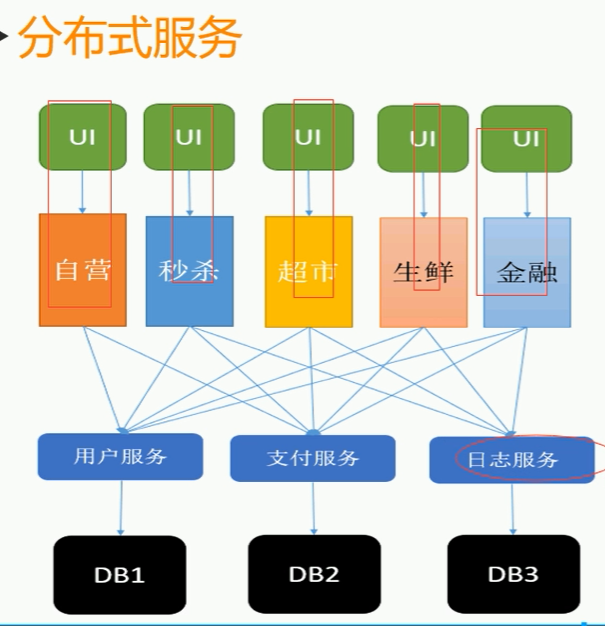
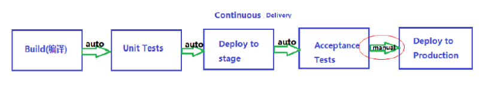

# 架构概述

## 种类

### 业务架构（Business Architecture, BA）

业务架构是对业务的结构化表达，描述组织如何运用业务的关键要素来实现其战略意图和目标。业务架构由价值流、业务能力和业务流程等几大要素组成。在规划阶段，规划团队可以从价值流出发，识别每一个价值流所需的关键业务能力，进而识别哪些能力可以重点引入数字技术进行业务模式重构，提升业务能力水平。

### 信息(数据)架构（Information Architecture，IA）

信息架构是以结构化的方式描述在业务运作和管理决策中所需要的各类信息，以及这些信息之间相互关系的一套整体组件规范。业务对象是信息架构的核心，在规划阶段，可以重点分析“产品、客户、合同、订单、员工”等关键业务对象及其分布，分析这些业务对象是否已经在IT系统中进行了管理，了解这些业务对象在系统间的传递是否顺畅，以及是否在数字世界中创建了数字镜像。

### 应用架构（Application Architecture，AA）

应用架构识别和定义了支撑业务目标达成所需的IT系统，及这些IT系统的定位和周边IT系统的集成关系。在规划阶段，应用架构重点关注用什么样的联接平台来构建客户和用户体验，以及采用什么样的IT系统承载数字化转型所需的关键业务能力。

### 技术架构（Technology Architecture，TA）

技术架构定义了一系列技术组件，代表了各种可以从市场或企业内部获得的IT平台和基础设施资源。在规划阶段，技术架构首先需要关注企业应该引入哪些数字技术，同时需要关注各种业务场景对IT平台和基础设施的需求。

# 架构设计

架构设计思想，包括不限于服务化、异步、高可用、可扩展等；

[图说设计模式 — Graphic Design Patterns (design-patterns.readthedocs.io)](https://design-patterns.readthedocs.io/zh-cn/latest/)

[me115/design_patterns: 图说设计模式 (github.com)](https://github.com/me115/design_patterns)

[免费在线学习代码重构和设计模式 (refactoringguru.cn)](https://refactoringguru.cn/)
设计模式本质实际上是一种思想，你怎么实现都可以，没有固定套路。然后下面给的实现方法或类的图只是一种典型实现罢了。

## SOLID原则

面向对象设计的五大原则(SOLID)

| 首字母 | 指代                                                                                                      | 概念                                                                                                                                               |
| --- | ------------------------------------------------------------------------------------------------------- | ------------------------------------------------------------------------------------------------------------------------------------------------ |
| S   | [单一功能原则](https://zh.wikipedia.org/wiki/%E5%8D%95%E4%B8%80%E5%8A%9F%E8%83%BD%E5%8E%9F%E5%88%99 "单一功能原则") | 认为“[对象](https://zh.wikipedia.org/wiki/%E5%AF%B9%E8%B1%A1_(%E8%AE%A1%E7%AE%97%E6%9C%BA%E7%A7%91%E5%AD%A6) "对象 (计算机科学)")应该仅具有一种单一功能”的概念。           |
| O   | [开闭原则](https://zh.wikipedia.org/wiki/%E5%BC%80%E9%97%AD%E5%8E%9F%E5%88%99 "开闭原则")                       | 认为“软件应该是对于扩展开放的，但是对于修改封闭的”的概念。                                                                                                                   |
| L   | [里氏替换原则](https://zh.wikipedia.org/wiki/%E9%87%8C%E6%B0%8F%E6%9B%BF%E6%8D%A2%E5%8E%9F%E5%88%99 "里氏替换原则") | 认为“程序中的对象应该是可以在不改变程序正确性的前提下被它的子类所替换的”的概念。  参考[契约式设计](https://zh.wikipedia.org/wiki/%E5%A5%91%E7%BA%A6%E5%BC%8F%E8%AE%BE%E8%AE%A1 "契约式设计")。 |
| I   | [接口隔离原则](https://zh.wikipedia.org/wiki/%E6%8E%A5%E5%8F%A3%E9%9A%94%E7%A6%BB%E5%8E%9F%E5%88%99 "接口隔离原则") | 认为“多个特定客户端接口要好于一个宽泛用途的接口”的概念。                                                                                                                    |
| D   | [依赖反转原则](https://zh.wikipedia.org/wiki/%E4%BE%9D%E8%B5%96%E5%8F%8D%E8%BD%AC%E5%8E%9F%E5%88%99 "依赖反转原则") | 认为一个方法应该遵从“依赖于抽象而不是一个实例”的概念。   [依赖注入](https://zh.wikipedia.org/wiki/%E4%BE%9D%E8%B5%96%E6%B3%A8%E5%85%A5 "依赖注入")是该原则的一种实现方式。                  |
### 单一职责原则（**S**ingle Responsibility Principle, SRP）

There should never be more than one reason for a class to change

### 开闭原则（The **O**pen/Closed Principle, OCP）

即一个类（或整个软件）应该对扩展开放，对修改关闭，意思是可以不用更改类源码的情况下就可以改变类的行为（扩展类的功能）。

要扩展一个类的功能，那这个类的方法传递的应面向抽象（或接口），这样就可以仅传递抽象，通过在类外部增加抽象实现来扩展类的功能。

### 里氏替换原则（**L**iskov Substitution Principle, LSP）
派生类（子类）对象可以在程序中代替其基类（超类）对象
意思是子类不应重写父类方法，即使重写方法内也应该兼容父类功能（如校验不能更加严格）
不过如果子类必须得重写父类方法的话，可以将父类定义为抽象类，这样父类无法实例化也就不存在替换的问题，也就不会违背里氏替换原则。

### 接口隔离原则（**I**nterface-Segregation Principles, ISP）

一个类需要实现接口，不应该需要被迫实现这个类并不需要实现的方法。
如果出现了，证明接口划分不够细微，需要重新划分接口。

### 依赖反转原则（**D**ependency Inversion Principle，DIP）

控制反转(Inversion of Control IoC) 是一个重要的面向对象编程的法则来削减计算机程序的耦合问题（解耦），屏蔽需要的对象的实现（多次依赖）细节（不关心它的生成，只关心它的使用），也是一些框架比如Spring框架的核心。一般分为两种类型：依赖注入(Dependency Injection DI) 和依赖查找(Dependency Lookup)

区别：

控制反转是创建对象实例的控制权从 代码控制 剥离 到使用 IOC容器 控制，就是把对对象的依赖转换成对抽象的依赖，侧重于原理，它是**目标**

依赖注入创建对象实例时，为这个对象注入其抽象的接口成员需要的对象实例，侧重于实现，是实现IoC的**手段**。而且被构造的对象能够自动的把其构造所依赖的对象生成并注入，支持无限级递归，这样在使用一个接口对象的时候，不必关心这个对象的依赖，这个对象生成的细节，只关心它的存在。

## AOP面向切面编程(Aspect Oriented Programming)

好处是聚焦业务逻辑，代码复用，集中管理，能够不破坏封装、不对代码进行侵入式更改的前提下额外增加功能，在运行时，动态地将代码切入到类的指定方法、指定位置上的编程思想。AOP像OOP一样，只是一种编程范式，AOP并没有规定说，实现AOP协议的代码，要用什么方式去实现。.NET中一般使用特性Attribute实现。比如Asp.net core中实现全局异常处理，仅在方法或类上添加异常Filter特性，就能集中实现异常处理，处理逻辑都集中在了异常特性类上。

## SOA面向服务架构

Service-Oriented Architecture，是一个组件模型，将应用程序的不同单元（服务）进行拆分，并将这些服务之间定义良好的接口和协议联系起来，一般是为了重用。

它会将所有的服务通过一个中介（源自中介者模式 Mediator），用统一的标准来进行交互。

## 微服务架构(Microservices)

先解释单体架构（Monolithic）：一个应用程序就是一个项目，在一个进程里运行。虽然开发简单集中管理，没有分布式损耗，但是不好维护，升级困难无法快捷迭代。

因此会想着将一系列服务组装成系统，服务独立部署，独立运行，独立开发和维护，分布式管理，强调隔离性

但这样分布式之后，是会有代价的。比如数据一致性。解决了分布式问题之后（比如分布式锁等），分布式技术成熟之后，分布式就变成了常见手段。

践行微服务架构遇到的问题：

**①进程间通信**：共享存储（门槛低、被动式通信，比如使用Redis/DB/Queue/文件）；服务通信（主动触发、数据序列化传递、跨平台、跨语言、http穿透防火墙，比如使用WebService/WCF/**WebAPI**（首选）/甚至ashx、aspx）；RPC-Remote Procedure Call（gRPC：高性能、开源和通用的RPC框架，面向服务端和移动端，基于HTTP/2设计）

**②服务实例集群**：如果服务放在一个服务器受到访问压力过大，有一崩全崩的风险，因此要保证高可用。还要实现服务的可扩展，比如一个服务在平时只需要用一个服务器就能满足性能需要，但在某些特殊时期要使用多台服务器实现性能伸缩等。所以服务要做到集群（负载均衡：多个服务器做相同的事，共同承载压力）

比如Nginx，实现请求分发，做到**负载均衡**

但无法解决动态增减服务实例，需要实现**服务注册与发现**。Nginx需要配置然后重启才能增加减少服务实例，不能动态伸缩。
还需要**健康检查**（心跳服务）：及时发现错误及时下线服务，Nginx也无法做到。（微服务架构1.0）详见Consul架构

**③网关Gateway：**

（微服务架构2.0后出现）客户端如何访问服务，这么多服务地址，单个服务下线、更新、升级，变动ip，所以不能直接访问，需要一个中介，这里诞生了**网关**：提供统一的服务入口，让微服务对前台透明；聚合后台的服务，节省流量，提升性能；提供安全，过滤，流控等API管理功能；集中鉴权授权。网关也直接集群，实现高可用，防止单点故障。

网关**服务治理**功能：缓存（同一个内容的请求，就不再请求服务端，直接按照缓存返回）、熔断（确定服务挂了之后，就不再请求服务，直接返回失败）、限流（单位时间内流量只允许多少次）、降级（在特殊情况下，可以降低服务等级甚至关闭，为其他服务提供性能）

Microservice Architecture微服务架构是用一个分布式服务拆分业务逻辑，完成解耦的架构模式。就是把以前三层架构里面的BLL层给独立层一个服务调用，以前是同进程内调用BLL层方法，线程是跨进程调用服务来完成。

这是Façade 门面模式

> 注：.NET中的三层架构表现层（UI User Interface）、业务逻辑层（BLL Business Logic Layer）、数据访问层（DAL Data Access Layer）再加上实体类库（Model）

## 三层架构

为了符合“高内聚，低耦合”思想，把各个功能模块划分为表示层（UI User Interface）、业务逻辑层（BLL Business Logic Layer）、数据访问层（DAL Data Access Layer）三层架构，各层之间采用接口相互访问，并通过对象模型的实体类库（Model）作为数据传递的载体

## 中台

在现代，中台和前台、后台对应，指的是在一些系统中，被共用的中间件的集合。常见于网站架构、金融系统。其实就是避免重复造轮子。

# DDD(Domain-Driven Design) 领域驱动设计

一套应对复杂软件系统分析和设计的面向对象建模方法论。

[领域驱动设计 (DDD) 总结_ddd领域能力 汇总表-CSDN博客](https://blog.csdn.net/lq0954/article/details/114996971)

个人理解：业务领域的OOP，将业务进行抽象，进而明确各个对象间的关系、职责，是微服务划分、业务架构设计的指导思想。

领域是一整个系统，领域划分多个子域，子域按不同角色、重要程度分为核心域、支撑子域、通用子域。

支撑子域是支撑其他子域去实现自身作用的（一般它需要被依赖）（也可以同时是核心域）

通用子域是基本上很多子域都得使用的（比如身份访问控制子域），更确切的说，它能被其他领域模型使用，即一个优秀的通用子域划分，不仅在这个领域也能使用，放到其他的领域也能够完美的复用。可以使用现成的解决方案实现。

域是业务上的概念，而限界上下文是具体实现的概念，即抽象与实际。

在没有进行DDD设计下，比如一个零售系统：分为电子商务系统、库存系统、外部的预测系统等等，这时候，限界上下文就是各个系统(一般来说就是一个解决方案中的一个工程项目)。

而这时候对其进行领域划分，划分子域，可以发现子域和限界上下文的对应关系非常混乱。

一个好的DDD，应要尽量将子域的划分与限界上下文重合起来。

## 术语

DDD的“通用语言”。

属于业务领域的名词：

| 名词         | 英文                            | 备注                                                                                                                                                                                                                                 |
|--------------|---------------------------------|--------------------------------------------------------------------------------------------------------------------------------------------------------------------------------------------------------------------------------------|
| **领域**     | Domain                          | 领域囊括一整个系统，领域划分多个子域，子域按不同角色、重要程度分为核心域、支撑子域、通用子域。 将问题视为领域，称为“问题空间”(problem space)，对问题空间的开发将产生新的核心域，问题空间的评估应该同时考虑已有的子域和额外所需子域。 |
| **领域模型** | Domain model                    | 一说是指整个领域的划分，是为领域模型。 个人倾向于理解为“领域中的模型”，子域内的业务的抽象建模，包含它的定义、属性、功能。它的实例称为领域对象                                                                                        |
| **核心子域** | Core or Basic Sub-domain        | 核心业务划分出来的子域。                                                                                                                                                                                                             |
| **支撑子域** | Auxiliary or Support Sub-domain | 支撑其他子域去实现自身作用的（一般它需要被依赖）（也可以同时是核心域）                                                                                                                                                               |
| **通用子域** | Generic Sub-domain              | 基本上很多领域都会使用的（比如身份访问控制子域），通用的子域划分。                                                                                                                                                                   |
| **通用语言** | Ubiquitous Language             | 通用语言是由整个团队共同创建的一门语言，其中包括领域专家、开发者、业务分析员等。 使用通用语言描述系统，使得整个团队拥有共同的上下文、情景意识，不再沟通困难。 可以是一组术语、一个简单的用例场景。                                   |
| **领域事件** | Domain Events                   | 领域中发生的事情。 通常用名词+动词命名，动词为过去分词形式。如UserPasswordChanged                                                                                                                                                    |

属于技术领域的名词：

| 名词              | 英文                 | 备注                                                                                                                                                                                                              |
|-------------------|----------------------|-------------------------------------------------------------------------------------------------------------------------------------------------------------------------------------------------------------------|
| **限界上下文**    | Bounded Context      | 技术上的服务划分，去实现业务上的领域划分，简单来说就是解决方案中的一个工程项目。限界上下文中的空间划分称为“解决方案空间”(solution space)。 我认为，微服务诞生之后，限界上下文可以认为就是划分出的一大类微服务。   |
| **领域模型**      | Domain model         | 开发人员眼中的领域模型，需要具象化，重新分成实体、值对象、聚合                                                                                                                                                    |
| **实体**          | Entity               | 可以认为是ORM中的实体，基本上都是需要持久化维护的数据。 它相对于值对象的最大区别是，它可以进行修改。                                                                                                              |
| **值对象**        | Value object         | 构造函数创建值对象后，它的属性就不可被修改了。它相对于实体更加简单，因此尽量将领域模型映射到值对象。                                                                                                              |
| **聚合**          | Aggregate            | 聚合是值对象、实体在同一个限界上下文之内的组合。聚合根是一个聚合的根部，一个类，它必定也同时是一个实体。 聚合的诞生是因为需要划分事务的边界（一致性问题），一个聚合可以是一个单一的实体。所以，不会有游离的实体。 |
| **充血模型**      | Rich domain model    | 好的领域模型设计。低耦合，高内聚。 它不仅含有属性，还有相关方法，成功的OOP。                                                                                                                                      |
| **贫血模型**      | Anaemic domain model | 坏的领域模型设计。 仅仅只是属性定义，没有什么方法。不用于领域模型设计，一般用于DTO等战术设计                                                                                                                      |
| **DDD的分层架构** |                      | DDD的通用架构包含4个概念层： 展现层、应用层、领域层、基础设施层                                                                                                                                                   |
| **应用层**        | Application layer    | 很薄的一层，用来协调应用的活动。它不包含业务逻辑。它也 不保留业务对象的状态，但它保留有应用任务的进度状态                                                                                                         |
| **领域层**        | Domain layer         | 本层包含关于领域的信息。这是业务软件的核心所在。在这里 保留业务对象的状态。对业务对象和它们状态的持久化被委托 给了基础设施层                                                                                      |
| **基础设施层**    | Infrastructure layer | 本层作为其他层的支撑库存在。它提供了层间的通信，实现对 业务对象的持久化，包含对用户界面层的支持库等作用                                                                                                           |
| **应用服务**      | Application service  | 它位于DDD分层架构的应用层。 应用服务是无状态的。 给外部使用的服务，里面没有具体的业务逻辑，只是资源库、聚合、领域服务、值对象的简单运用。                                                                         |
| **领域服务**      | Domain service       | 它位于DDD分层架构的领域层。 领域服务也是无状态的。 领域服务相对于应用服务、通用服务的区别是，它充满了业务逻辑。 不应把所有业务逻辑都拿到领域服务，因为这样会导致领域模型变成贫血模型。                            |

### 战略设计（Strategic Design）

划分领域

During the strategic phase of domain-driven design (DDD), you are mapping out the business domain and defining bounded contexts for your domain models.

### 战术设计（Tactical Design）

分析领域模型

Tactical DDD is when you define your domain models with more precision.

The tactical patterns are applied within a single bounded context.

### 通用语言（Ubiquitous Language）

领域专家和开发人员应建立并使用通用语言进行交流。

可以是一组术语、一个简单的用例场景。

### 领域事件

领域中发生的事情。

通常用名词+动词命名，动词为过去分词形式。如UserPasswordChanged

### 应用服务

它位于DDD分层架构的应用层

应用服务是无状态的。

给外部使用的服务，里面没有具体的业务逻辑，只是资源库、聚合、领域服务、值对象的简单运用。

注意，业务逻辑是指非常具体的逻辑，比如判断一个航班是否是热点航班。显然这个是聚合中的功能，而非应用服务要做的事情。

应用服务运用已经建模好的一些对象，不是所说的业务逻辑。

### 领域服务

它位于DDD分层架构的领域层。

领域服务是无状态的。

领域服务相对于应用服务、通用服务的区别是，它充满了业务逻辑。

不应把所有业务逻辑都拿到领域服务，因为这样会导致领域模型变成贫血模型。

应该把不适合放在领域模型（聚合、值对象）中的方法做成领域服务（比如一些可以作为静态方法的方法），比如需要使用到资源库（需要查询）等复杂的业务逻辑。

### 模型种类

POCO 是指简单C\#对象 Plain Old CLR Objects，贫血模型，只有属性定义，没有继承、接口等等。

A POCO—or a plain old class/CLR object—is a .NET data structure that contains only public properties or fields. A POCO shouldn't contain any other members, such as: methods, events, delegates

These objects are used primarily as data transfer objects (DTOs). A pure POCO will not inherit another object or implement an interface. It's common for POCOs to be used with serialization.

VO是指值对象或者View对象（Value Object、View Object）

POCO的意义就在于它的简单和灵活性，因为他的简单和灵活，是得POCO能够任意扩展，从而胜任多个场合

由于存在诸多差别，因此持久对象PO(Persistent Object)在代码上肯定和POCO不同，起码PO相对于POCO会增加一些用来管理数据库entity状态的属性和方法。而ORM追求的目标就是要 PO在使用上尽量和POCO一致，对于程序员来说，他们可以把PO当做POCO来用，而感觉不到PO的存在 POCO的扩展 POCO仅包含最简单的字段属性，没有多余的东西，它本质上就是一个普通的C\# Object。 但是在POCO的基础上，能够扩展出不同的对象。 为POCO增加了持久化的方法（Insert、Update、Delete……）之后，POCO就变成了PO。 为POCO增加了数据绑定功能之后，POCO就变成了View Object，即UI Model。 为POCO增加业务逻辑的方法（比如单据审核、转帐……）之后，POCO就变成了Domain Model。 POCO还可以当作DTO使用。

## 架构

### 项目结构

### 六边形架构（端口与适配器）

分为内部系统和外部系统，内部领域模型统一，外部新增一个用户，只需要将它的请求翻译/适配到公共API即可。

六边形架构将系统分为内层和外层。外层依赖内层，而内层使用依赖倒置技术，不依赖外层实现，使得系统在宏观层面也实现低耦合、高内聚。

内层为领域层，代表了应用的业务逻辑，它包含了所有的应用逻辑与规则。领域层不会直接引用技术实现细节，比如 HTTP /gRPC协议接口、消息队列、分布式缓存等云原生中间件或数据库的使用，确保在技术实现上的改动不会影响到领域层面。

外层为适配层，负责以某种格式接收输入、产生输出。这一层负责在外部世界与领域层之间进行数据结构协议上的技术转换，将外部数据结构翻译到统一的规范的系统领域模型的相关发布语言，解除系统与外部的耦合，使得系统保持纯净，实现外部无侵入、内部无感知，专注于业务实现。

适配层又可以分为两种：接收外部输入、输出到领域层的驱动侧适配器，接收领域层输入、输出到外部的从动侧适配器。内部通过端口和外部系统通信，端口代表了一定协议，以API呈现。一个端口可能对应多个外部系统，不同的外部系统需要使用不同的适配器，适配器负责对协议进行转换。这使得系统能够以一致的方式被用户、程序、自动化测试、批处理脚本所驱动，并且，可以在与实际运行的设备和数据库相隔离的情况下开发和测试。

它带来的好处：

1.独立于框架。架构不依赖于某个功能丰富的软件库的存在。这使您可以将这些框架用作工具，而不必将系统塞入其有限的限制中。

2.可测试。业务规则可以在没有UI、数据库、Web服务器或任何其他外部元素的情况下进行测试。

3.独立于UI。UI可以轻松更改，而不必更改系统的其余部分。例如，Web UI可以用控制台UI替换，而不必更改业务规则。

4.独立于数据库。您可以将Oracle或SQL Server替换为Mongo、BigTable、CouchDB或其他内容。您的业务规则不受数据库的限制。

5.独立于任何外部机构。实际上，您的业务规则根本不知道外部世界的任何事情。

<https://blog.cleancoder.com/uncle-bob/2012/08/13/the-clean-architecture.html>

### 事件源

想要追溯领域对象的修改，从源头到最终状态。

这种是对于某个聚合上的每次命令操作，都会发布至少一个领域事件，且这些领域事件都会被事件存储（Event Store）。

每次从这个聚合中获取该聚合时，都会通过该聚合上的所有事件重建聚合实例。（重放）

领域事件的顺序与时间轴一致。

航班追溯日志的设计思路与其类似。

### CQRS

对聚合、实体的修改称命令方法，查询称查询方法。

### Long-Running Process（长时处理过程）（Saga Pattern）

Saga设计模式是一种在分布式事务场景中管理跨微服务的数据一致性的方法。Saga是一个事务序列，它更新每个服务并发布消息或事件以触发下一个事务步骤。如果一个步骤失败了，saga会执行补偿性事务，抵消前面的事务。

## 限界上下文 (Bounded Context)

技术上的服务划分，去实现业务上的领域划分，简单来说就是解决方案中的一个工程项目。限界上下文中的空间划分称为“解决方案空间”(solution space)，领域中空间划分称为“问题空间”(problem space)

### 术语

| 中文              | 英文                                  | 备注                                                                                                                                                                    |
|-------------------|---------------------------------------|-------------------------------------------------------------------------------------------------------------------------------------------------------------------------|
| 另谋他路          | Separate Way                          | 如果两个上下文可以完全解耦，就别使用共享内核。 集成总是昂贵的。                                                                                                         |
| 上下文映射图      | Context mapping diagram               | 对限界上下文进行细致的图形描述，并有相应规范的标注。                                                                                                                    |
| 上游/下游         | Upstream [U] Downstream [D]           | 【Upstream-Downstream Relationship】上游是下游的基础上下文，即下游依赖于上游。通过上游[OHS,PL]与下游[ACL]解耦                                                           |
| 开放主机服务      | Open Host Service [OHS]               | 定义的一种协议，让其他服务通过协议访问本服务。可以理解为API                                                                                                             |
| 发布语言          | Published Language [PL]               | 在两个限界上下文之间翻译模型需要的一种共用语言，可以认为就是DTO                                                                                                         |
| 防腐层            | Anticorruption Layer [ACL]            | 可以认为是适配器，转换/翻译不同的模型。不过，这里的防腐层概念更细，它是指两个不同限界上下文之间的翻译层。                                                               |
| 共享内核          | Shared Kernel [SK]                    | 【Symmetric Relationship】对模型和代码的共享将产生紧密的依赖性，但该设计时好时坏。（下游Domain、上游Domain依赖同一个SKDomain） 共享内核应尽量保持小型化、定义显式边界。 |
| 大泥球            | Big Ball of Mud                       | 已有的系统（未遵循DDD的），或难以划分的模型，这类都归于大泥球。                                                                                                         |
| 合作关系          | Partnership [P]                       | 【Symmetric Relationship】两个限界上下文要么一起成功，要么一起失败。（相互依赖，定义公用接口，互相需要调用双方，即互为上下游关系）                                      |
| 客户方-供应方开发 | Customer Supplier Development [C] [S] | 【Upstream-Downstream Relationship】上游团队顾及下游团队的开发，即[S]是供应方，需要为客户方提供特定接口。因为一般情况下，上游团队可以不顾及下游，因为上游感知不到下游。 |
| 遵奉者            | Conformist [CF]                       | 下游团队直接使用上游团队的模型、语言（即下游Domain直接依赖上游Domain）                                                                                                  |

### 上下文映射图

使用ContextMapper工具来辅助限界上下文的创建<https://contextmapper.org/docs/>

### 模块

简单的理解，是项目中细分的命名空间，是项目的模块化。

比如CustomService.Domain.Model和CustomService.Infrastructure等。

### 实体（Entity）

an object primarily defined by its identity is called an Entity.

可以认为是ORM中的实体，都是需要持久化的数据。

它相对于值对象的最大区别是，它可以进行修改。

维护起来更加复杂。

讨论例子P168-P172

An entity's identity can cross multiple microservices or Bounded Contexts.

而唯一的具体定义只能来源于一个限界上下文

同一种实体可能存在于不同的限界上下文中。比如航班子域的告警模型，与告警子域的告警模型（我称为模型的主上下文，模型数据真正的来源）。航班子域中的告警模型只有产生告警这个功能，而告警子域中有处理告警等功能，他们两个实体可以通过GUID来联系起来，航班子域的告警模型通过发布产生告警的领域事件，告警子域订阅该告警来实现解耦。

但最好的情况是，其他上下文需要使用主上下文的模型的时候，是视图的模式，即建模为值对象即可。

比如，电报子域的电报模型拿航班模型进行联合分析时，此时航班模型是值对象模型。（虽然最后采用了另一种Actor设计模式）

### 值对象（Value object）

没有标识符，所以不需要进行修改追踪。

构造函数创建值对象后，它的属性就不可被修改了。

方法也只接收其他值对象或值类型的参数，进而通过自身属性计算出最终结果，返回值也是值对象或值类型。

它相对于实体更加简单，因此尽量将领域模型映射到值对象。

可以被持久化。

实体中的值对象，进行修改其实是赋值另一个值对象

例如：

this.Name = new Name(“xx”)，而不是在原有名称值对象中进行修改。

### 聚合（Aggregate）

聚合是值对象、实体在同一个限界上下文之内的组合。

聚合根是一个聚合的根部，一个类，它必定也同时是一个实体。

设计聚合时，容易设计成臃肿的聚合，比如一个聚合根聚合非常多的实体类，而同一时刻常常会并发修改同一个聚合，造成并发问题。此时，命令方法都是在聚合中的。

应该尽量将聚合设计的尽量小。

可以通过标识（GUID等值对象）引用其他聚合，而不是直接使用对象引用（某些情况也可以使用），这样一个目的是做延迟加载。

我们尽可能不要在同一个事务中修改多个聚合实例。我们可以采用手段来达到最终一致性。

## 基本原则

避免在聚合中使用资源库，即一个类对象中的方法，不应直接使用资源库。

比如一个统计方法，返回值是Priority值对象，内容是遍历资源库中某个实体列表统计Priority。这类就不应该直接写在聚合类中，而应该使用领域服务去实现。

**UML类图和时序图**

Unified Modeling Language统一建模语言

**UML五种视图**

| 视图     | 定义                                                                                            |
|----------|-------------------------------------------------------------------------------------------------|
| 用例视图 | 强调从系统的外部参与者（主要是用户）的角度看到的或需要的系统功能 其中参与者是指系统外部的人或物 |
| 逻辑视图 | 从系统的静态结构和动态行为角度显示如何实现系统的功能                                            |
| 组件视图 | 显示代码组件的组织结构。                                                                        |
| 并发视图 | 显示系统的并发性，解决在并发系统中存在的通信和同步问题                                          |
| 配置视图 | 显示系统的具体部署。部署是指将系统配置到由计算机和设备组成的物理结构上                          |

**实体关系（Entity Relation）**

**泛化关系(generalization)**

泛化关系用一条带空心箭头的直接表示，指向的是父类

代码中，泛化关系表现为继承非抽象类

**实现关系(realize)**

实现关系用一条带空心箭头的虚线表示；

代码中，实现关系表现为继承抽象类；

**聚合关系(aggregation)**

聚合关系用一条带空心菱形箭头的直线表示，如下图表示A聚合到B上，或者说B由A组成

聚合关系用于表示实体对象之间的关系，表示整体由部分构成的语义；例如一个部门由多个员工组成；

与组合关系不同的是，整体和部分不是强依赖的，即使整体不存在了，部分仍然存在；例如， 部门撤销了，人员不会消失，他们依然存在；

关联关系中的一种，体现在代码上就是，B由A组成，B里有A类成员，B不存在了，A类也有意义。

**组合关系(composition)**

组合关系用一条带实心菱形箭头直线表示，如下图表示A组成B，或者B由A组成

与聚合关系一样，组合关系同样表示整体由部分构成的语义；比如公司由多个部门组成；

但组合关系是一种强依赖的特殊聚合关系，如果整体不存在了，则部分也不存在了；例如， 公司不存在了，部门也将不存在了；

关联关系中的一种，体现在代码上就是，B由A组成，B中有A类成员，但A是一种B的“私有”类，离开了B，A没有意义。

**关联关系(association)**

关联关系可细分为组合关系和聚合关系。

关联关系是用一条直线表示的；它描述不同类的对象之间的结构关系；它是一种静态关系， 通常与运行状态无关，一般由常识等因素决定的；它一般用来定义对象之间静态的、天然的结构； 所以，关联关系是一种“强关联”的关系；

比如，乘车人和车票之间就是一种关联关系；学生和学校就是一种关联关系；

关联关系默认不强调方向，表示对象间相互知道；如果特别强调方向，如下图，表示A知道B，但 B不知道A；

注：在最终代码中，关联对象通常是以成员变量的形式实现的；

**依赖关系(dependency)**

依赖关系是用一套带箭头的虚线表示的；如下图表示A依赖于B；他描述一个对象在运行期间会用到另一个对象的关系；

与关联关系不同的是，它是一种临时性的关系，通常在运行期间产生，并且随着运行时的变化； 依赖关系也可能发生变化；

显然，依赖也有方向，双向依赖是一种非常糟糕的结构，我们总是应该保持单向依赖，杜绝双向依赖的产生；

**注：在最终代码中，依赖关系体现为类构造方法及类方法的传入参数，箭头的指向为调用关系；依赖关系除了临时知道对方外，还是“使用”对方的方法和属性；**

**时序图**

时序图（Sequence Diagram）是显示对象之间交互的图，这些对象是按时间顺序排列的。时序图中显示的是参与交互的对象及其对象之间消息交互的顺序。

时序图包括的建模元素主要有：对象（Actor）、生命线（Lifeline）、控制焦点（Focus of control）、消息（Message）等等。

**创建型模式(Creational Pattern)**

创建型模式是将类的创建与使用分离，不必关心类创建的细节，因此得到的是这个产品的父类。

**简单工厂模式( Simple Factory Pattern )**

工厂实际上是一个静态方法，然后仅需传入所需参数，就可以得到对应产品的类，当然传出来的是该具体产品的抽象类。

缺点是产品更新得修改工厂这个静态方法，不符合开闭原则

**工厂方法模式（Factory Method Pattern）**

又称为工厂模式，也叫虚拟构造器(Virtual Constructor)模式或者多态工厂(Polymorphic Factory)模式。属于类创建型模式（因为创建的还可能还不够具体？比如苹果工厂创建的苹果产品，还可以细分？暂时无法区分类与对象创建型模式）

是简单工厂模式的改进版，更加的符合开闭原则。

即将工厂类做抽象，然后对应的产品有对应的工厂，产品类的创造由对应的工厂类实现（实际上意思是写产品类的时候也要提供对应的工厂类），最后只需要调用具体的工厂类生成对应的产品（一般是通过另一个方法，这个方法读取文件配置等获取到具体的工厂类实例然后创建产品）

这样产品增加也不需要改动工厂了。

**为什么不直接new对象**

应该是它主要解决框架或者sdk不想暴露给客户端具体的实例的创建过程，对对象的创建进行分装。还有一种情况是如果一个对象你在多个不同的文件中创建了实例，**当需要改成单例模式或者其他实例化方式的时候就需要改动所有实例化的地方，而使用工厂模式只需要改动相应的工厂一个地方**，客户端并不需要任何改动。

**抽象工厂模式（Abstract Factory）**

如果有两种产品，一种是手机、一种是电脑，而手机又分为苹果手机、安卓手机，电脑又有苹果电脑，安卓电脑（假设），要创建具体的苹果手机或安卓手机对象？使用工厂方法模式需要有四个有对应的工厂，但这显然很繁琐。

将工厂面向两种抽象产品作为生产抽象产品的“抽象”工厂，工厂来决定是生产何种产品（苹果or安卓），这时候从手机工厂得到的手机，就会根据配置得到是苹果或者安卓手机对象了（当然得到的也是手机这个抽象类）。

所以具体工厂是有两个方法，一个是生产安卓产品的方法，一个是生产苹果产品的方法。

但这缺点是会有开闭原则的倾斜性：即一部分符合另一部分却不符合，比如安卓和苹果又做了一个新的产品，是电视机，那么只需要再增加一个电视机的抽象类、安卓电视、苹果电视的类，然后一个电视的工厂类，其他不必修改，就支持了得到电视对象。

而如果要增加一个新的品牌，比如微软，那么将需要修改很多地方，这违背了开闭原则。

**建造者模式（Builder Pattern）**

比如需要建造一个KFC套餐，里面有很多种类，需要组装才可以变成汽车，这时候可以使用建造者模式，可以隔离客户与生产过程。

该模式它会有Director指挥者、Builder抽象建造者、ConcreteBuilder具体建造者，指挥者用于具体建造这个对象，将多个抽象建造者建造的部分组合起来成为完整的对象，Builder和ConcreteBuilder就类似于抽象工厂和具体工厂，不过它们是生产一个部分，而不是整体。

当指挥者和抽象建造者只有一个时，可以直接合为一个Builder，即只有这一种组成方式，兼任指挥者和建造者。Kou框架命令管道的Builder就类似于此，它的全局管道Builder就是建造者模式的简化，将初始配置的中间件全部组装成一个管道，只需要获取全局管道即可，自动组装。

**单例模式（Singleton Pattern）**

类似于静态类，不同的是它是面向对象的实现，它对外只提供同一个实例。

相较于静态类的好处是，它可以以对象的形式来调用方法；以后不想变为单例模式可以改变构造方法；可以使用接口、类的继承等等。

**结构型模式（Structure Pattern）**

描述如何将类或者对象结合在一起形成更大的结构，就像搭积木，可以通过简单积木的组合形成复杂的、功能更为强大的结构。

**适配器模式（Adapter Pattern）**

即是将旧接口（或旧类）适配到新接口（或新类），能够在不更改双方代码的情况下，使用旧对象传入适配器，可以得到一个适配过的新对象（或接口），然后调用该新对象即可（本质是从旧接口适配到的新接口，调用的实际上还是旧类的接口）。

其中有Target类、Adapter类、Adaptee类（适配者），即适配者类（旧类）传入Adapter得到Target类（新类），然后用这个Target类即可。

Koubot框架中，也用到了适配器模式的思想，设计了平台适配器，将kou中的消息协议、事件等等都与每个平台的接口进行了适配。

**桥接模式（Bridge Pattern）**

个人认为，这个桥接模式其实就是很容易的抽象思想，我们用常见的例子分析：

设想如果要绘制矩形、圆形、椭圆、正方形，我们至少需要4个形状类，但是如果绘制的图形需要具有不同的颜色，如红色、绿色、蓝色等。

这很容易就想到，对形状类和颜色类都进行一个抽象，然后抽象形状类中聚合一个颜色抽象类，这就已经是所谓的桥接模式了。

但这形状类就与颜色类有耦合了。

我觉得真正的桥接模式应该是有一个桥类，或者说是组合类，即颜色型形状类，它其中有形状类和颜色类两个抽象类，这样就真正分离了形状和颜色抽象类。

**装饰模式（Decorator Pattern）**

是实现AOP的一种实现。

一个抽象类Component，然后Decorator也是Component类的子类，Decorator类里面还有Component，这就形成了一种嵌套，每次新的Decorator需要传递一个内层的Component，把它wrap住，这个新的就变成了最外层的一层。可以多次Decorate。

**门面(外观)模式（Façade Pattern）**

也是一种简单抽象思想。

当一个系统有多个子系统类的时候，它们需要配合使用，如果客户端要用整体一个功能，就需要用到很多子系统类，为了降低对类的耦合，将对多个子系统的依赖降低为对一个类的依赖。这个类就称作“外观”类。外观类中关联了这多个子系统，并提供从子系统中抽象出来的统一的接口。

比如Command处理系统中，五个器，即五个子系统，可以弄一个外观类，将五个子系统的方法统一到外观类中。

**享元模式（Flyweight Pattern）**

又称为轻量级模式，将相似或相同的对象进行复用。

拥有享元池和具体享元对象。通过一种特定的协议来区分这些享元，即获取出来的对象是从池子中获取的共享享元还是需要新键共享享元放入池中。该模式就是为了减少同一个对象创建等带来的浪费。

**代理模式（Proxy Pattern）**

就是在客户端要调用的目标类中增设一个代理类，客户端转而使用代理类去间接调用目标类，一定程度上降低对目标类的耦合，而且代理类可以增设一些权限控制等。

**行为型模式（Behavioral Pattern）**

行为型模式不仅仅关注类和对象的结构，而且重点关注它们之间的相互作用。

**命令模式（Command Pattern）**

刚好和Koubot框架的KouCommand类一样的思想，传递的请求被封装成一个对象，这样客户端类和接收者类通过Command对象来联系。

**中介者模式（Mediator Pattern）**

MVC框架中的Controller就是调停Model与View之间的交互

比如FlightActor与FlightService、MessageService、NotificationService的关系。

.NET 实现框架：<https://github.com/jbogard/MediatR>

<https://www.codeproject.com/Articles/5317666/Why-Do-We-Need-MediatR>

**观察者模式（Observer Pattern）**

一个类中有观察者对象，类发生改变之后通知这个观察者说我改变了，之后观察者就会进行相应的变化。

MVVM架构中ViewModel就非常的典型，ViewModel发生改变之后，View相应的会发生变化，因为View的数据绑定了ViewModel

**状态模式（State Pattern）**

一个对象中拥有状态，状态不同的时候这个对象的功能也发生相应的变化。

**策略模式（Strategy Pattern）**

将同一种功能的不同算法实现封装起来，根据策略来进行调用不同算法的功能实现。

比如Koubot框架中的请求限流器，分为令牌桶算法和漏桶算法两种，可以根据情况来选择哪种实现。

# 新模式（云原生）

<https://blog.csdn.net/u010099177/article/details/125378140>

## CQRS (Command Query Responsibility Segregation) 命令查询职责隔离

实际上就是读写分离

## Scheduler Agent Supervisor Pattern 调度代理主管模式

# 软件自动化交付周期

### 持续集成（Continuous integration, CI）

### 持续交付（Continuous Delivery, CD）

频繁地将软件的新版本，交付给质量团队或者用户，以供评审。如果评审通过，代码就进入生产阶段。

Continuous delivery is the ability to deliver software that can be deployed at any time through manual releases; this is in contrast to continuous deployment which uses automated deployments. According to Martin Fowler, continuous deployment requires continuous delivery. Academic literature differentiates between the two approaches according to deployment method; manual vs. automated.

### 持续部署（Continuous Deployment, CD）

# 软件工程

软件版本

常用版本号：

Alpha：软件或系统的内部测试版本，会有很多Bug，仅内部人员使用

Beta：软件或系统的测试版本，这一版本通常是在Alpha版本后，会有很多新功能，同时也有不少Bug

Gamma：软件或系统接近于成熟的版本，只需要做一些小的改进就能发行

微软常用的版本号：

RC（Release Candidate）：候选版本，这一版本不会增加新功能，多要进行Debug

GA（General Available）：正式发布版本，这个版本就是正式的版本

RTM（Release to Manufacture）：给工厂大量生产的压片版本，与正式版内容一样

OEM（Original Entrusted Manufacture）：给计算机厂商的出场销售版本，不零售只预装

RVL：号称是正式版，其实RVL根本不是版本的名称。它是中文版/英文版文档破解出来的

EVAL：而流通在网络上的EVAL版，与“评估版”类似，功能上和零售版没有区别

RTL（Retail）：零售版是真正的正式版，正式上架零售版

苹果常用的版本号：

GM（Gold Master）：正式版前最后一个测试版，其实也就是正式版

谷歌Chrome浏览器常用的版本号：

Chromium：开源版本，迭代速度极快，数小时就会有新版本，有很多新功能，等待验证后会移植到Chrome

Canary：迭代速度相对于Chromium版稍慢一些，功能非常新但未经过验证，同时崩溃的概率非常高

Dev：基于Chromium开发，每周出新功能，并且这些功能还有一定的筛选，另外还修复了一些Bug和不稳定因素

Beta：基于Dev版，Chrome会基于这一版本进行改进，一般按月更新，功能更加完善

Stable：稳定版本，也就是Chrome的正式版本，这一版本基于Beta版，已知Bug都被修复，一般情况下，更新比较慢

Ubuntu系统常用的版本号：

LTS（Long Term Support）：长期演进版，Ubuntu会对这一版本的支持时间更长。目前Java也在运用这种方式
