目录

[基础知识](#基础知识)

[漏洞利用](#漏洞利用)

[Cross Site Script (XSS)](#cross-site-script-xss)

[CSRF漏洞 （客户端漏洞）](#csrf漏洞-客户端漏洞)

[点击劫持漏洞](#点击劫持漏洞)

[URL跳转漏洞 （客户端漏洞）](#url跳转漏洞-客户端漏洞)

[命令注入漏洞](#命令注入漏洞)

[文件上传漏洞](#文件上传漏洞)

[SQL注入](#sql注入)

[数据库](#数据库)

[WEB服务器](#web服务器)

[Apache](#apache)

# 基础知识

●CMS是Content Management System的缩写，意为"内容管理系统"。

**●**超文本传输协议（HTTP，HyperText Transfer Protocol)

●FTP（File Transfer Protocol，文件传输协议） 是 TCP/IP 协议组中的协议之一。FTP协议包括两个组成部分，其一为FTP服务器，其二为FTP客户端。其中FTP服务器用来存储文件，用户可以使用FTP客户端通过FTP协议访问位于FTP服务器上的资源。在开发网站的时候，通常利用FTP协议把网页或程序传到Web服务器上。此外，由于FTP传输效率非常高，在网络上传输大的文件时，一般也采用该协议。

默认情况下FTP协议使用TCP端口中的 20和21这两个端口，其中20用于传输数据，21用于传输控制信息。但是，是否使用20作为传输数据的端口与FTP使用的传输模式有关，如果采用主动模式，那么数据传输端口就是20；如果采用被动模式，则具体最终使用哪个端口要服务器端和客户端协商决定。

●File协议：

中文意思：本地文件传输协议

什么是File：File协议主要用于访问本地计算机中的文件，就如同在Windows资源管理器中打开文件一样。

如何使用File：要使用File协议，基本的格式如下：file:///文件路径，比如要打开F盘flash文件夹中的1.swf文件，那么可以在资源管理器或浏览器地址栏中输入：file:///f:/flash/1.swf回车。

为什么是三个”///”: 因为URL的结构是**schema**(底层协议，如http, https, ftp)**://host**(服务器域名或者ip地址)**[:port\#]**(服务器端口) 因为文件没有host 所以省略了。

##### URI与URL

URI = Uniform Resource Identifier 统一资源标志符

URL = Uniform Resource Locator 统一资源定位符

URN = Uniform Resource Name 统一资源名称

URI包含URL与URN，只要能定位一个互联网资源的方法，就叫URI，本来设想的的使用两种方法定位：URL，用地址定位；URN 用名称定位，但未流行。

URL Uniform Resource Locator (统一资源定位符) 相当于买东西的时候的地址

**schema**(底层协议，如http, https, ftp)**://host**(服务器域名或者ip地址)**[:port\#]**(服务器端口，HTTP默认端口是80（可省略），其他端口要指明)**/path/…/**(访问资源的路径)**[?query-string]**(发送给http服务器的数据)**[\#anchor]**（锚，定位到位置）

例:

http:// dun.163.com /sj/test/test.jsp ?name=sviergn&x=true \#stuff

●HTTP Referer：告知服务器该请求的来源（浏览器自动加上）

可判断来源是否合法：防止盗链等

●Set-Cookie: WEB服务器向浏览器颁发凭证（登陆成功后等）

●HTTP有两种常用的方法，一种是GET ：从指定的资源请求数据，另一种是POST：向指定的资源提交要被处理的数据。

●HTTP响应包括数字状态码，状态码301和302都是代表网页跳转的意思。

●HTML标签不区分大小写

●DOM（Document Object Model ，文档对象模型）连接web的页面和编程语言，一种独立于语言，用于操作xml，html文档的应用编程接口。<https://www.cnblogs.com/Ry-yuan/p/6918155.html>

●BOM（Browser Object Model）连接浏览器和编程语言，即浏览器对象模型。

BOM提供了独立于内容 而与浏览器窗口进行交互的对象；<https://www.cnblogs.com/2010master/p/5824215.html>

●web服务端架构：web服务器、语言解释器（解析PHP语言）、数据库

Windows server: IIS + ASP(.NET) + SQL Server (.NET)

Linux: Apache + PHP + MySQL (LAMP)

UNIX/Windows: Tomcat + JSP + Oracle (J2EE)

(并非固定搭配，可灵活组合)

ps：可通过index文件类型判断是什么脚本语言编写的。有.asp、.aspx、.jsp、.php等

●SQL 语法 （对大小写不敏感）

分号作为语句的结束，程序会自动补充

创建数据库 **CREATE（创建）** *DATABASE(数据库)* websecurity（名称）

●html乱码

在HTML文件头中增加下面代码：

\<meta http-equiv="Content-Type" content="text/html; charset=utf-8" /\>

●搜索引擎语法

①Intitle:keyword 标题中包含有关键词的网页

②Intext:keyword 正文中含有关键词

③Site:domain 再某个域名和子域名下的网页

④Filetype搜索范围限定在指定文档格式中

查询词用Filetype语法可以限定查询词出现在指定的文档中，支持文档格式有pdf，doc， xls，ppt，rtf,all(所有上面的文档格式)。对于找文档资料相当有帮助。

例子：photoshop实用技巧 filetype:doc

●Webshell (web后门木马) 可执行环境

可获取服务器上的各种权限 有asp/php/jsp多种。

●本地主机

(Internet Protocol version 4)ipv4: 127.0.0.1

ipv6: [ : : 1]

localhost

## 其他

### Unicode/UTF-8中的特殊字符

#### 文本反转

Unicode代码：U+202E

<https://unicode-table.com/cn/202E/>

| 编码     | hex         | dec (bytes) | dec       | binary                              |
|----------|-------------|-------------|-----------|-------------------------------------|
| UTF-8    | E2 80 AE    | 226 128 174 | 14844078  | 11100010 10000000 10101110          |
| UTF-16BE | 20 2E       | 32 46       | 8238      | 00100000 00101110                   |
| UTF-16LE | 2E 20       | 46 32       | 11808     | 00101110 00100000                   |
| UTF-32BE | 00 00 20 2E | 0 0 32 46   | 8238      | 00000000 00000000 00100000 00101110 |
| UTF-32LE | 2E 20 00 00 | 46 32 0 0   | 773849088 | 00101110 00100000 00000000 00000000 |

# 漏洞利用

## Cross Site Script (XSS)

跨站脚本

危害：盗取用户信息、钓鱼、制造蠕虫；

概念：（前端注入）“HTML注入”篡改网页，插入了恶意脚本，当用户在浏览网页时，实现控制用户浏览器行为的一种攻击方式。

类型：

●存储型

访问网站，触发XSS

●反射型

访问携带XSS脚本的链接 触发XSS

（后端应用程序将xss写入到响应页面中）

●DOM型

访问携带XSS脚本的链接 触发XSS

可以通过URL的hash来携带XSS脚本内容，以绕过web后端应用程序的XSS过滤器

（通过前端javascript将xss脚本写入到DOM中）

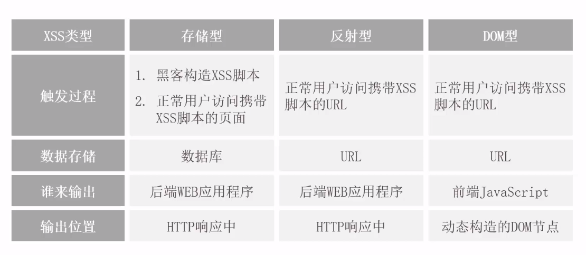

## CSRF漏洞 （客户端漏洞）

全称：Cross-site request forgery

中文：跨站请求伪造

危害：执行恶意操作（“被转账”、“被发表垃圾评论”）

制造蠕虫

概念：利用用户已登陆的身份，在用户毫不知情的情况下，以用户的名义完成非法操作

技巧：攻击页面使用iframe表单，长宽设置为0，因为恶意转账页面是通过form表单提交的，会有明显的页面跳转，因此这样设置可以提高隐蔽性

## 点击劫持漏洞

覆盖不可见的框架iframe，诱惑、引导用户进行点击，隐蔽的进行操作

## URL跳转漏洞 （客户端漏洞）

●Header头跳转

1\. \$url = \$_REQUEST[“url”]; request方法获取用户链接

2\. header(“Location: \$url”); 进行跳转

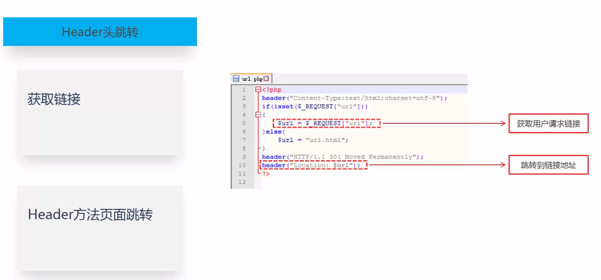

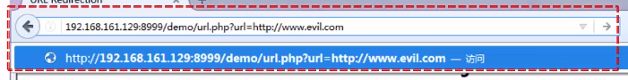

●Javascript跳转

1.var site = getQueryString(“site”);获取用户请求链接

2.使用window.location.herf = site;进行跳转

●meta跳转

content设置延时

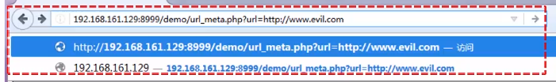

●其他跳转

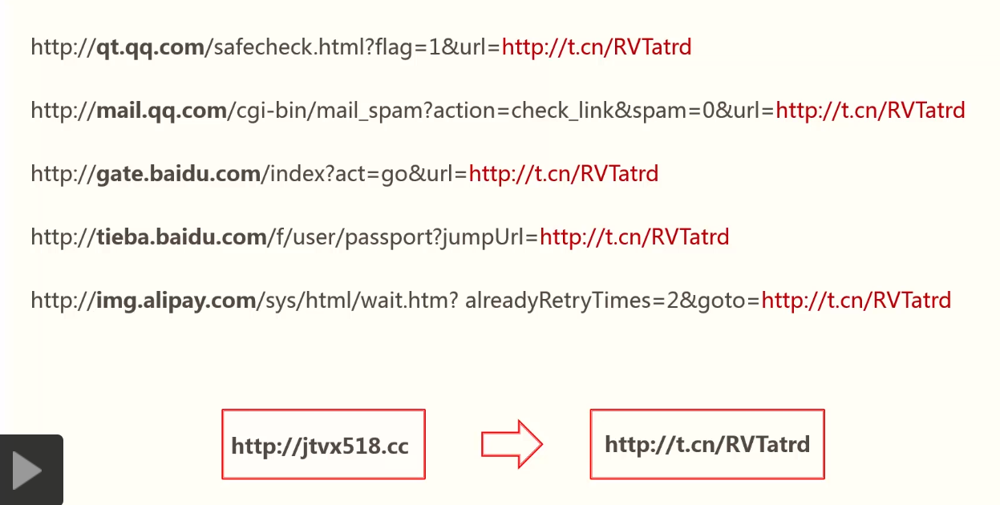

构造短链接

## 命令注入漏洞

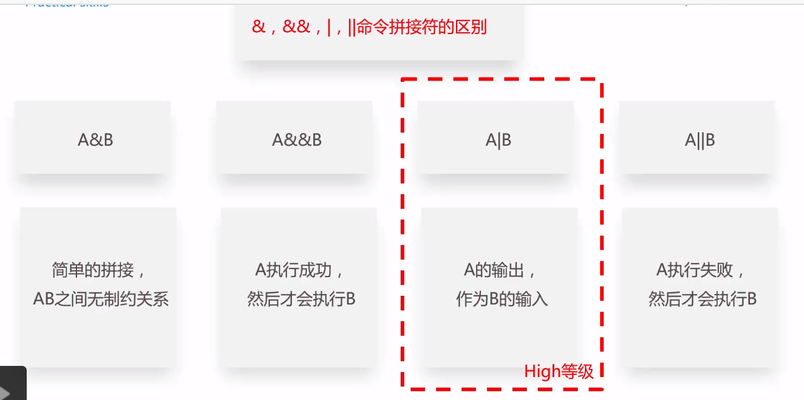

## 文件上传漏洞

必要条件：

④：可利用本地文件包含漏洞

●服务器端检测绕过：

MIME类型检测绕过

※MIME(Multipurpose Internet Mail Extensions)是描述消息内容类型的因特网标准。

MIME消息能包含文本、图像、音频、视频以及其他应用程序专用的数据

浏览器会自动根据所上传的文件的扩展名，对应到相应的MIME类型上。

方法：修改content type报文即可

文件内容检测绕过：

文件头的起始部分中一般开头标记文件类型，此种直接追加合法文件头即可绕过。

若是使用完整文件结构检测，即

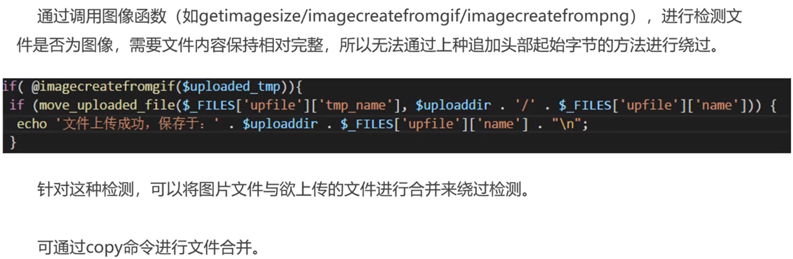

文件内容检测：

直接禁止上传文件的文件夹访问权限：可以使用目录穿越方法。

文件名绕过方法：

白名单绕过技巧

1、0x00 截断绕过

2、解析调用/漏洞绕过

黑名单绕过技巧

1、后缀名大小写绕过

2、名单列表绕过

3、特殊文件名绕过

4、0x00 截断绕过

5、双扩展名解析绕过攻击-基于web服务的解析逻辑 。

6、双扩展名解析绕过攻击-基于web服务的解析方式

※以.asa\\.cer\\.cdx为结尾的文件，同样可以以.asp文件解析

●解析漏洞

①IIS/Nginx+php fastcgi取值错误解析漏洞（配置错误）

②Nginx 文件名逻辑漏洞（CVE-2013-4547）

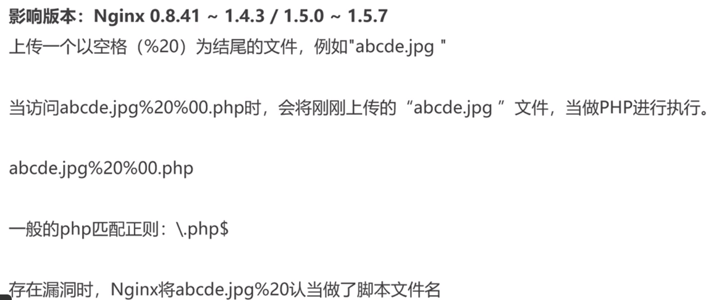

●Apache解析漏洞（配置错误）

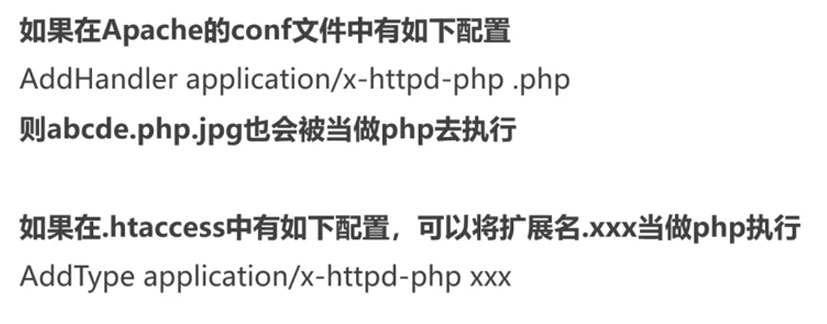

●IIS 5.x/6.0解析漏洞

●高级利用

①重绘图

②phpinfo与本地文件包含的利用

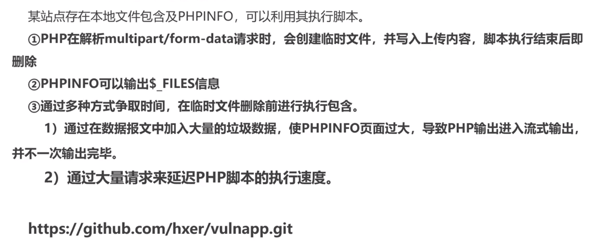

③在线解压缩利用

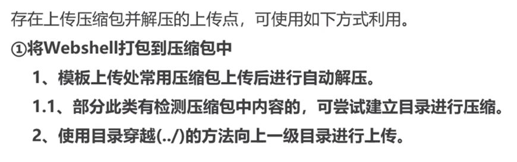

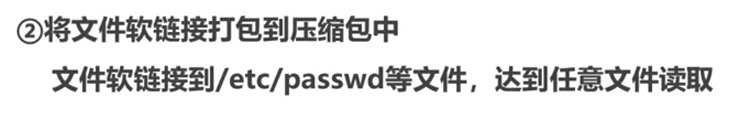

文件软链接即快捷方式

**防御：**

过程

## SQL注入

爆破步骤：

①判断是否存在sql漏洞

database() 得到库名

利用information_schema库找到库的所有表名

select table_name from information_schema.tables where table_schema=database()

得到表名后继续利用其查询列名

select column_name from information_shema.columns where table_name='要查的表名'

●SQLmap

\-u: 对指定网站进行全自动（参数已设定好）傻瓜式注入检测

确定注入点后，进行数据注出：

\--dbs：列出目标网站数据库

\--current-db：列出当前数据库

\-D (dbname)：指定数据库名称

\--tables: 列出某数据库上的所有表

\-T tablename:指定某数据表名称

\--columns:列出指定表上的所有列

\-C Cnmme:指定列名

\--dump:导出列里面的字段

可以-D xxx -T xxx -C id,username,password指定多个字段 然后接—dump导出字段

# 数据库

●sql注入查询

union select…

user（）用户名

database（）数据库名

@@version 数据库版本

@@datadir 数据库位置？

# WEB服务器

## Apache

●Apache .htaccess 需要有.才能生效
