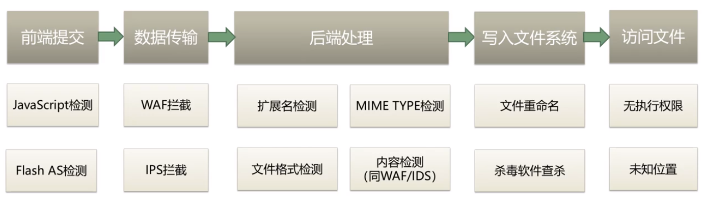

目录

[基础知识](#_Toc5903884)

[漏洞利用](#_Toc5903885)

[●Cross Site Script (XSS)](#_Toc5903886)

[●CSRF漏洞 （客户端漏洞）](#_Toc5903887)

[●点击劫持漏洞](#_Toc5903888)

[●URL跳转漏洞 （客户端漏洞）](#_Toc5903889)

[●命令注入漏洞](#_Toc5903890)

[●文件上传漏洞](#_Toc5903891)

[●SQL注入](#_Toc5903892)

[数据库](#_Toc5903893)

[HTML](#_Toc5903894)

[PHP](#_Toc5903895)

**基础知识**

●CMS是Content Management System的缩写，意为"内容管理系统"。

**●**超文本传输协议（HTTP，HyperText Transfer Protocol)

●FTP（File Transfer Protocol，文件传输协议） 是 TCP/IP 协议组中的协议之一。FTP协议包括两个组成部分，其一为FTP服务器，其二为FTP客户端。其中FTP服务器用来存储文件，用户可以使用FTP客户端通过FTP协议访问位于FTP服务器上的资源。在开发网站的时候，通常利用FTP协议把网页或程序传到Web服务器上。此外，由于FTP传输效率非常高，在网络上传输大的文件时，一般也采用该协议。

默认情况下FTP协议使用TCP端口中的 20和21这两个端口，其中20用于传输数据，21用于传输控制信息。但是，是否使用20作为传输数据的端口与FTP使用的传输模式有关，如果采用主动模式，那么数据传输端口就是20；如果采用被动模式，则具体最终使用哪个端口要服务器端和客户端协商决定。

●File协议：

中文意思：本地文件传输协议

什么是File：File协议主要用于访问本地计算机中的文件，就如同在Windows资源管理器中打开文件一样。

如何使用File：要使用File协议，基本的格式如下：file:///文件路径，比如要打开F盘flash文件夹中的1.swf文件，那么可以在资源管理器或浏览器地址栏中输入：file:///f:/flash/1.swf回车。

为什么是三个”///”: 因为URL的结构是**schema**(底层协议，如http, https, ftp)**://host**(服务器域名或者ip地址)**[:port\#]**(服务器端口) 因为文件没有host 所以省略了。

●URL Uniform Resource Locator (统一资源定位符) 相当于买东西的时候的地址

**schema**(底层协议，如http, https, ftp)**://host**(服务器域名或者ip地址)**[:port\#]**(服务器端口，HTTP默认端口是80（可省略），其他端口要指明)**/path/…/**(访问资源的路径)**[?query-string]**(发送给http服务器的数据)**[\#anchor]**（锚，定位到位置）

例:

http:// dun.163.com /sj/test/test.jsp ?name=sviergn&x=true \#stuff

●HTTP Referer：告知服务器该请求的来源（浏览器自动加上）

可判断来源是否合法：防止盗链等

●Set-Cookie: WEB服务器向浏览器颁发凭证（登陆成功后等）

●HTTP有两种常用的方法，一种是GET ：从指定的资源请求数据，另一种是POST：向指定的资源提交要被处理的数据。

●HTTP响应包括数字状态码，状态码301和302都是代表网页跳转的意思。

●HTML标签不区分大小写

●DOM（Document Object Model ，文档对象模型）连接web的页面和编程语言，一种独立于语言，用于操作xml，html文档的应用编程接口。<https://www.cnblogs.com/Ry-yuan/p/6918155.html>

●BOM（Browser Object Model）连接浏览器和编程语言，即浏览器对象模型。

BOM提供了独立于内容 而与浏览器窗口进行交互的对象；<https://www.cnblogs.com/2010master/p/5824215.html>

●web服务端架构：web服务器、语言解释器（解析PHP语言）、数据库

Windows server: IIS + ASP(.NET) + SQL Server (.NET)

Linux: Apache + PHP + MySQL (LAMP)

UNIX/Windows: Tomcat + JSP + Oracle (J2EE)

(并非固定搭配，可灵活组合)

ps：可通过index文件类型判断是什么脚本语言编写的。有.asp、.aspx、.jsp、.php等

●SQL 语法 （对大小写不敏感）

分号作为语句的结束，程序会自动补充

创建数据库 **CREATE（创建）** *DATABASE(数据库)* websecurity（名称）

●PHP

GET请求会将发送的数据显示在URL中，而POST请求不会

●html乱码

在HTML文件头中增加下面代码：

\<meta http-equiv="Content-Type" content="text/html; charset=utf-8" /\>

●搜索引擎语法

①Intitle:keyword 标题中包含有关键词的网页

②Intext:keyword 正文中含有关键词

③Site:domain 再某个域名和子域名下的网页

④Filetype搜索范围限定在指定文档格式中

查询词用Filetype语法可以限定查询词出现在指定的文档中，支持文档格式有pdf，doc， xls，ppt，rtf,all(所有上面的文档格式)。对于找文档资料相当有帮助。

例子：photoshop实用技巧 filetype:doc

●Webshell (web后门木马) 可执行环境

可获取服务器上的各种权限 有asp/php/jsp多种。

●本地主机

(Internet Protocol version 4)ipv4: 127.0.0.1

ipv6: [ : : 1]

localhost

**漏洞利用**

●Cross Site Script (XSS)

跨站脚本

危害：盗取用户信息、钓鱼、制造蠕虫；

概念：（前端注入）“HTML注入”篡改网页，插入了恶意脚本，当用户在浏览网页时，实现控制用户浏览器行为的一种攻击方式。

类型：

●存储型

访问网站，触发XSS

●反射型

访问携带XSS脚本的链接 触发XSS

（后端应用程序将xss写入到响应页面中）

●DOM型

访问携带XSS脚本的链接 触发XSS

可以通过URL的hash来携带XSS脚本内容，以绕过web后端应用程序的XSS过滤器

（通过前端javascript将xss脚本写入到DOM中）

●CSRF漏洞 （客户端漏洞）

全称：Cross-site request forgery

中文：跨站请求伪造

危害：执行恶意操作（“被转账”、“被发表垃圾评论”）

制造蠕虫

概念：利用用户已登陆的身份，在用户毫不知情的情况下，以用户的名义完成非法操作。比如用户访问了银行网站A后未退出，cookie还在，接着访问了黑客网站B，B发出了一个银行转账链接的请求（可以通过img标签、frame表单等构造出）让浏览器去访问这个A网站的API，然后浏览器会带着cookie去访问…

防御可以在表单等页面加上随机值，然后判断。当然最好的还是使用验证码等方式。

技巧：攻击页面使用iframe表单，长宽设置为0，因为恶意转账页面是通过form表单提交的，会有明显的页面跳转，因此这样设置可以提高隐蔽性

●点击劫持漏洞

覆盖不可见的框架iframe，诱惑、引导用户进行点击，隐蔽的进行操作

●URL跳转漏洞 （客户端漏洞）

●Header头跳转

1\. \$url = \$_REQUEST[“url”]; request方法获取用户链接

2\. header(“Location: \$url”); 进行跳转

●Javascript跳转

1.var site = getQueryString(“site”);获取用户请求链接

2.使用window.location.herf = site;进行跳转

●meta跳转

content设置延时

●其他跳转

构造短链接

●命令注入漏洞

**●文件上传漏洞**

必要条件：

④：可利用本地文件包含漏洞

●服务器端检测绕过：

MIME类型检测绕过

※MIME(Multipurpose Internet Mail Extensions)是描述消息内容类型的因特网标准。

MIME消息能包含文本、图像、音频、视频以及其他应用程序专用的数据

浏览器会自动根据所上传的文件的扩展名，对应到相应的MIME类型上。

方法：修改content type报文即可

文件内容检测绕过：

文件头的起始部分中一般开头标记文件类型，此种直接追加合法文件头即可绕过。

若是使用完整文件结构检测，即

文件内容检测：

直接禁止上传文件的文件夹访问权限：可以使用目录穿越方法。

文件名绕过方法：

白名单绕过技巧

1、0x00 截断绕过

2、解析调用/漏洞绕过

黑名单绕过技巧

1、后缀名大小写绕过

2、名单列表绕过

3、特殊文件名绕过

4、0x00 截断绕过

5、双扩展名解析绕过攻击-基于web服务的解析逻辑 。

6、双扩展名解析绕过攻击-基于web服务的解析方式

※以.asa\\.cer\\.cdx为结尾的文件，同样可以以.asp文件解析

●解析漏洞

①IIS/Nginx+php fastcgi取值错误解析漏洞（配置错误）

②Nginx 文件名逻辑漏洞（CVE-2013-4547）

●Apache解析漏洞（配置错误）

●IIS 5.x/6.0解析漏洞

●高级利用

①重绘图

②phpinfo与本地文件包含的利用

③在线解压缩利用

文件软链接即快捷方式

**防御：**

过程

**●SQL注入**

爆破步骤：

①判断是否存在sql漏洞

database() 得到库名

利用information_schema库找到库的所有表名

select table_name from information_schema.tables where table_schema=database()

得到表名后继续利用其查询列名

select column_name from information_shema.columns where table_name='要查的表名'

●SQLmap

\-u: 对指定网站进行全自动（参数已设定好）傻瓜式注入检测

确定注入点后，进行数据注出：

\--dbs：列出目标网站数据库

\--current-db：列出当前数据库

\-D (dbname)：指定数据库名称

\--tables: 列出某数据库上的所有表

\-T tablename:指定某数据表名称

\--columns:列出指定表上的所有列

\-C Cnmme:指定列名

\--dump:导出列里面的字段

可以-D xxx -T xxx -C id,username,password指定多个字段 然后接—dump导出字段

**数据库**

●注释

●sql注入查询

union select…

user（）用户名

database（）数据库名

@@version 数据库版本

@@datadir 数据库位置？

●"@"是:局部变量声明，如果没有"@"的字段代表是列名；

eg：

声明变量： declare @name varchar(8)

赋值： set @name= '张三'

查询： select \* from stuInfo where stuName = @name

由set 和 select 进行赋值；

select一般用于查询数据，然后再赋值变量。

还有@@error 等是全局变量，系统自定义的，我们只读，不能改！！

●order by …可以通过其+二分法来得到字段长度（就表格上面那行属性有多少种）

order by 1就是用表中第一个字段来进行默认的升序排序（asc是升序的意思 默认可以不写 desc是降序 ）

order by〖以某个字段排序]

order by a,b ——a和b都是升序

order by a,b desc ——a升序，b降序

order by a desc，b ——a降序，b升序

order by a desc，b desc ——a，b都是降序

**●建立数据库【结构】**

Mysql

要考虑id自增（AUTO_INCREMENT）、PRIMARY KEY、COMMENT（注释）

常见的mysql表引擎有INNODB和MyISAM，主要的区别是INNODB适合频繁写[数据库](http://www.111cn.net/database/database.html)操作，MyISAM适合读取数据库的情况多一点

使用以下mysql sql语句，可以给表设定数据库引擎：

ALTER TABLE \`wp_posts\` ENGINE = MyISAM;

●外键

Company_table中假设有

foreign key(repo_id) references repo_table(repo_id))

repo_id在repo表中是主键，在company表中是外键

约束作用：

1.  如果在company中插入repo_id而repo表中没有，则数据库不允许插入
2.  如果修改/删除repo表中的id而company还在引用，则修改/删除失败

**●索引**

索引的好处在于可以讲指定列进行排序，提高检索的速度。

一个简单的例子：

某个列的数据是

id name

12 小李

10 小龙

5 小青

99 小红

id列创建索引后就会生成一个索引表

id index

5 3

10 2

12 1

99 4

当查询 where id =10的 时候，使用到索引表。由于10下面是15，不可能有大于10的数。所以不再进行扫描表操作。返回第二条数据，对应回主表的第二行。

这样就提高了查询的速度，如果没添加索引；则扫描整张主表。

注意事项：

1、需要加索引的字段，要在where条件中

2、数据量少的字段不需要加索引；因为建索引有一定开销，如果数据量小则没必要建索引（速度反而慢）

3、如果where条件中是OR关系，加索引不起作用

4、联合索引比对每个列分别建索引更有优势，因为索引建立得越多就越占磁盘空间，在更新数据的时候速度会更慢。另外建立多列索引时，顺序也是需要注意的

联合索引：

<https://www.cnblogs.com/musings/p/10890563.html>

**HTML**

●**标记**

\<hr/\> 分行符号

**●注释**

**HTML注释：**

\<!--这是单行注释--\>

\<!--

这是多行注释

这是多行注释

这是多行注释

\--\>

**JS/jQuery注释：**

//这是单行注释

/\*

这是多行注释

这是多行注释

这是多行注释

\*/

**css注释：**

/\*这是单行注释\*/

/\*

这是多行注释

这是多行注释

这是多行注释

\*/

**●form表单**

●一般POST表单传值属性及类型：

\<form method = “POST” action=”xx.php”\>

\<input type = “text” name = “username” value = “”/\>

\<input type = “password” value = “”/\> 由于没有name属性，因此不会被浏览器接收

\<input type = “submit” name = “sub” value = “submit”/\> 这里虽然type是submit，但由于有name、value属性，所以后端\$_POST数组内会接收到\$_POST[“sub”]

\</form\>

●复选框

（type = checkbox）多选

\<form method = “POST” action=”xx.php”\>

\<input type = “checkbox” name = “hobby” value = “basketball”\>basketball

\<input type = “checkbox” name = “hobby” value = “football”\> football

\<input type = “checkbox” name = “hobby” value = “pingpang”\> pingpang

这会产生重名，若不处理，则会覆盖，后台无法接受全

因此要改成

\<input type = “checkbox” name = “hobby[ ]” value = “basketball”\>basketball

这样php会自动组合同名元素为数组

\<input type = “submit” name = “sub” value = “submit”/\>

\</form\>

（type = radio）单选

\<form method = “POST” action=”xx.php”\>

\<input type = “radio” name = “gender” value = “1” checked=”checked” 默认选中，防止被漏选/\>男

\<input type = “radio” name = “gender” value = “2”/\>女

\<input type = “submit” name = “sub” value = “submit”/\>

\</form\>

**PHP**

if、switch、while等大括号也可以类似的替代。

●**常用系统函数**

<https://www.bilibili.com/video/av12863134/?p=54> 其他的见这里

●**文件包含**

require

和include几乎完全一样，除了处理失败的方式不同之外，require在出错时候产生E_COMPILE_ERROR级别的错误，即导致脚本终止，而include只产生警告E_WARNING，脚本会继续执行

include

require_once

include_once 只包含一次（相同的文件只加载一次，用于多重包含时）

●**预定义变量**

提前定义的变量，系统定义的变量，存储许多需要用到的数据（都是数组），也被称为超级全局变量

\$_GET：获取所有表单以get方式提交的数据

\$_POST：POST提交的数据都会保存于此

\$_REQUEST：GET和POST提交的都会保存于此，合并了两个数组，但如果GET、POST重名，则POST会覆盖GET（PHP数组元素下标具有唯一性）（可在php.ini进行配置）

\$GLOBALS：PHP中所有的全局变量，数组下标为变量名。每个全局变量都会自动被存储到 此数组中

\$_SERVER：服务器信息

\$_SESSION：session会话数据

服务端session的操作

使用session前一定要session_start()启动session

储存session：\$_SESSION["name"]="King";//数组操作

销毁session：unset(\$_SESSION["name"]);//销毁一个

session_destroy()和unset(\$_SESSION);//销毁所有的session

\$_COOKIE：cookie会话数据

浏览器cookie的操作

设置cookie:setcookie(name, value, expire, path, domain);

获取cookie：\$_COOKIE["user"];

删除cookie：setcookie("user", "", time()-3600);//设置过期时间

\$_ENV：获取服务器端环境变量的数组

\$_FILES：获取用户上传的文件信息

●**可变变量**

如果一个变量保存的值恰好是另一个变量的名字，那么可以直接通过访问这个变量得到另一个变量的值，只需在变量前多加一个\$符号

\$a=’b’;

\$b=’hello’;

则\$\$a=’hello’;

**●引用传递**

\$a = &\$b;//取地址符号&

**●常量**

定义形式：

① 使用定义常量的函数：define(‘常量名’,常量值)；

② (5.3之后才有) const 常量名 = 值；

常量名不需要用\$，通常以大写字母为主

若用特殊符号也可以定义，需要用define，但是这样定义之不能直接访问，要用constant(“常量名”)。

两种方法在于访问权限有区别

常量不区分大小写。但是define函数有第三个参数拥有大小写敏感的设置。

**●系统常量**

系统帮助用户定义的常量，用户可以直接使用

PHP_VERSION

PHP_INT_SIZE

PHP_INT_MAX

在PHP中还有一些特殊的常量，他们有双下划线开始+常量名+双下划线结束，这种常量称之为系统魔术常量：其值通常会跟着环境变化，用户无法修改。

\__DIR_\_ 当前被执行的脚本所在电脑的绝对路径

\__FILE_\_ 当前被执行的脚本所在电脑的绝对路径（带自己文件名字）

\__LINE_\_ 当前所属行数

\__NAMESPACE_\_ 当前所属命名空间

\__CLASS_\_ 当前所属的类

\__METHOD_\_ 当前所属的方法

\__FUNCTION_\_ 常量返回该函数被定义时的名字

**●数据类型**

PHP是一种弱类型语言，变量本身没有数据类型

有八种数据类型

简单（基本数据类型）：4小类

整型 int/integer

浮点型 float/double

字符串型 string

布尔类型 bool/boolean

复合数据类型：2个小类

对象类型：object,存放对象

数组类型：array

特殊数据类型：2个小类

资源类型：resource，存放资源数据（PHP外部数据，如数据库、文件）

空类型：NULL

**●类型转换**

有两种类型转换方式

1.自动转换：系统根据需求自己判定，自己转换

2.强制（手动）转换

其他类型转布尔类型：

empty（）函数：判断数据值是否为空（不是NULL，是字符串为空或0之类），若是返回true，反之false

isset（）函数：用来判断变量是否声明，即是否存在，存在为true，反之false。（※var \$x也只能算未定义）

其他类型转数值类型：

① bool：true=1 false=0

② 字符串转数值类型

以字母开头的字符串，永远为零

以数字开头的字符串，取到碰到字符为止（不会同时包含两个小数点）

强制转换：

在变量之前增加括号，在其中写上对应类型

**●类型判断**

通过一组类型判断函数，来判断变量，最终返回这个变量所保存数据的数据类型。是一组以is_开头后面跟类型名字的函数，返回值为布尔类型，用于确定获取的数据是否**安全**。

※布尔类型不能用echo来查看，可以使用var_dump结构查看

该函数用于打印显示，一个变量的内容与结构，以及类型的信息。

var_dump(变量1，变量2…)

还有一组函数可以用来获取以及设定数据（变量）的类型

Gettype(变量名)，获取类型，得到的是该类型对应的字符串

Settype(变量名) 设定数据类型，与强制转换不同

※强制转换，是对数据值复制的内容进行处理，不会处理实际存储的内容。（即一种临时转换）而settype会真正改变，值和强制转换一样。

**●运算符**

基本与C++/java等语言类似

特殊：

①比较运算符

=== ：全等于，左边与右边相同，大小以及数据的类型都要相同。

!== ：不全等于，只要大小或类型不同则为true

②连接运算符：

. （一个点）：将两个字符串连接在一起

.= ：复合运算，将左边的内容与右边的内容连接起来，然后重新赋值给左边的变量，类似于+=、-=

③错误抑制符

在php中有一些错误可以提前预知，但这些错误可能无法避免，但是又不希望报错给用户看。

@：在可能出错的表达式前使用@符号即可（若是分散的表达式要用括号括起来）

通常在生产环境（上线）会用到

**●文件加载路径**

绝对路径 略

相对路径

. 或 ./ ：表示当前文件夹 一般可以不用，例如include就默认当前文件夹本身

../ ：上级目录

绝对路径和相对路径的加载区别：

绝对路径相对效率偏低，但安全。

文件嵌套包含时，最容易出现相对路径出错的问题

**●函数**

function 函数名(参数)

先编译后执行，所以函数定义可以放在后面

return也可以在文件中直接使用（不在函数里面），代表文件将return的内容转交给包含当前文件的位置（通常在系统配置文件中使用较多），在文件中也代表不再执行后面的内容。此时include等函数返回值即return的内容。

函数作用域

全局变量：这与C等语言不同，它不能被函数直接访问。

局部变量：函数里等定义的变量。

超全局变量：系统定义的变量，在函数内外都可以被访问（预定义变量：\$_SERVER、\$_POST等）

要让函数内部能够访问全局变量，可以通过超全局变量 \$GLOBALS访问

另外一种方法是用global关键字

global \$变量名；//注意不可以赋值，只能声明。若是在函数体内，则去寻找全局变量是否拥有同名变量，若有直接引用。若无则重新创建。

●静态变量

函数内可以用static 关键字。与其他语言类似。略。

●可变函数

当前有一个变量所保存的值刚好是一个函数的名字，那么就可以使用变量+（）来充当函数使用。

\$变量 = ‘display’；

function display(){}

//则可以这样使用

\$变量();

因此可以实现回调函数

●匿名函数

基本函语法：

\$变量 = function() {

//函数体

}; //注意有分号

变量保存匿名函数，本质得到的是一个对象（closure）

闭包… 暂时用不上 用上再了解吧。

●错误

可人为触发错误提示

triger_error();

73P

**●数组**

●常用函数

imlode(数组, ‘分隔符’)

**●表单传值**

方式：

●GET传值

①form表单

\<form method = ‘GET’\>表单元素\</form\>

②a标签

\<a href=”www.xx.cn/index.php?data=xx”\>

③location对象的href属性

\<script\>location.href=”www.xx.cn/index.php?data=xx”\</script\>

④location 对象的assign方法

\<script\>location.assign(”www.xx.cn/index.php?data=xx”)\</script\>

●POST传值

①基本设定

\<form method=”POST”\>表单元素\</from\>

与GET的区别：

接收：

\$_GET、\$_POST、\$_REQUEST三种方式，其都是超全局变量，预定义数组，且其表单元素的”name“属性的值作为数组的下标，而value属性对应的值就是数组的元素值

细节：

如果没有选复选框，后端没有接收到数组，则引用会导致出错，得用isset()判断是否存在（可利用三目运算符）。
