# 四层模型

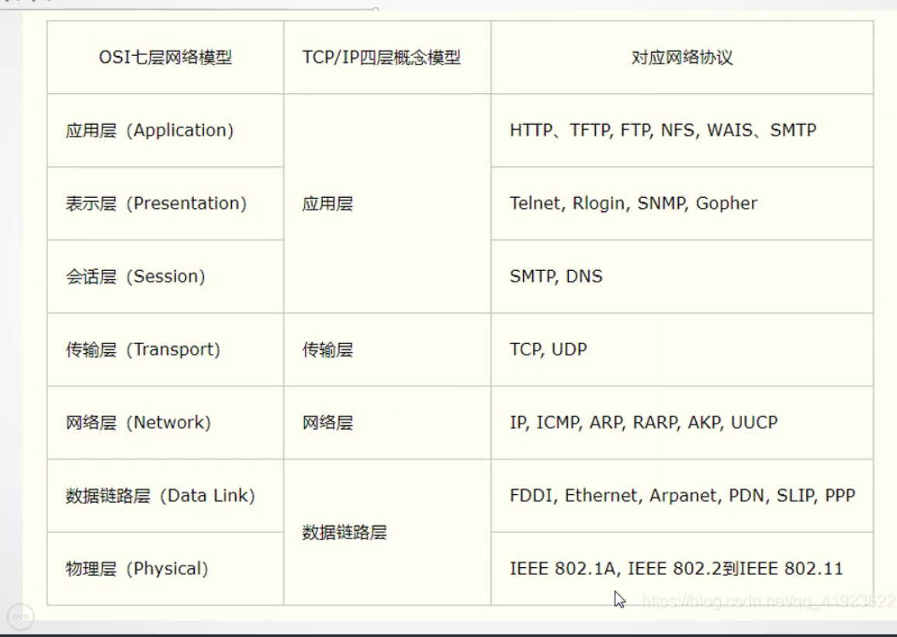

# OSI模型（七层模型）

开放式系统互联模型（Open System Interconnection Model），该模型将通信系统中的数据流划分为七个层，从分布式应用程序数据的最高层表示到跨通信介质传输数据的物理实现。

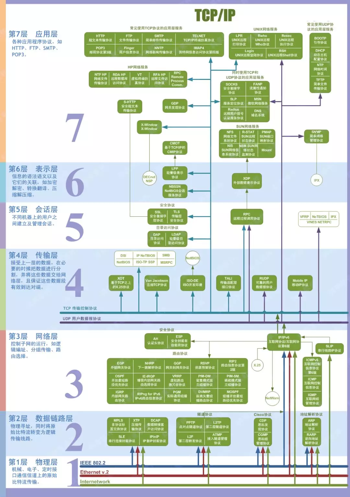

实际应用过程中，五层协议结构里面是没有表示层和会话层的。应该说它们和应用层合并了。

分层为了简化网络操作，提供设备间兼容性和标准接口，促进标准化工作，结构上可以分隔，易于实现和维护。

数据从应用层`[Data] => [H[Data]] => [H[H[Data]]]`每层进行包头的添加，然后相应的从下往上解包

# 物理层（第一层）

激活、维持、关闭通信端点之间的机械特性、电气特性、功能特性以及过程特性。该层为上层协议提供了一个传输数据的可靠的物理媒体。简单的说，物理层确保原始的数据可在各种物理媒体上传输。
## 设备

### 集线器（Hub）

> 集线器现在已被淘汰，多使用二层交换机代替设备连接。

`Hub`是“中心”的意思，集线器的主要功能是对接收到的信号进行再生整形放大，以扩大网络的传输距离，同时把所有节点集中在以它为中心的节点上。集线器与网卡、网线等传输介质一样，属于局域网中的基础设备，采用`CSMA/CD`（即带冲突检测的载波监听多路访问技术)介质访问控制机制。集线器每个接口简单的收发比特，收到1就转发1，收到0就转发0，不进行碰撞检测。

集线器（hub）属于纯硬件网络底层设备，基本上不具有类似于交换机的"智能记忆"能力和"学习"能力。它也不具备交换机所具有的MAC地址表，所以它发送数据时都是没有针对性的，而是采用广播方式发送。也就是说当它要向某节点发送数据时，不是直接把数据发送到目的节点，而是把数据包发送到与集线器相连的所有节点，如图所示，简单明了。

HUB是一个多端口的转发器，当以HUB为中心设备时，网络中某条线路产生了故障，并不影响其它线路的工作。所以HUB在局域网中得到了广泛的应用。大多数的时候它用在星型与树型网络拓扑结构中，以RJ45接口与各主机相连（也有BNC接口），HUB按照不同的说法有很多种类。

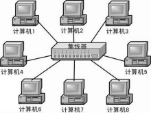

#### 工作过程

首先是节点发信号到线路，集线器接收该信号，因信号在电缆传输中有衰减，集线器接收信号后将衰减的信号整形放大，最后集线器将放大的信号广播转发给其他所有端口。

# 数据链路层（第二层）

最基本的服务是将源自网络层的数据可靠地传输到相邻节点的目标机网络层。
功能：物理地址寻址、数据的成帧、流量控制、数据的检错、重发等。
基本数据单位：帧
主要网络协议：以太网协议
设备：网桥、二层交换机
## 设备

### 交换机（Switch）

用于同一个网络下的连接互通，以及接入端口扩展。

交换机内部的`CPU`会在每个端口成功连接时，通过将`MAC`地址和端口对应，形成一张`MAC`表。在今后的通讯中，发往该`MAC`地址的数据包将仅送往其对应的端口，而不是所有的端口。

交换机在操作过程当中会不断的收集资料去建立它本身的一个地址表，这个表相当简单，它说明了某个`MAC`地址是在哪个端口上被发现的，所以当交换机收到一个`TCP/IP` 封包时，它便会查看该数据包的目的`MAC`地址，核对自己的地址表以确认应该从哪个端口把数据包发出去。由于这个过程比较简单，加上这功能由一崭新硬件进行——`ASIC`，因此速度相当快。一般只需几十微秒，交换机便可决定一个`IP`封包该往哪里送。

如果目的地`MAC`地址不能在地址表中找到时，交换机会把`IP` 封包“扩散”出去，即把它从每一个端口中送出去，就如交换机在处理一个收到的广播封包时一样。

# 网络层（第三层）

对子网间的数据包进行路由选择。

民航通信网TDM承载网工作在这层

## 设备

### 路由器

交换机适合局域网内互联，路由器适合局域网与互联网等其他网互联。

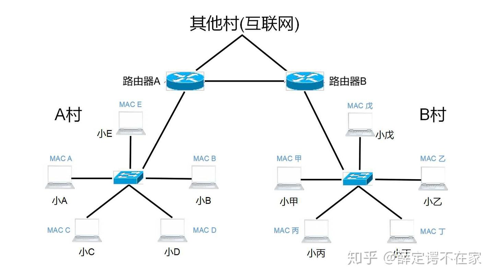

### 三层交换机

交换机一般都是指二层交换机，基本功能是交换。而三层交换机是指工作在第三层的交换机，比二层交换机多了路由转发功能。对于存在`VLAN`的硬件拓扑上，可以替代路由器。

不同`VLAN`间不能直接通信 因为不在同一个广播域 就相当于两个不同的网段 本身这种情况下要用路由器来让两个网段的设备通信的对吧？但这不是两个`LAN` 而是两个`VLAN`啊 两个`LAN`的话路由器接两个物理`LAN`口 配个路由表就能通了 `VLAN`可能俩`VLAN`在一个物理`LAN`口上 这怎么配路由？所以啦三层交换机就诞生了 三层交换机设置了虚拟`LAN`口 专门给`VLAN`用 这就保证了`VLAN`间的通信 所以路由的作用是让`LAN`之间通信 三层交换机是让`VLAN`间互相通信

其实也不是说路由器不能让`VLAN`间通信 也是可以的 比如用单臂路由就可以实现 但是成本高啊 容易单点故障啊 而且路由物理接口多贵啊！

所以随着发展 三层交换机和路由器基本功能上虽然一致 侧重点却产生很大变化 三层交换多用于企业内部`VLAN`间互通 有很大背板带宽 这样成本低 而路由多用于与外网对接 有`gb`级别的接口 有`vpn` 路由重分发 部分防火墙功能等等

## 协议

### X.25

### IP (Internet Protocol) 网际协议

又称互联网协议，是用于分组交换数据网络的协议。

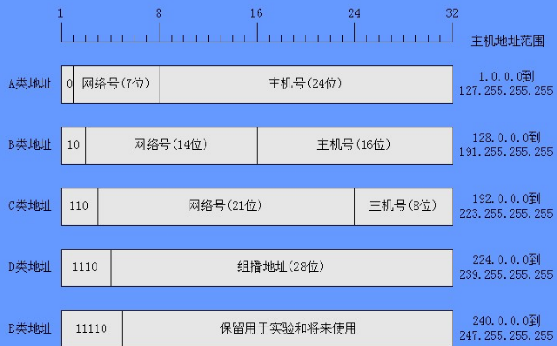

IP数据报由header和data组成

最大传输单元（Maximum Transmission Unit，MTU），当路由器设定MTU小于IP数据报值时，进行分片。

TTL（Time to live），每经过一次路由器，TTL值减一，0时丢弃
#### 留用地址
以下是留用的内部私有地址：
A类 `10.0.0.0–10.255.255.255`
B类 `172.16.0.0–172.31.255.255`
C类 `192.168.0.0–192.168.255.255`
#### 子网掩码

为了区分自己与自己的通信、与广播域主机通信、与别的广播域主机通信这三种情况，网络掩码和IP地址如影随形。

格式诸如1.1.1.1/8

IP地址/网络掩码二进制位长度

192.168.1.0/26，就可以

#### 子协议

**ARP（Address Resolution Protocol）地址解析协议**

主机发送信息时将包含目标IP地址的ARP请求广播到局域网络上的所有主机，并接收返回消息，以此确定目标的物理地址

arp -a看ARP缓存

**ICMP（Internet Control Message Protocol）控制报文协议**

控制消息是指网络通不通、主机是否可达、路由是否可用等网络本身的消息。

# 传输层（第四层）

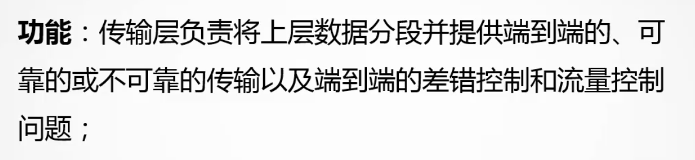

传输层的数据单元叫segment

### TCP协议（Transmission Control Protocol，传输控制协议）

TCP是是一种面向连接的、可靠的、基于字节流的传输层通信协议，主要是为了解决数据如何网络中的传输，定义的协议内容（报文）都是为了双方能够建立可靠的TCP连接，然后进行数据传输。

但是TCP具体内容是二进制的，显然二进制对上层的应用开发极不友好，所以面向应用层的开发又产生了HTTP协议。

HTTP 是**应用层**协议，主要解决如何包装数据（文本信息），意思是，TCP等传输层协议中的具体要传输的数据是二进制，然后HTTP协议将该数据包装成了人看得懂的内容，这也方便了开发。HTTP要求传输层协议建立的是可靠连接，所以基本是建立的TCP连接，如果使用应用层使用HTTP格式而传输层选用UDP，那么就会乱套。

至于SOCKET（套接字），实际上是一种接口，是对传输层协议操作抽象出来的接口，如果要分别对TCP、UDP等等进行开发，那显然十分麻烦，这就是编程的一种抽象思想。socket提供最基本的函数接口，比如create、listen、connect、accept、send、read和write等等。

#### TCP数据包结构

##### Sequence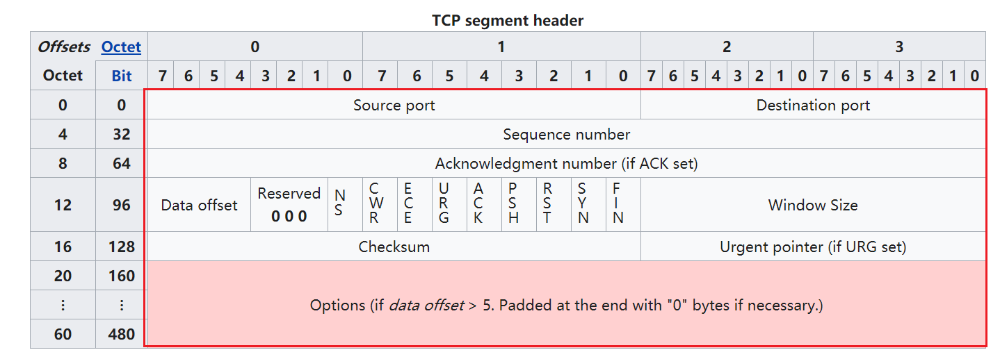 number（seq）序列号

用于确定包的顺序，且可以防止漏传错传重复传等。

序列号初始值（ISN，initial sequence number）是随机的

序列号不从0开始可以有很多好处，除了安全外，可以防止把旧包也当做新包的情况：

客户端发送了序列号1-10个包，结果服务端暂时都没收到，客户端以为连接断了，就重新建立连接，从0号包发起，结果0号发到的时候，后面10个包又到了，然后服务端就当做是新包来处理了。The purpose in these sequence numbers is to prevent packets that get delayed in the network from being delivered later and then misinterpreted as part of an existing connection

#### 当sequence发生回绕

如果32位的sequence超过了最大32位长度，加1后变成0后（称发生“回绕”），这时候也不必担心，算法中可以这也解决它的顺序：直接用后来的包序号减去前面的包，然后去掉符号位即可判断是否顺序正确。

假设sequence只有4位，然后现在发到了15号包，下一个包是0号，直接用0-15，如果拿去符号位，结果是1（15号包的补码是1111取反+1，即1 0001，然后加到0号包（相当于相减），去掉符号位，结果为1）

### UDP协议（User Datagram Protocol，用户数据包协议）

UDP协议是面向无连接的，即不会有什么三次握手四次挥手，它不管你会不会收到，不管连接是否没问题。所以UDP是一种不可靠连接，但是速度快（因为比如客户端发送消息给服务端，客户端默认服务端收到，且服务端不会发送确认报文给客户端说收到了）

常用于即时通信系统（IM，Instant Messenger）软件（一般是UDP为主+TCP为辅），当然UDP传到后也可以用算法对数据收发验证、传输控制，但消息顺序可能会因为网络波动而无序。（至于聊天软件如何确定人家收到消息，是收到后手动再发送UDP回执说收到了（如果这个UDP回执弄丢了，就可能造成以为没发出去实际上发出去了的情况））

# 会话层（第五层）

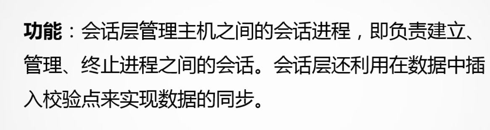

# 表示层（第六层）

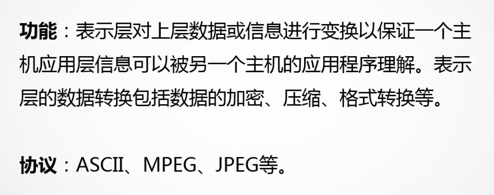

# 应用层（第七层）

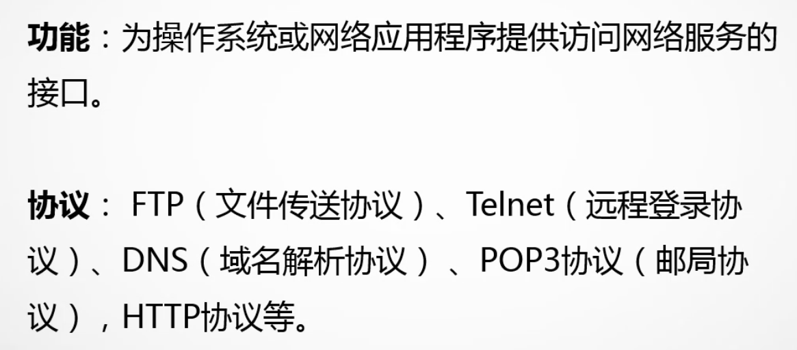

应用层的数据单元叫data

### RPC（Remote Procedure Call，远程方法调用）

实际上RPC是一种设计，实现框架，通讯协议只是其中一部分，它可以采用HTTP协议实现，也可以使用其他协议实现，所以并不能归属到是哪种层次的协议。

RPC的思想基本是为了分布式量身定做的，比如两台服务器，一个应用想调用另一台服务器上应用提供的一个方法，实际上是无法直接调用的，但通过RPC，就可以像写本地方法调用一样调用远程的方法。（远程调用的过程是透明的，你并不知道这个调用的方法是部署在哪里，通过PRC能够解耦服务）

#### 需要解决的问题

**建立通信**：在客户端与服务端建立起数据传输通道，大都是TCP连接（gRPC使用了HTTP2）。

**寻址**：A服务器上的应用需要告诉RPC框架：B服务器地址、端口，调用函数名称。所以必须实现待调用方法到call ID的映射。

**序列化与反序列化**：由于网络协议都是二进制的，所以调用方法的参数在进行传递时首先要序列化成二进制，B服务器收到请求后要再对参数进行反序列化。恢复为内存中的表达方式，找到对应的方法进行本地调用，得到返回值。返回值从B到A的传输仍要经过序列化与反序列化的过程。

比如实现RPC这种设计的谷歌的gRPC框架，有一个.proto数据描述文件，如果离开了它就无法理解传输的二进制流，虽有一定的“加密性”，但可读性差。它相比于json，不需要冗余的符号，且变为二进制后也很好压缩，所以传输效率很快。

## 协议

### DHCP(Dynamic Host Configuration Protocol) 动态主机设置协议

又称动态主机组态协定，是一个用于IP网络的网络协议，位于OSI模型的应用层，使用UDP协议工作，是一种使网络管理员能够集中管理和自动分配IP网络地址的通信协议。在IP网络中，每个连接Internet的设备都需要分配唯一的IP地址。DHCP使网络管理员能从中心结点监控和分配IP地址。当某台计算机移到网络中的其它位置时，能自动收到新的IP地址。

主要有两个用途：

用于内部网或网络服务供应商自动分配IP地址给用户

用于内部网管理员对所有电脑作中央管理

### HTTP(HyperText Transfer Protocol) 超文本传输协议

是一个简单的请求-响应协议，它通常运行在TCP之上（HTTP/2之后，有QUIC协议进行HTTP通信了（基于UDP））。它指定了客户端可能发送给服务器什么样的消息以及得到什么样的响应。请求和响应消息的头以ASCII形式给出；而消息内容则具有一个类似MIME的格式。

### MIME (Multipurpose Internet Mail Extensions) 媒体类型

MIME 类型是一种标准，用来表示文档、文件或字节流的性质和格式。它在IETF RFC 6838中进行了定义和标准化。

主要格式是type/subtype，大小写不敏感。

| 类型        | 描述                                                                 | 典型示例                                                                                                                            |
|-------------|----------------------------------------------------------------------|-------------------------------------------------------------------------------------------------------------------------------------|
| text        | 表明文件是普通文本，理论上是人类可读                                 | text/plain, text/html, text/css, text/javascript                                                                                    |
| image       | 表明是某种图像。不包括视频，但是动态图（比如动态gif）也使用image类型 | image/gif, image/png, image/jpeg, image/bmp, image/webp, image/x-icon, image/vnd.microsoft.icon                                     |
| audio       | 表明是某种音频文件                                                   | audio/midi, audio/mpeg, audio/webm, audio/ogg, audio/wav                                                                            |
| video       | 表明是某种视频文件                                                   | video/webm, video/ogg                                                                                                               |
| application | 表明是某种二进制数据                                                 | application/octet-stream, application/pkcs12, application/vnd.mspowerpoint, application/xhtml+xml, application/xml, application/pdf |

### 版本

HTTP/1.1 可以做到长连接（Persistent Connection）和请求的流水线（Pipelining）处理，在一个TCP连接上可以传送多个HTTP请求和响应，减少了建立和关闭连接的消耗和延迟，在HTTP1.1中默认开启Connection： keep-alive，一定程度上弥补了HTTP1.0每次请求都要创建连接的缺点。

HTTP/2 支持多路复用（Multiplexing），多个请求可以并发执行了

<https://developers.google.com/web/fundamentals/performance/http2>

#### 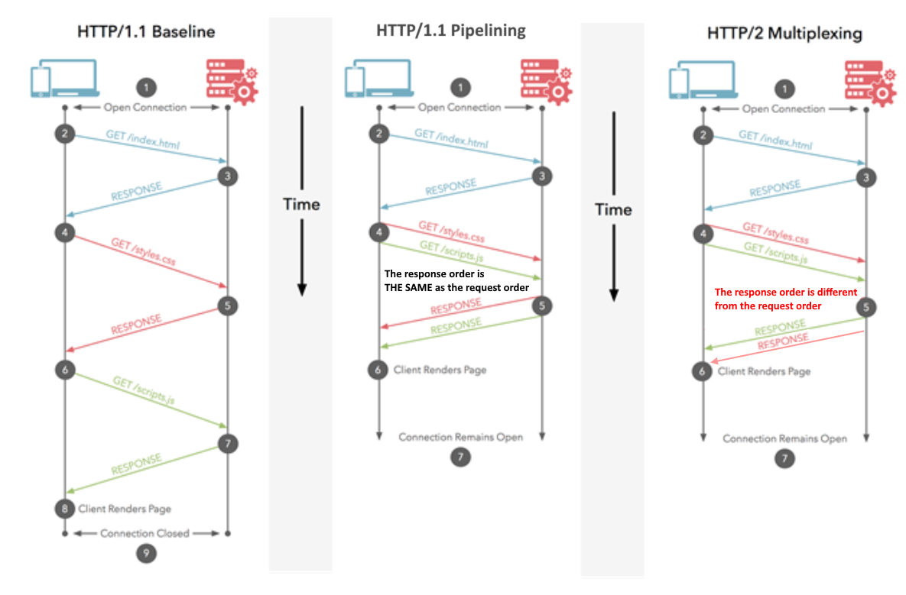请求方法

| 请求方法 | 说明                                                                                                                                                               |
|----------|--------------------------------------------------------------------------------------------------------------------------------------------------------------------|
| GET      | 参数在url上，浏览器长度有限制                                                                                                                                      |
| POST     | 参数不可见，长度不受限制                                                                                                                                           |
| PUT      | 上传最新内容到指定位置                                                                                                                                             |
| DELETE   | 删除请求的url所表示的资源                                                                                                                                          |
| Head     | 不返回相应主体，主要用于客户端查看服务器性能                                                                                                                       |
| Options  | 与head类似，是客户端用于查看服务器的性能 。JavaScript的XMLHttpRequest对象进行CORS跨域资源共享时，就是使用OPTIONS方法发送嗅探请求，以判断是否有对指定资源的访问权限 |
| Connet   | http1.1预留的，将连接方式改为管道方式，通常用于SSL加密服务器的链接与 HTTP非加密的代理服务器之间的通信                                                              |
| trace    | 请求服务器[回显收到的请求信息]主要用于HTTP请求的测试或诊断                                                                                                         |
| patch    | 出现的较晚，用于更新局部的资源，不存在时，会创建一个新的(http1.1之后使用的较多)                                                                                    |

### HTTPS协议

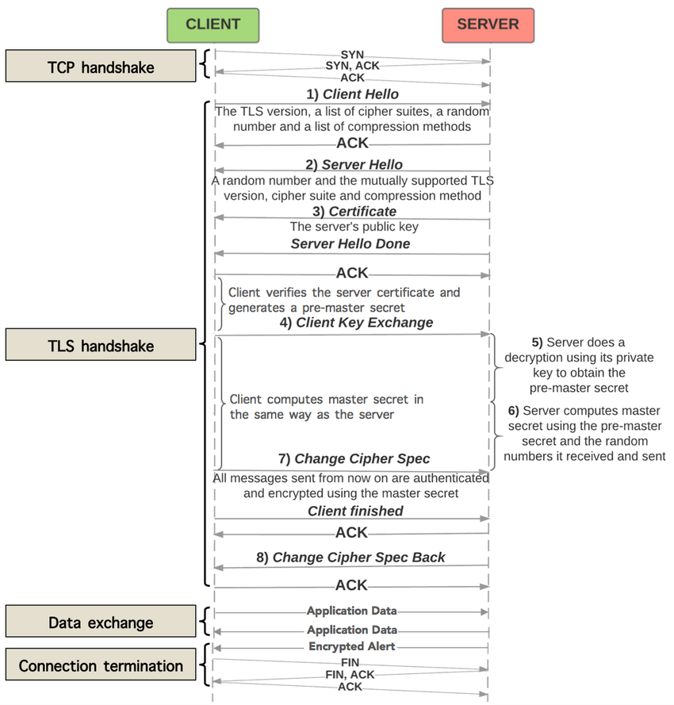

其中pre-master的存在是为了保证选择不同的cipher suites最终获得的对称密钥（master secret）是同一个长度的

<https://crypto.stackexchange.com/questions/24780/what-is-the-purpose-of-pre-master-secret-in-ssl-tls>

事实上HTTPS就是使用TLS协议保护的HTTP通信

学习：

<https://www.zhihu.com/question/302412059>

# 其他

**交换方式**

-   **电路交换(线路交换) Circuit Switching**

常见的电路交换是电话系统

采用线路交换技术的线路一旦接通，就不会发生冲突

-   **报文交换**

存储转发技术（暂存起来验证再转发）

-   **分组交换**

存储转发技术

-   **信元交换**

线路交换+分组交换

是ATM协议的交换技术

## 网络访问协议（介质访问控制方式）

实质上是使得网络中的一个节点能够知道另一个的存在，并且与其建立数据通信的控制规范。

CSMA/CD（Carrier Sense Multiple Access with Collision Detection载波侦听多路访问/冲突检测）、令牌

对局域网的性能具有十分重要的影响

#### IEEE802.5 TokenRing令牌环网

#### IEEE802.4 Token Bus 令牌总线

## 内部网关协议(Interior Gateway Protocol, IGP)

#### OSPF开放最短路径优先(Open Shortest Path First)

是链路状态路由协议，通过路由器之间通告网络接口的状态来建立链路状态数据库，生成最短路径树，每个OSPF路由器使用这些最短路径构造路由

**硬件**

**概念**

-   **信噪比（S/N）**

信噪比，英文名称叫做SNR或S/N（SIGNAL-NOISE RATIO)，又称为讯噪比。是指一个电子设备或者电子系统中信号与噪声的比例。

信号的平均功率和噪声的平均功率之比信噪比10 \* log10(S/N) (dB)，越大证明它产生的噪声越少。

-   **波特与码元**

在信息传输通道中，携带数据信息的信号单元叫码元，单位时间内通过信道传输的码元数称为码元传输速率，简称波特率，其单位是波特（Baud,symbol/s），波特率是传输通道频宽的指标。

-   **比特率**

比特率是bit传输速率，也叫信息速率。

与波特的关系是，需要看信号是几进制的

比如八进制信号，log2(8)=3，一个信号就有3位bit。如果八进制信号的波特率是1200，那么其比特率就是1200\*3=3600bit/s

**Data Terminal Equipment (DTE)数据终端设备**

is an end instrument that converts user information into signals or reconverts received signals.

**Data Circuit-terminating Equipment (DCE)数据电路终端设备**

在数据站中，位于数据终端设备与传输线路之间，提供信号变换和编码功能的部分。

**基带信号**

信源（信息源，也称发送端）发出的没有经过调制（进行频谱搬移和变换）的原始电信号，其特点是频率较低，信号频谱从零频附近开始，具有低通形式

**接口**

-   **电流环**

电气特性±24V,4mA

某信道距离较远就得选电流环

**设备**

**Cache内存缓存**

-   **访问失效**

强制性失效(compulsory miss/cold miss)：CPU第一次访问相应cache块，cache中肯定没有该cache块，引起的失效叫做强制性失效。这是不可避免的。

容量失效(capacity miss)：有限的cache容量导致cache放不下而替换出cache块，被替换出去的cache块再被访问，引起的失效叫做容量失效。

冲突失效(conflict miss)：在直接相联或组相联的cache中，不同的cache块由于index相同相互替换，引起的失效叫做冲突失效。

**MODEM调制解调器（猫）**

a device that connects one computer system to another using a telephone line so that data can be sent

它能把计算机的数字信号翻译成可沿普通电话线传送的模拟信号，而这些模拟信号又可被线路另一端的另一个调制解调器接收，并译成计算机可懂的语言。

调制出的信号和电话线很有渊源，所以协议都以V开头(Voice)，如V32

**网关（Gateway）**

网关其实不是一个硬件设备，而更多的是虚拟概念。只要满足这个需要的设备都可以称为网关（如路由器）。首先它控制着网络的进和出，是一个网络到另一个网络的关口，有自己的IP地址。

与网桥只是简单地传达信息不同，网关对收到的信息要重新打包，以适应目的系统的需求。网关可以提供翻译、过滤和安全等等功能，可以用于完全不同的网络之间的连接，它为网间提供协议转换，使不同协议的、甚至不同体系的网络通过它相连。

比如局域网与广域网之间，局域网与局域网之间。

一般网关都是TCP/IP协议的，可以举这样的例子：

**串口通信**

### 串口服务器

比如MOXA，它是台湾的公司，MOXA一般指它的串口服务器。

实际上是起到一个协议转换的作用，将串口协议转换为网路协议：

它将一些设备（门禁、雷达、转报机等）只能通过串口接口（RS-232/485/422等）输出设备的串口数据转换为TCP/IP协议网络接口，实现数据联网，即连接这样一个串口服务器，可以得到网线的输出（如RJ45），然后连接网络，数据就可以通过网络传输到别的地方。

当然该服务器也可以作为输出，将网络数据转换为串口数据给串口设备。

**串口种类**

串口本身有9针串口（又称DB9）和25针串口（又称DB25）两种

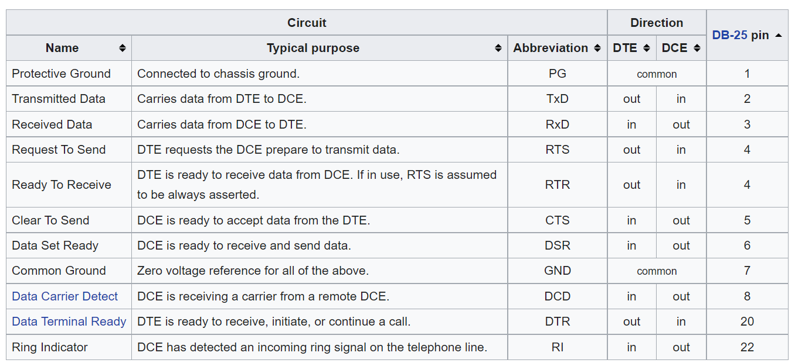

DB25的2脚是TxD，DB9的2角是RxD

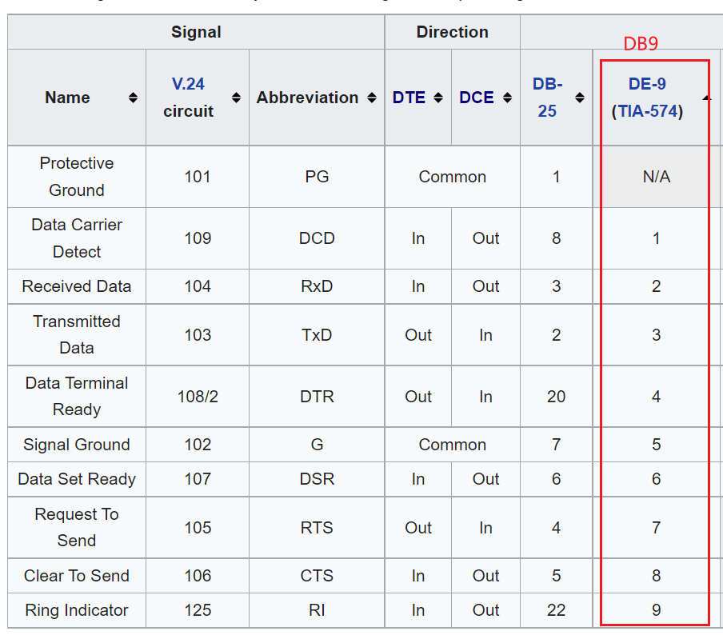

**串口模式**

-   **RS232**

－5～－15V 负的代表逻辑1

正的代表逻辑0

**复用技术**

复用就是在**同一条**物理信道上实现多路信号传输。

-   **polarization division multiplexing（PDM）偏振复用**

#### 时分多路复用（TDM，Time-division multiplexing）

如PCM

利用不同的时隙在同一信道上传输各路不同的信号，且互不干扰，称时分复用。

时分复用的理论基础是**抽样定理**

同步类型有：位同步、帧同步（需要接收端产生的“字”或“句”起止时刻相一致的定时脉冲序列，即**接收端正确区分数码流的首尾**）、复帧同步等

#### 频分多路复用（FDM，Frequency-division multiplexing）

#### 码分多路复用（CDM，Code-division multiplexing）

#### 空分多路复用（SDM，Space-division multiplexing）

## 调制

#### 脉冲位置调制（Pulse Position Modulation，PPM）
