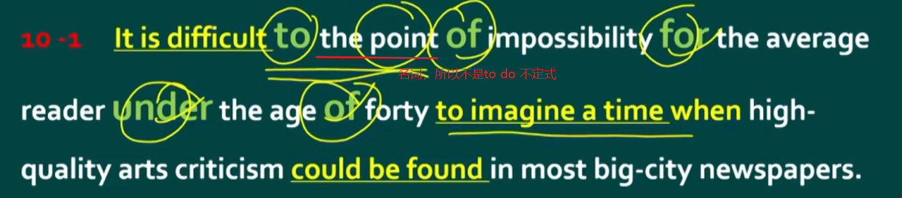
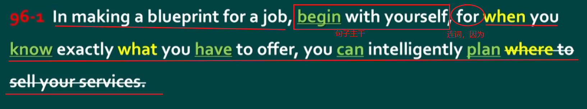
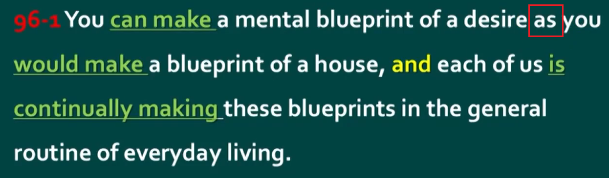
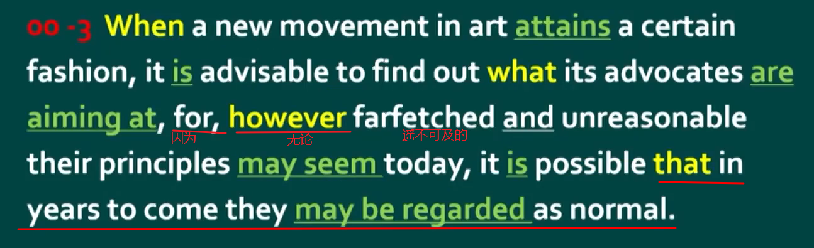
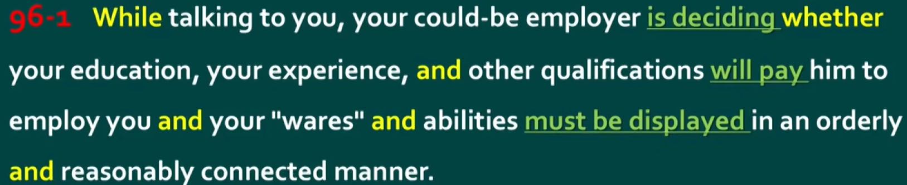
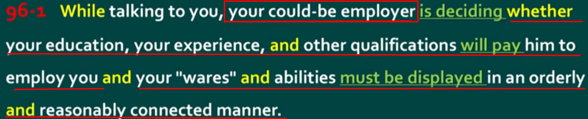
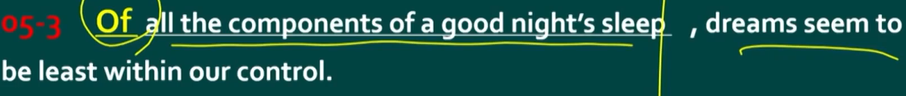
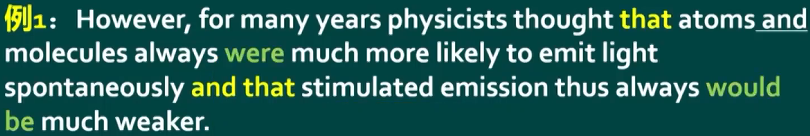
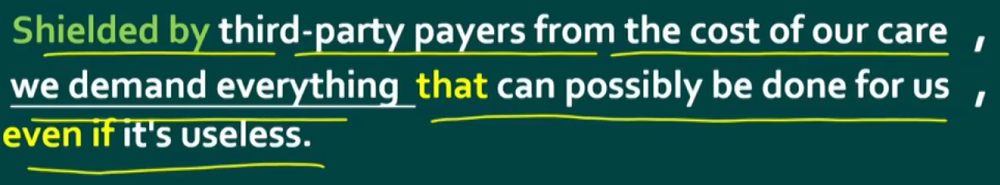

# 语法

## 解析长难句

句子的主干是主语、谓语、宾语。非主干是定语、状语、补语，非主干都是起修饰作用的。所以理解一个句子的核心是找到句子的主干，更进一步要找到句子非主干、更上一层则是能补充还原句子的逻辑结构(省略句，结合语境找到合适的关联词从非谓语结构还原；从整体结构来进行翻译，比如`that`、`that`并列的，可以翻译为…从两点，一点是…另一点是…)

另外如果是系动词，那么就是主语、系动词、表语的结构

破折号相当于逗号

### 找连词 `conj`(`conjunction`) -> 分清谁是句子

因为连接两个句子必须要使用连词；从后往前找。n个连词需要n+1个谓语，找不到连词一定是某个连词没认出来。

如果是连接两句话，若它们之间主语不一样，表达的意思不要弄混了。还可能的是一个主语连接两个并列句子，是这个主语做的两句话的事情，比如下面提到的例子。

#### 并列连词

`and`、`or`、`but`、`yet`，功能上都表示并列（不一定是逻辑上），并列连词连接前后相同的成分，比如名词连接名词，动词连接动词，句子连接句子，词连接词。

注意用`and`并列三个词以上只需要用一个`and`即可，如果出现两个`and`并列三个词，则三个词之间不是两两并列关系。

`and`要从后往前找并列


这里的`factual errors and spelling and grammar mistakes`，是`factual errors`并列`spelling and grammar mistakes`，然后后者的`and`又是并列`spelling`和`grammar mistakes`。

另外这里有一个高级的并列方式表达，区别于一般的`a, b and c`。这里使用了`a and b, combined with c`。

`combined with`也只是一个介词短语修饰，而不是连词。

`either…or…`（對兩事物的選擇）要麼…要麼，不是…就是，或者…或者。

其实没啥就近就远原则，就是两个连词，`either + 句子 or + 句子`，句子中主谓一致罢了。

`neither… nor…`（否定的陳述適用於兩方面）既不…也不…

#### 从属连词

连接从句和主句的连词称为从属连词

从句还可以这样组成：w开头的从属连词+`to do`动词不定式（是非谓语动词），比如`where to go`、`what to do`。

但注意`to + 名词`这不是做主语，不是动词不定式，这里的`to`是副词。



##### 易混连词/重点连词

`for`，作连词意思为"因为"；



`as`，`prep.`作为；`conj.`像…一样；当…时；因为；尽管



`let alone`更别提，更不用说。两词连用作连词，用法类似`and`，可以连接句子等，表示一种否定递进。

`however`、`whatever + adj/adv + 句子`

翻译为无论…（如何如何），先翻译句子：无论…（句子）…+`adj/adv`（怎么怎么样），



当一个在艺术领域的一个新的运动开始流行的时候，找到它的倡导者的目标所在是明智的，因为，无论他们的原则在今天看来是遥不可及和不理智的，但很有可能他们将来可能会被认为是正常的

##### 不做成分

`that`、`if`、`whether`、`though`、`although`、`since`、`even if`（整体来看是引导让步状语从句，即使，尽管。但`even`若是单独作副词，那么`if`是唯一的连词，这时就是甚至如果）、`even though`（相比`even if`通常是假设性的，这个通常是真实的事情。尽管、虽然）等

##### 连接代词

`who`、`whom`、`whose`、`what`、`which`、`whatever`、`whoever`、`whichever`

##### 连接副词

`when`、`where`、`why`、`how`、`however`、`whenever`、`wherever`

### 找（谓语 `Predicate`）动词 -> 分清谁是句子

要分清谁是句子，就要抓住句子的灵魂，即谓语，一个句子谓语最重要。

谓语动词即动词做谓语



`while`从句这里省略了主语和`be`动词，补全是

```
while your could-be employer（你可能的雇佣者） is talking to you
```

第二个`and`连接的是两个句子。



小心非谓语动词和谓语，比如一个过去分词和过去式，如果形式一致，出现在句子中，不能贸然就判断它是谓语，它还可能是非谓语动词中的过去分词形式，表修饰，而不是谓语动词的过去式语态，要分清主被动关系。

```
The railway companies, though still private business managed for the benefit of shareholders, were very unlike old family business.
```

这里的`managed`！！就不是`though`这个从句的谓语！而是过去分词！修饰的是`private business`！然后真正的谓语在哪呢，这是状语从句的省略句，主语一致，主语省略，如果有系动词同时也省略。那么还原回去就是：

```
The railway companies, though the railway companies were still private business managed for the benefit of shareholders.
```

### 找介词 -> 简化句子结构

介词引导的成分永远不做句子主干，所以一开始可以先把介词开头的短语（起到修饰作用的）扔到一边。句子的主干是主语、谓语、宾语。非主干是定语、状语、补语。

`in`、`on`、`at`、`of`、`off`、`with`、`to`等等




这里的一连串介词分隔开真正的主谓老远。

`to`修饰`difficult`、`of`修饰`the point`、`for`修饰`impossibility`、`under`修饰`reader`、`of`修饰`forty`，所以介词老是逆向修饰前面的那个东西

### 常见句型结构的组成

#### `__, S+V+O`

这里的`__`非主干结构统统作状语

##### 1. 状语结构

```
when I was young, I could play football.
```

##### 2. 介词结构

```
On Sunday morning, we go to school.
```

##### 3. 分词结构（[非谓语动词](#非谓语动词又名nonfinite-verb-非限定动词的一般结构)，即动词三种分词形式）

若前后主语不一致变为独立主格结构

```
Finishing my homework, I start to watch TV.
```

##### 4. 独立主格结构、`with`复合结构

就是一句中主语不一致的情况，主语一致变为分词结构

```
He finishing his homework, I start to watch TV.
```

##### 5. 副词

```
Surprisingly, he is still alive.
```

#### `S, __ V+O`

在上面的`__, S+V+O`结构中，`__`非主干结构都作状语，而状语的位置非常灵活，前、中、后都可，所以可以直接：

1. 状语结构

```
I, when I was young could play football.
```

2. 介词结构

```
we, on Sunday morning, go to school.
```

3. 分词结构（[非谓语动词](#非谓语动词又名nonfinite-verb-非限定动词的一般结构)，即动词三种分词形式）

```
I, finishing my homework, start to watch TV.
```

4. 独立主格结构、`with`复合结构

```
I, he finishing his homework, start to watch TV.
```

5. 副词

```
he, Surprisingly, is still alive.
```

##### 6. 定语从句

```
Shanghai, which is a moving city is my hometown.
```

##### 7. 名词结构

```
Shanghai, a moving city is my hometown.
```

这里`a moving city`叫做同位语，其实是前面定语从句的省略结构，省略了`which is`。另外名词结构这里常常后面又跟着各种定语从句修饰这个名词`a moving city`，将句子拉的很长，将后面的`is my hometown`变得难以找到主语或者弄混。

注意这里的定语从句和名词结构都是修饰主语，所以放在中间即主语后面。

#### `S+V+O, __`

状语不解释了，和前面第二种一样情况。

而后面的定语从句和名词结构，与第二种结构不一样的是，第二种结构修饰主语，而这里修饰的是宾语，所以可以放在宾语后面。

1. 状语结构

```
I could play football, when I was young.
```

2. 介词结构

```
we go to school, on Sunday morning.
```

3. 分词结构（[非谓语动词](#非谓语动词又名nonfinite-verb-非限定动词的一般结构)，即动词三种分词形式）

```
I start to watch TV, finishing my homework.
```

4. 独立主格结构、`with`复合结构

```
I start to watch TV, he finishing his homework.
```

5. 副词

```
he is still alive, Surprisingly.
```

6. 定语从句

```
I love Shanghai, which is a moving city.
```

7. 名词结构

```
I love Shanghai, a moving city.
```

#### 句子的排列组合

其实句子基本就是上面三种结构的排列组合，比如：

```
When I was young, I'd listen to the radio, waiting for my favorite song.
```

## 从句（`Subordinate`/`dependent Clause`）

由从属连词引导的一个句子叫从句。

XX从句的意思就是，在句子中做XX成分的是个从句（就一个从属的句子）。

判断某个从属连词引导的是什么从句，直接判断它处于句子什么位置，做什么成分即可。

但别忘了`that`不一定就是引导从句的，它还有代词的指代意思，那个。要看`that`是不是引导从句的，就看它后面是不是一个句子（即有没有谓语）

##### 从句并列



`that…that…and that…`判断是与哪个并列？可以先从一个角度判断，`that`从句是否完整来判断是否是定语从句，并列的两个从句肯定是同一种从句。

这里的`that`和第二个`that`是并列关系，都是宾语从句。

### 宾语从句

句中作宾语

比较常见的就是`that`来引导从句：

```
I believe that god is a girl
```

另外宾语从句也能用关系代词`what`、`who`、`whom`、`which`、`whose`等来引导，此时不仅在主句中从句部分整体作宾语，从句部分的主语和谓语的动作也是修饰了这个关系代词代指的事物。而且是陈述句语序。

### 表语从句

系动词+表语从句，即句中作表语，与宾语从句类似

### 主语从句

`That`也可以拿来做主语从句：

```
That god is a girl is obvious.
```

但这样会头重脚轻，所以诞生了使用`It`做形式主语的情况，以上句子改写为：

```
It is obvious that god is a girl
```

另外`To do`也能拿来引导，但与`that`相同，通常也会被丢到后边，由`It`来做形式主语，后面`that god is a girl`才是真正的主语。

### 定语从句

在整个主句中作定语，仅作修饰，修饰名词。

用`that`引导的与其他从句相比不一样，因为它用`that`引导的从句成分一定不完整，而其他从句用`that`引导成分都是完整的。

#### 判断修饰谁

定语从句修饰的名词（先行词）不一定就是最近的那个词，但有两个原则来判断：

1. 不能跨越谓语动词，太远了语言就晦涩难懂。
2. 代入定语从句根据语境判断。
3. 修饰人的肯定是`who`而不是用`which`
4. 它修饰的不一定就是一个词，也可能是构成了一个整体的名词。

#### 翻译

如果定语从句太长了，就不要再倒叙翻译为…的，而是把先行词带入到定语从句中，翻译成而且/并且它…

还是太长了可以使用设问句翻译。

### 状语从句

##### 状语从句的省略

若是主句和从句的主语一致，主句已经包含了主语等信息了，状语里面的主语信息要不省略就显得很冗余。

```
When I was young, I could study English.
```

省略主语，如果谓语动词有`be`动词也省略（因为没啥实际意义，省了也不影响句子理解）

##### 让步状语从句



`even if`这里引导的是让步状语从句，意为即使。

由于医疗费用（`the cost of our care`）是被第三方支付的，我们要求用尽所有的医疗手段，即使它们没有任何作用。

这里前面的非谓语动词短语其实是原因状语从句的省略，还原回去就变成了`Because we are shielded by…`

### 同位语从句

容易与定语从句弄混，都是修饰前面的名词，但同位语从句成分完整，而定语从句成分不完整。同位语只是起到补充说明的作用

```
I have a piece of news to you that you get an offer from Yale. // 同位语从句
I have a piece of news to you that comes from Yale. // 定语从句
```

### 名词性从句、形容词性从句和副词性从句

名词性从句（`content clauses (noun clauses)`）：宾语从句、主语从句、同位语从句、表语从句

形容词性从句（`Relative (adjectival) clause`）：定语从句

副词性从句（`Adverbial clause`）：状语从句

#### 连接副词和连接代词与关系副词和关系代词

名词性从句本身就是属于句子的成分，它们的从句引导词叫做连接代词/连系代词（`conjunctive/connective pronoun`），这类代词本身是名词性的，所以可以在从句中作主语或者宾语。

连接，连接句子，它是句子的重要组成部分。而关系，关系只是修饰，拿掉并不影响主干。

定语从句的引导词`who`、`which`、`that`等叫做关系代词。

什么是关系代词？

```
I love the girl and she is beautiful.
= I love the girl who is beautiful.
```

所以`and she = who`，又因为`she`-> 代词，`and`->连词，`who = and + she`即连词（解释从句与先行词之间的关系）+代词，起了个名字叫关系代词。

介词+`which` = `where`/`when`的时候，这个介词+`which`和`where`和`when`就都叫做关系副词。副词，起修饰作用作状语，就不用在定语从句里面作成分了，所以从句是完整的。

连接代词和关系代词可以在从句中作主语或者宾语。关系副词和连接副词在从句中起修饰作用，作状语。

## 短语

短语和从句就不同了，它不是一个句子，没有主谓，但某些结构有逻辑主语和逻辑谓语。

短语能在主句中作各种成分

### 常见介词短语

介词短语可以做表语、状语、定语、宾补

表语

```
He is in the room.
```

状语

```
He works in the factory.
```

定语

```
The man in the room is my teacher.
```

宾补

```
I saw my book on the desk.
```

`as well as`（其实就是和…一样好引申的）、`together with`、`along with`和，还，表示并列（补充的并列）但不是连词，因此后面不是加句子只是介词短语做定语或状语，`A as well as B`，强调A。而且主语是A单体，而非A和B整体，`as well as B`只是修饰成分，所以注意主谓一致。

`as a result`因此

### 拥有逻辑主语与逻辑谓语的结构的短语由来

个人认为，非谓语动词的由来，是想合并多个句子成一个句子。

句子是有主谓的，一个句子只能拥有一个主语和一个谓语。多个句子能够通过连词来连接，表现逻辑关系，并列、递进等等。但多个句子合并为一个句子，被拿去合并的句子就需要变为非句子，而非句子肯定不能拥有谓语。合并之前，它们是存在谓语的，变化后形式上没有了，但是逻辑上其实还存在，把它们这种隐含的/原本的谓语叫做逻辑谓语，变化后的这种逻辑谓语的形式叫非谓语。另外，逻辑谓语也需要有主语，称为逻辑主语。

**规律**

若逻辑主语与主句（将合并后的主体句子称为主句）相同，那么逻辑主语是不可见的（被省略了），逻辑主语是主句的主语。我称之为非谓语动词的一般结构。

如果要合并的是与主句不同的句子，那么称之为非谓语动词的复合结构。普遍认为的复合结构即：动名词复合结构、不定式复合结构、独立主格结构、`with`复合结构等等。其实抽象来说就是非谓语动词的复合结构，只是它们变化的方式不太一样，比如有些逻辑主语形式上可能会变化，比如[动名词的复合结构](#动名词复合结构)中的逻辑主语的变化

逻辑谓语上的变化规律详见非谓语动词

### 非谓语动词（又名`Nonfinite verb`非限定动词）"的一般结构"

拥有逻辑主语和逻辑谓语，一般结构的逻辑主语就是主句的主语

**非谓语动词三种形式：`Ved`（过去分词），`Ving`（现在分词或动名词），`to do`（"将来分词"，因为将来的事情不确定，所以又叫动词不定式）注意系动词也有非谓语形式：`been`、`being`、`to be`**

**分词、动名词、动词不定式是非谓语动词的三大类型**

动词不定式、动名词和分词（包括现在分词和过去分词）可以出现在句子中除谓语以外的任何一个位置上，充当句子的主语、宾语、表语、定语、状语、补语等成分，这些动词形式称为非谓语动词。

#### 分词

分词在句中做各种状语、或后置定语。分词结构一定有逻辑主语和逻辑谓语，选用什么分词需要看逻辑主谓之间的语态（语态：动词的一种形式，说明主语与谓语动词之间的关系）规定被动语态，用过去分词；主动语态，用现在分词。

##### 从句子合并说来龙去脉

**作状语**

分词作状语不像用连词连接的显式逻辑，是隐含的，具体逻辑关系需要从语境上分析是什么关系，从而翻译的时候能够翻译出更确切的意思。

```
I finish my homework.
I start to watch TV.
```

选择第一句作状语，开始合并。I与finish是主动关系，使用现在分词`finishing`。逻辑主语与主句主语一致，省略逻辑主语。逻辑主语就是省略的I，逻辑谓语就是`finishing`。

最终句子就是：

```
Finishing my homework, I start to watch TV.
```

正常句：

```
when I finish my homework, I start to watch TV.
```

开始偷懒，现在句子的结构是连词`when`+句子1，句子2。如果想去掉连词，但这两个句子不能直接通过逗号连接。所以要将一个句子变成不是句子，决定一个是否是句子的灵魂是谓语动词，那么就想将谓语动词变为不是谓语动词，所以就有了非谓语动词的讲法。即一个动词一般来说就是做谓语的，如果不去做谓语了，那就是非谓语动词了。

如何使用主要看语态。

因为被动语态是`be + 过去分词`，所以相对的规定了主动是现在分词（注意不是`be + Ving`，这是现在进行时态了）。

另外主动与被动语态指的都是主语与动词之间的关系，而不是与宾语的关系。

那么有了非谓语动词，它变得不是句子了，现在可以删掉连词了，由于是主动，非谓语动词选用现在分词形式，变成：

```
I finishing my homework, I start to watch TV.
```

又因为主语一致，所以可以把主语省略，变成了：

```
Finishing my homework, I start to watch TV.
```

分词结构是有着逻辑主语和逻辑谓语的，所以在这里I是分词结构的逻辑主语，`finishing`是逻辑谓语，它们之间是主动关系，所以是使用的现在分词。这里的分词结构是作状语，修饰的是谓语，即`start to watch TV`，从句和修饰的谓语之间的关系是什么关系就是什么状语

**作定语**

```
The girl was crying.
The girl stood there.
```

要将两个同一个主语的句子合二为一，那么用谁作定语修饰那个主语就选用变为分词形式。

选用`stand there`作定语，变为"站在那里的"

```
The girl standing there was crying.
```

`standing there`这个分词结构逻辑主语是`The girl`，逻辑谓语是`stand`，关系是主动，所以选用现在分词。

但分词作定语的时候，是修饰的词作逻辑主语，不一定是句子的主语。

**注意分词和时态的区别，分词是动词的一种动词的形式，体现为语态，针对动词本身。而过去式、现在进行时、将来时是时态，是针对句子整体而言的。**

#### 动名词

动名词是使用动词的`Ving`的形式，变成名词性的词，它兼有名词和动词的部分特性，是很特殊的非谓语动词。要注意和现在分词、现在进行时的`Ving`形式的动词加以区分。

动名词的含义是"做......这件事"，可以看作是一个名词

动名词有名词的特性，可以作名词用，可以作主语或者宾语。但它和一般名词不同的是，它没有名词所有格的形式。

动名词又有动词的特性，它后面能接宾语，变成动宾短语，但它与一般的动宾短语又不同，它没有时态的变化。

##### 作主语

谓语动词记得用单数

##### 作表语

```
My job is cooking for lunch. // 动名词
```

我的工作是做午饭（这件事）。

```
I am cooking for lunch. // 现在分词
```

我正在做午饭。

##### 作宾语

**1. 在`want`、`need`之后，有被动含义。**

```
The shirt wants ironing.
```

这衬衫需要熨烫。

```
The windows need cleaning.
```

窗户需要擦拭。

**2. 处在`remember`，`forget`，`stop`，`finish`之后，注意和不定式的区别，语义上有很大区别**

```
Remember to post the letter.
```

记住寄信。

```
I remember posting it.（做寄信这件事）
```

我记得寄过信了。

```
Don't forget to lock the door.
```

别忘了锁门。

```
I forget locking it.（做锁门这件事）
```

我忘记锁门了。

```
Let's stop talking.（做谈论这件事）
```

我们别说话了。

```
Let's stop to talk.
```

我们停一停，开始说话儿。

**3. 在`enjoy`，`go`，`mind`，`keep`后面一般只跟动名词作宾语。**

**4. 在`start`，`begin`，`learn`动名词与不定式意思相近**

**5. 在`like`，`love`，`hate`后面，动名词和不定式略有不同：跟`to do`表示临时的，跟`doing`表示平时的喜好。**

#### 不定式

`to + 动词原形`

有些老师称之为"将来分词"，表示还未发生的动作。

它具有动词特征，还可以有名词、形容词和副词等特征，具体需要视语境而定。

### 非谓语动词的复合结构

什么是复合结构？个人理解复合结构就是拥有逻辑主语和逻辑谓语的一个整体的结构，它在句子中要当作一个整体来看待，能够作句子的成分。注意既然是逻辑上的主语和谓语，所以和真正的主语和谓语语法长得不一样。

复合结构是不能独立出来为一个句子的，但它们却有逻辑主语和逻辑谓语。首先谓语是句子的灵魂，有一个谓语部分就必定是一个句子。而两个句子如果不用连词连接，是存在语法错误的。因此这里的逻辑谓语就是非谓语，使用一系列非谓语来实现逻辑谓语的存在。

复合结构有四种。

#### 动名词复合结构

动名词有种特殊的结构，当动名词做宾语时，不仅能够使用形容词性物主代词或名词所有格+动名词（普遍情况），还能使用人称代词的宾格形式或名词普通格+`Ving`（这是动名词复合结构所拥有的特殊情况），表示同一个意思。该复合结构中的逻辑主语就是前面那个名词或人称，逻辑谓语就是动名词。

动名词的复合结构在句中作主语的，最好用所有格形式；

动名词的复合结构在句中作宾语的，普通格和所有格都可以用；

动名词的逻辑主语是无生命的"物"或是不定代词或由较长的一组词构成时，最好用普通格；

```
They don't like me/my coming here.
XiaoLi(His) going won't be of much help
```

#### 独立主格结构（`Absolute Construction`）

定义是：作状语用的非谓语动词短语、介词短语、形容词等各种短语前带有自己的独立于主句主语的自己的逻辑上的主语名词或代词，这一个不是句子的句子，逻辑上构成了主谓结构。它严格意义上没有主语和谓语，所以独立主格结构中没有主语和谓语，只是人们研究它的方便说法。

结构：主格名词/代词（作逻辑主语）+分词/形容词/副词/不定式/介词短语（作逻辑谓语）

逻辑谓语就是非谓语

从非谓语中的非谓语动词角度来看，其实是使用非谓语动词偷懒省略句的特殊情况——两个句子主语不一致。

还是这类似的话：

```
when he finish his homework, I start to watch TV.
```

去掉`when`，然后`he`与动词关系为主动语态，变为`finishing`，然后句子变为了：

```
he finishing his homework, I start to watch TV.
```

又因为I和He主语不一致，无法省略，所以这就是句子最终的形态，前半段称为独立主格结构，即有一个和句子真正的主语不同的一个独立的主语。

另外举一个难的例子：

```
transaction is in process, please wait.
```

这个句子实际上是错误的。因为是两个句子，前面有系动词`is`，后面又有一个谓语`wait`（祈使句常常省略了主语`you`）。所以要变一变，要有一部分变为非谓语。但如果变`wait`为`waiting`，而祈使句后面加动词原型，所以不能变`wait`。只能变`is`，`is`也有三种分词结构，根据语态选用`being`，所以最终变为：

```
transaction being in process, please wait.
```

即一个独立主格结构。

- **`with`/`without`复合结构**

个人认为`with`复合结构就是独立主格结构的一种修饰，带有伴随意味的独立主格结构

`with`+名词/代词（作逻辑主语）+分词/形容词/副词/不定式/介词短语（作逻辑谓语）

该结构常做伴随、方式、原因、条件等状语。会发现与独立主格结构基本相似，所以两者能切换，`with`去掉就变成了独立主格结构，加上就变成了`with`的复合结构。（注意`without`不能省略，因为否定意思无法省略）

另外独立主格结构前面还能加`like`，类似`with`的用法。

注意不要和`with + 宾语（+宾补）`弄混，那是介宾短语（介词短语中的介词+宾语）的范畴。

#### 动词不定式的复合结构

不定式都有自己的逻辑主语，它可能是句子的主语、宾语，也可能是由`for`或`of`引出的某个词语（一般由名词或代词充当），这类带有逻辑主语的不定式，称为不定式的复合结构。

```
for sb. to do
```

这里的逻辑主语是`for`引出的`sb.`

### 介宾短语（介词 + 宾语）

介词后面接名词或名词性的结构，构成介宾短语。介词后面必须加宾语（或逻辑宾语）才能构成一个完整的成分，才能在句中做状语、或后置定语等，不做句子主干。

#### 名词性结构

1. 动名词，即`Ving`形式，它兼有名词和动词的特性，是非常特殊的非谓语动词。

## 句子成分

### 主语（`Subject`）

### 谓语（`Predicate`）

句子的灵魂，组成句子最重要的一个成分。

### 表语（`Predicative`）

位于系动词（`be`）后的词，说明主语身份性质品性特征状态。系动词（`Linking Verb`）+表语=谓语（`Predicate`）

### 宾语（`object`）

### 定语（`Attributive`）

定语是用来修饰、限定、说明名词或代词的品质与特征的。主要有形容词，形容词性的词、短语或句子(名词、代词、数词、介词短语、动词不定式、分词、定语从句等)都可以作定语。

一般不定代词、形容词、名词、数词、量词、形容性代词、冠词等作为前置定语，而过去分词、不定式、形容词短语、介词短语、定语从句、同位语从句等一般作为后置定语

### 状语（`Adverbial`）

状语说明地点、时间、原因、目的、结果、条件、方向、程度、方式和伴随状语等。

状语由副词或副词性的词、短语或句子（状语从句、介词短语、分词和分词短语、不定式等）来担当。其位置一般放在句末，但也可放在句首或句中。

### 补语（`Complement`）

补充说明宾语以及主语，叫宾补（`object complement`）、主补。

宾语补足语：有些及物动词，接了宾语意义仍不完整，还需要有一个其他的句子成分，来补充说明宾语的意义、状态等

#### 与定语的区别

定语是可有可无，句子中的定语拿掉之后，句子要表达的主体意思还在，只是少了一些详细特征。而补语一般不可直接简单省略，它是谓语对宾语或者谓语对主语进行的事件或做的动作或描述之后的一种结果或变化或原因的补充，如果省略，常常会让句子意思难以理解全面。

```
wash your hands clean. // 形容词做宾补（是wash这个动词造成了clean）
can you see anything unusual? // 形容词做定语（而这里的unusual是anything的本身特征和see没有关系）
she made me happy // 宾补（这里是made造成了happy）
she heard something funny // 后置定语（这里的funny和heard没有直接关系）
```

省略

```
I heard John singing. // 现在分词做宾补。（去掉singing——我听到他，明显少个成分，不完整）
Do you know the boy riding the bike? // （去掉riding ....——你知道这个男孩吗，仍然是完整句子）
I love you far away from me // 宾补（去掉far away...——我爱你，与原句相差意思很大）
I like the girl in red hat // 后置定语（去掉in red hat——我喜欢那个女孩，只是少了个特征词语，意思不变）
```

#### 与双宾语的区别

双宾语是两个宾语，逻辑上并没有谁描述谁，而是对于谓语而言完成这个谓语的动作需要两个宾语。就像一个函数需要传递两个参数一样。

而宾语补足语是宾语的描述，一般是由谓语引起的一种结果或变化的描述，它和宾语是关系很大的。

#### 如何简单区分宾补和双宾语？

加个`be`，一般如果通顺就是宾补，不通顺就是双宾

```
He gave me a book => me/I am a book (不通顺，是双宾语)
I found him a teacher => him/he is a teacher (通顺，是宾补)
```

## 词性

### 人称代词与物主代词

| **人称代词** |      | **第一人称** | **第二人称** | **第三人称** |
|--------------|------|--------------|--------------|--------------|
| 主格         | 单数 | `I`          | `you`        | `he`, `she`, `it` |
|              | 复数 | `we`         | `you`        | `they`       |
| 宾格         | 单数 | `me`         | `you`        | `him`, `her`, `it` |
|              | 复数 | `us`         | `you`        | `them`       |

| **物主代词** |      | **第一人称** | **第二人称** | **第三人称**   |
|--------------|------|--------------|--------------|----------------|
| 形容词性     | 单数 | `my`         | `your`       | `his`, `her`, `its` |
|              | 复数 | `our`        | `your`       | `their`        |
| 名词性       | 单数 | `mine`       | `yours`      | `his`, `hers`, `its` |
|              | 复数 | `ours`       | `yours`      | `theirs`       |
