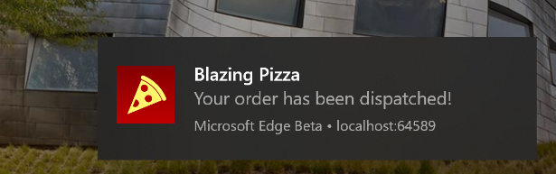
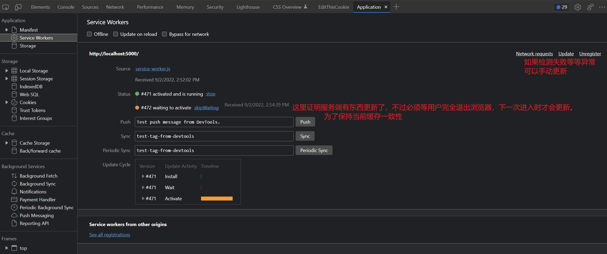
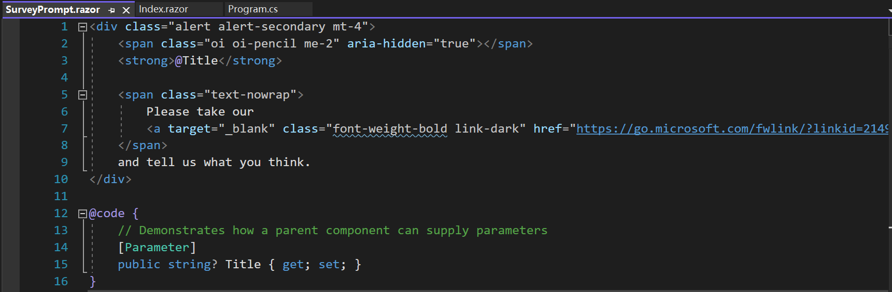
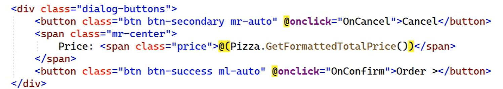
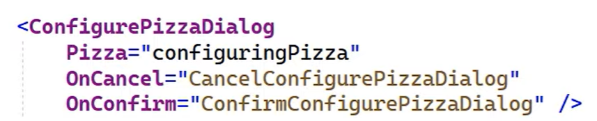
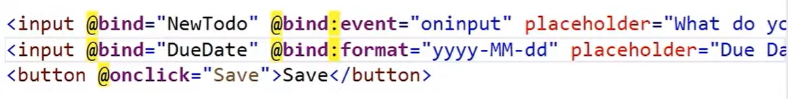
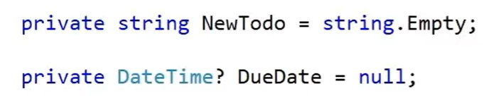
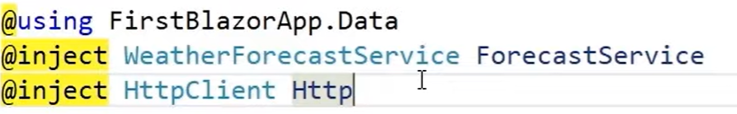

Contents

[Web Assembly (WASM)](#web-assembly-wasm)

[PWA (Progressive Web Application)](#pwa-progressive-web-application)

[前后端版本一致原理](#前后端版本一致原理)

# Web Assembly (WASM)

Web Assembly项目一般分为 MyFontend.Client, MyFontend.Server和MyFontend.Shared

Web Assembly项目还可以开启Progressive Web Application (PWA)，支持Chrome和Edge，让网页变成客户端app一样的程序，提前下载好所需的assembly、资源，大幅优化产品体验

## PWA (Progressive Web Application)

### 前后端版本一致原理

[https://docs.microsoft.com/en-us/aspnet/core/blazor/progressive-web-app?view=aspnetcore-6.0&tabs=visual-studio\#background-updates](https://docs.microsoft.com/en-us/aspnet/core/blazor/progressive-web-app?view=aspnetcore-6.0&tabs=visual-studio#background-updates)‘

主要原理是`service-worker`。可以到client中的wwwroot目录下看到。

`service-worker.published`是真正生产使用的版本，可以看到和dev的差别很大。

`onInstall`方法：控制缓存哪些静态资源。

`onFetch`方法：默认是控制navigate操作，所有navigate（切换tab等）请求都会默认是请求index页面，进而判断为不需要进行服务端请求渲染，直接从缓存中提取。**因此需要让哪些页面每次请求必须进行服务端渲染的，在这里明确。**

### Integrity问题（大坑）

#### 禁用integrity检查

一般用于排查integrity错误，看看禁用后程序是否正常，以排除单纯因为文件被修改导致的integrity问题。

将service-worker中的

`.map(asset => new Request(asset.url, { integrity: asset.hash, cache: “no cache” }));`

改为

`.map(asset => new Request(asset.url));`

并将项目csproj下属性PropertyGroup增加：

`<BlazorCacheBootResources>false</BlazorCacheBootResources>`

（但这一般不用于PWA，用于WebAssembly？）

#### 问题溯源

<https://github.com/dotnet/aspnetcore/issues/19907>

①可能被某些程序修改，如LF、CRLF的自动转换：

It is likely that what's going on here is that when you upload the output is transforming the LF into CRLF or viceversa.

I suggest you add a .gitattributes file to the source folder with autocrlf=false to prevent the automatic conversion for the lines

②可能是换用nuget等包版本，造成bin、obj文件夹内dotnet依赖不一致，publish时错误拷贝压缩与未压缩的文件问题

<https://github.com/dotnet/aspnetcore/issues/27752>

需要手动清理bin、obj文件夹（**千万注意Client、Server、Shared三个项目的都得清理**），然后使用`nuget restore`，然后再重新`publish`

③其他

wwwroot里index.html 是 Utf8 With Bom的会导致问题？

浏览器clear storage cache后，仍有概率未清除旧的文件，导致缓存匹配失败（不管是chrome还是edge，都会有这个问题，只能等待，大约2分钟后文件将会正常）。

## Troubleshoot

#### Cannot read property ‘register’ of undefined

<https://stackoverflow.com/a/54934302/18731746>

#### 修改Client端代码后重新运行Docker compose未更新

需要rebuild Server的project，即重新构建容器，个人认为是client没有相应容器，vs没有检测到容器更改。

#### Unhandled exception rendering component: Cannot read properties of null (reading 'removeChild')… No element is currently associated with component xx

<https://github.com/dotnet/aspnetcore/issues/42065>

这个出现Edge运行publish后的项目或start without debugging的项目等，app或浏览器，切换tab后触发，但未能解决。

最终换用chrome发现无此问题。

后面终于找出了原因。因为一个浏览器插件，更改了当前html显示，可能导致了页面更改，写入了缓存，然后后面导致从缓存读取页面时不一致，读取失败照成无法渲染。

#### Cannot start debugging, because the application was not compiled with debugging enabled.

`publish`模式下，不论是Debug或Release，都无法直接用`Shift+Alt+D`进行浏览器Debug。需要在client项目csproj文件中，加上


```razor
<DebuggerSupport>true</DebuggerSupport><CopyOutputSymbolsToPublishDirectory>true</CopyOutputSymbolsToPublishDirectory>
```

[https://docs.microsoft.com/en-us/aspnet/core/blazor/debug?view=aspnetcore-6.0&tabs=visual-studio-code\#debug-hosted-blazor-webassembly](https://docs.microsoft.com/en-us/aspnet/core/blazor/debug?view=aspnetcore-6.0&tabs=visual-studio-code#debug-hosted-blazor-webassembly)

最后发现Edge还是不行

## 性能

<https://docs.microsoft.com/en-us/aspnet/core/blazor/performance>

<https://blazor.syncfusion.com/documentation/datagrid/webassembly-performance>

## Debug

### 通过VS调试

一定要设置Server为启动项目才可有效调试。

直接启动Client是无法进行调试的（且因为Server也没有启动，连不上Server）。

### 通过浏览器调试

仅支持Chrome和Edge

使用Debug 的 **Start without debugging**打开后，调试前端页面，可以使用浏览器的DevTool进行前端的razor页面断点调试。

在页面使用shift+alt+D，会尝试进入Debug模式，第一次会提示没有开启remote debugging，按页面指引打开新页面（旧页面没有attach上debugger），**再按快捷键**进行调试。

#### 注意事项

※如果使用Start Debugging，Launch setting 中默认配置启动了Debug专用browser，会报Websocket连接错误。

除非更改其Launch setting，不自动启动Debug专用浏览器，使用用户本身的浏览器进行操作才不会出现此类BUG。

※如果在Release模式下启动，浏览器存在可能无法命中断点的问题。

<https://docs.microsoft.com/en-us/aspnet/core/blazor/debug?view=aspnetcore-6.0>

## 推送通知

[https://github.com/dotnet-presentations/blazor-workshop/blob/main/docs/09-progressive-web-app.md\#sending-push-notifications](https://github.com/dotnet-presentations/blazor-workshop/blob/main/docs/09-progressive-web-app.md#sending-push-notifications)



只是这种效果，不是双向通信

但可以在用户没打开浏览器情况下推送

## 后台自动更新



# 语法

## Component

在`index.razor`这个`page`文件中

```razor
@page "/"
<PageTitle>Index</PageTitle>
<h1>Hello, world!</h1>
Welcome to your new app.
<SurveyPrompt Title="How is Blazor working for you?" />
//在tag中如果也想使用string赋值，需要变为单引号，即attr=’data.ToString(”MM-dd”)’
```

`SurveyPrompt`这个tag实际上是一个razor文件，任何以razor结尾的文件都可以看作是一个可以被其他Component引用的Component。



使用Parameter这个Attribute修饰的属性，可以在引用该Component的外部文件中赋值。

#### 使用方法

某些控件可以使用诸如`@onclick`事件，然后使用方法名：

```razor
<button class="btn btn-primary" @onclick="IncrementCount">Click me</button>
@code {
    private int currentCount = 0;
    [Parameter]
    public int IncrementBy { get; set; } = 1;
    private void IncrementCount()
    {
        currentCount++;
    }
}
```

#### 自定义Event




`EventCallback`就像一个`Pointer`或者委托，可以由外部赋值，然后内部进行传入。

在另外的`Component`就可以这样使用：



## Page

在开头可以使用多个`@page`，链接同一个文件

```razor
@page "/counter"
@page "/dothestuff"
@layout MainLayout //默认情况下使用App.razor定义的DefaultLayout，也可以单独对某个page文件使用自定义的Layout
@inject IFlightDataService FlightDataService //依赖注入
@implements IAsyncDisposable //实现接口
<PageTitle>Counter</PageTitle>
```

### Layout

#### App.razor

在此文件下，定义了`NotFound`

```razor
<Router AppAssembly="@typeof(App).Assembly">
    <Found Context="routeData">
        <RouteView RouteData="@routeData" DefaultLayout="@typeof(MainLayout)" />
        <FocusOnNavigate RouteData="@routeData" Selector="h1" />
    </Found>
    <NotFound>
        <PageTitle>Not found</PageTitle>
        <LayoutView Layout="@typeof(MainLayout)">
            <p role="alert">Sorry, there's nothing at this address.</p>
        </LayoutView>
    </NotFound>
</Router>
```

## 关键字

#### Bind





双向绑定数据

`bind:event`是修改`bind`默认触发的事件，默认是`onset`，当属性被设置的时候触发双向绑定。可以改为`oninput`，当属性输入变动的时候触发双向绑定；

`format`可以修改bind的格式化方式等等。

#### Inject

Dependency Injection, 使用的是Asp .Net Core自带的DI，在Startup中注入相应的服务。



HttpClient是注入了service.AddHttpClient();然后就可以使用api式的访问方法，调用Server端的api了。

#### if

```blazor
@if(variable)
{
	//cshtml tag
}
```

这个variable可以直接用code中的变量了，不需要加其他的。

## Data

#### Temporary state user data

可以利用DI的Scope方式注入自定义的class实现，用户在一次浏览器访问，会储存到内存中，而其他用户访问不到此对象。

#### Data Binding

<https://blazor-university.com/>

life cycle methods are executed in the following order OnInitializedAsync() OnParametersSetAsync() OnInitializedAsync() OnParametersSetAsync()

<https://stackoverflow.com/questions/58075628/why-are-blazor-lifecycle-methods-getting-executed-twice>

可以使用`InvokeAsync(StateHasChanged);`方法强制刷新当前Component。

注意，`StateHasChanged`这个方法通知的`Context`是当时的`Component`的`Render context`, 若绑定了当时的`context`，而刷新会造成不是一个`render`，在线程中调用这个`StateHasChanged`方法将没有效果。

因此不要使用同个`Timer`实例等在线程中绑定定时进行`StateHasChanged`通知，而是作为一个事件触发当前`Component`的刷新。

# 问题

#### cannot convert from 'method group' to 'EventCallback'

无法推测需要显式指明TValue和TData的类型。

```blazor
Value="@SelectedPredictLog"
ValueExpression="@(() =\> SelectedPredictLog)"
ValueChanged="HandlePredictLogChanged"
TData="PointPredictLog"
TValue="PointPredictLog"
Data="@PredictedLogs"
```

#### The current thread is not associated with the renderer's synchronization context

就类似于 `Winform` UI线程刷新问题，需要使用UI线程去刷新，而不能是其他工作线程。最常出现的原因是因为在使用 `StateHasChanged` 方法时，替换为 `await InvokeAsync(StateHasChanged)`即可。

#### InvalidOperationException: 'WebViewNavigationManager' has not been initialized.
[BlazorWebView NavigationManager in WPF · Issue #8583 · dotnet/maui (github.com)](https://github.com/dotnet/maui/issues/8583)
不能把 `blazor`相关的服务注册为 `singleton`，因为它本身是 `scope`的

## 结合使用Js

<https://docs.devexpress.com/Blazor/403578/common-concepts/add-devextreme-widgets-to-application>
