# HTML & CSS 学习笔记

## HTML (Hyper Text Markup Language)

### Syntax

`Syntax` = rules for writing `HTML` code (like grammar in English).

Elements should have an opening tag and a matching closing tag. 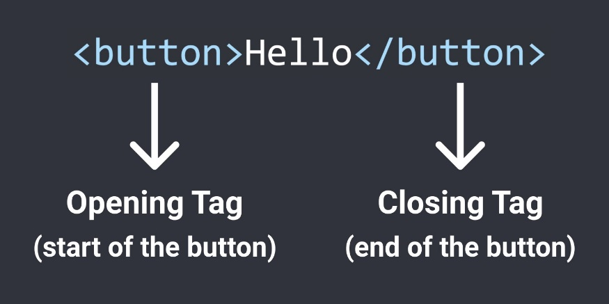

In `HTML`, extra spaces and newlines are combined into 1 space.(you can change text margin to achieve it)

```html
<p>paragraph of text</p>

<p>paragraph of text</p>

<p>
paragraph of text
</p>
```

All 3 examples above will show the same result on the web page.

### HTML Tag/HTML Element

分为三类

**block element:** takes up the entire line (relative to their container) even though they have zero margin. (actually has the default `CSS` property of `display: block`) (such as `<p>` `<div>`)

**inline-block element:** only takes up as much space as needed. (actually has the default `CSS` property of `display: inline-block`) (such as `<input>`)

**inline element:** appears within a line of text. (such as `<strong>`) it doesn't has width.

#### Build-in Elements

| Tag or Element | Mean                                       | Remark                                                                                                                                                                                                                                                                                  |
|----------------|--------------------------------------------|-----------------------------------------------------------------------------------------------------------------------------------------------------------------------------------------------------------------------------------------------------------------------------------------|
| `<p>`          | paragraph                                  | is a block element. by default have `margin-top` and `margin-bottom` Reset the default margins. `{ margin-top: 0; margin-bottom: 0; }`                                                                                                                                                       |
| `<a>`          | anchor element                             | link to another website                                                                                                                                                                                                                                                                 |
| `<style>`      | element style                              | content can write `CSS` code. works in current `HTML` file.                                                                                                                                                                                                                                 |
| `<html>`       | a entire webpage                           | not much meaning to it.                                                                                                                                                                                                                                                                 |
| `<head>`       | contains all elements that are not visible | `<title>` `<style>` should put into it.                                                                                                                                                                                                                                                 |
| `<body>`       | contains all elements that are visible     |                                                                                                                                                                                                                                                                                         |
| `<title>`      | webpage title on browser tab               |                                                                                                                                                                                                                                                                                         |
| `<div>`        | division. just a box, container.           | is a block element. can contain other elements.                                                                                                                                                                                                                                         |
| `<table>`      | table element                              | contains table head: `<thead>` table body: `<tbody>` a Table Row element in body: `<tr>` a Table Data Cell element in row: `<td>` a Table Header element in row: `<th>`  use `<th scope="col">` for contents at first row or `<th scope="row">` for contents at first column            |
| `<pre>`        |                                            | has wrap attribute. you will find that it's not working to use `overflow-wrap` to style it. you need to use wrap to tag the element. [MDN Web Docs - pre element wrap attribute](https://developer.mozilla.org/en-US/docs/Web/HTML/Element/pre#attr-wrap)  |
| void elements  | don't need close tag                       |                                                                                                                                                                                                                                                                                         |
| `<link>`       |                                            | when `CSS` code is to long in style, split it into new `CSS` file and use this to link `CSS` file to current `HTML` file. **Attribute:** `rel`: stands for relation what we will link. values: `stylesheet`(`CSS` file) `href`: file path or url.                                                       |
| ``        |                                            | **Attribute:** `src`: img source path or url.                                                                                                                                                                                                                                             |
| `<input>`      |                                            | **Attribute:** `type`: the type of the input. such as text, checkbox `placeholder`: default text to display when it is empty.                                                                                                                                                               |
| `<b>`          | bold                                       | mark text bold.                                                                                                                                                                                                                                                                         |

#### `<!DOCTYPE html>`

not a element, it just a special line to tell browser to use modern version of `HTML`.

### HTML Attribute

modify how an `HTML` element behaves.

| Attribute | Name | Remark                                           |
|-----------|------|--------------------------------------------------|
| `href`    |      | [W3Schools - HTML href Attribute](https://www.w3schools.com/tags/att_a_href.asp)  |
| `class`   |      |                                                  |

### HTML Text Element (Inline Elements)

appear within a line of text. Useful if we want to style only a part of the text.

| Text Element                                             | Name                | Remark                                                                |
|----------------------------------------------------------|---------------------|-----------------------------------------------------------------------|
| `<strong>`                                               | bold text           |                                                                       |
| `<u>`                                                    | underline text      |                                                                       |
| `<span>`                                                 | generic normal text | is the most generic text element (it doesn't have any default styles) |
| `<a>`                                                    |                     |                                                                       |
| Semantic Element `<main>` `<section>` `<header>` `<nav>` |                     | same as `<div>` but have meaning to screen readers and robot and so on.   |

### HTML Entity

是一段以 "&" 符号开头,以";" 符号结尾,能够表示 `Unicode` 符号的字符串文本

| HTML Code                    | Result | Name       |
|------------------------------|--------|------------|
| `&#183;` `&middot;`          | ·      | Middle dot |
| `&#10003;` `&#x2713;` `&check;` | ✓      | checkmark  |

### Nested Layouts Technique

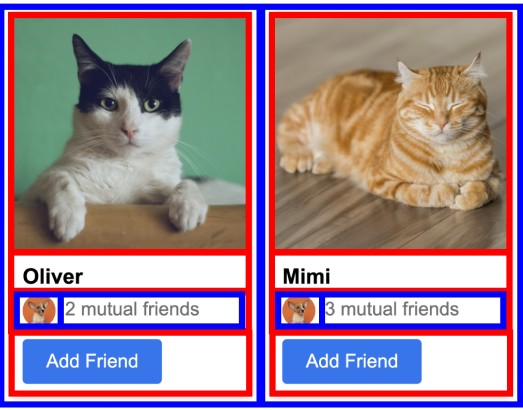

There are 2 types of layouts:

#### Vertical Layout

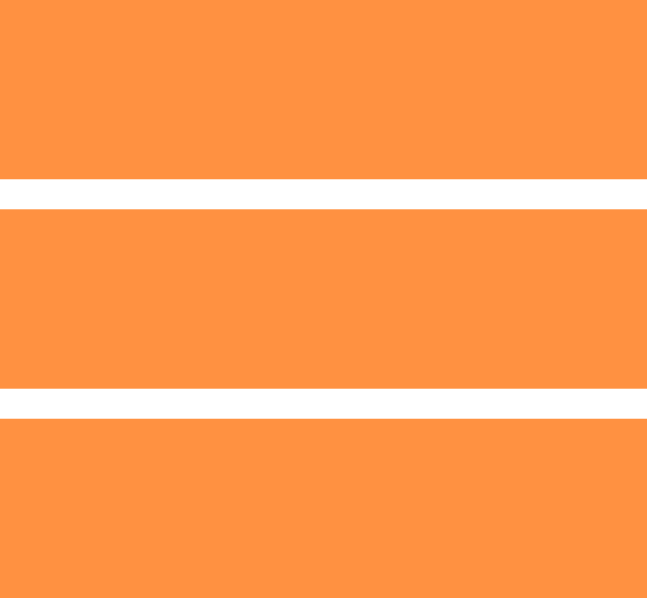

Use `<div>`s with `display: block` (most common)

Use `flexbox` with `flex-direction: column`

Use `CSS Grid` with 1 column

#### Horizontal Layout

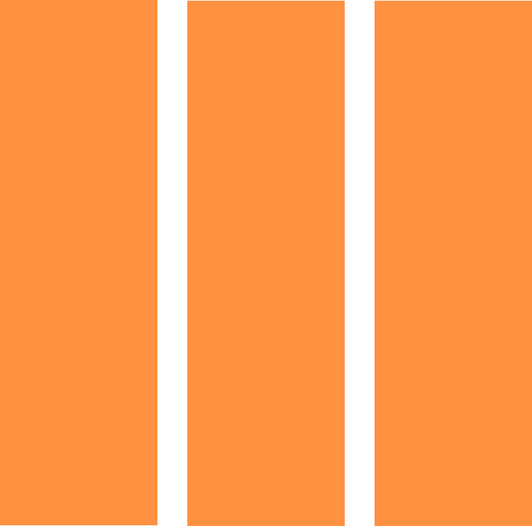

Use `<div>` with `display: inline-block` (not recommended, because it always cause alignment problem because of at the middle of `<div></div>` `<div></div>` has a backspace.)

Use `flexbox` with `flex-direction: row`

Use `CSS Grid` with multiple columns

### Table beautify

## CSS (Cascading Style Sheet)

### Syntax

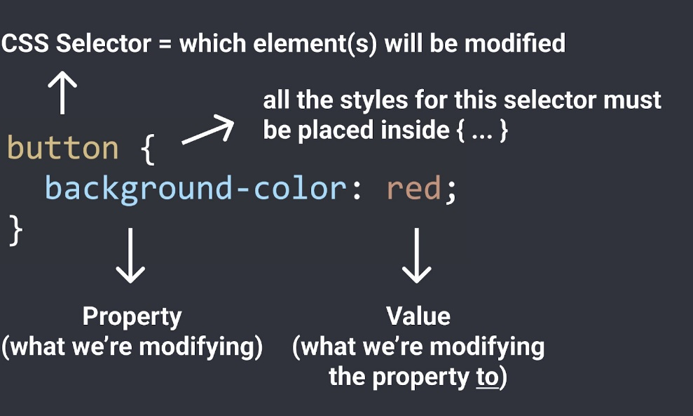

`!important` means super priority. e.g. `#id` and `.class` and element `CSS` selector, if all the three has same background property, if property of element `CSS` has `!important` define, then the property stands out.

### Font-family

黑体：`SimHei`

宋体：`SimSun`

新宋体：`NSimSun`

仿宋：`FangSong`

楷体：`KaiTi`

仿宋_GB2312：`FangSong_GB2312`

楷体_GB2312：`KaiTi_GB2312`

微软雅黑体：`Microsoft YaHei`

`Consolas`

### CSS Selector

```css
div {…}
```

是针对`HTML Element`的样式

```css
.class-name {…}
```

是针对`class attribute`的样式。

组合使用`div.xxx` 代表`div`含`xxx class`的样式

*可以写多个用`,`连接，代表这些种类是通用同一个`CSS`样式。*

```css
div[id] {…}
```

代表的是`div element`且含有`id property`的样式

所以`[XXX]`就是`element`中含有某`property`的样式

`[XXX=aaa]`是`propety=aaa`的样式

高级用法：

```css
[class^="status-"]
```

starts with "status-"

```css
[class*="status-"]
```

contains the substring "status-"

```css
#abc {…}
```

代表的是`id=abc`的样式

#### Combinators

##### Descendant Selector (space)

```css
.side-bar img {…}
```

使用空格连接，代表的是`class`是`side-bar`的内部的所有`img element`的样式。

##### Child Selector (>)

```css
div.container > p
```

match which are direct children of the particular element.

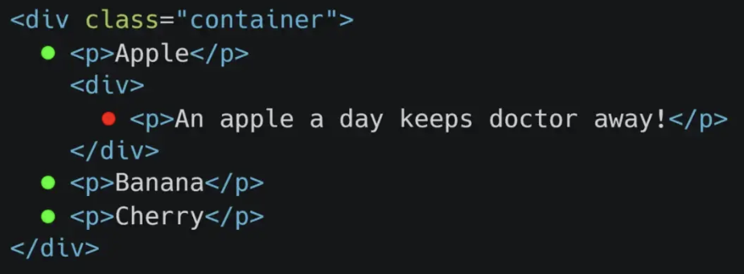

##### Adjacent Sibling Selector (+)

```css
div + p
```

Sibling elements must have the same parent element, and "adjacent" means "immediately following".

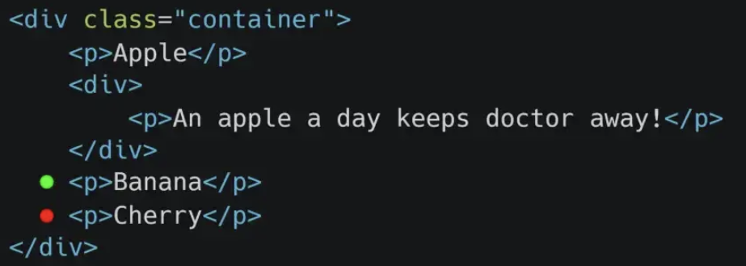

##### General Sibling Selector (~)

```css
div ~ p
```

It selects all next elements that are siblings of a specified element.

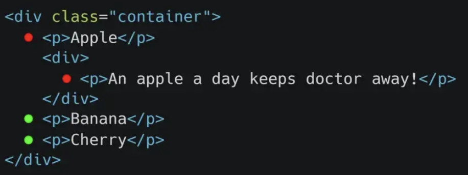

#### Pseudo-class

```css
selector:pseudo-class {
    property: value;
}
```

A pseudo-class is used to define a special state of an element.

the property will add or replace last state of element's property.

| pseudo-class        | function                                                                                                    | remark                                                                                                                                                                                                                                                                                   |
|---------------------|-------------------------------------------------------------------------------------------------------------|------------------------------------------------------------------------------------------------------------------------------------------------------------------------------------------------------------------------------------------------------------------------------------------|
| `:has(selector)`    | parent `CSS` selector [MDN Web Docs - :has() pseudo-class](https://developer.mozilla.org/en-US/docs/Web/CSS/:has) | As of 2022, `Firefox` is the only browser not supporting it by default.                                                                                                                                                                                                                    |
| `:hover`            | These styles only apply when hovering over an element                                                       |                                                                                                                                                                                                                                                                                          |
| `:active`           | These styles only apply when clicking on an element                                                         |                                                                                                                                                                                                                                                                                          |
| `:not`              |                                                                                                             | `div:not([id]) {…}` means `div element` without `id attribute`.                                                                                                                                                                                                                                |
| `:last-of-type`     | represents the last element of its type among a group of sibling elements.                                  |                                                                                                                                                                                                                                                                                          |
| `nth`               | an ordinal number, e.g. 1st, 2nd, 3rd, 4th, ..., nth.                                                       | It's these kinds of pseudo class support some patterns related to count elements. **odd/even**: Represents elements whose numeric position in a series of siblings is odd **`<nth>`**: 1, 2, 3, etc. **`<an+b>`**: n start from 0. but result of zero will ignore. like `2n+1` means odd.  |
| `:nth-child()`      | matches elements based on their position among a group of siblings.                                         |                                                                                                                                                                                                                                                                                          |
| `:nth-last-of-type()` | matches elements based on their position among siblings of the same type (tag name), counting from the end. |                                                                                                                                                                                                                                                                                          |
| `:nth-of-type()`    | matches elements based on their position among siblings of the same type (tag name).                        | **alternative parameters** `even`/`odd`: match all even or odd siblings                                                                                                                                                                                                                      |

`.button:hover .tooltip`代表的是当`hover` `button`类的`element`的时候，设定内部`tooltip`类的样式。

但有个问题在于`.button .tooltip`这个会触发上面`hover`的`event`，可以使用`pointer-events: none;` 去取消`event`

##### Shadow DOM中使用

是`Web Component`中`Shadow DOM`专用的

This has no effect when used outside a `shadow DOM`.

```css
:host {…}
```

selects the shadow host of the shadow DOM containing the CSS it is used inside — in other words, this allows you to select a custom element from inside its shadow DOM.

```css
:host(<compound-selector>) {…}
```

其中`compound-selector`就是常规的那些，不同之处就是专门用于`web component`中的选择。

#### Pseudo-element

```css
selector::pseudo-element {
    property: value;
}
```

A `CSS` pseudo-element is used to style specified parts of an element.

| pseudo-element            | function                                                                        | remark                                                                                                    |
|---------------------------|---------------------------------------------------------------------------------|-----------------------------------------------------------------------------------------------------------|
| `::placeholder`           | `input` element placeholder                                                     |                                                                                                           |
| `custom-element::part(xxx)` | represents any element within a shadow tree that has a matching part attribute. | [`Web Component`] `<div part="xxx">xxxx</div>` select the element in the shadow dom tree with given part. |

#### CSS Property

| Property                                                                   | Function                                                                                                             | Remark                                                                                                                                                                                                                                                                                                                                                                                                                                                                                                                                                                                                                                                                                                                                                                                                                                                                                                                                                                                                                                                                                                                                                                                                                                           |
|----------------------------------------------------------------------------|----------------------------------------------------------------------------------------------------------------------|--------------------------------------------------------------------------------------------------------------------------------------------------------------------------------------------------------------------------------------------------------------------------------------------------------------------------------------------------------------------------------------------------------------------------------------------------------------------------------------------------------------------------------------------------------------------------------------------------------------------------------------------------------------------------------------------------------------------------------------------------------------------------------------------------------------------------------------------------------------------------------------------------------------------------------------------------------------------------------------------------------------------------------------------------------------------------------------------------------------------------------------------------------------------------------------------------------------------------------------------------|
| `zoom`                                                                     | function like zoom use mouse with `ctrl` hot key.                                                                   | `2` means 200% zoom.                                                                                                                                                                                                                                                                                                                                                                                                                                                                                                                                                                                                                                                                                                                                                                                                                                                                                                                                                                                                                                                                                                                                                                                                                               |
| `filter`                                                                   |                                                                                                                      | `grayscale()` `brightness()`                                                                                                                                                                                                                                                                                                                                                                                                                                                                                                                                                                                                                                                                                                                                                                                                                                                                                                                                                                                                                                                                                                                                                                                                                         |
| `height`                                                                   | element height                                                                                                       | unit `px` means pixels  percent value is relative to parent container total height. so the trick is to set `body` and `html` height `100%` and parent height `100%`  `min-height` is not given actual height to element? if only set `min-height` but no set `height`, the child element in this container with relative feature(such as `50%` height) will treat height as zero when calculate itself position. add `height: 1px` [Stack Overflow - Child inside parent with min-height 100% not inheriting height](https://stackoverflow.com/questions/8468066/child-inside-parent-with-min-height-100-not-inheriting-height)                                                                                                                                                                                                                                                                                                                                                                                                                                                                                                                                                                                                                        |
| `width`                                                                    | element width                                                                                                        | recommend use percentage when a element is in a container.  `0`: will auto shrink according to window width.                                                                                                                                                                                                                                                                                                                                                                                                                                                                                                                                                                                                                                                                                                                                                                                                                                                                                                                                                                                                                                                                                                                                       |
| `max-width`                                                                | element max width                                                                                                    | useful when width is auto size.                                                                                                                                                                                                                                                                                                                                                                                                                                                                                                                                                                                                                                                                                                                                                                                                                                                                                                                                                                                                                                                                                                                                                                                                                  |
| `color`                                                                    | element content color(font color)                                                                                   |                                                                                                                                                                                                                                                                                                                                                                                                                                                                                                                                                                                                                                                                                                                                                                                                                                                                                                                                                                                                                                                                                                                                                                                                                                                  |
| `border`                                                                   |                                                                                                                      | `none`：没有边界 它的衍生属性除了下面的还有`width`、`color`等                                                                                                                                                                                                                                                                                                                                                                                                                                                                                                                                                                                                                                                                                                                                                                                                                                                                                                                                                                                                                                                                                                                                                                                          |
| `border-radius`                                                            | 可以设置圆角                                                                                                         | `px` `50%`可以变成圆形 仅当存在`border`大小时才有效                                                                                                                                                                                                                                                                                                                                                                                                                                                                                                                                                                                                                                                                                                                                                                                                                                                                                                                                                                                                                                                                                                                                                                                                    |
| `border-style`                                                             |                                                                                                                      | `solid`                                                                                                                                                                                                                                                                                                                                                                                                                                                                                                                                                                                                                                                                                                                                                                                                                                                                                                                                                                                                                                                                                                                                                                                                                                            |
| `background-color`                                                         | element background color                                                                                             | 可以使用颜色名、或`rgb(255,0,0)`                                                                                                                                                                                                                                                                                                                                                                                                                                                                                                                                                                                                                                                                                                                                                                                                                                                                                                                                                                                                                                                                                                                                                                                                                   |
| `cursor`                                                                   | cursor status when mouse over the element                                                                            | `pointer`: 变成手                                                                                                                                                                                                                                                                                                                                                                                                                                                                                                                                                                                                                                                                                                                                                                                                                                                                                                                                                                                                                                                                                                                                                                                                                                  |
| `margin`                                                                   | spacing outside of a element                                                                                         | 可以单独设置 `margin-right`等 `margin-left: auto` 可以让左边自动填满，自动将元素靠右 four args: top right bottom left three args: top rightAndLeft bottom  `0 auto;` 可以将子元素居中于父元素  negative margin will subtract space and pull element to that side.                                                                                                                                                                                                                                                                                                                                                                                                                                                                                                                                                                                                                                                                                                                                                                                                                                                                                                                                                                                      |
| `padding`                                                                  | spacing inside of a element                                                                                          | 设置`width`和`height`会固定元素大小，元素内部的文字内容多了则会溢出来，但如果设置的是`padding`，则它的`width`和`height`都会自动根据内容变更大小以满足`padding`的设置。  当值只有一个时，是设定 `padding-top`/`bottom`/`left`/`right` 为同一个值 有两个值时，是设定`vertical padding` 然后是`horizontal padding`. 四个值就分别是`top`、`right`、`bottom`、`left`.                                                                                                                                                                                                                                                                                                                                                                                                                                                                                                                                                                                                                                                                                                                                                                                                                                                                                                |
| `opacity`                                                                  | 透明度                                                                                                               |                                                                                                                                                                                                                                                                                                                                                                                                                                                                                                                                                                                                                                                                                                                                                                                                                                                                                                                                                                                                                                                                                                                                                                                                                                                  |
| `transition: <property1> <duration1>, <property2> <duration2>, ...;`      | Transition smoothly when changing styles.  如果将该属性放在`pseudo class`下，则是仅设置从其他`style`变换过来的变化速度。 | 若值是`opacity 1s`，即`opacity`变换速度是`1s`.  多个属性变换使用`,`隔开.                                                                                                                                                                                                                                                                                                                                                                                                                                                                                                                                                                                                                                                                                                                                                                                                                                                                                                                                                                                                                                                                                                                                                                               |
| `box-shadow: <offset-x> <offset-y> <blur> <color>;`                       | Create shadow.                                                                                                       | `3px 4px 1px rgba(0, 0, 0, 0.15)` Creates a shadow that's 3px to the right, 4px to the bottom, with 1px blur, and a very faint black color.  add `inset` at the beginning means shadow towards inner. 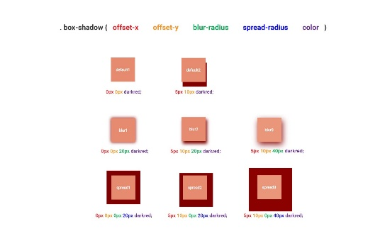 support multiple shadow.                                                                                                                                                                                                                                                                                                                                                                                                                                                                                                                                                                                                                                                                                                                                                                                                                                                                                                                                                                      |
| `vertical-align`                                                           | sets the vertical alignment of an element.                                                                           | by default browser try to align element based on their content text. 该属性可以设置`element`的`alignment`而不是基于`text`                                                                                                                                                                                                                                                                                                                                                                                                                                                                                                                                                                                                                                                                                                                                                                                                                                                                                                                                                                                                                                                                                                                              |
| `font`                                                                     |                                                                                                                      | `font-size` `font-style: italic;//斜体` `font-weight: bold;` `font-family`: word文档里面的字体；可以使用`google font`。使用多个是`font stack`，当前面的字体寻找失败将会用下一个字体。 `text-align: center;`                                                                                                                                                                                                                                                                                                                                                                                                                                                                                                                                                                                                                                                                                                                                                                                                                                                                                                                                                                                                                                    |
| `line-height`                                                              | set text line height.                                                                                                | `px`                                                                                                                                                                                                                                                                                                                                                                                                                                                                                                                                                                                                                                                                                                                                                                                                                                                                                                                                                                                                                                                                                                                                                                                                                                               |
| `text-decoration`                                                          |                                                                                                                      | `underline`,`line-through`                                                                                                                                                                                                                                                                                                                                                                                                                                                                                                                                                                                                                                                                                                                                                                                                                                                                                                                                                                                                                                                                                                                                                                                                                           |
| `text-align`                                                               |                                                                                                                      |                                                                                                                                                                                                                                                                                                                                                                                                                                                                                                                                                                                                                                                                                                                                                                                                                                                                                                                                                                                                                                                                                                                                                                                                                                                  |
| `white-space`                                                              | text wrap setting                                                                                                    | default is `normal`, autowrap `nowrap`;  but long word still can overflow box.                                                                                                                                                                                                                                                                                                                                                                                                                                                                                                                                                                                                                                                                                                                                                                                                                                                                                                                                                                                                                                                                                                                                                                       |
| **GRID AND FLEXBOX**                                                       |                                                                                                                      |                                                                                                                                                                                                                                                                                                                                                                                                                                                                                                                                                                                                                                                                                                                                                                                                                                                                                                                                                                                                                                                                                                                                                                                                                                                  |
| `display`                                                                  |                                                                                                                      | `block element` and `inline-block element` has the default value of it. **values:** `inline-block`: space needed. `block`: space entire line of container. `grid`: make a container to be `CSS Grid` always use in `div`. `flex`: make a container to be `CSS Flexbox`. `Grid` has rigid layout depend on the grid setting while `Flexbox` has flexible layout depend on element itself.                                                                                                                                                                                                                                                                                                                                                                                                                                                                                                                                                                                                                                                                                                                                                                                                                                               |
| `grid-template-columns`                                                    | when `display: grid;` set grid columns setting.                                                                     | `100px 1fr 2fr` means a column with `100px` width, and a column with `1` free space and `2` free space (total free space take up remaining of space, so it meanly divided remaining into `3` free space).  Grids have same height.  if more element put into grid bigger than the columns count, the overflow element will go to next row.  by default free space it will resize as the window width change but if not, it may due to some elements has fix width settled.  Use combination of these can make each item same width: `grid-template-rows: repeat(10, minmax(0, 1fr)); grid-auto-columns: minmax(0, 1fr); grid-auto-flow: column;`                                                                                                                                                                                                                                                                                                                                                                                                                                                                                                                                                                                                             |
| `flex-direction`                                                           | when `display: flex;`                                                                                               | when value is `row`, it has a difference that flex column don't need to set width and use element its own width while grid need to set width first.   **values** (default)`row`: lay element horizontally (lay element into row). similar to grid column.  `column`: lay element vertically.                                                                                                                                                                                                                                                                                                                                                                                                                                                                                                                                                                                                                                                                                                                                                                                                                                                                                                                                                           |
| `flex`                                                                     | set element auto width in flexbox.                                                                                  | same as `fr` in grid set at definition while flex only need to set it in each element style.                                                                                                                                                                                                                                                                                                                                                                                                                                                                                                                                                                                                                                                                                                                                                                                                                                                                                                                                                                                                                                                                                                                                                       |
| `flex-shrink`                                                              |                                                                                                                      | `0`: means don't auto shrink depends on elements.                                                                                                                                                                                                                                                                                                                                                                                                                                                                                                                                                                                                                                                                                                                                                                                                                                                                                                                                                                                                                                                                                                                                                                                                  |
| `justify-content`                                                          | set flexbox element horizontal align                                                                                 | **value:** `center`, `start`, `end`, `space-between`(each element evenly align horizontal space) 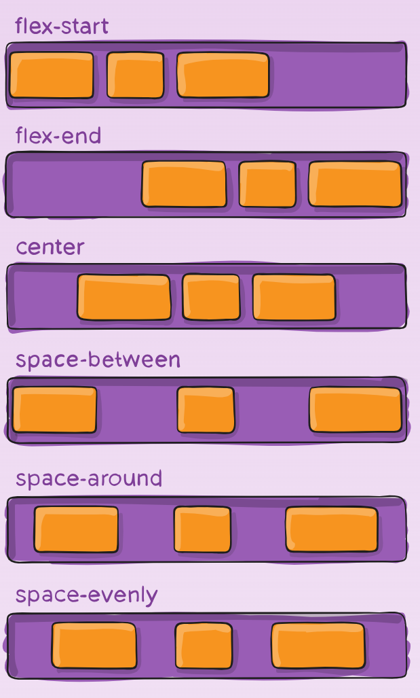                                                                                                                                                                                                                                                                                                                                                                                                                                                                                                                                                                                                                                                                                                                                                                                                                                                                                                                                                                                                                                                                                         |
| `align-items`                                                              | set flexbox element vertical align                                                                                   | **value:** `stretch`(default value, fill element height based on flexbox height), `start`(just take up vertical space they need to and at top of container), `end`(at the bottom of container), `center`                                                                                                                                                                                                                                                                                                                                                                                                                                                                                                                                                                                                                                                                                                                                                                                                                                                                                                                                                                                                                                                 |
| `column-gap`                                                               | set gap (or space) between two columns                                                                               | also has `row-gap`.                                                                                                                                                                                                                                                                                                                                                                                                                                                                                                                                                                                                                                                                                                                                                                                                                                                                                                                                                                                                                                                                                                                                                                                                                                |
| `flex-wrap`                                                                | auto wrap                                                                                                            | value: `wrap`, `nowrap`, `wrap-reverse`                                                                                                                                                                                                                                                                                                                                                                                                                                                                                                                                                                                                                                                                                                                                                                                                                                                                                                                                                                                                                                                                                                                                                                                                                |
| **IMAGE PART**                                                             |                                                                                                                      | only set width will automatically set image's height to keep original shape. but set both width and height will loose shape if you not to set some more attributes.                                                                                                                                                                                                                                                                                                                                                                                                                                                                                                                                                                                                                                                                                                                                                                                                                                                                                                                                                                                                                                                                              |
| `object-fit`                                                               | when image cannot fit the set width and height, the display style while keeping the origin shape of image.          | `contain`: shrink the image. `cover`:                                                                                                                                                                                                                                                                                                                                                                                                                                                                                                                                                                                                                                                                                                                                                                                                                                                                                                                                                                                                                                                                                                                                                                                                                |
| `object-position`                                                          | object position when it not display all because of auto adjust.                                                     | `bottom`, `top`, `left`, `right`                                                                                                                                                                                                                                                                                                                                                                                                                                                                                                                                                                                                                                                                                                                                                                                                                                                                                                                                                                                                                                                                                                                                                                                                                         |
| **POSITION PART**                                                          |                                                                                                                      |                                                                                                                                                                                                                                                                                                                                                                                                                                                                                                                                                                                                                                                                                                                                                                                                                                                                                                                                                                                                                                                                                                                                                                                                                                                  |
| `position`                                                                 |                                                                                                                      | **values:** `static`:  default value. will always at the back compare to `fixed`, `relative`, or `absolute` element.   `fixed`:  fixed the element sticking to the page even you scroll. it doesn't take space anymore, it is floating.  moving the fixed element around and resize you can set `bottom`, `top`, `left`, `right` property (relative to the browser windows size, so it will resize with window resize, while fixed using height and width).  `absolute`: also has the `bottom`, `top`, `left`, `right` property which to depends the element's position, but the difference to `fixed` is that it place relative to the container the `absolute` element in, not to browser window. if `absolute` element's container is page: 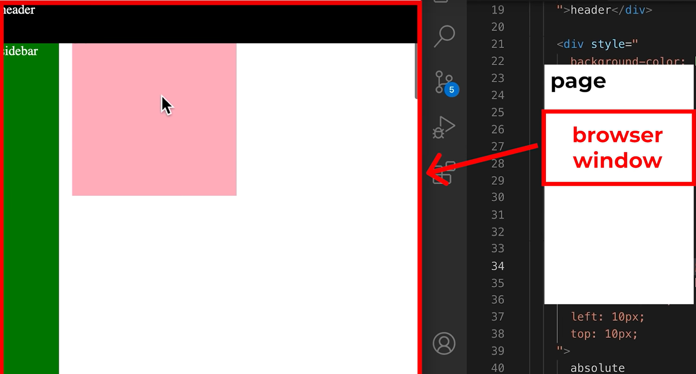  the `absolute` relative feature is useful when the `absolute` element is in the containing block.(if current container is not `relative` position, it will cascading search nearest containing block until the page) [MDN Web Docs - Containing block](https://developer.mozilla.org/en-US/docs/Web/CSS/Containing_block) 注意，`static`这个默认值不能形成一个`Containing block`，所以常常使用`relative`，来形成`Containing block`.   `relative`: like `static`, but can use `top`, `right`, `bottom`, and `left` property to make offset.   |
| `z-index`                                                                  | the priority of element is front or behind.                                                                         | default value is zero. more bigger more priority.  if parent has `z-index`, then only compare to parent rather than child `z-index` (so even the child has high `z-index`, but is invalid)                                                                                                                                                                                                                                                                                                                                                                                                                                                                                                                                                                                                                                                                                                                                                                                                                                                                                                                                                                                                                                                             |
| `all`                                                                      |                                                                                                                      | `unset` or `initial` [Stack Overflow - CSS all property](https://stackoverflow.com/a/65560812/18731746)                                                                                                                                                                                                                                                                                                                                                                                                                                                                                                                                                                                                                                                                                                                                                                                                                                                                                                                                                                                                                                                                                                                                                 |

#### Custom property

start with `"--"`

like `--background`

then can use `background-color: var(--background)`

give default value when not exist: `var(--background, red);`

#### CSS Values

Each `CSS` property has a set of values that are allowed (`background-color` allows color values,

`cursor` allows `solid`, `dotted`, `dashed`, etc.)

Here are some categories of values that are useful to know:

##### Color Values

###### 1. A color name

`red`, `white`, `black`

###### 2. RGB value

`rgb(0, 150, 255);`

`RGB` is a more precise way of measuring color. Every color can be created using a combination of red, green, and blue (`RGB`). In `CSS`, this is represented by `rgb(...);`

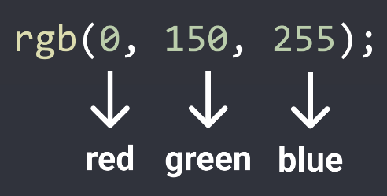

Each color has a min value = 0 and a max value = 255.

`rgb(0, 0, 0);` = black

`rgb(255, 255, 255);` = white

###### 3. Hex value

`Hex` is another way to write `RGB`.

Each character in `Hex` is base 16.

Using 2 characters, we can have 16 * 16 = 256 possible values from 0 - 255

This is the same range as `RGB` (0 to 255)

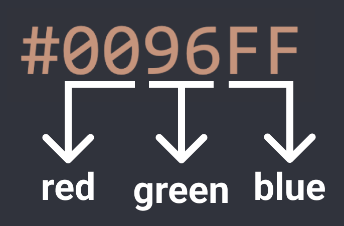

###### 4. RGBA value

`rgba(0, 150, 255, 0.5);`

Same as `RGB`, except with an additional a-value (alpha value). The a-value determines how see-through the color is. 0 = complete see-through, 1 = solid color and not

see-through, 0.5 = 50% see-through.

##### Measurement Values

more: [CSS Unit Guide - freeCodeCamp](https://www.freecodecamp.org/news/css-unit-guide/)

###### 1. Pixels

`50px`, `100px`

Pixels (`px`) are a common unit of measurement in the digital world. For example: a 4K screen is 3840px by 2160px.

###### 2. Percent

`50%`, `100%`

A **relative** measurement. For example, `width: 50%;` means 50% of the width of the page (or if the element is inside another element, 50% of the width of the container element).

###### 3. em / rem

`1em`, `1rem`

Relative measurements that are useful for accessibility.

`em` = relative to the font-size of the element (2em means 2 times the font size).

`rem` = relative to the font-size of the page, which is 16px by default (2rem means 2 times the font size of the page = 2 * 16px = 32px by default).

###### 4. vh

View height. `1vh` is 1% of the height of the viewport.

###### 5. vw

View width. `1vw` is 1% of the width of the viewport.

##### "Remove" set property

`unset`, `initial`

#### CSS Specificity

`CSS` property has priority when multi styles set in.

`CSS` selector that's more specific has higher priority.

class name selector > element name selector

#### CSS Responsive design

##### Media Query

```css
@media (max-width:600px)
{
    //css code
}
```

意思是screen width 小于或等于600px时，使用这里面的`CSS`样式。

还可以 `(max-width:600px) and (min-width:300)`

`min-width` 就是大于或等于时

#### Inheritance

A text property set on the outer element will be passed down into inner elements:

```html
<div style="color: red;">
    <p>Paragraph</p>
</div>
```

This paragraph will have red text.

For global text styles (styles we want on the entire page), we can set them on the `<body>`:

```css
body {
    font-family: Roboto, Arial;
    color: rgb(20, 20, 20);
}
```

All elements on the page by default will use

`font-family: Roboto, Arial` and `color: rgb(20, 20, 20)`. This can be overridden.

### 实例

#### 将两元素一个居左一个居右

```css
container {
    display: flex;
    width: 100%;
    justify-content: space-between;
}
```

#### 动态元素水平垂直居中

```css
.dynamic-center {
    position: absolute;
    left: 50%;
    top: 50%;
    /* 设置元素的相对于自身的偏移度为负50%(也就是元素自身尺寸的一半)*/
    transform: translate(-50%, -50%);
}
```

#### 创建固定于顶部和底部的Header和Footer

```css
.fixed-header, .fixed-footer{
    width: 100%;
    position: fixed;
}

.fixed-header{
    top: 0;
}

.fixed-footer{
    bottom: 0;
}
```

其中header可以换成

```css
.fixed-header{
    position: sticky;
    top: 0;
    width: 100%;
}
```

缺点：中间content部分需要自行调整上下的padding，不然会被header和footer盖住一部分。

最佳方案：

```css
.container {
    display: flex;
    flex-direction: column;
    height: 100vh; //如果别人需要嵌套，需要改成100%，否则高度需要有一个屏幕那么高
    //也可以采用下面的，注意父容器都必须有宽度，不然默认是0长宽，会导致子元素的%写法计算得出0。
    width:100%;
}

.header{

}

.body{
    flex: 1;
    position: relative;//用于形成containing block
    width:100%;
    height:100%;
}

.body-content{
    position: absolute;
    left: 0;
    right: 0;
    top: 0;
    bottom: 0;
    overflow: auto;
}

.footer{

}
```

#### 使得一个子div在父元素底部

```css
#outerdiv {
    position:relative;
}

#innerdiv {
    position:absolute;
    bottom:0;
}
```

但不建议。

另一种方法是，父容器使用column flex，子div使用`margin-top: auto;`即可

```css
body {
    display: flex;
    flex-direction: column;
}

#footer {
    margin-top: auto;
}
```

#### 文字下面一条线

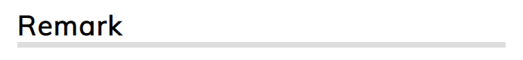

```html
<h2 style="border-bottom: 5px solid #dddddd;">Remark</h2>
```
