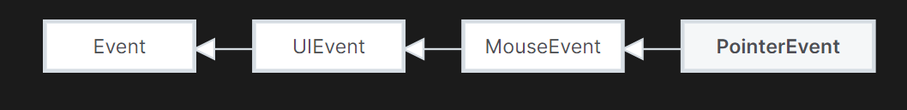

# 概念

Node.js是JavaScript运行时，类比于JVM之于Java，CLR之于C\#。

它是可以在Server-Side执行javaScript（Client-Side是使用浏览器执行）

因此和Vue.js、React、Angular这些JavaScript库不一样。

#### 框架

v8 引擎解释执行 js 代码，提供桥梁接口。（Chrome浏览器也是使用V8引擎）

libuv 库处理异步模型：事件循环、事件队列、异步IO。

第三方模块：zlib、http、c-ares等

typescript 是 javascript 的当前最受欢迎的中间语言，提供了强大灵活的类型系统，typescript 提供一个编译器 tsc 可以将 typescript 编写的代码编译成 javascript。除了 typescript，你可能还听过 coffescript, flow, dart 等 javascript 的中间语言。它们都可以通过它们的编译器编译成原生 js，原生 js 也叫 vanilla js。

# JavaScript

通常情况下，JavaScript脚本是被用户下载到本地，使用浏览器进行执行的脚本。但node.js可以在服务端执行JavaScript。

严格模式通过在脚本或函数的头部添加 “use strict”; 表达式来声明，严格模式下你不能使用未声明的变量。

HTML中使用script包含时，需要按顺序包含script。

## 语言版本

ES 6 等于 ES2015

ES 7 等于 ES2016

以此类推, 年份减一就对了.

通常 ES 6 以后大家都用年份来称呼了.

ES6 是一个大改版, 往后的版本都是添加一些特性而已.

目前 2022 年, 主流游览器都支持 ES 2017 所有特性. 所以可以放心用.

## DOM

### Element

document.querySelector()方法的返回值就是Element基类

<https://developer.mozilla.org/en-US/docs/Web/API/Element>

### 事件

分为pointer event(包含触控、鼠标等事件)

| 事件名      | 事件作用                                     | 备注                                                                                                                                                                                                                                                                                                                                                                                                                     |
|-------------|----------------------------------------------|--------------------------------------------------------------------------------------------------------------------------------------------------------------------------------------------------------------------------------------------------------------------------------------------------------------------------------------------------------------------------------------------------------------------------|
| contextmenu | 打开鼠标右键菜单（实际就是鼠标右键点击事件） | 捕获后使用 e.preventDefault() 可以阻止默认的打开鼠标右键操作。 preventDefault实际上是Event基类的方法，可以阻止未显式Handle事件的调用默认功能的方法，但仍会向下传播，除非调用stopPropagation()  e.target.click(); 可以模拟目标点击，将右键变左键点击。(Element基类的方法) 还可以使用 e.target.dispatchEvent( new MouseEvent('click', { bubbles: true, cancelable: true, view: window, })) （EventTarget Interface的方法） |
|             |                                              |                                                                                                                                                                                                                                                                                                                                                                                                                          |
|             |                                              |                                                                                                                                                                                                                                                                                                                                                                                                                          |
|             |                                              |                                                                                                                                                                                                                                                                                                                                                                                                                          |
|             |                                              |                                                                                                                                                                                                                                                                                                                                                                                                                          |

## 语法糖

**模板字符串**

模板字符串相当于加强版的字符串，使用反引号 \`，除了作为普通字符串，还可以用来定义多行字符串，还可以在字符串中加入变量和表达式。

模板字符串中的换行和空格都是会被保留的

-   **插入变量和表达式**

let info = \`我是\${name},我\${age + 1}岁了。\`

-   **标签模板**

标签模板，是一个函数的调用，其中调用的参数是模板字符串

func\`hello world\`

相当于

func([‘hello world’]) //传入的竟然是array

当含有变量时，会将字符串分割成字符串array，并把变量放在最后一起传入

func\`我是\${name},我\${age + 1}岁了。\`

相当于

f(['我是',',我 ',' 岁了。'],'哥斯拉',1001);

#### es6-string-html

/\*html\*/ //这里就是指明下面的\`\`包的是html，IDE可以高亮语法

\`

\<div\>…\</div\>

\`

### 空相关

#### Nullish coalescing operator (??)

The nullish coalescing (??) operator is a logical operator that returns its right-hand side operand when its left-hand side operand is null or undefined, and otherwise returns its left-hand side operand.

#### Optional chaining (?.)

The optional chaining (?.) operator accesses an object's property or calls a function. If the object accessed or function called is undefined or null, it returns undefined instead of throwing an error.

#### 判断变量是否存在

#### 空及未定义变量检查及默认赋值

对 Null、Undefined、Empty 这些值的检查

### 同时为多个变量赋值

### true时调用函数

### 延展操作符(Spread operator)

从ES6开始添加的。可以在函数调用/数组构造时, 将数组表达式或者string在语法层面展开；还可以在构造对象时, 将对象表达式按key-value的方式展开

#### 打包

#### 解包

### 字符串转换为数字

### 解构赋值

### Shorthand function properties

## 语法

### 变量

定义到外面的变量都是全局的，而且如果export出去，object类型的还是同一个对象。

#### 变量提升(variable hoisting)

变量首先有三种状态：created创建，initialize初始化（为undefined或刚开始声明的值），赋值

JavaScript引擎的工作方式是，先解析代码，获取所有被声明的变量，然后再一行一行的运行，这造成的结果，就是所有的变量的声明语句，都会被提升到代码块scope的头部。

##### var

var 声明的变量会提升到当前代码块的最上层，**创建**并**初始化**为undefined。

##### let

let helps you avoid the variable hoisting in javascript and keep your variables' scope at just where it needs to be.

建议都使用let替代var。

let声明的变量，也会提升到当前代码块的最上层，先进行创建但不初始化。

在for循环中，let和var表现不同

##### const

与let类似，不同的是它没有赋值状态，即只能初始化一次，后续不可更改。

### 判断

#### Strict equality

If the operands are of different types, return false.

If both operands are objects, return true only if they refer to the same object.

If both operands are null or both operands are undefined, return true.

If either operand is NaN, return false.

Otherwise, compare the two operand's values:

Numbers must have the same numeric values. +0 and -0 are considered to be the same value.

Strings must have the same characters in the same order.

Booleans must be both true or both false.

#### Loosely equality

If the operands have the same type, they are compared as follows:

Object: return true only if both operands reference the same object.

其他类型直观

If one of the operands is null or undefined, the other must also be null or undefined to return true. Otherwise return false.

If one of the operands is an object and the other is a primitive, convert the object to a primitive using the object's @@toPrimitive() (with "default" as hint), valueOf(), and toString() methods, in that order. (This primitive conversion is the same as the one used in addition.)

At this step, both operands are converted to primitives (one of String, Number, Boolean, Symbol, and BigInt). The rest of the conversion is done case-by-case.

### 函数

匿名函数function () {} 也可以写成 () =\> {}

普通函数直接function func1(para1, para2) {}

异步函数async function funcAsync1() {}，内部使用await。

函数参数可以有默认值

#### 函数提升

和变量提升类似，函数声明也会提升到代码开头。

#### 自带函数

Object.entries()

该特性可以把对象转换成一个由若干对象组成的数组。

Object.values()

输出对象的键值，类似于C\#的Dictionary.Values()。

**类**

#### static

In ES2022 we now have static initialization blocks

### 循环

for (let num of nums){}

for (let index in nums){}

nums是array的话，of是取每个实际对象，而in是取index

### 注释

<http://itmyhome.com/js/han_6570_fang_fa_zhu_shi.html>

/\*\*

\* Take screen shot on specific url.

\*

\* @param {string} url the url to take screen shot of.

\* @return {Object} 返回值描述

\*/

## Decorators

@decorator

class A {}

// 等同于

class A {}

A = decorator(A) \|\| A;

## 常用接口

### Json

JSON.stringify()

JSON.parse()

## 类型

### 类型转换

There are 6 types of objects:

Date

Array

可以使用Boolean()方法

| 类型对象名 | 其他类型值 | 转换成的布尔值                              |
|------------|------------|---------------------------------------------|
|            | undefined  | false                                       |
|            | null       | false                                       |
| Boolean    | 布尔值     | 不用转换                                    |
| Number     | 数字       | 0，NaN转化成false，其他数字类型转换成true   |
| String     | 字符串     | 只有空字符串''转换成false，其他都转换成true |
| Objact     | 对象       | 全部转换为true                              |

undefined 和 null toString后是”undefined”和”null”，这点和C\#大相径庭

### String

padEnd()

trim()

substring()

includes()

replace() //只replace一次

replaceAll()

### Objects

类似于字典，但其实就是对象，它之中包含很多属性，甚至方法。

const obj = {name:”test”, age:15}

然后使用就可以obj.name诸如此类。

### Arrays

const obj = [1,2,3]

map方法可以遍历数组并对每个元素使用传入的方法

filter方法，类似于C\#中的Where，不过它直接返回了filter后的array。

| 方法                                       | 功能                                                                                            | 备注                                                  |
|--------------------------------------------|-------------------------------------------------------------------------------------------------|-------------------------------------------------------|
| array.push(element0, element1,…, elementN) | adds one or more elements to the end of an array and returns the new length of the array.       |                                                       |
| array.slice()                              |                                                                                                 | slice() //shallow copy slice(start) slice(start, end) |
| array.length                               |                                                                                                 |                                                       |
| array.includes(element[, start])           | same as List.Contains                                                                           |                                                       |
| array.unshift()                            | adds one or more elements to the beginning of an array and returns the new length of the array. |                                                       |

**DOM(Document object)**

JavaScript representation of the structure of HTML.

document这个对象中有很多elements，可以使用querySelecotr()方法过滤出想要的元素。

这些包含的方法叫做BrowserAPI。

-   **element**

addEventListenser() //给该元素对象添加事件

style

### 模块化开发（ES Modules）

