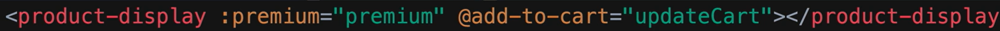
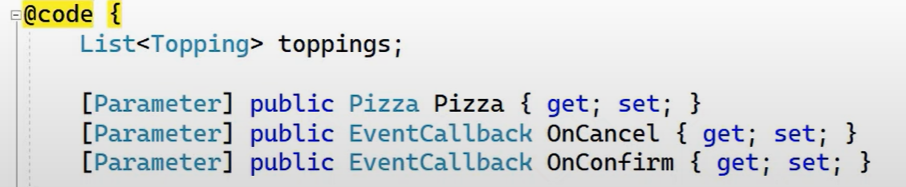
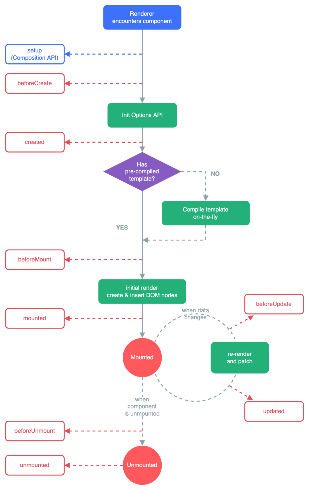
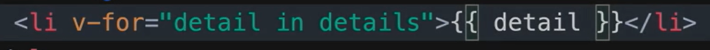
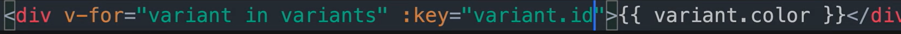

# Vue

## `Vue CLI`

```bash
npm install -g @vue/cli

vue create xxxx

npm run serve

npm run build //build出dist文件夹，拷贝到web服务器wwwroot服务下进行host即可
```

Previewing Locally：

The easiest way to preview your production build locally is using a `Node.js` static file server, for example `serve`:

```bash
npm install -g serve

# -s flag means serve it in Single-Page Application mode
# which deals with the routing problem below
serve -s dist
```

### 环境变量

[Environment Variables and Modes | Vue CLI](https://cli.vuejs.org/guide/mode-and-env.html#using-env-variables-in-client-side-code)

`.env.Production`和`.env.Development`中的变量，只有以`VUE_APP_`开头的才会写死进去，其他的需要自行设置环境变量。

但比较麻烦：

[Pass environment variable into a Vue app at runtime - Stack Overflow](https://stackoverflow.com/questions/53010064/pass-environment-variable-into-a-vue-app-at-runtime)

## Vue2

### Vue对象

```javascript
const app = new Vue({
    el: "#app", // hook html scope to this vue instance.
    data: {}, //define reactive properties. 注意在Component中是用的data()，因为使用function return出来的是unique的data instance，而data定义的则是同一个instance。  
    methods: //如果是import的methods，可以直接写进去，不需要再写圆括号及body
    {
        xxx(){},
        foo(){} // usually use in v-on callback function.
    },
    watch:
    {
        a: (val, oldVal) => {},
        b: function(val) {},
        c: {
            immediate: true, //可以立即触发变更handler
            handler(val) {
                // ...
            }
        }
    },
    computed:
    {
        xxx1: function () {},
        xxx2() {}, //ES2015 shorthand Don't use arrow function ()=>{} for computed, it will cause the wrong context (not current Vue instance).Change to function () {} then it should work fine.
    }
})
```

### Component

注意`Style Scoped`，会导致style只作用于当前component，不会穿透到其他引用的component去。

如果要穿透就多写一个normal的style

### `$`

文档中vm是指的Vue对象本身，是`var vm = new Vue(...)`后的。

而this是在Vue对象内部用的，所以一般都用的是this来指代Vue对象。

#### `$data`, `$props`

`$` is for public instance properties:

`$data`:

`$props`:

`beforeUpdate`、`updated`两个钩子是data或props变动而导致的，所以如果component中未引用到data或props（定义了但未使用），不会造成刷新。

#### `$refs`

```javascript
//获取DOM对象 document.getElementById('#id')
//但这里其实是用的ref去获取
```

```html
<div id="myDiv" ref="myDiv"></div>
```

```javascript
this.$refs.myDiv
```

还可以`this.$refs["myDiv"]`

#### `$on`, `$emit`, `$off`

You can only pass props to a direct child component, and

you can only emit an event to a direct parent.

but vue3 provide a new way that support two way: [Provide / Inject | Vue.js](https://vuejs.org/guide/components/provide-inject.html)

直接用`this.$refs.childComoponent.method`就行

```javascript
this.$on(event, callback)
```

一般写在`created`, `mounted`方法中

```javascript
this.$emit(eventName, [...args])
```

```javascript
this.$off( [event, callback] )
```

Remove custom event listener(s).

If no arguments are provided, remove all event listeners;

If only the event is provided, remove all listeners for that event;

If both event and callback are given, remove the listener for that specific callback only.

一般写在`unmounted`方法中

### Lifecycle


#### Lifecycle Hooks

In `Vue 3` `beforeDestroy` and `destroyed` hooks are replaced with `beforeUnmount` and `unmounted`

### Debug

`VSCode` 需要

`vue.config.js`

```javascript
configureWebpack:{
    devtool: 'source-map'
},
```

需要先`npm run serve`后再进行Debugger连接

## Vue3

A `JavaScript` framework to bring reactivity and web components, we chose `Vue.js`.

### Vue对象

```javascript
const app = Vue.create({})
```

创建一个Vue app对象，在html中script可以mount这个app对象到指定的DOM中去

比如`app.mount('#xxx')` //其中传入的是`CSS Selector`，返回的是这个mountedApp对象

其中定义的`data()`方法，返回的对象中的属性，是reactive的，原理是Vue的`Reactivity System`。

Properties returned from `data()` become reactive state and will be exposed on `this`.

`v-bind`是one-way binding，即`data()`返回的资源更新，会更新到页面。

`v-model`是two-way binding，即前台的变化也会作用到`data()`中的对象属性中去。

`v-model`是

```html
<input
    :value="text"
    @input="event => text = event.target.value">
```

的简写

`methods`属性中可以定义vue对象将会用到的方法，比如事件回调函数（用于`@xxx="method"`）。

回调函数中可以使用`this.xxx`去访问data中的对象

`computed`属性中可以定义computed properties（以方法的形式），方法名就是其computed property，可以在`{{ xxx }}`等地方使用。当计算属性中提及的属性变化时，会带动计算属性进行更新。（依赖收集管理的功能）

`mounted()`方法类似于blazor中的`OnInitialized()`，当component被mounted会调用。

### Component对象

```javascript
//app是vue对象
app.component('html tag name', {})
```

包含`template`属性，接收字符串，返回html内容，使用`es6-string-html`

也有和vue对象一样的`data`方法、`methods`、`computed`属性

定义暴露给html tag上的attribute：

使用`props`属性，

```javascript
props: {
    //attribute名
    premium: {
        type: Boolean,//type validation
        required: true
    }
},
```

#### 导入Component

```javascript
import xxxx from './ChildComp.vue'
```

然后直接使用`<xxx/>`即可

##### 事件传递





component中的method触发的事件，要传递到外部，需要使用`this.$emit('事件名'[, payload])` ，然后使用组件的时候用`@`监听即可，payload会自动传入所指定的方法。

### `SFC` (Single-File Components)

In most build-tool-enabled Vue projects, we author Vue components using an `HTML`-like file format called `Single-File Component` (also known as `*.vue` files, abbreviated as `SFC`). A Vue `SFC`, as the name suggests, encapsulates the component's logic (`JavaScript`), template (`HTML`), and styles (`CSS`) in a single file.

### API Styles

`Options API`与`Composition API`

`Options API`是对`Composition API`进一步的封装，更加面向对象。但`CompositionAPI` 更加灵活。

`Composition API`就是import vue中需要用到的方法，用传统js的方式来进行。

`Composition`实际上是`VUE3`才有的，适合做大项目。

### Composition API

```vue
<script setup> //作用：https://vuejs.org/guide/essentials/reactivity-fundamentals.html#script-setup
import { xxx } from 'vue'

// component logic
// declare some reactive state here.
</script>
```

| Name          | Function                                                                                          | Remark                                                                                                                                                                                                                                             |
|---------------|---------------------------------------------------------------------------------------------------|----------------------------------------------------------------------------------------------------------------------------------------------------------------------------------------------------------------------------------------------------|
| `reactive()`    | Objects created from `reactive()` are `JavaScript Proxies` that work just like normal objects         | `const counter = reactive({  count: 0 })`  `counter.count++`  `<div>{{counter.count}}</div>`  only works on objects (including arrays and built-in types like `Map` and `Set`).                                                                          |
| `ref()`         | can take any value type and create an object that exposes the inner value under a `.value` property | `const message = ref('Hello World!')`  `message.value = 'Changed'`  `<div>{{message}}</div>`//不需要使用`.value` 其实区别在于`ref`声明一个值，`reactive`声明对象{}？  还用于template ref： `<p ref="p">hello</p>` 此时首先要定义 `const p = ref(null)`     |
| `watch()`       | can directly watch a ref, and the callback gets fired whenever target's value changes.            | `watch(count, (newCount) => {  // yes, console.log() is a side effect  console.log(\`new count is: \${newCount}\`) })`                                                                                                                              |
| `defineProps()` | declare the props the component accepts                                                           | `const props = defineProps({  msg: String })` 或 `msg: {  type: Boolean,//type validation  required: true  }` 可以单独传入Type validation，也可以传入配置对象。  it is compiler macros only usable inside `<script setup>`. Do not need to be imported |
| `defineEmits()` | emit events to the parent                                                                         | `<ChildComp @eventXXX="(msg) => xxx = msg" />`                                                                                                                                                                                                    |

### Lifecycle



#### Lifecycle Hooks

`onMounted`, `onUpdated`, and `onUnmounted`.

### 模板语法

在html tag 的content中，使用`{{xxx}}`

**vue模板语言可以使用`JavaScript`语言**，比如 `message.method()`等 这个就是先执行然后`ToString()`？的感觉

在`HTML Attribute`中，则需要使用

`v-bind` directive进行双向绑定

```html

```

| directive        | function                               | remark                                                                                                                                                                                                                                                                |
|------------------|----------------------------------------|-----------------------------------------------------------------------------------------------------------------------------------------------------------------------------------------------------------------------------------------------------------------------|
| `v-bind:xxx`       | bind 原生html attribute 到model        | **shorthand: `:xxx`**                                                                                                                                                                                                                                                   |
| `v-if`             | vue中html的if else，如果真，显示       | 可以和`v-else`、`v-else-if`连用，指定fallback element                                                                                                                                                                      |
| `v-show`           | used for toggling elements' visibility | 和单独使用`v-if`一样。 但是`v-if`是add或remove element from dom，而`v-show`是隐藏（css中`display:none`），所以效率更高                                                                                                                                                        |
| `v-for`            | foreach iterator                       |  复制自身，tag的content中可以访问迭代对象 `(item, index) in items` 还可以获得index？ 如果需要使用一个无实际意义的for作为头（如在ul列表中的li对象外层），使用`<template></template>`，然后key放在真正的for item tag上。 |
| `v-bind:key`       | 迭代的DOM对象给予Key值                 | 可以增强效率，原先在foreach迭代后，列表进行更新，如果没有指定key值，则会删除再新增，而当有key值追踪后，只需修改。                                                                                                      |
| `v-on:*eventName*` | listen event                           | 比如`v-on:click="method name"` method name是vue对象中的methods属性中定义的方法 还可以传入参数到method中去 **shorthand: `@eventName`**   `@submit.prevent`：其中submit是form的submit事件，可以由button `type=submit`触发 prevent是modifier，用于prevent browser refresh。      |
| `:style`           | `v-bind:style`                           | 传入的是style object: `{backgroundColor: variable}` //Camelcase 因为`JavaScript`对象的key不能是`-`号 或使用`{'background-color':variable}` //Kebab形式，需要两边加quote                                                                                                       |
| `:class`           | `v-bind:class`                           | 类似于`:style`的用法，传入的是class object: `{classname: Boolean(指示前面的class name是否追加到class属性中)}` 已有的class属性不会被清除  还可以使用ternary operator： `[Boolean ? classname : '' ]`                                                                         |
| `v-model`          | two-way binding                        | 用于`<input>` `<textarea>` `<select>`等地方，其显示的内容会作用到绑定的`data()`方法上的model字段上去   `v-model.number`指示内容会被转换会number然后再映射给model                                                                                                          |
| `ref`              | Template refs                          | The template ref is only accessible after the component is mounted.  `<p ref="p">hello</p>` 此时首先要定义 `const p = ref(null)` 然后就可以在`OnMounted`钩子中访问p对象了 `onMounted(() => {  p.value.textContent = 'mounted!' })`                                       |
| `:xxxx`            | attribute值                            | 对于任意attribute： `VUE2`中：值为`false`或`null`的，不显示attribute。 `VUE3`中，值为`null`的不显示，`false`的显示`xxx="false"`                                                                                                                                                     |

