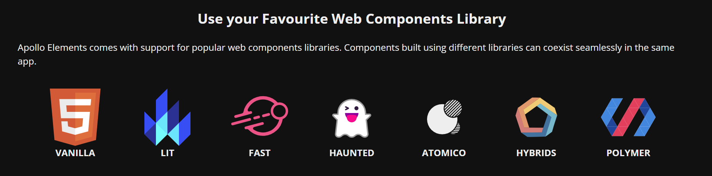

# Web Component

## Web component




[Awesome Lit - General Resources](https://github.com/web-padawan/awesome-lit#general-resources)

Design System

[UI5 Web Components](https://github.com/SAP/ui5-webcomponents)

[Red Hat Design System](https://github.com/RedHat-UX/red-hat-design-system)

[Shoelace](https://github.com/shoelace-style/shoelace)

[Vaadin Web Components](https://github.com/vaadin/web-components)

### Slot

```html
<my-component>
    <div> Content1 </div>
    <div> Content2 </div>
    <div slot = "name"> Content3 </div>
    <div slot = "name"> Content3 </div> //还可以多次使用同一个name的slot
</my-component>
```

在`my-component`的定义里面

```html
<div>
    <slot> Fallback </slot> Content1将出现的地方 如果没有指定，则显示Fallback
    <slot></slot> Content2 将出现的地方
    <slot name= "name" ></slot> Content3将出现的地方
</div>
```

### 自定义已封装的Component

[How to extend and style existing LitElements - Stack Overflow](https://stackoverflow.com/questions/60266303/how-to-extend-and-style-existing-litelements)

```javascript
import '@lion/button/define';
import {css} from 'lit-element'
import {LionButton} from '@lion/button'

class MyCustomButton extends LionButton {
    static get styles() {
        return [
            super.styles,
            css`
                :host {
                    background-color: red;
                }
            `,
        ]
    }

    constructor() {
        super()
    }
}

customElements.define('my-button', MyCustomButton);
```

`shadow dom`的特性，外界的`css`无法影响到`web component`内部的`css`，防止`css`污染。

但可以通过配置解决，让外界可以污染。

### Shadow Dom

`shadow dom`最外面一层相当于父元素，传入的style（element style）优先级不如里面的高，所以里面定义的style外面改不了。

默认情况下外界的样式（比如使用class选择器）无法污染到`web component`里面的样式，需要进行配置？

[Styling a Web Component | CSS-Tricks](https://css-tricks.com/styling-a-web-component/)

可以在`html`或`body`、`element`选择器等， `--custom` 变量可以穿透

## Webpack

`webpack`可以将各种前端框架的源码（需要支持`webpack`的），打包为`dist`文件夹，然后直接放到`nginx`等web服务器`wwwroot`文件夹下进行host即部署完毕。

## 设计

### Diagrams.net

**Diagrams.net** (formerly `draw.io`) is a powerfull app designed to [create diagrams and flowcharts](https://www.diagrams.net/).

[Diagrams.net - Adding icons (Font Awesome, Twemoji)](https://roneo.org/en/diagrams.net-adding-icons-font-awesome-twemoji)
