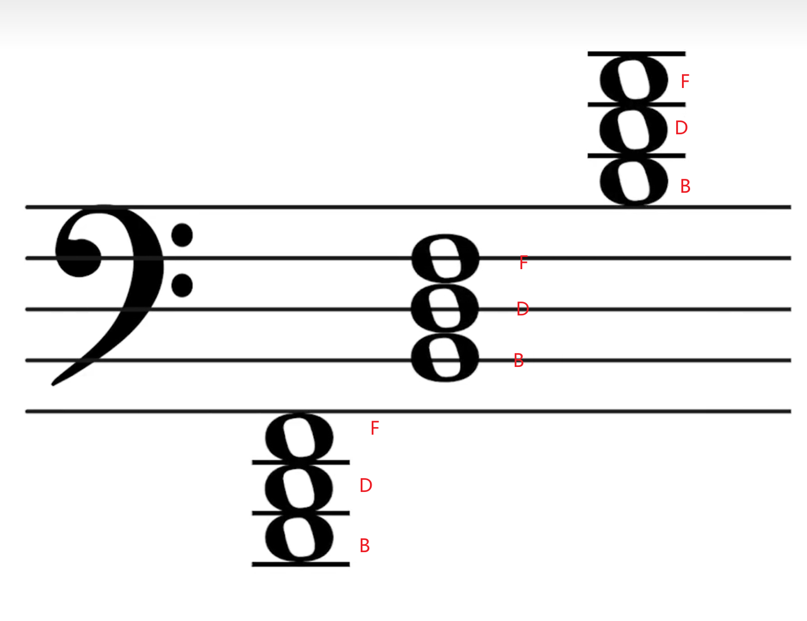

# 术语

速度：BPM beats per minutes; 每分钟有多少拍。

小节：一定数量的节拍组成一个小节。

## 节拍

4/4 下面表示以四分音符为一拍，上面表示每小节有四拍

节拍，乐曲中表示固定单位时值和强弱规律的组织形式。又称拍子。每小节中强拍和弱拍的循环称二拍子；强拍、弱拍 、弱拍的循环称三拍子。表示每小节中基本单位拍的时值和数量的记号，称拍号。拍号的上方数字表示每小节的拍数，下方数字表示每拍的时值。

例如，2/4表示以4分音符为1拍 ，每小节有 2 拍。拍号中时值的实际时间，应视乐曲所标速度而定。在不同节拍类型中，每小节只有一个强拍的叫做单拍子，如2/4、2/8是单2拍子，3/4、3/8是单3拍子。每小节有一个强拍并有次强拍的叫做复拍子。 如 4/4、6/8是复 2 拍子，9/8、9/16是复3拍子。

单位拍时值相同而拍数不同的单拍子组合在一小节内，叫做混合拍子。例如5/4是由2/4+3/4或3/4+2/4组合而成，7/8是2/8+2/8+3/8或3/8+2/8+2/8组合而成等等。

中国民族民间音乐称节拍为板眼。其种类有一板一眼 、一板三眼、有板无眼、无板无眼等。一板或一眼都是一拍 。一般而言，板、眼的位置与上述强拍、弱拍位置相当，但并不都意味着符合强、弱拍循环的规律。

# 认谱

知识来源@科学钢琴阿洗：[【阿洗】看五线谱还在从中央C开始数音？一个视频记住超多音符！_哔哩哔哩_bilibili](https://www.bilibili.com/video/BV1Bv411k7bH/)

要快速认出五线谱，基本是根据音的相对关系来的，比如知道中央C在哪里，很自然的能知道上面和下面音是哪个。知道的中央C（do）这个叫做“地标（landmark）”，五线谱中地标越多，认谱越快。

如何快速建立多个地标？

#### 高音谱号

高音谱号又叫G谱号，它由字母G演变而来，可以用于定位中央G（sol）在哪里

#### 低音谱号

由字母F演变而来，两个小冒号其实是F（fa）的两个杠，可以用来定位F的位置

#### Do对称关系

高低音谱号在以前是可以移动的，用于确定中央G和低音F的位置，如果移动到不同的线，其他音符的相对位置也会跟着改变。但现在基本已经不移动了，被固定在如下图的位置上，这种结构好处是他们从中央C上下延伸下去。这样的结构，有一个很特别的特性——所有的do呈现上下对称的关系。

#### FACE认谱法（高音谱表）

高音谱表上的所有线间的音名组成单词FACE

#### 贝多芬认谱法（低音谱表）

BDF对应的就是si re fa

#### +2认谱法（低音谱表）

按高音谱表读，然后+2度音。

#### mi fa sol la 定位法（低音和高音谱表）

#### 相对距离与线间关系（八度以内）

钢琴键盘上三度

两个音之间只会有线间关系相同或不同两种情况，且只有三度（挨在一条线/间）、五度（隔一条线/间）、七度（隔两条线/间）才会线间关系相同（**即都在线上或都在间上**），二度、四度、六度线间关系不同（**即有一个在线上有一个在间上**）

#### 结构识谱

最基础的三和弦，它的结构是三个音根据三度关系连接组成和弦，即根音、三音、五音。

根音可以在任何音上。

这里以根音do为例（C和弦）举例，三和弦一共有三种形式，即原位、第一转位（根音高八度）、第二转位（根音、三音高八度）。

**转位是从低级音开始往上高八度，所以这里第二转位不能想象成是五音低八度**

总结来说，三度音程在下面的是第一转位，三度音程在上面的是第二转位，可以直观的反应到键盘上：

属七和弦是比较特殊的一类重要和弦，它由每个调的第五级音（**必定是第五级音做根音**）往上开始以三度关系叠四次构成（所以每个调只有一个属七和弦），它具有一种不和谐但让人产生期待的感觉，当下一个音是稳定的和弦，就会给人“舒服”的感受。

以C大调为例，属七和弦一共有三种转位。观察规律可以看到，总是保留了根音和第七音，然后可选省略五音和三音

#### 找出所有升降号口诀

升号：fa do sol re la mi si 4152637

降号：si mi la re sol do fa 7362514

# 规化练习

# 调（Scale）

**调式音级的名称**

| 级别    | 名称   | 英文         | 注解                                                                                                                                                                                                                                                                                                                                                                                                                                      |
|---------|--------|--------------|-------------------------------------------------------------------------------------------------------------------------------------------------------------------------------------------------------------------------------------------------------------------------------------------------------------------------------------------------------------------------------------------------------------------------------------------|
| 第I 级  | 主音   | tonic        | 调性的核心                                                                                                                                                                                                                                                                                                                                                                                                                                |
| 第II 级 | 上主音 | supertonic   | 主音上方相邻的音，因为在左边主音的上方                                                                                                                                                                                                                                                                                                                                                                                                    |
| 第III级 | 中音   | mediant      | 主音和属音之间的音，这个名称的由来推测源于它位于主音与属音之间                                                                                                                                                                                                                                                                                                                                                                            |
| 第IV 级 | 下属音 | subdominant  | 主音下方纯五度的音，之所以也叫属音，是因为它与右边的主音1的关系，等同于5与左边的主音1的关系，只是方向相反。4与右边主音1的和谐度是仅次于属音5的                                                                                                                                                                                                                                                                                            |
| 第V 级  | 属音   | dominant     | 主音上方纯五度的音，主音1和5的音程是7个音里最和谐的，因此5相当于1的次级存在                                                                                                                                                                                                                                                                                                                                                               |
| 第VI 级 | 下中音 | submediant   | 主音和下属音之间的音，与中音3同理，只是方向相反。                                                                                                                                                                                                                                                                                                                                                                                         |
| 第VII级 | 导音   | leading tone | 向上倾向于主音的音，是最靠近主音1的一个key，用于将旋律引导到主音1。过去的西方音乐家在研究调性乐理的时候，发现主音和属音的调只相差了1个升号或降号，例如你从C大调/A小调演奏的时候，如果切换到G大调/E小调，那么会很直观的发现，大部分键位都没有改变，在同一个音区内只有1个白键需要切换成黑键。而这个需要额外升降的键，恰好是新调的导音。如果从G大调/E小调继续往右走，切到D大调/B小调，那么新调也会多一个导音黑键，每切一个调就会多一个导音。 |

**纯五度：见音程，记住两个音之间是7个半音，不能单纯用数白键数。**

调（scale）分大（major）小（minor）两类，分自然（natural）、旋律（melodic）、和声（harmonic）三种。

**自然大调**：CDEFGAB，它们之间是全全半全全全半的间隔。

**自然小调**：abcdefg，它们之间是全半全全半全全的间隔

##### 快速认出五线谱调号

**升号调：**

1.升号调中后一个要升的音比前一个要升的音**高纯五度**。（从左向右读）

2.升号调中最后一个要升的音，**再升高半音**，就是调名。

**降号调：**

1.降号调中后一个要降的音比前一个要降的音**低纯五度**，注意到这里说的是“低”五度，正好与升号调相反。（从左向右读）

2.降号调中，除F大调外，**倒数第二个要降的音**，就是调名。

**用法：**

第1条规律用来写调号，只需要记住第一个要升的音是F，第一个要降的音是B，按顺序来说，升号调就是4152637，降号调就是7362514，刚好相反。

第2条规律用来判断调名，当给定曲子的调号以后，直接知道调名是什么。

比如看到这个调号：

一共2个升号，\#F、\#C，最后一个就是\#C，在它的基础上再升高半音就是D，所以叫“D大调”；

再看这个调号：

一共5个升号，\#F、\#C、\#G、\#D、\#A，最后一个就是\#A，在它的基础上再升高半音就是B，所以叫“B大调”。

比如看这个调号：

一共3个降号，bB、bE、bA，倒数第二个要降的音就是bE，所以叫“降E大调”；

再看这个调号：

一共6个降号，bB、bE、bA、bD、bG、bC，倒数第二个要降的音就是bG，所以叫“降G大调”。

如果是小调，则去五度循环圈中寻找与大调的对应关系。

原理见[五度循环圈](#五度循环圈)。

##### 首调唱名法

也叫做“可动do体系”，该体系是以do re mi fa sol la si do代表大调音阶的音列。无论什么调性，只要是大调，其第I级音（主音）就唱做do，其V级音（属音）唱做sol等。以Ｃ为主音，简谱的调号记法为 1 = C，同理，以E为主音就是 1＝E

##### 音的稳定性与倾向性

一个大调七个音 最稳定的是主音 稳定性排序：（D大调D是主音，C大调C是主音）

稳定————————\>不稳定

1 5 3 6 2 4 7 （相对于大调来说的）

音的倾向性：

红色为不稳定性音

## 音程

上图中展示的是自然音程。**在自然调式音阶中各音能构成的音程，叫自然音程**。

音程的名称是由**形容词+度**来组成的

### "度"的判别
度的判别在谱子上，是不看升降号，直接根据距离来看的：

这说明度数和键盘位置没有关系（这里是没有明确形容词，单纯看度数）

这说明和升降号也没关系。

### "形容词"的判别

#### 方式一
自然音程的**形容词** **纯**、**小**、**大**、**增**、**减** 都是依据某个自然调式内的音来说的。
比如从C大调来看，从x到y有几个白键就是几音程（数音程从1数，数包含几个半音从0数）

所以**并不是说有多少个半音就是哪个音程**，是先看是哪个音程，再根据**半音数**来判断是哪个具体的音程。

另外还有"增五度"等音程关系，但它和"小六度"一样，半音数都是8个。决定某两个音是小六度还是增五度，要看这两个音是否离调（即是否是自然音程）。比如大调中，`1`和`#5`的关系是增五度，而`3`和`高八度1`的关系是小六度

> 增五等带增、减的不属于自然调式音阶音程的音程，属于变化音程

#### 方式二

> 口诀快速判别法。在自然大调音阶内适用

**在自然大调音阶**里，每个音距第一个音的距离，都只会是完全（纯，perfect），或是大（major）音程。

如C大调：

其他大调中同理。

另外还可以发现一个规律：

> 一个箭头代表音程高/低一个半音。

**减**再低一个半音称为**倍减**，**增**再高一个半音称为**倍增**。

注意，这个1458、2367的这张图规律，是仅适用于从该大调第一个音距离音阶内其他音的距离。
如若要判别钢琴上的4和7音，要先将4想象为F大调，然后再利用1458口诀。7音在F大调是调外音，所以是变化音程，可看作从F大调的四音高半音，或五音低半音，再根据1458口诀，即4与7之间是增四或减五度。

### 音程转位
度数相加等于九，大小增减是互换

#### 三全音

三全音指的是音程增四度减五度，这两个音程都包含三个全音，所以叫三全音(Tritone)。

音程上三个全音的距离 (六个半音)，也就是增四度 (augmented fourth) 或减五度 (diminished fifth)。 例如：C - F\# 或者说 C - Gb 的距离。这个音程的声响特性就是极度的不安定、诡异。音乐之父巴赫用魔鬼、地狱、痛苦、销魂等来形容。在以前的教会音乐中被禁止使用，因为听起来像在歌诵撒旦。古典乐作曲家都会避开这个音程。

# 钢琴

## 钢琴踏板

### 制音器踏板 damper pedal（最右边的）
举起钢琴中所有琴键的制音器。
即延音踏板，三角和立式钢琴一样。

因为琴槌子是羊毛做的，有厚度，所以在制音器和弦还有接触期间，可以控制制音器的影响程度。

> 踩踏板也有是为了共振声，让声音不显得干燥。有点类似于ECHO的EQ
#### 细节
根据制音器原理，我们需要先按下后再踩踏板，而且更换和弦的时候，也是等下一个音按下后再换踏板。

而且更细节的是，换踏板的时候并不是踩下后马上就换，因为制音器下去之后不能立马能把声音制住（物理）。所以要等前面声音消除再重新踩下踏板（否则声音容易浑浊）。

##### 共振
琴弦有自己的频率，琴弦听到相同的频率的音会进行共振（比如C弦会和C同频率的音频产生共振）
当制音器抬起来的时候，琴弦就可以产生共振了。
共振产生的原因除了琴弦的泛音，还有的就是**琴键的敲击音**，它是无固定频率音频，所以包含很多种频率声音，会使得很多琴弦产生共振。
因此如果过早踩下制音器踏板，会使得声音宽阔或浑浊（高音区偏薄，可以提前踩下变厚）。
#### 建议

- 踏板不需要完全踩下去，最多踩到制音器完全抬起来就够。踩到底会增加换踏板的难度。
- 放踏板太快会有嘣的一声杂音，因为砸到琴弦产生震动
- 如果放踏板太快导致了嘣杂音，又迅速抬起，那这由于琴弦产生震动的杂音会继续留下，还有踏板铁块砸到木头的杂音产生的共振等，使得声音非常浑浊。
- 快速踩下踏板到底，也会有杂音
- 快速的分解和弦踩踏板为了避免杂音可以将前面几个音按住来达到晚踩踏板的目的。一般晚0.2秒踩音色就会有很大不同，变干净。
- 如果踏板必须要踩很久，使得声音不可避免变浑浊，可以弹弱一点。
- 可以抖动来制音的同时保证后续声音的宽广不干燥。

### 持续音踏板 sostenuto pedal（中间的）
**三角钢琴：** 把当下刚好在空中的制音器，继续停留在空中。

**立式钢琴：** 完全不是这个踏板的作用，而是放了一块布，将声音变闷，用于不吵到邻居用，非演奏用。这里的踏板称为 practice pedal

### 柔音踏板 soft pedal （柔音踏板）
**三角钢琴：** 把键盘和琴锤右移。会产生变化：原本中高音区可以敲到三条弦，踩下去后只响了两条。另外，因为琴锤是羊毛做的，中间敲的多的凹进去了，变硬了，而右移一点会用新的羊毛部分敲，声音更柔和。
**立式钢琴：** 把琴锤朝弦拉近，理论上更难弹大声。但其实没啥用，不会改变音色，最多改变一丢丢声音大小。

> 在谱子上柔音踏板记号是`una corda`