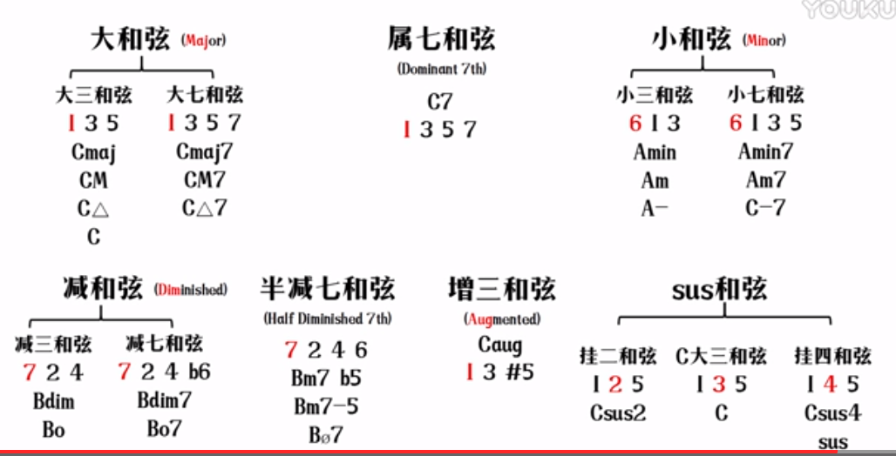

# 和弦
[这些常见的和弦标记你都认识吗？ - 知乎 (zhihu.com)](https://zhuanlan.zhihu.com/p/346693351?utm_id=0)

几个音组成**和音**，一系列和音连续行进，就是**和声**；

目前的和弦是按照「三度叠置」来结合的（即一个音距下一个音的音程是小三或大三）

## 和弦标记方式

一般来说，一个和弦由三个部分构成，即和弦的**根音**、**属性**以及**变化部分（部分和弦适用）**。

如`Cm7(♭5)`和弦，**C**是其和弦的**根音**，**m7**是其和弦的**属性**，即小七和弦，而后面括号里的变化部分**♭5**则是表明这个和弦里的五音应该**降低半音**。需要注意的是，括号里的部分是部分和弦适用的，不是所有和弦都有。

## 和弦种类

### 大和弦

> `C7`不是大七和弦 是属七和弦

### 小和弦

### 增和弦

### 变化部分
带括号的变化部分可以看作是在前面和弦的基础上进行一定的音的变化。这种变化一般有**omit**和**升降音**两类。
#### omit
omit是指省略和弦中的某个音，其标记方式是在变化部分标上“**(omit+级数)**”
如`CM7(omit3)`和弦，就是忽略三音的大七和弦。
#### 升降
把和弦里的哪一级音进行升或降，就在括号里标上相应的记号。
如`Cm7(♭5)`和弦，本来是小三+大三，现在降了变成小三+小三，即减三，也就变成了半减七和弦。
括号内其实可以不止标注一个升降音。在有多个升降音的情况下，多个升降音之间可以用逗号隔开。
### 挂留和弦(sus和弦)
一般指用二度音或者纯四度音**代替**原来的三度音而排列组合成的和弦（挂留和弦中没有3音）。
挂留和弦分为**挂二和弦**(如Cmaj sus2) 与**挂四和弦**。
### 加音和弦(add和弦)

加音和弦是在三和弦的基础上加上一个三和弦和弦外音的和弦。
比如`Cadd9`。
其实也可以看作是C九和弦忽略掉7度音，即 `Cmaj9 (omit 7)`
而且 `Cadd2`也又可以看作是 `Cadd9`的转位。

### 三和弦、七和弦等

#### 概念

> 例如：`C E G` 三个音阶上构成的是大三和弦，`D F A`构成的是小三和弦，`B D F`构成的是减三和弦。

**根音：** 和弦结构里开始的音，比如C大三和弦是（C E G），C就是根音

**三音：** 和根音之间相差三度，大三和弦中间的叫做三音，比如C大三和弦的三音是E

**五音：** 和根音之间相差五度， 大三和弦第三个音叫做五音，比如C大三和弦的五音是G

**高叠和弦：** 九和弦、十一和弦等。九和弦是5个音按三度叠置（距离九度）。没有十五和弦（因为叠置到自己了）

#### 大三和弦

> 大三度+小三度
> 音程：**大三度**和**纯五度**

C大三和弦写作`Cmaj`或`Cmajor`，简写是大写字母`C`。

#### 小三和弦(**m**)

> 小三度+大三度
> 音程：**小三度**和**纯五度**

D小三和弦写作`Dmin`或`Dminor`，简写是`Dm`。

#### 减三和弦(**dim**)

> 小三度+小三度
> 音程：**小三度**和**减五度**

B减三和弦写作`Bdim`或`Bdiminished`，简写是`Bo`。

#### 大七和弦(**M7**)

> 大三度+小三度+大三度（大三和弦+大三度）
> 音程：以**大**三和弦为基础，根音与七音相距为**大七度**
> "全称"：大大七和弦

C大七和弦写作`Cmaj7`，简写`CM7`

#### 大小七和弦(属七和弦, Dominat 7th, **7**)

> 大三度+小三度+小三度（大三和弦+小三度）
> 音程：以**大**三和弦为基础，根音与七音相距为**小七度**

G属七和弦写作`Gdom7`，简写`G7`

因为在和声大小调、自然大调旋律小调中常常**以属音作为根音**，因此它也称为**属七和弦**。

注意严格来说这类只有以属音为根音时的大小七和弦才能称作的属七和弦。其他的大小七和弦都含调外音。

#### 小七和弦(**m7**)
> 小三度+大三度+小三度（小三和弦+小三度）
> 音程：以**小**三和弦为基础，根音与七音相距为**小七度**
> "全称"：小小七和弦

D小七和弦写作`Dmin7`，简写`Dm7`

#### 半减七和弦(减小七和弦，**Ø7**)

>  小三度+小三度+大三度（减三和弦+大三度）
>  音程：以**减**三和弦为基础，根音与七音相距为**小七度**

B半减七和弦写作`BØ7`
因为它经常以**导音**作为根音，所以它也称为**导七和弦**

至于为什么叫半减七，因为目前还是减小七，并不是真正的减七，减七其实是减减七。

另外还有通俗叫法 “小七减五和弦”，这里小七是指小七和弦，减五是指五音距根音减五度，结合起来就是`m7-5`，也就是指半减七和弦。

### 肯定含调外音的
#### 增三和弦(**aug**)

> 音程：**大三度**和**增五度**。这里有调外音了。

#### 减减七和弦(**dim7**)

> 小三度+小三度+小三度（减七和弦+小三度）
> 音程：以**减**三和弦为基础，根音与七音相距为**减七度**

可简称为 **减七和弦**

#### 增大七和弦(**△7（#5）**)

> 音程：以**增**三和弦为基础，根音与七音相距为**大七度**

#### 小大七和弦(**mM7**)

> 小三度+大三度+大三度（小三和弦+大三度）
> 音程：以**小**三和弦为基础，根音与七音相距为**大七度**

X小大七和弦写作`XminMaj7`,简写`XmM7`

### 和弦级数

几级指的是和弦的级数，就拿`C`调来说，当`1=C`的时候，`C`和弦就是一级和弦，`Dm`是二级，`Em`是三级，`F`是四级，`G`是五级，`Am`是六级，级数一般用罗马数字来标记

要说几级就 要先看是什么调

比如C调 `C Dm Em F G Am B` 分别是1到7级

如果是G调的话 和弦的级数又会改变

`G Am Bm C D Em F` 分别是1到7级

是什么调 什么调就是1级 然后就从1级开始推

以此类推

### 和弦转位

> 标记方式：和弦根音/和弦最低音
> 一般来说和弦最低音是转位后的和弦内音。但也有可能出现和弦外音做最低音。
#### 三和弦转位

**原位：** 根音在第一位的时候 表示原位（C E G ），写作`C`

**第一转位：** 三和弦的三音在最低音，是第一转位（E G C），写作`C/E`

**第二转位：** 三和弦的五音在最低音，是第二转位（G C E），写作`C/G`

#### 七和弦转位

**原位：** 根音在第一位的时候表示原位（C E G B），CM7

**第一转位：** 七和弦的三音在最低音，是第一转位。

**第二转位：** 七和弦的五音在最低音，是第二转位。

**第三转位：** 七和弦的七音在最低音，是第三转位。

可以把转位想象成一个圆环，圆环上写作四个音，然后看转位就很方便，比如C→E→G→B ，第一转位选择是E→G→B→C，最终结果是EGBC。

C大调和弦

# 调式音阶
## 五度循环圈

从C大调开始看，CDEFGABC，一个完整的八度空间，把前四个CDEF分为一组，GABC分为另一组，两组间关系都是全全半，且刚好F、G之间是全音关系，那么CDEFGABC即全全半全全全半，构成自然大调特性，开始音是C，所以是C自然大调。

如果把G作为起始音，GABCDEFG，发现G全A全B半C全D全E半F全G，如果把F与E、G的关系改为全、半，那将绝杀。如果把F换成上移半音变为\#F，那么就构成了全、半关系！即GABCDE F\# G，是G大调。我们发现，C大调变成G大调，只需要升高一个音即可，且**恰好这个升高的音在调号的左边**（即G大调升的音是F，即F\#，F\#升高半音恰好变为G，就找到了调号G），这就是升号类大音阶口诀的来源。

而且C变为它的**纯五度**G大调只需改变一个音的半音这种特性，实现转调非常快速，所以也是(纯)五度循环圈的原理的来源（顺时针是升高纯五度（7个半音），逆时针是降纯五度（7个半音），都只需要在原来的基础上升降一个音的半音，所以转调非常快速）。

降号类音阶口诀来源不同，但基本原理同理，比如CDEFGABC，往下纯五度是到了F开头，即CDEFGABCDEFGAB，是F全G全A全B半C全D全E半F，需要将B降半音，可以组成F大调F G A Bb C D E F。这个规律不好推，我们记住这一个B降半音的情况，是F大调，然后继续在F大调的基础上降纯五度，到了Bb大调。即Bb开头，变成了Bb C D Eb F G A Bb，降半音是E变为Eb，我们也能发现一个递推关系，比如Bb大调降的半音是Eb，我们可以看它前一个F大调降的半音是Bb，恰好是Bb大调的调性（这是一个规律），所以就有了“看降号类音阶的倒数第二个降的是谁，该调就是什么大调”这个口诀。（除了第一个F大调的降半音要记忆是Bb，就像递推公式要记忆第一项一样）

> 五度音一起发声时的和谐度仅次于纯一度和纯八度

> 三全音是最不协和的

### 记忆方式

九空格记忆法：

先是FA-DO-SOL-RE-LA-MI-SI  
背诵上来的分别是4152637

[【乐理笔记】九宫格五度圈以及四度圈 - 哔哩哔哩 (bilibili.com)](https://www.bilibili.com/read/cv11395029/)

## 自然小调（悲伤）

主音和三级音如果构成的是大三度，就是大调，若是小三度，就是小调

## 关系大小调

例如a小调和C大调 构成音都是在白键上，而其主音不同。

a小调主音是A （A B C D E F G）

而C大调主音是C （C D E F G A B）

则可以称C大调是a小调的关系大调，同理a小调是C大调的关系小调

有多少个大调就有多少个关系小调

有一个规律：大调的六级是关系小调的主音

# 和弦套路

## 和弦色彩

和弦最基础的形式就是调内音隔一个按一个这样三度叠置来的。比如`C`调最为明显，全是白键。

每个调内有七个根音组成的最基本的和弦，我们从`C`调的七个三和弦出发，分别弹奏，感受和弦色彩，我们可以感受到，
1级、4级、5级和弦色彩开心
2级、3级、6级和弦色彩伤心
7级不好形容。

然后分析每级和弦音之间的音程关系，可以发现开心组是大三+小三，伤心组是小三+大三。因此**和弦听感与构成音之间的音程关系有关**。

> 大三和弦和小三和弦的命名根据的是根音和第二音之间的音程关系

所以大调音阶从一级开始三和弦属性总是：
大三、小三、小三、大三、大三、小三、减三
Imaj, IImin, IIImin, IVmaj, Vmaj, VImin, VIIdim
相应的，A小调（音与C大调一样）的组成色彩可以对照的写出：
Imin, IIdim, IIImaj, IVmin, Vmin, VImaj, VIImaj

相对的大调音阶七和弦属性总是：
大七、小七、小七、大七、属七、小七、半减七

> 所以对于某个自然大调内的和弦某级和弦是什么类别和弦，可以直接道出。

对于自然小调的七和弦，五级有点特殊，常常会使用一个调外音让它强行变为了属七和弦（本来是小七）。此时自然小调音阶也就变为了**和声小调音阶**

## 和弦功能

`I级和弦`有让音乐开启或终止的功能。
`IV级和弦`有让音乐开启的功能。大调小调的四级和弦类型总是和一级和弦一致，比如在大调中都是大七和弦，小调中都是小七和弦，因此色彩相似。

`V级属七和弦`有强烈的使音乐回到`I级和弦`的倾向。（所以五级和弦通常可以从大三和弦变为相应的属七和弦增加强度和高级感）

不过这种倾向性不仅仅是五级和一级和弦特有，凡是某和弦级数与某和弦相减为四级的，都有这种倾向。（用相对的眼光来看，每个和弦自己当作是自己的一级，它有自己的五级和弦，它自己的五级和弦想倾向到自己）
如六级和弦到二级和弦，相差四级，则六级有到二级和弦的倾向。
三级到六级和弦，相差四级（3+7-6=4）
二级到五级、一级到四级、五级到一级等等。
其实也就构成了五度循环圈

**五度圈/四度圈：（大调）**

例子：

#### 卡农和弦进行 15634251
15634145
15634125

#### Leading bass（顺阶和弦公式）176543251

#### 4536251

#### 4736251
因为是7个，为单数，小节循环时候通常最后补一个一级的属七和弦，以增强倾向到开始的4。而结束的时候就是多加普通一级和弦以结束色彩结束。
恰好是五度循环圈的逆推。不过在大调音阶中，7级是减和弦，通常会将其换成五级和弦。

蒲公英的约定、演员

#### 6451（欧美王道）

#### 6415 （小室进行）
病变、夜空中最亮的星、我的天空、晴天、平凡之路、apologize、faded、say something、I need you love、despasito、

#### 1645（doo-wop进行）

#### 1451

#### 6545

#### 4566
