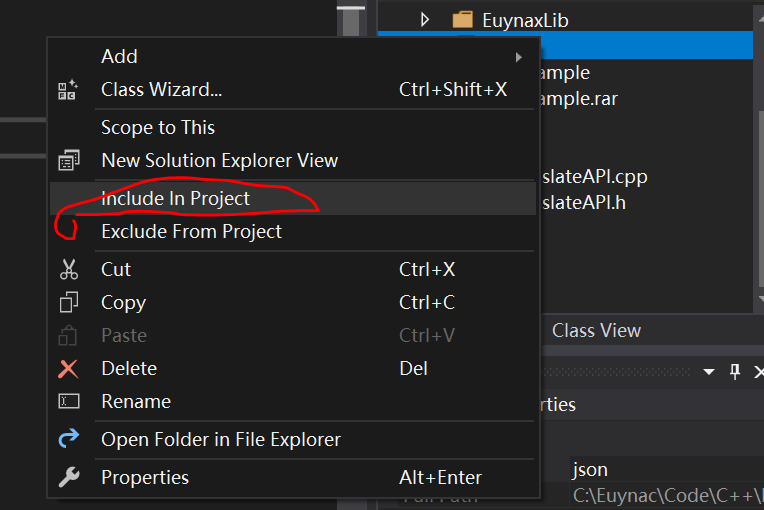

目录

[类Class](#类class)

[string类型](#string类型)

[向量vector](#向量vector)

[其他](#其他)

#### C++引入名字空间（namespace）

定义一个名字空间

namespace first

{

int a;

void f(){};

int g(){};

}

namespace second

{

double a;

double f;

char g;

}

int main()

{

first::a=2;

second::a=6.453;

}

有三种使用方法

① using namespace X;这句话后面使用都不需要使用前缀

② using X::name; 使用单个名字，那么后面使用name 不必加上前缀

③ 使用前加上前缀

#### 引入新的输入输出流 使用头文件 iostream

输出运算符\<\<

这种符号就像“流”一样，是数据从对象流到对象的方向。

输入运算符\>\>

cout代表标准输出流对象（屏幕窗口）

cin代表标准输入流对象（键盘）

标准库中的名字都属于标准名字空间std

\#include \<iostream\>

using std::cout；这样使用cout时不用加std::前缀

若使用

using namespace std;则后面cout cin都不需要使用前缀

int main()

{

double a;

cout\<\<"print"\<\< std::endl;

//endl 表示换行符，并强制输出

//有两个作用，一个是换行，一个是立刻输出，并刷新缓冲区

std::cin \>\>a;

cout\<\<a;

}

#### 变量“即用即定义” 且可以使用表达式初始化；

int main()

{

double a = 12\*3.25;

double b= a + 1.112;

a = a \* 2 + b;

double c = a + b \* a;

cout \<\<"c contains:"\<\<c\<\<endl;

}

#### 程序块{}内部作用域可定于与外部同名的变量，在该块里就隐藏了外变量；

int main(int argc, char const \*argv[])

{

double a;

cin \>\>a;

{

int a = 1;

cout \<\< a \<\< endl; 使用的是内部的a

}

cout \<\< a \<\< endl;使用的外部的a

return 0;

}

for 循环语句可以定义局部变量

int main(int argc, char const \*argv[])

{

int i=0;

for(int i = 0;i\<4 ;i++)可以说是一个程序块

{

cout\<\<i\<\<endl;

}

cout\<\<i\<\<endl;

for(i=0;i\<4;i++)

{

for(int i;i\<4;i++)

{

cout\<\<i\<\<" ";

}

cout \<\< endl;

}

return 0;

}

#### 访问和内部作用域变量同名的全局变量，要用全局作用域限定

double a =128;

int main(int argc, char const \*argv[])

{

double a=256;

cout \<\<"Local a:"\<\<a\<\<endl;

cout \<\<"Global a:"\<\<::a\<\<endl;//::是全局作用域限定

return 0;

}

#### 引用类型

C++引入了“引用类型”，即一个变量是另一个变量的别名；

引用经常用作函数的形参，表示形参和实参是同一个对象

int main(int argc, char const \*argv[])

{

double a = 3.1415927;

double \&b = a;//并不是取地址

b=89;

cout\<\<"a="\<\<a\<\<endl;//a和b是同一个内存块 则a=89；

return 0;

}

用于函数的例子

void swap(int \*x, int \*y)使用指针

{

int t=\*x; \*x=\*y;\*y=t;

}

则调用函数时要swap(&a,&b);此时的&是取地址符

但是c++中使用引用类型

void swap(int \&x,int \&y)

{

int t=x;x=y;y=t;

}

swap(a,b);

此时x和y的内存实际上就是a和b的内存块；

还有一个作用，使用时没有数据拷贝的过程，只是直接引用，则可以提高程序效率

若使用&为了提高效率而不想影响实参时，可以使用const锁定

void change(double \&x,const double \&y,double z)

{

x=100;

y=200;错误，不可以修改常量

z=300;

}

#### inline关键字

对于不包含循环的简单函数，用inline关键字声明inline函数，编译器将内联函数调用用其代码展开，称为“内联展开”，避免函数调用开销，提高程序执行效率

inline double distance(double a, double b){

return sqrt(a\*a+b\*b);

}

int main(){

double k=6,m=9;

cout\<\<distance(k,m)\<\<endl;//并不是那种函数调用，直接替换；

和下面的代码一样

cout\<\<sqrt(k\*k+m\*m)\<\<endl;

return 0;

}

#### try-catch

通过 try-catch处理异常情况

正常代码放在try块，catch中捕获try块抛出的异常

int main(int argc, char const \*argv[])

{

int a;

cin \>\>a;

cout \<\<endl;

try{

if(a\>100)throw 100;

if(a\<10)throw 10;

throw "hello";

}

catch (int result)//int型只能捕获整数

{

cout\<\<"result is"\<\<result\<\<endl;

}

catch (char \*s){

//这才能捕获hello;

}

catch(...){

cout\<\<"其他异常情况在这里捕获"\<\<endl;

}

return 0;

}

#### 形式参数默认值

函数的形式参数可以有默认值，必须一律在最右边

double test(double a, double b = 9)

{

return a-b;

}

double test1(double a, double b= 9, double c)//错误，要靠最右

{

}

int main(int argc, char const \*argv[])

{

cout\<\<test(14,5)\<\<endl;

cout\<\<test(14)\<\<endl;

return 0;

}

#### 函数重载

C++允许函数同名，只要他们形参不一样（个数或对应参数类型）

调用函数时将根据实参和形参的匹配选择最佳函数；

如果有多个难以区分的最佳函数，则便会一起报错；

注意：不能根据返回类型区分同名函数

double add(double a, double b){

return a+b;

}

int add(int a,int b){

return a+b;

}

void add(int a,int b)//这个是无法区分的

//并不是按照返回类型而是根据形参类型区分的

int main(int argc, char const \*argv[])

{

double m=8,n=4;

int a=2,b=3;

cout\<\<add(m,n)\<\<add(a,b)\<\<endl;

return 0;

}

#### 运算符重载

关于operator：<https://www.cnblogs.com/wangduo/p/5561922.html>

1.  \#include \<iostream\>
2.  using namespace std;
3.  struct Vector2{
4.  double x;
5.  double y;
6.  }
7.  Vector2 operator \*(double a, Vector2 b){
8.  Vector2 r;
9.  r.x=a\*b.x;
10. r.y=a\*b.y;
11. return r;
12. }//operator \*重载了乘法
13. vector2 operator +(Vector2 a,Vector2 b){
14. Vector2 r;
15. r.x=a.x+b.x;
16. r.y=a.y+b.y;
17. return r;
18. }//operator +重载了加法
19. int main(int argc, char const \*argv[])
20. {
21. Vector2 k,m;
22. k.x=2;
23. k.y=-1;
24. m = 3\*k;
25. cout\<\<m.x\<\<m.y\<\<endl;
26. Vector2 n=m+k;
27. cout \<\<n.x\<\<n.y\<\<endl;
28. return 0;
29. }

#### 对输出流进行重载：

1.  \#include \<iostream\>
2.  using namespace std;
3.  struct Vector2{
4.  double x;
5.  double y;
6.  }
7.  ostream& operator \<\<(ostream& o,vector a){
8.  o \<\<a.x\<\<","\<\<a.y;
9.  return o;
10. }//ostream是输出流类型，则o是输出流类型，cout也是
11. 
12. int main(int argc, char const \*argv[])
13. {
14. Vector2 a;
15. a.x=25;
16. a.y=23;
17. cout\<\<a\<\<endl;//实际上编译起来是operator\<\<(cout,a);这种函数
18. //此时输出流已被重载，按上面定义的格式输出
19. return 0;
20. }

#### 模板(template)函数:

厌倦了对每种类型求最小值：

int minValue(int a, int b){

if(a\<b)return a;

else return b;

}

double minValue(double a,double b){

if(a\<b)return a;

else return b;

}

//可以转化为模板函数

//可以对任何能比较大小的类型使用该模板让编译器自动生成一个针对该数据类型的具体函数

template \<class T\>//定义模板函数，定义T是一个模板参数类型（泛指的类型）

T minValue(T a,T b){

if(a\<b)return a;

else return b;

}

int main(int argc, char const \*argv[])

{

int i = 3, j = 4;

cout \<\< "min of" \<\< i \<\< "and" \<\< j \<\< "is" \<\< minValue(i,j);\<\<endl;

double x = 3, y = 4;

cout \<\< "min of" \<\< x \<\< "and" \<\< y \<\< "is" \<\< minValue(i,j);\<\<endl;

return 0;

}

若是类型不一样...略麻烦

template\<class T1,class T2\>

T1 minValue(T1 a, T2 b)

{

if(a\<b)return a;

else return b;

}

则可以

cout \<\< i \<\< y \<\< minValue(i,y) \<\<endl;

#### 动态内存分配:

关键字new 和 delete 比C语言的malloc/alloc/realloc和free更好

new操作符从自由存储区（free store）上为对象动态分配内存空间，而malloc函数从堆上动态分配内存。自由存储区是C++基于new操作符的一个抽象概念，凡是通过new操作符进行内存申请，该内存即为自由存储区。而堆是操作系统中的术语，是操作系统所维护的一块特殊内存，用于程序的内存动态分配，C语言使用malloc从堆上分配内存，使用free释放已分配的对应内存。自由存储区不等于堆，如上所述，布局new就可以不位于堆中。

1.  \#define \_CRT_SECURE_NO_WARNINGS //windows
2.  \#include \<iostream\>
3.  \#include \<cstring\>
4.  using namespace std;
5.  int main(int argc, char const \*argv[])
6.  {
7.  double d =3.14;//变量d是一块存放double 值的内存块
8.  double \*dp;//指针变量dp：保存double类型的地址的变量
9.  //dp的值的类型是double \*
10. //dp是存放double \*类型的内存块
11. \*dp = 4.14;
12. cout \<\< \*dp \<\< , \<\< d \<\< endl;
13. cout \<\< "Type a number :";
14. cin \>\> \*dp;
15. cout \<\<\*dp\<\<,\<\<d\<\<endl;
16. dp = new double;
17. //new分配正好容纳double值的内存块（4或8个字节）
18. //并返回这个内存块的地址，地址类型是double\*
19. //这个地址被保存在dp中，dp指向这个新内存块，而目前这个内存块的值是未知的
20. \*dp = 45.3;
21. cout \<\<\*dp\<\<endl;
22. delete dp; //释放动态分配的double内存块
23. dp = new double[5];
24. //new分配了可以存放5个double值的内存块，返回这块连续内存的起始地址，而且指针类型是double\*，实际是第一个double元素的地址
25. dp[0]=4456;
26. dp[1]=dp[0]+123;
27. cout \<\<dp[0]\<\<,\<\<dp[1]\<\<endl;
28. delete[] dp;
29. //释放dp指向的多个double元素占据的内存块
30. //对每个double元素调用析构函数以释放资源
31. //缺少[]，只释放第一个double元素的内存块
32. 
33. int n = 8;
34. dp = new double[n];//new可以分配随机大小的double元素
35. //而静态数组则必须是编译期固定大小，c语言中定义时，用的只能是 double arr[20];而不能是double arr[n];
36. //然后就是数组使用了，略过
37. delete[] dp;
38. char \*s;
39. s = new char[100];
40. strcpy(s,"Hello!");
41. cout \<\< s \<\< endl;
42. delete[] s;
43. return 0;
44. }

## 类Class

是在C的struct类型基础上，增加了“成员函数”

C的struct可将一个概念或实体的所有属性组合在一起，描述同一类对象的共同属性

C++使得struct不但包含数据，还包含函数（方法）用于访问或修改类变量（对象）

PS：C++中的类更经常用class实现。struct更适合看成是一个数据结构的实现体，class更适合看成是一个对象的实现体。区别：https://www.cnblogs.com/starfire86/p/5367740.html

1.  struct Date
2.  {
3.  int d,m,y;
4.  void init(int dd,int mm, int yy){
5.  d=dd;m=mm;y=yy;
6.  }
7.  void print(){
8.  cout\<\<y\<\<"-"\<\<m\<\<"-"\<\<d\<\<endl;
9.  }
10. Date& add(int dd){ //成员函数返回“自引用”（\*this）
11. d = d+dd;
12. return \*this;
13. //this 是指向调用这个函数的类型对象指针
14. //\*this 就是调用这个函数的那个对象
15. //这个成员函数返回的是“自引用”，即调用这个函数对象本身
16. //通过返回自引用，可以连续调用这个函数
17. //day.add(3);
18. //day.add(3).add(7);
19. //返回的就是那个对象，那个对象被修改，而不是复制品（引用）
20. Date& operator+=(int dd){
21. d = d+dd;
22. }//类中的运算符重载
23. }
24. };//Date 类
25. int main(){
26. Date day;//定义一个类Date对象day
27. day.print();//通过类Date对象day调用类Date的print方法
28. day.init(4,6,1999);
29. //也可以day.d = 4;之类的；
30. day.add(3);
31. day+=3；//使用运算符重载后,实际上是day.operator+=(3);
32. day.add(3).add(5);
33. (day+=3)+=5;
34. day.print();
35. return 0;
36. }

另外：

1.  struct Date
2.  {
3.  int d,m,y;//若是类，这里称为成员
4.  Date(){//......
5.  
6.  }//同名函数，函数重载，参数不一样就行。
7.  Date(int dd,int mm, int yy){
8.  d=dd;m=mm;y=yy;
9.  }//和类名一样，且没有返回类型，则称为“构造函数”
10. void print(){
11. cout\<\<y\<\<"-"\<\<m\<\<"-"\<\<d\<\<endl;
12. }
13. //如果想要不定义多个 而又想让它能识别无参数、一个参数、两个参数、三个参数，那么可以给它个默认值：
14. Date(int dd=1,int mm=1,int yy=1900){
15. d=dd;m=mm;y=yy;
16. }
17. 
18. };//Date 类
19. int main(){
20. Date day2;//如果不写Date(){}那么会报错，提示没有默认构造函数
21. Date day(4,6,1999);//定义一个类的变量时，会自动调用构造函数。构造函数 ，是一种特殊的方法。主要用来在创建对象时初始化对象， 即为对象成员变量赋初始值，总与new运算符一起使用在创建对象的语句中。特别的一个类可以有多个构造函数 ，可根据其参数个数的不同或参数类型的不同来区分它们 即构造函数的重载。
22. day.print();
23. return 0;
24. }

例子二：

1.  \#define \_CAT_SECURE_NO_WARNINGS //若是不定义这个，使用strcpy会提示不安全
2.  \#include\<iostream\>
3.  \#include\<cstring\>
4.  struct student{
5.  char \*name;
6.  int age;
7.  student(char \*n = "no_name",int a=0){
8.  //不能直接 name=n;
9.  int len = strlen(n);
10. name = new char[len+1];
11. strcpy(name,n);//C语言的字符拷贝
12. age=a;
13. std::cout\<\<"constructor!"\<\<name\<\<std::endl;
14. }//这是构造函数
15. virtual \~student(){//析构函数，没有参数，前面有个波浪线 还有virtual关键字（貌似是虚函数，得另外学习学习）
16. std::cout\<\<"destructor!"\<\<name\<\<std::endl;
17. delete[] name;//防止内存泄漏
18. }//执行看看析构函数的调用顺序
19. }
20. void f()
21. {
22. student stu1;
23. student stu2("wang");
24. student stu3("zhang",23);
25. //函数执行完后，这些变量都会被销毁，会自动调用一个析构函数，若自己不写，自动生成的析构函数不会帮你释放被分配的内存，这样会导致内存泄漏
26. std::cout \<\< stu1.name\<\<"\\t"\<\<stu1.age\<\<std:endl;
27. std::cout \<\< stu2.name\<\<"\\t"\<\<stu2.age\<\<std:endl;
28. std::cout \<\< stu3.name\<\<"\\t"\<\<stu3.age\<\<std:endl;
29. return 0;
30. }
31. int main(int argc, char const \*argv[])
32. {
33. f();
34. //...
35. return 0;
36. }
37. 

class与struct的区别：

//class定义的类的成员默认都是私有的private，外部函数无法访问类对象成员或类成员函数

//接口：public的公开成员（一般是成员函数）称为这个类的对外接口，外部函数只能通过这些接口访问类对象private等非public的包含内部细节，不对外公开，从而可以封装保护类对象

1.  \#define \_CAT_SECURE_NO_WARNINGS //若是不定义这个，使用strcpy会提示不安全
2.  \#include\<iostream\>
3.  \#include\<cstring\>
4.  class student{//如果改成class，外部函数f()会无法访问，因为成员默认都是私有的，除非加上public，这样能起到保护作用
5.  //struct默认是public 所以可以被外部函数访问
6.  private://默认是私有的，其实可以不写
7.  char \*name;
8.  int age;
9.  public://若是不写，f()将无法访问构造函数
10. //public里的所有成员，称作student这个类的接口（对外界公开的）
11. char \*get_name(){return name;}
12. int get_age(){return age;}
13. void set_name(char \*n="new_name"){
14. //这里有个问题，修改的话，会比原来的长或短，那么要释放再分配新空间；
15. delete[] name;
16. int len=strlen(n);
17. name = new char[len+1];
18. strcpy(name,n);
19. }
20. void set_age(int new_age){age=new_age};
21. student(char \*n = "no_name",int a=0){
22. //不能直接 name=n;
23. int len = strlen(n);
24. name = new char[len+1];
25. strcpy(name,n);//C语言的字符拷贝
26. age=a;
27. std::cout\<\<"constructor!"\<\<name\<\<std::endl;
28. }//构造函数
29. virtual \~student(){//析构函数
30. std::cout\<\<"destructor!"\<\<name\<\<std::endl;
31. delete[] name;//防止内存泄漏
32. }//执行看看析构函数的调用顺序
33. }
34. void f()
35. {
36. student stu1;//每次定义一个类的对象，若是类中没有定义构造函数，系统会自动定义一个什么都没有的构造函数 即student (){} 所以若是class类，不改为public，将无法调用构造函数
37. student stu2("wang");
38. student stu3("zhang",23);
39. std::cout \<\< stu1.name\<\<"\\t"\<\<stu1.age\<\<std:endl;
40. //若是继续使用stu1.name来访问成员，是不行的，因为name和age都是private成员
41. //想要访问和修改，都需自己再定义一个函数来获得
42. std::cout \<\< stu2.get_name()\<\<"\\t"\<\<stu2.get_age()\<\<std:endl;
43. std::cout \<\< stu3.get_name()\<\<"\\t"\<\<get_age()\<\<std:endl;
44. stu1.age=15//这样会报错，因为是private成员
45. stu1.set_age(20);
46. stu1.set_name("Li");
47. return 0;
48. }
49. int main(int argc, char const \*argv[])
50. {
51. f();
52. return 0;
53. }

#### 拷贝

拷贝构造函数、赋值运算符（函数）

拷贝构造函数：定义一个类对象时使用同类型的另外对象初始化

赋值运算符：一个对象赋值给另外一个对象

student s;

...//对s的各种操作

student m(s);//这就是拷贝构造函数（m是新对象名称）

或

student k;

k = s;//这就是赋值运算符

大部分情况编译器自行生成的拷贝构造函数、赋值运算符函数没有问题，但有时也会出现一些状况

1.  \#include \<iostream\>
2.  \#include \<cstdlib\>
3.  using namespace std;
4.  struct student{
5.  char \*name;
6.  int age;
7.  student (char \*n = "name",int a = 0){
8.  name = new char[100];
9.  strcpy(name,n);
10. age = a;
11. }
12. virtual \~student(){
13. delete[] name;
14. }
15. }
16. int main(int argc, char const \*argv[])
17. {
18. student s;
19. student m(s);//（硬拷贝）直接调用编译器自动生成的拷贝构造函数可能会出错
20. cout \<\<s.name \<\<", age"\<\<s.age\<\<endl\<\<endl;
21. cout \<\<m.name \<\<", age"\<\<m.age\<\<endl\<\<endl;
22. //若使用编译器自动生成的拷贝构造函数，则会出错，因为这种拷贝是硬拷贝，直接让m.name = s.name(地址给它了)所以此时m.name 和s.name指向的是同一块内存
23. //此时调用析构函数时，delete[] m.name;后delete[] s.name 释放了两次同一块内存，因此报错
24. 
25. 
26. 
27. student k("John",26);
28. s = k;//也是直接s.name = k.name 出现与上面的情况一样
29. cout \<\< k.name\<\<", age "\<\<k.age\<\<endl\<\<endl;
30. 
31. 
32. return 0;
33. }
34. 
35. 
36. //因此我们要定义自己的拷贝构造函数或是赋值运算符
37. 
38. struct student{
39. char \*name;
40. int age;
41. student (char \*n = "name",int a = 0){
42. name = new char[100];
43. strcpy(name,n);
44. age = a;
45. }
46. student (const student \&s){
47. //name = s.name//这叫硬拷贝
48. name = new char[100];
49. strcpy(name,s.name);
50. age = s.age;
51. cout\<\<"拷贝构造函数"\<\<endl;
52. }
53. student& operator= (const student \&s){
54. //name = s.name//这叫硬拷贝
55. name = new char[100];
56. strcpy(name,s.name);
57. age = s.age;
58. cout\<\<"赋值运算符"\<\<endl;
59. return \*this;
60. }//调用这个函数时候 比如s=k 可以写成s.operator=(k)
61. 
62. virtual \~student(){
63. delete[] name;
64. }
65. }
66. 

#### 类体外定义方法（成员函数）

必须在类定义中声明，类体外要有类作用域，否则就是全局外部函数了！

1.  \#include \<iostream\>
2.  using namespace std;
3.  class Date{
4.  int d,m,y;
5.  public:
6.  void print();//声明一下
7.  Date(int dd = 1,int mm = 1,int yy = 1900){
8.  d = dd; m = mm; y = yy;
9.  cout\<\<"构造函数"\<\<endl;
10. }
11. \~Date(){cout\<\<"析构函数"\<\<endl;}//析构函数名是\~和类名，且不带参数，没有返回类型
12. //目前不需要做任何释放工作，因为构造函数没有申请资源，所以实际上可以不用写
13. }
14. void Date::print(){
15. cout \<\<y\<\<"-"\<\<m\<\<"-"\<\<d\<\<endl;
16. }//使用 Date::这个类的作用域来说明它不是全局函数，而是Date这个类的成员函数（方法）
17. int main()
18. {
19. Date day;
20. date.print();
21. return 0;
22. }

#### 类模板

我们可以将一个类变成“类模板”或“模板类”，正如一个模板函数一样

例子：

动态数组：

1.  \#include \<iostream\>
2.  \#include \<cstdlib\>
3.  \#include \<string\>
4.  using namespace std;
5.  class Array{
6.  int size;
7.  double \*data;
8.  public:
9.  Array(int s){
10. size = s;
11. data = new double[s];
12. }
13. \~Array(){
14. delete[] data;
15. }
16. double& operator{
17. if(i\<0\|\|i\>=size){
18. cerr\<\<endl\<\<"Out of bounds"\<\<endl;
19. //Cerr 一个ostream对象，关联到标准错误，通常写入到与标准输出相同的设备。默认情况下，写到cerr的数据是不缓冲的。Cerr通常用于输出错误信息与其他不属于正常逻辑的输出内容。
20. exit(EXIT_FAILURE);
21. //不用exit用throw也可
22. throw "Out of bounds";
23. }
24. else
25. return data[i];
26. }
27. }
28. int main(int argc, char const \*argv[])
29. {
30. int n;
31. cin \>\>n;
32. Array t(n);
33. t[0]=45;//如果没有使用operator重载运算符，那么就需要t.data[0]来使用了
34. 
35. return 0;
36. }
37. 
38. //这个动态数组的缺点是只能存放double类型的数据，若是要存其他类型，就得另写，那么使用模板类，可以很好的解决这个问题
39. template\<class T\>//将所有的double都换成T
40. class Array{
41. int size;
42. T \*data;
43. public:
44. Array(int s){
45. size = s;
46. data = new T[s];
47. }
48. \~Array(){
49. delete[] data;
50. }
51. T \&operator{
52. if(i\<0\|\|i\>=size){
53. cerr\<\<endl\<\<"Out of bounds"\<\<endl;
54. exit(EXIT_FAILURE);
55. throw "Out of bounds";
56. }
57. else
58. return data[i];
59. }
60. }
61. int main()
62. {
63. int n;
64. cin \>\>n;
65. Array\<int\> t(n);//类模板后加入两个箭头 写int就告诉编译器 把T替换为int
66. t[0]=45;
67. int m;
68. cin \>\>m;
69. Array\<string\> d(m);//string是c++的字符串类型，如果使用C的头文件是cstring
70. d[0]="Hello";
71. return 0;
72. }
73. 

## string类型

[**https://www.cnblogs.com/dongsheng/articles/2685114.html**](https://www.cnblogs.com/dongsheng/articles/2685114.html)**（方法大全）**

标准库中的类型

1.  \#include \<string\>
2.  \#include \<iostream\>//typedef std::basic_string\<char\> string;
3.  using namespace std;
4.  typedef string String;//给类型起别名
5.  
6.  int main(){
7.  string s1;//使用默认构造函数：没有参数或参数有默认值
8.  //这里s1默认是空字符串
9.  String s2("Hello");//普通构造函数
10. s1="HHHHH";//赋值运算符
11. String s3(s1);//拷贝构造函数
12. 
13. //可以自行cout看看
14. //string的其他初始化方法：
15. string s4("this is a C_string",10);
16. //first: argument C string
17. //second: number of characters
18. //作用是从first这个字符串中取前second来构造一个字符串
19. 
20. string s5(s4, 6, 4);
21. //1 C++ string
22. //2 start position
23. //3 number of characters
24. //作用是从s4这个字符串第六个字符开始取4个字符构成一个字符串
25. 
26. string s6(15,'\*');
27. //1 number characters
28. //2 character itself
29. //作用是 生成一个字符串，由15个'\*'组成
30. 
31. string s7(s4.begin(),s4.end()-5);
32. //1 start iterator(迭代器)
33. //2 end iterator
34. //作用是 构成一个字符串，从s4这个字符串的开始位置到它末尾位置往前推5个那个位置
35. 
36. string s8 = "hhhhhh";
37. //you can instantiate string with assignment
38. //就是普通的生成赋值
39. 
40. string s9 = s1+"hello"+s2;
41. //结果是string类型的对象（变量）
42. 
43. return 0;
44. 
45. }

访问字符串：

1.  \#include \<string\>
2.  \#include \<iostream\>
3.  using namespace std;
4.  int main(){
5.  string s = "hell";
6.  string w = "worl!";
7.  s = s +w;//s += w;
8.  //访问字符串：
9.  //方法一：下标
10. for(int ii=0;ii!=s.size();ii++)
11. cout\<\<ii\<\<""\<\<s[ii]\<\<endl;
12. cout \<\< endl;
13. //方法二：迭代器
14. string::const_iterator cii;//数据类型：常量迭代器
15. //若是string::iterator cii;则是非常量（普通的）迭代器，可以修改
16. //比如说可以这样修改\*cii='A'
17. int ii=0;
18. for(cii = s.begin();cii!=s.end();cii++)//指向字符串的起始位置
19. cout\<\<ii++\<\<" "\<\<\*cii\<\<endl;
20. return 0;
21. 
22. }

### 向量vector

1.  //vector 向量 用于表示一组数据（相当于数组，但其类型和大小是任意的）
2.  //vector是类模板
3.  \#include \<vector\>
4.  \#include \<iostream\>
5.  using namespace std;
6.  int main(){
7.  vector\<double\> student_marks;//类模板\<\>就这样用的qwq
8.  int num_students;
9.  cout \<\<"Number of students:"\<\<endl;
10. cin\>\>num_students;
11. 
12. student_marks.resize(num_students);//重新改变大小，一开始大小默认的是0；
13. for(vector\<double\>::size_type i=0;i\<num_students;i++){//i的数据元素类型是vector\<double\>这个类的作用域中的size_type这样一个类型，这个类型比较安全，像整形一样
14. cout\<\<"Enter marks for student \#"\<\<i+1\<\<":"\<\<endl;
15. cin\>\>student_marks[i];//可用下标访问
16. }
17. 
18. 
19. cout\<\<endl;
20. for(vector\<double\>::iterator it = student_marks.begin();it!=student_marks.end();it++)//用迭代器输出 为什么要使用迭代器呢？迭代器的作用用于遍历容器中的每个对象而不用考虑容器中对象的个数，而且保护数据不显示的表现出来。
21. cout\<\<\*it\<\<endl;
22. 
23. return 0;
24. }

#### 类的继承和派生

1.  //Inheritance继承（Derivation派生）：一个派生类（derived class）从1个或多个父类（parent class）/ 基类（base class）继承，即继承父类的属性和行为，但也有自己的特有属性和行为。如：
2.  \#include \<iostream\>
3.  \#include \<string\>
4.  using namespace std;
5.  class Employee{//定义一个雇员类
6.  string name;
7.  public:
8.  Employee(string n);//声明构造函数
9.  void print();//声明一个print方法（行为）
10. };
11. class Manager:public Employee{//雇员基础上派生出经理这个类，除了拥有雇员那些基础的属性和行为外，另有自己的属性和行为。Mangager继承了雇员这个类中的属性和行为，不需要再定义 name和print
12. //public继承是公有继承(public) 公有继承的特点是基类的公有成员和保护成员作为派生类的成员时，它们都保持原有的状态，而基类的私有成员仍然是私有的，不能被这个派生类的子类所访问。 还有其他的继承方式，具体自行查询
13. int level;
14. public:
15. Manager(string n,int l=1);
16. void print();//若是基类的print不满足要求（就是无法打印level）可以自己再重载它；
17. };
18. Employee::Employee(string n):name(n)//初始化成员列表
19. {
20. //那个:name(n)写在外面相当于
21. //name = n;写在里面
22. }//在类体外定义方法要加上类的作用域
23. void Employee::print(){
24. cout\<\<name\<\<endl;
25. }
26. 
27. Manager::Manager(string n,int l):Employee(n),level(l){
28. //写在外面那些相当于构造函数参数传递给那些成员
29. //即相当于写在里面的：
30. //name = n;//那个Employee(n)其实是调用了基类的构造函数
31. //level = l;
32. }
33. //派生类的构造函数只能描述它自己的成员和其直接基类的初始式，不能直接对基类的成员进行初始化
34. //例：
35. Manager::Manager(string n, int l):name(n),level(l){}//这样会报错，因为name(n)这是对基类的成员进行了初始化
36. 
37. void Manager::print(){
38. cout\<\<level\<\<"\\t";
39. //若是写cout\<\<name\<\<endl;那么会报错，因为无法访问基类的私有成员
40. Employee::print();
41. }
42. int main(int argc, char const \*argv[])
43. {
44. Manager m("Zhang");
45. Employee e("Li");
46. m.print();
47. e.print();
48. Employee \*p = \&e;//还可以定义指针变量
49. p-\>print();
50. Manager \*q = \&m;
51. q-\>print();
52. return 0;
53. }

#### 虚函数和多态性

1.  //虚函数Virtual Functions
2.  //派生类的指针可以自动转化为基类的指针，用一个指向基类的指针分别指向基类对象和派生类对象，并2次调用
3.  \#include \<iostream\>
4.  \#include \<string\>
5.  using namespace std;
6.  
7.  class Employee{//定义一个雇员类
8.  string name;
9.  public:
10. Employee(string n);//声明构造函数
11. void print();//声明一个print方法（行为）
12. };
13. class Manager:public Employee{
14. int level;
15. public:
16. Manager(string n,int l=1);
17. void print();
18. };
19. 
20. 
21. 
22. Employee::Employee(string n):name(n){
23. }
24. 
25. 
26. void Employee::print(){
27. cout\<\<name\<\<endl;
28. }
29. 
30. 
31. Manager::Manager(string n,int l):Employee(n),level(l){
32. }
33. 
34. void Manager::print(){
35. cout\<\<level\<\<"\\t";
36. Employee::print();
37. }
38. 
39. 
40. int main(int argc, char const \*argv[])
41. {
42. Manager m("Zhang");
43. Employee e("Li");
44. m.print();
45. e.print();
46. /\*
47. Employee \*p = \&e;
48. p-\>print();
49. Manager \*q = \&m;
50. q-\>print();
51. \*/
52. 
53. Employee employees[100];//若是没有给构造函数一个默认值，它会报错
54. 
55. Employee\* employees[100];int num=0;
56. employees[num] = \&e; num++;
57. employees[num] = \&m; num++;
58. //这样就不会报错，employees这个数组存的是employee这个类的对象的地址
59. //employees类型是employee\* 这个类的指针类型
60. //但是&m这个是manager\* 这个指针类型，为什么可以存呢？
61. //因为manager是employee派生出来的，派生类的指针可以自动转化为基类的指针
62. return 0;
63. }
64. 
65. 
66. 
67. 
68. int main()
69. {
70. Employee \*p;
71. Manager m("Zhang",2);
72. Employee e("Li");
73. p = \&e;
74. p-\>print();
75. p = \&m;
76. p-\>print();//p是employee的指针类型，但是它指向的是manager这个派生类的地址，调用print（）这个方法是employee的方法而不是manager的函数，如果要让p根据它指向的实际对象来调用相应的方法，那么需要将这个print（）方法变成虚函数（主要是在基类中声明这个函数为虚函数，在派生类中声明不声明无大碍）
77. return 0;
78. }
79. //下面是声明它为虚函数
80. class Employee{
81. string name;
82. public:
83. Employee(string n);
84. virtual void print();//声明其为虚函数
85. };
86. class Manager:public Employee{
87. int level;
88. public:
89. Manager(string n,int l=1);
90. virtual void print();//派生类可以不用声明
91. };
92. 
93. //这样的行为称为多态性

#### 多重继承

1.  //我们可以从一个类派生出多个不同的类
2.  class Employee{
3.  //...
4.  public:
5.  virtual void print();
6.  };
7.  class Manager: public Employee{//从employee派生出manager这个类，当然manager还可以派生出另一个类
8.  //...
9.  public:
10. void print();
11. };
12. class Secretary: public Employee{//从employee基类派生出secretary类
13. //...
14. };
15. 
16. //我们也可以从多个不同的类派生出一个类来，这称为多重派生(Multiple inheritance)
17. class One{
18. //class internals;
19. };
20. 
21. class Two{
22. //class internals;
23. };
24. class MultipleInheritance:public One, pulic Two{//从One、和Two两个类派生出来，两个基类之间用逗号隔开
25. //class internals;
26. };

#### 纯虚函数(pure virtual function) 和抽象类(abstract base class)

1.  //函数体=0的虚函数称为“纯虚函数”，包含纯虚函数的类称为“抽象类”；
2.  \#include \<string\>
3.  class Animal//This Animal is an abstract base class
4.  {
5.  protected:
6.  std::string m_name;
7.  public:
8.  Animal(std::tring name):m_name(name){
9.  
10. }
11. std::string getName(){return m_name;}
12. virtual const char\* speak()=0;//note that speak is now a pure virtual function
13. };
14. int main(int argc, char const \*argv[])
15. {
16. Animal a;//错误，抽象类不能实例化（不能定义抽象类的对象（变量））
17. return 0;
18. }
19. //从抽象类派生的类型如果没有继承实现所有的纯虚函数，则仍然是抽象类；
20. class Cow:public Animal
21. {
22. public:
23. Cow(std::string name):Animal(name){
24. 
25. }
26. //We forgot to redefine speak
27. }
28. int main(int argc, char const \*argv[])
29. {
30. Cow cow("Frank");//仍然错：因为Cow仍然是抽象类
31. return 0;
32. }
33. //像下面这样实现所有纯虚函数就没问题了，Cow就不是抽象类了
34. class Cow:public Animal
35. {
36. public:
37. Cow(std::string name):Animal(name){
38. 
39. }
40. virtual const char\* speak(){return "Moo";}
41. }
42. int main(int argc, char const \*argv[])
43. {
44. Cow cow("Frank");
45. return 0;
46. }
47. //抽象类通常作为一个接口，这个接口一般不涉及到具体的实现，当然也可以有，可是不能定义这个抽象类的对象

#### string转char \*

1、如果要将string转换为char\*，可以使用string提供的函数c_str() ，或是函数data()，data除了返回字符串内容外，不附加结束符'\\0'，而c_str()返回一个以‘\\0’结尾的字符数组。

2、const char \*c_str();

c_str()函数返回一个指向正规C字符串的指针,内容与本string串相同.

这是为了与c语言兼容,在c语言中没有string类型,故必须通过string类对象的成员函数c_str()把string 对象转换成c中的字符串样式.

注意：一定要使用strcpy()函数 等来操作方法c_str()返回的指针

比如：最好不要这样:

char\* c;

string s="1234";

c = s.c_str(); //c最后指向的内容是垃圾,因为s对象被析构,其内容被处理

应该这样用：

char c[20];

string s="1234";

strcpy(c,s.c_str());

这样才不会出错,c_str()返回的是一个临时指针,不能对其进行操作

再举个例子

c_str() 以 char\* 形式传回 string 内含字符串

如果一个函数要求char\*参数,可以使用c_str()方法：

string s = "Hello World!";

printf("%s",s.c_str()); //输出 "Hello World!"

## 其他

#### 去除fgets（）读取的换行符

通常使用scanf()、gets()等输入函数来进行输入，但是scanf()有时没有必要，而gets()又有安全隐患，那么我们可以使用fgets函数。

fgets()的函数原型如下：

char \*fgets(char \*buf, int bufsize, FILE \*stream);

它从指定的流中读取不超过bufsize - 1个字符(最后一个用来存储\\0)，如果遇到换行符，也会把换行符读入，多余的字符会留在缓冲区里。

所以它并不是自己“添加”换行符，而是从输入中读入。

如果不想读取换行符，可以使用如下方法去掉：

char \*p;

if((p = strchr(str, '\\n')) != NULL)

\*p = '\\0';

##### 不能在头文件里定义函数，只可以声明！

<https://blog.csdn.net/trap94/article/details/50602090>

##### 不能在头函数直接定义变量，要在前加 extern 并在cpp里面定义！

如何在C++中定义全局变量时避免重复定义呢?只要在定义时尽量在.cpp文件中进行，而不要在.h 文件中定义，定义好了之后，可以在.h文件中利用extern关键字进行声明。如果在.h文件中定义的话，多层包含就可能会引起重复定义的错误。下面通过一个示例为大家展示。

在base.cpp中定义全局变量

base.cpp

int g_MaxTime;

int g_MinTime;

int g_MaxCount;

int g_MinCount;

base.h

extern int g_MaxTime;

extern int g_MinTime;

extern int g_MaxCount;

extern int g_MinCount;

然后其他文件要使用这些变量的时候

只要\#include "base.h"就可以了，而且不会引起重复定义的错误

##### map

map的find方法要注意，find char\*类型的时候，比较的是地址而不是内容，所以同时使用一个char\*类型来写入，那会一直被find的到

##### 注意const char\*和char\*的区别！

<https://blog.csdn.net/silentob/article/details/76994618>

##### 注意class里面结构体

typedef struct Tree

{

bool isWord;

map\<char, Tree\*\> child;

}Tree;

typedef struct Tree\* Tpoint;

Tpoint root;

其中如果把typedef struct Tree\* Tpoint; 放到上面：

typedef struct Tree\* Tpoint;

typedef struct Tree

{

bool isWord;

map\<char, Tree\*\> child;

}Tree;

Tpoint root;

在方法中访问就会导致报错。

##### 使用技巧

**ctrl+F5运行会提示 按任意键继续**

注释：先CTRL+K，然后CTRL+C

取消注释： 先CTRL+K，然后CTRL+U

codeblocks是ctrl+shift+C是注释 +X是取消注释

快速缩进：

选中几行 按tab/shift+tab

debug：

按“F10”会执行“下一步”。而按“F11”会执行“下一句”。这两个的区别在于，F10会执行当前层次，就是在同一函数或同一递归层次的“下一步”。而F11会执行“自然意义”的下一步。

F10如果经过函数，不会进入函数监视 而F11会

shift+F11可以跳回刚刚按F11的位置

\#pragma warning(disable:4996) //避免出现4996的错误

string 不能 这样加：

string a;

a = “hello ”+”world”;这样会报 “+”不能连接两个指针的错误

只能 a = “hello world”;

##### 直接引用外部库（不通过动态lib，比如jsoncpp）LNK2019错误，可能是没有去文件夹那里右键include这个文件夹到project

将json_reader.cpp、json_value.cpp、json_writer.cpp三个文件的PrecompiledHeader属性设置（右键文件属性设置）为不包含头文件(Not Using Precompiled Headers)，否则可能出现编译错误。（这种设置必须要先include in project才会有）

##### txt第一行无法正确读取

因为保存的是UTF-8-BOM 开头三字节带编码格式
