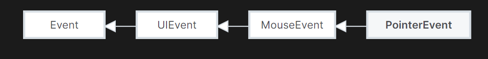
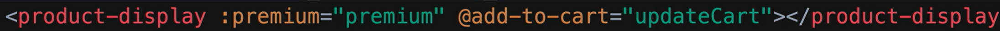
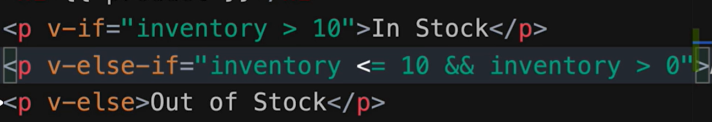
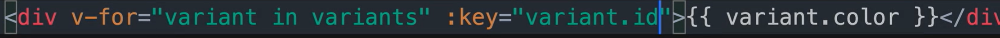

目录

[概念](#概念)

[JavaScript](#javascript)

[语言版本](#语言版本)

[DOM](#dom)

[Element](#element)

[事件](#事件)

[语法糖](#语法糖)

[**模板字符串**](#_Toc127047964)

[空相关](#空相关)

[同时为多个变量赋值](#同时为多个变量赋值)

[true时调用函数](#true时调用函数)

[延展操作符(Spread operator)](#延展操作符spread-operator)

[字符串转换为数字](#字符串转换为数字)

[解构赋值](#解构赋值)

[Shorthand function properties](#shorthand-function-properties)

[语法](#语法)

[变量](#变量)

[判断](#判断)

[函数](#函数)

[**类**](#_Toc127047976)

[循环](#循环)

[注释](#注释)

[Decorators](#decorators)

[常用接口](#常用接口)

[Json](#json)

[类型](#类型)

[类型转换](#类型转换)

[String](#string)

[Objects](#objects)

[Arrays](#arrays)

[**DOM(Document object)**](#_Toc127047987)

[模块化开发（ES Modules）](#模块化开发es-modules)

[TypeScript](#typescript)

[接口](#接口)

[问题](#问题)

[node](#node)

[npm](#npm)

[Express](#express)

[使用http module显示html页面](#使用http-module显示html页面)

[使用Express](#使用express)

[Route Params and Query](#route-params-and-query)

[Middleware](#middleware)

[问题](#问题-1)

[Vue CLI](#vue-cli)

[Vue2](#vue2)

[Vue对象](#vue对象)

[Component](#component)

[\$](#)

[\$data, \$props](#data-props)

[\$refs](#refs)

[\$on, \$emit, \$off](#on-emit-off)

[Lifecycle](#lifecycle)

[Lifecycle Hooks](#lifecycle-hooks)

[Debug](#debug)

[Vue3](#vue3)

[Vue对象](#vue对象-1)

[Component对象](#component对象)

[导入Component](#导入component)

[SFC (Single-File Components)](#sfc-single-file-components)

[API Styles](#api-styles)

[Composition API](#composition-api)

[Lifecycle](#lifecycle-1)

[Lifecycle Hooks](#lifecycle-hooks-1)

[模板语法](#模板语法)

[Web component](#web-component)

[Slot](#slot)

[自定义已封装的Component](#自定义已封装的component)

[Shadow Dom](#shadow-dom)

[Webpack](#webpack)

[设计](#设计)

[Diagrams.net](#diagramsnet)

# 概念

Node.js是JavaScript运行时，类比于JVM之于Java，CLR之于C\#。

它是可以在Server-Side执行javaScript（Client-Side是使用浏览器执行）

因此和Vue.js、React、Angular这些JavaScript库不一样。

#### 框架

v8 引擎解释执行 js 代码，提供桥梁接口。（Chrome浏览器也是使用V8引擎）

libuv 库处理异步模型：事件循环、事件队列、异步IO。

第三方模块：zlib、http、c-ares等

typescript 是 javascript 的当前最受欢迎的中间语言，提供了强大灵活的类型系统，typescript 提供一个编译器 tsc 可以将 typescript 编写的代码编译成 javascript。除了 typescript，你可能还听过 coffescript, flow, dart 等 javascript 的中间语言。它们都可以通过它们的编译器编译成原生 js，原生 js 也叫 vanilla js。

# JavaScript

通常情况下，JavaScript脚本是被用户下载到本地，使用浏览器进行执行的脚本。但node.js可以在服务端执行JavaScript。

严格模式通过在脚本或函数的头部添加 “use strict”; 表达式来声明，严格模式下你不能使用未声明的变量。

HTML中使用script包含时，需要按顺序包含script。

## 语言版本

ES 6 等于 ES2015

ES 7 等于 ES2016

以此类推, 年份减一就对了.

通常 ES 6 以后大家都用年份来称呼了.

ES6 是一个大改版, 往后的版本都是添加一些特性而已.

目前 2022 年, 主流游览器都支持 ES 2017 所有特性. 所以可以放心用.

## DOM

### Element

document.querySelector()方法的返回值就是Element基类

<https://developer.mozilla.org/en-US/docs/Web/API/Element>

### 事件

分为pointer event(包含触控、鼠标等事件)

| 事件名      | 事件作用                                     | 备注                                                                                                                                                                                                                                                                                                                                                                                                                     |
|-------------|----------------------------------------------|--------------------------------------------------------------------------------------------------------------------------------------------------------------------------------------------------------------------------------------------------------------------------------------------------------------------------------------------------------------------------------------------------------------------------|
| contextmenu | 打开鼠标右键菜单（实际就是鼠标右键点击事件） | 捕获后使用 e.preventDefault() 可以阻止默认的打开鼠标右键操作。 preventDefault实际上是Event基类的方法，可以阻止未显式Handle事件的调用默认功能的方法，但仍会向下传播，除非调用stopPropagation()  e.target.click(); 可以模拟目标点击，将右键变左键点击。(Element基类的方法) 还可以使用 e.target.dispatchEvent( new MouseEvent('click', { bubbles: true, cancelable: true, view: window, })) （EventTarget Interface的方法） |
|             |                                              |                                                                                                                                                                                                                                                                                                                                                                                                                          |
|             |                                              |                                                                                                                                                                                                                                                                                                                                                                                                                          |
|             |                                              |                                                                                                                                                                                                                                                                                                                                                                                                                          |
|             |                                              |                                                                                                                                                                                                                                                                                                                                                                                                                          |

## 语法糖

**模板字符串**

模板字符串相当于加强版的字符串，使用反引号 \`，除了作为普通字符串，还可以用来定义多行字符串，还可以在字符串中加入变量和表达式。

模板字符串中的换行和空格都是会被保留的

-   **插入变量和表达式**

let info = \`我是\${name},我\${age + 1}岁了。\`

-   **标签模板**

标签模板，是一个函数的调用，其中调用的参数是模板字符串

func\`hello world\`

相当于

func([‘hello world’]) //传入的竟然是array

当含有变量时，会将字符串分割成字符串array，并把变量放在最后一起传入

func\`我是\${name},我\${age + 1}岁了。\`

相当于

f(['我是',',我 ',' 岁了。'],'哥斯拉',1001);

#### es6-string-html

/\*html\*/ //这里就是指明下面的\`\`包的是html，IDE可以高亮语法

\`

\<div\>…\</div\>

\`

### 空相关

#### Nullish coalescing operator (??)

The nullish coalescing (??) operator is a logical operator that returns its right-hand side operand when its left-hand side operand is null or undefined, and otherwise returns its left-hand side operand.

#### Optional chaining (?.)

The optional chaining (?.) operator accesses an object's property or calls a function. If the object accessed or function called is undefined or null, it returns undefined instead of throwing an error.

#### 判断变量是否存在

#### 空及未定义变量检查及默认赋值

对 Null、Undefined、Empty 这些值的检查

### 同时为多个变量赋值

### true时调用函数

### 延展操作符(Spread operator)

从ES6开始添加的。可以在函数调用/数组构造时, 将数组表达式或者string在语法层面展开；还可以在构造对象时, 将对象表达式按key-value的方式展开

#### 打包

#### 解包

### 字符串转换为数字

### 解构赋值

### Shorthand function properties

## 语法

### 变量

定义到外面的变量都是全局的，而且如果export出去，object类型的还是同一个对象。

#### 变量提升(variable hoisting)

变量首先有三种状态：created创建，initialize初始化（为undefined或刚开始声明的值），赋值

JavaScript引擎的工作方式是，先解析代码，获取所有被声明的变量，然后再一行一行的运行，这造成的结果，就是所有的变量的声明语句，都会被提升到代码块scope的头部。

##### var

var 声明的变量会提升到当前代码块的最上层，**创建**并**初始化**为undefined。

##### let

let helps you avoid the variable hoisting in javascript and keep your variables' scope at just where it needs to be.

建议都使用let替代var。

let声明的变量，也会提升到当前代码块的最上层，先进行创建但不初始化。

在for循环中，let和var表现不同

##### const

与let类似，不同的是它没有赋值状态，即只能初始化一次，后续不可更改。

### 判断

#### Strict equality

If the operands are of different types, return false.

If both operands are objects, return true only if they refer to the same object.

If both operands are null or both operands are undefined, return true.

If either operand is NaN, return false.

Otherwise, compare the two operand's values:

Numbers must have the same numeric values. +0 and -0 are considered to be the same value.

Strings must have the same characters in the same order.

Booleans must be both true or both false.

#### Loosely equality

If the operands have the same type, they are compared as follows:

Object: return true only if both operands reference the same object.

其他类型直观

If one of the operands is null or undefined, the other must also be null or undefined to return true. Otherwise return false.

If one of the operands is an object and the other is a primitive, convert the object to a primitive using the object's @@toPrimitive() (with "default" as hint), valueOf(), and toString() methods, in that order. (This primitive conversion is the same as the one used in addition.)

At this step, both operands are converted to primitives (one of String, Number, Boolean, Symbol, and BigInt). The rest of the conversion is done case-by-case.

### 函数

匿名函数function () {} 也可以写成 () =\> {}

普通函数直接function func1(para1, para2) {}

异步函数async function funcAsync1() {}，内部使用await。

函数参数可以有默认值

#### 函数提升

和变量提升类似，函数声明也会提升到代码开头。

#### 自带函数

Object.entries()

该特性可以把对象转换成一个由若干对象组成的数组。

Object.values()

输出对象的键值，类似于C\#的Dictionary.Values()。

**类**

#### static

In ES2022 we now have static initialization blocks

### 循环

for (let num of nums){}

for (let index in nums){}

nums是array的话，of是取每个实际对象，而in是取index

### 注释

<http://itmyhome.com/js/han_6570_fang_fa_zhu_shi.html>

/\*\*

\* Take screen shot on specific url.

\*

\* @param {string} url the url to take screen shot of.

\* @return {Object} 返回值描述

\*/

## Decorators

@decorator

class A {}

// 等同于

class A {}

A = decorator(A) \|\| A;

## 常用接口

### Json

JSON.stringify()

JSON.parse()

## 类型

### 类型转换

There are 6 types of objects:

Date

Array

可以使用Boolean()方法

| 类型对象名 | 其他类型值 | 转换成的布尔值                              |
|------------|------------|---------------------------------------------|
|            | undefined  | false                                       |
|            | null       | false                                       |
| Boolean    | 布尔值     | 不用转换                                    |
| Number     | 数字       | 0，NaN转化成false，其他数字类型转换成true   |
| String     | 字符串     | 只有空字符串''转换成false，其他都转换成true |
| Objact     | 对象       | 全部转换为true                              |

undefined 和 null toString后是”undefined”和”null”，这点和C\#大相径庭

### String

padEnd()

trim()

substring()

includes()

replace() //只replace一次

replaceAll()

### Objects

类似于字典，但其实就是对象，它之中包含很多属性，甚至方法。

const obj = {name:”test”, age:15}

然后使用就可以obj.name诸如此类。

### Arrays

const obj = [1,2,3]

map方法可以遍历数组并对每个元素使用传入的方法

filter方法，类似于C\#中的Where，不过它直接返回了filter后的array。

| 方法                                       | 功能                                                                                            | 备注                                                  |
|--------------------------------------------|-------------------------------------------------------------------------------------------------|-------------------------------------------------------|
| array.push(element0, element1,…, elementN) | adds one or more elements to the end of an array and returns the new length of the array.       |                                                       |
| array.slice()                              |                                                                                                 | slice() //shallow copy slice(start) slice(start, end) |
| array.length                               |                                                                                                 |                                                       |
| array.includes(element[, start])           | same as List.Contains                                                                           |                                                       |
| array.unshift()                            | adds one or more elements to the beginning of an array and returns the new length of the array. |                                                       |

**DOM(Document object)**

JavaScript representation of the structure of HTML.

document这个对象中有很多elements，可以使用querySelecotr()方法过滤出想要的元素。

这些包含的方法叫做BrowserAPI。

-   **element**

addEventListenser() //给该元素对象添加事件

style

### 模块化开发（ES Modules）

# TypeScript

JavsScript是dynamic type，而TypeScript把它变成了static type，即需要声明类型了。

似乎导包需要@type/express和express的js包都得要。前者纯粹定义type，后者才是具体实现？

然后全都换成了import写法。

## 接口

interface LabelledValue {

label: string;

}

只需要一个obj含有label：{label:xxx}，就说这个对象实现了这个接口，可以传入。

## 问题

Element类型找不到，是需要在tsconfig.json中compilerOptions中的"lib": ["es6","dom"]添加dom。

<https://github.com/DefinitelyTyped/DefinitelyTyped/issues/52383>

try to import a CommonJS module into an ES6 module （如import path from ‘path’）需要在"compilerOptions"中添加"esModuleInterop": true,

<https://bobbyhadz.com/blog/typescript-module-can-only-be-default-imported-esmoduleinterop>

# node

除了eslint，node版本和支持的js语言版本也有关系。

nvm可以控制node的多个版本切换

<https://github.com/coreybutler/nvm-windows>

nvm current: Display active version.

nvm list [available]: List the node.js installations. Type available at the end to show a list of versions available for download.

nvm use \<version\> [arch]: Switch to use the specified version. Optionally use latest, lts, or newest.

nvm install \<version\> [arch]: The version can be a specific version, "latest" for the latest current version, or "lts" for the most recent LTS version. Optionally specify whether to install the 32 or 64 bit version (defaults to system arch). Set [arch] to "all" to install 32 AND 64 bit versions. Add --insecure to the end of this command to bypass SSL validation of the remote download server.

# npm

npm install [express@4.17.1](mailto:express@4.17.1)（指定版本） --save（可保存在package.json中？）

npm install -g @vue/cli

npm uninstall xxx

npm install npm -g npm升级到最新版本

npm -v 查看当前版本

\-g 全局安装包

\-S --save 将依赖包安装到生产dependencies，后续打包dist文件夹也会打包进去。

\-D --save-dev 将依赖包安装到devDependencies，该依赖只会在开发阶段用到，而在生产阶段不会用到。

都是在package.json可以读取到的消息

devDependencies 的理解：

我们在开发一个前端项目的时候，需要使用到webpack或者gulp来构建我们的开发和本地运行环境，这时我们就要安装到devDependencies 里。webpack或者gulp是用来打包压缩代码的工具，在项目实际运行的时候用不到，所以把webpack或者gulp放到devDependencies 中就行了。

dependencies 的理解：

我们在项目中用到了element-ui或者mint-ui，在生产环境中运行项目，当然也需要element-ui或者mint-ui，所以我们把element-ui或者mint-ui安装到dependencies中。

productionSourceMap: false, //打包不生成map

npm config set proxy=http://127.0.0.1:8087 设定代理

npm config set registry=http://registry.npmjs.org 设定仓库

npm config set https-proxy <http://server:port>设置https代理

npm config delete proxy

npm config delete https-proxy取消代理

# Express

## 使用http module显示html页面

非常的繁琐：

## 使用Express

<http://expressjs.com/>

### Route Params and Query

#### Post

post需要使用req.body

但var bodyParser = require('body-parser');

app.use(bodyParser());

需要使用该中间件才可以处理

app.use(express.json({ limit: "10000kb" }));其实Express也有相应中间件。limit可以设置post内容的大小。

### Middleware

# 问题

Cannot find module 'supports-color'

if diable breakpoints type "All Exceptions" then work fine. （即在Debug——Windows中ExceptionSettings还原默认异常设置）

# Vue CLI

npm install -g @vue/cli

vue create xxxx

npm run serve

npm run build //build出dist文件夹，拷贝到web服务器wwwroot服务下进行host即可

Previewing Locally：

The easiest way to preview your production build locally is using a Node.js static file server, for example serve:

npm install -g serve

\# -s flag means serve it in Single-Page Application mode

\# which deals with the routing problem below

serve -s dist

## 环境变量

[https://cli.vuejs.org/guide/mode-and-env.html\#using-env-variables-in-client-side-code](https://cli.vuejs.org/guide/mode-and-env.html#using-env-variables-in-client-side-code)

.env.Production和.env.Development中的变量，只有以VUE_APP_开头的才会写死进去，其他的需要自行设置环境变量。

但比较麻烦：

<https://stackoverflow.com/questions/53010064/pass-environment-variable-into-a-vue-app-at-runtime>

# Vue2

## Vue对象

const app = new Vue(

{

el: “\#app” // hook html scope to this vue instance.

data: {} //define reactive properties. 注意在Component中是用的data()，因为使用function return出来的是unique的data instance，而data定义的则是同一个instance。  
 methods: //如果是import的methods，可以直接写进去，不需要再写圆括号及body

{

xxx(){},foo(){} // usually use in v-on callback function.

},

watch:

{

a: (val, oldVal)=\> {},

b: function(val) {},

c: {

immediate: true, //可以立即触发变更handler

handler(val) {

…

}

}

},

computed:

{

xxx1: function () {},

xxx2() {}, //ES2015 shorthand Don't use arrow function ()=\>{} for computed, it will cause the wrong context (not current Vue instance).Change to function () {} then it should work fine.

}

})

## Component

注意Style Scoped，会导致style只作用于当前component，不会穿透到其他引用的component去。

如果要穿透就多写一个normal的style

## \$

文档中vm是指的Vue对象本身，是var vm = new Vue(…)后的。

而this是在Vue对象内部用的，所以一般都用的是this来指代Vue对象。

### \$data, \$props

\$ is for public instance properties:

\$data:

\$props:

beforeUpdate、updated两个钩子是data或props变动而导致的，所以如果component中未引用到data或props（定义了但未使用），不会造成刷新。

### \$refs

//获取DOM对象 document.getElementById('\#id')

//但这里其实是用的ref去获取

\
\</div\>

this.\$refs.myDiv

还可以this.\$refs[“myDiv”]

### \$on, \$emit, \$off

You can only pass props to a direct child component, and

you can only emit an event to a direct parent.

but vue3 provide a new way that support two way: <https://vuejs.org/guide/components/provide-inject.html>

直接用this.\$refs.childComoponent.method就行

this.\$on(event, callback)

一般写在created, mounted方法中

this.\$emit(eventName, […args])

this.\$off( [event, callback] )

Remove custom event listener(s).

If no arguments are provided, remove all event listeners;

If only the event is provided, remove all listeners for that event;

If both event and callback are given, remove the listener for that specific callback only.

一般写在unmounted方法中

## Lifecycle

### Lifecycle Hooks

In Vue 3 beforeDestroy and destroyed hooks are replaced with beforeUnmount and unmounted

## Debug

VSCode 需要

vue.config.js

configureWebpack:{

devtool: 'source-map'

},

需要先npm run serve后再进行Debugger连接

# Vue3

A JavaScript framework to bring reactivity and web components, we chose Vue.js.

## Vue对象

const app = Vue.create({})

创建一个Vue app对象，在html中script可以mount这个app对象到指定的DOM中去

比如app.mount(‘\#xxx’) //其中传入的是CSS Selector，返回的是这个mountedApp对象

其中定义的data()方法，返回的对象中的属性，是reactive的，原理是Vue的Reactivity System。

Properties returned from data() become reactive state and will be exposed on \`this\`.

v-bind是one-way binding，即data()返回的资源更新，会更新到页面。

v-model是two-way binding，即前台的变化也会作用到data()中的对象属性中去。

v-model是

\<input

:value="text"

@input="event =\> text = event.target.value"\>的简写

methods属性中可以定义vue对象将会用到的方法，比如事件回调函数（用于@xxx=”method”）。

回调函数中可以使用this.xxx去访问data中的对象

computed属性中可以定义computed properties（以方法的形式），方法名就是其computed property，可以在{{ xxx }}等地方使用。当计算属性中提及的属性变化时，会带动计算属性进行更新。（依赖收集管理的功能）

mounted()方法类似于blazor中的OnInitialized()，当component被mounted会调用。

## Component对象

//app是vue对象

app.component(‘html tag name’, {})

包含template属性，接收字符串，返回html内容，使用es6-string-html

也有和vue对象一样的data方法、methods、computed属性

定义暴露给html tag上的attribute：

使用props属性，

props: {

//attribute名

premium: {

type: Boolean,//type validation

required: true

}

},

### 导入Component

import xxxx from './ChildComp.vue'

然后直接使用\<xxx/\>即可

#### 事件传递

component中的method触发的事件，要传递到外部，需要使用this.\$emit(‘事件名’[, payload]) ，然后使用组件的时候用@监听即可，payload会自动传入所指定的方法。

## SFC (Single-File Components)

In most build-tool-enabled Vue projects, we author Vue components using an HTML-like file format called Single-File Component (also known as \*.vue files, abbreviated as SFC). A Vue SFC, as the name suggests, encapsulates the component's logic (JavaScript), template (HTML), and styles (CSS) in a single file.

## API Styles

Options API与Composition API

Options API是对Composition API进一步的封装，更加面向对象。但CompositionAPI 更加灵活。

Composition API就是import vue中需要用到的方法，用传统js的方式来进行。

Composition实际上是VUE3才有的，适合做大项目。

## Composition API

\<script **setup**\> //作用：https://vuejs.org/guide/essentials/reactivity-fundamentals.html\#script-setup

import { xxx } from 'vue'

// component logic

// declare some reactive state here.

\</script\>

| Name          | Function                                                                                          | Remark                                                                                                                                                                                                                                             |
|---------------|---------------------------------------------------------------------------------------------------|----------------------------------------------------------------------------------------------------------------------------------------------------------------------------------------------------------------------------------------------------|
| reactive()    | Objects created from reactive() are JavaScript Proxies that work just like normal objects         | const counter = reactive({  count: 0 })  counter.count++  \<div\>{{counter.count}}\</div\>  only works on objects (including arrays and built-in types like Map and Set).                                                                          |
| ref()         | can take any value type and create an object that exposes the inner value under a .value property | const message = ref('Hello World!')  message.value = 'Changed'  \<div\>{{message}}\</div\>//不需要使用.value 其实区别在于ref声明一个值，reactive声明对象{}？  还用于template ref： \
hello\</p\> 此时首先要定义 const p = ref(null)     |
| watch()       | can directly watch a ref, and the callback gets fired whenever target's value changes.            | watch(count, (newCount) =\> {  // yes, console.log() is a side effect  console.log(\`new count is: \${newCount}\`) })                                                                                                                              |
| defineProps() | declare the props the component accepts                                                           | const props = defineProps({  msg: String }) 或 msg: {  type: Boolean,//type validation  required: true  } 可以单独传入Type validation，也可以传入配置对象。  it is compiler macros only usable inside \<script setup\>. Do not need to be imported |
| defineEmits() | emit events to the parent                                                                         | \<ChildComp @eventXXX="(msg) =\> xxx = msg" /\>                                                                                                                                                                                                    |
|               |                                                                                                   |                                                                                                                                                                                                                                                    |

## Lifecycle

### Lifecycle Hooks

onMounted, onUpdated, and onUnmounted.

## 模板语法

在html tag 的content中，使用{{xxx}}

**vue模板语言可以使用JavaScript语言**，比如 message.method()等 这个就是先执行然后ToString()？的感觉

在HTML Attribute中，则需要使用

v-bind directive进行双向绑定

\

| directive        | function                               | remark                                                                                                                                                                                                                                                                |
|------------------|----------------------------------------|-----------------------------------------------------------------------------------------------------------------------------------------------------------------------------------------------------------------------------------------------------------------------|
| v-bind:xxx       | bind 原生html attribute 到model        | **shorthand: :xxx**                                                                                                                                                                                                                                                   |
| v-if             | vue中html的if else，如果真，显示       | 可以和v-else、v-else-if连用，指定fallback element                                                                                                                                                                      |
| v-show           | used for toggling elements’ visibility | 和单独使用v-if一样。 但是v-if是add或remove element from dom，而v-show是隐藏（css中display:none），所以效率更高                                                                                                                                                        |
| v-for            | foreach iterator                       |  复制自身，tag的content中可以访问迭代对象 (item, index) in items 还可以获得index？ 如果需要使用一个无实际意义的for作为头（如在ul列表中的li对象外层），使用\<template\>\</template\>，然后key放在真正的for item tag上。 |
| v-bind:key       | 迭代的DOM对象给予Key值                 | 可以增强效率，原先在foreach迭代后，列表进行更新，如果没有指定key值，则会删除再新增，而当有key值追踪后，只需修改。                                                                                                      |
| v-on:*eventName* | listen event                           | 比如v-on:click=”method name” method name是vue对象中的methods属性中定义的方法 还可以传入参数到method中去 **shorthand: @eventName**   @submit.prevent：其中submit是form的submit事件，可以由button type=submit触发 prevent是modifier，用于prevent browser refresh。      |
| :style           | v-bind:style                           | 传入的是style object: {backgroundColor: variable} //Camelcase 因为JavaScript对象的key不能是-号 或使用{‘background-color’:variable} //Kebab形式，需要两边加quote                                                                                                       |
| :class           | v-bind:class                           | 类似于:style的用法，传入的是class object: {classname: Boolean(指示前面的class name是否追加到class属性中)} 已有的class属性不会被清除  还可以使用ternary operator： [Boolean ? classname : ‘’ ]                                                                         |
| v-model          | two-way binding                        | 用于\<input\> \<textarea\> \<select\>等地方，其显示的内容会作用到绑定的data()方法上的model字段上去   v-model.number指示内容会被转换会number然后再映射给model                                                                                                          |
| ref              | Template refs                          | The template ref is only accessible after the component is mounted.  \
hello\</p\> 此时首先要定义 const p = ref(null) 然后就可以在OnMounted钩子中访问p对象了 onMounted(() =\> {  p.value.textContent = 'mounted!' })                                       |
| :xxxx            | attribute值                            | 对于任意attribute： VUE2中：值为false或null的，不显示attribute。 VUE3中，值为null的不显示，false的显示xxx=”false”                                                                                                                                                     |

# Web component

[https://github.com/web-padawan/awesome-lit\#general-resources](https://github.com/web-padawan/awesome-lit#general-resources)

Design System

<https://github.com/SAP/ui5-webcomponents>

<https://github.com/RedHat-UX/red-hat-design-system>

<https://github.com/shoelace-style/shoelace>

<https://github.com/vaadin/web-components>

## Slot

\<my-component\>

\<div\> Content1 \</div\>

\<div\> Content2 \</div\>

\
 Content3 \</div\>

\
 Content3 \</div\> //还可以多次使用同一个name的slot

\</my-component \>

在my-component的定义里面

\<div\>

\<slot\> Fallback \</slot\> Content1将出现的地方 如果没有指定，则显示Fallback

\<slot\>\</slot\> Content2 将出现的地方

\<slot name= ”name” \>\</slot\> Content3将出现的地方

\</div\>

## 自定义已封装的Component

<https://stackoverflow.com/questions/60266303/how-to-extend-and-style-existing-litelements>

import '@lion/button/define';

import {css} from 'lit-element'

import {LionButton} from '@lion/button'

class MyCustomButton extends LionButton {

static get styles() {

return [

super.styles,

css\`

**:host** {

background-color: red;

}

\`,

]

}

constructor() {

super()

}

}

customElements.define('my-button', MyCustomButton);

shadow dom的特性，外界的css无法影响到web component内部的css，防止css污染。

但可以通过配置解决，让外界可以污染。

## Shadow Dom

shadow dom最外面一层相当于父元素，传入的style（element style）优先级不如里面的高，所以里面定义的style外面改不了。

默认情况下外界的样式（比如使用class选择器）无法污染到web component里面的样式，需要进行配置？

<https://css-tricks.com/styling-a-web-component/>

可以在html或body、element选择器等， --custom 变量可以穿透

# Webpack

webpack可以将各种前端框架的源码（需要支持webpack的），打包为dist文件夹，然后直接放到nginx等web服务器wwwroot文件夹下进行host即部署完毕。

# 设计

## Diagrams.net

**Diagrams.net** (formerly draw.io) is a powerfull app designed to [create diagrams and flowcharts](https://www.diagrams.net/).

<https://roneo.org/en/diagrams.net-adding-icons-font-awesome-twemoji>
