# 坑

## Release模式下编译，Linux Docker环境运行起来中文乱码

原理是因为VS2022生成的Dockerfile编译是拷贝了源代码到容器内编译，而如果本机的代码文件编码为GB2312，当时拷过去的时候文件已经乱码，因此编译为二进制文件还是乱码，执行的时候自然也是乱码。

另外还有CRCF的问题，如果是sh脚本，在linux下就运行不正常。

# 发布

#### 发布单体程序

`dotnet publish -r win10-x64 -p:PublishSingleFile=true`

# 历史

## .NET Standard

<https://learn.microsoft.com/en-us/dotnet/standard/net-standard?tabs=net-standard-1-0>

<https://devblogs.microsoft.com/dotnet/the-future-of-net-standard/>

# 面向对象编程

## 重载（Overload）和重写（Override）

重载是在同一个类中有多个同名方法，但参数签名不同。

重写是父类和子类，子类不使用父类的方法而是重写父类的方法为自己的独特方法。

## 实例化类的执行顺序

子类的静态字段

子类的静态构造方法

子类的实例字段

父类的静态字段

父类的静态构造方法

父类的实例字段

父类的实例构造方法

子类的实例构造方法

静态字段赋值、构造方法只会执行一次。

第一次引用这个类的成员（不论是静态还是实例），将会开始进行静态字段、构造方法的运行。

静态字段、构造方法是线程安全的。Static constructors are guaranteed to be run only once per application domain, before any instances of a class are created or any static members are accessed.

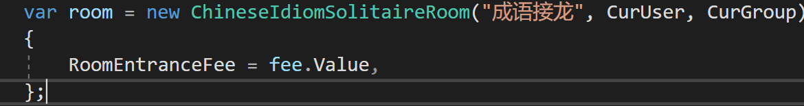

这样子的属性实例化是对象创建完毕后才赋值的，所以是最后才生效的。

而在类上属性直接初始化的则和实例字段一样。

## 接口与抽象类

接口（interface）用于规范，抽象类（abstract class）用于共性。抽象类是类，所以只能被单继承，但是接口却可以一次实现多个。

抽象类中的abstract方法类似于接口，强迫继承它的类去实现，然后比接口更好的是能够提供共有的方法，子类就不必再次实现，直接用父类的方法。

接口中只能声明方法，属性，事件，索引器。而抽象类中可以有方法的实现，也可以定义非静态的类变量。

抽象类可以提供某些方法的部分实现，接口不可以。抽象类的实例是它的子类给出的。接口的实例是实现接口的类给出的。

在抽象类中加入一个方法，那么它的子类就同时有了这个方法。而在接口中加入新的方法，那么实现它的类就要重新编写（这就是为什么说接口是一个类的规范了）。

接口成员被定义为公共的，但抽象类的成员也可以是私有的、受保护的、内部的或受保护的内部成员（其中受保护的内部成员只能在应用程序的代码或派生类中访问）。

此外接口不能包含字段、构造函数、析构函数、静态成员或常量。

#### 常用判断关系的方法

1.  **bool** IsInstanceOfType(object);
2.  //判断对象是否是指定类型
3.  //类型可以是父类，接口
4.  //用法：父类.IsInstanceOfType(子类对象)
5.  
6.  **bool** IsAssignableFrom(Type)
7.  //判断两个类型的关系
8.  //类型可以是父类，接口
9.  //用法：父类.IsAssignableFrom(子类) 对应的有IsAssignableTo
10. 
11. **bool** IsSubClassOf(Type)
12. //判断两个类型的关系
13. //类型不可以是接口
14. //用法：子类.IsSubClassOf(父类)
15. Type GetGenericTypeDefinition()
16. //获取泛型类型typeof(GenericType\<\>)

但注意，虽然IComparable a = b; //b是int?，不会报错，但使用typeof(int?).IsAssignableTo(typeof(IComparable)会是false，这可能是设计上的一个bug。但就其原理是因为<https://stackoverflow.com/questions/39955837/why-isassignablefrom-return-false-when-comparing-a-nullable-against-an-interface>

最好使用a is IComparable来判断是否实现了接口（但type却没办法了）

## 插件编程

### 合并dll

使用Costura.Fody包，build dll的library后会生成FodyWeavers.xml文件

然后将想要合并的dll写入，如：

\<Costura IncludeAssemblies='Fare' /\>

按照dll名写入，dll名可以从Packages-\>包-\>Compile Time Assembilies 看到

## 关键字

##### extern外部修饰符

用于声明在外部实现的方法，外部修饰符的常见方法是在使用Interop 服务调入外部非托管代码时与 DllImport 属性一起使用；在这种情况下，该方法还必须声明为 static

##### override重写

override关键字主要是提供派生类对父类方法的新实现，即重写。不可以用于重写非虚方法和静态方法，（new可以隐藏非虚方法）必须重写父类的abstract方法、可选重写virtual方法。被重写的原方法都失效了，只会调用重写后的方法。

##### new 关键字

new关键字可以在派生类中隐藏父类的方法，指明在使用派生类调用的方法是new关键字新定义出来的方法，而不是父类的方法。

new的优先级是按照父类A = new 子类B（），那么方法是调用的父类方法，除非是子类B = new 子类B（），这样才会调用B的新的new方法

##### virtual虚方法

允许在派生类中重写这些对象，默认情况下，方法是非虚拟的，不可以重写。若是不重写虚方法，那么调用的就是这个父类的方法。重写也是用new和override关键字（注意两者区别）。

##### abstract方法

抽象方法必须被重写，就类似于实现了接口一样

##### sealed关键字

当对一个类应用 sealed 修饰符时，此修饰符会阻止其他类从该类继承。类似于Java中final关键字。即密封类

修饰方法或属性： sealed 修饰符必须始终与 override（C\# 参考）一起使用，防止被再一次继承重写，所以是三个类以上的连续继承关系才会用到sealed

尽量多使用sealed，可以提高性能。[.NET 中密封类的性能优势](https://mp.weixin.qq.com/s/dZlEjOB8jx0ku8eN8AhpzQ)

##### const关键字

在编译时设置其值

##### readonly关键字

程序运行期间只能初始化一次

##### static关键字

static的属性初始化需要注意顺序，在一个静态属性引用另一个静态属性的时候，如果这个静态属性正在被初始化的时候引用另一个需要被初始化但未被初始化的属性时，会得到null（这是C\#的bug？不，见下面textual order的描述）

另外建议使用static constructors，即使不是静态类，也可以使用静态构造函数，用于初始化静态变量。

A static constructor is used to initialize any static data, or to perform a particular action that needs to be performed once only. It is called automatically before the first instance is created or any static members are referenced.

If static field variable initializers are present in the class of the static constructor, they will be executed in the textual order in which they appear in the class declaration immediately prior(紧接着) to the execution of the static constructor.（所以会按顺序先执行参数的初始化（若有））

注意，静态构造函数不能有参数，且会在一个实例构造函数之前调用。静态构造函数只会调用一次。

[官方的静态教程](https://docs.microsoft.com/en-us/dotnet/csharp/programming-guide/classes-and-structs/static-classes-and-static-class-members#static-members)

**static class注意事项**

a static class remains in memory for the lifetime of the application domain in which your program resides

**static member注意事项**

Only one copy of a static member exists, regardless of how many instances of the class are created.

Static members are initialized before the static member is accessed for the first time and before the static constructor

##### try、finally

就算try return了 依然会执行finally， 但是是先return结果了再执行。

##### using关键字

在using作用域的最后会自动Dispose()using的资源。相当于try()…finally{ xx.Dispose() }

The using statement ensures that Dispose (or DisposeAsync) is called even if an exception occurs within the using block. You can achieve the same result by putting the object inside a try block and then calling Dispose (or DisposeAsync) in a finally block; in fact, this is how the using statement is translated by the compiler. The code example earlier expands to the following code at compile time (note the extra curly braces to create the limited scope for the object):

在更新的版本中，using不需要括弧时，dispose的时候也是局部变量访问不到的末尾。

At the end of the scope of the variable r

还可以使用global using

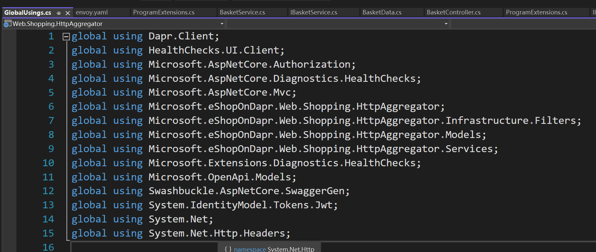

##### explicit与implict

显示转换和隐式转换关键字

1.  /// \<summary\>
2.  /// 将string隐式转换为KouMessage（创建一个消息内容为content的KouMessage）
3.  /// \</summary\>
4.  /// \<param name="content"\>\</param\>
5.  public static implicit operator KouMessage(string content)
6.  {
7.  return new KouMessage(content);
8.  }
9.  /// \<summary\>
10. /// 将KouMessage隐式转换为string（即获取消息内容）
11. /// \</summary\>
12. /// \<param name="content"\>\</param\>
13. public static implicit operator string(KouMessage message)
14. {
15. return message?.Content;
16. }

然后使用的时候就可以直接 KouMessage a = “a string”; （这是实现了string到KouMessage的隐式转换） 同理显式转换就是需要(KouMessage)”a string”

##### ref关键字（reference）

`ref`关键字能用在函数参数定义上、返回值上、函数体内部的本地函数，但只讲最常用的参数定义上。

官方[详细介绍](https://docs.microsoft.com/en-us/dotnet/csharp/language-reference/keywords/ref)

`C#`的函数一般的参数传递，值类型很好理解，是传递的值。而引用类型传递的是什么呢？在我理解是传递的引用的对象，而`caller`（函数调用者）传递的`reference` `value`，它的名字只是对这个对象的一个引用，然后这个引用有一个定义了的名字（变量名）。但传递到函数参数上去只是传递引用的对象给了一个变量名是函数参数的变量，引用的内部还是与`caller`一样的同一个对象。对它内部修改就相当于修改对象，两边都会被修改。**但若是修改它引用的对象**，比如赋值为`null`，`caller`的变量并不会为`null`，修改变量的对象引用并不会修改原先内部引用的对象。

但如果该函数参数使用了`ref`关键字修饰，那么是连带着引用和内部对象一并传递，那函数参数的名字其实就是`caller`那个传递的变量的`alias`（别名），修改它的引用也会改变`caller`那边变量的引用。

函数的参数定义里面如果使用`ref`关键字，`value` `type`的值会随着函数里面的改变而改变，不仅函数定义需要，而且调用函数时也需要加上`ref`关键字调用

```cs
void Method(ref int refArgument)
```

函数返回结果也可以使用`ref`关键字，官方建议对大型结构体使用`ref`关键字

Returning ref readonly enables you to save copying larger structures and preserve the immutability of your internal data members.

##### predicate

Func\<T, bool\>是对delegate bool Predicate\<T\>(T obj)的简化，

Predicate\<T\>又是对Func\<T, bool\>的简化，

其实，就是一个东西。Func转Predicate可以使用new Func\<T, bool\>(predicate)来完成。也可以在调用Func方法的时候predicate.Invoke变成method group（语法糖）

Delegate至少0个参数，至多32个参数，可以无返回值，也可以指定返回值类型。这个是祖宗。

Func可以接受0个至16个传入参数，必须具有返回值。

Action可以接受0个至16个传入参数，无返回值。Action是无返回值的委托

Predicate只能接受一个传入参数，返回值为bool类型。

typeof(Func\<,\>).MakeGenericType(type1, type2);

##### dynamic

这个关键字让C\#有了弱类型语言的特性，能够使用dynamic关键字声明动态类型，在编译的时候不再对类型进行检查，默认dynamic对象支持你想要的任何特性，即怎么写都不会报错。这一特性在某些需要很复杂的反射才能实现的场景过程中大大简化了实现方式并提高效率。

但注意dynamic不可用于group method等调用，即比如p是一个委托，使用X.Where(p.Invoke)则无法成功。原理类似于无法将var a = p.Invoke一样

dynamic在调用泛型方法的时候，泛型T会被认为是object，所以如果泛型方法里面如果用的是a is ICollection\<T\>时，会被当做是T为object，虽然T按道理应该会正确判断。因此最终会返回false。解决方案是可以用反射得到方法，然后用MakeGeneric做泛型方法。

另外，dynamic也不支持扩展方法的调用：

Extension methods aren't supported by dynamic typing in the form of extension methods, i.e. called as if they were instance methods.

可以使用其对应的静态方法实现。

##### is和as

as是进行了转换，有返回值，如果转换失败返回null。is只是检查是否能兼容给定类型，返回类型为bool值，转换失败返回false，新C\#语言版本is增加了可以内联转换的语法糖（As of C\# 7+, you can now cast inline）。

两者都不会抛出异常。它们都能判断a is/as b中a是否能赋值给b。

注意is和as是用于实例和类型，而不是适用于Type类型来判断是否兼容。

Type类型实例需要使用指定Type的IsAssignableFrom等方法来判断derive关系

##### yield return 与 yield break

就是一个一个的 return。能给编程带来性能上的提高以及用法上的方便，比如要实现对一个list去重后乘方，就可以在去重第一个拿出来然后乘方，再放入list，而不是先整个去重，然后再整个遍历乘方。另外还有可以在输出的时候，用户不必等待必须所有list中的数据处理完才能看到结果，而是可以在处理过程中看到处理情况。

原理是在 return 时，保存当前函数的状态，下次调用时继续从当前位置处理（似乎返回值得是IEnumerable\<\>类型且在外面用该函数需要使用foreach）。

1.  static IEnumerable\<int\> FilterWithYield()
2.  {
3.  foreach (int i in GetInitialData())
4.  {
5.  if (i \> 2)
6.  {
7.  yield return i;
8.  }
9.  }
10. yield break;
11. Console.WriteLine("这里的代码不执行");
12. }

# C\#

## 坑


### Assembly

`Assembly.GetCallingAssembly()`如果在lambada表达式中一定要注意了，它就不是外层的assembly了，而是这个函数来源的assembly。

比如：

services.AddMediatR(cfg=\>

{

cfg.RegisterServicesFromAssembly(callingAssembly);

});

这里就不能在括号内获取，而要放在外部先获取。

### System.Text.Json

#### 默认不会序列化Field


#### 某些Deserialize后变成default

因为属性必须是public set方法。或者用init，或用[JsonInclude]

<https://stackoverflow.com/a/67206063/18731746>

默认是大小写敏感的，需要设置option insensitive

.NET 7后新增JsonRequired

#### 默认不会序列化Tuple

因为它默认不会序列化field相关的，只会序列化properties。而Tuple是两个public field，所以不会序列化。

需要设置IncludeFields = true

### Struct

#### KeyValuePair

它是Struct，所以它的DefaultValue是strcut(default\<Key\>, default\<Value\>)

### 程序集相关

Could not load file or assembly 'FuzzySharp, Version=1.0.4.0, Culture=neutral, PublicKeyToken=null'. 系统找不到指定的文件

如SDK中引用了，但是使用Core启动，插件dll后续加载，是无法编译到dll的，因为Core没有引用该操作，即使插件引用了，但是插件只有dll载入。

## 命令

| command                                                 | function                                       | remark                                                                                                                                                |
|---------------------------------------------------------|------------------------------------------------|-------------------------------------------------------------------------------------------------------------------------------------------------------|
| dotnet publish -c Release -r linux-arm --self-contained | 编译出目标平台linux-arm的可运行程序            | change linux-arm with the runtime that is appropriate for your case if you install the .NET runtime in your container, you can avoid --self-contained |
| dotnet restore \\xx.csproj –packages .\\packages        | 还原指定项目所需依赖，并将依赖包保存到指定目录 |                                                                                                                                                       |
|                                                         |                                                |                                                                                                                                                       |
|                                                         |                                                |                                                                                                                                                       |
|                                                         |                                                |                                                                                                                                                       |
### 问题

#### RestoreTask failed but no log
本地编译成功但是在容器环境进行`dotnet restore`还原时还原失败，这时是因为改了依赖，发现有一个包引用过`Dapr.Client v1.14`觉得没必要多次引用，然后把引用去掉了，但会导致这个谜之问题。还原后问题消失。


## Accessibility

### Default Accessibility

Classes, records, and structs: **internal** is the default if no access modifier is specified.

Class and struct members, including nested classes and structs, have **private** access by default.

interfaces default to **internal** access. Interface members are **public** by default because the purpose of an interface is to enable other types to access a class or struct.

## Out parameter

在方法一个方法中可以拥有多个返回值，除了return之外还可以通过out返回其他返回值。

但注意bool foo(out localVariable) 此时将localVariable放在这里，无论foo方法是否执行返回false或true，localVariable都将被赋值。所以要明确方法的返回值。

## Dictionary

可以使用可空类型作为键，但是不可以为null（注意区分Java中的HashMap可以为null键）

#### 不可以在foreach时修改Dictionary内的元素（.NET 5前）

可以使用for循环修改。或者ToList后遍历Key然后再用key返回去Dictionary修改。

## Record

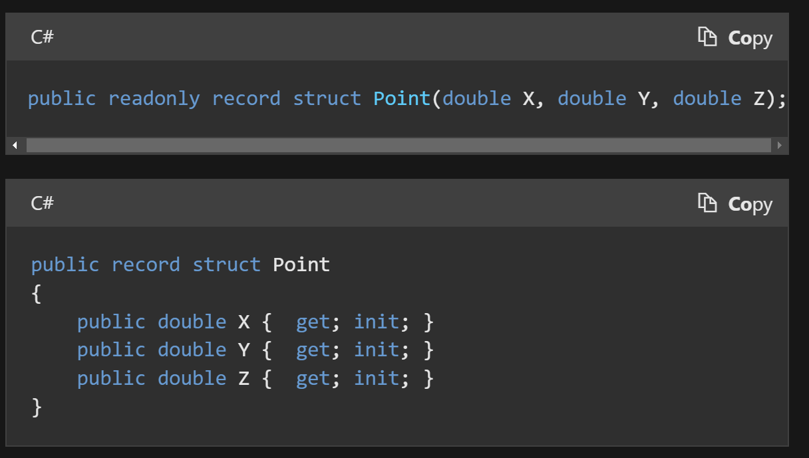

两种写法

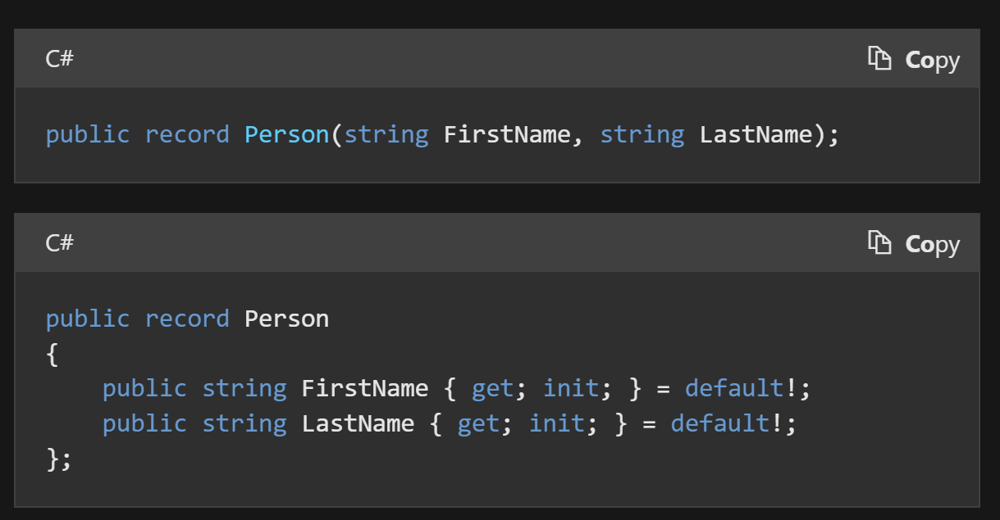

默认都是readonly的，即immutable。也可以自己改成mutable的。

C\#9出现。C\#10出现record struct以及record class

实际上record class 即是record，是reference type。而record struct是value type。

record拥有如下build-in feature

##### Value Equality

two objects are equal if they are of the same type and store the same values.

##### Build-in format

ToString()

所以非常适合DTO之类的，能够直接打印类Json格式输出

例如：

```cs
DailyTemperature { HighTemp = 57, LowTemp = 30, Mean = 43.5 }
DailyTemperature { HighTemp = 60, LowTemp = 35, Mean = 47.5 }
```


##### Nondestructive mutation

If you need to copy an instance with some modifications, you can use a with expression to achieve nondestructive mutation. A with expression makes a new record instance that is a copy of an existing record instance, with specified properties and fields modified.

person2 = person1 with {}; //实际上是复制了一个person1.

它不能很好的替代DDD中的Value Object实现，还是得使用官方的ValueObject实现。

<https://learn.microsoft.com/en-us/dotnet/architecture/microservices/microservice-ddd-cqrs-patterns/implement-value-objects>

原因：

<https://enterprisecraftsmanship.com/posts/csharp-records-value-objects/>

## IEnumerable

●注意x.IsAssignableTo(typeof(IEnumerable)) 与 x.IsAssignableTo(typeof(IEnumerable\<\>))的区别

●注意string也是IEnumerable

●注意Where语句后的IEnumerable结果，如果使用foreach遍历过之后，再度where等操作进行，再foreach则不会有结果。因为是enumerator只能遍历一遍的类型。**（存疑）**

但似乎Sum()、Count()之类的，使用IEnumerable作为参数传入，其实它会诞生自己对于IEnumerable本身的IEnumerator对象进行迭代执行，所以又互不影响…

<https://learn.microsoft.com/en-us/dotnet/fundamentals/code-analysis/quality-rules/CA1851>

## GC（Garbage Collection）

<https://www.cnblogs.com/qiupiaohujie/p/11960624.html>

<https://docs.microsoft.com/en-us/dotnet/standard/garbage-collection/fundamentals>

Mark-Compact是标记后压缩，是处理垃圾的方法

非托管资源GC不管。

## 数组相关

### List

List中的Contains方法是用的迭代调用Equal方法，所以时间复杂度为O(n)

### HashSet

HashSet Contains是计算item hash值，然后获得到hash集合中的index，所以时间复杂度为O(1)

ToHashSet的方法也挺消耗时间的，如果现在已经是List\<T\>，只需要进行一次Contains()，那么直接使用List的效率更高，如果先转为HashCode再进行Contains，会慢3倍时间左右。

所以只有当需要多次Contains的时候，再转换为HashSet较好（其实应该最开始就用HashSet而不是List）。

### Span\<T\>

Span\<T\>直接获取ref 引用，可截取一段，变为数组操作，直接在引用对象上进行修改。

从C/C++的角度来说，其实是封装了void\*类型的指针操作，它抽象了所有连续内存空间的类型系统，包括：数组、非托管指针、堆栈指针、fixed或pinned过的托管数据，以及值内部区域的引用。

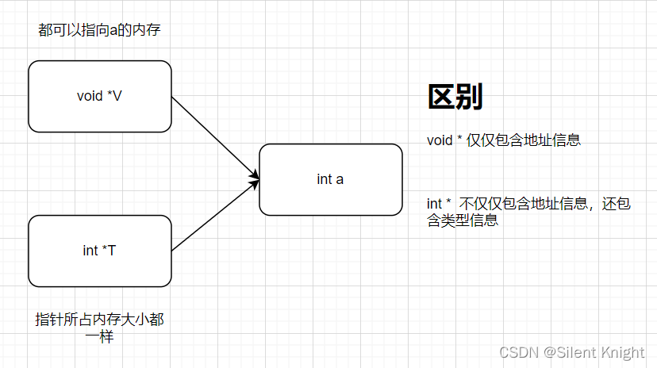

不能存储在heap上，因为要规避被多个线程访问，只能在stack上，意思是不能存在类或结构体等字段（甚至是lambdas等表达式都不行）上保留，而只能在函数内部，作为一个tmp变量，确保只会有一个线程访问

使用它的理由：

字符串等操作，如SubString，是copy出来一份，而如果转化为Span操作，用Slice，则没有string allocation的开销。

IndexOf也是？（it does not need to create a copy of the data or allocate additional memory for processing.）

### ArraySegment\<T\>

可以看作是给定数组的一段，来界定、分割同一个数组，操作实际作用在原数组上。

## 值类型与引用类型

值类型存储在栈上，引用类型是指针存储在栈上，数据本身存在堆上。

### struct

对比class，struct读取效率更高，但如果作为参数传递，每次传递都得拷贝一份自己，因此也不佳。

<https://learn.microsoft.com/en-us/dotnet/csharp/language-reference/compiler-messages/cs1612>

注意这个错误，讲述了值类型容易犯得错误。

存入数组里的struct，使用索引后获取struct中的字段，是Copy一份返回的，而不是ref本身。

## App domain

<https://stackoverflow.com/questions/3623358/two-types-not-equal-that-should-be>

如果类所在两个app domain不一样，那么可能会出现理论上相等的两个type却无法equal的情况。比如You likely have two copies of the DLL containing that type - one loaded by the main program and one loaded by one of the Assembly.Load\*(...) methods，一个是主程序本身加载的类，还有一个是被Assembly.load方法加载dll得来的类，这时会发现它们的类类型实际上却不相等。

Try displaying / comparing the properties:

a.Assembly.Equals(b.Assembly)

and

a.Assembly.Location.Equals(b.Assembly.Location)

## Project

### Shared Project

In a Class Library, when code is compiled, assemblies (dlls) are generated for each library. But with Shared Project it will not contain any header information so when you have a Shared Project reference it will be compiled as part of the parent application. There will not be separate dlls created.

This can be useful when you want to create separate assemblies that target specific platforms but still have code that should be shared.

### csproj文件

\<ProduceReferenceAssembly\>false

\</ProduceReferenceAssembly\>//不生成ref文件夹中的引用dll

\<Deterministic\>false\</Deterministic\>//确定性编译开关，关闭后可以使用自动版本号(即直接在prosperity项目属性设置的package中使用\*)（assemblyInfo文件在net5.0文件夹中）

## 流程控制

### switch

C\#8.0以上有switch语法糖

1.  return level switch
2.  {
3.  HandleLevel.None =\> null,
4.  HandleLevel.Brief =\> errorObject.ToErrorString(),
5.  \_ =\> errorObject.ToErrorString(FormatType.Detail)
6.  };

可以使用goto case xx 跳转

case var \_ when filterType.HasFlag(FilterType.Exact): //C\#7.0特性 case的when约束，要true才会成功case; \_是switch的变量，这里忽略了

## 其他

### 泛型约束（Constraints）

NET支持的类型参数约束有以下几种：

|                 |                                                                                                                         |
|-----------------|-------------------------------------------------------------------------------------------------------------------------|
| struct          | 必须是一个值类型                                                                                                        |
| class           | 必须是一个引用类型                                                                                                      |
| new()           | 必须要有一个无参构造函数                                                                                                |
| NameOfBaseClass | 必须继承名为NameOfBaseClass的类                                                                                         |
| NameOfInterface | 必须实现名为NameOfInterface的接口                                                                                       |
| unmanaged       | 是unmanaged types。 <https://learn.microsoft.com/en-us/dotnet/csharp/language-reference/builtin-types/unmanaged-types>  |
|                 |                                                                                                                         |

分别提供不同类型的泛型约束

可以提供类似

class MyClass\<T, U\>

where T : class

where U : struct

{ }

### 值类型与引用类型的比较

**override Equal方法后，记得和==区分开来！行为已经不一样；**

##### equal与==运算符

Equals方法对于值类型和引用类型的定义不同。对于值类型，类型相同，并且数值相同(对于struct的每个成员都必须相同)，则Equals返回 true,否则返回false。而对于引用类型，默认的行为与ReferenceEquals的行为相同，仅有两个对象指向同一个Reference的时 候才返回true。

从定义上来看，Equals方法与“==”的表现是一致的（“==”对引用类型而言是对两个对象进行同一性判断，值类型比较值）。有一点区别是对于用户定义的值类型，如果没有重载==操作符，==将是不能够使用的。

如果将object类型（内部是string类型）与string类型相比，则“==”退化为使用ReferenceEquals

object.ReferenceEquals(null, null) 为 true

##### 关于GetHashCode与Equals的重写

it is important if your item will be used as a key in a dictionary, or \`HashSet\<T\>\`, etc - since this is used (in the absence of a custom \`IEqualityComparer\<T\>\`) to group items into buckets. If the hash-code for two items does not match, they may \*never\* be considered equal [Equals].

The GetHashCode() method should reflect the \`Equals\` logic; the rules are:

①if two things are equal (\`Equals(...) == true\`) then they \*must\* return the same value for \`GetHashCode()\` Equals对于引用类型的默认实现是比较地址，GetHashCode的默认实现也是针对地址，所以若是重写Equals之后不重写GetHashCode，那么会导致HashSet的时候出现问题，逻辑上相等的对象会变得不相等。不过若是写了Euqals然后HashSet里面估计只能放一个这样的对象了。

②if the \`GetHashCode()\` is equal, it is \*not\* necessary for them to be the same; this is a collision, and \`Equals\` will be called to see if it is a real equality or not. 这是当出现GetHashCode生成出现冲突的时候，会再次调用Equals看是否相等，因为有可能是别的对象计算出了重复的HashCode。

③**针对一个特定的对象，在这个对象的生存期内，GetHashCode（）始终应该返回相同的值**，即使对象的数据发生了改变。许多时候应该缓存方法的返回值，从而确保返回相同的值。正常情况下，一个可变的对象，其哈希码的值只能由不能突变的字段提供，以此来保证哈希码在整个生命周期中不会发生改变。如果对象的哈希码在哈希表中是可以发生变化的，那么Contains方法肯定会出现问题。

④在不同时间或不同应用域(APPDomains)中使用GetHashCode时，没有办法保证值不变。所以不要存HashCode到数据库（因为一般是使用了地址来计算的），也不要用于加密

重写GetHashCode的一般方法：

1.  **public** **override** **int** GetHashCode()
2.  {
3.  **int** hash = 13;
4.  hash = hash \* 7 + AreaCode?.GetHashCode() ?? 0;
5.  hash = hash \* 7 + Exchange?.GetHashCode() ?? 0;
6.  **return** hash;
7.  }

使用素数乘，溢出没关系，GetHashCode本质就是为了做到随机

## Linq 与 Lambada表达式

Where中如果报null的错，有可能是where里面的lambada表达式出错，注意不能导致null引用。

Dynamic Linq中的DynamicFunctions中的Like方法在EFCore3.0以后被弃用，所以要使用Like只能到Client端进行。

### 注意

Average不支持List为0的情况

### Expression

判断委托Linq to Database需要使用Expression\<Func\<T,bool\>\>或Func\<T,bool\>（不可用Predicate\<T\>）才可（但注意某些方法生成的LambdaExpression也不一定能用于数据库）。

不能用已经生成的Func\<T,bool\>或Predicate\<T\>，这样使用：p=\>predicate(p)或p=\>func(p)，会产生无法翻译到数据库的错误，而要直接传入Func\<T,bool\>或predicate.Invoke//这样就相当于转换成了Func\<T,bool\>。

### where条件顺序、执行次数影响

The answer is going to be different for different LINQ providers. In particular, the story is very different for LINQ to Objects and say LINQ to Entities.

In LINQ to Objects, the Where operator accepts the filter as Func\<TSource, bool\>. Func\<,\> is a delegate, so for the purposes of this discussion, you can think of it as a function pointer. In LINQ to Objects, your query is equivalent to this:

static void Main() {

List\<TestItem\> results = items.Where(MyFilter).ToList();

static boolean MyFilter(TestItem item) {

return item.Item1 == 12 &&

item.Item2 != null &&

item.Item2.SubItem == 65 &&

item.Item3.Equals(anotherThingy)

}

The main thing to notice is that MyFilter is an ordinary C\# method and so ordinary C\# rules apply, including the short-circuiting behavior of &&. Consequently, the conditions will be evaluated in the order you wrote them. LINQ to Objects can invoke MyFilter on different input elements, but it cannot change what MyFilter does.

In LINQ to Entities and LINQ to SQL, the Where operator accepts the filter as Expression\<Func\<TSource, bool\>\>. Now, the filter is passed into the Where operator as a data structure that describes the expression. In that case, the LINQ provider will look at the data structure (the "expression tree") and it is up to the LINQ provider to decide how to interpret it.

In LINQ to Entities and LINQ to SQL cases, the expression tree will be translated to SQL. And then it is up to the database server to decide how to execute the query. The server is definitely allowed to reorder the conditions, and it may do even more substantial optimizations. For example, if the SQL table contains an index on one of the columns referenced in the condition, the server can choose to use the index and avoid even looking at rows that don't match that particular condition part.

另外，在Linq to object时，例如list.Find(p =\> p.Contains(condition.Trim()))，这里的Trim就会被调用遍历的次数。根本的原因是Func\<…\>和Expression\<Func\<…\>\>

<https://stackoverflow.com/questions/35012822/trim-function-within-a-where-clause>

## 语法糖

C\#中的语法糖是.NET的“糖”特性，方便程序员的编码，很甜

### Number

默认情况下输入浮点数是double类型，输入整数是int类型，而定义为其他类型时必须加后缀

| Type    | Suffix   | Example |
|---------|----------|---------|
| uint    | U or u   | 100U    |
| long    | L or l   | 100L    |
| ulong   | UL or ul | 100UL   |
| float   | F or f   | 123.45F |
| decimal | M or m   | 123.45M |

也支持Hexadecimal 和 binary

int sixteen = 16;

int sixteen = 0x10;

前缀0x:16进制表示法，可以用_分割，可以用在各种类型上面。但需要注意类型问题，比如 int a=0xFF_FF_FF_FF会提示类型错误。

前缀0b:2进制表示法，可以用_分割，可以用在各种类型上面。

### Pattern matching

始于C\#7

if (input is int count && count \> 100)

if (input is null)

switch (i)

{

case int n when n \> 100:

...

case Car c:

...

case null:

...

case var j when (j.Equals(10)):

...

default:

...

}

C\#8中做了增强：

#### switch expression

var rgbColor = knownColor switch

{

KnownColor.Red =\> new RGBColor(0xFF, 0x00, 0x00),

KnownColor.Green =\> new RGBColor(0x00, 0xFF, 0x00),

...

\_ =\> throw new ArgumentException(message: "invalid enum value", paramName: nameof(knownColor)),

};

A regular switch does not return a value. This syntax is more concise. There are no case keywords, and the default case was replaced with a discard (_).

也支持元组的deconstruct

#### Property patterns

switch (location)

{

case { State: "MN" }:

}

above case will match when location.State equals MN.

**A special case is the { } pattern, which means: not null.** This pattern can also be used with the is keyword:

if (location is { State: "MN" })

即这里代表的是location != null && location.State = “MN”

C\#9中的增强:

if (person is Student or Teacher)

if (person is not Student)

decimal discount = person switch

{

Student or Teacher =\> 0.1m,

not Student =\> …

\_ =\> 0

};

对于numeric value：

decimal discount = age switch

{

\<= 2 =\> 1,

\< 6 =\> 0.5m,

\< 10 =\> 0.2m,

\_ =\> 0

};

还可以

if (person is Student { Age : \>20 and \<30 })

### Anonymous Type

var v = new { Amount = 108, Message = "Hello" };

Anonymous types support non-destructive mutation in the form of with expressions. This enables you to create a new instance of an anonymous type where one or more properties have new values:

var apple = new { Item = "apples", Price = 1.35 };

var onSale = apple with { Price = 0.79 };//只支持更改值然后作为新instance

### Other（未分类）

#### ?? 判断null

a ?? b 若a为null则b

a ??= b 若a为null则a=b （逻辑空赋值）

逻辑与赋值（&&=）

(x &&= y) 仅仅当x为true时起作用，对其赋值

逻辑或赋值运算符 (x \|\|= y) 是在 x 是 false时对其赋值

#### ?. Null 传导运算符(propagation)

obj?.prop //读取对象属性

obj?.[expr] //同上

func?.(...args) //函数或对象方法的调用

new C?.(...args) //构造函数的调用

连续使用？只要其中有一个为null就会返回null不会继续往下运算。

#### 扩展方法

静态类里的静态方法，并在第一个参数中使用this来指定扩展的类的类型。使用的时候直接用指定的那个类的实例使用即可，就好像给这个类的增加了一个实例方法（实际上编译的时候还是静态方法访问，写的时候这么写而已，即语法糖）

#### Index中的hat运算符 \^

1.  System.Index operator \^(int fromEnd);
2.  var lastItem = array[\^1]; // array[new Index(1, fromEnd: true)]
3.  表示的是从一个集合末尾开始第几个（需要大于等于0）

#### 范围运算符[n..m](Range Operater)

1.  var array = new int[] { 1, 2, 3, 4, 5 };
2.  var slice1 = array[2..\^3]; // array[new Range(2, new Index(3, fromEnd: true))]
3.  var slice2 = array[..\^3]; // array[Range.EndAt(new Index(3, fromEnd: true))]
4.  var slice3 = array[2..]; // array[Range.StartAt(2)]
5.  var slice4 = array[..]; // array[Range.All]
6.  var slice5 = array[2..3]; // 从index=2开始到index=3结束，不包含index=3

<https://docs.microsoft.com/zh-cn/dotnet/csharp/language-reference/proposals/csharp-8.0/ranges>

**这个m，即endIndex也是不包括的，与python中list的slice操作相同**

\^在这里是倒数第三个索引的意思，就是上面hat运算符

#### 匿名变量

Var声明的变量，不必指定“局部”变量的类型，LINQ表达式或foreach语句中，使用其比较方便

string[] words = { "apple", "strwawberry", "grape" };

var query = from word in words

where word[0] == 'g'

select word;

#### 匿名变量解包键值对

能够类似于python的解包

将KeyValuePair\<TKey, TValue\> 解包为 var （key, value）

#### 构造函数

调用base class的 constructor，用:base()，调用自身的constructor，使用:this()

## 多线程编程

##### Task.Delay()和Thread.Sleep()

Delay is a timer based wait mechanism. If you look at the source you would find a reference to a Timer class which is responsible for the delay. On the other hand Thread. Sleep actually makes current thread to sleep, that way you are just blocking and wasting one thread.

### use in Shared resource

#### lock

Simple to use, wrapper on monitor, locks across threads in an AppDomain.

#### Mutex

##### unnamed mutex

similar to lock except locking scope is more and it's across AppDomain in a process.

##### Named mutex

locking scope is even more than unnamed mutex and it's across process in an operating system.

比如可以检测是否同时运行了两个一模一样的程序

#### ReaderWriterLockSlim

分为读写锁，当读操作次数显著大于写时，使用该锁进行读写分离锁，相比简单的lock可以加大效率。

无法在async中使用，因为await的原理可能导致获取锁和释放锁的不是同一个线程。

#### SemaphoreSlim

async method中最好使用该锁，支持异步等待，替代lock。

SemaphoreSlim can be released from any thread, while lock is "owned" exclusively by the thread that locked it

### Double-Check Locking

<https://www.jetbrains.com/help/rider/ReadAccessInDoubleCheckLocking.html>

在java中似乎被认为是错误写法。C\#中暂无定论

#### volatile关键字

1\. 多个线程同时访问一个变量，CLR为了效率，允许每个线程进行本地缓存，这就导致了变量的不一致性。volatile就是为了解决这个问题，volatile修饰的变量，不允许线程进行本地缓存，每个线程的读写都是直接操作在共享内存上，这就保证了变量始终具有一致性。

volatile修饰的变量对所有线程都是可见的，是指当一个线程修改了这个变量的值，新值对于其他线程来说可以立即得知。而普通变量做不到这一点，普通变量的值在线程间传递均需要通过主内存来完成，例如，线程A修改一个普通变量的值，然后向主内存进行回写，另一条线程B在线程A回写完成之后，再从主内存中进行读取操作，新变量的值才会对线程B可见。

2\. 禁止重排序，保证写操作happen before每一个之后的读操作，从而实现了有序性

CPU为了提高执行效率，在执行机器指令时可能会发生乱序的情况。在单核CPU中代码顺序与机器指令顺序的不一致不会导致结果变化。但是在多核CPU中则会出现数据不安全的情况。主要是因为多个CPU在并发情况下处理数据时，编译器对机器指令进行了顺序调优，一个线程获取的值可能为另一个线程乱序执行得出的值。（一句代码可能会编译出多句机器指令）

使用volatile可以禁止指令重排序。转换成机器指令的话，会发现有一个Lock前缀，就是对它的读写操作加了“内存屏障”，对这个变量的所有操作都执行完后，再同步到内存中，期间不允许其他的指令执行，所以说是形成了内存屏障。

volatile确实或多或少影响性能，但一般来说针对一个小变量会比lock快一点

其他类型（包括 double 和 long）无法标记为 volatile，因为对这些类型的字段的读取和写入不能保证是原子的。 若要保护对这些类型字段的多线程访问，请使用 Interlocked 类成员或使用 lock 语句保护访问权限。

volatile只是保证其不被编译优化，只保证任何时候你读取到的都是最新值，但并不会保证线程安全性。 比如 ： i被volatile修饰，具有原子，但是i++这个操作不是原子性。你在多线程中使用就不会得到预期的效果。而Interlock.Increment是可以保证类似i++这样的操作的。

即即使给i标注volatile，i++依然会出现并行错误，因为volatile 实际上是编译为 Volitale.Read和 Volatile.Write，i++是有两个原子性的操作，即先原子性地读i的值，再给i加一，最后原子性地写入i。需要使用Interlock.Increment(i)，这样读i的时候就lock了i，加了并写完i才解锁，读和写是发生在一起。

### async/await 异步方法

##### async

asynchronous [eɪˈsɪŋkrənəs]

| adj. | 不同时存在(或发生)的; 非共时的; |
|------|---------------------------------|

用`async`来修饰一个方法，表明这个方法是异步的，声明的方法的返回类型必须为：`void`或`Task`或`Task<TResult>`。方法内部必须含有`await`修饰的方法，如果方法内部没有`await`关键字修饰的表达式，哪怕函数被`async`修饰也只能算作同步方法，执行的时候也是同步执行的。

`void`类型的`async`方法**是无法被等待的**，可以直接更改返回值类型为`Task`，也不用返回什么，就可让它变为可等待的`async`方法。`async`里面的返回值不需要自己包装为`Task<TResult>`这种返回值，直接`return` `TResult`然后返回值类型改为`Task<TResult>`即可。

##### await

被await修饰的只能是Task或者Task\<TResult\>类型，通常情况下是一个返回类型是Task/Task\<TResult\>的方法，当然也可以修饰一个Task/Task\<TResult\>变量，await只能出现在已经用async关键字修饰的异步方法中。

await并不是会自己建立线程，而是碰到建立线程的语句。

比如主线程调用异步方法，主线程是t1，然后若是调用的返回值是void的异步方法（即没有await），这时候执行完异步方法直到await一个新线程耗时操作之后会回到t1线程执行异步方法下面的语句。

await是能够智能等待一个Task线程执行完毕并获取Task的返回值的，比如这时候await之前的语句是在调用它这个异步方法的线程t1执行的，t1会不断进入查看是否创建了新线程，直到碰到新建线程t2操作后比如Task.Run()会开始等待这个线程执行完毕，然后await后面的语句暂时不执行，t1会直接回到最开始调用异步方法之后（没有await的调用异步方法）的语句继续执行（与t2同步）。当新线程的t2耗时操作完成后，这时会通知t1线程，t1线程将会从最后的await后面的语句开始执行，递归的返回，直到执行完毕，这里的递归语句都可以视作为异步函数的回调操作。所以除了创建新线程的操作，其他操作都是在t1线程上工作的，所以若t1是UI线程，使用await则不会导致跨线程访问UI线程资源。

**如果不想await之后会回到原来的线程t1执行，需要await那条语句之后即Async方法后面使用ConfigureAwait(false)，通知异步状态机不执行线程同步，然后后面的代码则不会返回原线程执行**

**ConfigureAwait(true)是在UI线程上使用的，需要让它回到UI线程进行执行。而ConfigureAwait(false)是在不需要这种情况下进行，可以稍微提高性能。**

<https://www.cnblogs.com/zhaoshujie/p/11192036.html>

但实际测试发现无论怎么样都是await中的t2线程执行后续，并不会通知t1线程到await后面。后面了解原因发现，console application和 wpf/winform程序的处理不同：

await will capture current synchronization context (SynchronizationContext.Current) and post continuation (everything after await) to that context (unless you use ConfigureAwait(false)). If there is no synchronization context, like in console application (your case) - by default continuation will be scheduled to thread pool thread. Your main thread is not thread pool thread, so you will never return to it in code you posted.

Note that every synhronization context implementation can decide what to do with callbacks posted to it, it does not necessary for it to post callback to single thread (like WPF\\WinForms synchronization contexts do). So even with synchronization context you are not guaranteed to "return back to caller thread".

### Task和TaskFactory

1.  //Task.Factory.StartNew 可以设置线程是长时间运行，这时线程池就不会等待这个线程回收
2.  Task.Factory.StartNew(() =\>
3.  {
4.  for (int i = 0; i \< 100; i++)
5.  {
6.  var foo = 2;
7.  }
8.  Console.WriteLine("进行 线程" + Thread.CurrentThread.ManagedThreadId);
9.  }, TaskCreationOptions.LongRunning);
10. //Task.Run(foo)可以认为是对Task.Factory.StartNew的封装，使用了默认参数，就相当于这个：
11. Task.Factory.StartNew(foo,
12. CancellationToken.None, TaskCreationOptions.DenyChildAttach, TaskScheduler.Default);

### Thread.Sleep和Thread.SpinWait
[C# - Thread.Sleep(1); takes more than 1 milisecond - 16ms](https://peterdaugaardrasmussen.com/2017/04/30/thread-sleep-1-is-15-6ms/)

## 异常

注意，System.Text.Json 无法Serialize异常，参见<https://github.com/dotnet/runtime/issues/43026>

By default, all public properties are serialized. You can specify properties to ignore.

The default encoder escapes non-ASCII characters, HTML-sensitive characters within the ASCII-range, and characters that must be escaped according to the RFC 8259 JSON spec.

By default, JSON is minified. You can pretty-print the JSON.

By default, casing of JSON names matches the .NET names. You can customize JSON name casing.

By default, circular references are detected and exceptions thrown. You can preserve references and handle circular references.

**By default, fields are ignored. You can include fields.**

某些线程上引发的异常不会被捕获，需要用以下方式：


```cs
var curDomain = AppDomain.CurrentDomain;
curDomain.UnhandledException += new UnhandledExceptionEventHandler((sender, eventArgs) =>
{
	var ex = (Exception) eventArgs.ExceptionObject;
	KouLog.QuickAdd($"程序异常捕获：{ex.ToJsonString()}");
});

TaskScheduler.UnobservedTaskException += (sender, e) =>
{
	KouLog.QuickAdd($"任务异常捕获：{e.ToJsonString()}");
};
```

而对于Winform等线程上引发的异常，还需要使用

`Application.ThreadException`去捕获。

## 网络编程

### Cookies

<https://stackoverflow.com/questions/4463610/httpwebrequest-cookie-with-empty-domain>

CookieContainer是像浏览器一样，可以给多个HttpWebRequest复用的，所以需要声明出Cookie的Domain、Path。（即，request目标是匹配访问Domain+Path的才会使用该Cookie，否则不使用）

#### Response中的Cookies

如果Request没有使用CookieContainer时，那么返回的Response也不会有Cookie（但可以在Header看到）。所以要Cookie得需要再Request时候新建一个CookieContainer。

## String

在C++中，字符有char和wchar之分，相应的，字符串有string和wstring两种。C\#中，string是一个unicode字符串，相应的，每个char都是16位。 源文件中出现的字符串常量，都会被自动转换为unicode字符集，利用Text.Encoding，可以实现不同编码间的转换。

### string格式化

格式化是使用{0}、{1}对应所给的object位置

字符对于数值型的后面的截取一般会自动四舍五入，如果后面没有数字，一般默认保留两位小数

| **字符** | **说明**                     | **示例**                               | **输出**   |
|----------|------------------------------|----------------------------------------|------------|
| C        | 货币（结果跟系统的环境有关） | **string.Format**("{0:C3}", 2)         | ＄2.000    |
| D        | 十进制                       | **string.Format**("{0:D3}", 2)         | 002        |
| E        | 科学计数法                   | 1.20E+001                              | 1.20E+001  |
| G        | 常规                         | **string.Format**("{0:G}", 2)          | 2          |
| N        | 用逗号隔开的数字             | **string.Format**("{0:N}", 250000)     | 250,000.00 |
| X        | 十六进制                     | **string.Format**("{0:X000}", 12)      | C          |
|          | 零占位符0和数字占位符\#      | **string.Format**("{0:000.000}", 12.2) | 012.200    |
| P        | 百分比计数法                 | **String.Format**("{0:P3}",0.29768)    | 29.768     |
| F        | 小数点后的位数固定           | **string.Format**("{0:F3}", 250)       | 250.000    |

##### 日期格式化

string.Format("{0:d}",System.DateTime.Now) //结果为：2009-3-20 （月份位置不是03） 短日期模式

string.Format("{0:D}",System.DateTime.Now) //结果为：2009年3月20日 长日期模式

string.Format("{0:f}",System.DateTime.Now) //结果为：2009年3月20日 15:37

string.Format("{0:F}",System.DateTime.Now) //结果为：2009年3月20日 15:37:52

string.Format("{0:g}",System.DateTime.Now) //结果为：2009-3-20 15:38

string.Format("{0:G}",System.DateTime.Now) //结果为：2009-3-20 15:39:27

string.Format("{0:m}",System.DateTime.Now) //结果为：3月20日

string.Format("{0:t}",System.DateTime.Now) //结果为：15:41

string.Format("{0:T}",System.DateTime.Now) //结果为：15:41:50

日期中的T（2014-05-30T11:20:16）the "T" appears literally in the string, to indicate the beginning of the time element, as specified in ISO 8601.

##### string常用方法

固定保留几位小数

number.ToString("f2");

与int、double之间的转换

A = System.Convert.ToDouble(strA);

string.Equal中的StringComparison，使用OrdinalIgnoreCase效率更高

##### String与string大小写的区别

1.string是c\#中的类，String是.net Framework的类(在c\# IDE中不会显示蓝色)   
2.C\# string映射为.net Framework的String   
3.如果用string,编译器会把它编译成String，所以如果直接用String就可以让编译器少做一点点工作。如果使用c\#，建议使用string，比较符合规范   
4.String始终代表 System.String(1.x) 或 ::System.String(2.0) ，String只有在前面有using System;的时候并且当前命名空间中没有名为String的类型（class、struct、delegate、enum）的时候才代表System.String   
5.string是关键字，String不是，也就是说string不能作为类、结构、枚举、字段、变量、方法、属性的名称，而String可以。

##### @符号作用

C\#中的字符串,如正则表达式中,有可能出现一些与C\#语言相同的字符,比如"\\",会让编译器作为C\#语言来识别,截断该字符串,并可能产生编译器错误.

即忽略转义

### PadString

## 属性

### 自动属性

设置自动属性默认值(C\#6.0及以上)

1.  /// \<summary\>
2.  /// 数据库连接文件路径
3.  /// \</summary\>
4.  **public** **static** **string** SqlSettingFileUrl { **get**; **set**; } = "KouSqlConfig.xml";
5.  /// \<summary\>
6.  /// 连接设置
7.  /// \</summary\>
8.  **public** **static** SqlConnectionSetting SqlConnectionString { **get**; **set**; } = LoadSqlConnectionSetting();

注意一个坑：如果这里将SqlSettingFileUrl与SqlConnectionString的位置交换，在LoadSqlConnectionSetting()方法中用到SqlSettingFileUrl则会为null

## 特性（Attribute）

特性是编译时确定的，只能传递常量，没有侵入性，不能传入变量等动态的东西

constructor of Attribute is run every time the GetCustomAttributes is invoked

特性类的构造函数是先运行然后才到标签的赋值。

The types of positional and named parameters for an attribute class are limited to the attribute parameter types, which are:

-   One of the following types: bool, byte, char, double, float, int, long, sbyte, short, string, uint, ulong, ushort.
-   The type object.
-   The type System.Type.
-   An enum type, provided it has public accessibility and the types in which it is nested (if any) also have public accessibility (Attribute specification).
-   **Single-dimensional arrays of the above types.** *(emphasis added by me)*

A constructor argument or public field which does not have one of these types, cannot be used as a positional or named parameter in an attribute specification.

| Attributes                  | Function                                   | Remark                                                                                                        |
| --------------------------- | ------------------------------------------ | ------------------------------------------------------------------------------------------------------------- |
| ModuleInitializer           | auto call static Initialize method         | <https://learn.microsoft.com/en-us/dotnet/csharp/language-reference/proposals/csharp-9.0/module-initializers> |
| InternalsVisibleToAttribute | 使得internal类或方法可以给给定程序集访问到 | [InternalsVisibleToAttribute Class (System.Runtime.CompilerServices) | Microsoft Learn](https://learn.microsoft.com/en-us/dotnet/api/system.runtime.compilerservices.internalsvisibletoattribute?view=net-7.0)                                                                                                              |
|                             |                                            |                                                                                                               |
|                             |                                            |                                                                                                               |

## 索引器（Indexer）

索引器（Indexer） 允许一个对象可以像数组一样使用下标的方式来访问。

当您为类定义一个索引器时，该类的行为就会像一个 虚拟数组（virtual array） 一样。您可以使用数组访问运算符 [ ] 来访问该类的的成员。

T this[int index]

{

// get 访问器

get

{

// 返回 index 指定的值

}

// set 访问器

set

{

// 设置 index 指定的值

}

}

## 枚举（Enum）

按位枚举加一个[Flags]特性，拥有这个特性会在一些地方得到方便。比如Json序列化时。

按位枚举可以使用HasFlag()方法来测定是否包含。

使用 1 \<\< 1, 1 \<\< 2等枚举位才支持按位。

使用\^是非运算，可以进行删除特定枚举。使用&是与运算；\|是或运算，可以添加权限

## 注释

<https://learn.microsoft.com/en-us/dotnet/csharp/language-reference/xmldoc/recommended-tags>

XML注释。使用///系统自动补全，这些注释可以生成一个xml文件，方便程序生成说明文档。而且引用方法或属性等情况时，IDE会给予提示

| 标签                             | 作用                                                                                                                                                                                                                                                                       |
| ------------------------------ | ------------------------------------------------------------------------------------------------------------------------------------------------------------------------------------------------------------------------------------------------------------------------ |
| \<c\>                          | 将说明中的文本标记为代码                                                                                                                                                                                                                                                             |
| \<b\>                          | 加粗                                                                                                                                                                                                                                                                       |
| \<code\>                       | 提供了一种将多行指示为代码的方法                                                                                                                                                                                                                                                         |
| \<example\>                    | 指定使用方法或其他库成员的示例                                                                                                                                                                                                                                                          |
| \<exception\>                  | 允许你指定可能发生的异常类`<exception cref="DivideByZeroException">Why it's thrown.</exception>`                                                                                                                                                                                      |
| \<include\>                    | 允许你引用描述源代码中类型和成员的另一文件中的注释, 使用 XML XPath 语法来描述你的源代码中的类型和成员。                                                                                                                                                                                                               |
| \<list\>                       | 向XML注释文档中插入一个列表                                                                                                                                                                                                                                                          |
| \<para\>                       | 向XML注释文档中插入一个段落                                                                                                                                                                                                                                                          |
| \<param\>                      | 描述一个参数                                                                                                                                                                                                                                                                   |
| \<paramref\>                   | **提供了一种指示一个词为参数的方法** \<paramref name="value" /\>                                                                                                                                                                                                                         |
| \<permission\>                 | 允许你将成员的访问许可加入到文档中                                                                                                                                                                                                                                                        |
| \<remarks\>                    | 用于添加有关某个类型的信息                                                                                                                                                                                                                                                            |
| \<returns\>                    | 描述返回值                                                                                                                                                                                                                                                                    |
| \<see\>                        | 指定链接 以及 指定类型（code reference） \<see langword="null"/\> \<see href="http://google.com"/\> **\<see cref="ConcurrentDictionary{TKey, TValue}"/\>**  **复杂的需要：** **\<see cref="IEnumerable{T}"\>IEnumerable\</see\>&lt;\<see cref="KeyValuePair{TKey,TValue}"/\>&gt;.**        |
| \<seealso\>                    | 指定希望在“请参见”一节中出现的文本 <https://stackoverflow.com/questions/532166/how-to-reference-generic-classes-and-methods-in-xml-documentation> 这里说明了如何链接到带有尖括号的类或方法中                                                                                                                  |
| \<summary\>                    | 类型或类型成员的通用描述                                                                                                                                                                                                                                                             |
| \<value\>                      | 描述属性                                                                                                                                                                                                                                                                     |
| \<![CDATA[]]\>                 | 在XML中，需要转义的字符有： & \&amp; \< \&lt; \> \&gt; ＂ \&quot; ＇ \&apos; 但是严格来说，在XML中只有”\<”和”&”是非法的，其它三个都是可以合法存在的，但是，把它们都进行转义是一个好的习惯。 不管怎么样，转义前的字符也好，转义后的字符也好，都会被xml解析器解析，为了方便起见，使用\<![CDATA[]]\>来包含不被xml解析器解析的内容。但要注意的是： (1) 此部分不能再包含”]]\>”； (2) 不允许嵌套使用； (3)”]]\>”这部分不能包含空格或者换行。 |
| \<typeparamref name="TEnum"/\> | **可以指定泛型**                                                                                                                                                                                                                                                               |

## 事件（Event）

需要一个委托作为事件处理的处理方法

public delegate void EventHandler(EventArg customArgs);

然后才可以定义事件

public event EventHandler CustomEvent;

事件的发生类型是（多播）委托，可以看作是事件发生后回调的（一个或多个）函数，Handle事件就是事件发生到事件完成中间多出了的固定步骤，”事件被hook”

一般事件定义在一个类中，表示这个类包含这种事件，如果要使用这个类，可以选择去实现这个类使用过程中要是发生了事件如何处理的这个机制，即注册事件。

注册事件的实现基于多播委托（其实事件就是多播委托的一种封装），即+=（底层重载过），事件这个委托就能够委托到（可以看作函数指针指向，不过不同的是能够多播、指向多个）这个被注册的方法了，事件被触发后注册到事件中的方法被依次调用。（说明调用是同步的）

个人理解类似于接口，也是一种规范，能够实现多态、解耦、完成拓展性设计，因为每个对象面对一个事件拥有不同的处理方法，每个对象若是要去处理这个事件，就是要去按照规范（事件发生类型，即委托类型）去注册这个事件，要求写一个满足处理这个事件需要的方法（按照委托方法类型来写，事件触发会提供触发对象、事件内容即事件参数），然后进行注册。然后事件发生后发现有注册了这个事件的处理方法就开始多播依次走一遍去完成事件的响应。

事件能够拥有返回值，因为是利用（多播）委托实现的。如果绑定多个，则获取的是最后一次绑定的方法的返回值，要都获取的话可以使用：

1.  Delegate[] delArray = NumberChanged.GetInvocationList();
2.  foreach (Delegate del in delArray)
3.  {
4.  DemoEventHandler method = (DemoEventHandler)del;
5.  temp = method(temp);
6.  }

这个方法来获取多个返回值

实现事件停止向下传递，需要设置e.Handled = true, 而后在下一个事件中检查是否已经赋值为true。

事件只能在类里面触发

Events are a special kind of multicast delegate that can only be invoked from within the class (or derived classes) or struct where they are declared (the publisher class).

事件触发必须有注册的委托，如果没有，会产生NullException。

所以要么初始化事件的时候给一个默认空委托，要么执行事件的时候 customEvent?.Invoke()

## 接口

### IDisposable接口

对于一些非托管资源，比如数据库链接对象（如DbContext类），需要手动实现这个接口去释放资源。

当使用using关键字来new资源的时候，using代码段最后会自动调用Dispose方法。（或者一般在try…finally代码段手动dispose）

注意，实现的IDisposable接口的类不会自动调用，系统实现的IDispose接口的类，都在析构函数中检查， 没调用过Dispose，则调用一次，而自己写的类并没有，因此即使等到GC垃圾回收时也不会自动调用Dispose方法，IDisposable的初衷就是提供一个方法能让用户尽早的释放非托管资源，而不是等到GC回收。

#### Dispose()方法

当需要回收非托管资源的DisposableClass类，就调用Dispoase()方法。而这个方法不会被CLR自动调用，需要手动调用。

### IComparable接口与IComparer接口

IComparable\<T\>是类用于Sort的（如List中）默认比较器，IComparer\<T\>是相对于默认比较器之外的拓展比较器。

Sort方法中也可以简单的使用Comparison委托方法来排序，而不需要建立类来实现IComparer\<T\>接口

Icomparable是IComparable\<T\>的父接口，可以判断泛型类是否实现了IComparable。

## Unmanaged Code 非托管代码

Managed code 是指运行在Common Language Runtime ，CLR（.net 5、.net framework、mono、.net Core等）之上的代码，它给跑在它身上的代码提供了automatic memory management, security boundaries, type safety等等功能

而Unmanaged code就是指需要自己管理内存、对象销毁等等的代码（即C/C++）。

Intermediate Language，IL是C\#、F\#、VB等等编译到的中间语言，然后再由CLR即时转为机器码去运行（Just-In-Time JIP compiling）。所以它们不像C/C++直接编译成机器语言。

#### Unmanaged code interoperability

非托管代码的互操作性，C\#可以实现，在一片代码区域中使用非托管代码去写（unsafe关键字），然后CLR执行到这一块的时候将不会进行托管。

<https://docs.microsoft.com/en-us/dotnet/standard/automatic-memory-management>

#### 获取指针

Unmanaged type 和managed type之间的联系仅有特别的一些类型

an unmanaged-type is one of the following:

• sbyte, byte, short, ushort, int, uint, long, ulong, char, float, double, decimal, or bool.

• Any enum-type.

• Any pointer-type.

• Any user-defined struct-type that is not a constructed type and contains fields of unmanaged-types only.

# 第三方库

## Mapper

### Mapster

TypeAdapterConfig\<TSource, TDestination\>

.NewConfig()

.Map(dest =\> dest.Id, src =\> src.Id)

.Map(dest =\> dest.Name, src =\> src.Name)

.IgnoreNonMapped(true)//这里的意思是除了显式配置的Map，其他都忽略

# 数据库ADO.NET

## ADO.NET数据库对象


Transaction事务简单来说就是多个命令，要么都执行要么都不执行

### Command对象

Command对象可以使用数据库命令直接与数据源进行通信。

四种执行方式：

ExecuteNonQuery() 返回受命令影响的行数。

ExecuteScalar() 返回第一行第一列。如Count(\*),Sum,Avg等聚合函数获取结果。

ExecuteReader() 返回一个DataReader对象。如果SQL不是查询Select，则返回一个没有任何数据的System.Data.SqlClient.SqlDataReader类型的集合（EOF）。

ExecuteXmlReader()返回一个XmlReader对象

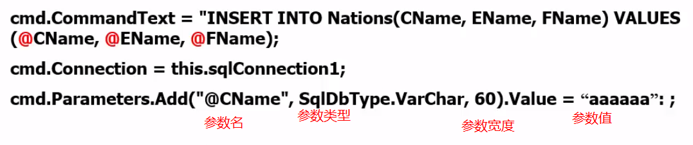

#### Connection对象

可用于连接到数据库管理数据库的事务。用于连接数据库的对象,表示到数据源的一个唯一的连接.

#### DataReader对象

DataReader对象只能对查询获得的数据集进行自上而下的访问（只读），但效率很高。如果仅仅是访问数据的话，可以使用DataReader。但DataReader要求一直连接，所以将结果的一小部分先放在内存中，读完后再从数据库中读取一部分，相当于一个缓存机制。这对于查询结果百万级的情况来说，带来的好处是显而易见的。

SqlDataReader.Read()方法可以读取下一行数据，然后按照列索引可以得到每一列的数据

用完后要SqlDataReader.Close()关闭对象

#### DataAdapter对象

是一种用来充当DataSet对象与实际数据源之间桥梁的对象。DataSet对象是一个非连接的对象，它与数据源无关。而DataAdapter则正好负责填充它并把它的数据提交给一个特定的数据源，它与DataSet配合使用，可以执行新增、查询、修改和删除等多种操作。

#### DataSet对象

表示内存中数据的缓存,可以把它想像成一个临时的数据库,它里可以存多个表(DataTable),而且是断开式的,不用每进行一次操作就对数据库进行更新,从而提高了效率,要与DataAdapter配合使用，可以自动生成Command对象：使用CommandBuilder（自动生成增删改数据的命令（往源数据库更新）），用new SqlCommandBuilder(DataAdapter)即可

过程：

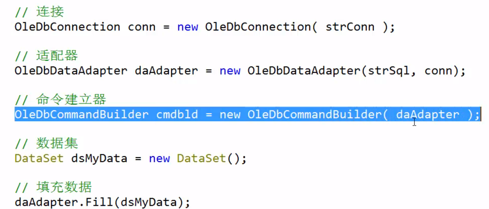

# WinForm

## 界面

Controls in Windows Forms are bound to a specific thread and are not thread safe. Therefore, if you are calling a control's method from a different thread, you must use one of the control's invoke methods to marshal the call to the proper thread.

所以界面都用一个UI主线程来工作，当Background线程需要去更新界面时候，需要使用Control.InvokeRequired去检查当前线程是否可以操作该控件，如果不是UI线程，则需要使用Invoke,BeginInvoke等方法去回到UI线程去执行方法。

[Control.InvokeRequired Property (System.Windows.Forms) \| Microsoft Docs](https://docs.microsoft.com/en-us/dotnet/api/system.windows.forms.control.invokerequired?redirectedfrom=MSDN&view=windowsdesktop-6.0#System_Windows_Forms_Control_InvokeRequired)

一个界面如果被创建，则说明Handle也被创建，IsHandleCreated可以简单理解为该控件已经被创建。如果该控件还没有Handle，Background线程也不能去创建Handle（即创建界面）。

## 启用控制台调试

<https://www.cnblogs.com/cyberarmy/p/7644179.html>

winform/WPF启用控制台调试

#### 双层窗体

<https://blog.csdn.net/arrowzz/article/details/70183494>

<https://www.haolizi.net/example/view_24546.html>

#### [WinForm中控件与背景透明](https://www.cnblogs.com/chengxiaohui/articles/1921608.html)

要实现C\# WinForm中的控件与背景的透明，可以通过设置控件的BackColor属性为Transparent，同时设置其父控件。因为在C\#中，控件的透明指对父窗体透明。  
如果不设置Parent属性，那么控件将只对Form透明，显示的时候都会把Form的背景色（默认为Control）重刷一遍作为自己的背景。  
在控件比较多的情况下，可以使用Panel控件，将某一组的控件都放到Panel中，然后只对此panel设置背景透明即可，则其他控件都跟着实现了背景透明。  
如，现有一PictureBox控件，十多个Label以及Button，那么只将这些Label和Button放入Panel中。同时在Form_Load事件中加入如下代码即可实现背景透明：  
 this.picturebox1.SendToBack();//将背景图片放到最下面  
 this.panel1.BackColor = Color.Transparent;//将Panel设为透明  
 this.panel1.Parent = this.picturebox1;//将panel父控件设为背景图片控件  
 this.panel1.BringToFront();//将panel放在前面  
以上代码即可实现所有的控件都对PictueBox背景图片透明

●解决按钮闪动

protected override CreateParams CreateParams

{

get

{

CreateParams cp = base.CreateParams;

cp.ExStyle \|= 0x02000000;

return cp;

}

}

**●取消标题栏后主界面拖动主界面能移动**

[DllImport("user32.dll")]

public static extern bool ReleaseCapture();

[DllImport("user32.dll")]

public static extern bool SendMessage(IntPtr hwnd, int wMsg, int wParam, int lParam);

public const int WM_SYSCOMMAND = 0x0112;

public const int SC_MOVE = 0xF010;

public const int HTCAPTION = 0x0002;

private void SheetChanger_MouseDown(object sender, MouseEventArgs e)

{

if (e.Button == MouseButtons.Left)

{

ReleaseCapture();

SendMessage(this.Handle, WM_SYSCOMMAND, SC_MOVE + HTCAPTION, 0);

}

}

# WPF

x:Class="Demo.MainWindow" //Demo那个命名空间下的MainWinodw类，指示xaml编译器把该xaml编译的结果和哪个类合并在一起

xmlns=”<http://schemas.microsoft.com/winfx/2006/xaml/presentation>” （不是网址，是硬编码字符串，编译器遇到这个就会把一系列名称空间映射到该xmal文件中）（实际上是在引用名称空间 全称xmlnamespace 这里没有给名字，可以有一个命名空间没有名字，用的是默认名称空间。引用的是绘制界面相关：控件、布局）

xmlns:x=”<http://schemas.microsoft.com/winfx/2006/xaml>” （命名为x名称空间，引用的是编译、解析xaml相关的）

xmlns:local=”clr-namespace:Demo” 引入Demo名称空间，取名为local

xmlns:extern=”clr-namespace:ExternDemo; assembly= ExternDemo” 引入外部库/第三方组件ExternDemo名称空间，取名为extern 注意要先引用类库后才能应用（右键项目中的reference引用，添加引用）

DMSkin要引入DMSkin.dll DMSkin.Core.dll ，要用模板风格要引入DMSkin.CyanDesign等，只能靠引入项目的方法导入模板。

Style="{StaticResource DMScrollViewer}"这种引入需要在app.xaml里面引入资源：

\<Application.Resources\>

\<ResourceDictionary\>

\<ResourceDictionary.MergedDictionaries\>

\<!-- 如果你用到DMSkin窗体需要导入 --\>

\<ResourceDictionary Source="pack://application:,,,/DMSkin;component/DMSkin.xaml" /\>

\</ResourceDictionary.MergedDictionaries\>

\</ResourceDictionary\>

\</Application.Resources\>

xaml编译的和cs文件编译的是同一个类，看partial关键字

namespace Demo

{

/// \<summary\>

/// MainWindow.xaml 的交互逻辑

/// \</summary\>

public partial class MainWindow: Window //这个partial关键字说明该类并不是仅由cs文件编译的

{

public MainWindow ()

{

InitializeComponent(); //该方法是xaml里面编译出来的

}

}

}

\<Button Width="120" Height="30"/\> //这种是空标签，不具有内容

\<Button Width="120" Height="30"\>

\<!--Content--\>//标签的内容 不是对象的内容

这样就能用复杂的方式赋值button ：在button里面加入一个矩形

\<Button.Content\>

\<Rectangle Width="20" Height=" 20" Fill="Black"\>\</Rectangle\>

\</Button.Content\>

\</Button\>

**App.xaml中有主窗口启动路径，如果移动mainwindow.xmal要更改它**

## 代码层：

**●获取当前主程序窗口对象用**

Application.Current.MainWindow

**●获取当前主程序窗口控件中的对象（需要用x:Name）**

Application.Current.MainWindow.FindName("xxx")

## 美化：

**●ScrollViewer**

如果没出现滚动条，去看看Grid的RowDefinition是不是设置height成auto了，如果是则去除这个属性即可

**●不规则窗体**

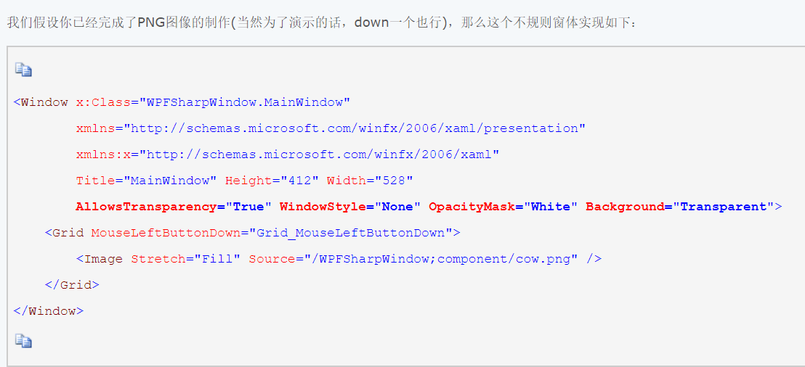

解释下这个xaml需要注意的属性设置：

allowstransparency="True" - 允许透明

background="Transparent" - 设置背景透明

windowstyle="None" - 去掉边框

opacitymask="White" - 设置白色透明

为Gird订阅的MouseLeftButtonDown路由事件，是为了实现窗体的拖动。事件处理如下：

private void Grid_MouseLeftButtonDown(object sender, MouseButtonEventArgs e)

{

this.DragMove();

}

**●使用多个Style**

原版无法实现，需要借助插件

<https://www.cnblogs.com/ainijiutian/p/apply-multiple-styles-to-one-element-for-wpf.html>

**●UI区域划分**

使用Grid、StackPanel

Grid的划分

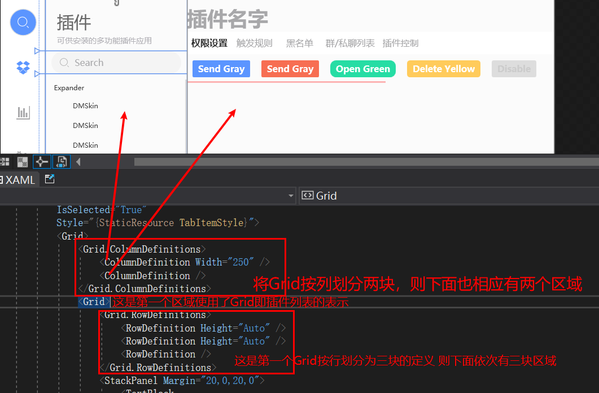

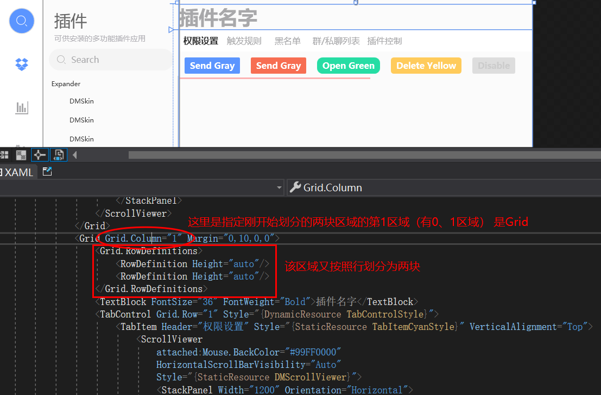

**圆角阴影Border**

\<!--圆角阴影Border--\>

\<Style x:Key="CircularShadowBorder" TargetType="{x:Type Border}"\>

\<Setter Property="BorderBrush" Value="Black"/\>

\<Setter Property="Effect"\>

\<Setter.Value\>

\<DropShadowEffect x:Name="OG" BlurRadius="11" Color="Black" Direction="50" Opacity="0.9" RenderingBias="Performance" ShadowDepth="1"\>

\<Storyboard.TargetProperty\>

BlurRadius

\</Storyboard.TargetProperty\>

\</DropShadowEffect\>

\</Setter.Value\>

\</Setter\>

\</Style\>

**●圆角图片**

Border的Background属性设置ImageBrush 这样会按照Border的边框填充图片

\<Border.Background\>

\<ImageBrush x:Name="img" ImageSource="pack://application:,,,/Xyz.Koubot.AI.UI;component/ExternUI/Image/avatar.jpg" Stretch="UniformToFill"/\>

\</Border.Background\>

## 资源引入：

**●静态资源和动态资源**

静态资源(StaticResource)指的是在程序载入内存时对资源的一次性使用，之后就不再访问这个资源了；动态资源(DynamicResource)使用指的是在程序运行过程中然会去访问资源。

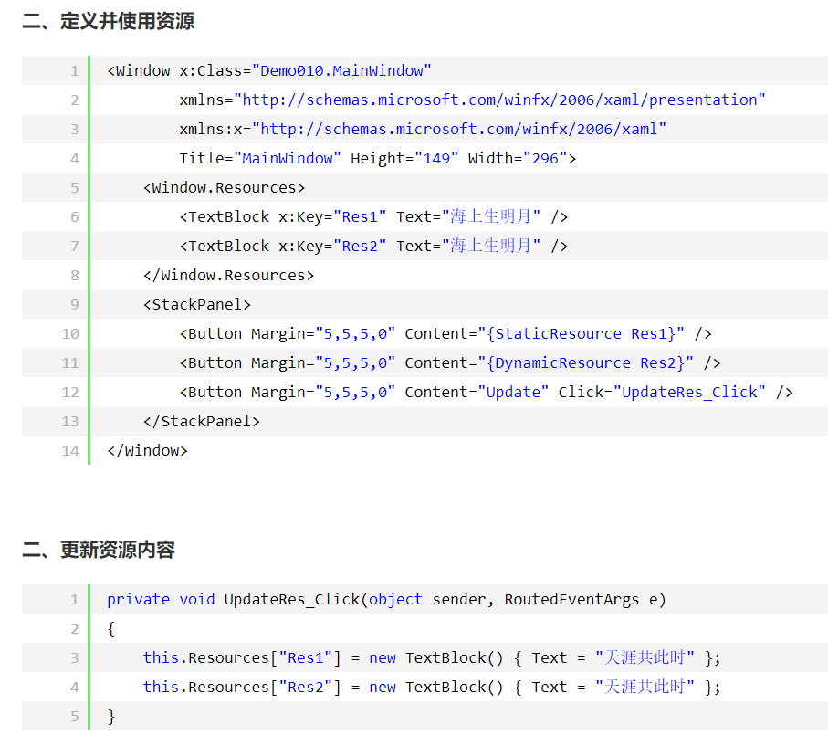

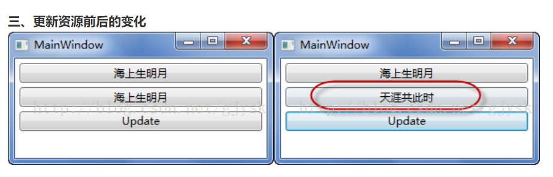

**●使用pack协议查找资源**

WPF引入了统一资源标

识Uri(Unified Resource Identifier)来标识和访问资源。其中较为常见的情况是用Uri加载图像。Uri表达式的一般形式为：协议+授权+路径

协议：pack://

授权：有两种。一种用于访问编译时已经知道的文件，用application:///。一种用于访问编译时不知道、运行时才知道的文件，用siteoforigin:///。在这里加载图片时，我们选用前者，即application:///，但是书写时候，我们一般用逗号代替斜杠，也就是改写作

| **Action**                 | **说明**                                                                                                                                                                                                                                                                                                                                                                                                                                                                                                                                                   |
|----------------------------|------------------------------------------------------------------------------------------------------------------------------------------------------------------------------------------------------------------------------------------------------------------------------------------------------------------------------------------------------------------------------------------------------------------------------------------------------------------------------------------------------------------------------------------------------------|
| **None**                   | 资源既不会被集成到程序集内，也不会打包到xap包中。不过我们可以通过设置CopyToOutputDirectory选项让其自动拷贝到xap包所在目录。 这种情况下, 访问这个图片的相对Uri需要以"/"开始。  适用场景：在大多数情况下，我们希望把video/audio文件放到xap的外面，因为这种文件一般都比较大，会影响silverlight应用的加载，而且一般的视频音频文件都是压缩格式的，放到xap中也不会起到减少他们文件大小的作用。 类似图片视频这种资源文件生成操作为None时和他们没有被添加到项目里是一样的，都可以用绝对Uri进行引用。                                                               |
| **Compile**                | 不适合用于资源文件。类文件要用"Compile"生成操作， 就是指项目里.cs或.vb文件。                                                                                                                                                                                                                                                                                                                                                                                                                                                                               |
| **Content**                | **资源会被打包在Xap包里面。这种情况下, 访问这个图片的相对Uri需要以"/"开始。在这种方式下，如果没有在xap中找到图片文件，那么silverlight会自动从当前xap应用所在的文件夹下来找所需图片文件， 如果还没有找到那么就触发ImageFailed事件， 这种方式比较适合在多个程序集引用相同文件时采用。**                                                                                                                                                                                                                                                                      |
| **Embedded Resource**      | 这种方式会把文件嵌入到程序集中，Silverlight无法通过Uri引用在xaml和C\#里对这个文件进行使用，微软不建议在Silverlight采用这种方式在程序集里嵌入资源。如果有这种需求可以用Reflection.Assembly.GetExecutingAssembly().GetManifestResourceStream(string path)相关的方法得到文件的Stream引用。调用uri：程序集名.文件夹.文件名.后缀名                                                                                                                                                                                                                              |
| **ApplicationDefinition**  | Silverlight程序的入口xaml文件(默认就是App.xaml)应该设置为这个"应用定义"。其他文件都不适合用这个。                                                                                                                                                                                                                                                                                                                                                                                                                                                          |
| **Page**                   | 不适合用于资源文件。所有的用户控件，页面和子窗体(Usercontrol/Page/Childwindow)的xaml文件应该采用的生成操作。 如果改为别的方式那么会导致后台对应的代码文件无法链接到这个xaml文件。 采用"Page" build action时xaml里的错误会导致工程无法正确生成。                                                                                                                                                                                                                                                                                                            |
| **CodeAnalysisDictionary** | 代码分析使用，Silverlight中可以忽略                                                                                                                                                                                                                                                                                                                                                                                                                                                                                                                        |
| **Resource**               | **资源会被打包在程序集内部。 选择这种生成方式后,该资源文件会被嵌入到该应用的程序集中，就是说打开生成的xap是看不到这个文件的。 可以用相对于当前的XAML文件的相对Uri访问,\<Image Source="sl.png" /\>或是\<Image Source="./sl.png" /\>, 在子文件夹里的可以用\<Image Source=”./images/sl.png” /\>访问到。最保险的方式是采用特有的程序集资源URI访问,格式为 \<Image Source="/{assemblyShortName};component/sl.png"/\>，这种方式还可以引用到xap中的其他程序集中的图片。这种生成方式的系统资源可以直接用Application.GetResourceStream(uri).Stream在代码里来得到。** |
| **SplashScreen**           | "SplashScreen"是这个选项是WPF的启动画面使用的。Silverlight启动加载画面是用的其他方式实现的，所以在Silverlight里不要用这个方式。                                                                                                                                                                                                                                                                                                                                                                                                                            |
| **EntityDeploy**           | 这个是EntityFramework采用的生成方式，在Silverlight里是没用。                                                                                                                                                                                                                                                                                                                                                                                                                                                                                               |

application:,,,。

路径：分为绝对路径和相对路径。这里我们选用相对路径，普适性更强。

下面，我们举一个简单的例子：

pack://application:,,,/images/my.jpg

当然，WPF默认Uri设置有pack://application:,,,，所以我们也可以直接将其写作：/images/my.jpg

后边写例子程序时，为了让读者更好的了解Uri，我们都采用完整的Uri写法。

下面在讲讲装载图片的两种方式，一种用XAML引用资源，一种用代码引用资源。

用XAML引用资源：

\<Image Source="pack://application:,,,/images/my.jpg"/\>

用代码引用资源：

Image img;

img.Source=new

BitmapImage(new Uri("pack://application:,,,/images/my.jpg"),UriKind.Relative);

若是提示找不到资源可试试项目重新生成

pack://application:,,,/Xyz.Koubot.AI.UI;component/ExternUI/Style/WhiteTheme.xaml 若是运行无法找到资源文件，需要明确程序集，Xyz.Koubot.AI.UI这个项目名，component指示项目初始目录

**●生成操作**

需要关注的是，对于媒体资源通常使用**Content与Resource两种不同的方式。**

## xaml

**●未将对象引用设置到对象的实例**

VS会自动的预编译程序，会按照程序在启动时的需要解释xaml，按照xaml中的顺序生成控件，先布局的先生成。在初始加载方法中启动异步线程，异步线程中使用前台控件绑定的属性，与主UI线程分属不同线程，VS判定不了先后顺序，会认为你使用的属性尚未实例，前台中会显示错误，正常启动程序时则不会出现问题。

**●标签扩展**

\<TextBox Text="{Binding ElementName=sld,Path=Value}"\>\</TextBox\>

\<Slider x:Name="sld" Value="50"\>\</Slider\>

**●x名称空间**

**x:Name** 为实例创建引用变量的名字，并注册到wpf结构树中

因为\<Button Width="20" Height="20" Content="Hello" /\> //这种只是生成了一个实例，并没有变量去引用这个实例，因此后台无法访问到，除非用繁琐的间接访问（从父级窗体出发GetChildren）

因此如果是\<Button x:Name="button1" Width="20" Height="20" Content="Hello" /\> 则在cs文件中能直接访问。

如果是直接使用wpf控件则标签中本来就有Name属性，是派生自FrameworkElement的，所以可以不用加x:，效果一样。

**x:FieldModifier** 即实例的访问修饰符(public、private)

**●Binding**

Binding需要一个数据源，是拿自己的或者上层的DataContext

当一个Binding只知道自己的Path而不知道自己的Source时，它会沿着UI树一级一级的向上查找，路过每个节点时都会查看这个节点的DataContext是否具有Path所指定的属性，直到找到为止。如果到了树的根部，还没找到那就是没有Source。

可以在最外层即Window层设置DataContext，则在window内所有的控件都能看到Source然后拥有binding数据源，数据源一般是ViewModel

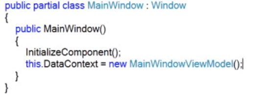

Binding有个StringFormat属性可以格式化字符串


\<DataGrid ItemsSource="{Binding CodeList}"\> 在MVVM框架中DataGrid需要写明ItemsSource属性，这样里面的DataGridTextColumn中的Binding属性就是一个个CodeList中包含的对象

private ObservableCollection\<DMCode\> codeList; 比如这里是DMCode类，其中有Email成员

则\<DataGridTextColumn Header="Email" Binding="{Binding Email}" \>\</DataGridTextColumn\>直接这样绑定Email

**一个控件两个属性绑定不同的DataContext：**

"{Binding RelativeSource={RelativeSource FindAncestor,AncestorLevel=1,AncestorType={x:Type Grid}},Path=DataContext.PlugInChangeCommand}"

**●框架**

MVC全名是Model View Controller，是模型(model)－视图(view)－控制器(controller)的缩写，一种软件设计典范，用一种业务逻辑、数据、界面显示分离的方法组织代码，将业务逻辑聚集到一个部件里面，在改进和个性化定制界面及用户交互的同时，不需要重新编写业务逻辑。MVC被独特的发展起来用于映射传统的输入、处理和输出功能在一个逻辑的图形化用户界面的结构中。


个人理解：

Model进行数据库交互，获取信息、所需要的数据

View提供显示，比如html或相应框架模板文件

Controller即供访问的api或访问入口文件，比如网站即访问controller，controller调用model里面的方法，将获取到的数据放到view中，显示view。

一般来说一个逻辑对应一组mvc，比如用户管理分用户管理model、用户管理controller、用户管理view

MVVM是Model-View-ViewModel的简写。它本质上就是MVC 的改进版。MVVM 就是将其中的View 的状态和行为抽象化，让我们将视图 UI 和业务逻辑分开。当然这些事 ViewModel 已经帮我们做了，它可以取出 Model 的数据同时帮忙处理 View 中由于需要展示内容而涉及的业务逻辑。

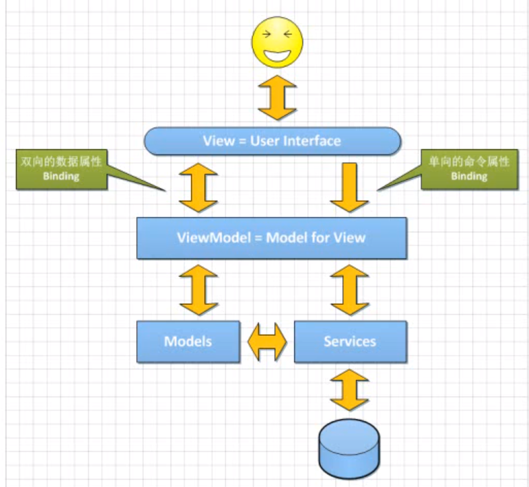

Model 现实对象的抽象的结果

View 即UI

ViewModel Model for View 即View的抽象（一一对应关系），为View需要的数据暴露接口（数据传递（用数据属性实现））、响应操作（传递操作（用命令属性实现））

数据传递：用控件实例中的Value或Text = {Binding 属性名}

操作传递：用控件实例中的Command = {Binding 命令名}

数据属性（NotificationObject）、命令属性（DelegateCommand）是特殊的可以notificate的（需要实现MVVC），通知Binding将数据传输到views上去

View的xaml需要绑定数据源DataContext 绑定对应的ViewModel，可以使用

\<Window.DataContext\>

\<viewmodels:XXXViewModel\>\</viewmodels:XXXViewModel\>

\</Window.DataContext\>

来绑定，viewmodels命名空间得在开头写例如

xmlns:viewmodel="clr-namespace:Xyz.Koubot.AI.UI.ViewModels"

NotificationObject 继承 INotifyPropertyChanged接口 实现接口，作为所有ViewModel的基类

DelegateCommand 继承ICommand

**ViewModel数据属性长这样：**

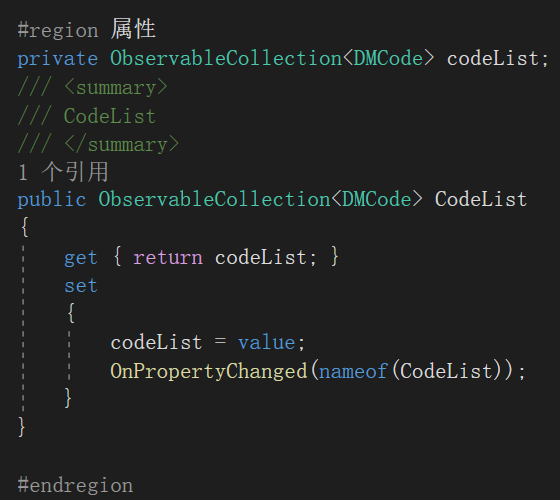

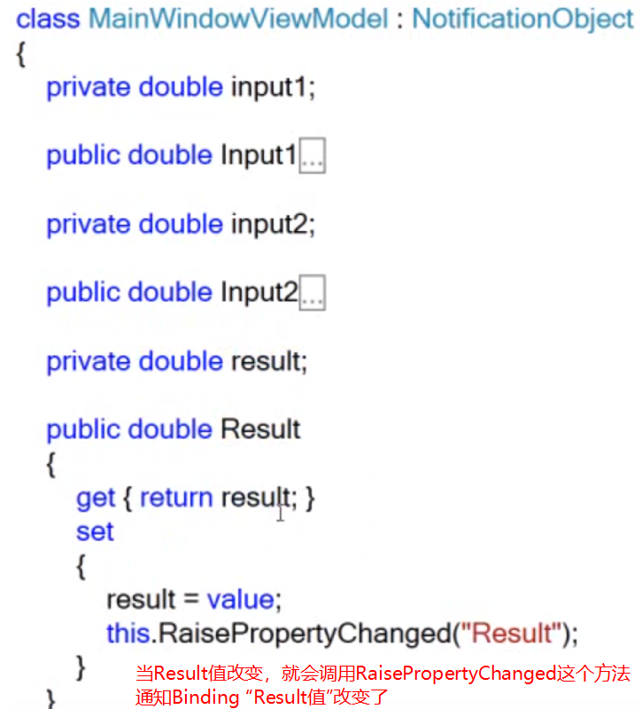

注：两个类实现的基类不一样，因此通知属性改变方法名字有些不一样

在界面xaml中是传递内容，所以比如TextBox里面的Text属性用Binding绑定传递的数据属性

**ViewModel命令属性长这样：**

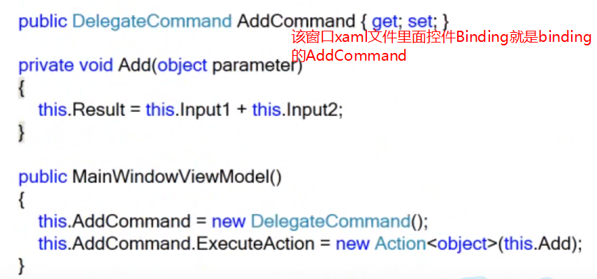

传递的是命令所以比如Button是Command属性Binding的命令属性

Binding数据源是用DataContext = 一个ViewModel类

项目的结构：

Data文件夹 数据文件

Models文件夹 存放数据类型定义，对现实数据抽象类

Services文件夹 接口、服务功能类定义

ViewModels文件夹 对应View里面的名字 比如MainWindow有MainWindowViewModel 但也有把某个模块抽象为ViewModel比如数据表格的每一个数据，是否可选中等(ViewModel里面可以包含ViewModel) 如果ViewModel里面包含的ViewModel里xaml中有要用到上一层ViewModel的DataContext需要重新指定相对Source

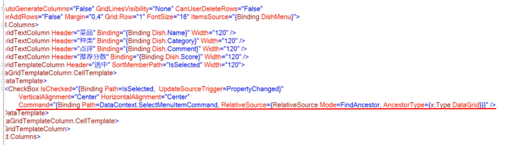

FindAncestor找外层的DataContext，AncestorType这里指定外层的DataGrid

Views文件夹，UI界面

**●MVVMLight框架**

ViewModelLocator类

实际上他就是一个很基本的视图模型注入器。在构造器中把使用到的ViewModel统一注册，并生成单一实例。

然后使用属性把它暴露出来，每当我们访问属性的时候，就会返回相应的ViewModel实例。

这样做的好处，一个是绑定化相对于简单粗暴的赋值方式，更合理。一个是在可视化窗口可以看到所绑定的数据，达到所见即所得的友好效果。

传参可以使用commandParameter属性 这是将自己传递过去的例子：

\<RadioButton Tag="2" Content="表情包制作" Style="{StaticResource MenuRadioButtom}" Command="{Binding PlugInChangeCommand}" CommandParameter="{Binding RelativeSource={x:Static RelativeSource.Self}}" /\>
