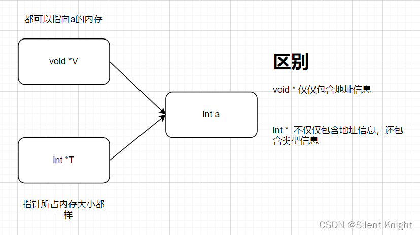

# C# 集合

## Dictionary

可以使用可空类型作为键，但是不可以为null（注意区分Java中的HashMap可以为null键）

### 不可以在foreach时修改Dictionary内的元素（.NET 5前）

可以使用for循环修改。或者ToList后遍历Key然后再用key返回去Dictionary修改。

## 数组相关

### List

List中的Contains方法是用的迭代调用Equal方法，所以时间复杂度为O(n)

### HashSet

HashSet Contains是计算item hash值，然后获得到hash集合中的index，所以时间复杂度为O(1)

ToHashSet的方法也挺消耗时间的，如果现在已经是List\<T\>，只需要进行一次Contains()，那么直接使用List的效率更高，如果先转为HashCode再进行Contains，会慢3倍时间左右。

所以只有当需要多次Contains的时候，再转换为HashSet较好（其实应该最开始就用HashSet而不是List）。

### Span\<T\>

Span\<T\>直接获取ref 引用，可截取一段，变为数组操作，直接在引用对象上进行修改。

从C/C++的角度来说，其实是封装了void\*类型的指针操作，它抽象了所有连续内存空间的类型系统，包括：数组、非托管指针、堆栈指针、fixed或pinned过的托管数据，以及值内部区域的引用。

不能存储在heap上，因为要规避被多个线程访问，只能在stack上，意思是不能存在类或结构体等字段（甚至是lambdas等表达式都不行）上保留，而只能在函数内部，作为一个tmp变量，确保只会有一个线程访问

使用它的理由：

字符串等操作，如SubString，是copy出来一份，而如果转化为Span操作，用Slice，则没有string allocation的开销。

IndexOf也是？（it does not need to create a copy of the data or allocate additional memory for processing.）

### ArraySegment\<T\>

可以看作是给定数组的一段，来界定、分割同一个数组，操作实际作用在原数组上。

## IEnumerable

●注意x.IsAssignableTo(typeof(IEnumerable)) 与 x.IsAssignableTo(typeof(IEnumerable\<\>))的区别

●注意string也是IEnumerable

●注意Where语句后的IEnumerable结果，如果使用foreach遍历过之后，再度where等操作进行，再foreach则不会有结果。因为是enumerator只能遍历一遍的类型。**（存疑）**

但似乎Sum()、Count()之类的，使用IEnumerable作为参数传入，其实它会诞生自己对于IEnumerable本身的IEnumerator对象进行迭代执行，所以又互不影响…

<https://learn.microsoft.com/en-us/dotnet/fundamentals/code-analysis/quality-rules/CA1851>

## Struct

### KeyValuePair

它是Struct，所以它的DefaultValue是strcut(default\<Key\>, default\<Value\>)

## String

在C++中，字符有char和wchar之分，相应的，字符串有string和wstring两种。C\#中，string是一个unicode字符串，相应的，每个char都是16位。 源文件中出现的字符串常量，都会被自动转换为unicode字符集，利用Text.Encoding，可以实现不同编码间的转换。

### string格式化

格式化是使用{0}、{1}对应所给的object位置

字符对于数值型的后面的截取一般会自动四舍五入，如果后面没有数字，一般默认保留两位小数

| **字符** | **说明**                     | **示例**                               | **输出**   |
|----------|------------------------------|----------------------------------------|------------|
| C        | 货币（结果跟系统的环境有关） | **string.Format**("{0:C3}", 2)         | ＄2.000    |
| D        | 十进制                       | **string.Format**("{0:D3}", 2)         | 002        |
| E        | 科学计数法                   | 1.20E+001                              | 1.20E+001  |
| G        | 常规                         | **string.Format**("{0:G}", 2)          | 2          |
| N        | 用逗号隔开的数字             | **string.Format**("{0:N}", 250000)     | 250,000.00 |
| X        | 十六进制                     | **string.Format**("{0:X000}", 12)      | C          |
|          | 零占位符0和数字占位符\#      | **string.Format**("{0:000.000}", 12.2) | 012.200    |
| P        | 百分比计数法                 | **String.Format**("{0:P3}",0.29768)    | 29.768     |
| F        | 小数点后的位数固定           | **string.Format**("{0:F3}", 250)       | 250.000    |

#### 日期格式化

string.Format("{0:d}",System.DateTime.Now) //结果为：2009-3-20 （月份位置不是03） 短日期模式

string.Format("{0:D}",System.DateTime.Now) //结果为：2009年3月20日 长日期模式

string.Format("{0:f}",System.DateTime.Now) //结果为：2009年3月20日 15:37

string.Format("{0:F}",System.DateTime.Now) //结果为：2009年3月20日 15:37:52

string.Format("{0:g}",System.DateTime.Now) //结果为：2009-3-20 15:38

string.Format("{0:G}",System.DateTime.Now) //结果为：2009-3-20 15:39:27

string.Format("{0:m}",System.DateTime.Now) //结果为：3月20日

string.Format("{0:t}",System.DateTime.Now) //结果为：15:41

string.Format("{0:T}",System.DateTime.Now) //结果为：15:41:50

日期中的T（2014-05-30T11:20:16）the "T" appears literally in the string, to indicate the beginning of the time element, as specified in ISO 8601.

#### string常用方法

固定保留几位小数

number.ToString("f2");

与int、double之间的转换

A = System.Convert.ToDouble(strA);

string.Equal中的StringComparison，使用OrdinalIgnoreCase效率更高

#### String与string大小写的区别

1.string是c\#中的类，String是.net Framework的类(在c\# IDE中不会显示蓝色)   
2.C\# string映射为.net Framework的String   
3.如果用string,编译器会把它编译成String，所以如果直接用String就可以让编译器少做一点点工作。如果使用c\#，建议使用string，比较符合规范   
4.String始终代表 System.String(1.x) 或 ::System.String(2.0) ，String只有在前面有using System;的时候并且当前命名空间中没有名为String的类型（class、struct、delegate、enum）的时候才代表System.String   
5.string是关键字，String不是，也就是说string不能作为类、结构、枚举、字段、变量、方法、属性的名称，而String可以。

#### @符号作用

C\#中的字符串,如正则表达式中,有可能出现一些与C\#语言相同的字符,比如"\\",会让编译器作为C\#语言来识别,截断该字符串,并可能产生编译器错误.

即忽略转义

### PadString

### Number

默认情况下输入浮点数是double类型，输入整数是int类型，而定义为其他类型时必须加后缀

| Type    | Suffix   | Example |
|---------|----------|---------|
| uint    | U or u   | 100U    |
| long    | L or l   | 100L    |
| ulong   | UL or ul | 100UL   |
| float   | F or f   | 123.45F |
| decimal | M or m   | 123.45M |

也支持Hexadecimal 和 binary

int sixteen = 16;

int sixteen = 0x10;

前缀0x:16进制表示法，可以用_分割，可以用在各种类型上面。但需要注意类型问题，比如 int a=0xFF_FF_FF_FF会提示类型错误。

前缀0b:2进制表示法，可以用_分割，可以用在各种类型上面。 