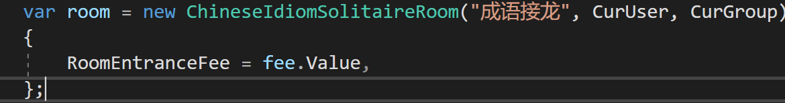

# 面向对象编程

## 重载（Overload）和重写（Override）

重载是在同一个类中有多个同名方法，但参数签名不同。

重写是父类和子类，子类不使用父类的方法而是重写父类的方法为自己的独特方法。

## 实例化类的执行顺序

子类的静态字段

子类的静态构造方法

子类的实例字段

父类的静态字段

父类的静态构造方法

父类的实例字段

父类的实例构造方法

子类的实例构造方法

静态字段赋值、构造方法只会执行一次。

第一次引用这个类的成员（不论是静态还是实例），将会开始进行静态字段、构造方法的运行。

静态字段、构造方法是线程安全的。Static constructors are guaranteed to be run only once per application domain, before any instances of a class are created or any static members are accessed.



这样子的属性实例化是对象创建完毕后才赋值的，所以是最后才生效的。

而在类上属性直接初始化的则和实例字段一样。

## 接口与抽象类

接口（interface）用于规范，抽象类（abstract class）用于共性。抽象类是类，所以只能被单继承，但是接口却可以一次实现多个。

抽象类中的abstract方法类似于接口，强迫继承它的类去实现，然后比接口更好的是能够提供共有的方法，子类就不必再次实现，直接用父类的方法。

接口中只能声明方法，属性，事件，索引器。而抽象类中可以有方法的实现，也可以定义非静态的类变量。

抽象类可以提供某些方法的部分实现，接口不可以。抽象类的实例是它的子类给出的。接口的实例是实现接口的类给出的。

在抽象类中加入一个方法，那么它的子类就同时有了这个方法。而在接口中加入新的方法，那么实现它的类就要重新编写（这就是为什么说接口是一个类的规范了）。

接口成员被定义为公共的，但抽象类的成员也可以是私有的、受保护的、内部的或受保护的内部成员（其中受保护的内部成员只能在应用程序的代码或派生类中访问）。

此外接口不能包含字段、构造函数、析构函数、静态成员或常量。

#### 常用判断关系的方法

```cs
// 判断对象是否是指定类型
// 类型可以是父类，接口
// 用法：父类.IsInstanceOfType(子类对象)
bool IsInstanceOfType(object);

// 判断两个类型的关系
// 类型可以是父类，接口
// 用法：父类.IsAssignableFrom(子类) 对应的有IsAssignableTo
bool IsAssignableFrom(Type);

// 判断两个类型的关系
// 类型不可以是接口
// 用法：子类.IsSubClassOf(父类)
bool IsSubClassOf(Type);

// 获取泛型类型typeof(GenericType<>)
Type GetGenericTypeDefinition();
```

> 注意：虽然 `IComparable a = b;` // b是`int?`，不会报错，但使用 `typeof(int?).IsAssignableTo(typeof(IComparable))` 会返回 `false`，这可能是设计上的一个bug。其原理可以参考 [Stack Overflow](https://stackoverflow.com/questions/39955837/why-isassignablefrom-return-false-when-comparing-a-nullable-against-an-interface)。

最好使用a is IComparable来判断是否实现了接口（但type却没办法了）

## Accessibility

### Default Accessibility

Classes, records, and structs: **internal** is the default if no access modifier is specified.

Class and struct members, including nested classes and structs, have **private** access by default.

interfaces default to **internal** access. Interface members are **public** by default because the purpose of an interface is to enable other types to access a class or struct.

## 值类型与引用类型

值类型存储在栈上，引用类型是指针存储在栈上，数据本身存在堆上。

### struct

对比class，struct读取效率更高，但如果作为参数传递，每次传递都得拷贝一份自己，因此也不佳。

<https://learn.microsoft.com/en-us/dotnet/csharp/language-reference/compiler-messages/cs1612>

注意这个错误，讲述了值类型容易犯得错误。

存入数组里的struct，使用索引后获取struct中的字段，是Copy一份返回的，而不是ref本身。

## 索引器（Indexer）

索引器（Indexer） 允许一个对象可以像数组一样使用下标的方式来访问。

当您为类定义一个索引器时，该类的行为就会像一个 虚拟数组（virtual array） 一样。您可以使用数组访问运算符 [ ] 来访问该类的的成员。

T this[int index]
{
    // get 访问器
    get
    {
        // 返回 index 指定的值
    }
    // set 访问器
    set
    {
        // 设置 index 指定的值
    }
}

## 属性

### 自动属性

设置自动属性默认值(C\#6.0及以上)

```cs
/// <summary>
/// 数据库连接文件路径
/// </summary>
public static string SqlSettingFileUrl { get; set; } = "KouSqlConfig.xml";
/// <summary>
/// 连接设置
/// </summary>
public static SqlConnectionSetting SqlConnectionString { get; set; } = LoadSqlConnectionSetting();
```

注意一个坑：如果这里将SqlSettingFileUrl与SqlConnectionString的位置交换，在LoadSqlConnectionSetting()方法中用到SqlSettingFileUrl则会为null

## 特性（Attribute）

特性是编译时确定的，只能传递常量，没有侵入性，不能传入变量等动态的东西

constructor of Attribute is run every time the GetCustomAttributes is invoked

特性类的构造函数是先运行然后才到标签的赋值。

The types of positional and named parameters for an attribute class are limited to the attribute parameter types, which are:

-   One of the following types: bool, byte, char, double, float, int, long, sbyte, short, string, uint, ulong, ushort.
-   The type object.
-   The type System.Type.
-   An enum type, provided it has public accessibility and the types in which it is nested (if any) also have public accessibility (Attribute specification).
-   **Single-dimensional arrays of the above types.** *(emphasis added by me)*

A constructor argument or public field which does not have one of these types, cannot be used as a positional or named parameter in an attribute specification.

| Attributes                  | Function                                   | Remark                                                                                                        |
| --------------------------- | ------------------------------------------ | ------------------------------------------------------------------------------------------------------------- |
| ModuleInitializer           | auto call static Initialize method         | <https://learn.microsoft.com/en-us/dotnet/csharp/language-reference/proposals/csharp-9.0/module-initializers> |
| InternalsVisibleToAttribute | 使得internal类或方法可以给给定程序集访问到 | [InternalsVisibleToAttribute Class (System.Runtime.CompilerServices) | Microsoft Learn](https://learn.microsoft.com/en-us/dotnet/api/system.runtime.compilerservices.internalsvisibletoattribute?view=net-7.0)                                                                                                              |
|                             |                                            |                                                                                                               |
|                             |                                            |                                                                                                               |

## 事件（Event）

需要一个委托作为事件处理的处理方法

public delegate void EventHandler(EventArg customArgs);

然后才可以定义事件

public event EventHandler CustomEvent;

事件的发生类型是（多播）委托，可以看作是事件发生后回调的（一个或多个）函数，Handle事件就是事件发生到事件完成中间多出了的固定步骤，"事件被hook"

一般事件定义在一个类中，表示这个类包含这种事件，如果要使用这个类，可以选择去实现这个类使用过程中要是发生了事件如何处理的这个机制，即注册事件。

注册事件的实现基于多播委托（其实事件就是多播委托的一种封装），即+=（底层重载过），事件这个委托就能够委托到（可以看作函数指针指向，不过不同的是能够多播、指向多个）这个被注册的方法了，事件被触发后注册到事件中的方法被依次调用。（说明调用是同步的）

个人理解类似于接口，也是一种规范，能够实现多态、解耦、完成拓展性设计，因为每个对象面对一个事件拥有不同的处理方法，每个对象若是要去处理这个事件，就是要去按照规范（事件发生类型，即委托类型）去注册这个事件，要求写一个满足处理这个事件需要的方法（按照委托方法类型来写，事件触发会提供触发对象、事件内容即事件参数），然后进行注册。然后事件发生后发现有注册了这个事件的处理方法就开始多播依次走一遍去完成事件的响应。

事件能够拥有返回值，因为是利用（多播）委托实现的。如果绑定多个，则获取的是最后一次绑定的方法的返回值，要都获取的话可以使用：

```cs
Delegate[] delArray = NumberChanged.GetInvocationList();
foreach (Delegate del in delArray)
{
    DemoEventHandler method = (DemoEventHandler)del;
    temp = method(temp);
}
```

这个方法来获取多个返回值

实现事件停止向下传递，需要设置e.Handled = true, 而后在下一个事件中检查是否已经赋值为true。

事件只能在类里面触发

Events are a special kind of multicast delegate that can only be invoked from within the class (or derived classes) or struct where they are declared (the publisher class).

事件触发必须有注册的委托，如果没有，会产生NullException。

所以要么初始化事件的时候给一个默认空委托，要么执行事件的时候 customEvent?.Invoke()

## 接口

### IDisposable接口

对于一些非托管资源，比如数据库链接对象（如DbContext类），需要手动实现这个接口去释放资源。

当使用using关键字来new资源的时候，using代码段最后会自动调用Dispose方法。（或者一般在try…finally代码段手动dispose）

注意，实现的IDisposable接口的类不会自动调用，系统实现的IDispose接口的类，都在析构函数中检查， 没调用过Dispose，则调用一次，而自己写的类并没有，因此即使等到GC垃圾回收时也不会自动调用Dispose方法，IDisposable的初衷就是提供一个方法能让用户尽早的释放非托管资源，而不是等到GC回收。

#### Dispose()方法

当需要回收非托管资源的DisposableClass类，就调用Dispoase()方法。而这个方法不会被CLR自动调用，需要手动调用。

### IComparable接口与IComparer接口

IComparable\<T\>是类用于Sort的（如List中）默认比较器，IComparer\<T\>是相对于默认比较器之外的拓展比较器。

Sort方法中也可以简单的使用Comparison委托方法来排序，而不需要建立类来实现IComparer\<T\>接口

Icomparable是IComparable\<T\>的父接口，可以判断泛型类是否实现了IComparable。 