# ASP.NET Core

## MVC架构

##### URL结构

一般：http://host:port/controller(控制器)/action(方法)

##### Model传值方式

ViewData、ViewBag、TempData、Model传值，后台传数据到前台，前台绑定数据

##### Session 会话 与 Cookies储存在用户本地终端上的数据

`Session`是在服务端保存的一个数据结构，用来跟踪用户的状态，这个数据可以保存在集群、数据库、文件中；

`Cookie`是客户端保存用户信息的一种机制，用来记录用户的一些信息，也是实现`Session`的一种方式。用户验证这种场合一般会用`session`

`HTTP`协议是无状态的协议，所以服务端需要记录用户的状态时，就需要用某种机制来识具体的用户，这个机制就是`Session`，标识用户并跟踪，一般放在服务器内存，使用缓存服务等。运行依赖`session_id`，然后`id`在`cookies`中，若是`cookies`禁用，`session`失效，但会使用`url`重写实现传递。`JSESSIONID`只是`tomcat`的对`sessionid`的叫法

> 现在过时，现在一般都使用`access`_`token`等，类似`session`_`id`

`aspnet`中是在`HttpContext`中，但已经不是标配，不能直接使用，需要进行配置：添加中间件以及服务实例


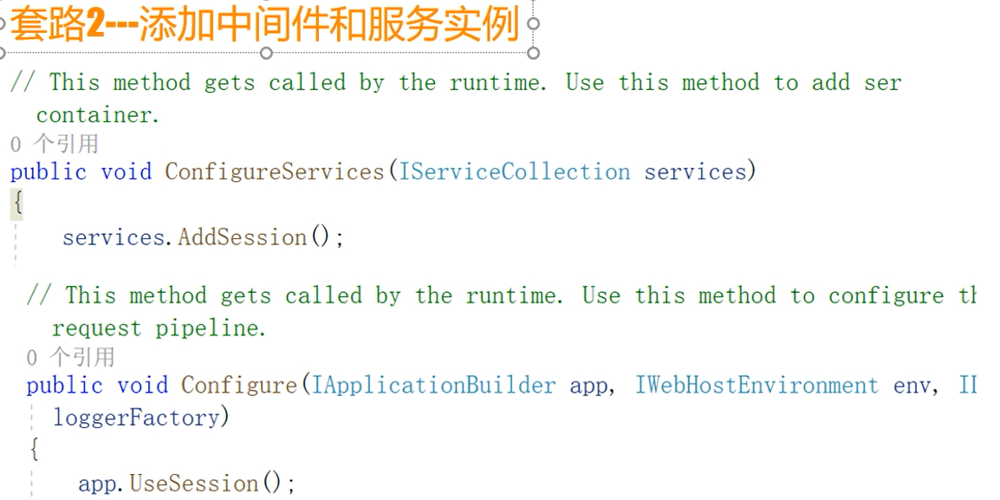

asp.net.core核心理念之一：pay-for-what-you-use 按需加载，要啥配置啥，不是原来asp.net的全家桶了。所以简约、高效。

##### Token机制

使用Identity Server4

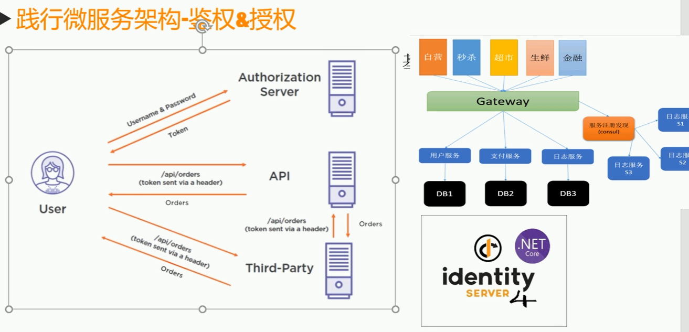

用户先通过登陆获取token，然后每次请求都带有token，请求到达Gateway之后会直接通过一种加密验证机制验证token是否有效，所以Gateway能够实现鉴权授权的效果。

## 控制台程序为什么变成了网站（原理）

HTTP协议是请求响应模型，浏览器访问端口传递数据，请求要进入到代码的话，需要有一个东西负责监听请求然后解析为HTTPContext，然后发给MVC程序。

ASP.NETCore里的这个东西叫做Kestrel，是精简高效的HttpServer，以包形式提供，自身无法单独运行。内部封装了对libuv的调用，作为I/O的底层，屏蔽各系统底层实现的差异，无需依赖IIS等，基于.NET Core CLR，是一个独立的程序了，因此做到了跨平台。

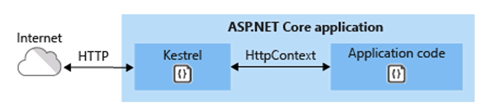

#### 创建服务器的入口

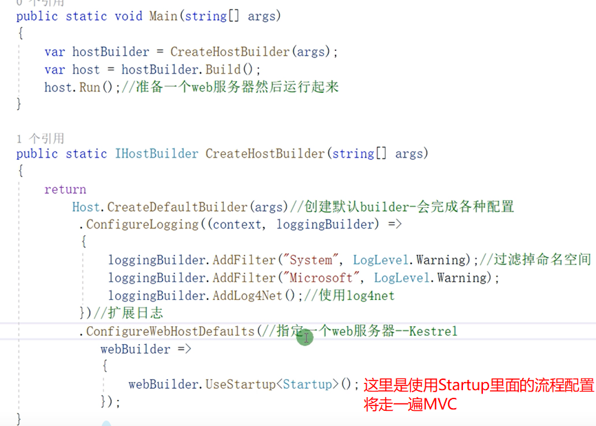

要对Kestrel进行配置，需要在appsettings.json中添加Kestrel节点，因为源代码中有这一操作

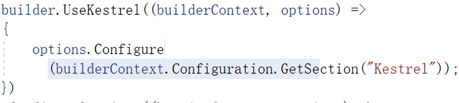

#### Startup类

是Kestrel服务器和MVC的关联配置。

Configure方法是配置Http请求的pipeline（管道），即Http请求的处理过程。即使Configure里面的所有中间件服务注释，仍然会成功运行，响应404，因为源码中的ApplicatinBuilder管道Build里面写了一个默认中间件404。

若只留一个：

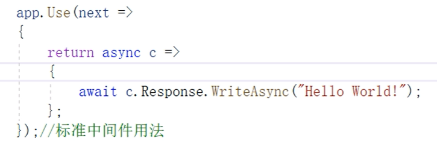

那么也会成功响应，且任何请求都返回Hello World！侧面证明这是从请求层面完整的响应处理。

所以MVC框架需要自行设计。即设计管道

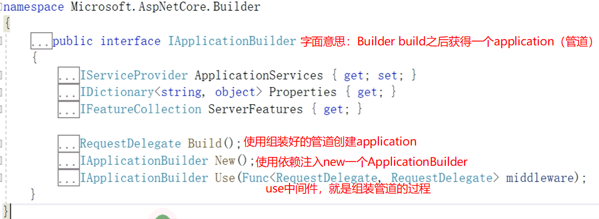

#### 管道模型（中间件、洋葱）


拼接管道原理（如何洋葱般的拼接一系列的delegate）

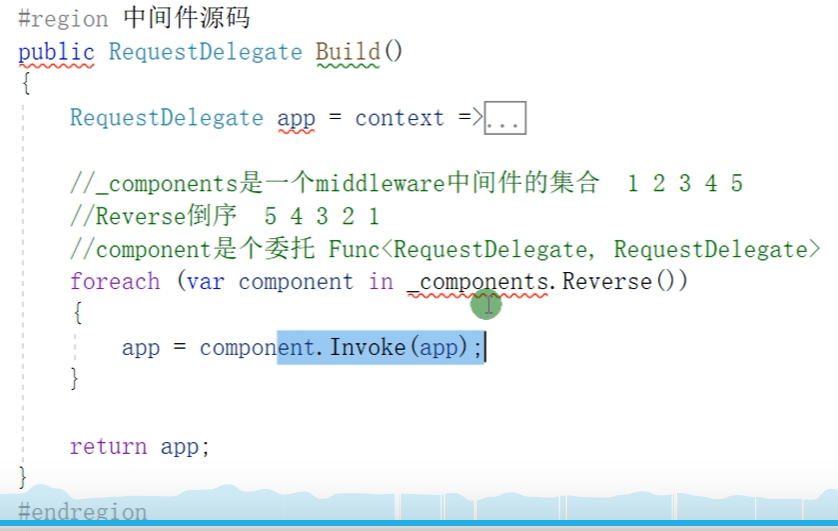

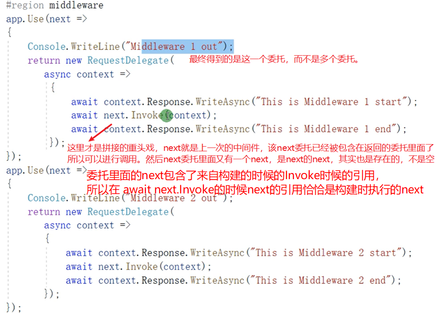

## 开发

使用VS开发的时候，properties里面的launchSetting.json文件配置的IISExpress启动、作为脚本命令行的程序启动，都是为开发服务的，在正式环境上是无效的。

- 可以使用**IIS**等**服务器**进行托管：

项目右键进行发布然后用IIS指向发布的文件夹即可, 不发布无法部署，直接指向则失败，因为没有对IIS与Kestrel之间的监听转发关系做配置，即缺少了发布时自动生成的web.config文件（见下图）

- 可以基于控制台**自托管**（因为内置了Kestrel服务器）：

编译运行之后，在`Debug`下的`netcoreapp3`.`1`文件夹里面使用`cmd`，然后使用`dotnet xxxxx（完整程序集名称）.dll --urls=http://*:8888 --ip="127.0.0.1" --port=8888`。它就会开始监听这个端口。若是编译不是发布，网站能够访问但是里面的资源、样式等一般会无法访问因为路径不对，因为`wwwroot`文件夹内文件没有自动拷入。

若是要调整静态资源文件路径，在Startup.cs文件中配置UseStaticFiles

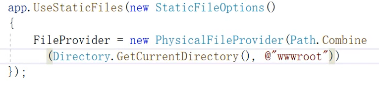

使用IIS托管的原理：

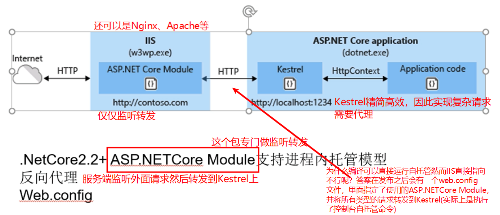

### 使用Configuration

<https://learn.microsoft.com/en-us/aspnet/core/fundamentals/configuration/?view=aspnetcore-7.0>

builder.Configuration实际上是按下图优先度读取配置（越前面的优先度越高）：

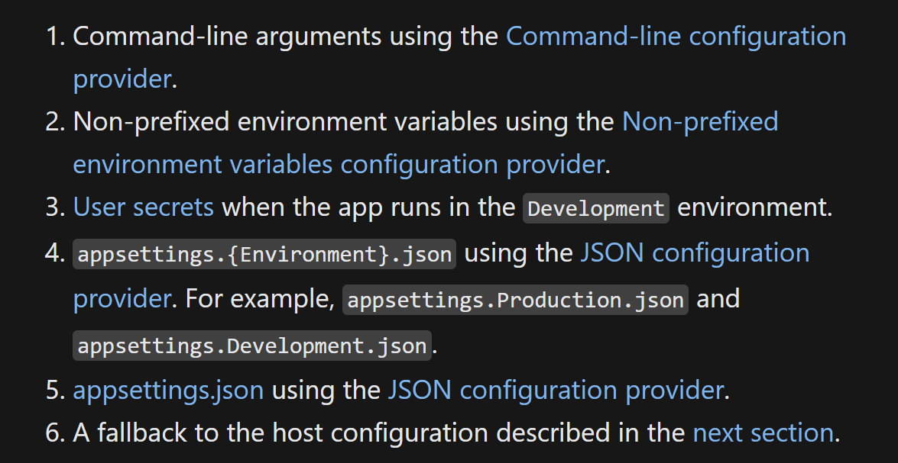

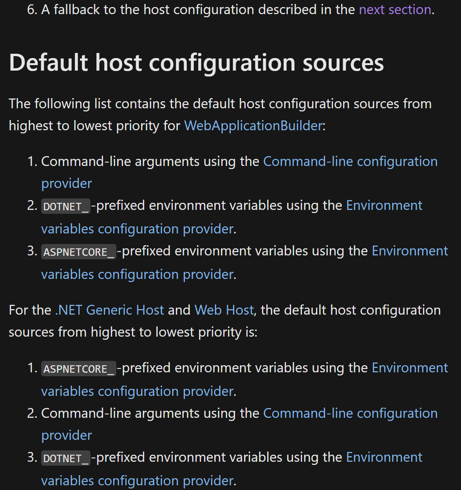

具体怎么选择看环境：

[Use multiple environments in ASP.NET Core | Microsoft Learn](https://learn.microsoft.com/en-us/aspnet/core/fundamentals/environments?view=aspnetcore-8.0)
Secrets and passwords should not be stored for production environments in the configuration files.

Consider using services like key vault on azure or database encrypted configurations or build server variables that will override the environment specific secrets.

还可以注册配置类（这就叫Options Pattern了，将配置转化为强类型配置）


```cs
builder.Services.Configure<FooSettings>(builder.Configuration);
```


[c# - What is the difference between services.Configure() and services.AddOptions\<T\>().Bind() when loading configuration in ASP.NET Core? - Stack Overflow](https://stackoverflow.com/questions/55762813/what-is-the-difference-between-services-configure-and-services-addoptionst)

具体：

[Options pattern in ASP.NET Core | Microsoft Learn](https://learn.microsoft.com/en-us/aspnet/core/fundamentals/configuration/options?view=aspnetcore-7.0#options-validation)

在服务中就可以`IOption<FooSettings>`来获取配置了

注意，`IOption`是只读取一次的。

`IOptionSnapshot`类似于`Scope`，下一次请求会重新读取配置。（无法注册到单例生命周期服务）

`IOptionsMonitor`则会即时读取配置。

通用读环境变量：

`Environment.GetEnvironmentVariable`

可以自己再弄一个`IConfiguration`字典，配置类相关接口，使用提供或自定义的`Configuration provider`加载配置。

- IConfiguration: Represents a set of key/value application configuration properties.

- IConfigurationRoot: Represents the root of an IConfiguration hierarchy.

- IConfigurationSection: Represents a section of application configuration values.

工厂模式创建ConfigurationRoot


```cs
IConfigurationRoot config = new ConfigurationBuilder()
.AddJsonFile("appsettings.json")
.AddEnvironmentVariables()
.Build();
```


### 使用内置IOC

抽象 实现 注册 使用

要用IoC最好全程都用IoC (Inversion of Control)

抽象是写一个接口，实现是实现这个接口。注册是在Startup的ConfigureServices里注册对接口服务的实现，然后在controller中依赖注入，即写一个private readonly接口成员，在构造函数里增加一个接口实例参数，然后赋值。

好处：

①去掉对于细节的依赖，方便拓展，减小影响范围，只需要改startup文件换一个接口实现实例，甚至可以转移到对配置文件的依赖，只需要修改配置文件。（解耦）

②假如没有IoC，一种服务如果依赖于其他的服务，比如服务D构造需要服务C，服务C构造需要服务B，服务B构造需要服务A，而且要知道全部实例细节。工程量巨大。但是IoC能够屏蔽细节，对象依赖注入（DI），要服务D就直接拿服务D，不必关心如何构造。 （屏蔽对象的实现细节）

③生命周期管理、AOP面向切面编程（Aspect Oriented Programming）

ASP.NETCore中的内置IoC容器是Microsoft.Externsions.DependencyInjection中的ServiceCollection，可以单独使用，但功能有一定局限性（比如只支持构造函数注入），可以换用第三方容器比如autofac。

三种生命周期：

- **AddTransient**：瞬时生命周期，每次使用都是会构造一个全新的实例。

- **AddSingleton**：单例，进程唯一实例（仅适用于需要单例的比如链接池、配置文件等，摒弃传统单例，即能够用IOC容器实现单例就不要自己写了）

- **AddScoped**：作用域单例，实际上是container对象.CreateScope()创建出来的一个“子容器”，所以作用域不同。同一个容器就同一个实例。不过在asp.net Core中，变成了一个请求一个实例，不同请求不同实例，因为一次请求底层构造了一个子容器实例，一次请求的意思就是一次http请求，第二次发同一个请求也算不同请求了。一次请求相同的情况是注册的服务用到多次的时候，注入进去的服务是同一个实例。

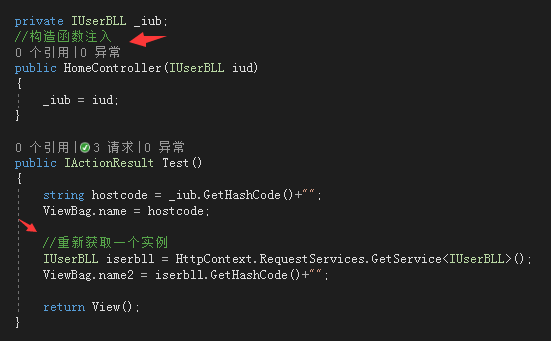

#### 手动获取依赖
[Why You Shouldn’t Call BuildServiceProvider in .NET Development | by Damien Vande Kerckhove | Medium](https://medium.com/@damien.vandekerckhove/why-you-shouldnt-call-buildserviceprovider-in-net-development-8e25f680d529)
单例不可提前获取

[ServiceProviderServiceExtensions.GetService\<T\>(IServiceProvider) Method (Microsoft.Extensions.DependencyInjection) | Microsoft Learn](https://learn.microsoft.com/en-us/dotnet/api/microsoft.extensions.dependencyinjection.serviceproviderserviceextensions.getservice?view=dotnet-plat-ext-7.0)

[c# - Resolving instances with ASP.NET Core DI from within ConfigureServices - Stack Overflow](https://stackoverflow.com/questions/32459670/resolving-instances-with-asp-net-core-di-from-within-configureservices)

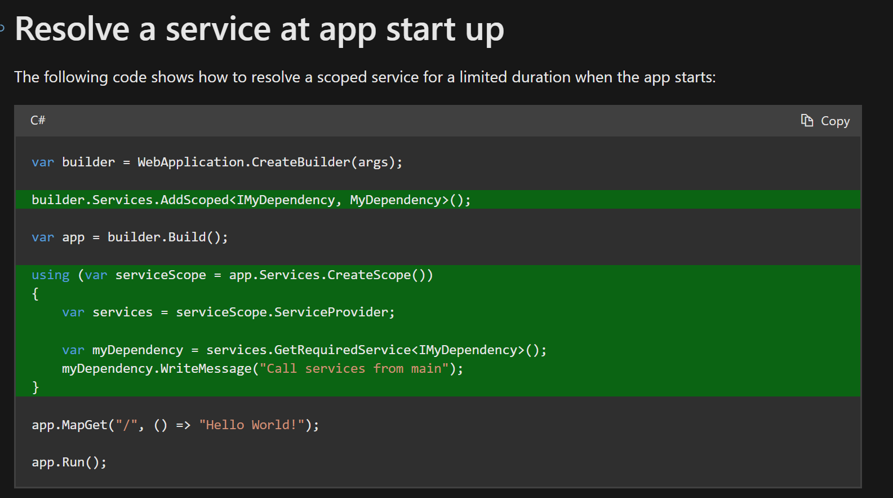

#### 使用第三方IOC容器（例 Autofac）

在asp.net Core的Program入口中的CreateHostBuilder中使用UseServiceProviderFactory替换IOC容器，然后Startup中的ConfigureService可以不再使用，而是另外写一个新的，比如autofac容器就可以写：ConfigureContainer(ContainerBuilder xxx)。

##### 注册服务并创建容器

通过创建 ContainerBuilder 来注册组件(类)并且告诉容器哪些组件暴露了哪些服务（接口）。

```cs
//在委托注册中使用 As<T>()，会明确哪个接口服务使用了哪个注册，并成为了LimitType（只能用As过的服务）。另外其实autofac自动会推断注册的服务支持哪些，As就会限制死（？未验证）
builder.RegisterType<ConsoleLogger>().AsSelf().As<ILogger>().As<IXXXX>;//通过类型注册一个或多个服务，AsSelf是暴露自身的服务（即自身）
builder.RegisterType(typeof(ConfigReader));//是使用依赖注入来构建这个类（比如这个类构造函数有接口用于注入，autofac会去查找容器内注册过的服务用于生成这个ConfigReader）
//组件生命周期
builder.RegisterType<XXX>().InstancePerDependency();//这是默认选项，每次需要服务都会返回一个新实例
builder.RegisterType<XXX>().SingleInstance();//单例（组件将会一直存在）
builder.RegisterType<XXX>().InstancePerLifetimeScope();//在特定的 ILifetimeScope 中请求服务，只返回一个实例
builder.RegisterType<XXX>().InstancePerMatchingLifetimeScope("x");//叫做x的Scope都是同一个实例（就像给子容器命名，同名的都是同一个实例）
//通过实例注册ITextwriter服务
var output = new StringWriter();
builder.RegisterInstance(output).As<ITextWriter>();
//通过Lambda表达式注册，在 Resolve() 调用性能提升10倍
builder.Register(c => new UserSession(DateTime.Now.AddMinutes(25)));//（这是构造函数参数注入）
//如果不止一个组件暴露了相同的服务, Autofac将使用最后注册的组件作为服务的提供方,除非使用PreserveExistingDefaults()
builder.RegisterType<ConsoleLogger>().As<ILogger>();
builder.RegisterType<FileLogger>().As<ILogger>().PreserveExistingDefaults();

```


IOC容器最好是单例的。

组件的生命周期与注册时定义有关，一般与容器的生命周期挂钩。为了充分利用自动的明确性释放, 你的组件必须实现 IDisposable. 你可以按需注册你的组件然后在组件解析的生命周期的结尾, 组件的 Dispose() 方法将会被调用。如果不想让autofac控制组件的自动释放行为，注册服务时使用ExternallyOwned()，即可以被外部所有者拥有的方式注册组件，它何时释放取决于你

##### 解析服务

在注册完组件并暴露相应的服务后，你可以从创建的IOC单例容器或其子生命周期中解析服务（Resolve()方法）。


```cs
//通过创建子容器（从生命周期中）解析服务，最好不要从根容器解析服务，可能会造成内存泄露
using(var scope = container.BeginLifetimeScope())
{
	var service = scope.Resolve<IService>();
}
```


#### AOP面向切面编程

使用ASP.NET Core中的Filter来实现AOP 思想（是使用的特性实现），比如有IActionFilter（在action执行前、执行后；controller调用前调用后，全局…前后?添加方法）、IResultFilter（结果前结果后）、ExceptionFilterAttribute（捕捉action、controller、全局发生的异常），特性Attribute有三种注册方式，action注册，控制器注册，全局注册。执行顺序是类似于中间件的管道模型，就像是“面向环形编程”：灵活扩展，随取随用


前两种是在方法或类上添加特性，第三种是在Startup里的Configure里使用Filters.Add添加filter特性类进行全局注册。

若是filter要依赖注入，但特性用一般方法是无法实现依赖注入的，filter的注入有四种方式：

Filter类的写法和控制器的依赖注入一样

①全局注册：这种方式会自动注入，

②ServiceFilter（一般的）：action、controller注册的特性使用[ServiceFilter(typeof(Filter))]而不是[Filter]。然后在Startup里的ConfigureService里注册那个类（只有一个参数，不是接口对应实例类两个参数，是让它注意一下自己自动依赖注入实例化一下）。

③TypeFilter（方便的） 与ServiceFilter类似，不同的是不需要再去ConfigureService里面注册

④IFilterFactory（个性化扩展） 这一种其实就是自己实现一遍ServiceFilter，也是要去ConfigureService注册。举例CustomFilterFactoryAttribute

2、3、4的依赖注入都是基于FilterFactory，所以若是自行实现的其他Filter的Attribute需要实现IFilterMetadata接口，不然无法依赖注入


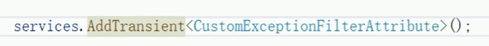

使用第三方的IoC的AOP实现，这是对一个依赖注入的类进行拓展，当其他类依赖注入这个类并调用的时候，会进行相应的AOP，因此这个实现了深入一个方法内部、业务逻辑层进行AOP，这种深入的一般都需要用第三方IoC容器实现：

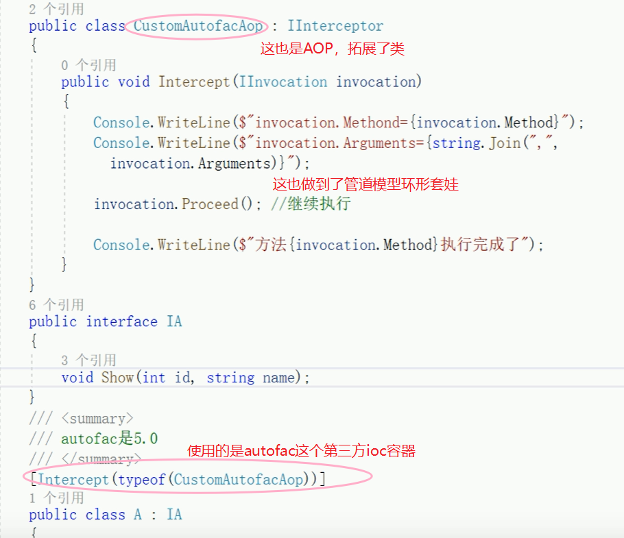

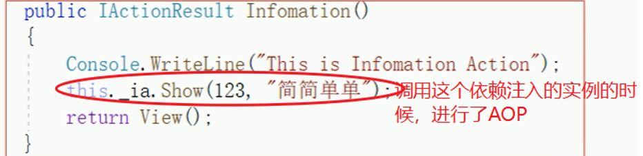

## 构建RESTful API

MVC映射为RESTful API，

Model，负责处理程序数据的逻辑

View，程序里负责展示数据的部分，那么API中的角色就是数据或资源的展示，比如使用Json。

Controller，负责View和Model之间的交互。如果仅需要通过asp.NetCore进行Web API编程，控制器类只需继承ControllerBase类即可，提供API相关支持，不需要继承Controller，因为Controller里面添加了对视图层的支持，适用于MVC Web应用程序而不是Web API。然后类加上特性[ApiController]

非强制但有优点：

①要求使用Attribute属性路由，即不能在Startup里面配置路由信息而是在Controller类中Action单独配置。

②验证Model含有错误信息时自动HTTP400响应

③推断参数绑定源

④Multipart/form-data请求推断

⑤错误状态代码的问题详细信息

数据获取是先写IService接口来抽象Model的获取然后用一个类继承接口来进行Model的获取处理，最后在Controller里面依赖注入，使用服务来获取资源，这样才能满足IOC。

ControllerBase父类里面有针对于HTTP 返回码的方法，Ok(资源)、NotFound()

### 属性路由

Controller类里面的action方法上写上[HttpGet]等可以限制只能使用Get方法来使用此action。然后[HttpGet(“{id}”)]也可以获取到后面的id值然后在action里面使用

但是若是没有在Startup里面配置路由，那么得改用属性路由即[HttpGet(“api/xxx/{id}”)]，即url模板，若是一个controller类里面的action开头都是api/xxx，那么可以提取出来，直接在类上再加一个特性[Route(“api/xxx”)]，这样action上的url模板就不必再写api/xxx了。

还有一种可以[Route(“api/[controller]”)]就是类名删去Controller之后的名字(需要满足Controller命名规范才行)，这样可以做到即使controller类名更改，api也会变动。

action除了用[HttpGet(xxx)]来写路由模板，也可以通过[HttpGet]再加[Route(“xxx”)]来写

api消费者可以在Header请求头中写Media Type 比如application/json或application/xml来表明自己期望返回的数据格式。如果填写的是服务端没有支持的类型，最好是返回406 Not Acceptable（但默认asp.net core会返回默认的处理格式，需要配置Controller才能自动返回406）。与之相对应的请求头中写的Content-Type Header就是表明输入格式，api消费者给的消息是什么格式的，提醒服务端用那个格式来解析。asp.net core里输入输出配置就是output/input formatters，默认情况下使用json作为输入和输出的格式化器。

配置Controller是在ConfigureServices中AddControllers里面的

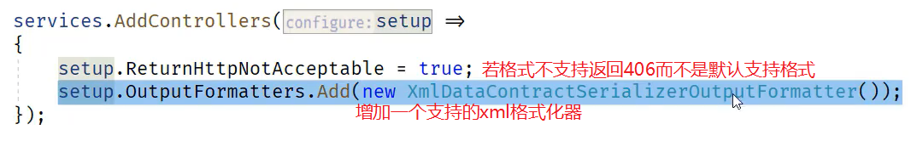

3.0后的写法是

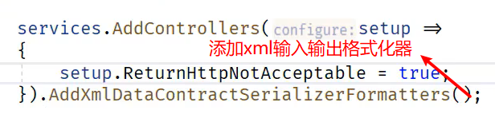

使用POST新建资源

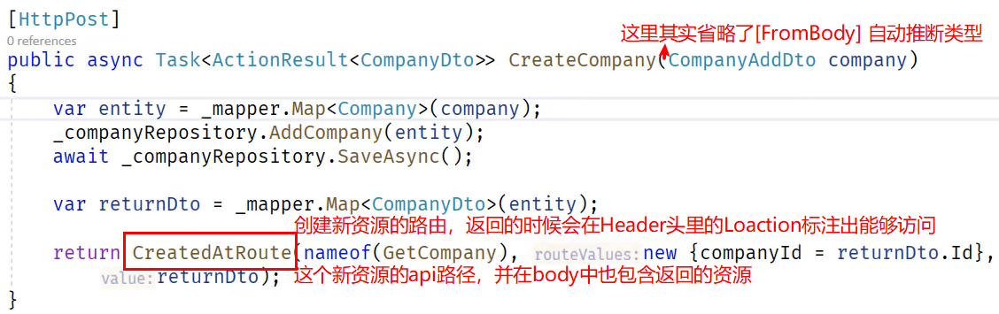

### API属性/字段映射

| Attribute    | 功能                               | 备注                                                                  |
|--------------|------------------------------------|-----------------------------------------------------------------------|
| [FromBody]   | body头中，json序列化，只能有一个   | 默认按照参数名匹配，如果不一致，使用attribute内的Name属性指明，下同。 |
| [FromQuery]  | /api/controller/get?id=1&name=John |                                                                       |
| [FromRoute]  | /parameter/value/parameter2/value2 |                                                                       |
| [FromHeader] |                                    |                                                                       |

### 外部Model和数据库Model

即数据库映射的Entity Model和api里面需要面向外部的model（可理解为viewmodel视图模型），所以它们应该分开，这样数据库更新后，api不会频繁受影响，能够更加健壮、可靠、更易于进化。这种面向外部model也可以叫做数据传输对象（DTO)(Data Transfer Object)。System.ComponentModel.DataAnnotations中有很多对于Model的验证限制。

另外发现Asp.Net Core中的Dto类（Model）在用于Controller中的body自动进行json反序列化时，默认是都不可为null的，如果传过来的json字段少了，会直接响应错误json。这种情况Dto类里面的字段需要加?，没错，string类也要加“?”才代表这字段可null，json不必传输。

#### AutoMapper

能够自动映射object到另一个object。专门为ASP.NET Core服务的一个扩展服务是在AutoMapper.Externsions.Microsoft.DependencyInjection中，是，在Startup中注册服务AddAutoMapper(xxxx程序集); 会去程序集中扫描automapper配置文件。配置文件的写法是新建一个继承Profile（AutoMapper中的）的类

配置：

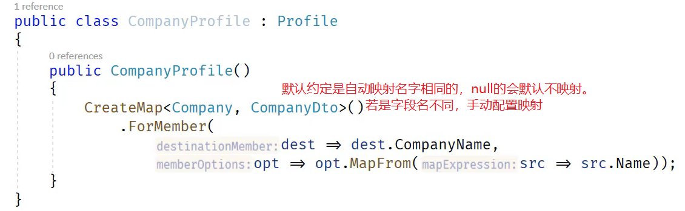

使用（这里是用了依赖注入IMapper）：

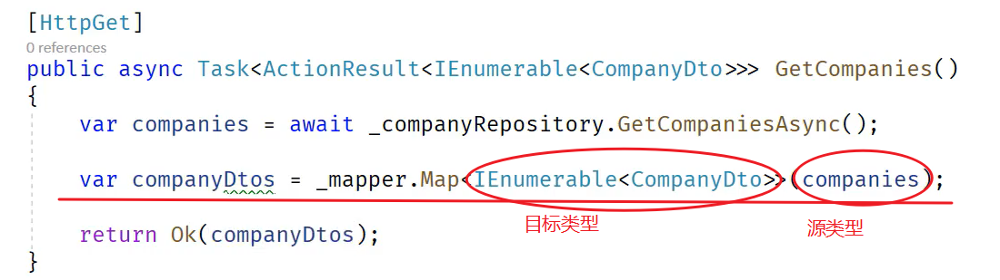

**功能**

①支持直接map到配置过的目标类型的集合类：IEnumerable、ICollection、IList、List、Arrays

mapper.Map\<IEnumerable\<XXX\>（目标类型）\>(源类型);

②处理空集合，源类型中的集合类型为null，则会自动映射到目标类型为空集合而不是null。

③方法到属性映射，可以直接像配置映射到属性一样映射到方法，只要返回值一致，不需要其他配置。

④自定义映射，当目标类型和源类型属性名或类型不一致，需要做一些转换时，使用自定义映射

1.  var config = **new** MapperConfiguration(cfg =\>
2.  {
3.  cfg.CreateMap\<Employee, EmployeeDto\>()
4.  .ForMember("EmployeeID", opt =\> opt.MapFrom(src =\> src.ID))
5.  .ForMember(dest =\> dest.EmployeeName, opt =\> opt.MapFrom(src =\> src.Name))
6.  .ForMember(dest =\> dest.JoinYear, opt =\> opt.MapFrom(src =\> src.JoinTime.Year));
7.  });

例子是ID 和 EmployeeID 、EmployeeName和Name属性名不同，JoinTime 和 JoinYear 不仅属性名不同，属性类型也不同。

其实用法就是ForMember(目标字段对象，其值的来源/映射方法（可以用方法计算因为是labmada）)

⑤嵌套映射，只要注册过的类型的映射，那么源类型里面的注册过的类型就会相应的自动映射。

**其他配置**

①可见性（ShouldMapProperty）

默认情况下，AutoMapper 仅映射 public 成员，但其实它是可以映射到 private 属性的。需要注意的是，这里属性必须添加 private set，省略 set 是不行的。

②全局属性/字段过滤（ShouldMapField）

默认情况下，AutoMapper 尝试映射每个公共属性/字段。

### 返回类型

Controller返回类型一般是Task\<IActionResult\>，实际上明确写出来就是Task\<ActionResult\<T\>\>，这种明确的好处是用一些第三方的api文档生成器的时候自动生成更详细的文档比如返回类型的属性，比如Swashbuckle的Swagger文档。

### API文档（使用Swagger）

ASP.NetCore安装Swagger，是Swashbuckle.AspNetCore包中的。

#### 配置Swagger

Startup的configureService中添加

1.  services.AddSwaggerGen(c =\>
2.  {
3.  c.SwaggerDoc("v1", **new** OpenApiInfo {Title = "Koubot API", Version = "1.0"}); //OpenApiInfo会对API文档增加说明信息
4.  c.IncludeXmlComments(System.IO.Path.Combine(AppContext.BaseDirectory, "Koubot.Server.xml"));
5.  });

添加中间件服务 （注意这里的”v1”,必须一样才会找到json）

1.  app.UseSwagger(); //启用中间件服务生成Swagger作为JSON终结点
2.  //启用中间件服务对swagger-ui，指定Swagger JSON终结点
3.  app.UseSwaggerUI(c =\>
4.  {
5.  c.SwaggerEndpoint("/swagger/v1/swagger.json", "Koubot API v1.0");
6.  c.RoutePrefix = string.Empty;//默认访问swagger UI是/swagger，设置为空可以直接通过url访问
7.  });

##### 为接口文档添加注释

项目设置中的“生成”，启用XML文档文件，输出最好写bin\\xxxx.xml，这时会增加一个warning的提示，对公有方法未写xml注释会有波浪线，在“禁止显式警告”中添加1591

注释格式：

1.  /// \<summary\>
2.  /// 这是一个带参数的get请求
3.  /// \</summary\>
4.  /// \<remarks\>
5.  /// 例子:
6.  /// Get api/Values/1
7.  /// \</remarks\>
8.  /// \<param name="id"\>主键\</param\>
9.  /// \<returns\>测试字符串\</returns\>
10. /// \<response code="201"\>返回value字符串\</response\>
11. /// \<response code="400"\>如果id为空\</response\>

SwaggerUI可以测试api接口

然后运行，访问设定的json地址，比如这里就是访问<http://localhost:port/swagger/v1/swagger.json>，获取api的json信息。

使用这个api json信息复制到swagger官网的编辑器中，可以选择生成对应语言的客户端SDK。

C\#的SDK有bug，需要做一些修改才能直接使用：

simply override the property BasePath and add a personal static property ApiHost into GlobalConfiguration, and go back to its parent class Configuration constructor and annotate BasePath = "/"; , and just at first define the GlobalConfiguration.ApiHost, then it work for all api without any configure.

就是用BasePath赋值一个静态变量

另外生成dll也有bug，需要打开bat文件然后手动下载最新的nuget到目录再运行。但bat还是有bug，所以还是直接复制IO.Swagger项目直接引用使用，记得需要把依赖的三个dll（用bat生成的）复制到项目然后IO.Swagger去引用。

<https://www.cnblogs.com/gdsblog/p/9279814.html> 版本控制

<https://blog.csdn.net/shujudeliu/article/details/82189262> token设置

<https://www.cnblogs.com/gl1573/archive/2020/04/07/12652708.html> 其他避坑

似乎enum上的注释不支持，只能显示enum类上的注释，所以要把所有数字代表的写在一起…

### 使用配置文件

Controller类里面可以依赖注入IConfiguration，

然后_configuration.GetSection(“node”).GetValue\<类型\>(“子node”)


# 部署

**局域网简单部署**

dotnet xxx.dll --urls=http://currentIP:port

然后配置防火墙：

Windows安全中心：高级设置（高级安全Windows Defender防火墙）

入站规则中添加刚刚监听的端口。

就可以让局域网其他的电脑访问。

[8 ways to set the URLs for an ASP.NET Core app (andrewlock.net)](https://andrewlock.net/8-ways-to-set-the-urls-for-an-aspnetcore-app/)

**公网部署**

类似于局域网部署。

但是IP需要查找一下，ipconfig，而不是使用公网IP。

### WebAssembly部署

需要从Server使用Publish功能进行部署，比如Publish到文件夹。

### 最好在dll当前目录下进行启动服务

比如如果从C盘使用dotnet D:\\xxx.dll，则会导致非常多的问题，比如本地数据库sqlite路径访问不到（相对路径问题）

## HTTPS部署

### 本地开发

①dotnet dev-certs https --trust 使用该命令信任dotnet的SSL开发证书。（一般安装的时候似乎已经信任了？）

②在launchSettings.json修改启动链接由http改到https。

如果使用IIS Express启动（是VS集成的ASP.NET Core默认的Debug与测试的IIS的轻量版本），要非常注意的是，如果不是使用Admin权限启动（*其实试了以管理员启动VS也不行*）IIS Express进行Debug，则会存在

ERR_SSL_PROTOCOL_ERROR（浏览器）、Cannot determine the frame size or a corrupted frame was received.（dotnet客户端）等问题

它默认不需要管理员权限的端口在安装时预留了**44300-44399**（可以使用netsh http show sslcert命令看到），所以也可以修改launchSettings.json中IIS的applicationUrl为这些预留端口上的端口。（有时候44300之类的也用不了，换个端口试试）

## 作为前端服务器

使用app.UseStaticFiles();默认将当前运行目录下的wwwroot作为baseDirectory

所以只需要将VUE等生成的dist文件夹中的内容，拷贝到wwwroot下即可。

# SignalR

多种实现双向通信协议的封装与抽象（WebSocket、Server-Sent Events、Long Polling，根据实际Client兼容情况向后Fallback。后续会根据技术迭代增加gRPC等），实时推送解决方案。

所以无法简单的向下兼容使用如原生WebSocket直接连接SingalR。

强行兼容：<https://www.derpturkey.com/signalr-is-an-abomination-how-to-connect-using-raw-websockets/>

优点：

自动选择支持的双向通信技术、新技术迭代后无需改动代码享受高性能协议。

封装方式是RPC，代码易读易懂，扩展方便。

多种自带功能，如重连等。

一种适合于.NET（也支持Javascript）的RPC技术，用于构建实时性的Web app。

<https://docs.microsoft.com/en-us/aspnet/core/blazor/tutorials/signalr-blazor?view=aspnetcore-6.0&tabs=visual-studio&pivots=webassembly>

建议使用强类型

public class StronglyTypedChatHub : Hub\<IChatClient\>

[https://docs.microsoft.com/en-us/aspnet/core/signalr/hubs?view=aspnetcore-6.0\#strongly-typed-hubs](https://docs.microsoft.com/en-us/aspnet/core/signalr/hubs?view=aspnetcore-6.0#strongly-typed-hubs)

这里Hub中的接口IChatClient是指Client method：

The return value of a client method must be void or of type Task.

Client端的强类型暂时未实现：

<https://github.com/dotnet/aspnetcore/issues/32534>

## Handle events for a connection

The SignalR Hubs API provides the OnConnectedAsync and OnDisconnectedAsync virtual methods to manage and track connections. Override the OnConnectedAsync virtual method to perform actions when a client connects to the hub, such as adding it to a group

## Send messages from outside a hub

通过Controller获取Hub进行调用。

已经自动注册：

private readonly IHubContext\<NotificationHub\> \_hubContext;

private readonly IHubContext\<ChatHub, IChatClient\> \_strongChatHubContext;

## 不同的Hub不同的连接？

[https://docs.microsoft.com/en-us/aspnet/signalr/overview/guide-to-the-api/hubs-api-guide-server\#multiple-hubs](https://docs.microsoft.com/en-us/aspnet/signalr/overview/guide-to-the-api/hubs-api-guide-server#multiple-hubs)

如果使用多Hub，需要用proxy：

[https://docs.microsoft.com/en-us/aspnet/signalr/overview/guide-to-the-api/hubs-api-guide-net-client\#how-to-create-the-hub-proxy](https://docs.microsoft.com/en-us/aspnet/signalr/overview/guide-to-the-api/hubs-api-guide-net-client#how-to-create-the-hub-proxy)

# gRPC

gRPC 最初由谷歌开发，是一个基于 HTTP/2 实现的高性能远程过程调用框架。但由于浏览器没有直接暴露 HTTP/2，所以 Web 应用程序不能直接使用 gRPC。

gRPC Web 是一个标准化协议，它解决了这个问题。

**注意，grpc传输使用http/2协议，而http/2协议需要https。**

[https://learn.microsoft.com/zh-cn/aspnet/core/grpc/troubleshoot?view=aspnetcore-7.0\#call-insecure-grpc-services-with-net-core-client](https://learn.microsoft.com/zh-cn/aspnet/core/grpc/troubleshoot?view=aspnetcore-7.0#call-insecure-grpc-services-with-net-core-client)

gRPC有四种调用方式

[https://learn.microsoft.com/en-us/aspnet/core/grpc/services?view=aspnetcore-7.0\#implement-grpc-methods](https://learn.microsoft.com/en-us/aspnet/core/grpc/services?view=aspnetcore-7.0#implement-grpc-methods)

不过gRPC都是只支持一个请求参数（即接口的请求类只能有一个）

Unary

单项请求响应类，类似普通RESTful API。

Server streaming

客户端发送消息请求后，服务端流式发送，即可以一直保持连接，服务端随意间隔发送消息。客户端可发送取消连接的CancellationToken，但无法发送信息给服务端。服务端完成消息发送后结束。

Client streaming

客户端请求建立连接后，客户端不断流式发送消息给服务端，服务端异步监听获取，直到服务端返回响应后结束。

Bi-directional streaming

双向流即建立连接后，双方都可以流式的异步发送消息。

服务端可以多线程进行异步读取和异步发送，也可以单线程地异步读取并处理而进行发送响应。

而gRPC Web不支持Client和双向流。

整体上不建议使用gRPC Web。即前端还是老实使用RESTful API。

后端服务间调用建议采用gRPC

## 概念

<https://docs.microsoft.com/en-us/aspnet/core/grpc/client?view=aspnetcore-6.0>

## 最佳实践

-   Creating a channel can be an expensive operation. Reusing a channel for gRPC calls provides performance benefits.
-   gRPC clients are created with channels. gRPC clients are lightweight objects and don't need to be cached or reused.
-   Multiple gRPC clients can be created from a channel, including different types of clients.
-   A channel and clients created from the channel can safely be used by multiple threads.
-   Clients created from the channel can make multiple simultaneous calls.

## Protobuf-net

<https://github.com/protobuf-net/protobuf-net>

可以使用该第三方库从Class生成proto文件。

protobuf-net.BuildTools 该工具可以检查使用[ProtoContract]或[Service]定义的语法错误

教程及介绍

<https://learn.microsoft.com/en-us/aspnet/core/grpc/code-first?view=aspnetcore-7.0>

<https://protobuf-net.github.io/protobuf-net.Grpc/gettingstarted>

### 效率测试

<https://github.com/protobuf-net/protobuf-net.Grpc/issues/151>

# Unit Test

## Moq

In simple English, Moq is a library which when you include in your project give you power to do Unit Testing in easy manner. Why? Because one function may call another, then another and so on. But in real what is needed, just the return value from first call to proceed to next line. Moq helps to ignore actual call of that method and instead you return what that function was returning. and verify after all lines of code has executed, what you desired is what you get or not. Too Much English, so here is an example:


### Cookies

<https://stackoverflow.com/questions/4463610/httpwebrequest-cookie-with-empty-domain>

CookieContainer是像浏览器一样，可以给多个HttpWebRequest复用的，所以需要声明出Cookie的Domain、Path。（即，request目标是匹配访问Domain+Path的才会使用该Cookie，否则不使用）

#### Response中的Cookies

如果Request没有使用CookieContainer时，那么返回的Response也不会有Cookie（但可以在Header看到）。所以要Cookie得需要再Request时候新建一个CookieContainer。