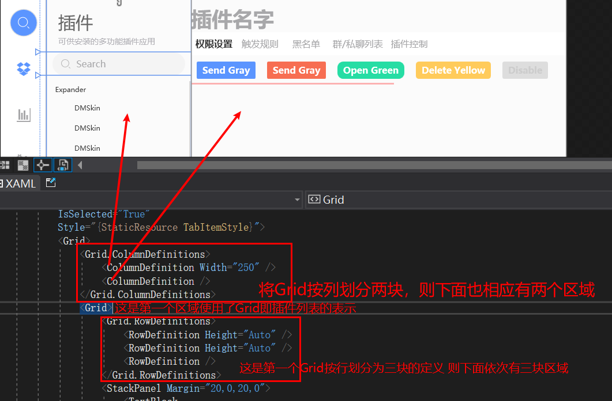
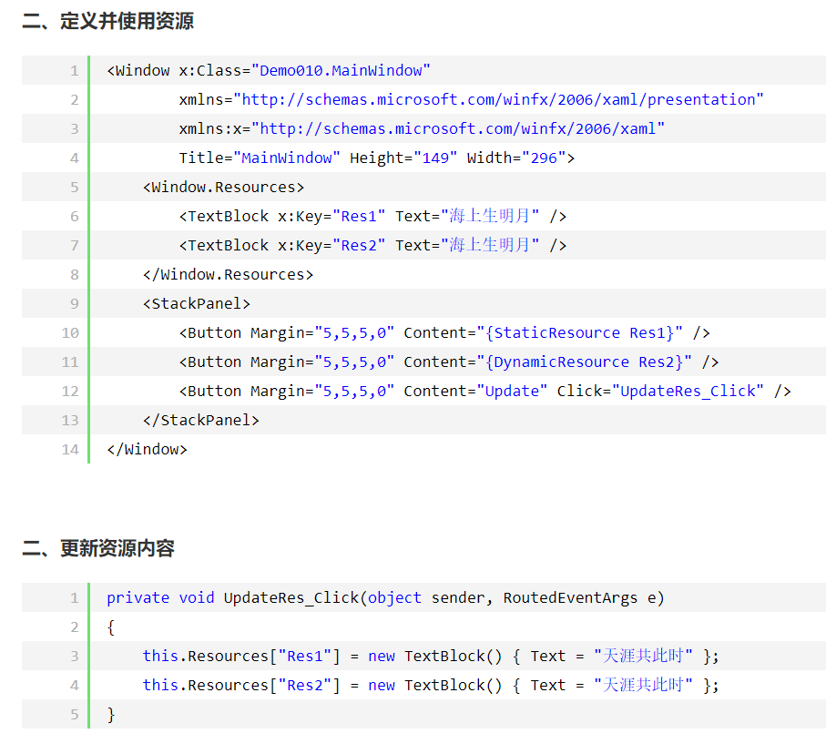
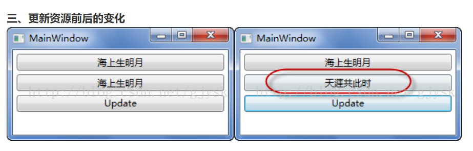
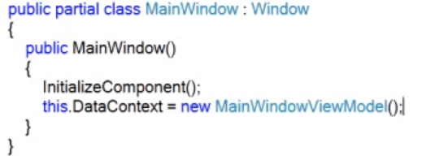
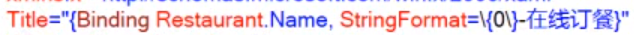
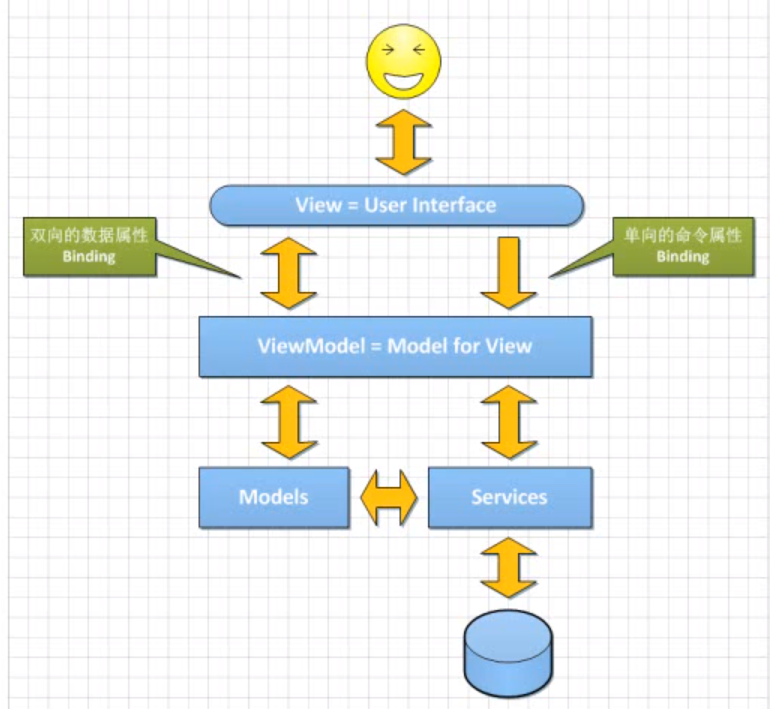
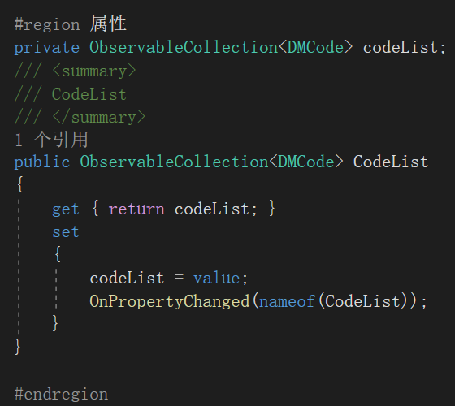

# WPF

`x:Class="Demo.MainWindow"` //Demo那个命名空间下的MainWinodw类，指示xaml编译器把该xaml编译的结果和哪个类合并在一起

`xmlns="http://schemas.microsoft.com/winfx/2006/xaml/presentation"` （不是网址，是硬编码字符串，编译器遇到这个就会把一系列名称空间映射到该xmal文件中）（实际上是在引用名称空间 全称xmlnamespace 这里没有给名字，可以有一个命名空间没有名字，用的是默认名称空间。引用的是绘制界面相关：控件、布局）

`xmlns:x="http://schemas.microsoft.com/winfx/2006/xaml"` （命名为x名称空间，引用的是编译、解析xaml相关的）

`xmlns:local="clr-namespace:Demo"` 引入Demo名称空间，取名为local

`xmlns:extern="clr-namespace:ExternDemo; assembly= ExternDemo"` 引入外部库/第三方组件ExternDemo名称空间，取名为extern 注意要先引用类库后才能应用（右键项目中的reference引用，添加引用）

`DMSkin`要引入DMSkin.dll DMSkin.Core.dll ，要用模板风格要引入DMSkin.CyanDesign等，只能靠引入项目的方法导入模板。

`Style="{StaticResource DMScrollViewer}"`这种引入需要在app.xaml里面引入资源：

```xml
<Application.Resources>
    <ResourceDictionary>
        <ResourceDictionary.MergedDictionaries>
            <!-- 如果你用到DMSkin窗体需要导入 -->
            <ResourceDictionary Source="pack://application:,,,/DMSkin;component/DMSkin.xaml" />
        </ResourceDictionary.MergedDictionaries>
    </ResourceDictionary>
</Application.Resources>
```

xaml编译的和cs文件编译的是同一个类，看`partial`关键字

```csharp
namespace Demo
{
    /// <summary>
    /// MainWindow.xaml 的交互逻辑
    /// </summary>
    public partial class MainWindow: Window //这个partial关键字说明该类并不是仅由cs文件编译的
    {
        public MainWindow ()
        {
            InitializeComponent(); //该方法是xaml里面编译出来的
        }
    }
}
```

```xml
<Button Width="120" Height="30"/> //这种是空标签，不具有内容

<Button Width="120" Height="30">
    <!--Content-->//标签的内容 不是对象的内容
    这样就能用复杂的方式赋值button ：在button里面加入一个矩形
    <Button.Content>
        <Rectangle Width="20" Height=" 20" Fill="Black"></Rectangle>
    </Button.Content>
</Button>
```

**App.xaml中有主窗口启动路径，如果移动mainwindow.xmal要更改它**

## 代码层：

**●获取当前主程序窗口对象用**

`Application.Current.MainWindow`

**●获取当前主程序窗口控件中的对象（需要用x:Name）**

`Application.Current.MainWindow.FindName("xxx")`

## 美化：

**●ScrollViewer**

如果没出现滚动条，去看看`Grid`的`RowDefinition`是不是设置`height`成`auto`了，如果是则去除这个属性即可

**●不规则窗体**


解释下这个xaml需要注意的属性设置：

`allowstransparency="True"` - 允许透明

`background="Transparent"` - 设置背景透明

`windowstyle="None"` - 去掉边框

`opacitymask="White"` - 设置白色透明

为`Gird`订阅的`MouseLeftButtonDown`路由事件，是为了实现窗体的拖动。事件处理如下：

```csharp
private void Grid_MouseLeftButtonDown(object sender, MouseButtonEventArgs e)
{
    this.DragMove();
}
```

**●使用多个Style**

原版无法实现，需要借助插件

https://www.cnblogs.com/ainijiutian/p/apply-multiple-styles-to-one-element-for-wpf.html

**●UI区域划分**

使用`Grid`、`StackPanel`

`Grid`的划分




**圆角阴影Border**

```xml
<!--圆角阴影Border-->
<Style x:Key="CircularShadowBorder" TargetType="{x:Type Border}">
    <Setter Property="BorderBrush" Value="Black"/>
    <Setter Property="Effect">
        <Setter.Value>
            <DropShadowEffect x:Name="OG" BlurRadius="11" Color="Black" Direction="50" Opacity="0.9" RenderingBias="Performance" ShadowDepth="1">
                <Storyboard.TargetProperty>
                    BlurRadius
                </Storyboard.TargetProperty>
            </DropShadowEffect>
        </Setter.Value>
    </Setter>
</Style>
```

**●圆角图片**

`Border`的`Background`属性设置`ImageBrush` 这样会按照`Border`的边框填充图片

```xml
<Border.Background>
    <ImageBrush x:Name="img" ImageSource="pack://application:,,,/Xyz.Koubot.AI.UI;component/ExternUI/Image/avatar.jpg" Stretch="UniformToFill"/>
</Border.Background>
```

## 资源引入：

**●静态资源和动态资源**

静态资源(`StaticResource`)指的是在程序载入内存时对资源的一次性使用，之后就不再访问这个资源了；动态资源(`DynamicResource`)使用指的是在程序运行过程中然会去访问资源。





**●使用pack协议查找资源**

`WPF`引入了统一资源标识`Uri`(Unified Resource Identifier)来标识和访问资源。其中较为常见的情况是用`Uri`加载图像。`Uri`表达式的一般形式为：协议+授权+路径

协议：`pack://`

授权：有两种。一种用于访问编译时已经知道的文件，用`application:///`。一种用于访问编译时不知道、运行时才知道的文件，用`siteoforigin:///`。在这里加载图片时，我们选用前者，即`application:///`，但是书写时候，我们一般用逗号代替斜杠，也就是改写作

| **Action**                 | **说明**                                                                                                                                                                                                                                                                                                                                                                                                                                                                                                                                                   |
|----------------------------|------------------------------------------------------------------------------------------------------------------------------------------------------------------------------------------------------------------------------------------------------------------------------------------------------------------------------------------------------------------------------------------------------------------------------------------------------------------------------------------------------------------------------------------------------------|
| **None**                   | 资源既不会被集成到程序集内，也不会打包到xap包中。不过我们可以通过设置CopyToOutputDirectory选项让其自动拷贝到xap包所在目录。 这种情况下, 访问这个图片的相对Uri需要以"/"开始。  适用场景：在大多数情况下，我们希望把video/audio文件放到xap的外面，因为这种文件一般都比较大，会影响silverlight应用的加载，而且一般的视频音频文件都是压缩格式的，放到xap中也不会起到减少他们文件大小的作用。 类似图片视频这种资源文件生成操作为None时和他们没有被添加到项目里是一样的，都可以用绝对Uri进行引用。                                                               |
| **Compile**                | 不适合用于资源文件。类文件要用"Compile"生成操作， 就是指项目里.cs或.vb文件。                                                                                                                                                                                                                                                                                                                                                                                                                                                                               |
| **Content**                | **资源会被打包在Xap包里面。这种情况下, 访问这个图片的相对Uri需要以"/"开始。在这种方式下，如果没有在xap中找到图片文件，那么silverlight会自动从当前xap应用所在的文件夹下来找所需图片文件， 如果还没有找到那么就触发ImageFailed事件， 这种方式比较适合在多个程序集引用相同文件时采用。**                                                                                                                                                                                                                                                                      |
| **Embedded Resource**      | 这种方式会把文件嵌入到程序集中，Silverlight无法通过Uri引用在xaml和C\#里对这个文件进行使用，微软不建议在Silverlight采用这种方式在程序集里嵌入资源。如果有这种需求可以用Reflection.Assembly.GetExecutingAssembly().GetManifestResourceStream(string path)相关的方法得到文件的Stream引用。调用uri：程序集名.文件夹.文件名.后缀名                                                                                                                                                                                                                              |
| **ApplicationDefinition**  | Silverlight程序的入口xaml文件(默认就是App.xaml)应该设置为这个"应用定义"。其他文件都不适合用这个。                                                                                                                                                                                                                                                                                                                                                                                                                                                          |
| **Page**                   | 不适合用于资源文件。所有的用户控件，页面和子窗体(Usercontrol/Page/Childwindow)的xaml文件应该采用的生成操作。 如果改为别的方式那么会导致后台对应的代码文件无法链接到这个xaml文件。 采用"Page" build action时xaml里的错误会导致工程无法正确生成。                                                                                                                                                                                                                                                                                                            |
| **CodeAnalysisDictionary** | 代码分析使用，Silverlight中可以忽略                                                                                                                                                                                                                                                                                                                                                                                                                                                                                                                        |
| **Resource**               | **资源会被打包在程序集内部。 选择这种生成方式后,该资源文件会被嵌入到该应用的程序集中，就是说打开生成的xap是看不到这个文件的。 可以用相对于当前的XAML文件的相对Uri访问,\<Image Source="sl.png" /\>或是\<Image Source="./sl.png" /\>, 在子文件夹里的可以用\<Image Source="./images/sl.png" /\>访问到。最保险的方式是采用特有的程序集资源URI访问,格式为 \<Image Source="/{assemblyShortName};component/sl.png"/\>，这种方式还可以引用到xap中的其他程序集中的图片。这种生成方式的系统资源可以直接用Application.GetResourceStream(uri).Stream在代码里来得到。** |
| **SplashScreen**           | "SplashScreen"是这个选项是WPF的启动画面使用的。Silverlight启动加载画面是用的其他方式实现的，所以在Silverlight里不要用这个方式。                                                                                                                                                                                                                                                                                                                                                                                                                            |
| **EntityDeploy**           | 这个是EntityFramework采用的生成方式，在Silverlight里是没用。                                                                                                                                                                                                                                                                                                                                                                                                                                                                                               |

`application:,,,`。

路径：分为绝对路径和相对路径。这里我们选用相对路径，普适性更强。

下面，我们举一个简单的例子：

`pack://application:,,,/images/my.jpg`

当然，`WPF`默认`Uri`设置有`pack://application:,,,`，所以我们也可以直接将其写作：`/images/my.jpg`

后边写例子程序时，为了让读者更好的了解`Uri`，我们都采用完整的`Uri`写法。

下面在讲讲装载图片的两种方式，一种用`XAML`引用资源，一种用代码引用资源。

用`XAML`引用资源：

```xml
<Image Source="pack://application:,,,/images/my.jpg"/>
```

用代码引用资源：

```csharp
Image img;
img.Source=new BitmapImage(new Uri("pack://application:,,,/images/my.jpg"),UriKind.Relative);
```

若是提示找不到资源可试试项目重新生成

`pack://application:,,,/Xyz.Koubot.AI.UI;component/ExternUI/Style/WhiteTheme.xaml` 若是运行无法找到资源文件，需要明确程序集，Xyz.Koubot.AI.UI这个项目名，component指示项目初始目录

**●生成操作**

需要关注的是，对于媒体资源通常使用**Content与Resource两种不同的方式。**

## xaml

**●未将对象引用设置到对象的实例**

`VS`会自动的预编译程序，会按照程序在启动时的需要解释xaml，按照xaml中的顺序生成控件，先布局的先生成。在初始加载方法中启动异步线程，异步线程中使用前台控件绑定的属性，与主UI线程分属不同线程，VS判定不了先后顺序，会认为你使用的属性尚未实例，前台中会显示错误，正常启动程序时则不会出现问题。

**●标签扩展**

```xml
<TextBox Text="{Binding ElementName=sld,Path=Value}"></TextBox>
<Slider x:Name="sld" Value="50"></Slider>
```

**●x名称空间**

**`x:Name`** 为实例创建引用变量的名字，并注册到wpf结构树中

因为`<Button Width="20" Height="20" Content="Hello" />` //这种只是生成了一个实例，并没有变量去引用这个实例，因此后台无法访问到，除非用繁琐的间接访问（从父级窗体出发GetChildren）

因此如果是`<Button x:Name="button1" Width="20" Height="20" Content="Hello" />` 则在cs文件中能直接访问。

如果是直接使用wpf控件则标签中本来就有`Name`属性，是派生自`FrameworkElement`的，所以可以不用加`x:`，效果一样。

**`x:FieldModifier`** 即实例的访问修饰符(public、private)

**●Binding**

`Binding`需要一个数据源，是拿自己的或者上层的`DataContext`

当一个`Binding`只知道自己的`Path`而不知道自己的`Source`时，它会沿着UI树一级一级的向上查找，路过每个节点时都会查看这个节点的`DataContext`是否具有`Path`所指定的属性，直到找到为止。如果到了树的根部，还没找到那就是没有`Source`。

可以在最外层即`Window`层设置`DataContext`，则在window内所有的控件都能看到`Source`然后拥有binding数据源，数据源一般是`ViewModel`



`Binding`有个`StringFormat`属性可以格式化字符串



```xml
<DataGrid ItemsSource="{Binding CodeList}">
```
在`MVVM`框架中`DataGrid`需要写明`ItemsSource`属性，这样里面的`DataGridTextColumn`中的`Binding`属性就是一个个`CodeList`中包含的对象

```csharp
private ObservableCollection<DMCode> codeList;
```
比如这里是`DMCode`类，其中有`Email`成员

则
```xml
<DataGridTextColumn Header="Email" Binding="{Binding Email}" ></DataGridTextColumn>
```
直接这样绑定Email

**一个控件两个属性绑定不同的DataContext：**

```
"{Binding RelativeSource={RelativeSource FindAncestor,AncestorLevel=1,AncestorType={x:Type Grid}},Path=DataContext.PlugInChangeCommand}"
```

**●框架**

`MVC`全名是Model View Controller，是模型(model)－视图(view)－控制器(controller)的缩写，一种软件设计典范，用一种业务逻辑、数据、界面显示分离的方法组织代码，将业务逻辑聚集到一个部件里面，在改进和个性化定制界面及用户交互的同时，不需要重新编写业务逻辑。MVC被独特的发展起来用于映射传统的输入、处理和输出功能在一个逻辑的图形化用户界面的结构中。


个人理解：

Model进行数据库交互，获取信息、所需要的数据

View提供显示，比如html或相应框架模板文件

Controller即供访问的api或访问入口文件，比如网站即访问controller，controller调用model里面的方法，将获取到的数据放到view中，显示view。

一般来说一个逻辑对应一组mvc，比如用户管理分用户管理model、用户管理controller、用户管理view

`MVVM`是Model-View-ViewModel的简写。它本质上就是MVC 的改进版。MVVM 就是将其中的View 的状态和行为抽象化，让我们将视图 UI 和业务逻辑分开。当然这些事 ViewModel 已经帮我们做了，它可以取出 Model 的数据同时帮忙处理 View 中由于需要展示内容而涉及的业务逻辑。



Model 现实对象的抽象的结果

View 即UI

ViewModel Model for View 即View的抽象（一一对应关系），为View需要的数据暴露接口（数据传递（用数据属性实现））、响应操作（传递操作（用命令属性实现））

数据传递：用控件实例中的Value或Text = {Binding 属性名}

操作传递：用控件实例中的Command = {Binding 命令名}

数据属性（`NotificationObject`）、命令属性（`DelegateCommand`）是特殊的可以notificate的（需要实现MVVC），通知Binding将数据传输到views上去

View的xaml需要绑定数据源`DataContext` 绑定对应的ViewModel，可以使用

```xml
<Window.DataContext>
    <viewmodels:XXXViewModel></viewmodels:XXXViewModel>
</Window.DataContext>
```

来绑定，viewmodels命名空间得在开头写例如

```xml
xmlns:viewmodel="clr-namespace:Xyz.Koubot.AI.UI.ViewModels"
```

`NotificationObject` 继承 `INotifyPropertyChanged`接口 实现接口，作为所有ViewModel的基类

`DelegateCommand` 继承`ICommand`

**ViewModel数据属性长这样：**




注：两个类实现的基类不一样，因此通知属性改变方法名字有些不一样

在界面xaml中是传递内容，所以比如`TextBox`里面的`Text`属性用`Binding`绑定传递的数据属性

**ViewModel命令属性长这样：**


传递的是命令所以比如`Button`是`Command`属性`Binding`的命令属性

`Binding`数据源是用`DataContext` = 一个`ViewModel`类

项目的结构：

Data文件夹 数据文件

Models文件夹 存放数据类型定义，对现实数据抽象类

Services文件夹 接口、服务功能类定义

ViewModels文件夹 对应View里面的名字 比如MainWindow有MainWindowViewModel 但也有把某个模块抽象为ViewModel比如数据表格的每一个数据，是否可选中等(ViewModel里面可以包含ViewModel) 如果ViewModel里面包含的ViewModel里xaml中有要用到上一层ViewModel的DataContext需要重新指定相对Source


FindAncestor找外层的DataContext，AncestorType这里指定外层的DataGrid

Views文件夹，UI界面

**●MVVMLight框架**

ViewModelLocator类

实际上他就是一个很基本的视图模型注入器。在构造器中把使用到的ViewModel统一注册，并生成单一实例。

然后使用属性把它暴露出来，每当我们访问属性的时候，就会返回相应的ViewModel实例。

这样做的好处，一个是绑定化相对于简单粗暴的赋值方式，更合理。一个是在可视化窗口可以看到所绑定的数据，达到所见即所得的友好效果。

传参可以使用`commandParameter`属性 这是将自己传递过去的例子：

```xml
<RadioButton Tag="2" Content="表情包制作" Style="{StaticResource MenuRadioButtom}" Command="{Binding PlugInChangeCommand}" CommandParameter="{Binding RelativeSource={x:Static RelativeSource.Self}}" />
```
