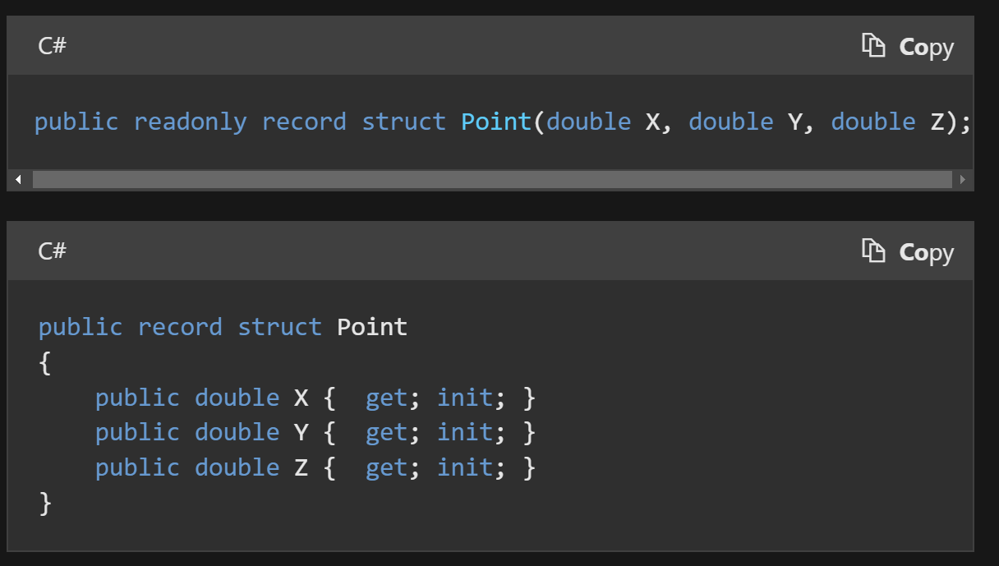
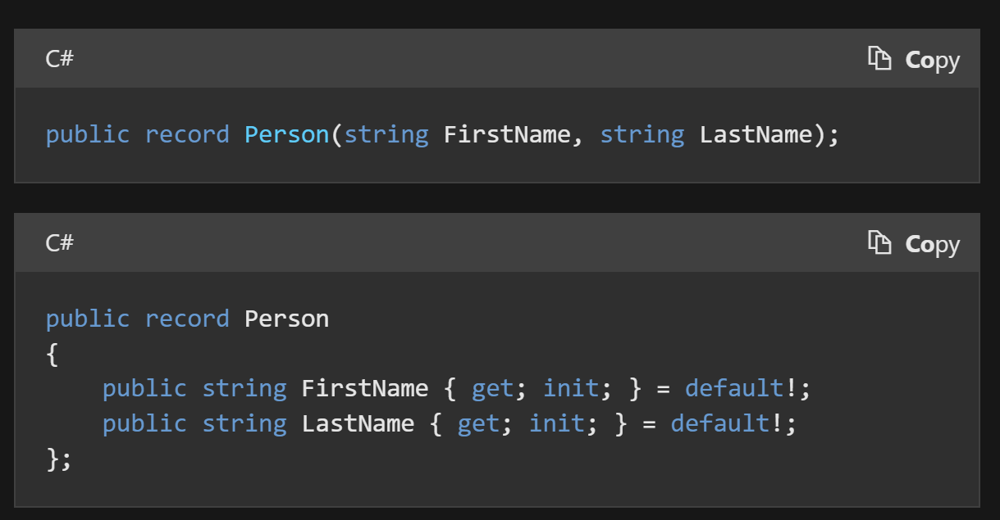

# .NET 内置类型

## Dictionary

可以使用可空类型作为键，但是不可以为`null`（注意区分Java中的`HashMap`可以为null键）

### 不可以在foreach时修改Dictionary内的元素（.NET 5前）

可以使用for循环修改。或者`ToList`后遍历Key然后再用key返回去`Dictionary`修改。

## Assembly

`Assembly.GetCallingAssembly()`如果在`lambada`表达式中一定要注意了，它就不是外层的`assembly`了，而是这个函数来源的`assembly`。

比如：

```csharp
services.AddMediatR(cfg =>
{
    cfg.RegisterServicesFromAssembly(callingAssembly);
});
```

这里就不能在括号内获取，而要放在外部先获取。

## KeyValuePair

它是`Struct`，所以它的`DefaultValue`是`strcut(default<Key>, default<Value>)`

## Record



两种写法



默认都是`readonly`的，即`immutable`。也可以自己改成`mutable`的。

`C#9`出现。`C#10`出现`record struct`以及`record class`

实际上`record class`即是`record`，是`reference type`。而`record struct`是`value type`。

`record`拥有如下`build-in feature`

### Value Equality

two objects are equal if they are of the same type and store the same values.

### Build-in format

`ToString()`

所以非常适合DTO之类的，能够直接打印类Json格式输出

例如：

```csharp
DailyTemperature { HighTemp = 57, LowTemp = 30, Mean = 43.5 }
DailyTemperature { HighTemp = 60, LowTemp = 35, Mean = 47.5 }
```

### Nondestructive mutation

If you need to copy an instance with some modifications, you can use a `with` expression to achieve nondestructive mutation. A `with` expression makes a new record instance that is a copy of an existing record instance, with specified properties and fields modified.

```csharp
person2 = person1 with {}; //实际上是复制了一个person1.
```

它不能很好的替代DDD中的`Value Object`实现，还是得使用官方的`ValueObject`实现。

<https://learn.microsoft.com/en-us/dotnet/architecture/microservices/microservice-ddd-cqrs-patterns/implement-value-objects>

原因：

<https://enterprisecraftsmanship.com/posts/csharp-records-value-objects/>

## IEnumerable

- 注意`x.IsAssignableTo(typeof(IEnumerable))` 与 `x.IsAssignableTo(typeof(IEnumerable<>))`的区别
- 注意`string`也是`IEnumerable`
- 注意`Where`语句后的`IEnumerable`结果，如果使用`foreach`遍历过之后，再度`where`等操作进行，再`foreach`则不会有结果。因为是`enumerator`只能遍历一遍的类型。**（存疑）**

但似乎`Sum()`、`Count()`之类的，使用`IEnumerable`作为参数传入，其实它会诞生自己对于`IEnumerable`本身的`IEnumerator`对象进行迭代执行，所以又互不影响…

<https://learn.microsoft.com/en-us/dotnet/fundamentals/code-analysis/quality-rules/CA1851>

## 数组相关

### List

`List`中的`Contains`方法是用的迭代调用`Equal`方法，所以时间复杂度为O(n)

### HashSet

`HashSet` `Contains`是计算item hash值，然后获得到hash集合中的index，所以时间复杂度为O(1)

`ToHashSet`的方法也挺消耗时间的，如果现在已经是`List<T>`，只需要进行一次`Contains()`，那么直接使用`List`的效率更高，如果先转为`HashCode`再进行`Contains`，会慢3倍时间左右。

所以只有当需要多次`Contains`的时候，再转换为`HashSet`较好（其实应该最开始就用`HashSet`而不是`List`）。

### Span\<T\>

`Span<T>`直接获取`ref`引用，可截取一段，变为数组操作，直接在引用对象上进行修改。

从C/C++的角度来说，其实是封装了`void*`类型的指针操作，它抽象了所有连续内存空间的类型系统，包括：数组、非托管指针、堆栈指针、`fixed`或`pinned`过的托管数据，以及值内部区域的引用。


不能存储在`heap`上，因为要规避被多个线程访问，只能在`stack`上，意思是不能存在类或结构体等字段（甚至是`lambdas`等表达式都不行）上保留，而只能在函数内部，作为一个`tmp`变量，确保只会有一个线程访问。

使用它的理由：

字符串等操作，如`SubString`，是copy出来一份，而如果转化为`Span`操作，用`Slice`，则没有string allocation的开销。

`IndexOf`也是？（it does not need to create a copy of the data or allocate additional memory for processing.）

### ArraySegment\<T\>

可以看作是给定数组的一段，来界定、分割同一个数组，操作实际作用在原数组上。

## App domain

<https://stackoverflow.com/questions/3623358/two-types-not-equal-that-should-be>

如果类所在两个`app domain`不一样，那么可能会出现理论上相等的两个`type`却无法`equal`的情况。比如You likely have two copies of the DLL containing that type - one loaded by the main program and one loaded by one of the `Assembly.Load*(...) methods`，一个是主程序本身加载的类，还有一个是被`Assembly.load`方法加载dll得来的类，这时会发现它们的类类型实际上却不相等。

Try displaying / comparing the properties:

```csharp
a.Assembly.Equals(b.Assembly)
```

and

```csharp
a.Assembly.Location.Equals(b.Assembly.Location)
```

## String

在C++中，字符有`char`和`wchar`之分，相应的，字符串有`string`和`wstring`两种。C#中，`string`是一个`unicode`字符串，相应的，每个`char`都是16位。源文件中出现的字符串常量，都会被自动转换为`unicode`字符集，利用`Text.Encoding`，可以实现不同编码间的转换。

### string格式化

格式化是使用`{0}`、`{1}`对应所给的object位置

字符对于数值型的后面的截取一般会自动四舍五入，如果后面没有数字，一般默认保留两位小数

| **字符** | **说明**                     | **示例**                               | **输出**   |
|----------|------------------------------|----------------------------------------|------------|
| C        | 货币（结果跟系统的环境有关） | **string.Format**("{0:C3}", 2)         | ＄2.000    |
| D        | 十进制                       | **string.Format**("{0:D3}", 2)         | 002        |
| E        | 科学计数法                   | 1.20E+001                              | 1.20E+001  |
| G        | 常规                         | **string.Format**("{0:G}", 2)          | 2          |
| N        | 用逗号隔开的数字             | **string.Format**("{0:N}", 250000)     | 250,000.00 |
| X        | 十六进制                     | **string.Format**("{0:X000}", 12)      | C          |
|          | 零占位符0和数字占位符\#      | **string.Format**("{0:000.000}", 12.2) | 012.200    |
| P        | 百分比计数法                 | **String.Format**("{0:P3}",0.29768)    | 29.768     |
| F        | 小数点后的位数固定           | **string.Format**("{0:F3}", 250)       | 250.000    |

### 日期格式化

```csharp
string.Format("{0:d}",System.DateTime.Now) //结果为：2009-3-20 （月份位置不是03） 短日期模式
string.Format("{0:D}",System.DateTime.Now) //结果为：2009年3月20日 长日期模式
string.Format("{0:f}",System.DateTime.Now) //结果为：2009年3月20日 15:37
string.Format("{0:F}",System.DateTime.Now) //结果为：2009年3月20日 15:37:52
string.Format("{0:g}",System.DateTime.Now) //结果为：2009-3-20 15:38
string.Format("{0:G}",System.DateTime.Now) //结果为：2009-3-20 15:39:27
string.Format("{0:m}",System.DateTime.Now) //结果为：3月20日
string.Format("{0:t}",System.DateTime.Now) //结果为：15:41
string.Format("{0:T}",System.DateTime.Now) //结果为：15:41:50
```

日期中的T（2014-05-30T11:20:16）the "T" appears literally in the string, to indicate the beginning of the time element, as specified in ISO 8601.

### string常用方法

固定保留几位小数

```csharp
number.ToString("f2");
```

与int、double之间的转换

```csharp
A = System.Convert.ToDouble(strA);
```

`string.Equal`中的`StringComparison`，使用`OrdinalIgnoreCase`效率更高

### String与string大小写的区别

1. `string`是c#中的类，`String`是.net Framework的类(在c# IDE中不会显示蓝色)   
2. C# `string`映射为.net Framework的`String`   
3. 如果用`string`,编译器会把它编译成`String`，所以如果直接用`String`就可以让编译器少做一点点工作。如果使用c#，建议使用`string`，比较符合规范   
4. `String`始终代表 `System.String(1.x)` 或 `::System.String(2.0)`，`String`只有在前面有`using System;`的时候并且当前命名空间中没有名为`String`的类型（class、struct、delegate、enum）的时候才代表`System.String`   
5. `string`是关键字，`String`不是，也就是说`string`不能作为类、结构、枚举、字段、变量、方法、属性的名称，而`String`可以。

### @符号作用

C#中的字符串,如正则表达式中,有可能出现一些与C#语言相同的字符,比如"\\",会让编译器作为C#语言来识别,截断该字符串,并可能产生编译器错误.

即忽略转义

### PadString