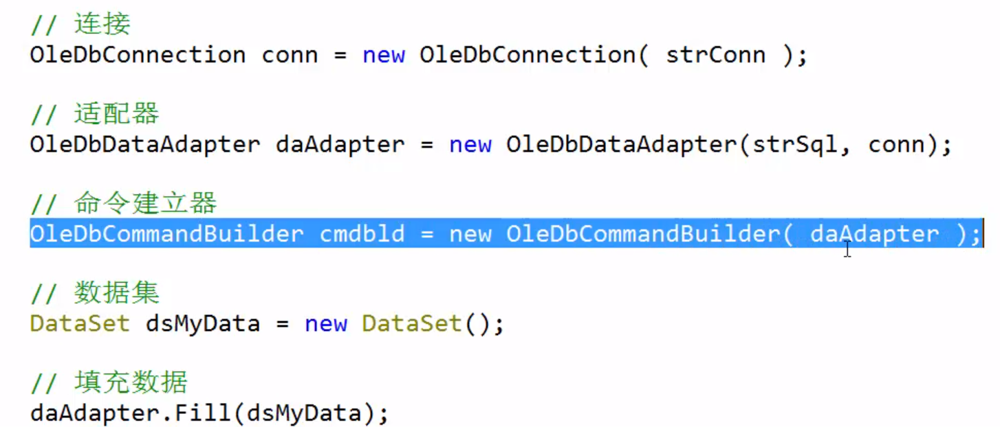

# 数据库ADO.NET

## ADO.NET数据库对象

Transaction事务简单来说就是多个命令，要么都执行要么都不执行

### Command对象

Command对象可以使用数据库命令直接与数据源进行通信。

四种执行方式：

ExecuteNonQuery() 返回受命令影响的行数。

ExecuteScalar() 返回第一行第一列。如Count(\*),Sum,Avg等聚合函数获取结果。

ExecuteReader() 返回一个DataReader对象。如果SQL不是查询Select，则返回一个没有任何数据的System.Data.SqlClient.SqlDataReader类型的集合（EOF）。

ExecuteXmlReader()返回一个XmlReader对象

#### Connection对象

可用于连接到数据库管理数据库的事务。用于连接数据库的对象,表示到数据源的一个唯一的连接.

#### DataReader对象

DataReader对象只能对查询获得的数据集进行自上而下的访问（只读），但效率很高。如果仅仅是访问数据的话，可以使用DataReader。但DataReader要求一直连接，所以将结果的一小部分先放在内存中，读完后再从数据库中读取一部分，相当于一个缓存机制。这对于查询结果百万级的情况来说，带来的好处是显而易见的。

SqlDataReader.Read()方法可以读取下一行数据，然后按照列索引可以得到每一列的数据

用完后要SqlDataReader.Close()关闭对象

#### DataAdapter对象

是一种用来充当DataSet对象与实际数据源之间桥梁的对象。DataSet对象是一个非连接的对象，它与数据源无关。而DataAdapter则正好负责填充它并把它的数据提交给一个特定的数据源，它与DataSet配合使用，可以执行新增、查询、修改和删除等多种操作。

#### DataSet对象

表示内存中数据的缓存,可以把它想像成一个临时的数据库,它里可以存多个表(DataTable),而且是断开式的,不用每进行一次操作就对数据库进行更新,从而提高了效率,要与DataAdapter配合使用，可以自动生成Command对象：使用CommandBuilder（自动生成增删改数据的命令（往源数据库更新）），用new SqlCommandBuilder(DataAdapter)即可

过程：

