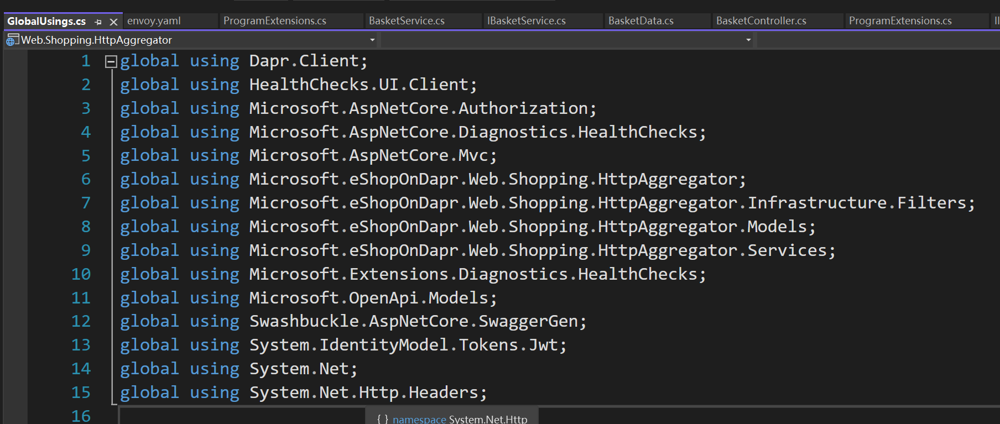

# 语法


## switch

`C#8.0`以上有switch语法糖

```csharp
return level switch
{
    HandleLevel.None => null,
    HandleLevel.Brief => errorObject.ToErrorString(),
    _ => errorObject.ToErrorString(FormatType.Detail)
};
```

可以使用`goto case xx`跳转

```csharp
case var _ when filterType.HasFlag(FilterType.Exact): //C#7.0特性 case的when约束，要true才会成功case; _是switch的变量，这里忽略了
```

## 关键字

### extern外部修饰符

用于声明在外部实现的方法，外部修饰符的常见方法是在使用`Interop`服务调入外部非托管代码时与`DllImport`属性一起使用；在这种情况下，该方法还必须声明为`static`

### override重写

`override`关键字主要是提供派生类对父类方法的新实现，即重写。不可以用于重写非虚方法和静态方法，（`new`可以隐藏非虚方法）必须重写父类的`abstract`方法、可选重写`virtual`方法。被重写的原方法都失效了，只会调用重写后的方法。

### new 关键字

`new`关键字可以在派生类中隐藏父类的方法，指明在使用派生类调用的方法是`new`关键字新定义出来的方法，而不是父类的方法。

`new`的优先级是按照父类A = new 子类B（），那么方法是调用的父类方法，除非是子类B = new 子类B（），这样才会调用B的新的`new`方法

### virtual虚方法

允许在派生类中重写这些对象，默认情况下，方法是非虚拟的，不可以重写。若是不重写虚方法，那么调用的就是这个父类的方法。重写也是用`new`和`override`关键字（注意两者区别）。

### abstract方法

抽象方法必须被重写，就类似于实现了接口一样

### sealed关键字

当对一个类应用`sealed`修饰符时，此修饰符会阻止其他类从该类继承。类似于Java中`final`关键字。即密封类

修饰方法或属性：`sealed`修饰符必须始终与`override`（C# 参考）一起使用，防止被再一次继承重写，所以是三个类以上的连续继承关系才会用到`sealed`

尽量多使用`sealed`，可以提高性能。[.NET 中密封类的性能优势](https://mp.weixin.qq.com/s/dZlEjOB8jx0ku8eN8AhpzQ)

### const关键字

在编译时设置其值

### readonly关键字

程序运行期间只能初始化一次

### static关键字

`static`的属性初始化需要注意顺序，在一个静态属性引用另一个静态属性的时候，如果这个静态属性正在被初始化的时候引用另一个需要被初始化但未被初始化的属性时，会得到`null`（这是C#的bug？不，见下面textual order的描述）

> A static constructor is used to initialize any static data, or to perform a particular action that needs to be performed once only. It is called automatically before the first instance is created or any static members are referenced.

> If static field variable initializers are present in the class of the static constructor, they will be executed in the textual order in which they appear in the class declaration immediately prior(紧接着) to the execution of the static constructor.（所以会按顺序先执行参数的初始化（若有））

另外建议使用`static constructors`，即使不是静态类，也可以使用静态构造函数，用于初始化静态变量。

注意，静态构造函数不能有参数，且会在一个实例构造函数之前调用。静态构造函数只会调用一次。

[官方的静态教程](https://docs.microsoft.com/en-us/dotnet/csharp/programming-guide/classes-and-structs/static-classes-and-static-class-members#static-members)

**static class注意事项**

a static class remains in memory for the lifetime of the application domain in which your program resides

**static member注意事项**

Only one copy of a static member exists, regardless of how many instances of the class are created.

Static members are initialized before the static member is accessed for the first time and before the static constructor

### try、finally

就算`try` `return`了 依然会执行`finally`，但是是先`return`结果了再执行。

### using关键字

在`using`作用域的最后会自动`Dispose()`using的资源。相当于`try()…finally{ xx.Dispose() }`

The using statement ensures that Dispose (or DisposeAsync) is called even if an exception occurs within the using block. You can achieve the same result by putting the object inside a try block and then calling Dispose (or DisposeAsync) in a finally block; in fact, this is how the using statement is translated by the compiler. The code example earlier expands to the following code at compile time (note the extra curly braces to create the limited scope for the object):

在更新的版本中，`using`不需要括弧时，dispose的时候也是局部变量访问不到的末尾。

At the end of the scope of the variable r

还可以使用`global using`



### explicit与implict

显示转换和隐式转换关键字

```csharp
/// <summary>
/// 将string隐式转换为KouMessage（创建一个消息内容为content的KouMessage）
/// </summary>
/// <param name="content"></param>
public static implicit operator KouMessage(string content)
{
    return new KouMessage(content);
}
/// <summary>
/// 将KouMessage隐式转换为string（即获取消息内容）
/// </summary>
/// <param name="content"></param>
public static implicit operator string(KouMessage message)
{
    return message?.Content;
}
```

然后使用的时候就可以直接 `KouMessage a = "a string";`（这是实现了string到KouMessage的隐式转换）同理显式转换就是需要`(KouMessage)"a string"`

### ref关键字（reference）

`ref`关键字能用在函数参数定义上、返回值上、函数体内部的本地函数，但只讲最常用的参数定义上。

官方[详细介绍](https://docs.microsoft.com/en-us/dotnet/csharp/language-reference/keywords/ref)

`C#`的函数一般的参数传递，值类型很好理解，是传递的值。而引用类型传递的是什么呢？在我理解是传递的引用的对象，而`caller`（函数调用者）传递的`reference` `value`，它的名字只是对这个对象的一个引用，然后这个引用有一个定义了的名字（变量名）。但传递到函数参数上去只是传递引用的对象给了一个变量名是函数参数的变量，引用的内部还是与`caller`一样的同一个对象。对它内部修改就相当于修改对象，两边都会被修改。**但若是修改它引用的对象**，比如赋值为`null`，`caller`的变量并不会为`null`，修改变量的对象引用并不会修改原先内部引用的对象。

但如果该函数参数使用了`ref`关键字修饰，那么是连带着引用和内部对象一并传递，那函数参数的名字其实就是`caller`那个传递的变量的`alias`（别名），修改它的引用也会改变`caller`那边变量的引用。

函数的参数定义里面如果使用`ref`关键字，`value` `type`的值会随着函数里面的改变而改变，不仅函数定义需要，而且调用函数时也需要加上`ref`关键字调用

```csharp
void Method(ref int refArgument)
```

函数返回结果也可以使用`ref`关键字，官方建议对大型结构体使用`ref`关键字

Returning ref readonly enables you to save copying larger structures and preserve the immutability of your internal data members.

### predicate

`Func<T, bool>`是对`delegate bool Predicate<T>(T obj)`的简化，

`Predicate<T>`又是对`Func<T, bool>`的简化，

其实，就是一个东西。Func转Predicate可以使用`new Func<T, bool>(predicate)`来完成。也可以在调用Func方法的时候`predicate.Invoke`变成method group（语法糖）

`Delegate`至少0个参数，至多32个参数，可以无返回值，也可以指定返回值类型。这个是祖宗。

`Func`可以接受0个至16个传入参数，必须具有返回值。

`Action`可以接受0个至16个传入参数，无返回值。`Action`是无返回值的委托

`Predicate`只能接受一个传入参数，返回值为bool类型。

`typeof(Func<,>).MakeGenericType(type1, type2);`

### dynamic

这个关键字让`C#`有了弱类型语言的特性，能够使用`dynamic`关键字声明动态类型，在编译的时候不再对类型进行检查，默认`dynamic`对象支持你想要的任何特性，即怎么写都不会报错。这一特性在某些需要很复杂的反射才能实现的场景过程中大大简化了实现方式并提高效率。

但注意`dynamic`不可用于group method等调用，即比如p是一个委托，使用`X.Where(p.Invoke)`则无法成功。原理类似于无法将`var a = p.Invoke`一样

`dynamic`在调用泛型方法的时候，泛型T会被认为是`object`，所以如果泛型方法里面如果用的是`a is ICollection<T>`时，会被当做是T为`object`，虽然T按道理应该会正确判断。因此最终会返回false。解决方案是可以用反射得到方法，然后用`MakeGeneric`做泛型方法。

另外，`dynamic`也不支持扩展方法的调用：

Extension methods aren't supported by dynamic typing in the form of extension methods, i.e. called as if they were instance methods.

可以使用其对应的静态方法实现。

### is和as

`as`是进行了转换，有返回值，如果转换失败返回`null`。`is`只是检查是否能兼容给定类型，返回类型为`bool`值，转换失败返回`false`，新`C#`语言版本`is`增加了可以内联转换的语法糖（As of C# 7+, you can now cast inline）。

两者都不会抛出异常。它们都能判断`a is/as b`中a是否能赋值给b。

注意`is`和`as`是用于实例和类型，而不是适用于`Type`类型来判断是否兼容。

`Type`类型实例需要使用指定`Type`的`IsAssignableFrom`等方法来判断derive关系

### yield return 与 yield break

就是一个一个的`return`。能给编程带来性能上的提高以及用法上的方便，比如要实现对一个list去重后乘方，就可以在去重第一个拿出来然后乘方，再放入list，而不是先整个去重，然后再整个遍历乘方。另外还有可以在输出的时候，用户不必等待必须所有list中的数据处理完才能看到结果，而是可以在处理过程中看到处理情况。

原理是在`return`时，保存当前函数的状态，下次调用时继续从当前位置处理（似乎返回值得是`IEnumerable<>`类型且在外面用该函数需要使用`foreach`）。

```csharp
static IEnumerable<int> FilterWithYield()
{
    foreach (int i in GetInitialData())
    {
        if (i > 2)
        {
            yield return i;
        }
    }
    yield break;
    Console.WriteLine("这里的代码不执行");
}
```

### out 关键字

在方法一个方法中可以拥有多个返回值，除了`return`之外还可以通过`out`返回其他返回值。

但注意`bool foo(out localVariable)`此时将`localVariable`放在这里，无论foo方法是否执行返回`false`或`true`，`localVariable`都将被赋值。所以要明确方法的返回值。

## 语法糖

`C#`中的语法糖是`.NET`的"糖"特性，方便程序员的编码，很甜

### Number

默认情况下输入浮点数是`double`类型，输入整数是`int`类型，而定义为其他类型时必须加后缀

| Type    | Suffix   | Example |
|---------|----------|---------|
| uint    | U or u   | 100U    |
| long    | L or l   | 100L    |
| ulong   | UL or ul | 100UL   |
| float   | F or f   | 123.45F |
| decimal | M or m   | 123.45M |

也支持Hexadecimal 和 binary

```csharp
int sixteen = 16;
int sixteen = 0x10;
```

前缀`0x`:16进制表示法，可以用`_`分割，可以用在各种类型上面。但需要注意类型问题，比如`int a=0xFF_FF_FF_FF`会提示类型错误。

前缀`0b`:2进制表示法，可以用`_`分割，可以用在各种类型上面。

### Pattern matching

始于`C#7`

```csharp
if (input is int count && count > 100)
if (input is null)
switch (i)
{
    case int n when n > 100:
        ...
    case Car c:
        ...
    case null:
        ...
    case var j when (j.Equals(10)):
        ...
    default:
        ...
}
```

`C#8`中做了增强：

#### switch expression

```csharp
var rgbColor = knownColor switch
{
    KnownColor.Red => new RGBColor(0xFF, 0x00, 0x00),
    KnownColor.Green => new RGBColor(0x00, 0xFF, 0x00),
    ...
    _ => throw new ArgumentException(message: "invalid enum value", paramName: nameof(knownColor)),
};
```

A regular switch does not return a value. This syntax is more concise. There are no case keywords, and the default case was replaced with a discard (`_`).

也支持元组的deconstruct

#### Property patterns

```csharp
switch (location)
{
    case { State: "MN" }:
}
```

above case will match when location.State equals MN.

**A special case is the `{ }` pattern, which means: not null.** This pattern can also be used with the is keyword:

```csharp
if (location is { State: "MN" })
```

即这里代表的是`location != null && location.State = "MN"`

`C#9`中的增强:

```csharp
if (person is Student or Teacher)
if (person is not Student)
decimal discount = person switch
{
    Student or Teacher => 0.1m,
    not Student => …
    _ => 0
};
```

对于numeric value：

```csharp
decimal discount = age switch
{
    <= 2 => 1,
    < 6 => 0.5m,
    < 10 => 0.2m,
    _ => 0
};
```

还可以

```csharp
if (person is Student { Age : >20 and <30 })
```

### Anonymous Type

```csharp
var v = new { Amount = 108, Message = "Hello" };
```

Anonymous types support non-destructive mutation in the form of with expressions. This enables you to create a new instance of an anonymous type where one or more properties have new values:

```csharp
var apple = new { Item = "apples", Price = 1.35 };
var onSale = apple with { Price = 0.79 };//只支持更改值然后作为新instance
```

### Other（未分类）

#### ?? 判断null

`a ?? b` 若a为`null`则b

`a ??= b` 若a为`null`则`a=b` （逻辑空赋值）

逻辑与赋值（`&&=`）

`(x &&= y)` 仅仅当x为`true`时起作用，对其赋值

逻辑或赋值运算符 `(x ||= y)` 是在 x 是`false`时对其赋值

#### ?. Null 传导运算符(propagation)

`obj?.prop` //读取对象属性

`obj?.[expr]` //同上

`func?.(...args)` //函数或对象方法的调用

`new C?.(...args)` //构造函数的调用

连续使用？只要其中有一个为`null`就会返回`null`不会继续往下运算。

#### 扩展方法

静态类里的静态方法，并在第一个参数中使用`this`来指定扩展的类的类型。使用的时候直接用指定的那个类的实例使用即可，就好像给这个类的增加了一个实例方法（实际上编译的时候还是静态方法访问，写的时候这么写而已，即语法糖）

#### Index中的hat运算符 ^

```csharp
System.Index operator ^(int fromEnd);
var lastItem = array[^1]; // array[new Index(1, fromEnd: true)]
```

表示的是从一个集合末尾开始第几个（需要大于等于0）

#### 范围运算符[n..m](Range Operater)

```csharp
var array = new int[] { 1, 2, 3, 4, 5 };
var slice1 = array[2..^3]; // array[new Range(2, new Index(3, fromEnd: true))]
var slice2 = array[..^3]; // array[Range.EndAt(new Index(3, fromEnd: true))]
var slice3 = array[2..]; // array[Range.StartAt(2)]
var slice4 = array[..]; // array[Range.All]
var slice5 = array[2..3]; // 从index=2开始到index=3结束，不包含index=3
```

<https://docs.microsoft.com/zh-cn/dotnet/csharp/language-reference/proposals/csharp-8.0/ranges>

**这个m，即endIndex也是不包括的，与python中list的slice操作相同**

`^`在这里是倒数第三个索引的意思，就是上面hat运算符

#### 匿名变量

`Var`声明的变量，不必指定"局部"变量的类型，`LINQ`表达式或`foreach`语句中，使用其比较方便

```csharp
string[] words = { "apple", "strwawberry", "grape" };
var query = from word in words
            where word[0] == 'g'
            select word;
```

#### 匿名变量解包键值对

能够类似于python的解包

将`KeyValuePair<TKey, TValue>`解包为`var (key, value)`

#### 构造函数

调用base class的constructor，用`:base()`，调用自身的constructor，使用`:this()`

## 注释

<https://learn.microsoft.com/en-us/dotnet/csharp/language-reference/xmldoc/recommended-tags>

XML注释。使用`///`系统自动补全，这些注释可以生成一个xml文件，方便程序生成说明文档。而且引用方法或属性等情况时，IDE会给予提示

| 标签                                    | 作用                                                                                                                                                                                                                                                                       |
| ------------------------------------- | ------------------------------------------------------------------------------------------------------------------------------------------------------------------------------------------------------------------------------------------------------------------------ |
| `<c>`                                 | 将说明中的文本标记为代码                                                                                                                                                                                                                                                             |
| `<b>`                                 | 加粗                                                                                                                                                                                                                                                                       |
| `<code>`                              | 提供了一种将多行指示为代码的方法                                                                                                                                                                                                                                                         |
| `<example>`                           | 指定使用方法或其他库成员的示例                                                                                                                                                                                                                                                          |
| `<exception>`                         | 允许你指定可能发生的异常类`<exception cref="DivideByZeroException">Why it's thrown.</exception>`                                                                                                                                                                                      |
| `<include>`                           | 允许你引用描述源代码中类型和成员的另一文件中的注释, 使用 XML XPath 语法来描述你的源代码中的类型和成员。                                                                                                                                                                                                               |
| `<list>`                              | 向XML注释文档中插入一个列表                                                                                                                                                                                                                                                          |
| `<para>`                              | 向XML注释文档中插入一个段落                                                                                                                                                                                                                                                          |
| `<param>`                             | 描述一个参数                                                                                                                                                                                                                                                                   |
| `<paramref>`                          | **提供了一种指示一个词为参数的方法** `<paramref name="value" />`                                                                                                                                                                                                                         |
| `<permission>`                        | 允许你将成员的访问许可加入到文档中                                                                                                                                                                                                                                                        |
| `<remarks>`                           | 用于添加有关某个类型的信息                                                                                                                                                                                                                                                            |
| `<returns>`                           | 描述返回值                                                                                                                                                                                                                                                                    |
| `<see>`                               | 指定链接 以及 指定类型（code reference） `<see langword="null"/>` `<see href="http://google.com"/>` **`<see cref="ConcurrentDictionary{TKey, TValue}"/>`**  **复杂的需要：** **`<see cref="IEnumerable{T}">IEnumerable</see>&lt;<see cref="KeyValuePair{TKey,TValue}"/>&gt;.`**            |
| `<seealso>`                           | 指定希望在"请参见"一节中出现的文本 <https://stackoverflow.com/questions/532166/how-to-reference-generic-classes-and-methods-in-xml-documentation> 这里说明了如何链接到带有尖括号的类或方法中                                                                                                                  |
| `<summary>`                           | 类型或类型成员的通用描述                                                                                                                                                                                                                                                             |
| `<value>`                             | 描述属性                                                                                                                                                                                                                                                                     |
| `<![CDATA[]]>`                        | 在XML中，需要转义的字符有： & `&amp;` < `&lt;` > `&gt;` ＂ `&quot;` ＇ `&apos;` 但是严格来说，在XML中只有"<"和"&"是非法的，其它三个都是可以合法存在的，但是，把它们都进行转义是一个好的习惯。 不管怎么样，转义前的字符也好，转义后的字符也好，都会被xml解析器解析，为了方便起见，使用`<![CDATA[]]>`来包含不被xml解析器解析的内容。但要注意的是： (1) 此部分不能再包含"]]>"； (2) 不允许嵌套使用； (3)"]]>"这部分不能包含空格或者换行。 |
| `<typeparamref name="TEnum"/>`        | **可以指定泛型**                                                                                                                                                                                                                                                               |
| `<a href="https://url.com">超链接描述</a>` | 可添加注释超链接直接点击跳转。                                                                                                                                                                                                                                                          |
|                                       |                                                                                                                                                                                                                                                                          |
