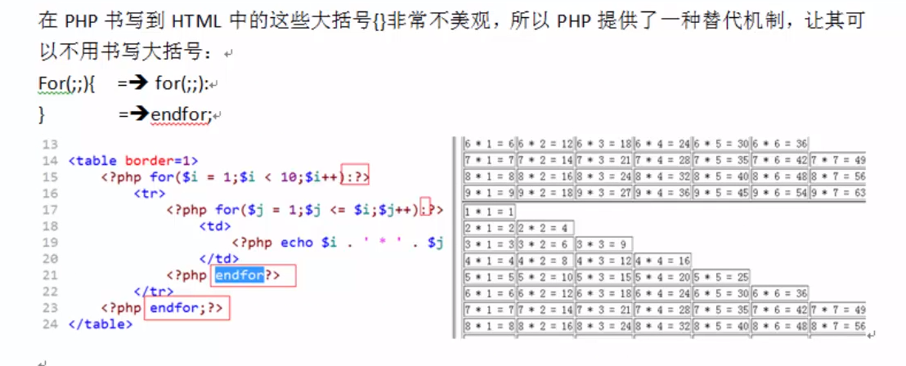
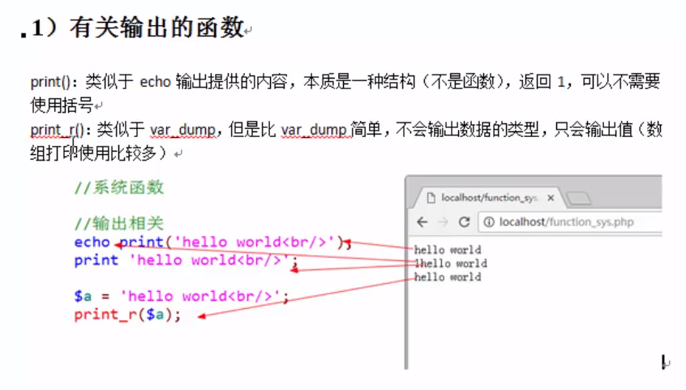

●php获取微信前端post请求json数据

\$postData = file_get_contents("php://input");  
\$data = json_decode(\$postData, true);

第二个参数表示json自动转换为数组

if、switch、while等大括号也可以类似的替代。

●**常用系统函数**

<https://www.bilibili.com/video/av12863134/?p=54> 其他的见这里

●**文件包含**

require

和include几乎完全一样，除了处理失败的方式不同之外，require在出错时候产生E_COMPILE_ERROR级别的错误，即导致脚本终止，而include只产生警告E_WARNING，脚本会继续执行

include

require_once

include_once 只包含一次（相同的文件只加载一次，用于多重包含时）

●**预定义变量**

提前定义的变量，系统定义的变量，存储许多需要用到的数据（都是数组），也被称为超级全局变量

\$_GET：获取所有表单以get方式提交的数据

\$_POST：POST提交的数据都会保存于此

\$_REQUEST：GET和POST提交的都会保存于此，合并了两个数组，但如果GET、POST重名，则POST会覆盖GET（PHP数组元素下标具有唯一性）（可在php.ini进行配置）

\$GLOBALS：PHP中所有的全局变量，数组下标为变量名。每个全局变量都会自动被存储到 此数组中

\$_SERVER：服务器信息

\$_SESSION：session会话数据

服务端session的操作

使用session前一定要session_start()启动session

储存session：\$_SESSION["name"]="King";//数组操作

销毁session：unset(\$_SESSION["name"]);//销毁一个

session_destroy()和unset(\$_SESSION);//销毁所有的session

\$_COOKIE：cookie会话数据

浏览器cookie的操作

设置cookie:setcookie(name, value, expire, path, domain);

获取cookie：\$_COOKIE["user"];

删除cookie：setcookie("user", "", time()-3600);//设置过期时间

\$_ENV：获取服务器端环境变量的数组

\$_FILES：获取用户上传的文件信息

●**可变变量**

如果一个变量保存的值恰好是另一个变量的名字，那么可以直接通过访问这个变量得到另一个变量的值，只需在变量前多加一个\$符号

\$a=’b’;

\$b=’hello’;

则\$\$a=’hello’;

**●引用传递**

\$a = &\$b;//取地址符号&

**●常量**

定义形式：

① 使用定义常量的函数：define(‘常量名’,常量值)；

② (5.3之后才有) const 常量名 = 值；

常量名不需要用\$，通常以大写字母为主

若用特殊符号也可以定义，需要用define，但是这样定义之不能直接访问，要用constant(“常量名”)。

两种方法在于访问权限有区别

常量不区分大小写。但是define函数有第三个参数拥有大小写敏感的设置。

**●系统常量**

系统帮助用户定义的常量，用户可以直接使用

PHP_VERSION

PHP_INT_SIZE

PHP_INT_MAX

在PHP中还有一些特殊的常量，他们有双下划线开始+常量名+双下划线结束，这种常量称之为系统魔术常量：其值通常会跟着环境变化，用户无法修改。

\__DIR_\_ 当前被执行的脚本所在电脑的绝对路径

\__FILE_\_ 当前被执行的脚本所在电脑的绝对路径（带自己文件名字）

\__LINE_\_ 当前所属行数

\__NAMESPACE_\_ 当前所属命名空间

\__CLASS_\_ 当前所属的类

\__METHOD_\_ 当前所属的方法

\__FUNCTION_\_ 常量返回该函数被定义时的名字

**●数据类型**

PHP是一种弱类型语言，变量本身没有数据类型

有八种数据类型

简单（基本数据类型）：4小类

整型 int/integer

浮点型 float/double

字符串型 string

布尔类型 bool/boolean

复合数据类型：2个小类

对象类型：object,存放对象

数组类型：array

特殊数据类型：2个小类

资源类型：resource，存放资源数据（PHP外部数据，如数据库、文件）

空类型：NULL

**●类型转换**

有两种类型转换方式

1.自动转换：系统根据需求自己判定，自己转换

2.强制（手动）转换

其他类型转布尔类型：

empty（）函数：判断数据值是否为空（不是NULL，是字符串为空或0之类），若是返回true，反之false

isset（）函数：用来判断变量是否声明，即是否存在，存在为true，反之false。（※var \$x也只能算未定义）

其他类型转数值类型：

① bool：true=1 false=0

② 字符串转数值类型

以字母开头的字符串，永远为零

以数字开头的字符串，取到碰到字符为止（不会同时包含两个小数点）

强制转换：

在变量之前增加括号，在其中写上对应类型

**●类型判断**

通过一组类型判断函数，来判断变量，最终返回这个变量所保存数据的数据类型。是一组以is_开头后面跟类型名字的函数，返回值为布尔类型，用于确定获取的数据是否**安全**。

※布尔类型不能用echo来查看，可以使用var_dump结构查看

该函数用于打印显示，一个变量的内容与结构，以及类型的信息。

var_dump(变量1，变量2…)

还有一组函数可以用来获取以及设定数据（变量）的类型

Gettype(变量名)，获取类型，得到的是该类型对应的字符串

Settype(变量名) 设定数据类型，与强制转换不同

※强制转换，是对数据值复制的内容进行处理，不会处理实际存储的内容。（即一种临时转换）而settype会真正改变，值和强制转换一样。

**●运算符**

基本与C++/java等语言类似

特殊：

①比较运算符

=== ：全等于，左边与右边相同，大小以及数据的类型都要相同。

!== ：不全等于，只要大小或类型不同则为true

②连接运算符：

. （一个点）：将两个字符串连接在一起

.= ：复合运算，将左边的内容与右边的内容连接起来，然后重新赋值给左边的变量，类似于+=、-=

③错误抑制符

在php中有一些错误可以提前预知，但这些错误可能无法避免，但是又不希望报错给用户看。

@：在可能出错的表达式前使用@符号即可（若是分散的表达式要用括号括起来）

通常在生产环境（上线）会用到

**●文件加载路径**

绝对路径 略

相对路径

. 或 ./ ：表示当前文件夹 一般可以不用，例如include就默认当前文件夹本身

../ ：上级目录

绝对路径和相对路径的加载区别：

绝对路径相对效率偏低，但安全。

文件嵌套包含时，最容易出现相对路径出错的问题

**●函数**

function 函数名(参数)

先编译后执行，所以函数定义可以放在后面

return也可以在文件中直接使用（不在函数里面），代表文件将return的内容转交给包含当前文件的位置（通常在系统配置文件中使用较多），在文件中也代表不再执行后面的内容。此时include等函数返回值即return的内容。

函数作用域

全局变量：这与C等语言不同，它不能被函数直接访问。

局部变量：函数里等定义的变量。

超全局变量：系统定义的变量，在函数内外都可以被访问（预定义变量：\$_SERVER、\$_POST等）

要让函数内部能够访问全局变量，可以通过超全局变量 \$GLOBALS访问

另外一种方法是用global关键字

global \$变量名；//注意不可以赋值，只能声明。若是在函数体内，则去寻找全局变量是否拥有同名变量，若有直接引用。若无则重新创建。

●静态变量

函数内可以用static 关键字。与其他语言类似。略。

●可变函数

当前有一个变量所保存的值刚好是一个函数的名字，那么就可以使用变量+（）来充当函数使用。

\$变量 = ‘display’；

function display(){}

//则可以这样使用

\$变量();

因此可以实现回调函数

●匿名函数

基本函语法：

\$变量 = function() {

//函数体

}; //注意有分号

变量保存匿名函数，本质得到的是一个对象（closure）

闭包… 暂时用不上 用上再了解吧。

●错误

可人为触发错误提示

triger_error();

73P

**●数组**

●常用函数

imlode(数组, ‘分隔符’)

**●表单传值**

方式：

●GET传值

①form表单

\<form method = ‘GET’\>表单元素\</form\>

②a标签

\<a href=”www.xx.cn/index.php?data=xx”\>

③location对象的href属性

\<script\>location.href=”www.xx.cn/index.php?data=xx”\</script\>

④location 对象的assign方法

\<script\>location.assign(”www.xx.cn/index.php?data=xx”)\</script\>

●POST传值

①基本设定

\<form method=”POST”\>表单元素\</from\>

与GET的区别：

接收：

\$_GET、\$_POST、\$_REQUEST三种方式，其都是超全局变量，预定义数组，且其表单元素的”name“属性的值作为数组的下标，而value属性对应的值就是数组的元素值

细节：

如果没有选复选框，后端没有接收到数组，则引用会导致出错，得用isset()判断是否存在（可利用三目运算符）。
