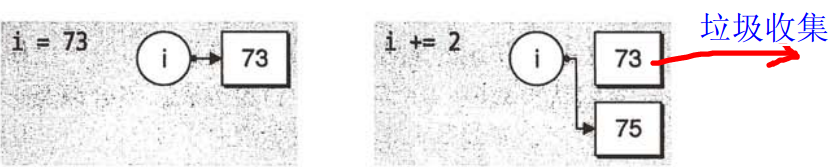
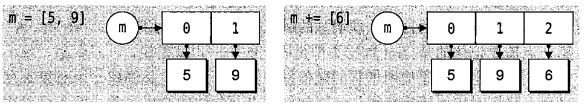
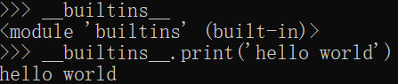

目录

[从1到Python](#从1到python)

[语法规则](#语法规则)

[规范](#规范)

[\*语法糖（syntactic sugar）](#语法糖syntactic-sugar)

[变量](#变量)

[可变对象（mutable）与不可变对象（immutable）](#可变对象mutable与不可变对象immutable)

[作用域（Scope）和命名空间（Namespace）](#作用域scope和命名空间namespace)

[\*内置变量/魔法属性](#内置变量魔法属性)

[\*使用环境变量](#使用环境变量)

[函数](#函数)

[函数标注](#函数标注)

[/ and \* in formal parameter](#-and--in-formal-parameter)

[（arguments）\*args和（keyword arguements）\*\*kwargs](#argumentsargs和keyword-arguementskwargs)

[匿名函数（anonymous function）](#匿名函数anonymous-function)

[\*内置函数（Built-in Functions）/魔法方法（dunder/magic methods）](#内置函数built-in-functions魔法方法dundermagic-methods)

[\*高阶函数](#高阶函数)

[\*\*装饰器（Decorators）@](#装饰器decorators)

[\*\*生成器（Generator）](#_Toc135232499)

[流程控制](#流程控制)

[条件](#条件)

[循环](#循环)

[异常处理](#异常处理)

[逻辑运算](#逻辑运算)

[比较](#比较)

[数据类型](#数据类型)

[数字（Numbers）](#数字numbers)

[布尔值](#布尔值)

[空值（None）](#空值none)

[字符串（String）](#字符串string)

[列表（List）](#列表list)

[矩阵（Numpy.Array）](#矩阵numpyarray)

[元组（Tuple）](#元组tuple)

[字典（Dictionary）](#字典dictionary)

[集合（Set）](#集合set)

[类（Class）](#类class)

[常用函数](#常用函数)

[数学类](#数学类)

[字符串类](#字符串类)

[类型](#类型)

[数据结构](#数据结构)

[文件和目录访问](#文件和目录访问)

[模块（Module）与包（Package）](#模块module与包package)

[import用法](#import用法)

[相对导入（Relative Imports）与绝对导入（Absolute imports）](#相对导入relative-imports与绝对导入absolute-imports)

[环境搭建](#环境搭建)

[Pip](#pip)

[VSCode](#vscode)

[配置](#配置)

[Python2转Python3的坑](#python2转python3的坑)

本书基于python3，需要有一定英语基础、掌握一门编程语言（该书偶尔使用C\#做类比）

参考文献：

[Learn Python in Y Minutes](https://learnxinyminutes.com/docs/python/)

[Python 3.85 documentation](https://docs.python.org/3/)等

# 从1到Python

Python 是一种解释型(使用解释器比如CPython等而不是编译器)语言： 这意味着开发过程中没有了编译这个环节。类似于PHP和Perl语言。

Python 是交互式语言： 这意味着，您可以在一个 Python 提示符 \>\>\> 后直接执行代码。

Python 是面向对象语言: 这意味着Python支持面向对象的风格或代码封装在对象的编程技术。

Python是动态语言：是弱类型，类型不像静态语言是强类型，类型在编译时就已经确定。这样的好处是开发快，但后期维护体验不佳。另外静态语言的设计模式思想在python语言中不太适用，比如就没有接口、抽象类等类型，就不说依赖注入控制反转了，因为python足够灵活了（（

## 语法规则

### 规范

缩进在python中是有语法意义的，PEP8规范要求4个空格为语句块缩进（并不是tab键，使用tab键会导致缩进不一致错误IndentationError: unexpected indent v.缩进）（但一般IDE都会将tab键换为4个空格）。语句没有;结尾，代码块不是用花括号而是:开头加上缩进

PEP (Python Enhancement Proposal)是官方约定的代码风格规范，一般使用IDE都会按照此规范进行编写。挑选一些常用规范：

①模块（即.py文件）、变量、函数和属性应该使用小写字母来拼写，如果有多个单词就使用下划线_进行连接。

②类和异常的命名，应该每个单词首字母大写。

③用单下划线(_)开头表示模块变量或函数是protected的(使用import \* from时不会包含)

④用双下划线(__)开头的实例变量或方法表示类内私有，即private，所以没有下划线的可以类比为public

#### 注释

单行注释

\# Single line comments start with a number symbol.

多行注释

""" Multiline strings can be written

using three "s, and are often used

as documentation.

"""

**文档字符串**

文档字符串是包, 模块, 类或函数里的第一个语句. 这些字符串可以通过对象的__doc__成员被自动提取, 并且被pydoc所用

类似C\#中的xml注释

1.  def function(a,b):
2.  """一句简单描述函数作用.
3.  
4.  Retrieves rows pertaining to the given keys from the Table instance
5.  represented by big_table. Silly things may happen if
6.  other_silly_variable is not None.
7.  
8.  Args: （列出每个参数的名字, 并在名字后使用一个冒号和一个空格, 分隔对该参数的描述）
9.  a: 描述a
10. b: 描述b
11. 
12. Returns: (或者 Yields: 用于生成器)
13. 描述返回值的类型和语义. 如果函数返回None, 这一部分可以省略
14. 
15. Raises:
16. 列出与接口有关的所有异常
17. """
18. pass

### \*语法糖（syntactic sugar）

标\*号的可以暂时跳过，一般暂时看不懂

个人感觉已经掌握过一些编程语言的人学新语言除了学习完基本定义的写法之外就是理解并运用语法糖了。

#### 列表推导式（list comprehension）

又叫列表解析式、列表生成式

语法：

out_express（return的关于item的表达式） for item(可进行解包) in Iterable(可迭代对象) if out_express_condition（关于item的条件表达式，true会被选出）

字典或集合对象（要看out_express单个类型） = {list comprehension}

列表对象 = [list comprehension]

[\*生成器](#生成器generator) = (list comprehension)

内部都是由out_express组成的结果

其中if是可选的。

比如将input_dict字典中的value和key互换：

1.  changed = {value: key for key, value in input_dict.items()}

##### 可以进行断行增强阅读

Python允许在中括号、花括号之间断行，另外列表推导式可以带嵌套循环的推导式，比如下面是将矩阵拉直为一维数组：

1.  flattened = [
2.  i
3.  for row in matrix
4.  for i in row
5.  ]

#### with

是一个上下文管理器，它主要的特点就是帮助我们自动管理上下文的衔接。即在需要的时候传给我们，不需要的时候自动关闭上下文对象。

类似C\#中的using，但要注意的是其后的对象必须实现__enter__和__exit__这2个魔法属性

with open("１.txt") as file:

data = file.read()

即open该函数返回了一个File对象，块内成功进入前调用__enter__，块结束后调用其对象的__exit__。

#### 其他

另外还有一些语法糖已经包含在其他章节里了，比如列表切片操作、循环中的else、解包列表、动态参数（\*args与\*kwargs）等等。

## 变量

注意python其实并无引用类型和值类型的区分，python中的变量类似于引用，所以变量无类型限制，这与强类型语言不同。python的变量就像是对一个对象的引用，同一个对象能够有多个引用。Python treats variables as mere labels (names) for values (objects). Python没有明确到底如何实现这种变量与对象的关系，它只描述了一系列变量能做到的功能。每个Python解释器比如CPython对于这种特性的实现不同，比如CPython是这样实现的：Memory management in Python involves a private heap containing all Python objects and data structures. 所有对象都存在堆中。

变量不需要提前声明，也不存在类型声明。直接赋值然后使用。访问没有赋值过的变量会抛出NameError异常

### 可变对象（mutable）与不可变对象（immutable）

是否是可变对象关键在于对象本身能否被修改。不可变对象如int自身，比如1这个对象，它自身无法被修改，a = 1只是引用上了1这个对象，python规定无法改变这个1对象本身的值，a = 2只是创建（可变对象若缓存中存在则直接引用不创建）新的2这个对象然后引用2。



可变对象规定可以对原有变量本身进行修改，比如list



不可变对象可以作为字典dict的键key，而可变对象不行。

不可变对象类型有：int、float、decimal、complex、bool、str、tuple、range、frozenset、bytes

可变对象类型有：list、dict、set、bytearray、user-defined classes (unless specifically made immutable)

可变对象与不可变对象在函数参数传递中也是，前者不会改变自身，而后者会。

### 作用域（Scope）和命名空间（Namespace）

#### 命名空间

提供了一种从名称到对象的映射，主要是通过字典来实现的。

python中一共有三种命名空间：局部（local namespace 即函数中定义的名称）、全局（global namespace 模块中定义的名称，包括类、常量、函数等等）、内置（build-in namespace内置函数等）

可以使用locals()（获取当前作用域的命名空间，如果在全局作用域中调用则获取全局命名空间，如果在函数作用域中调用则获取函数命名空间），globals()函数来获取当前命名空间的值（返回的是字典）

#### 作用域

可以理解为变量所起作用的范围，超出范围则某变量不能被使用

定义在函数外部的变量是全局域的（global），属于全局变量，将这个模块导入，其他在其他模块也能访问到。

函数内部的变量则是局部变量，局部变量外面无法访问到。如果想要在内部访问全局变量，可以直接访问，但是注意访问之后不能使用赋值语句，赋值语句会让它在整个局部块（因此先访问全局变量再赋值是会出错的），新建了一个新的名字和全局变量一样的局部变量，因此会导致前面访问的变量local variable referenced before assignment 错误（因为导致前面那个被访问的认为是访问的后面这个新键的局部变量）。另外如果全局变量是可变对象，使用全局变量的方法是可以修改全局变量的。

如果直接先赋值，新建一个和全局变量名字一样的局部变量是可以的，一旦赋值，这变量就和全局变量没有关系了。

如果要在局部域中进行赋值修改等操作，可以使用global关键字显式声明变量为在内部使用的全局变量，这时候就没有上面那么多幺蛾子了。

变量作用域查找规则：Local---\>Enclosing---\>Global---\>Build-in（内置变量）

Enclosing这个是嵌套函数中出现的，因为相对于最内层函数而言，上层函数即不是全局变量也不是局部变量。nonlocal关键字就能去修改这个Enclosing变量，global关键字是去修改Global变量的。

### \*内置变量/魔法属性

| 变量名         | 应用     | 作用                                                                                                                                                                                                                                                                                                                                   |
|----------------|----------|----------------------------------------------------------------------------------------------------------------------------------------------------------------------------------------------------------------------------------------------------------------------------------------------------------------------------------------|
| \__name_\_     |          | python模块的入口文件的__name__变量会置为’__main__’，若是被其他py文件当作模块导入，__name__为模块名（即py文件名）                                                                                                                                                                                                                       |
| \__slots_\_    | 定义类时 | python是一门动态语言，可以在程序运行的过程中添加属性。如果我们想要限制实例的属性该怎么办？例如，只允许对Person实例添加name和age属性。Python允许在定义class的时候，定义⼀个特殊的 \__slots__变量，来限制该class实例能添加的属性 \__slots_\_ = ("name", "age") 注意，__slots__定义的属性仅对当前类实例起作用，对继承的子类是不起作用的。 |
| \__all_\_      | 模块内部 | 当import模块时，若要使用模块中的私有属性，如果模块中存在__all__这个变量，那么就按这个变量里的内容进行导入，没有包含的不导入。                                                                                                                                                                                                          |
| \__builtins_\_ |          | 存的是内建模块对象，不需要手动import，直接使用里面的函数。 dir(__builtins__)查看有哪些内置函数、变量、类等                                                                                                                                                                                                                             |

### \*使用环境变量

做python项目时时常会去使用环境变量，从环境变量中导入变量或获取值能让一些包获得很好的兼容性，做一些配置操作非常方便。

环境变量是对系统而言的，这些操作在os.environ模块中

os.environ[‘HTTPS_PROXY’] = “http:127.0.0.1:8888”

比如这样就设置了一个名为HTTPS_PROXY的环境变量。实际上原理是environ类里面有字典，运行之后会先自动加载系统的环境变量，这里设置的HTTPS_PROXY就类似于操作字典，存在的替换，不存在则添加。因此这个环境变量是临时的，并没有改变系统环境变量，可以做一些针对程序临时的运行配置

## 函数

1.  \# Use "def" to create new functions 参数y是带有默认值的参数
2.  def add(x, y = 10):
3.  print("x is {} and y is {}".format(x, y))
4.  return x + y \# Return values with a return statement 若是return不带参数则返回None
5.  
6.  \# Calling functions with parameters 注意函数与下一条语句规范要有一个空行，代表函数结束。
7.  add(5, 6) \# =\> prints out "x is 5 and y is 6" and returns 11
8.  
9.  \# Another way to call functions is with keyword arguments 使用关键字参数调用函数
10. add(y=6, x=5) \# Keyword arguments can arrive in any order.
11. 
12. \# You can define functions that take a variable number of
13. \# positional arguments
14. def varargs(\*args):
15. return args
16. 
17. varargs(1, 2, 3) \# =\> (1, 2, 3) 即这种带\*的可变参数函数（也叫不定长参数）得到args的是个参数内容的元组。在函数参数上的\*意思是包装为元组
18. 
19. \# You can define functions that take a variable number of
20. \# keyword arguments, as well
21. def keyword_args(\*\*kwargs):
22. return kwargs
23. 
24. \# Let's call it to see what happens
25. keyword_args(big="foot", loch="ness") \# =\> {"big": "foot", "loch": "ness"} 即这种带\*\*的关键字可变参数函数得到的kwargs得到的是参数名和参数内容的dict。在函数参数上的\*\*意思是包装为字典
26. 
27. \# 混用两者也可以，\*包装的是正常参数，\*\* 包装的是关键字参数
28. \# 当在调用这种函数时，\*与\*\*这两个操作又做相反的事情，\*是展开元组，\*\*是展开字典
29. args = (1, 2, 3, 4)
30. kwargs = {"a": 3, "b": 4}
31. all_the_args(\*args) \# equivalent to call all_the_args(1, 2, 3, 4)
32. all_the_args(\*\*kwargs) \# equivalent to call all_the_args(a=3, b=4)
33. all_the_args(\*args, \*\*kwargs) \# equivalent to call all_the_args(1, 2, 3, 4, a=3, b=4)
34. 
35. 
36. \# Returning multiple values 能够返回多个结果，组成一个元组返回
37. def function():
38. return 1,2,3 \# Return multiple values as a tuple without the parenthesis. (Note: parenthesis have been excluded but can be included)
39. 
40. 
41. \# Python has first class functions （头等函数，也叫一等公民，是编程语言支持的编程特性。支持头等函数的编程语言支持将函数当作参数传递。个人理解即可以把函数当作对象传递，赋值后的变量就像是函数的别名，能够直接像调用函数一样调用，比如C++中的函数指针、C\#中的委托调用等（区别在于C++、C\#都事先分别声明了指针、委托支持的类型））
42. def create_adder(x):
43. def adder(y):
44. return x + y
45. return adder
46. 
47. add_10 = create_adder(10)
48. add_10(3) \# =\> 13

### 函数标注

比如可以用于第三方工具检查语法错误、使得阅读性更好等

有时候会使用def foo() -\> int: 其中-\> int是标记返回函数注释，信息作为.__annotations__属性提供,__annotations__属性是字典。可以使用foo.__anotations__获取

形参标注的定义方式是在形参名称后加上冒号(:)，后面跟参数类型，提示需要传入这个类型的参数。

### / and \* in formal parameter


/前面的形参必须要用位置参数

\*后面的形参必须要用关键词参数

### （arguments）\*args和（keyword arguements）\*\*kwargs

具体用法在上面的代码中有体现，这里做总结

**在函数定义中**

\*args表示不确定要往函数中传入多少个参数。

\*\*kwargs表示不确定要往函数中传入多少个关键词参数

当函数普通参数赋值完后，剩下的参数若多余就会全部在args中包装为元组。关键字参数类似，多余的关键字参数被包装为字典存入kwargs

**在函数调用过程中**

\*a表示将a变量元组或列表展开传入参数

\*\*b表示将b变量字典展开为关键字形式传入参数

### 匿名函数（anonymous function）

使用lambda关键字定义匿名函数

1.  (lambda x: x \> 2)(3) \# =\> True
2.  (lambda x, y: x \*\* 2 + y \*\* 2)(2, 1) \# =\> 5
3.  \# 类比C\#中的lambda表达式写匿名函数：
4.  delegate bool func(int num);
5.  func a = (x) =\> x \> 2;
6.  
7.  
8.  \# There are built-in higher order functions （内置）高阶函数，即使用函数做参数的函数，比如下面的map(函数, 列表)，对列表做一遍函数操作，filter（Func\<T,bool\>，List\<T\>）//用C\#意会
9.  list(map(add_10, [1, 2, 3])) \# =\> [11, 12, 13]
10. list(filter(lambda x: x \> 5, [3, 4, 5, 6, 7])) \# =\> [6, 7]
11. 

### \*内置函数（Built-in Functions）/魔法方法（dunder/magic methods）

内置函数都是作为全局函数来使用的，不需要导入即可直接使用，也就是说解释器启动是就加载了内置函数的上下文，有些方法的算法直接内置在解释器中，可以直接调用；有些会去调用方法的参数相对应的魔法方法，大部分魔法方法的实现算法也内置在了解释器中；

<https://www.cnblogs.com/cwp-bg/p/9829205.html>

https://blog.csdn.net/L_zzwwen/article/details/93362318

[官方全部的内置函数](https://docs.python.org/3/library/functions.html#__import__)

| 函数名           | 对象                         | 调用的魔法方法               | 介绍                                                                                                                                                                                                                                                                                                                                                                                                                           |
|------------------|------------------------------|------------------------------|--------------------------------------------------------------------------------------------------------------------------------------------------------------------------------------------------------------------------------------------------------------------------------------------------------------------------------------------------------------------------------------------------------------------------------|
| iter()           | 实现Iterable接口的可迭代对象 | \__iter__()                  | 可以获得一个 类型名_iterator的Iterator对象 for循环内部事实上就是先调用iter()把Iterable变成Iterator                                                                                                                                                                                                                                                                                                                             |
| next()           | Iterator对象                 | \__next__()                  | next()进行顺序访问取数，每次取数都会向下进行迭代，直到末尾，继续next()会产生StopIteration异常，若在中途进行list(迭代器对象)相当于一次性取完剩下的放到list中                                                                                                                                                                                                                                                                    |
| 类()             | 一个类的实例对象             | 存在调用__init__()           | 当一个类的实例被创建的时候调用的初始化方法，在创建对象时默认调用。 \__init__()方法默认有一个参数名字为self，若是定义（就像重写）这个方法存在传入参数的时候，需要显式指明self。比如 \__init__(self, x, y)来定义，然后使用self.xxx = x等语句来给类添加属性。 不需要返回值。self参数实际上是__new__返回的实例                                                                                                                     |
| 类()             | 一个类的实例对象             | 存在调用__new__()            | 也是类在创建实例时调用的方法，它比__init \__调用的时间还早。 该方法至少要有一个参数cls，代表要实例化的类，此参数在实例化时由python解释器自动提供。必须要有返回值，返回实例化出来的实例，这点在自己实现__new__时要特别注意，可以return父类即super().__new__(cls)出来的实例，或者直接是object的__new__出来的实例。在Python3中每个类都默认继承的object父类。 可以重写该方法通过定义私有属性存储对象判断是否为None来实现单例模式。 |
| str() 或 print() | 任何对象                     | \__str__()                   | str()类似于C\#中的ToString()方法，str()返回的是字符串类型，print()是返回None，但会打印出来。__str__()的默认实现是返回该对象的类型和内存地址的消息 可以重写类的方法格式化字符串                                                                                                                                                                                                                                                 |
| del()            | 任何对象                     | 当对象引用为0时调用__del__() | del()是主动删除对象的引用，就是把一个对象的名字给去掉，但若当python解释器检测到对象没有名字了，即这个对象的实际引用个数为0时（使用sys模块的getrefcount()方法可以得到一个对象的引用个数），就会删除这个对象，此时就会相应的调用__del__()方法。另外程序执行完毕释放内存也会调用此方法                                                                                                                                            |

### \*高阶函数

高阶函数指的是能接收函数作为参数的函数，比如map

<https://www.cnblogs.com/cwp-bg/p/8859260.html>

### \*\*装饰器（Decorators）@

装饰器其实就是面向切面编程AOP、洋葱/管道模型的思想的python实现。在不改变原有功能代码的基础上，添加额外的功能，将一个函数前后加上一个逻辑，每次调用这个函数会走一遍前后新加上的逻辑，就像给函数装饰了一遍。

使用场景：比如很多操作都需要登陆授权，给每个操作都写一遍登陆授权过于繁琐，把这前后的逻辑抽离出来，组成一个装饰器（洋葱模型里就是给套一层皮，每次调用这个函数会先走一遍皮然后进到内部，然后执行内部方法，最后从皮走出）

@开头的就是装饰器

1.  from functools import wraps
2.  
3.  def a_new_decorator(a_func):
4.  @wraps(a_func)
5.  def wraped_function(\*args, \*\*kwargs):
6.  print("I am doing some boring work before executing a_func()")
7.  a_func(\*args, \*\*kwargs)
8.  print("I am doing some boring work after executing a_func()")
9.  return wraped_function
10. 
11. @a_new_decorator
12. def a_function ():
13. print("I am the function")

@a_new_decorator这个装饰器装饰了a_function()

那么当调用a_function()的时候

实际上调用的是a_new_decorator(a_function)，最后被包装的成了wraped_function()，然后才进行函数调用。

另外wraped_function()中的\*args, \*\*kwargs参数是为了保持被修饰的函数调用参数不变。

@wrap这个在functools包中的装饰器的作用能够让被装饰的函数的__name__和__doc__不被改变（不加这个的话被装饰的函数已经不是之前那个原始函数了，所以写的注释都会被替换掉）

加了@wrap的实际上wraped_function 先被包装，调用的是wraps(wraped_function, a_function)，wrap这个装饰器里面做的动作就是将原来被修饰的函数一些内置属性都赋值到了即将装饰的函数上。最后被装饰为wraped_function返回。

### \*\*生成器（Generator）

在Python中，一边循环一边计算的机制，称为生成器。

**诞生背景**

列表所有数据都在内存中，如果有海量数据的话将会非常耗内存。若仅仅需要访问前面几个元素，那后面绝大多数元素占用的空间都白白浪费了。

如果列表元素按照某种算法推算出来，那我们就可以在循环的过程中不断推算出后续的元素，这样就不必创建完整的list，从而节省大量的空间。

简单一句话：我又想要得到庞大的数据，又想让它占用空间少，那就用生成器！

#### 创建方式

①列表推导式使用()出来的即是生成式。

②如果一个函数中包含yield关键字，那么这个函数就不再是一个普通函数，而是一个generator。调用函数就是创建了一个生成器（generator）对象。

#### 原理

生成器(generator)能够迭代的关键是它有一个next()方法，工作原理就是通过重复调用next()方法，直到捕获一个异常。

yield相当于特殊的return，也是返回一个值，但不同的是它会记住这个返回的位置，下次迭代时，代码从yield的下一条语句开始执行。

生成器.send(自定义结果)方法与next(生成器)类似，都会进行一次迭代，但不同的是这一次迭代的返回结果不是 yield 结果 而是send传入的自定义结果

## 流程控制

### 条件

1.  a if 3 \> 2 else b \# 语法糖 如果3 \> 2为真返回a，否则返回b
2.  \#\# 一般用法
3.  if some_var \> 10:
4.  print("some_var is totally bigger than 10.")
5.  elif some_var \< 10: \# This elif clause is optional.
6.  print("some_var is smaller than 10.")
7.  else: \# This is optional too.
8.  print("some_var is indeed 10.")
9.  
10. if not x //判断x不为空,但None, False, 空字符串"", 0, 空列表[], 空字典{}, 空元组()也都会被判断为空(实际上是把x转换为bool类型后判断)
11. if x is None //推荐写法，仅判断它是否为空，原理是因为is是判断是否是同一个对象，显然None是单例的（可以用id(None)看）（？
12. if not x is None // (x is None)

### 循环

1.  \#\#\# 迭代操作 in [iterable] (即实现了Iterable接口的对象) 类似于C\#中的foreach(var a in list)
2.  for animal in ["dog", "cat", "mouse"]:
3.  \# You can use format() to interpolate formatted strings
4.  print("{} is a mammal".format(animal))
5.  
6.  \#\#\# 范围迭代 in range(number) 或range(始，终（不包括）[，步长(可以为负)])
7.  for i in range(4, 8, 2):
8.  print(i)
9.  
10. \#\#\# enumerate() 函数，用于将一个可遍历的数据对象(如列表、元组或字符串)组合为一个索引序列，每一个数据是元组：（数据下标，数据）
11. for i, value in enumerate(animals): \# 因此这里就像是解包动作i, value = (index, data)
12. print(i, value)
13. 
14. 
15. \#\#\# While loops go until a condition is no longer met.
16. x = 0
17. while x \< 4:
18. print(x)
19. x += 1 \# Shorthand for x = x + 1
20. 

continue、break无什么特别，与其他语言一样。

但是for和while中能和else连用（注意缩进一致），仅当循环全部执行完毕之后会到else语句块中执行（被break或return中断就不会执行）。

### 异常处理

pass关键字是表示空语句，是为了保持程序结构的完整性，pass不做任何事情，一般做占位用句

1.  \# Handle exceptions with a try/except block
2.  try:
3.  \# Use "raise" to raise an error
4.  raise IndexError("This is an index error")
5.  except IndexError as e:
6.  pass \# Pass is just a no-op（无操作）. Usually you would do recovery here.
7.  except (TypeError, NameError):
8.  pass \# Multiple exceptions can be handled together, if required.
9.  else: \# Optional clause to the try/except block. Must follow all except blocks
10. print("All good!") \# Runs only if the code in try raises no exceptions
11. finally: \# Execute under all circumstances
12. print("We can clean up resources here")
13. 
14. 
15. \# Instead of try/finally to cleanup resources you can use a with statement
16. with open("myfile.txt") as f: \# 类似于C\#中的using var f = File.Open(xxx)
17. for line in f:
18. print(line)

## 逻辑运算

与、或、非分别是and、or、not（都是小写）

in关键字可以判断某对象是否在某容器中（in关键字调用的是__contains__魔法方法，因此每个类型实现可能不同）

not in关键字可以判断是否不存在于容器中

### 比较

==、!=、\>=、\>等符号没什么特殊，注意结果是布尔值

比较特殊的是比较可以连起来

1 \< 2 \< 3 = True

##### ==与is的区别

== 只判断“值”是不是相等，而 is 则判断是否为同一个对象，也就是地址一致（使用id函数获取变量或值的地址）。

## 数据类型

### 数字（Numbers）

#### 计算

加减乘正常，唯独**除法**有些不同，会自动转换为浮点数

35/5 = 7.0

5/3 = 1.6666666666667

**整除**

返回商的整数部分（向下取整）

5//3 = 1

5.0//3.0 = 1.0

**幂**

返回x的y次幂

2\*\*4 = 16

注意多个幂运算是从右往左

2\*\*3\*\*2 = 512

**支持+=、\*\*=、//=等运算**

即a += b 为a = a + b，但两者在可变对象上有区别。

\+= 操作调用 \__iadd__方法，没有该方法时，再尝试调用__add__方法，不可变对象比如int没有__iadd__方法，所以两者效果一致。而 + 是直接调用__add__方法

\__iadd__方法直接在原对象a1上进行更新，而__add__方法会创建一个新的对象，原对象不修改。所以可变对象上的a += b与a = a + b 不同

a += b相当于a.__iadd__(b)

a = a + b相当于 a = a.__add__(b)

### 布尔值

True或False表示（注意大写），与、或、非分别是and、or、not（小写）

整数0为True，1为False，而且True和False实际上也就是1和0

甚至可以进行运算

True + True = 2

True \* 8 = 8

==运算将True和False当作1和0来比较

另外可以使用转换

bool(0) = False

bool(5) = True

bool(-5) = True

这些None，0，空字符串，空列表，空字典都会被认为是False，其他都是True

bool(0) \# =\> False

bool("") \# =\> False

bool([]) \# =\> False

bool({}) \# =\> False

bool(()) \# =\> False

### 空值（None）

None也是一个对象，最好使用is而不是==来判断对象是否为None，is是用来比较两个变量是否指向同一个对象。

### 字符串（String）

使用单双引号都可。

##### 字符串拼接

“hello” + “world” 或者不使用+号（变量不能不使用加号）也可以进行拼接

##### 字符串访问

"Hello world!"[0] = 'H' 能够像list一样使用下标进行访问。背后调用的是__getitem__(index)方法

##### 方法

len() 得到字符串长度

**格式化**

①f“Hello {变量等}” ：格式化字符串（python3.6+）（{}这操作类似于C\#中的\$”{xxx}”）

②"{} can be {}".format("strings", "interpolated") ：用.format来格式化字符串

③"{0} be nimble, {0} be quick, {0} jump over the {1}".format("Jack", "candle stick") ：可以重复参数以节省时间

④"{name} wants to eat {food}".format(name="Bob", food="lasagna")：可以用关键字

**输出**

print(“Hello world!”)：默认会输出换行，使用print(“xxx”, end=”!”)将默认的换行符替换为!

**输入**

a = input(“xxx:”) 从控制台获取值到a中

### 列表（List）

列表与numpy库中封装的array不同之处在于可以放入不同类型的对象，而array必须是相同类型

1.  li = [] \# 创建一个空列表
2.  li = [4,5,’6’] \# 能够存储不同的类型
3.  li.append(1) \# 放入1到list
4.  li.pop() \# 从list尾部删除
5.  li[0] \# 使用下标访问0号元素
6.  li[-1] \# 取出最后一个元素（倒数第一个，-2就是倒数第二个）
7.  li[999] \# 产生越界错误IndexError
8.  \#\#\#\#\#\#\#\#\#\#\# 切割语句：li[开始（包含）:结束（直到，**不包含**）:步长（-1为逆序）]
9.  li[1:] \# 取从下标1之后的全部
10. li[:2] \# 取从0直到2
11. li[:-1] \#取到倒数第二个
12. li[::2] \# 取0、0+2、0+2+2…的全部
13. li2 = li[:] \# 注意这个操作相当于是深克隆，li[:]这样切割出来的对象和li本身引用不一样
14. del li[1] \# 删除下标为1的元素
15. li.remove(2) \# 删除一次li中的元素2，不存在抛出异常
16. li.insert(1,2) \# 在下标1插入元素2
17. li.index(2) \# 找到元素2对应的index值，不存在抛出异常
18. li + other_li \# 列表拼接，两者对象没变
19. li.extend(other_li) \# 列表拼接，li变了。
20. 1 in li \# 判断1是否在列表li中
21. len(li) \# li的长度

li.append() append的是单个对象，而extend则是传入其他的同类列表，加入它。

### 矩阵（Numpy.Array）

list中的数据类不必相同的。

在list中的数据类型保存的是数据所存放的地址，简单的说就是指针，并非数据，这样保存一个list就太麻烦了，例如list1=[1,2,3,'a']需要4个指针和四个数据，增加了存储和消耗cpu。

Numpy中的array所存放的数据类型必须全部相同。

矩阵可以说是多维的数组。但注意，多维的数组和矩阵支持的写法还是不一样的：

x = [[1, 1, 4],

[1, 3, 2],

[5, 5, 4]]

x这里是普通的二维数组，使用方式如同上面的列表，不可以使用诸如x[:,]的方式。

但如果是矩阵如numpy中的（注意，Pandas里面的array又不同，不可以使用该方式）

array([[1, 1, 4],

[1, 3, 2],

[5, 5, 4]])

则有以下操作方式：

x[0,:] \# 取矩阵第一维中第一行的数据，即C\#中的x[0]。继续取第二维的所有元素，即[1,1,4]

x[:,0] \# 取矩阵第一维所有数据，继续取第二维仅第一个元素的数据，即[1,1,5]

实际和列表的切片是一样的，只是逗号两边是对某一维度的切片。

### 元组（Tuple）

相当于只读list，是不可变对象。list的操作大部分都能在Tuple中完成（除了那些修改本身的操作）

list用的是[],而元组用的是()

a = (1,2,3)

还可以省略括号

a = 1,2,3 也代表元组

#### 解包(unpack)

解包操作可以用在元组、list等结构上。

1.  a = 1,2,3
2.  b,c,d = a \# 则b、c、d分别为1、2、3
3.  b,c,d = 4,5,6 \# 则b、c、d分别为4、5、6
4.  (a,b,c) = 1,2,3 \# 则a、b、c分别为1、2、3
5.  a,b = b,a \# 交换变量a、b的值
6.  a,\*b,c,d = 1,2,3,4,5,6,7 \# a是1，c、d是6、7，剩下的[2,3,4,5]是b（只能有一个带\*组成list）

### 字典（Dictionary）

字典是key和value，key只能是不可变对象（immutable），因为要保证key能够转换成constant hash value去快速查找。value可以是任何类型。

1.  filled_dict = {"one": 1, "two": 2, 3: "3"}
2.  filled_dict[“one”] \# =\> 1 使用key来访问对应的value，访问不到有KeyError异常
3.  filled_dict.get(4) \# =\> None 这样访问可以避免KeyError异常
4.  filled_dict.setdefault(“5”, 5) \# 若不存在就插入dict中，但存在则不替换
5.  filled_dict[“5”] = 5 \# 这样是增加新键值对（存在则替换）
6.  filled_dict.update({“5”:5, 6:6}) \# 这样与上面类似，但可以同时增加或替换多个
7.  list(filled_dict.keys()) \# 将dict中的keys转换为list（另外还有values）（python3.7以下顺序是乱的，3.7以后顺序是正的）
8.  1 in filled_dict \# 检查1这个key是否在filled_dict中
9.  del filled_dict[“one”] \# 删除键值为”one”的元素
10. {“one”:2, \*\*filled_dict, 3:666} \# \*\*是将dict解包并添加到新创建的dict中去。注意顺序，这里不存在的将会创建新键值对，存在的会按照顺序被替换，比如”one”先被赋值为2，然后若filled_dict中存在”one”的就会替换掉这个2。

### 集合（Set）

set([iterable对象])函数创建一个无序不重复元素集，可进行关系测试，删除重复数据，还可以计算交集、差集、并集等。集合是用{}来表示的，但注意和字典不一样，不过和字典相似的是里面元素必须是不可变对象

所以set()这个函数也能进行去重

1.  a = set([1,2,2,2,3])
2.  b = {1,2,2,3} \# 这两者结果一样，是{1,2,3}
3.  b.add(4) \# 向集合中添加一个元素（重复则不做）
4.  a & b \# a与b两个set做交集（intersection）
5.  a \| b \# a与b做并集（union）
6.  a - b \# a与b的差集（difference），注意差集定义，b-a结果不一样
7.  a \^ b \# a与b的对等差分（symmetric difference），即(a \| b) - (a & b)，两者不一样的元素的集合
8.  a \>= b \# 判断a是否是b的超集（a是否包含b）
9.  a \<= b \# 判断a是否是b的子集
10. 1 in a \# 判断1是否在a中
11. a = b.copy() \# a深克隆b

创建一个空集合必须用 set() 而不是 { }，因为 { } 是用来创建一个空字典

## 类（Class）

注意里面的self和cls都是建议的习惯命名，分别指的是实例，和类本身，并没规定死名字，但必须存在这样一个参数。

其中self可以看作是this，然后估计是设计人员偷懒，a.Foo()，这样好实现，就相当于a这个实例调用Foo方法，即Foo(a)

1.  \# We use the "class" statement to create a class
2.  class Human:
3.  
4.  \# A class attribute. It is shared by all instances of this class 这里叫做类的属性，但其实是单例，类似C\#中类的静态成员
5.  species = "H. sapiens"
6.  
7.  \# Basic initializer, this is called when this class is instantiated.类比构造函数, 注意python只有一个“构造函数”，可以通过下面的类方法做到多个构造函数
8.  def \__init__(self, name):
9.  \# Assign the argument to the instance's name attribute 在__init__中定义类的实例属性，每个类不同,这就类似C\#中的public属性。
10. self.name = name
11. \# Initialize property protect属性，可以通过定义getter、setter等方法进行外部修改
12. self._age = 0
13. 
14. \# An instance method. All methods take "self" as the first argument 实例方法，通过实例来调用，必须要有一个self参数传递实例本身，执行实例方法时自动传值self了。
15. def say(self, msg):
16. print("{name}: {message}".format(name=self.name, message=msg))
17. 
18. \# A class method is shared among all instances 类方法，唯一一个，与下面staticmethod静态方法很相似，都是通过类名来调用，不过不同的是类方法必须有一个参数cls传递类本身，执行实例方法时自动传值cls了。另外它可以被继承，然后重写。
19. @classmethod
20. def get_species(cls):
21. return cls.species
22. 
23. \# A static method is called without a class or instance reference 静态方法，也是唯一一个，但不需要传递参数，就很像一个全局工具方法。
24. @staticmethod
25. def grunt():
26. return "\*grunt\*"
27. 

#### 

#### 继承（Inheritance）

python支持多重继承，这与许多语言不同，这会涉及到查找顺序（MRO）、重复调用（钻石继承）等问题。查找顺序是从左往右。

继承是在类定义的时候

class Iphone(Phone, Product):

这样就继承了两个类。

类方法的重写在python里面就是重新定义。

使用super()调用父类的方法

## 常用函数

| 函数名                                             | 作用                                                                     | 备注                                                                                                                                                                                                                                                                                                                                                                                                                                                                                                                                                                                                                                                                                                                    |
|----------------------------------------------------|--------------------------------------------------------------------------|-------------------------------------------------------------------------------------------------------------------------------------------------------------------------------------------------------------------------------------------------------------------------------------------------------------------------------------------------------------------------------------------------------------------------------------------------------------------------------------------------------------------------------------------------------------------------------------------------------------------------------------------------------------------------------------------------------------------------|
| 数学类                                             |                                                                          |                                                                                                                                                                                                                                                                                                                                                                                                                                                                                                                                                                                                                                                                                                                         |
| math.fabs                                          | 绝对值，只适用于float和integer类型，返回是float类型                      | math包                                                                                                                                                                                                                                                                                                                                                                                                                                                                                                                                                                                                                                                                                                                  |
| abs                                                | 返回是float和int类型, 也适用于复数                                       | 内置函数                                                                                                                                                                                                                                                                                                                                                                                                                                                                                                                                                                                                                                                                                                                |
|                                                    |                                                                          |                                                                                                                                                                                                                                                                                                                                                                                                                                                                                                                                                                                                                                                                                                                         |
|                                                    |                                                                          |                                                                                                                                                                                                                                                                                                                                                                                                                                                                                                                                                                                                                                                                                                                         |
| 输入输出                                           |                                                                          |                                                                                                                                                                                                                                                                                                                                                                                                                                                                                                                                                                                                                                                                                                                         |
| print                                              |                                                                          |                                                                                                                                                                                                                                                                                                                                                                                                                                                                                                                                                                                                                                                                                                                         |
| input                                              | 读取键盘输入                                                             | str = input("请输入：");                                                                                                                                                                                                                                                                                                                                                                                                                                                                                                                                                                                                                                                                                                |
| open(filename, mode)                               | open() 将会返回一个 file 对象                                            | filename：包含了你要访问的文件名称的字符串值。 mode：决定了打开文件的模式：只读，写入，追加等。所有可取值见如下的完全列表。这个参数是非强制的，默认文件访问模式为只读(r)。                                                                                                                                                                                                                                                                                                                                                                                                                                                                                                                                              |
|                                                    |                                                                          |                                                                                                                                                                                                                                                                                                                                                                                                                                                                                                                                                                                                                                                                                                                         |
|                                                    |                                                                          |                                                                                                                                                                                                                                                                                                                                                                                                                                                                                                                                                                                                                                                                                                                         |
|                                                    |                                                                          |                                                                                                                                                                                                                                                                                                                                                                                                                                                                                                                                                                                                                                                                                                                         |
| 字符串类                                           |                                                                          | 注意有些需要导入string包，有些是string类本身的方法                                                                                                                                                                                                                                                                                                                                                                                                                                                                                                                                                                                                                                                                      |
| string.isdigit()                                   | 如果 string 只包含数字则返回 True 否则返回 False.                        |                                                                                                                                                                                                                                                                                                                                                                                                                                                                                                                                                                                                                                                                                                                         |
| string.replace(str1, str2, num=string.count(str1)) | 把 string 中的 str1 替换成 str2,如果 num 指定，则替换不超过 num 次.      |                                                                                                                                                                                                                                                                                                                                                                                                                                                                                                                                                                                                                                                                                                                         |
| string.split(str="", num=string.count(str))        | 以 str 为分隔符切片 string，如果 num 有指定值，则仅分隔 num+1 个子字符串 |                                                                                                                                                                                                                                                                                                                                                                                                                                                                                                                                                                                                                                                                                                                         |
|                                                    |                                                                          |                                                                                                                                                                                                                                                                                                                                                                                                                                                                                                                                                                                                                                                                                                                         |
|                                                    |                                                                          |                                                                                                                                                                                                                                                                                                                                                                                                                                                                                                                                                                                                                                                                                                                         |
|                                                    |                                                                          |                                                                                                                                                                                                                                                                                                                                                                                                                                                                                                                                                                                                                                                                                                                         |
|                                                    |                                                                          |                                                                                                                                                                                                                                                                                                                                                                                                                                                                                                                                                                                                                                                                                                                         |
| 类型                                               |                                                                          |                                                                                                                                                                                                                                                                                                                                                                                                                                                                                                                                                                                                                                                                                                                         |
| isinstance(object, classinfo)                      | 判断一个对象是否是一个已知的类型或其子类                                 | object -- 实例对象。  classinfo -- 可以是直接或间接类名、基本类型或者由它们组成的元组。 isinstance() 会认为子类是一种父类类型，考虑继承关系。                                                                                                                                                                                                                                                                                                                                                                                                                                                                                                                                                                           |
| type()                                             | 判断一个对象是否是一个已知的类型，输出type类                             | 不会认为子类是一种父类类型，不考虑继承关系。                                                                                                                                                                                                                                                                                                                                                                                                                                                                                                                                                                                                                                                                            |
|                                                    |                                                                          |                                                                                                                                                                                                                                                                                                                                                                                                                                                                                                                                                                                                                                                                                                                         |
|                                                    |                                                                          |                                                                                                                                                                                                                                                                                                                                                                                                                                                                                                                                                                                                                                                                                                                         |
|                                                    |                                                                          |                                                                                                                                                                                                                                                                                                                                                                                                                                                                                                                                                                                                                                                                                                                         |
|                                                    |                                                                          |                                                                                                                                                                                                                                                                                                                                                                                                                                                                                                                                                                                                                                                                                                                         |
|                                                    |                                                                          |                                                                                                                                                                                                                                                                                                                                                                                                                                                                                                                                                                                                                                                                                                                         |
| 数据结构                                           |                                                                          |                                                                                                                                                                                                                                                                                                                                                                                                                                                                                                                                                                                                                                                                                                                         |
| Queue()                                            | 创建先进先出队列， 后进先出的是LifoQueue，优先级队列是PriorityQueue      | Queue包 Queue.Queue(maxsize=0) FIFO， 如果maxsize小于1就表示队列长度无限  Queue.LifoQueue(maxsize=0) LIFO， 如果maxsize小于1就表示队列长度无限 Queue.qsize() 返回队列的大小 Queue.empty() 如果队列为空，返回True,反之False Queue.full() 如果队列满了，返回True,反之False Queue.get([block[, timeout]]) 读队列，取出数据 ，没有数据将会等待timeout等待时间 Queue.put(item, [block[, timeout]]) 写队列，放入数据，timeout等待时间 Queue.queue.clear() 清空队列 class queue.PriorityQueue(maxsize=0) 存储数据时可设置优先级的队列，优先级设置数越小等级越高 Queue.get(timeout = 1)如果1秒后没取到数据就退出 Queue.get_nowait() 取数据，如果没数据抛queue.Empty异常 Queue.task_done()后续调用告诉队列，任务的处理是完整的。 |
|                                                    |                                                                          |                                                                                                                                                                                                                                                                                                                                                                                                                                                                                                                                                                                                                                                                                                                         |
|                                                    |                                                                          |                                                                                                                                                                                                                                                                                                                                                                                                                                                                                                                                                                                                                                                                                                                         |
| 文件和目录访问                                     |                                                                          | from pathlib import Path                                                                                                                                                                                                                                                                                                                                                                                                                                                                                                                                                                                                                                                                                                |
| p.iterdir()                                        | 迭代获取路径对象                                                         | p = Path('.')                                                                                                                                                                                                                                                                                                                                                                                                                                                                                                                                                                                                                                                                                                           |
| p.glob('\*.sql')                                   | 获取当前路径对象下所有sql类型文件                                        |                                                                                                                                                                                                                                                                                                                                                                                                                                                                                                                                                                                                                                                                                                                         |
| with q.open() as f: f.readline()                   | 打开该路径对象对应的文件，读取一行                                       |                                                                                                                                                                                                                                                                                                                                                                                                                                                                                                                                                                                                                                                                                                                         |
| file.open()                                        |                                                                          | mode=’a’的时候，不管seek()如何移动指针，最终file.write()还是追加到文件末尾。 想要追加到别的地方，需要读取到内存。 mode=’r+’ 打开一个文件用于读写。文件指针将会放在文件的开头。 w+ 打开一个文件用于读写。如果该文件已存在则打开文件，并从开头开始编辑，即原有内容会被删除。如果该文件不存在，创建新文件。 注意，打开的时候，内容已经被清空了。                                                                                                                                                                                                                                                                                                                                                                           |

## 模块（Module）与包（Package）

模块就是一个 Python 文件，以 .py 结尾，可以定义各种变量，函数，类。

包可以类比文件系统中的文件夹。它是模块组成的集合，一个有层次结构的Python文件目录，要求包中必须带有一个__init__.py文件（官方称这种带有__init__.py的包为Regular packages。When a regular package is imported, this \__init__.py file is implicitly executed）

It’s important to keep in mind that all packages are modules, but not all modules are packages. Or put another way, packages are just a special kind of module. Specifically, any module that contains a \__path_\_ attribute is considered a package. 实际上包就是特殊的模块，任何定义了__path__属性的模块也会被当作包。包中里面有子包、有模块。

除了内建模块__builtins__自动加载了，其他第三方模块需要使用import导入。

可以使用dir(模块对象)查看模块里的所有值

### import用法

import可以导入模块和包，只会导入一次。因为查找时首先检查 sys.modules (保存了之前import的类库的缓存），如果 import 的模块发生改动，需要通过 reload 函数重新加载

#### import [package_name.]module_name

import后直接接模块名

搜索顺序：

①搜索内置模块

搜索 sys.path 中的路径（通过运行代码import sys; print(sys.path)查看。sys.path 变量本质是一个列表，可以向path中添加模块所在的目录），但sys.path在初始化时，又会按照顺序添加路径：

②.py 所在文件的目录或当前目录

③环境变量PYTHONPATH 中的目录（类似环境变量 PATH，由用户定义，默认为空）

④pip 或 easy_install 安装的包

**原理**

import是调用了一个函数__import__()进行搜索，把搜索到的模块即module_name.py文件的全部内容加载到内存，return一个类型为module的模块对象。import这个语句还能赋值给当前模块的同名变量即module_name（同时兼具传入__import__()的模块名参数和被赋值return结果的变量的作用），可以用as重新指定模块对象名字。

内置模块对象：



CPython解释器在导入模块时，模块所在文件夹将自动生成一个对应的__pycache__\\module_name.cpython-xx(版本).pyc文件（.pyc 文件的执行速度不比 .py 快，但是加载速度更快）

另外官方还给了一个比内置import功能更强大的[importlib](https://docs.python.org/3/library/importlib.html#module-importlib)系统，能够动态导入以及可读性更强，不多研究了。

**循环导入（Circular imports）**

两个模块互相导入的时候，如果需要import的一个包里面import了自己，而且里面也用到了自己的函数或变量等，就会导致异常，因为自己还没加载完，先去加载import的那个了。除非按照一定逻辑导入（import并不是一定要写在开头，可以在函数内部等）（但不建议循环导入）

**覆盖导入（Shadowed imports）**

当创建的模块与标准库中的模块同名时，如果导入这个模块，就会出现覆盖导入，因为python解释器会比在标准库搜索前在当前文件夹搜索模块，搜索到之后不会再去导入，很容易出现错误。

#### from package_name import module_name

与上面类似，Python会在sys.path和运行文件目录这两个地方寻找包

#### import [package_name.]moudle_name as alias

有些module_name比较长，之后写它时较为麻烦，或者module_name会出现名字冲突，可以用as来给它改名，如import numpy as np。

#### from [package_name.[subpackage_name]]module_name import function_name, variable_name, class_name

使用逗号可以导入模块中的多个元素。

有时候导入的元素很多，可以使用反斜杠来换行，官方推荐使用括号。

1.  from Tkinter import Tk, Frame, Button, Entry, Canvas, Text, \\
2.  LEFT, DISABLED, NORMAL, RIDGE, END \# 反斜杠换行
3.  from Tkinter import (Tk, Frame, Button, Entry, Canvas, Text,
4.  LEFT, DISABLED, NORMAL, RIDGE, END) \# 括号换行（推荐）

但使用from import，如果模块内和当前文件中有标识符命名重名，会引用命名冲突，当前文件中的内容会覆盖模块的数据。

from … import \* 是导入除了protected（用_开头的变量）的所有变量，但是如果那个模块定义了 [\__all_\_](#内置变量all)，那么会导入 \__all_\_ 中列出的东西

### 相对导入（Relative Imports）与绝对导入（Absolute imports）

一般来说，相对导入用在包里面，因为包里面的子包以及模块需要互相导入的时候，需要用到相对导入。Absolute imports may use either the import … or from … import … syntax, but relative imports may only use the second form; the reason for this is that:

举例包结构：

package/

\__init__.py

subpackage1/

\__init__.py

moduleX.py

moduleY.py

subpackage2/

\__init__.py

moduleZ.py

moduleA.py

1.  \# 比如moduleX.py文件的导入：
2.  from .moduleY import spam \# 导入当前目录的moduleY模块中的spam
3.  from .moduleY import spam as ham \# 改名
4.  from . import moduleY
5.  from ..subpackage1 import moduleY \# 导入上层目录的中的subpackage1包中的moduleY模块
6.  from ..subpackage2.moduleZ import eggs \# 导入上层目录中的subpackage2包中的moduleZ模块中的eggs
7.  from ..moduleA import foo

# 环境搭建

## pip

python的包是全局的，所以两个项目用不同版本的包或包之间有版本依赖则会产生冲突。

配置下载源

pip config set global.index-url <https://pypi.tuna.tsinghua.edu.cn/simple>

pip config set global.trusted-host pypi.tuna.tsinghua.edu.cn或ip地址

还原回默认源

pip config unset global.index-url

临时

pip install django -i <http://pypi.douban.com/simple>

导出所有包

pip freeze \> requirements.txt

删除所有包

pip uninstall -r requirements.txt -y

升/降级包

pip install --upgrade 包名==版本

指定python的pip

python3 -m pip list等

pip -V 查看当前pip版本以及指向的python版本

当python3的pip占用了python2的pip，python2的pip找不到了，可以去<https://bootstrap.pypa.io/pip/2.7/get-pip.py>

下载get-pip.py，然后使用python2 get-pip.py 进行安装。

最后使用alias pip2=/usr/bin/pip2.7之类的方式调整pip。

### requirements.txt

<https://pip.pypa.io/en/stable/reference/requirements-file-format/>

直接写包名，不限版本的意思

版本指示符是

<https://pip.pypa.io/en/stable/reference/requirement-specifiers/>

## VSCode

### 配置

#### 繁琐的语法检查，提示降级


#### 当前python文件输出编码

\# import sys

\# import io

\# sys.stdout=io.TextIOWrapper(sys.stdout.buffer,encoding='utf8')

#### 修改系统环境变量

PYTHONIOENCODING=UTF8

`setenv.bat`临时设置的这种环境变量，会识别空格，所以不要在结尾多加了空格。

```py
export PYTHONUTF8=1  # linux / macOS
set PYTHONUTF8=1  # windows
```

## Python2转Python3的坑

#### map变化

Python 2.x 返回列表。

Python 3.x 返回迭代器。需要使用list(map())转换为列表
