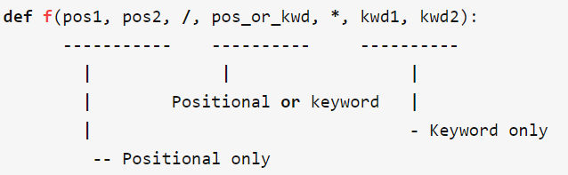

# 函数

```python
# Use "def" to create new functions 参数y是带有默认值的参数
def add(x, y = 10):
    print("x is {} and y is {}".format(x, y))
    return x + y # Return values with a return statement 若是return不带参数则返回None

# Calling functions with parameters 注意函数与下一条语句规范要有一个空行，代表函数结束。
add(5, 6) # => prints out "x is 5 and y is 6" and returns 11

# Another way to call functions is with keyword arguments 使用关键字参数调用函数
add(y=6, x=5) # Keyword arguments can arrive in any order.

# You can define functions that take a variable number of
# positional arguments
def varargs(*args):
    return args

varargs(1, 2, 3) # => (1, 2, 3) 即这种带*的可变参数函数（也叫不定长参数）得到args的是个参数内容的元组。在函数参数上的*意思是包装为元组

# You can define functions that take a variable number of
# keyword arguments, as well
def keyword_args(**kwargs):
    return kwargs

# Let's call it to see what happens
keyword_args(big="foot", loch="ness") # => {"big": "foot", "loch": "ness"} 即这种带**的关键字可变参数函数得到的kwargs得到的是参数名和参数内容的dict。在函数参数上的**意思是包装为字典

# 混用两者也可以，*包装的是正常参数，** 包装的是关键字参数
# 当在调用这种函数时，*与**这两个操作又做相反的事情，*是展开元组，**是展开字典
args = (1, 2, 3, 4)
kwargs = {"a": 3, "b": 4}
all_the_args(*args) # equivalent to call all_the_args(1, 2, 3, 4)
all_the_args(**kwargs) # equivalent to call all_the_args(a=3, b=4)
all_the_args(*args, **kwargs) # equivalent to call all_the_args(1, 2, 3, 4, a=3, b=4)


# Returning multiple values 能够返回多个结果，组成一个元组返回
def function():
    return 1,2,3 # Return multiple values as a tuple without the parenthesis. (Note: parenthesis have been excluded but can be included)


# Python has first class functions （头等函数，也叫一等公民，是编程语言支持的编程特性。支持头等函数的编程语言支持将函数当作参数传递。个人理解即可以把函数当作对象传递，赋值后的变量就像是函数的别名，能够直接像调用函数一样调用，比如C++中的函数指针、C#中的委托调用等（区别在于C++、C#都事先分别声明了指针、委托支持的类型））
def create_adder(x):
    def adder(y):
        return x + y
    return adder

add_10 = create_adder(10)
add_10(3) # => 13
```

## 函数标注

比如可以用于第三方工具检查语法错误、使得阅读性更好等

有时候会使用`def foo() -> int:` 其中`-> int`是标记返回函数注释，信息作为`.__annotations__`属性提供,`__annotations__`属性是字典。可以使用`foo.__anotations__`获取

形参标注的定义方式是在形参名称后加上冒号(`:`)，后面跟参数类型，提示需要传入这个类型的参数。

## / and * in formal parameter



`/`前面的形参必须要用位置参数

`*`后面的形参必须要用关键词参数

## （arguments）*args和（keyword arguements）**kwargs

具体用法在上面的代码中有体现，这里做总结

**在函数定义中**

`*args`表示不确定要往函数中传入多少个参数。

`**kwargs`表示不确定要往函数中传入多少个关键词参数

当函数普通参数赋值完后，剩下的参数若多余就会全部在`args`中包装为元组。关键字参数类似，多余的关键字参数被包装为字典存入`kwargs`

**在函数调用过程中**

`*a`表示将`a`变量元组或列表展开传入参数

`**b`表示将`b`变量字典展开为关键字形式传入参数

## 匿名函数（anonymous function）

使用`lambda`关键字定义匿名函数

```python
(lambda x: x > 2)(3) # => True
(lambda x, y: x ** 2 + y ** 2)(2, 1) # => 5
# 类比C#中的lambda表达式写匿名函数：
# delegate bool func(int num);
# func a = (x) => x > 2;


# There are built-in higher order functions （内置）高阶函数，即使用函数做参数的函数，比如下面的map(函数, 列表)，对列表做一遍函数操作，filter（Func<T,bool>，List<T>）//用C#意会
list(map(add_10, [1, 2, 3])) # => [11, 12, 13]
list(filter(lambda x: x > 5, [3, 4, 5, 6, 7])) # => [6, 7]
```

## *内置函数（Built-in Functions）/魔法方法（dunder/magic methods）

内置函数都是作为全局函数来使用的，不需要导入即可直接使用，也就是说解释器启动是就加载了内置函数的上下文，有些方法的算法直接内置在解释器中，可以直接调用；有些会去调用方法的参数相对应的魔法方法，大部分魔法方法的实现算法也内置在了解释器中；

[Python内置函数详解](https://www.cnblogs.com/cwp-bg/p/9829205.html)

[Python魔法方法详解](https://blog.csdn.net/L_zzwwen/article/details/93362318)

[Built-in Functions — Python 3 documentation](https://docs.python.org/3/library/functions.html#__import__)

| 函数名           | 对象                         | 调用的魔法方法               | 介绍                                                                                                                                                                                                                                                                                                                                                                                                                           |
|------------------|------------------------------|------------------------------|--------------------------------------------------------------------------------------------------------------------------------------------------------------------------------------------------------------------------------------------------------------------------------------------------------------------------------------------------------------------------------------------------------------------------------|
| `iter()`           | 实现`Iterable`接口的可迭代对象 | `__iter__()`                  | 可以获得一个 类型名`_iterator`的`Iterator`对象 `for`循环内部事实上就是先调用`iter()`把`Iterable`变成`Iterator`                                                                                                                                                                                                                                                                                                             |
| `next()`           | `Iterator`对象                 | `__next__()`                  | `next()`进行顺序访问取数，每次取数都会向下进行迭代，直到末尾，继续`next()`会产生`StopIteration`异常，若在中途进行`list(迭代器对象)`相当于一次性取完剩下的放到`list`中                                                                                                                                                                                                                                                                    |
| 类()             | 一个类的实例对象             | 存在调用`__init__()`           | 当一个类的实例被创建的时候调用的初始化方法，在创建对象时默认调用。 `__init__()`方法默认有一个参数名字为`self`，若是定义（就像重写）这个方法存在传入参数的时候，需要显式指明`self`。比如 `__init__(self, x, y)`来定义，然后使用`self.xxx = x`等语句来给类添加属性。 不需要返回值。`self`参数实际上是`__new__`返回的实例                                                                                                                     |
| 类()             | 一个类的实例对象             | 存在调用`__new__()`            | 也是类在创建实例时调用的方法，它比`__init__()`调用的时间还早。 该方法至少要有一个参数`cls`，代表要实例化的类，此参数在实例化时由`Python`解释器自动提供。必须要有返回值，返回实例化出来的实例，这点在自己实现`__new__`时要特别注意，可以`return`父类即`super().__new__(cls)`出来的实例，或者直接是`object`的`__new__`出来的实例。在`Python3`中每个类都默认继承的`object`父类。 可以重写该方法通过定义私有属性存储对象判断是否为`None`来实现单例模式。 |
| `str()` 或 `print()` | 任何对象                     | `__str__()`                   | `str()`类似于`C#`中的`ToString()`方法，`str()`返回的是字符串类型，`print()`是返回`None`，但会打印出来。`__str__()`的默认实现是返回该对象的类型和内存地址的消息 可以重写类的方法格式化字符串                                                                                                                                                                                                                                                 |
| `del()`            | 任何对象                     | 当对象引用为0时调用`__del__()` | `del()`是主动删除对象的引用，就是把一个对象的名字给去掉，但若当`Python`解释器检测到对象没有名字了，即这个对象的实际引用个数为0时（使用`sys`模块的`getrefcount()`方法可以得到一个对象的引用个数），就会删除这个对象，此时就会相应的调用`__del__()`方法。另外程序执行完毕释放内存也会调用此方法                                                                                                                                            |

## *高阶函数

高阶函数指的是能接收函数作为参数的函数，比如`map`

[Python高阶函数详解](https://www.cnblogs.com/cwp-bg/p/8859260.html)

## **装饰器（Decorators）@

装饰器其实就是面向切面编程`AOP`、洋葱/管道模型的思想的`Python`实现。在不改变原有功能代码的基础上，添加额外的功能，将一个函数前后加上一个逻辑，每次调用这个函数会走一遍前后新加上的逻辑，就像给函数装饰了一遍。

使用场景：比如很多操作都需要登陆授权，给每个操作都写一遍登陆授权过于繁琐，把这前后的逻辑抽离出来，组成一个装饰器（洋葱模型里就是给套一层皮，每次调用这个函数会先走一遍皮然后进到内部，然后执行内部方法，最后从皮走出）

`@`开头的就是装饰器

```python
from functools import wraps

def a_new_decorator(a_func):
    @wraps(a_func)
    def wraped_function(*args, **kwargs):
        print("I am doing some boring work before executing a_func()")
        a_func(*args, **kwargs)
        print("I am doing some boring work after executing a_func()")
    return wraped_function

@a_new_decorator
def a_function ():
    print("I am the function")
```

`@a_new_decorator`这个装饰器装饰了`a_function()`

那么当调用`a_function()`的时候

实际上调用的是`a_new_decorator(a_function)`，最后被包装的成了`wraped_function()`，然后才进行函数调用。

另外`wraped_function()`中的`*args, **kwargs`参数是为了保持被修饰的函数调用参数不变。

`@wrap`这个在`functools`包中的装饰器的作用能够让被装饰的函数的`__name__`和`__doc__`不被改变（不加这个的话被装饰的函数已经不是之前那个原始函数了，所以写的注释都会被替换掉）

加了`@wrap`的实际上`wraped_function` 先被包装，调用的是`wraps(wraped_function, a_function)`，`wrap`这个装饰器里面做的动作就是将原来被修饰的函数一些内置属性都赋值到了即将装饰的函数上。最后被装饰为`wraped_function`返回。

## **生成器（Generator）

在`Python`中，一边循环一边计算的机制，称为生成器。

**诞生背景**

列表所有数据都在内存中，如果有海量数据的话将会非常耗内存。若仅仅需要访问前面几个元素，那后面绝大多数元素占用的空间都白白浪费了。

如果列表元素按照某种算法推算出来，那我们就可以在循环的过程中不断推算出后续的元素，这样就不必创建完整的`list`，从而节省大量的空间。

简单一句话：我又想要得到庞大的数据，又想让它占用空间少，那就用生成器！

### 创建方式

1. 列表推导式使用`()`出来的即是生成式。

2. 如果一个函数中包含`yield`关键字，那么这个函数就不再是一个普通函数，而是一个`generator`。调用函数就是创建了一个生成器（`generator`）对象。

### 原理

生成器(`generator`)能够迭代的关键是它有一个`next()`方法，工作原理就是通过重复调用`next()`方法，直到捕获一个异常。

`yield`相当于特殊的`return`，也是返回一个值，但不同的是它会记住这个返回的位置，下次迭代时，代码从`yield`的下一条语句开始执行。

`生成器.send(自定义结果)`方法与`next(生成器)`类似，都会进行一次迭代，但不同的是这一次迭代的返回结果不是 `yield` 结果 而是`send`传入的自定义结果