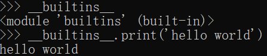

# 模块（Module）与包（Package）

模块就是一个 `Python` 文件，以 `.py` 结尾，可以定义各种变量，函数，类。

包可以类比文件系统中的文件夹。它是模块组成的集合，一个有层次结构的`Python`文件目录，要求包中必须带有一个`__init__.py`文件（官方称这种带有`__init__.py`的包为`Regular packages`。`When a regular package is imported, this __init__.py file is implicitly executed`）

`It's important to keep in mind that all packages are modules, but not all modules are packages. Or put another way, packages are just a special kind of module. Specifically, any module that contains a __path__ attribute is considered a package.` 实际上包就是特殊的模块，任何定义了`__path__`属性的模块也会被当作包。包中里面有子包、有模块。

除了内建模块`__builtins__`自动加载了，其他第三方模块需要使用`import`导入。

可以使用`dir(模块对象)`查看模块里的所有值

## import用法

`import`可以导入模块和包，只会导入一次。因为查找时首先检查 `sys.modules` (保存了之前`import`的类库的缓存），如果 `import` 的模块发生改动，需要通过 `reload` 函数重新加载

### import [package_name.]module_name

`import`后直接接模块名

搜索顺序：

1. 搜索内置模块

搜索 `sys.path` 中的路径（通过运行代码`import sys; print(sys.path)`查看。`sys.path` 变量本质是一个列表，可以向`path`中添加模块所在的目录），但`sys.path`在初始化时，又会按照顺序添加路径：

2. `.py` 所在文件的目录或当前目录

3. 环境变量`PYTHONPATH` 中的目录（类似环境变量 `PATH`，由用户定义，默认为空）

4. `pip` 或 `easy_install` 安装的包

**原理**

`import`是调用了一个函数`__import__()`进行搜索，把搜索到的模块即`module_name.py`文件的全部内容加载到内存，`return`一个类型为`module`的模块对象。`import`这个语句还能赋值给当前模块的同名变量即`module_name`（同时兼具传入`__import__()`的模块名参数和被赋值`return`结果的变量的作用），可以用`as`重新指定模块对象名字。

内置模块对象：



`CPython`解释器在导入模块时，模块所在文件夹将自动生成一个对应的`__pycache__\module_name.cpython-xx(版本).pyc`文件（`.pyc` 文件的执行速度不比 `.py` 快，但是加载速度更快）

另外官方还给了一个比内置`import`功能更强大的[importlib — The implementation of import | Python 3 documentation](https://docs.python.org/3/library/importlib.html#module-importlib)系统，能够动态导入以及可读性更强，不多研究了。

**循环导入（Circular imports）**

两个模块互相导入的时候，如果需要`import`的一个包里面`import`了自己，而且里面也用到了自己的函数或变量等，就会导致异常，因为自己还没加载完，先去加载`import`的那个了。除非按照一定逻辑导入（`import`并不是一定要写在开头，可以在函数内部等）（但不建议循环导入）

**覆盖导入（Shadowed imports）**

当创建的模块与标准库中的模块同名时，如果导入这个模块，就会出现覆盖导入，因为`Python`解释器会比在标准库搜索前在当前文件夹搜索模块，搜索到之后不会再去导入，很容易出现错误。

### from package_name import module_name

与上面类似，`Python`会在`sys.path`和运行文件目录这两个地方寻找包

### import [package_name.]moudle_name as alias

有些`module_name`比较长，之后写它时较为麻烦，或者`module_name`会出现名字冲突，可以用`as`来给它改名，如`import numpy as np`。

### from [package_name.[subpackage_name]]module_name import function_name, variable_name, class_name

使用逗号可以导入模块中的多个元素。

有时候导入的元素很多，可以使用反斜杠来换行，官方推荐使用括号。

```python
from Tkinter import Tk, Frame, Button, Entry, Canvas, Text, \
    LEFT, DISABLED, NORMAL, RIDGE, END # 反斜杠换行
from Tkinter import (Tk, Frame, Button, Entry, Canvas, Text,
    LEFT, DISABLED, NORMAL, RIDGE, END) # 括号换行（推荐）
```

但使用`from import`，如果模块内和当前文件中有标识符命名重名，会引用命名冲突，当前文件中的内容会覆盖模块的数据。

`from … import *` 是导入除了`protected`（用`_`开头的变量）的所有变量，但是如果那个模块定义了 [`__all__`](#内置变量all)，那么会导入 `__all__` 中列出的东西

## 相对导入（Relative Imports）与绝对导入（Absolute imports）

一般来说，相对导入用在包里面，因为包里面的子包以及模块需要互相导入的时候，需要用到相对导入。`Absolute imports may use either the import … or from … import … syntax, but relative imports may only use the second form; the reason for this is that:`

举例包结构：

```
package/
    __init__.py
    subpackage1/
        __init__.py
        moduleX.py
        moduleY.py
    subpackage2/
        __init__.py
        moduleZ.py
    moduleA.py
```

```python
# 比如moduleX.py文件的导入：
from .moduleY import spam # 导入当前目录的moduleY模块中的spam
from .moduleY import spam as ham # 改名
from . import moduleY
from ..subpackage1 import moduleY # 导入上层目录的中的subpackage1包中的moduleY模块
from ..subpackage2.moduleZ import eggs # 导入上层目录中的subpackage2包中的moduleZ模块中的eggs
from ..moduleA import foo 
```
