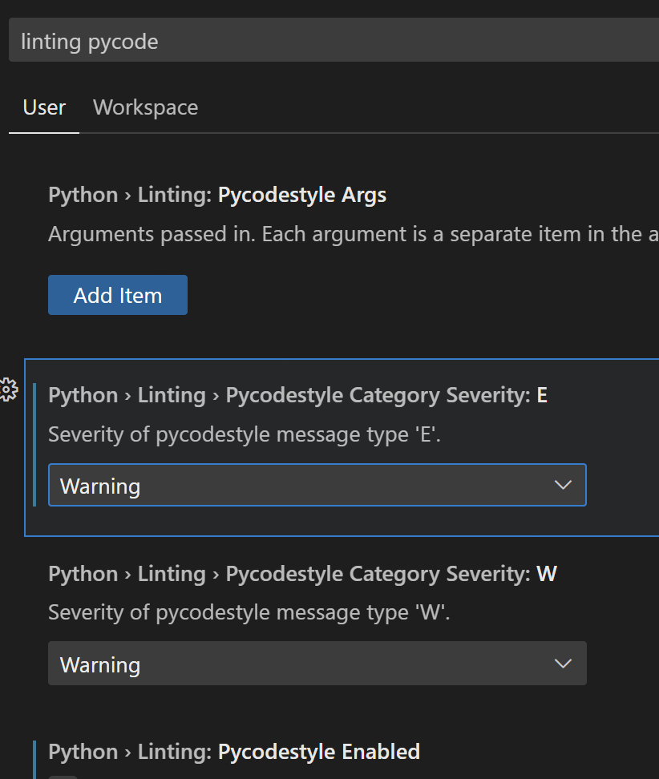

# 环境搭建

## pip

`Python`的包是全局的，所以两个项目用不同版本的包或包之间有版本依赖则会产生冲突。

### 配置下载源

```bash
pip config set global.index-url https://pypi.tuna.tsinghua.edu.cn/simple
```

```bash
pip config set global.trusted-host pypi.tuna.tsinghua.edu.cn
```
或`ip`地址

### 还原回默认源

```bash
pip config unset global.index-url
```

### 临时使用源

```bash
pip install django -i http://pypi.douban.com/simple
```

### 导出所有包

```bash
pip freeze > requirements.txt
```

### 删除所有包

```bash
pip uninstall -r requirements.txt -y
```

### 升/降级包

```bash
pip install --upgrade 包名==版本
```

### 指定python的pip

```bash
python3 -m pip list
```
等

```bash
pip -V
```
查看当前`pip`版本以及指向的`Python`版本

当`python3`的`pip`占用了`python2`的`pip`，`python2`的`pip`找不到了，可以去[get-pip.py for Python 2.7](https://bootstrap.pypa.io/pip/2.7/get-pip.py)

下载`get-pip.py`，然后使用`python2 get-pip.py`进行安装。

最后使用`alias pip2=/usr/bin/pip2.7`之类的方式调整`pip`。

### requirements.txt

[Requirements File Format - pip documentation](https://pip.pypa.io/en/stable/reference/requirements-file-format/)

直接写包名，不限版本的意思

版本指示符是

[Requirement Specifiers - pip documentation](https://pip.pypa.io/en/stable/reference/requirement-specifiers/)

## VSCode

### 配置

#### 繁琐的语法检查，提示降级



#### 当前python文件输出编码

```python
# import sys
# import io
# sys.stdout=io.TextIOWrapper(sys.stdout.buffer,encoding='utf8')
```

#### 修改系统环境变量

```bash
PYTHONIOENCODING=UTF8
```

`setenv.bat`临时设置的这种环境变量，会识别空格，所以不要在结尾多加了空格。

```bash
export PYTHONUTF8=1  # linux / macOS
set PYTHONUTF8=1  # windows
```

## Python2转Python3的坑

### map变化

`Python 2.x` 返回列表。

`Python 3.x` 返回迭代器。需要使用`list(map())`转换为列表 